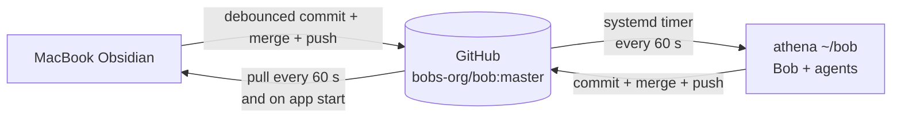

# GitHub as the Only Sync Transport for the Bob Obsidian Vault

- **Date:** 2026-08-27
- **Vault:** `~/bob/`
- **Remote:** private GitHub repository `bobs-org/bob`, default branch `master`
- **Goal:** replace Obsidian Sync with GitHub while keeping simultaneous MacBook and
  athena use as automatic, low-friction, and low-resource as Git permits

**Recommendation in one line:** use one automatic Git engine per machine—Obsidian Git
inside the Mac app and a new, conflict-safe `bob vault-sync` systemd job on athena—with
one-minute pulls, edit-debounced pushes, explicit merge-and-retry logic, and loud
fail-safe conflict reporting.

---

## Executive summary

This is feasible with the existing repository, but a simple “run `git pull` and `git
push` periodically” loop is not sufficient. Git is a snapshot exchange protocol, not a
live file-sync protocol. Even the Obsidian Git project explicitly says Git is suited to
asynchronous work rather than live work on the same note. Obsidian's own Git guide also
labels Git synchronization as manual unless another tool automates it
([Obsidian Help](https://obsidian.md/help/sync-notes),
[Obsidian Git documentation](https://publish.obsidian.md/git-doc/)).

For Bryan's usual case—both machines active, but mostly changing different notes or
different parts of a note—frequent small commits and three-way merges work well. Git
will automatically combine non-overlapping text edits. A true same-hunk edit, a
rename-versus-edit, or two different versions of the same binary still requires a human
decision. No Git wrapper can remove that fact without risking silent data loss or
malformed Markdown/YAML.

The current setup already contains most of the right pieces:

- a private GitHub vault repository;
- a carefully selective `.gitignore`;
- a shared `bob_sync.lock`;
- `bob bulk-git-commit`, which stages, commits, and pushes the vault; and
- a 30-second headless Obsidian Sync loop on athena.

The main functional gap is that `bob bulk-git-commit` does **not** fetch or integrate
remote Git commits before pushing. It is a backup publisher, not a two-way sync engine.
The recommended implementation is therefore an evolution of the existing Bob path,
not a separate general-purpose sync daemon.

The result will be close to frictionless for ordinary concurrent work, with an expected
propagation delay of roughly one to two minutes. It will not match Obsidian Sync's
continuous WebSocket transport or its purpose-built Markdown conflict algorithm.
Obsidian Sync uses `diff-match-patch` for Markdown and offers automatic merge or
conflict-copy modes; Git uses line-oriented three-way merging
([Obsidian conflict documentation](https://obsidian.md/help/sync/troubleshoot)).

## 1. What exists today

I inspected the actual repositories and runtime on athena on 2026-08-27. These are
observations, not generic estimates.

| Item | Observed state | Consequence |
| --- | --- | --- |
| GitHub repository | `bobs-org/bob` is **private**, branch `master` | Suitable as the only remote, subject to GitHub access controls rather than Obsidian Sync E2EE |
| Tracked files | 6,407 | Small enough for ordinary Git, but worth using status caches |
| Git object database | about 1.19 GiB; GitHub reports about 1,247,309 KiB | Fetches are incremental, but fresh clones and maintenance are nontrivial |
| Working checkout | about 1.5 GiB including `.git` | Acceptable on both computers, but not a tiny notes-only repository |
| Largest current file | `old_lib/books/adtech_book.pdf`, 90,752,104 bytes (about 86.5 MiB) | Already above GitHub's 50 MiB warning point and uncomfortably close to its 100 MiB rejection point |
| `.gitignore` | Allowlist for note/config/attachment types; ignores workspace state, Sync state, caches, trash, OS files, and custom plugins sourced elsewhere | Strong starting policy; little churn from machine-local state |
| `.gitattributes` | Absent | Correct for now; a blanket `merge=union` rule would be unsafe |
| Git remote | SSH (`git@github.com:bobs-org/bob.git`) | Reuse SSH agents; do not put a token in plugin settings or the vault |
| Git automation | Nightly `bob nightly` at 03:30; its final step stages, commits, and pushes | Far too infrequent for sync, and it cannot integrate concurrent remote commits |
| Obsidian transport | `ob-sync-bob.service` calls `ob sync` and sleeps 30 seconds | This is the service to retire after cutover |
| Current service cost | Snapshot: 16.8 MiB resident, 112.3 MiB peak, 3m09s CPU over about 79 minutes | Roughly 4% of one CPU over that sample; a sleeping systemd timer has no resident process |

The repository is above GitHub's “ideally less than 1 GB” guidance but far below its
stronger 5 GB caution. GitHub warns for objects over 50 MiB and rejects objects over
100 MiB
([GitHub large-file documentation](https://docs.github.com/en/repositories/working-with-files/managing-large-files/about-large-files-on-github)).
This is a reason to add a size guard, not a reason to block the migration.

### Current Bob behavior that must change

`bob bulk-git-commit` currently performs:

```text
git add -A .
git commit (when the index changed)
git push
```

There is no `fetch`, `pull`, `merge`, `rebase`, or rejected-push retry. If the MacBook
pushes first, athena's next push fails as non-fast-forward. `bob nightly` avoids this
today only because Obsidian Sync first makes the working files converge independently
of Git.

Once GitHub is the only transport, Bob must own a genuine two-way transaction.

## 2. The hard limit: Git is near-real-time, not live sync

The desired behavior has two separate latency paths:

1. **Local-to-GitHub:** detect a local edit, wait for typing to settle, commit, and
   push.
2. **GitHub-to-local:** discover that the other device pushed, fetch, and integrate.

The first path can be event-driven. The second cannot be event-driven on two ordinary
clients behind NAT unless GitHub webhooks and a reachable receiver are added. Polling
the remote is therefore the simplest reliable choice. One fetch per minute per active
machine is tiny relative to GitHub's documented repository limits, including its
recommended ceiling of 15 read operations per second per repository and six pushes per
minute
([GitHub repository limits](https://docs.github.com/en/repositories/creating-and-managing-repositories/repository-limits)).

The practical semantics are:

- edits to different files normally merge without intervention;
- edits to different lines of one Markdown file normally merge without intervention;
- edits to the same lines can conflict;
- JSON, Canvas, and other structured text can merge textually but still be semantically
  invalid;
- PDFs, images, audio, and video cannot be meaningfully merged; and
- case-only renames are hazardous across case-insensitive macOS and case-sensitive
  Linux filesystems.

Frequent syncing narrows the conflict window. It does not make simultaneous editing of
the same paragraph safe. Git's documented choices are fast-forward-only, rebase, or a
three-way merge; all can stop on a genuine conflict
([`git pull` documentation](https://git-scm.com/docs/git-pull)).

## 3. Options considered

| Approach | Mac experience | Headless athena | Resource profile | Concurrent-change safety | Verdict |
| --- | --- | --- | --- | --- | --- |
| Manual terminal/GitHub Desktop | Requires remembering pull/commit/push | Possible | Low while idle | Depends on user discipline | Too much friction |
| Obsidian Git on both devices | Excellent while desktop Obsidian is open | Does not cover headless changes | No extra Mac daemon | Good ordinary Git semantics | Incomplete |
| Generic Git auto-sync daemon on both | Invisible | Works | Usually one daemon or frequent process | Quality varies; error UX is weak | Adds a second tool and duplicates Bob logic |
| Timed shell script on both | Automatic | Works | No resident process | Can be made safe | Poorer Mac visibility and credentials/error UX |
| **Obsidian Git on Mac + Bob sync on athena** | **In-app status, commands, and errors** | **Native fit with current CLI/service model** | **Plugin exists only with Obsidian; systemd timer sleeps at zero RSS** | **One explicit algorithm and no competing engine per device** | **Best fit** |

The Obsidian Git plugin already supports automatic commit-and-sync on an interval or
after edits stop, plus source-control and history views
([feature documentation](https://publish.obsidian.md/git-doc/Features)). On macOS it
uses the installed Git and can reuse the Keychain or SSH agent
([installation](https://publish.obsidian.md/git-doc/Installation),
[authentication](https://publish.obsidian.md/git-doc/Authentication)). This gives the
Mac a much better failure surface than a silent LaunchAgent.

On athena, keeping desktop Obsidian open only to run the plugin would waste resources
and would not cover the established headless workflow. A Bob-native one-shot service is
the natural counterpart.

## 4. Recommended architecture



There must be exactly **one automatic Git engine per working copy**:

- **MacBook:** Obsidian Git only. Do not also run a LaunchAgent or cron Git loop against
  the same checkout.
- **athena:** `bob vault-sync` only. If desktop Obsidian and the Git plugin are ever
  installed here, use the plugin's device-local **Disable on this device** setting.
  The plugin documents that this setting is not synchronized
  ([Obsidian Git tips](https://publish.obsidian.md/git-doc/Tips-and-Tricks)).

### 4.1 MacBook settings

Install and enable the community plugin named **Git**, then configure:

- pull on Obsidian startup: **on**;
- automatic pull: **every 1 minute**;
- automatic commit-and-sync after edits stop: **1 minute**;
- periodic commit-and-sync fallback: **5 minutes**;
- pull and push as part of commit-and-sync: **both on**;
- pull strategy: **merge**, consistently with athena;
- notifications: routine success notices may be quiet, but errors and conflicts must
  remain visible;
- commit message: include `macbook` and a timestamp; and
- authentication: use the existing SSH remote and macOS SSH agent, not a token stored
  in `.obsidian/plugins/obsidian-git/data.json`.

The one-minute debounce avoids committing every keystroke while keeping the stale-edit
window short. The five-minute fallback catches changes from tools that do not trigger
the plugin's edit-idle path.

### 4.2 Athena service

Add a native `bob vault-sync` command and invoke it from a systemd **user timer** every
60 seconds. A timer starts a one-shot process and consumes no resident memory between
runs. Keep the existing lock name so nightly maintenance and an ordinary sync cannot
run together.

Also trigger an asynchronous sync after successful Bob commands that mutate the vault.
This gives local Bob captures near-immediate outbound delivery without a recursive file
watcher. The timer remains the fallback for agent edits, direct editor writes, remote
pulls, network recovery, and anything Bob does not know about.

`bob nightly` should become:

```text
vault-sync -> move-done-tasks -> vault-sync
```

The initial sync brings remote work in before maintenance; the final sync publishes the
maintenance edits. Remove its `ob sync` gate only after the Git-only cutover.

### 4.3 One sync transaction

Use explicit Git commands and check every state rather than hiding the policy inside a
bare `git pull`:

1. Acquire the shared local lock. If another run owns it, exit successfully.
2. Refuse to proceed if a merge, rebase, cherry-pick, or unresolved index is already in
   progress. Report the exact recovery command.
3. Stage all allowed paths and commit local changes, if any. This preserves local work
   before integration.
4. Fetch only the required branch: `git fetch --no-tags origin master`.
5. Merge `origin/master` with the normal three-way merge strategy. Fast-forward when
   possible; create a merge commit only when histories actually diverged.
6. Push `master` without force.
7. If the push is rejected because the other machine won the race, fetch, merge, and
   push again, with a small bounded retry count.
8. Record the last successful sync time and the local/remote commit IDs for a cheap
   health check.

Do **not** use `reset --hard`, `push --force`, `-X ours`, `-X theirs`, or a blanket
`*.md merge=union`. Each can discard or silently scramble legitimate note content.

I recommend merge rather than rebase here because auto-sync commits are durable
recovery points and the topology is not user-facing source history. Merge never rewrites
those snapshots, and subsequent merges remember the prior merge base. A few merge
commits during genuinely concurrent sessions are an acceptable cost for simpler
recovery. Both clients must use the same policy.

### 4.4 Conflict behavior

For a true conflict, the automatic path should:

1. capture a machine-readable diagnostic containing the paths and commit IDs;
2. abort the merge so Obsidian does not parse conflict markers in live notes;
3. leave both sides preserved as commits;
4. stop repeating noisy notifications until either side's commit changes; and
5. notify Bryan through the Mac plugin when it occurs there, or the normal athena/SASE
   notification path when it occurs here.

Resolution should be deliberate, followed by `bob vault-sync --continue` or an
ordinary retry. If observed conflicts become common, a second phase can add an
Obsidian-style “conflicted copy” resolver for Markdown. It should not be part of the
first release: YAML properties, task block IDs, and generated task sections make a
generic union deceptively risky.

Enable `merge.conflictStyle=zdiff3` for clearer manual conflicts and consider
`rerere.enabled=true` only after the basic system is proven. `rerere` can reuse a prior
resolution of the same textual conflict; it is an optimization, not a substitute for
review.

## 5. Resource and repository tuning

### Avoid an extra filesystem watcher

An event watcher can push local changes faster, but it cannot discover remote pushes.
The Mac plugin already observes Obsidian edits, and Bob can explicitly trigger syncs
after its own writes. A recursive watcher on both machines therefore adds complexity
without eliminating remote polling.

### Make repeated status checks cheap

Enable repository-local `core.untrackedCache=true` on both machines. On the Mac also
enable `core.fsmonitor=true`; Git's built-in filesystem monitor is supported on macOS
and lets commands such as `git status` avoid scanning unchanged files. Git documents
that the untracked cache plus FSMonitor is faster than the untracked cache alone
([`git status` performance notes](https://git-scm.com/docs/git-status.html),
[`core.fsmonitor`](https://git-scm.com/docs/git-config)). The built-in monitor is not
currently supported on Linux, so do not add Watchman to athena solely for this vault.

### Keep fetches and commits narrow

- Fetch only `master`, with no tags.
- Do not commit when the index is unchanged.
- Batch changes after idle time rather than on every save event.
- Do not run `git gc` during ordinary sync. Let Git's automatic heuristics handle it or
  schedule maintenance separately during an idle window.

### Guard large attachments

Add a preflight that:

- warns for any newly staged object over 50 MiB;
- refuses an object at or above 95 MiB, leaving margin below GitHub's 100 MiB limit;
  and
- reports the path and suggests an explicit decision.

Do **not** migrate the existing repository wholesale to Git LFS during the sync cutover.
That would rewrite or bifurcate history, require LFS on both clients, introduce quota
and pointer-file failure modes, and solve no immediate synchronization bug. The current
large `old_lib` objects are mostly static, so they increase clone/disk cost but not the
cost of a no-change fetch.

If the archive grows materially, handle that as a separate project: either stop adding
large binaries to the live vault repo, or migrate only an intentional attachment class
to LFS after testing both clients. Do not casually rewrite the current 1.19 GiB
history.

## 6. Vault policy and security

The current `.gitignore` is already aligned with the plugin's advice to exclude
workspace state, mobile workspace state, trash, and OS files
([Obsidian Git ignore guidance](https://publish.obsidian.md/git-doc/Tips-and-Tricks)).
Keep these ignored:

```gitignore
.obsidian/workspace.json
.obsidian/workspaces.json
.obsidian/workspace-mobile.json
.obsidian/cache/
.obsidian/metadata-cache/
.obsidian/logs/
.obsidian/sync.json
.obsidian/.sync.lock/
.trash/
.DS_Store
```

Continue tracking the selected Obsidian and plugin settings because Bob's headless
queries depend on some of them. Audit every newly tracked plugin `data.json` for tokens,
credentials, and machine-local absolute paths before allowing the sync engine to stage
it. Keep the repository private, enable two-factor authentication, and review the
organization's repository access list. GitHub notes that a private organization repo is
accessible to explicitly authorized users and organization owners
([GitHub repository visibility](https://docs.github.com/en/repositories/creating-and-managing-repositories/about-repositories)).

This is a privacy regression from an end-to-end-encrypted Obsidian Sync vault: GitHub
must be treated as a service entrusted with the repository plaintext. “Private” is
access control, not client-held end-to-end encryption.

Finally, sync is not backup. Keep Time Machine or another versioned local backup on the
Mac and a snapshot/backup mechanism on athena. Those do not violate “GitHub is the only
sync transport” because they do not replicate changes back into the live vault.
GitHub itself cautions that Git is not designed as a backup service
([GitHub large-file documentation](https://docs.github.com/en/repositories/working-with-files/managing-large-files/about-large-files-on-github)).

## 7. Safe migration runbook

Do not run Obsidian Sync and automatic Git sync against the same live vault beyond the
short, controlled cutover. Obsidian explicitly warns against mixing sync services on a
vault because it can cause conflicts or corruption
([Obsidian Help](https://obsidian.md/help/sync-notes)).

1. **Prepare and verify.** Update both machines with Obsidian Sync, wait until both say
   fully synced, stop vault-writing tools, and verify the same representative files on
   both.
2. **Create recovery points.** Take a local backup on each device and create a named Git
   tag or ordinary migration commit on the authoritative checkout. Push it.
3. **Reconcile Git manually.** Ensure both vault working copies are clean, on `master`,
   track `origin/master`, and resolve any pre-existing difference before automation.
4. **Install but do not overlap.** Configure Obsidian Git on the Mac and the new Bob
   command/timer on athena while both automatic jobs remain stopped.
5. **Turn off the old transport.** Disconnect/disable Obsidian Sync on the Mac and stop
   and disable `ob-sync-bob.service` on athena. Remove the `ob sync` dependency from
   nightly maintenance. Do not delete the Obsidian remote vault yet.
6. **Start Git automation.** Start the Mac plugin and athena timer, then run the tests
   below.
7. **Soak for one week.** Keep the old Obsidian remote disabled but recoverable. After a
   clean week, cancel the subscription/delete the remote vault if desired.

Rollback is the reverse: stop both Git automations first, select the authoritative
version, and only then reconnect Obsidian Sync. Never operate both automatic transports
while deciding which copy is authoritative.

## 8. Acceptance tests before calling it done

Use temporary notes and two test clones backed by a local bare repository for automated
tests; use the real vault only for final smoke tests.

- A Mac-only edit appears on athena within two minutes.
- An athena-only edit appears on the Mac within two minutes.
- Concurrent edits to different notes merge and arrive on both machines.
- Concurrent non-overlapping edits to one note merge and arrive on both machines.
- A same-line conflict preserves both commits, aborts cleanly, reports the exact note,
  and never force-pushes or silently chooses a side.
- A push race is retried without user intervention.
- Offline edits on both devices reconcile after reconnecting.
- Delete-versus-edit and rename-versus-edit cases stop safely.
- A binary changed differently on both devices stops safely.
- A 96 MiB new file is rejected locally before GitHub rejects the push.
- A no-change cycle creates no commit and leaves no process resident.
- Mac sleep/wake and athena service restart both resume syncing.
- `bob nightly` pulls before maintenance and pushes the resulting maintenance commit.

Instrument the first week with: last successful sync timestamp, local/remote commit
IDs, number of retries, duration, files committed, and conflict/error state. A simple
`bob vault-sync status` should make “are my notes current?” answerable without reading
journals or Git internals.

## 9. Sources

Primary documentation used for the load-bearing behavior and limits:

- [Obsidian: Sync your notes across devices](https://obsidian.md/help/sync-notes)
- [Obsidian: Sync conflict behavior](https://obsidian.md/help/sync/troubleshoot)
- [Obsidian Git: concepts and commit-and-sync](https://publish.obsidian.md/git-doc/)
- [Obsidian Git: automatic commit-and-sync](https://publish.obsidian.md/git-doc/Features)
- [Obsidian Git: installation](https://publish.obsidian.md/git-doc/Installation)
- [Obsidian Git: authentication](https://publish.obsidian.md/git-doc/Authentication)
- [Obsidian Git: ignore and per-device guidance](https://publish.obsidian.md/git-doc/Tips-and-Tricks)
- [Git: `git pull` and integration strategies](https://git-scm.com/docs/git-pull)
- [Git: status performance](https://git-scm.com/docs/git-status.html)
- [Git: `core.fsmonitor`](https://git-scm.com/docs/git-config)
- [GitHub: repository limits](https://docs.github.com/en/repositories/creating-and-managing-repositories/repository-limits)
- [GitHub: large-file limits](https://docs.github.com/en/repositories/working-with-files/managing-large-files/about-large-files-on-github)
- [GitHub: private repository visibility](https://docs.github.com/en/repositories/creating-and-managing-repositories/about-repositories)

Local evidence came from the opened `bobs-org/bob` checkout, the current `bob-cli`
implementation of `bulk-git-commit` and `nightly`, the installed
`ob-sync-bob.service`, and its live systemd resource counters on 2026-08-27.

## 10. Recommended solution

Implement a native `bob vault-sync` command as a tested two-way Git transaction, run it
on athena from a one-minute systemd user timer and immediately after Bob-owned vault
writes, and replace the Mac side with Obsidian Git configured for one-minute pulls and
one-minute edit-debounced commit-and-sync. Standardize both on merge, SSH, `master`, no
force operations, and fail-safe conflict notification. Preserve the current selective
`.gitignore`, add untracked-cache/FSMonitor performance settings and a 95 MiB attachment
guard, and defer any Git LFS or history rewrite to a separate project.

This hybrid is the best fit because it gives the Mac an in-app, low-friction experience,
keeps athena headless with no idle resident process, reuses Bob's existing locking and
Git code, and makes GitHub the sole transport without pretending Git can safely live-edit
the same paragraph on two machines.
