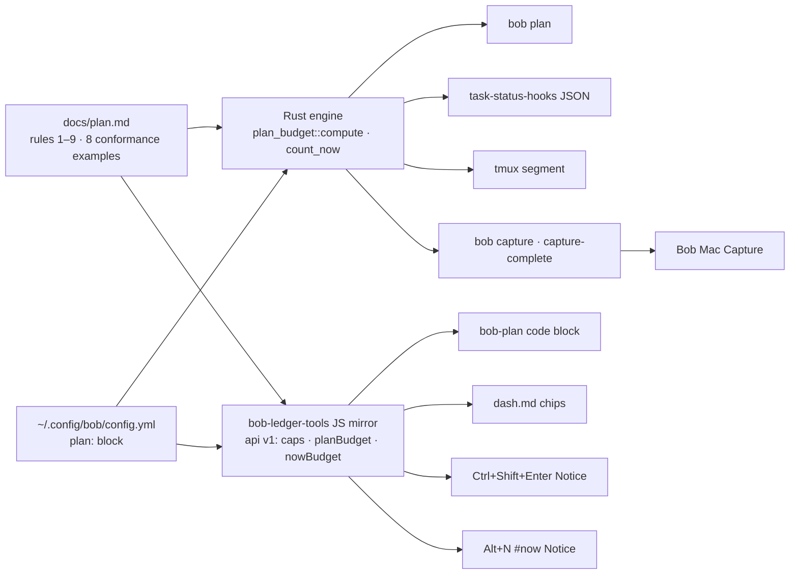

# `bob-cli-2o`: *Close the day, tag the week*

> **What shipped:** a shared **plan budget** for today (GTD plus at most 3 themes and about 10 Task Links) and a
> weekly **`#now`** tag. Both are shown with the same numbers on every surface Bryan already looks at. Four new
> gestures shrink the day without losing work.
>
> **Why:** the open half of `## Pomodoros` had become the capture inbox, the backlog, the status source and the
> plan all at once. A daily "migrate" chore kept refilling it.

|                |                                                                                                                                             |
| -------------- | ------------------------------------------------------------------------------------------------------------------------------------------- |
| **Epic**       | `bob-cli-2o`: 13 phases, closed `done` by the land agent in `25c1b2f`                                                                        |
| **Built**      | 2026-09-29, 18:10 → 23:28 EDT (about 5 h 20 m wall clock)                                                                                    |
| **Touched**    | bob-cli · bob-plugins (3 plugins) · Bob Mac Capture · the `~/bob` vault · chezmoi config                                                    |
| **Spec**       | `plan:202609/pomodoro_plan_budget_now_tag.md`. The authoritative rule text is now bob-cli's `docs/plan.md`                                  |
| **Motivation** | `research:202609/pomodoro_closed_day_now_tag_automation/pomodoro_closed_day_now_tag_automation.md` and its follow-up `…/now_tag_vs_in_progress_status.md` |

---

## TL;DR

- **One rule, one definition, eight surfaces.** `docs/plan.md` defines the budget. A Rust engine and a JavaScript
  mirror implement it, and both test against the same 8 conformance examples.
- **`#now` is a promise and `[/]` is a footprint.** The tag lets you drop a link from today without losing the
  task, and that breaks the "status-lock trap" that made everything stay linked.
- **The tools warn but never rewrite.** Nothing is pruned, deferred or migrated by cron, and yesterday's note is
  never written. Strict mode exists but is off.
- **The landing review caught real bugs.** It filed 11 bob-cli and 8 bob-plugins fix items (defects, spec drift,
  missing tests), including a config regression, and fixed them all before the epic closed.
- **Where things stand this morning:** the machinery is live, but **NOW is 0/15**. The human half of the rollout,
  tagging this week's bets, hasn't started yet.

---

## 1. Why: the problem in numbers

The motivating research mined 1,514 git revisions of daily notes. However long the list got, Bryan finished
**about 3 themes a day**:

| Period         | Open themes/day | Themes actually worked | Share worked | Peak open links |
| -------------- | :-------------: | :--------------------: | :----------: | :-------------: |
| Aug 26 – Sep 9 |       12        |         **3**          |     29%      |       19        |
| Sep 10 – 20    |       15        |         **3**          |     17%      |       42        |
| Sep 21 – 29    |       22        |         **3**          |     13%      |       63        |

Four mechanisms kept the pile growing:

1. **The copier defeated the decay.** `task-status-hooks` already resets unlinked Next tasks to Ready and decays
   stale `[/]`. But the daily *"Migrate unfinished Pomodoro tasks"* chore re-linked everything every morning. The
   result was about 50 `[/]` and 25 `[*]` tasks, roughly a 15-day queue by Little's Law.
2. **The status-lock trap.** Unlinking a task demoted it, and nothing else remembered that it mattered. So
   nothing got unlinked.
3. **No way to shrink the day.** Every `=x` close outcome except "complete" *carried* the link forward. And
   `Ctrl+Shift+P` couldn't act from a ledger link line.
4. **Capture was the main inflow.** 91% of queued links entered on the day they were created, via `@route:id` or
   `#NAME`. Nothing showed the cost at that moment.

The rollout's end-to-end check on the 2026-09-29 note is the "before" picture. This is abridged; I re-ran it
this morning and got the same numbers:

```text
bob plan · Tue 2026-09-29 · 2026/20260929.md

  PLAN  19/3 themes · 73/10 links        NOW  0/15

  ★ BOB · GOALS · SASE · DECKS · SASE · READ · MISC · FINAL · … · GATES · LATER (23 links)

  ⚠ SASE is open in more than one Pomodoro (lines 62 and 77)   duplicate_open_pomodoro_name
  ⚠ LATER is an inventory label, not a theme (line 123)        inventory_label_open
  ⚠ today's plan has 19/3 themes                               plan_theme_cap_exceeded

tmux:  #[reverse]plan 19/3 · 73/10#[noreverse] |
```

---

## 2. The rule, and the design principle

> **Today is closed:** GTD plus at most 3 themes. The first theme is the highlight. Nothing is copied forward by
> default.
> **This week is `#now`:** at most 15 tasks. Dropping a link from today never loses it, because `#now` keeps it
> in view.
> **Everything else is READY (next) or deferred with a P-level (later).**

**Principle: automate visibility and gestures, but never rewrite the plan.** The earlier report had prescribed
"habit first, tooling later". That failed, because the habit it relied on had already lapsed: the planning chore
was last done on 2026-09-09. The research leaned on behavioral evidence. Intentions move behavior only weakly,
while defaults and recorded self-monitoring move it more. So this epic puts the numbers where the choice happens:
at capture, in tmux, and in the note.

---

## 3. Architecture: one definition, many surfaces



Other plugins never re-implement the rules. They call `app.plugins.plugins["bob-ledger-tools"].api`.

<details>
<summary><b>The counting rules, in brief</b> (full text in <code>docs/plan.md</code>)</summary>

- **Ledger:** today's `## Pomodoros…` section, up to the next `## `. Fenced code is skipped.
- **Open entries only:** `[x]`, `[X]` and `[-]` entries are history.
- **Themes:** distinct non-exempt name components. `BOB + DECKS` is two components; `GTD` is exempt. An unnamed
  entry counts as a theme only if it holds links.
- **Links:** distinct `(target, ^id)` pairs under open, non-exempt entries. Struck links don't count.
  `[[#^x]]` and `[[2026/20260930#^x]]` are the same link.
- **Highlight (★)** is the first open non-exempt entry. **Running (▶)** is the timed one.
- **Status** is `over` when themes > 3 or links > 10. The NOW count never changes it.
- **Lints:** `plan_theme_cap_exceeded` · `plan_link_cap_exceeded` · `duplicate_open_pomodoro_name` ·
  `inventory_label_open` · `subheading_in_pomodoros` · `now_cap_exceeded`.
- **NOW:** tasks that are not done, carry `#now` as a whole token, and are not blocked, not `#hide`, not in
  `_templates` or `_conflicts`, and scheduled today or earlier. This is the dash's own query, so the chip, the
  section and `bob plan` always agree.

</details>

---

## 4. What shipped

### 4.1 Visibility: the same numbers everywhere

| Surface | What you see | Phase · commit |
| --- | --- | --- |
| **`bob plan`** (new) | Meters, a ★/▶ theme table, and lints with codes. `-f json` is available; an invalid config exits 2. | .1 · `db89ee8` |
| **`task-status-hooks`** | A `plan_budget` JSON block plus one line: `plan 3/3 themes · 7/10 links · NOW 12/15`. It is read-only and never changes the exit code. The multiple-open-timed error now names each entry and suggests `=x`. | .3 · `f481c7a` |
| **tmux** | `<status> · plan T/Tc · L/Lc \| `, in reverse video when over | .3 · `f481c7a` |
| **`bob capture`** | A before→after `plan_budget`, with warnings only when a capture *grows* an over-cap plan. Also shows where the link lands: `→ under GOALS (next up)`, `→ into running GOALS (0945-1015)` or `→ new Pomodoro BOB`. | .4 · `35b96b3` |
| **Bob Mac Capture** | Themes and Links capsules with a `+1 BOB` delta chip, a destination row, a red `4/3` badge on "create Pomodoro" rows, and a strict-refusal hint | .11 · `1e025ce` |
| **Daily note** (a `bob-plan` code block) | PLAN and NOW chips, the ★ theme line, and the lints. It re-renders live. | .7 · `ddc01ac`, .13 |
| **`dash.md`** | A purple NOW chip, a cyan PLAN chip (both red over the cap), and a `### NOW Tasks` section | .2, .13 (vault) |
| **Obsidian Notices** | `· plan 3/3 · 11/10 🔴` on Ctrl+Shift+Enter; `#now added · 1 task · NOW 13/15` on the toggle | .10 · `8557a63`, .9 |

### 4.2 Gestures: shrinking the day without losing work

| Gesture | What it does | Phase · commit |
| --- | --- | --- |
| **`=x…~K` drop** | The close grammar becomes `=x[<N>][!<M>][~<K>]`, which adds a fourth outcome (below) | .5 · `754d1f3`; Mac .12 · `b020df7` |
| **`#now` after the route** | `Fix it @sase^fix-it #now` now works: the tag moves before the fields. It gets a `now_tag` span and a completion, and the `^` picker lists Ready `#now` tasks. | .6 · `d28f8cd` |
| **`Alt+N` / the picker's `#now` row** | Toggles `#now` on task lines *and* Task Links, and takes a count (`N<Alt+N>`). It adds the tag to all targets if any target lacks it; otherwise it removes it from all. | .9 · `b68618f` |
| **Ctrl+Shift+P on a Task Link** | Edits the *linked* task in its own note; `N<Ctrl+Shift+P>` covers the next N sibling links. Setting a future date still prunes the link from today. | .8 · `e89f38f` |

The new close outcome fills the gap that made every close grow tomorrow:

| `=x` outcome | 🍅 in the closed entry | Carried forward | Task effect |
| --- | :-: | :-: | --- |
| in progress (`N`) | yes | yes | started `[/]` |
| deferred (unlisted) | removed | yes | none |
| complete (`!M`) | embedded | no | closed |
| **dropped (`~K`)** | **removed** | **no** | **none.** The next hooks run demotes Next → Ready, and `#now` keeps the task in view. |

### 4.3 Process and guardrails

- **`gtd_daily.md`:** three chores were cancelled ("Migrate unfinished…", "Review READY", "Review WIP + NEXT…").
  Two replace them: **"Pick today: ≤3 themes…"** (daily) and **"Weekly review: re-tag NOW to ≤15…"** (Mondays).
- **`_templates/daily.md`:** the `bob-plan` block sits *above* `## Pomodoros`, so no ledger parser ever sees it.
- **Config:** the chezmoi source now holds a `plan:` block with the defaults: `max_themes: 3`, `max_links: 10`,
  `max_now: 15`, `strict: false`, `exempt: [GTD]`, and
  `inventory_labels: [LATER, MISC, NEW FEATURES, SASE]`.
- **Strict mode (off by default):** it refuses a batch atomically only when the batch creates a *new, unstarted*
  named Pomodoro past the cap. Session starts (`=`, `#NAME=`) are never refused, because reactive blocks are
  legitimate.
- **Contracts stayed additive:** no existing JSON key, `schema_version` or exit code changed. The Mac app decodes
  every new field with `decodeIfPresent`, so it still works with an older `bob`.

**Capture intents.** You can express all four with the grammar you already know. Every warning's hint points
here:

| Intent | Type | Result |
| --- | --- | --- |
| Today | `Fix X @sase:fix-x` | A Next task plus a Task Link in today's ledger |
| This week | `Fix X @sase^fix-x #now` | A Ready task tagged `#now`; today is untouched |
| Backlog | `Fix X @sase^fix-x` | A Ready task |
| Later | `Fix X @sase^fix-x p:2` | Deferred 8–30 days; it resurfaces on its own |

---

## 5. Key design calls

| Decision | Why | Rejected |
| --- | --- | --- |
| **`#now` is a tag** | A parser test showed that a custom field at the end of a task line silently erases `priority` and `created` for Tasks. Tags are safe anywhere on the line; `#hide` is the precedent. | `[roadmap:: now]` and `[horizon::]` fields |
| **Next = READY, Later = P1–P4** | P-levels already are horizons, and they resurface on their own. Hand-kept horizon lists have died twice in this vault. | Explicit next/later tiers; a `roadmap.md` |
| **`#now` is never a Next source** | It would re-inflate NEXT | Keeping Next for roadmap-Now tasks |
| **Warn; refuse only a new theme, and only when opted in** | Feedback lands at the moment of choice, and reactive sessions stay legitimate | Breaking `@route:id`; silently diverting captures |
| **Read-only hooks, no cron edits** | Cron writes race unsaved buffers and multi-machine sync, and yesterday's note is documented as read-only | Hooks deleting leftovers; a managed callout block in the note |
| **A `bob-plan` block plus a JS API** | The vault's `.gitignore` ignores `.js` files outside `.obsidian/`, so a view file wouldn't sync to the other machines, and it would be a third copy of the rules | A `_meta/views/plan_budget.js` DataviewJS view |
| **No Obsidian Bases** | Bases rows are files, not tasks, and 60 of 80 queued links point into one note (`sase.md`) | A task-level `roadmap.base` |
| **Deferred to Phase 2** | Only worth building if the two-week trial shows friction | `stale_link`, `bob pomodoro stats`, move-with-link-repair, `#next`, pull-a-theme, a close-day command |

---

## 6. The landing review

Once all 13 phases had closed, the land agent re-checked every repo against the spec. It fixed the defects the
epic itself had introduced: bob-cli in `25c1b2f`, bob-plugins in `17fbc09`, the Mac README in `16f8a7e`, and
`dash.md`. The ones worth knowing about:

- **Config regression.** `plan:` was a typed field in `RawConfig`. A typo such as `max_themes: many` therefore
  broke `bob capture … p:N`, `bob randomize`, highlights and `bob gkeep`. The block is now stored untyped and
  validated only by the plan loader, and `config.rs` was split into `config/{mod,plan}.rs`.
- **Rule drift.**
  - An over-cap NOW set `status: over`, which violates rule 8.
  - `[[#^x]]` and `[[2026/20260930#^x]]` were counted as two links in **both** Rust and JS. The fix added
    conformance example 8.
- **Capture guards.**
  - `plan_budget` was attached whenever the daily note was staged, not only when the ledger changed.
  - The create-row preview counted `GTD` and components that were already open.
  - `#now` was offered as a completion where execution rejects it.
- **Rust/JS parity.** JS entry scanning, CRLF handling and the NOW predicate (`#hide/x`, case rules, NON_TASK
  statuses) now match Rust. An invalid config now falls back to the full default block, as it does in Rust.
- **Plugin polish.**
  - The block uses a proper `MarkdownRenderChild`.
  - It re-renders on the Tasks plugin's `cache-update` event instead of polling every 5 s.
  - Removing `#now` no longer collapses double spaces inside field values.

**Final gates:**

- bob-cli: `cargo test`, 1267 lib + 596 cli tests;
- bob-plugins: `npm test` 800/800 and `validate` 6/6;
- Bob Mac Capture: macOS CI green on `b020df7`.

The only clippy error left is a pre-existing deny that epic `bob-cli-28` owns.

---

## 7. Where it stands (2026-09-30, about 06:00 EDT)

| Check | Now |
| --- | --- |
| Today's note | ✅ Created from the template with the `bob-plan` block; GTD only, so `PLAN 0/3 · 0/10` |
| NOW | ⚠️ **0/15.** No task carries `#now` yet; only `dash.md` mentions the tag. |
| Config | ✅ The `plan:` block is deployed to `~/.config/bob/config.yml` with the defaults |
| New `gtd_daily` chores | ⚠️ Both still show `[?]` (Blocked). The land plan flagged this for you to confirm. |
| Follow-ups | `bob-cli-2q`: the host clock is UTC, so `bob`'s day flips at 20:00 EDT. The clippy deny at `pomodoro_name.rs:808` belongs to `bob-cli-28`. `capture_complete.rs` is about 3.8k lines. |

**Your part of the rollout.** The tools can't do these steps for you:

1. Add `#now` to **at most 15** tasks for this week, using `Alt+N`, the Ctrl+Shift+P `#now` row, or by typing it
   before the fields.
2. Carry **at most 3** open entries forward by hand; leave the rest where they are.
3. Keep GTD plus at most 3 themes, with the highlight first.
4. On the MacBook and athena: reinstall `bob`, rebuild Bob Mac Capture, and run `bob plugins sync`.

**Two-week trial (2026-09-30 → 2026-10-13).**

| Signal | Before | Target |
| --- | :-: | :-: |
| Peak open themes (excluding GTD) | 21 | ≤ 3 |
| Peak open Task Links | 74–75 | ≤ ~10 |
| Share of planned themes worked | 13% | ≥ 70% |
| `[/]` + `[*]` vault-wide | ≈ 75 | ≤ ~15 |
| NOW after each weekly review | — | ≤ 15 |

**Decision rules:**

- If the plan is red **because of capture**, set `plan.strict: true`.
- If it is red **because of carry**, use `~K` drops.
- If NOW is ignored, delete the tag and keep only the capped ledger. That minimal variant still captures most of
  the gain.

---

## Sources

- **Epic and phase beads:** `sase bead read bob-cli-2o` and `bob-cli-2o.1`–`.13`, including their closing notes
  and the end-to-end output from the rollout.
- **Plans:**
  - `plan:202609/pomodoro_plan_budget_now_tag.md` (the epic spec);
  - `plan:202609/plan_budget_land_closeout.md` (the landing review).
- **Research:**
  - `research:202609/pomodoro_closed_day_now_tag_automation/pomodoro_closed_day_now_tag_automation.md`;
  - `research:202609/now_tag_vs_in_progress_status.md`.
- **Commits:**
  - bob-cli: `db89ee8` `f481c7a` `35b96b3` `754d1f3` `d28f8cd` `25c1b2f` (docs refresh: `cd355e6`);
  - bob-plugins: `e89f38f` `ddc01ac` `8557a63` `b68618f` `17fbc09`;
  - Bob Mac Capture: `1e025ce` `68f90a0` `559024f` `b020df7` `16f8a7e`.
- **Code and docs:** bob-cli `docs/plan.md` ("Surfaces", "Conformance examples"), `src/native/capture/budget.rs`,
  and `src/native/capture/output.rs`.
- **Live checks this morning:**
  - `bob plan`, run for today and with `BOB_DAY_FILE` set to the 2026-09-29 note;
  - `bob tmux-pomodoro`;
  - `~/.config/bob/config.yml`;
  - `~/bob/gtd_daily.md`;
  - `~/bob/_templates/daily.md`.
