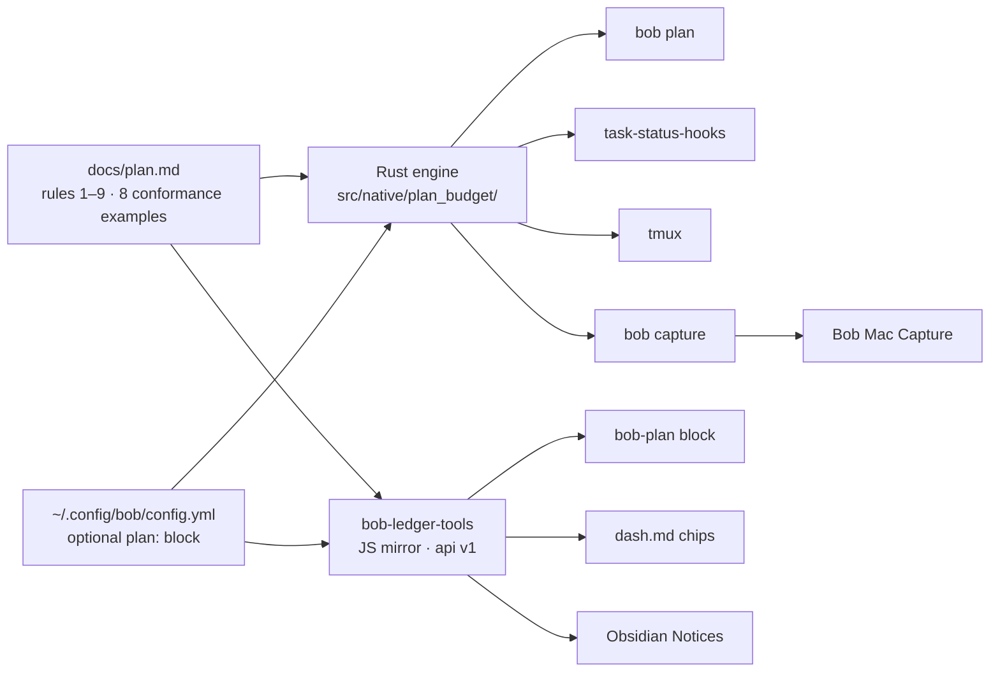

# Close the day, tag the week

*What epic `bob-cli-2o` built, why it was built, and what it deliberately leaves to Bryan*

|                |                                                                                                                  |
| -------------- | ---------------------------------------------------------------------------------------------------------------- |
| **Epic**       | `bob-cli-2o`: *plan budget, `#now`, and ledger guardrails*. 13/13 phases closed `done`.                           |
| **Built**      | 2026-09-29, 18:10 → 23:28 EDT: about **5 h 20 m** from bead creation to the closeout commit `25c1b2f`             |
| **Touched**    | bob-cli · bob-plugins (3 plugins) · Bob Mac Capture · the `~/bob` vault · chezmoi config                          |
| **Spec**       | `plan:202609/pomodoro_plan_budget_now_tag.md`, then `plan:202609/plan_budget_land_closeout.md` for the landing review. `docs/plan.md` is now the authoritative rule text. |
| **Motivation** | `research:202609/pomodoro_closed_day_now_tag_automation/…automation.md` and `research:202609/now_tag_vs_in_progress_status.md` |

> **In one sentence:** the epic turned the open half of `## Pomodoros` back into a small, honest plan for
> today, and gave weekly commitments their own `#now` marker. It shows the same numbers on every surface
> Bryan already looks at, and it never lets automation choose or erase work.

---

## TL;DR

- **The problem.** One list was doing four jobs: capture inbox, backlog, status source, and today's plan.
  The list kept growing while Bryan's real throughput stayed at **about 3 themes a day**.
- **The rule.** Today is GTD plus **≤ 3 themes** (about **10 Task Links**). This week is **≤ 15 `#now`**
  tasks. Everything else is READY (next) or deferred with a P-level (later).
- **One definition, eight surfaces.** `docs/plan.md` defines the budget. A Rust engine and a JavaScript
  mirror implement it and test against the same **8** conformance examples. Every other surface calls one
  of those two.
- **`[/]` is a footprint; `#now` is a promise.** Dropping a link from today no longer means forgetting the
  task. That breaks the *status-lock trap* that kept everything linked.
- **Warn, don't rewrite.** Nothing is pruned or migrated by cron, and yesterday's note is never written.
  Strict refusal exists, but it is off by default.
- **Where it stands.** Everything is live on apollo. **NOW is 0/15**: the human half of the rollout,
  tagging this week's bets, hasn't started yet.

---

## 1. Why it was built

The completed half of the ledger was fine: an honest, low-friction record of time. The **open** half was the
problem. The motivating research mined 1,514 git revisions of daily notes:

| Period         | Open themes/day | Themes actually worked | Share worked | Peak open links |
| -------------- | :-------------: | :--------------------: | :----------: | :-------------: |
| Aug 26 – Sep 9 |       12        |         **3**          |     29%      |       19        |
| Sep 10 – 20    |       15        |         **3**          |     17%      |       42        |
| Sep 21 – 29    |       22        |         **3**          |     13%      |       63        |

Four mechanisms kept the pile growing:

1. **The copier defeated the decay.** `task-status-hooks` already demotes unlinked Next tasks and decays stale
   `[/]`. But the daily *"Migrate unfinished Pomodoro tasks"* chore re-linked everything every morning. The
   result was about 50 `[/]` and 25 `[*]` tasks, roughly a 15-day queue by Little's Law.
2. **The status-lock trap.** Unlinking a task demoted it, and nothing else remembered that it mattered this
   week. So nothing got unlinked.
3. **No way to shrink the day.** Every `=x` close outcome except "complete" carried the link forward.
4. **Capture was the main inflow.** 91% of queued links entered a ledger on the day the task was created,
   through `@route:id` or `#NAME`. Nothing showed the cost at that moment.

The fix separates **memory** from **status**:

|             | `#now` (new)                              | `[/]` In Progress (existing)                   |
| ----------- | ----------------------------------------- | ---------------------------------------------- |
| Who sets it | **Bryan**, by hand                        | **The tools**, derived from ledger links       |
| Means       | "I bet on this for the week"              | "I worked on this in the last day or so"       |
| Lifespan    | Until the Monday review                   | About a day of grace, then hooks reset it      |
| Cap         | ≤ 15, shown as `NOW n/15`                 | None (trial target: `[/]` + `[*]` ≤ ~15)       |

With `#now` holding the memory, a falling WIP count becomes a **success signal** instead of lost work.

---

## 2. The rule

> **Today is closed:** GTD plus at most 3 themes. The first theme is the highlight. Nothing is copied forward
> by default.
> **This week is `#now`:** at most 15 tasks. Dropping a link from today never loses it, because `#now` keeps
> it in view.
> **Everything else is READY (next) or deferred with a P-level (later).**

**Design principle: automate feedback and safe gestures, not planning.** The cap matches measured throughput.
It is not an aspiration. The research leaned on behavioral evidence: intentions move behavior only weakly,
while defaults and visible self-monitoring move it more. The old review chore had not been done since
2026-09-09. So the epic puts the numbers where the choice happens (capture, tmux, the note) and keeps Bryan
as the only component allowed to choose work.

---

## 3. What shipped

### 3.1 One definition, many surfaces



| Surface | What Bryan sees | Phase |
| --- | --- | :-: |
| **`bob plan`** (new) | Meters, ★ highlight and ▶ running rows, and lints with stable codes. Human or `-f json`. Read-only. | .1 |
| **`task-status-hooks`** | An additive `plan_budget` JSON object and one meter line. It never writes anything and never changes the exit code. | .3 |
| **tmux** | `… · plan 3/3 · 7/10 \| `, in reverse video when over the cap | .3 |
| **`bob capture`** | A before→after budget, plus the Task Link's destination: `→ under GOALS (next up)`, `→ into running GOALS (0945-1015)` or `→ new Pomodoro BOB` | .4 |
| **Bob Mac Capture** | Themes and Links capsules with `+1 BOB` deltas, a destination row, a red `4/3` badge on create rows, and a strict-refusal hint | .11 |
| **Daily note** | A live ```` ```bob-plan ```` block above `## Pomodoros` with PLAN and NOW chips, the ★ theme line, and lints | .7, .13 |
| **`dash.md`** | A purple NOW chip, a cyan PLAN chip (both red over the cap), and a `### NOW Tasks` section | .2, .13 |
| **Obsidian Notices** | `· plan 3/3 · 11/10 🔴` on Ctrl+Shift+Enter; `#now added · 1 task · NOW 13/15` on the toggle | .10, .9 |

<details>
<summary><b>The counting rules, in brief</b> (full text in <code>docs/plan.md</code>)</summary>

- **Ledger:** today's `## Pomodoros…` section, up to the next `## `. Fenced code is skipped.
- **Open entries only:** `[x]`, `[X]` and `[-]` entries are history.
- **Themes:** distinct non-exempt name components. `BOB + DECKS` is two; `GTD` is exempt. An unnamed entry
  counts only if it holds links.
- **Links:** distinct `(target, ^id)` pairs under open, non-exempt entries. Struck links don't count, and
  `[[#^x]]` is the same link as `[[2026/20260930#^x]]`.
- **Status** is `over` only when themes or links exceed their caps. NOW never changes it.
- **Lints:** `plan_theme_cap_exceeded` · `plan_link_cap_exceeded` · `duplicate_open_pomodoro_name` ·
  `inventory_label_open` · `subheading_in_pomodoros` · `now_cap_exceeded`.
- **NOW:** open tasks carrying the whole token `#now` that are not blocked, not `#hide`, not in `_templates`
  or `_conflicts`, and not scheduled after today. This is the dash's own query, so the chip, the section and
  `bob plan` always agree.
- **Config:** an optional `plan:` block. A missing block means the defaults. An invalid block makes `bob plan`
  exit 2, while every other surface falls back to the defaults and warns once.

</details>

### 3.2 Gestures that shrink the day without losing work

| Gesture | What it does | Phase |
| --- | --- | :-: |
| **`=x…~K` drop** | The close grammar becomes `=x[<N>][!<M>][~<K>]`. Dropped links leave the closed session and are not carried or started. | .5, .12 |
| **`#now` in capture** | `Fix it @sase^fix-it #now` works, and the tag is written before the trailing fields. `#n` completes to `#now`, and the `^` picker lists Ready `#now` tasks. | .6, .12 |
| **Alt+N / picker `#now` row** | Toggles `#now` on task lines *and* on the task behind a Task Link. It takes a count: if any target lacks the tag it adds it everywhere, otherwise it removes it everywhere. | .9 |
| **Ctrl+Shift+P on a Task Link** | Edits the *linked* task in its own note, and `N<Ctrl+Shift+P>` covers sibling links. A future `scheduled` date still prunes the links from today. | .8 |

The drop outcome fills the gap that made every close grow tomorrow:

| `=x` outcome | 🍅 kept in the closed entry | Carried forward | Task effect |
| --- | :-: | :-: | --- |
| in progress (`N`) | yes | yes | started `[/]` |
| deferred (unlisted) | removed | yes | none |
| complete (`!M`) | embedded | no | closed |
| **dropped (`~K`)** | **removed** | **no** | **none.** The next hooks run demotes Next → Ready, and `#now` keeps the task in view. |

### 3.3 Guardrails at the point of capture

Every capture warning points at the four intents, which the existing grammar already expresses:

| Intent | Type | Result |
| --- | --- | --- |
| Today | `Fix X @sase:fix-x` | A Next task plus a Task Link in today's ledger |
| This week | `Fix X @sase^fix-x #now` | A Ready task tagged `#now`; today is untouched |
| Backlog | `Fix X @sase^fix-x` | A Ready task |
| Later | `Fix X @sase^fix-x p:2` | Deferred 8–30 days; it resurfaces on its own |

- **Warnings** fire only when a capture *grows* a count that is already past its cap.
- **Strict mode** (`plan.strict: true`, off by default) refuses the whole batch only when it creates a
  **new, unstarted** named Pomodoro and pushes themes past the cap. Session starts (`=`, `#NAME=`) are never
  refused, because reactive blocks are legitimate.
- **Contracts stayed additive.** No existing JSON key, `schema_version` or exit code changed, and the Mac app
  decodes every new field with `decodeIfPresent`, so it still works against an older `bob`.

### 3.4 The workflow, not just the code

- **`gtd_daily.md`:** three chores were cancelled ("Migrate unfinished…", "Review READY", "Review WIP + NEXT…").
  Two replace them: **Pick today** (daily, ≤ 5 min) and **Weekly review: re-tag NOW to ≤ 15** (Mondays).
- **`_templates/daily.md`:** the `bob-plan` block sits *above* `## Pomodoros`, so no ledger parser ever sees it.
- **Config:** chezmoi now deploys the `plan:` block with the defaults: 3 themes, 10 links, 15 NOW, `strict:
  false`, `exempt: [GTD]`, and `inventory_labels: [LATER, MISC, NEW FEATURES, SASE]`.

The rollout's first live reading, on the 2026-09-29 note, was **PLAN 19/3 themes · 73/10 links, NOW 0/15**.
That red result is the feature working: it measures the inherited queue instead of quietly rewriting it.

---

## 4. Key design calls

| Decision | Why | Rejected |
| --- | --- | --- |
| **`#now` is a tag** | A parser test showed that a custom field at the end of a task line silently erases Tasks' `priority` and `created`. Tags are safe anywhere on the line; `#hide` is the precedent. | `[roadmap:: now]`, `[horizon::]` |
| **Next = READY, Later = P1–P4** | P-levels already are horizons and resurface on their own. Hand-kept horizon lists have died twice in this vault. | A `roadmap.md`; explicit next/later tiers |
| **`#now` is never a Next source** | It would re-inflate NEXT | Promoting `#now` tasks to Next |
| **Read-only hooks, no cron edits** | Cron writes race unsaved buffers and multi-machine sync. Yesterday's note is history. | Auto-pruning or migrating leftovers |
| **A `bob-plan` block plus a JS API** | The research proposed a DataviewJS view file. But the vault's `.gitignore` drops `.js` outside `.obsidian/`, so it wouldn't sync, and it would be a third copy of the rules. | `_meta/views/plan_budget.js` |
| **No Obsidian Bases** | Bases rows are files, not tasks, and 60 of 80 queued links pointed into one note (`sase.md`) | A task-level `roadmap.base` |
| **Deferred to Phase 2** | Worth building only if the two-week trial shows friction | `stale_link`, `bob pomodoro stats`, move-with-link-repair, `#next`, pull-a-theme, a close-day command |

---

## 5. The landing review

After all 13 phases closed, a land agent re-checked every repo against the spec and fixed what the epic itself
had broken (bob-cli `25c1b2f`, bob-plugins `17fbc09`, Mac README `16f8a7e`, and `dash.md`). The ones worth
knowing about:

- **Config regression.** `plan:` was a typed field of the shared config struct, so a typo like
  `max_themes: many` broke `bob capture … p:N`, `bob randomize`, highlights and `bob gkeep`. The block is now
  stored untyped and validated only by the plan loader (`config/plan.rs`).
- **Rule drift.** An over-cap NOW set `status: over`, which violated rule 8. Both Rust and JS also counted
  `[[#^x]]` and `[[2026/20260930#^x]]` as two links; conformance example 8 now pins that case.
- **Capture guards.** `plan_budget` was attached whenever the daily note was staged, not only when the ledger
  changed. The create-row preview counted `GTD` and already-open components. And `#now` was offered as a
  completion where execution would reject it.
- **Rust/JS parity.** Entry scanning, CRLF handling, the NOW predicate, and the invalid-config fallback now
  match. The `bob-plan` block re-renders on the Tasks plugin's `cache-update` event instead of polling.

A sibling epic, `bob-cli-2p` (named starts, `=<X>#NAME`), landed in the same window. Its closeout
(`090e3eb`) extended the budget preview to its rows, and the `bob-cli-2o` closeout tested both kinds.

**Gates at the landing review:** `cargo test` 1267 lib + 596 CLI; bob-plugins `npm test` 800/800 and
`validate` 6/6; macOS CI green on `b020df7`. The closeout added more tests after those counts. Full
`just all` stays red only on a **pre-existing** clippy deny (`tests/cli/capture/pomodoro_name.rs:808`),
which is routed to epic `bob-cli-28`.

---

## 6. Where it stands (2026-09-30, about 06:00 EDT)

| Check | Now |
| --- | --- |
| `bob plan` | ✅ `PLAN 0/3 themes · 0/10 links   NOW 0/15`. Today's note came from the template, with the `bob-plan` block and GTD only. |
| tmux | ✅ `plan 0/3 · 0/10 \| ` |
| Config and plugins | ✅ `plan:` block deployed. Post-closeout plugins are live: ledger-tools 1.6.0, navigation-hotkeys 1.40.0, block-id-prompt 1.14.0. |
| NOW | ⚠️ **0/15.** No task carries `#now` yet; only `dash.md` mentions it. |
| New chores | ✅ **Pick today** is open for today. **Weekly review** shows `[?]`, which is expected: hooks mark every future-scheduled task Blocked, and it unblocks on Mon 2026-10-05. |
| Follow-ups | `bob-cli-2q` (READY bug): apollo's system TZ is UTC, so after 20:00 EDT every "today" picker aims at tomorrow's note. `bob-cli-28` owns the clippy deny. |

**Your part of the rollout.** The tools can't do these for you:

1. Tag **at most 15** tasks `#now` for this week, using Alt+N, the Ctrl+Shift+P `#now` row, or by typing it.
2. Carry **at most 3** open entries forward by hand, and keep GTD plus at most 3 themes, highlight first.
3. On the MacBook and athena, reinstall `bob`, rebuild Bob Mac Capture, and run `bob plugins sync`.
   The epic deployed only on apollo.

**Two-week trial, 2026-09-30 → 2026-10-13.** These targets come from the motivating research:

| Signal | Before | Target |
| --- | :-: | :-: |
| Peak open themes (excluding GTD) | 21 | ≤ 3 |
| Peak open Task Links | 74–75 | ≤ ~10 |
| Share of planned themes worked | 13% | ≥ 70% |
| `[/]` + `[*]` vault-wide | ≈ 75 | ≤ ~15 |
| NOW after each weekly review | — | ≤ 15 |

**Decision rules:**

- If the plan is red **because of capture**, set `plan.strict: true`.
- If it is red **because of carry**, use `~K` drops.
- If NOW is ignored, delete the tag and keep only the capped ledger. That minimal variant still captures most
  of the gain.

One limit to keep in mind: in September, closures ran at about half of intake. A daily cap makes the overflow
visible, but it can't absorb a 2:1 intake ratio. Only the weekly prune and less intake can.

---

## 7. Where the five reports disagreed

| Question | Claims | Resolution |
| --- | --- | --- |
| How long did the build take? | ~5 h 20 m (`cld`), ~9 h (`mus`), ~11 h (`grk`) | **~5 h 20 m.** The bead was created at 18:09:56 EDT and closed at 23:28:12 EDT. |
| How many conformance examples? | 7 (`mus`), 8 (`cld`) | **8.** Plan-core shipped 7; the closeout added the daily-note alias case. |
| Why are the new chores `[?]`? | "confirm them" (`cld`); "flipped by a MacBook sync" (`grk`) | **Expected behavior.** Future-scheduled tasks are Blocked until their date. *Pick today* has already reopened. |
| When does strict mode refuse? | "at or over the cap" (`gem`) | Only when a new, unstarted named entry makes themes **exceed** the cap *and* grow. |
| Test counts | 1,890 (`cdx`); npm ~794 (`mus`) | Use the landing-review figures in §5; the closeout added more afterward. |
| "~70%+ hit rate" (`gem`) | Stated as an outcome | It is a **trial target**, not a measured result. |

---

## Sources

- **Beads:** `bob-cli-2o` and phases `.1`–`.13` (with the land agent's triage notes); follow-up `bob-cli-2q`.
- **Plans:** `plan:202609/pomodoro_plan_budget_now_tag.md`, `plan:202609/plan_budget_land_closeout.md`.
- **Research:**
  - `research:202609/pomodoro_closed_day_now_tag_automation/pomodoro_closed_day_now_tag_automation.md`;
  - `research:202609/now_tag_vs_in_progress_status.md`;
  - the five reports consolidated here (`__cdx`, `__cld`, `__grk`, `__mus`, `__gem`).
- **Code and docs:** bob-cli `docs/plan.md` ("Surfaces", "Conformance examples"), `docs/task-status-hooks.md`,
  and `docs/capture.md`.
- **Commits:**
  - bob-cli: `db89ee8` `f481c7a` `35b96b3` `754d1f3` `d28f8cd` `25c1b2f`, plus the docs refresh `cd355e6`;
  - bob-plugins: `e89f38f` `ddc01ac` `8557a63` `b68618f` `17fbc09`;
  - Bob Mac Capture: `1e025ce` `b020df7` `16f8a7e`.
- **Live checks (2026-09-30):**
  - `bob plan` and `bob tmux-pomodoro`;
  - `~/.config/bob/config.yml`;
  - `~/bob/gtd_daily.md` and its vault git history;
  - `~/bob/2026/20260930.md`;
  - the deployed plugin manifests.
