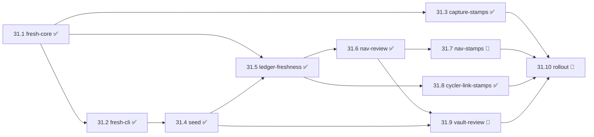

# `bob-cli-31` · Task freshness: what the epic changes

- **Research date:** 2026-09-30 (status as of ≈22:50 EDT)
- **Question:** What is epic `bob-cli-31` changing, and how far along is it?
- **Evidence:** the epic bead and its 10 phase beads (`sase bead read bob-cli-31..`), the
  approved plan `plan:202609/task_freshness_review.md`, `docs/freshness.md`, bob-cli
  commits `32d7007`…`779cc0c`, bob-plugins commits `8fd0f90`…`7e13c02`, and read-only
  checks of the live vault (`~/bob`) on athena.

---

## In one breath

> **Every Ready task gets a review lease.** A task records the date a human last confirmed
> it, as `[fresh:: YYYY-MM-DD]`. A task with no stamp is **NEW**. A task whose stamp is
> older than its interval (7 days by default) is **STALE**. A task whose deferral just
> ended is **RESURFACED**. Bryan reviews only those, one key per task, instead of
> re-reading all ~180 Ready tasks every morning.

**Why:** Reading the whole READY list each morning guaranteed Bryan saw every new capture
(for example "pick up our daughter", typed into Keep on a walk). It also meant re-reading
about 180 unchanged tasks a day. Epic `bob-cli-2y` turned the morning review into
PENDING → NEXT and dropped that guarantee. This epic restores it at a cost of roughly
**pool ÷ interval + arrivals** glances a day.

---

## Progress: 7 of 10 phases closed



| #     | Phase              | Repo        | What it delivers                                                                     | Status                              |
| ----- | ------------------ | ----------- | ------------------------------------------------------------------------------------ | ----------------------------------- |
| 31.1  | fresh-core         | bob-cli     | `docs/freshness.md` contract, Rust placement helper, pure evaluator, `freshness:` config | ✅ `32d7007`                        |
| 31.2  | fresh-cli          | bob-cli     | `bob freshness list` (review queue) and `bob freshness seed` (one-time cutover)        | ✅ `f103979`                        |
| 31.3  | capture-stamps     | bob-cli     | `bob capture` stamps the existing tasks it rewrites                                  | ✅ `3cd4d44`                        |
| 31.4  | seed               | vault       | Seeded the live vault; `fresh`/`refresh` shown as muted pills                        | ✅ `66c4e4c`, vault `61b0921e`      |
| 31.5  | ledger-freshness   | bob-plugins | ledger-tools **api v3** `api.freshness` and status-bar counter                       | ✅ `8fd0f90` (1.8.0)                |
| 31.6  | nav-review         | bob-plugins | `]s`/`[s` jumps, Alt+F refresh, Alt+Shift+F refresh-and-advance                      | ✅ `3fc6a5f` (1.43.0)               |
| 31.7  | nav-stamps         | bob-plugins | Alt+N, Ctrl+Shift+P rows, Ctrl+Shift+M and `!` stamp; new **refresh** picker row     | 🔄 no commit yet                    |
| 31.8  | cycler-link-stamps | bob-plugins | Alt+[ / Alt+], Ctrl+Enter reopen, Ctrl+Shift+Enter and `^^` stamp                    | ✅ `7e13c02` (1.18.0 / 1.16.0)      |
| 31.9  | vault-review       | vault, chezmoi | `freshness.md` review note, dash REVIEW chip, vim maps, chore text, config block  | 🔄 vault edits synced; config pending |
| 31.10 | rollout            | all         | Install, end-to-end checks, glossary strand, Bryan's checklist                       | 🔄 waits on 31.7 and 31.9           |

**Size:** about **+5.2k lines** in bob-cli (including tests and docs) and **+4.9k** in
bob-plugins (ledger-tools ≈ 2.9k, navigation hotkeys ≈ 1.5k, cycler and block-id ≈ 0.4k).

---

## The model

### Fields and overrides

| Field                          | Lives on                     | Meaning                                    |
| ------------------------------ | ---------------------------- | ------------------------------------------ |
| `[fresh:: YYYY-MM-DD]`         | task line                    | last human confirmation; absent means NEW  |
| `[refresh:: N]`                | task line, right after `fresh` | per-task interval, 1–365 days            |
| `task_refresh: N`              | note frontmatter             | interval for every task **in that note**   |
| `freshness.interval`           | `~/.config/bob/config.yml`   | global default, **7**                      |
| `freshness.stale_daily_budget` | `~/.config/bob/config.yml`   | optional meter; **never** hides tasks      |

The interval comes from the first of these that is set: task, then note, then config,
then 7. An invalid value is linted and skipped in favor of the next one.

### States (computed at read time, never stored)

Only tasks that are **in scope** get a state. A task is in scope when it is a `[ ]` Ready
task that is visible in the lanes, is not recurring, is not in a daily note, and is not in
Today.

| State          | When                                  | Due on              | Queue tier |
| -------------- | ------------------------------------- | ------------------- | ---------- |
| **NEW**        | no valid `fresh`                      | —                   | 1 · NEW    |
| **RESURFACED** | `fresh` < `scheduled` ≤ today         | `scheduled`         | 2 · DUE    |
| **STALE**      | today ≥ `fresh` + interval            | `fresh` + interval  | 2 · DUE    |
| FRESH          | otherwise                             | `fresh` + interval  | —          |

The queue lists NEW tasks by (path, line), then DUE tasks by (due date, path, line).
RESURFACED works as a tickler: a short P-level deferral is due again as soon as it
returns, with no hook having to write anything.

### Where the stamp goes (the risky part)

Obsidian Tasks and both Rust parsers read fields from the **end** of a line and stop at
the first key they don't know. A `fresh` field appended at the end would therefore hide
`created`, `priority`, `scheduled`, `id` and `dependsOn`, and Blocked could no longer be
derived. The stamp has to sit **just before the Tasks suffix**:

```text
- [ ] #task Plan trip [fresh:: 2026-10-08] [created::2026-08-26] #hide [priority:: high] ^trip
                      └──── the stamp ───┘ └─────── Tasks suffix (bytes never touched) ──────┘
```

There is **one placement helper per language**: `stamp_fresh` / `set_refresh` in Rust and
`api.freshness.stampLine` / `setRefreshLine` in JavaScript. Both run the same 18
conformance vectors (P1–P18) and 15 state vectors (S1–S15) from `docs/freshness.md`.
The helpers refuse non-tasks, recurring tasks and closed tasks. A same-day restamp on a
canonical line is a byte-identical no-op.

---

## Who stamps

**Rule:** a human gesture that *already* rewrites an open task's line also stamps it, in
the same write, as the last change to the line. Creating a task never stamps it, and
neither does automation.

| Surface                | Stamps                                                                                       | Never stamps                                         |
| ---------------------- | -------------------------------------------------------------------------------------------- | ---------------------------------------------------- |
| `bob capture`          | `plan_task_link` (link, Ensure Next, solo `@route:id`, link-then-close); `=x` → `[/]`         | new tasks, `=x` complete, unlink, start rows         |
| bob-navigation-hotkeys | **Alt+F / Alt+Shift+F**; Alt+N; Ctrl+Shift+P rows (incl. new refresh row); Ctrl+Shift+M; `!` | cancel row, project frontmatter, note↔task conversion |
| task-status-cycler     | Alt+[ / Alt+] to an open status; Ctrl+Enter reopen                                           | closing, bullet → `#task`, dependency normalizer     |
| block-id-prompt        | Ctrl+Shift+Enter and `^^` when they rewrite the line                                         | unlink, Task Link removal, Ctrl+6                    |
| Automation             | —                                                                                            | hooks, `projects sync`, `randomize`, `gkeep pull`, `nightly`, … |
| `bob freshness seed`   | the one-time cutover                                                                         | —                                                    |

The plugins normally copy small helpers rather than import from each other. Placement is
a deliberate exception: every plugin calls ledger-tools' `api.freshness.stampLine`, so the
fragile logic lives in one place. If ledger-tools is missing or too old, a gesture simply
doesn't stamp. That fails safe, because a missed stamp only means Bryan sees the task one
extra time.

---

## The new morning

| Where             | What Bryan sees                                                                   |
| ----------------- | --------------------------------------------------------------------------------- |
| Status bar        | `⟳ 23 due · 3 new · ✓ 12 today`, accented while `new > 0`; click to jump           |
| `~/bob/freshness.md` | counts line, key legend, one Tasks block grouped NEW → DUE                     |
| `dash.md`         | a `REVIEW 23 · 3 new · ✓ 12` chip; the TODAY/PENDING/NEXT/READY sections are unchanged |
| Terminal          | `bob freshness list` (human or `-f json`, `schema_version: 1`)                    |

**The ritual (≈10 min):**

1. `bob gkeep pull`.
2. Walk `]s` + **Alt+Shift+F** until the status bar shows **0 new**. This step is never
   capped or skipped.
3. Keep going through DUE until it reaches 0, or until the budget meter is met.
4. PENDING → NEXT, as before. READY becomes a list to pull from, not something to read.

**One key per review outcome:**

| Decision                 | Key                                       |
| ------------------------ | ----------------------------------------- |
| still right              | Alt+Shift+F (or Alt+F)                    |
| see it less often        | Ctrl+Shift+P → refresh → 14 / 30 / 90     |
| not now                  | Ctrl+Shift+P priority (P-level roll)      |
| do today                 | Ctrl+Shift+Enter / Alt+N                  |
| route to a project       | Ctrl+Shift+M                              |
| drop                     | Ctrl+Shift+P cancel                       |
| wording is wrong         | edit, then Alt+F                          |

---

## Live state on athena

- **Seed applied.** `~/bob` has **540 stamped lines across 46 files** (vault commit
  `61b0921e`): 177 Ready and 363 in other lanes. The Ready stamps are spread over 7 days,
  so roughly a seventh of the pool comes due each day and nothing was due on cutover day.
  The before/after parse diff matched on every line.
- **Seeding found a bug.** Tasks inside blockquotes were invisible to the stamper. The
  fix added vector **P18**, which ledger-tools also tests.
- **Vault-review edits are synced:** `freshness.md`, the dash REVIEW chip, the `]s`/`[s`
  vimrc maps, the new Morning review and Weekly prune text, and the muted-pill CSS.
- **Not on athena yet:**
  - The installed `bob` (built 20:26) predates `fresh-cli`, so `bob freshness` is an
    unknown subcommand.
  - `~/.config/bob/config.yml` has no `freshness:` block.

  Both are covered by phase 31.9's chezmoi step and the rollout checklist ("reinstall bob
  on the MacBook and athena").

---

## Guardrails

- **Shared vectors.** `docs/freshness.md` owns the rule. Rust and JavaScript both run its
  P and S vectors verbatim.
- **Parse invariance.** Every vector is checked with *both* Rust parsers, and every
  Tasks field must come out identical. The seed re-parses every changed line and
  **aborts with no writes** if any field differs.
- **Seed safety.**
  - It refuses a second seed after cutover unless given `--force`, because a re-seed would
    silently mark every capture since cutover as reviewed.
  - It re-reads each file just before writing it.
  - It writes through a temp file plus rename.
- **No new churn.** The hooks only swap the checkbox byte, so `fresh` survives them, and
  capture JSON stays `schema_version: 1`.

## Deliberately out of scope

- A REVIEW *section* on the dash. It would break the
  `today-is-read-from-the-ledger` exclusivity rule.
- Auto back-off, random sampling, a `never` interval, and auto-expiry.
- Any change to the hooks, `bob plan`, or Bob Mac Capture. This follows
  `mac-capture-is-a-thin-client`: bob-cli stamps, and the Mac app just displays.
- Teaching the Rust parsers about `fresh`, emoji task format, and stamping on view.

## Choices Bryan can still overturn

- **Ready-only scope.** Extending it to other lanes is a one-line predicate change.
- **Creation never stamps.**
- **Automatic Blocked → Ready returns never stamp.**
- **`task_refresh` applies by residence**, not through `parent` links.
- **No daily cap.**
- **No decision record yet.** The report proposes "Freshness Is Stamped Only By Human
  Gestures And Read At Review Time", pending Bryan's OK.

**Trial:** two weeks. Keep the design if, on at least 10 of 14 mornings:

- NEW reaches 0 before planning;
- the ritual takes 10 minutes or less;
- due debt stays flat or falls;
- no capture was missed;
- no freshness write changed a lane, schedule, priority or Task Link.

---

## Open follow-ups recorded on phase beads

| Raised in        | Follow-up                                                                                                   |
| ---------------- | ----------------------------------------------------------------------------------------------------------- |
| 31.1, 31.3, 31.4 | `just all` already fails on clean master: a clippy deny at `tests/cli/capture/pomodoro_name.rs:808` (`\|\| true`) and 5 `capture_pomodoro_close` linked-task test failures |
| 31.3             | Check whether Bob Mac Capture shows the raw `[fresh:: …]` now present in `task_line` / `previous_task_line` |
| 31.6             | Ctrl+Alt+J/K have no fallback for Vim normal mode (Alt+F and Alt+Shift+F do); check whether Vim swallows the chord |
| 31.8             | The cycler's Tasks-command path stamps in a second editor edit, so one gesture takes two undo steps          |
| 31.4             | ~~Mirror P18 blockquote stripping in ledger-tools~~: done, P18 is in `test-ledger-tools-freshness.cjs`       |
