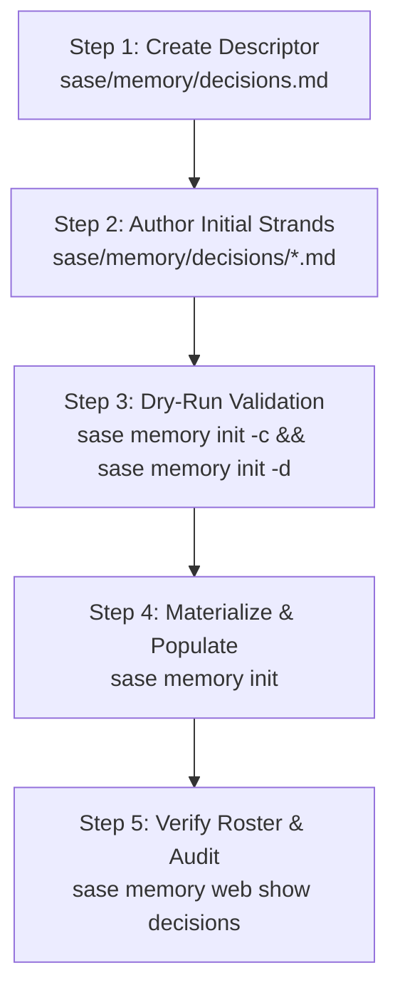

# Architecture and Implementation Plan: SASE Decisions Memory Web for the Bob Ecosystem

- **Researcher:** `gem` (5-researcher independent swarm)
- **Date:** 2026-09-29
- **Target Repository:** `bob-cli` (orchestrating `bob-cli`, `bob-plugins`, `bob-mac-capture`, and Obsidian Vault `~/bob`)
- **Report Path:** `sase/repos/research/202609/decisions_memory_web_architecture__gem.md`

---

## 1. Executive Summary & Core Verdict

The user proposes creating a SASE memory web named `decisions` to record the pivotal architectural and policy decisions across four interconnected domains:
1. `bob-cli` (the Rust CLI core, parser, and sync orchestrator)
2. `bob-plugins` (the CommonJS Obsidian plugin monorepo)
3. `bob-mac-capture` (the native Swift/AppKit macOS menu-bar app)
4. The **Bob Obsidian Vault** (`~/bob` personal productivity vault and conventions)

This memory web is to be heavily modeled after the canonical `decisions` memory web in the `sase` project.

### The Verdict: A Resounding "Yes", With Four Critical Adjustments
Implementing this memory web is **an exceptionally strong idea** that directly addresses one of the most persistent failure modes of AI coding assistants: **the tendency of LLMs to rationalize away deliberate, hard-won project constraints** (e.g. proposing TypeScript or Webpack for `bob-plugins`, adding direct vault file mutations inside `bob-mac-capture`, reverting Git sync to Obsidian Sync, or conflating temporary `#now` commitments with machine-derived `[/]` Pomodoro status).

However, a naive implementation will quickly degrade unless four specific adjustments to the requirements are made:
1. **Flat Namespacing with Domain Prefixes (`<domain>-<slug>`):** SASE memory web discovery explicitly forbids nested directories (`nested_directory` validation error). Because four distinct projects/subsystems are represented in one web, slugs must use strict domain prefixes (`vault-*`, `cli-*`, `plugins-*`, `mac-*`) to prevent collision and preserve clarity in generated prompt rosters.
2. **Unified Web in `bob-cli` vs Multi-Web Fragmentation:** All four domains should live in a **single unified `decisions` web in `bob-cli`**, rather than four separate memory webs or an uncoordinated split across repos. `bob-cli` is the only SASE project among the four, and its workspace serves as the operational host for the entire ecosystem.
3. **Strict ADR Litmus Test (Guarding Against the "Runbook / Docs Trap"):** SASE decision records are **immutable Architectural Decision Records (ADRs)**, not design docs, tutorials, or user guides. A strand belongs in `decisions` *only* if it defines an accepted invariant with credible rejected alternatives, explicit trade-offs/costs, and a falsifiable reopening condition. Runbooks belong in `docs/` and terminology belongs in `glossary`.
4. **Context Budget Discipline:** The web descriptor roster inlines every decision's summary into `AGENTS.md` and all provider shims on every turn. To avoid prompt bloat, the initial set should be capped at **12-14 high-impact, load-bearing decisions** (~500 tokens in the baseline prompt), reserving on-demand strand reading for deep context.

---

## 2. Deep Dive: The SASE Decisions Pattern in `sase`

To design a faithful, idiomatic implementation, we inspected the canonical implementation in `gh:sase-org/sase` at `sase/memory/decisions.md` and its 24 strands in `sase/memory/decisions/`.

### 2.1 Web Descriptor Anatomy
In `sase`, the web descriptor file (`sase/memory/decisions.md`) configures the discovery and roster behavior:
```yaml
---
web: true
description:
  Architectural decision records — accepted choices, their rejected alternatives, and
  what would reopen them.
roster: list
roster_label: DECISIONS
strand_noun: decision
---
```
Key architectural mechanics:
- `web: true`: Identifies this note as a web descriptor rather than a flat core or reference note.
- `roster: list`: Generates a numbered list of all strands in the sibling directory between `<!-- sase:strands -->` and `<!-- /sase:strands -->`. Each entry formats as:
  `<N>. **<Keyword>** (`<slug>`) - <summary>`
  When superseded, the generator automatically formats:
  `<N>. **<Keyword>** (`<slug>`) - _[superseded by `<new-slug>`]_ <summary>`
- `roster_label: DECISIONS`: Labels the section in generated instructions.
- `strand_noun: decision`: Naming token used for CLI messages and headers.

### 2.2 Strand File Anatomy
Each strand in `sase/memory/decisions/<slug>.md` follows a strict schema enforced by `sase/memory/web/frontmatter.py`:
```yaml
---
keyword: Descriptive Title in Title Case
aliases: [optional, search, aliases]
summary:
  A single, dense sentence summarizing the invariant and its primary consequence.
metadata:
  status: accepted      # or: superseded, superseded-in-part
  decided: YYYY-MM-DD
  # When superseded:
  # superseded_by:
  #   - decisions/other-slug
---

**Claim.** The concise, unambiguous assertion of the invariant or architectural rule.

**Why.** Rationale, historical context, commits where applicable, and explicitly rejected credible alternatives.

**Cost.** Real trade-offs, operational burdens, performance costs, and tooling dependencies accepted by making this choice.

**Reopens when.** The concrete, falsifiable condition or external technological shift that would justify reconsidering the choice.
```

### 2.3 Strict Invariants and Fail-Closed Validation Rules
Inspection of the SASE core parser (`sase/memory/web/discovery.py` and `frontmatter.py`) reveals several strict validation rules:
1. **No Nested Directories:** `_discover_strands` explicitly records a fail-closed issue if any directory exists inside `sase/memory/<web>/`. All strands must be flat sibling files.
2. **Forbidden Frontmatter Keys:** Memory strands **must not** declare `type:` or `parent:`. Including either immediately causes a parse error.
3. **Mandatory Summary:** `summary` must be a non-empty string. It is this summary that gets inlined into `AGENTS.md`.
4. **Immutability & Supersession:** When a decision changes, the existing strand is **never deleted or rewritten**. A new strand is created, and the old strand's frontmatter is updated with `metadata.status: superseded` (or `superseded-in-part`) and `metadata.superseded_by: [decisions/<new-slug>]`. The body of the old strand is prepended with a blockquote linking to the successor via `[[decisions/<new-slug>]]`.

---

## 3. Critique of the Proposed Plan

### 3.1 Is It a Good Idea?
**Yes, it is essential.** The Bob ecosystem has evolved into a sophisticated, multi-language, multi-process architecture:
- Rust backend (`bob-cli`)
- Vanilla JavaScript Obsidian plugins (`bob-plugins`)
- Swift/AppKit macOS menu-bar app (`bob-mac-capture`)
- Git-backed, Dataview-annotated, Pomodoro-scheduled Obsidian vault (`~/bob`)

Each domain has non-obvious contracts that agents routinely violate unless instructed otherwise. For instance, when an agent is asked to add a new capture shortcut, it might attempt to parse the capture text inside Swift (`bob-mac-capture`) or add TypeScript build scripts to `bob-plugins`. Having these boundaries codified as decision records prevents regressions and eliminates repetitive human corrections.

### 3.2 What Are the Risks and Pitfalls?

#### Risk 1: The "Runbook / Documentation Trap"
Agents love to write documentation. If the prompt asks for "architectural / policy decisions", there is a strong tendency to include:
- How to install `bob-cli`
- The syntax table of `bob capture`
- How to set up an SSH deploy key for Git sync
- How Pomodoro timestamps are calculated

**None of these are decision records.**
- A table of syntax belongs in `README.md` or `docs/capture.md`.
- A git setup procedure belongs in `docs/vault-git-sync.md`.
- Terms like "Pomodoro" or "Schedule Log" belong in `sase/memory/glossary/`.
- General CLI flag rules belong in `sase/memory/cli_rules.md`.

*ADR Rule of Thumb:* If an entry does not answer "Which credible alternative did we reject, what is the cost of our choice, and what condition would reopen it?", it is documentation, not an architectural decision.

#### Risk 2: Cross-Repository Visibility Disconnect
`bob-plugins` and `bob-mac-capture` are linked repositories under `bob-cli`; they do not have independent `.sase` directories or SASE project configurations.
- If an agent is invoked in `bob-cli`, it sees `bob-cli/sase/memory/decisions.md` in its prompt.
- However, if an agent is asked to operate directly in `gh:bobs-org/bob-plugins` without `bob-cli` context, it will only have the local repo's instructions.
- *Mitigation:* In the Bob ecosystem, agents are dispatched from `bob-cli` and open linked repos via `/sase_repo`. The single source of truth for agent memory across the ecosystem should live in `bob-cli`. Furthermore, `~/sase/memory/obsidian.md` (the home-level memory) should explicitly link to this web.

#### Risk 3: Roster Inlining Bloat
Because `roster: list` inlines every strand's slug and summary into `AGENTS.md` and every provider instruction shim (`CLAUDE.md`, `GEMINI.md`, etc.), 50 decisions would inject ~1,500 - 2,000 tokens of boilerplate into every single agent turn.
- *Mitigation:* Be selective. Only record decisions that:
  a) Govern cross-system boundaries
  b) Counteract common LLM defaults/assumptions
  c) Impose high-consequence invariants

---

## 4. Necessary Adjustments to the Requirements

Before creating any files, we recommend formally adopting the following adjustments:

| Requirement Area | User Proposal | Justified Adjustment | Rationale |
| :--- | :--- | :--- | :--- |
| **Directory Structure** | One general web | **Flat, domain-prefixed slugs** (`vault-*`, `cli-*`, `plugins-*`, `mac-*`) | SASE prohibits nested subdirectories (`sase/memory/decisions/subdir/` fails discovery). Prefixes provide instant namespace isolation. |
| **Scope & Location** | Decisions across 4 repos | **Single web in `bob-cli`** | Neither `bob-plugins` nor `bob-mac-capture` is a SASE project. `bob-cli` is the orchestration engine for the entire ecosystem. |
| **Content Boundary** | "Decisions I've made" | **Strict ADR schema only** (Claim, Why, Cost, Reopens When) | Prevents duplication of `docs/`, `glossary/`, and `README.md`. |
| **Home Memory Linkage** | Project-only | **Cross-link from `~/sase/memory/obsidian.md`** | Connects home-scoped agent memory with project-scoped decision strands. |

---

## 5. Curated Initial Decisions Catalog (13 High-Impact Strands)

We have analyzed the commit history, docs, and implementation across `bob-cli`, `bob-plugins`, `bob-mac-capture`, and `~/bob`. Below is the curated catalog of initial decision strands, grouped by domain prefix.

```
sase/memory/decisions/
├── vault-git-sync-only.md
├── vault-parent-hierarchy.md
├── vault-now-tag-vs-in-progress.md
├── vault-task-dependency-ids.md
├── cli-rust-native-core.md
├── cli-sync-maintenance-lock.md
├── cli-batch-capture-planning.md
├── cli-embedded-js-dataview.md
├── plugins-commonjs-no-bundler.md
├── plugins-monorepo-source-of-truth.md
├── plugins-vim-hotkey-partitioning.md
├── mac-capture-delegates-mutation.md
└── mac-apple-toolchain-isolation.md
```

### Domain 1: Obsidian Vault (`vault-*`)

#### 1. `vault-git-sync-only`
- **Keyword:** Git Is The Sole Sync Transport
- **Aliases:** `[git sync only, obsidian sync retired, vault git sync]`
- **Summary:** The Bob vault syncs exclusively via scheduled and hook-driven Git (`bob vault-sync`); Obsidian Sync is permanently retired and forbidden.
- **Claim:** All synchronization of `~/bob` across machines (athena, apollo, MacBook) is performed by `bob vault-sync` over Git using machine deploy keys. Obsidian Sync must remain completely unlinked and disabled.
- **Why:** Obsidian Sync caused opaque, non-deterministic race conditions, unversioned conflict resolution, and lacked multi-process file locking. Git provides immutable commit history, cryptographic SHAs, transparent conflict copies in `_conflicts/`, and auditable rollbacks.
- **Cost:** Requires deploy keys (`id_bob_vault`), lockfile arbitration (`bob_sync.lock`), exclusion rules for large binaries (>95MB), and custom conflict handling in `_conflicts/`.
- **Reopens when:** Headless git sync becomes unviable on an essential mobile/tablet platform, or Obsidian releases an official open-source sync protocol with deterministic locking and atomic multi-file commits.

#### 2. `vault-parent-hierarchy`
- **Keyword:** Notes Require A Parent Frontmatter Link
- **Aliases:** `[parent frontmatter, note hierarchy, note tree]`
- **Summary:** Every new Markdown note in the vault must declare a `parent` frontmatter field linking to an existing ancestor note.
- **Claim:** Flat or unanchored notes are forbidden in the vault. Every created note must include `parent: "[[AncestorNote]]"` in its YAML frontmatter.
- **Why:** Unlinked notes become forgotten orphan files. A strict parental tree guarantees that every note is discoverable via breadcrumb navigation, tree queries, and Dataview hierarchy rollups.
- **Cost:** Adds authoring friction to manual note creation; tools and capture workflows must provide or infer a parent link.
- **Reopens when:** The vault transitions to a full semantic graph database where hierarchical containment is replaced by typed ontologies.

#### 3. `vault-now-tag-vs-in-progress`
- **Keyword:** Now Tag Represents Commitment, In Progress Represents Activity
- **Aliases:** `[now vs in-progress, status-lock trap, now tag]`
- **Summary:** `#now` is a human-curated weekly commitment tag (≤15 tasks), while `[/]` (In Progress) is a machine-derived, auto-decaying footprint of recent Pomodoro work.
- **Claim:** Tasks must never be kept in `[/]` merely to keep them visible. `[/]` is strictly derived from Pomodoro ledger links and decays back to Ready `[ ]` via `task-status-hooks`. Commitments are preserved using the `#now` tag, which is never modified or cleared by automated hooks.
- **Why:** Solves the "status-lock trap" where Bryan could not remove tasks from daily Pomodoros without losing them, causing `[/]` to inflate to 50+ stale tasks. Separating the commitment (`#now`) from the activity footprint (`[/]`) restores truth to task statuses.
- **Cost:** Requires weekly manual review to prune `#now` tasks; tools must support both tag filtering and status progression.
- **Reopens when:** Obsidian Tasks natively supports time-decaying state transitions and first-class commitments without custom tag conventions.

#### 4. `vault-task-dependency-ids`
- **Keyword:** Task Dependencies Use Namespaced Vault-Wide Identifiers
- **Aliases:** `[task dependency encoding, task id format, dependsOn format]`
- **Summary:** Task dependency tracking uses namespaced string IDs (`projects__Name__blockid`) in `[id::]` and `[dependsOn::]` rather than raw wikilinks.
- **Claim:** Dataview task dependencies must encode file context into the identifier (`<note>__<id>`), while wikilinks `[[note#^id]]` are reserved solely for human navigation and subtask transclusions.
- **Why:** Obsidian block anchors (`^id`) are scoped only to individual files. In vault-wide Dataview and Tasks queries, bare block IDs collide across notes. Sanitized namespaced IDs ensure deterministic topological sorting across the entire vault.
- **Cost:** Redundancy between the physical block anchor (`^id`) and Dataview inline fields (`[id:: ...]`); requires migration scripts when renaming notes.
- **Reopens when:** Dataview or Tasks natively resolves file-qualified block references (`[[note#^id]]`) in dependency graphs.

---

### Domain 2: Bob CLI Architecture (`cli-*`)

#### 5. `cli-rust-native-core`
- **Keyword:** Native Rust Core Replaces Shell Scripts
- **Aliases:** `[rust core, native bob binary, shell fallback]`
- **Summary:** `bob-cli` is implemented as a single native Rust binary; shell scripts are retained only as emergency fallback shims.
- **Claim:** All production commands (`capture`, `task-status-hooks`, `pomodoro`, `projects`, `randomize`, `vault-sync`) must be implemented natively in Rust. Legacy shell scripts in `src/bin/` remain purely as compatibility rollback targets.
- **Why:** Shell execution suffered from high startup latency (>200ms per call), fragile string manipulation, and platform discrepancies between macOS and Linux. Rust provides sub-millisecond execution (essential for menu-bar typing and tmux status lines), strong typing, and robust AST parsing.
- **Cost:** Requires Rust toolchain for development and longer CI build times; more verbose code than quick bash one-liners.
- **Reopens when:** A static language emerges that provides equivalent execution speed, cross-platform compilation, and memory safety with significantly less boilerplate.

#### 6. `cli-sync-maintenance-lock`
- **Keyword:** Shared Maintenance Lock Coordinates Vault Mutation
- **Aliases:** `[bob_sync lock, maintenance lock, vault mutation concurrency]`
- **Summary:** All vault-mutating operations must acquire `bob_sync.lock` before modifying files or running Git commands.
- **Claim:** `bob vault-sync`, `bob nightly`, `bob task-status-hooks`, and `bob randomize` must serialize access through `bob_sync.lock`. Concurrent writes or unsandwiched Git staging are prohibited.
- **Why:** Concurrent background sync jobs and interactive task-status edits caused Git index lock collisions (`index.lock`), partial commits, and lost edits.
- **Cost:** Mutating commands must implement timeout and retry logic; an unresponsive process can temporarily block background sync until the lock expires or is cleared.
- **Reopens when:** Vault storage moves to an ACID-compliant multi-version concurrency control (MVCC) transactional store.

#### 7. `cli-batch-capture-planning`
- **Keyword:** Capture Parses and Plans The Entire Batch Before Writing
- **Aliases:** `[capture planning, batch capture, atomic capture]`
- **Summary:** `bob capture` parses the complete input draft and constructs an in-memory mutation plan before touching any file on disk; errors fail closed.
- **Claim:** Capture operations are strictly two-phase: Parse & Plan, followed by Execution. If any item, route, block ID, or marker in a batch is invalid, no file in the vault is modified.
- **Why:** Partial writes leave the vault in an inconsistent state (e.g. creating a task in `inbox.md` while failing to create its Pomodoro link in `YYYYMMDD.md`). Batch planning ensures atomic-like predictability.
- **Cost:** High memory and AST representation complexity in Rust; cannot stream long capture inputs.
- **Reopens when:** Filesystem transactions or copy-on-write snapshots become universally available across macOS and Linux filesystems.

#### 8. `cli-embedded-js-dataview`
- **Keyword:** Headless Dataview Queries Run via Embedded JavaScript
- **Aliases:** `[rquickjs dataview, headless dataview, quickjs queries]`
- **Summary:** CLI queries against Dataview and Tasks evaluate headlessly using an embedded QuickJS engine (`rquickjs`) against vault data.
- **Claim:** `bob query` runs Obsidian Dataview and Tasks query logic inside an embedded QuickJS runtime rather than spawning Electron/Node or reimplementing query semantics in pure Rust.
- **Why:** Dataview's query language and Tasks evaluation have hundreds of edge cases. Reimplementing them in Rust would create endless behavioral drift from desktop Obsidian. Spawning Node or Electron would add 500ms+ latency and huge memory overhead. `rquickjs` provides 100% semantic fidelity in under 10ms.
- **Cost:** Dependency on `rquickjs` and C bindings; requires maintaining JS wrapper shims that mock Obsidian's in-memory API.
- **Reopens when:** Dataview's core is officially rewritten in Rust/WASM and distributed as a native crate.

---

### Domain 3: Bob Plugins Architecture (`plugins-*`)

#### 9. `plugins-commonjs-no-bundler`
- **Keyword:** CommonJS Monorepo With No Bundler Or TypeScript
- **Aliases:** `[no bundler, plain commonjs, main.js is source]`
- **Summary:** `bob-plugins` are authored as plain CommonJS JavaScript (`main.js` is source); bundlers and TypeScript are explicitly banned.
- **Claim:** Every plugin in `bob-plugins/plugins/<id>/` consists of a handwritten `main.js`, `manifest.json`, and optional `styles.css`. No Webpack, Rollup, esbuild, Babel, or TypeScript compilation steps are permitted.
- **Why:** Eliminates the "build step tax" and dependency rot. Code can be edited and immediately synced to the vault via `bob plugins sync` without compiling. Debugging in Obsidian uses the exact authored lines without source maps.
- **Cost:** Lack of compile-time type checking; code validation is limited to `node --check` and runtime unit test suites (`scripts/validate-manifests.mjs`).
- **Reopens when:** Obsidian natively executes TypeScript or modern ESM modules directly without bundling or build tools.

#### 10. `plugins-monorepo-source-of-truth`
- **Keyword:** Plugins Monorepo Is Sole Source of Truth
- **Aliases:** `[plugins source of truth, vault plugins deploy target, bob plugins sync]`
- **Summary:** `bob-plugins` is the source of truth for custom plugins; vault folders (`~/bob/.obsidian/plugins/`) are ephemeral deploy targets.
- **Claim:** Agents and humans must never edit plugin files directly inside `~/bob/.obsidian/plugins/`. All modifications must be committed in the `bob-plugins` repo and deployed via `bob plugins sync`.
- **Why:** Direct vault edits are gitignored in the vault and get silently overwritten or deleted on synchronization, resulting in lost work and unversioned code.
- **Cost:** Requires a two-step edit-and-sync workflow (`make changes` -> `bob plugins sync` -> reload plugin in Obsidian).
- **Reopens when:** Obsidian supports loading active plugins directly from external symlinks across all target platforms.

#### 11. `plugins-vim-hotkey-partitioning`
- **Keyword:** Strict Partitioning of Vim Leader Chords Across Plugins
- **Aliases:** `[vim hotkey partitioning, vim chords, plugin keymap ownership]`
- **Summary:** Custom Vim leader keymaps are strictly partitioned between plugins (e.g. `\p` for ledger tools, `\s` for tab pins).
- **Claim:** Keybindings and Vim leader chords must have a single designated plugin owner, verified by unit tests in `bob-plugins`.
- **Why:** Obsidian Vim mode lacks hotkey conflict detection. If two plugins register the same chord, keystrokes are dropped or execute non-deterministically based on load order.
- **Cost:** Limits available short chords; requires cross-plugin coordination whenever adding new keymaps.
- **Reopens when:** Obsidian introduces a centralized keymap arbitration engine for Vim mode.

---

### Domain 4: Bob Mac Capture Architecture (`mac-*`)

#### 12. `mac-capture-delegates-mutation`
- **Keyword:** Mac Capture Is Presentation-Only And Delegates All Vault Mutation
- **Aliases:** `[mac capture presentation only, capture delegation, cli capture backend]`
- **Summary:** `bob-mac-capture` is strictly a presentation and orchestration client; 100% of capture parsing, completion, and vault mutation is delegated to `bob-cli`.
- **Claim:** `bob-mac-capture` must never read or write vault files directly, and must never implement capture grammar parsing. It invokes `bob capture`, `bob capture-parse`, and `bob capture-complete` as subprocesses, consuming their JSON output.
- **Why:** Prevents duplicate implementations of the complex capture grammar. Any new syntax (e.g. `@route:id=x`, priority rolls `p:<N>`, duration adjustments `+5`) implemented in `bob-cli` becomes instantly supported in the Mac UI without writing Swift code.
- **Cost:** Requires a working `bob` binary on `PATH` or in standard directories; slight subprocess invocation overhead (~5-10ms).
- **Reopens when:** Process IPC overhead degrades typing responsiveness in the interactive capture window, necessitating direct FFI/C-ABI bindings to `bob-cli`.

#### 13. `mac-apple-toolchain-isolation`
- **Keyword:** Apple Toolchain Isolation via Xcode Swift Wrapper
- **Aliases:** `[xcode-swift wrapper, reject bare swift, apple toolchain]`
- **Summary:** `bob-mac-capture` builds and tests must route through `Scripts/xcode-swift.sh` to use Apple's developer toolchain, rejecting shadowing Swift binaries on `PATH`.
- **Claim:** Invocations of `swift` in development scripts and CI must resolve via `xcrun` from `DEVELOPER_DIR` or `xcode-select`, strictly rejecting non-Apple toolchains (such as Swiftly or Homebrew Swift).
- **Why:** Open-source or alternative Swift toolchains on macOS frequently fail to link against `AppKit` and `XCTest`, causing obscure compilation and test failures.
- **Cost:** Requires installed Xcode or Command Line Tools; prevents building on non-Apple systems.
- **Reopens when:** Swift provides a standardized cross-platform build system that seamlessly handles Apple platform SDKs and framework linking regardless of toolchain provenance.

---

## 6. Detailed Specifications for 4 Archetype Strands

Below are the complete, exact Markdown specifications for four core decision strands—one from each domain—ready to be created under `sase/memory/decisions/`.

### 6.1 `vault-git-sync-only.md`
```markdown
---
keyword: Git Is The Sole Sync Transport
aliases: [git sync only, obsidian sync retired, vault git sync]
summary:
  The Bob vault syncs exclusively via scheduled and hook-driven Git (bob vault-sync);
  Obsidian Sync is permanently retired and forbidden.
metadata:
  status: accepted
  decided: 2026-08-15
---

**Claim.** All synchronization of Bryan's Bob vault (`~/bob`) across machines (athena,
apollo, MacBook) is performed by `bob vault-sync` over Git using machine deploy keys.
Obsidian Sync is retired, must remain unlinked, and must never be re-enabled.

**Why.** Obsidian Sync operates as an opaque, non-deterministic background daemon with
no multi-process locking, no structured audit log, and silent conflict resolution that
repeatedly corrupted complex Dataview task annotations and Pomodoro ledger entries. Git
provides atomic multi-file commits, cryptographic SHA history, deterministic conflict
quarantine under `_conflicts/`, and auditable branch tracking. Rejected alternatives:
Obsidian Sync (caused data loss and race conditions), Syncthing (lacked version control
and atomic commit guarantees), and manual rsync (too error-prone across three active
hosts).

**Cost.** Requires managing repository-scoped SSH deploy keys (`id_bob_vault`) on every
machine; enforcing strict maintenance locking (`bob_sync.lock`) across background
services; and manually reviewing quarantined files in `_conflicts/sync_conflicts.md`
when non-fast-forward merge conflicts occur. Large files (≥95 MiB) must be strictly
excluded.

**Reopens when.** Headless Git sync becomes technically unviable on an essential mobile
platform (such as iOS), or Obsidian releases an official, open-source sync protocol
featuring deterministic multi-process file locking and atomic commit rollbacks.
```

### 6.2 `vault-now-tag-vs-in-progress.md`
```markdown
---
keyword: Now Tag Represents Commitment, In Progress Represents Activity
aliases: [now vs in-progress, status-lock trap, now tag]
summary:
  #now is a human-curated weekly commitment tag (≤15 tasks), while [/] (In Progress) is
  a machine-derived, auto-decaying footprint of recent Pomodoro work.
metadata:
  status: accepted
  decided: 2026-09-29
---

**Claim.** Task status `[/]` (In Progress) is an automated activity footprint derived
from recent Pomodoro ledger links and automatically decays back to Ready `[ ]` via
`task-status-hooks`. Commitments are represented exclusively by the human-managed `#now`
tag, which automated tools must never modify, promote, or clear.

**Why.** Prior to this separation, Bryan suffered from the "status-lock trap": removing a
task from the daily Pomodoro ledger demoted it, meaning tasks had to stay linked forever
just to avoid being forgotten. This inflated active WIP to ~50 `[/]` tasks, rendering
status meaningless. Decoupling commitment (`#now`, managed during Monday reviews) from
recent activity (`[/]`, managed by Pomodoro closures and status hooks) allows `[/]` to
decay honestly without losing track of weekly commitments. Rejected alternatives:
leaving `[/]` as a persistent manual status (caused chronic status inflation), using
custom Dataview fields like `[roadmap:: now]` (erased by Tasks picker formatting), and
deriving `#now` automatically from priorities.

**Cost.** Requires dual awareness: humans manage the `#now` tag during weekly reviews
(enforcing the ≤15 cap), while automated tools manage `[/]`. `#now` tasks not worked on
in 7 days appear as "owed" in dashboards until explicitly triaged.

**Reopens when.** Obsidian Tasks or Dataview introduces a native state-machine engine that
supports auto-decaying statuses alongside persistent goal commitments without tag hacks.
```

### 6.3 `cli-sync-maintenance-lock.md`
```markdown
---
keyword: Shared Maintenance Lock Coordinates Vault Mutation
aliases: [bob_sync lock, maintenance lock, vault mutation concurrency]
summary:
  All vault-mutating operations must acquire bob_sync.lock before modifying files or
  running Git commands.
metadata:
  status: accepted
  decided: 2026-08-20
---

**Claim.** All automated and interactive processes that modify files in `~/bob` or execute
Git operations on the vault repository (`bob vault-sync`, `bob nightly`,
`bob task-status-hooks`, and `bob randomize`) must acquire the exclusive file lock
`bob_sync.lock` before executing.

**Why.** Background systemd/LaunchAgent sync runs concurrently with user edits, nightly
archiving, and task status hooks. Without strict synchronization, simultaneous Git
invocations crash on `index.lock`, while concurrent file rewrites create split-brain
modifications and Git merge conflicts. `bob randomize` specifically requires a
"sync-sandwiched" lock: it pulls changes, rewrites randomized notes, commits them, and
pushes, all under a single held lock. Rejected alternatives: relying on Git's internal
`index.lock` (insufficient for multi-file application-level edits) and optimistic
concurrency (caused repeated data overwrite races).

**Cost.** Mutating CLI commands must implement exponential backoff and timeout logic. If
a process crashes while holding the lock, subsequent operations are blocked until the lock
times out or is manually cleared.

**Reopens when.** The vault filesystem is replaced by an ACID transactional database
supporting snapshot isolation and row-level / note-level optimistic locking.
```

### 6.4 `mac-capture-delegates-mutation.md`
```markdown
---
keyword: Mac Capture Is Presentation-Only And Delegates All Vault Mutation
aliases: [mac capture presentation only, capture delegation, cli capture backend]
summary:
  bob-mac-capture is strictly a presentation and orchestration client; 100% of capture
  parsing, completion, and vault mutation is delegated to bob-cli.
metadata:
  status: accepted
  decided: 2026-07-10
---

**Claim.** The native macOS capture app (`bob-mac-capture`) owns UI presentation, global
hotkey interception, launch-at-login, and settings. It must never parse capture grammar,
inspect vault Markdown directly, or mutate vault files. All grammar parsing, preview,
autocomplete data, and vault writes must be delegated to `bob-cli` subprocess calls
returning structured JSON.

**Why.** The Bob capture grammar is intricate and rapidly evolving (supporting `@route`,
`^block-id`, `:id` linking, `=x` Pomodoro closures, `s:<N>` schedules, `p:<N>` priority
rolls, and `%` clipboard attachments). Reimplementing this grammar in Swift would create a
permanent dual-maintenance burden and inevitable parsing divergence between CLI and GUI.
Delegating to `bob-cli` ensures single-point-of-truth semantics: updating `bob-cli`
instantly updates the Mac capture application without rebuilding Swift code. Rejected
alternatives: embedding a shared Rust library via C-FFI (complex packaging and signing in
macOS app bundles) and authoring native Swift parsers (guaranteed behavioral drift).

**Cost.** Subprocess execution overhead (~5-15ms per call) during keystroke completion and
preview; strict runtime dependency on an installed, compatible `bob` binary at known
paths (`~/.cargo/bin/bob`, `/opt/homebrew/bin/bob`, etc.).

**Reopens when.** Subprocess JSON serialization latency causes measurable UI stutter
during interactive autocomplete on low-power devices, necessitating direct static FFI
linkage.
```

---

## 7. Recommended Implementation Workflow

To implement this memory web cleanly without causing drift, lint errors, or agent disruption, follow this 5-step operational plan:



### Step 1: Create the Web Descriptor
Create `sase/memory/decisions.md` in `bob-cli`:
```markdown
---
web: true
description:
  Architectural and policy decision records for bob-cli, bob-plugins, bob-mac-capture, and the Bob Obsidian vault.
roster: list
roster_label: DECISIONS
strand_noun: decision
---

# Decisions

A decision record is not a design doc or a subsystem overview — those go stale as the
code changes underneath them. A record is immutable once accepted: if the project
changes course, a new record is written and the old one is marked superseded with a
`metadata.status` plus `superseded_by` mark and a `[[...]]` back-link, never edited in
place. Read one on demand with `sase memory read decisions:<keyword> -r "<why>"`; each
record states the claim, why it was chosen over the credible alternatives, what it
costs, and the condition that would reopen it.

<!-- sase:strands -->
<!-- /sase:strands -->
```

### Step 2: Author the Strands
Create the 13 curated `.md` files in `sase/memory/decisions/`.
- Ensure **no** strand contains `type:` or `parent:`.
- Ensure every strand includes non-empty `keyword:`, `summary:`, and `metadata.status: accepted`.
- Ensure sections use exact bold markdown headings: `**Claim.**`, `**Why.**`, `**Cost.**`, `**Reopens when.**`.

### Step 3: Dry-Run and Verify
Run:
```bash
sase memory init -c
```
This inspects the proposed files against SASE's 11 fail-closed discovery rules and reports any schema or frontmatter issues without touching `AGENTS.md`.

### Step 4: Materialize the Roster
Run:
```bash
sase memory init
```
This updates `sase/memory/decisions.md` with the populated roster between `<!-- sase:strands -->` and `<!-- /sase:strands -->`, and updates `AGENTS.md` and all provider instruction shims (`CLAUDE.md`, `GEMINI.md`, `QWEN.md`, `OPENCODE.md`).

### Step 5: Verify Discovery and Read Auditing
Run:
```bash
sase memory web list
sase memory web show decisions
sase memory read decisions:vault-git-sync-only -r "Verify decision read audit"
```
Verify that the web shows 13 strands, all summaries are populated, and the audit read registers cleanly in `sase memory log`.

### Step 6: Update Home-Level Memory
Edit `~/sase/memory/obsidian.md` (via `/sase_memory_write` skill) to add a cross-reference:
```markdown
- **Decisions:** Architectural and policy invariants governing the vault, `bob-cli`,
  `bob-plugins`, and `bob-mac-capture` are maintained as ADRs in the `bob-cli` project's
  `decisions` memory web (`sase memory read decisions:<slug>`).
```

---

## 8. Summary of Recommendations

1. **Adopt the `decisions` Web Immediately:** It fills a critical knowledge gap in the Bob ecosystem, preventing agent hallucinations and architectural erosion.
2. **Enforce Domain Prefixes (`vault-*`, `cli-*`, `plugins-*`, `mac-*`):** Respect SASE's flat-directory rule while keeping multi-repo domains cleanly segregated.
3. **Seed with the 13 Curated Strands:** Start with high-leverage architectural boundaries, rejecting ordinary documentation or user guides.
4. **Maintain ADR Immutability:** Never edit accepted claims in place; supersede them with explicit backlinks and date stamps when requirements change.
