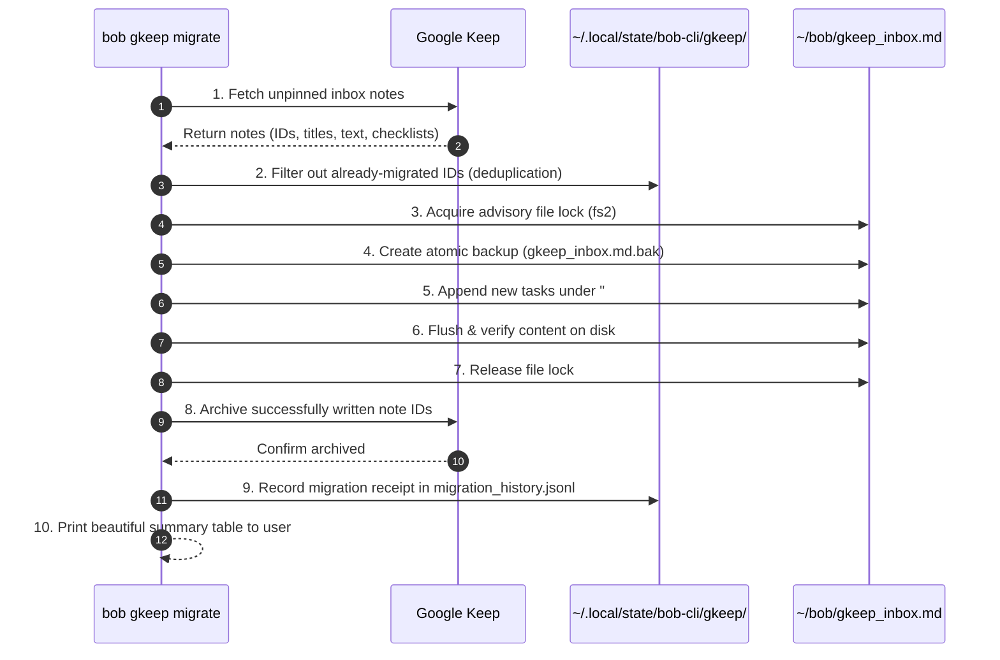

# Research Report: Architectural Design, Requirements Critique, and Implementation Strategy for `bob gkeep`

- **Author / Agent:** `research.i.gem` (Gemini 3.8 Flash High)
- **Swarm Context:** Independent investigation in a 5-researcher swarm (`__gem.md`)
- **Date:** 2026-09-28
- **Target Repository:** `bobs-org/bob-cli`
- **Topic:** Designing the new `bob gkeep` command for Google Keep inbox migration and listing
- **Associated Vault Target:** `~/bob/gkeep_inbox.md`
- **Audit Reference:** `sase memory read cli_rules.md`, `~/bob/gtd_daily.md`, `~/bob/gkeep_inbox.md`, `~/bob/mac_inbox.md`

---

## 1. Executive Summary & Core Verdict

### 1.1 The User's Goal & Vault Context
The user desires a new `bob gkeep` subcommand in `bob-cli` with two core capabilities:
1. **Migration (`migrate`):** Migrate current Google Keep inbox items (visible at `https://keep.google.com/#home`) to Obsidian tasks in `~/bob/gkeep_inbox.md`, and safely archive those items in Google Keep once migration is verified successful.
2. **Inspection (`list`):** List all items currently in Google Keep and/or existing Obsidian tasks in `~/bob/gkeep_inbox.md`.
3. **User Experience:** The design must be intuitive, reliable, and beautiful (meeting the visual, ergonomic, and aesthetic standards of `bob-cli`).

An inspection of Bryan's live Obsidian vault reveals an immediate, concrete motivation:
In `~/bob/gtd_daily.md` (line 16), Bryan has a recurring GTD task:
```markdown
- [ ] #task Import inbox tasks from Google Keep  [repeat:: every day when done]  [created:: 2026-09-09]  [scheduled:: 2026-09-10]
```
Furthermore, `~/bob/gkeep_inbox.md` already exists in the vault with the following structure:
```markdown
---
generated_from_zorg: true
parent: "[[inbox]]"
...
---
- See [[legacy_gkeep_notes]] for old notes that were stored in this file before zorg migration.
- The tasks below are pulled in by the `bob gkeep` command.

## Tasks
```
Bryan is currently doing this manual chore every single morning as part of his daily GTD routine. Automating this migration removes persistent daily cognitive drag and directly closes an open loop in his personal workflow.

### 1.2 Core Verdict: Is This a Good Idea?
**Verdict:** **Yes to the workflow automation, but with critical caveats regarding the underlying platform and safety architecture.**

*   **The Workflow Problem is 100% Real:** Daily manual copy-pasting and archiving between Google Keep and Obsidian is tedious, error-prone, and contrary to the automation principles embodied by `bob-cli`.
*   **The Technical Sandcastle:** Google Keep is one of the most notoriously closed services in Google's ecosystem. **There is no official public REST API for personal (`@gmail.com`) accounts.** The official Keep API (`keep.googleapis.com`) is strictly reserved for Google Workspace enterprise domains with enterprise administrative service accounts. It returns `HTTP 403 Forbidden` for personal accounts.
*   **The Risk Profile:** Unofficial reverse-engineered clients (e.g., Python's `gkeepapi`) rely on the internal Android Google Play Services sync protocol, requiring high-privilege **Master Tokens** that bypass 2FA, grant full unconstrained access to the user's entire Google account, and frequently break when Google deploys anti-bot or protocol updates.
*   **The Strategic Recommendation:** 
    1.  **Build `bob gkeep` with defensive, decoupled architecture:** Implement `bob gkeep` in Rust with a clean CLI interface (`list`, `migrate`, `auth`, `status`). Decouple the Keep backend so it can operate via a sandboxed local helper (or authenticated browser CDP session), with mandatory dry-run previews, de-duplication, atomic vault updates, and strict error boundaries.
    2.  **Adjust the Requirements to Protect Pinned Notes:** The command MUST NOT blindly archive everything on `#home`. Pinned notes in Keep are permanent reference items or persistent checklists; archiving them would corrupt the user's setup. Migration must default to *unpinned* inbox items only.
    3.  **Evaluate Long-Term Capture Alternatives:** While `bob gkeep` unblocks Bryan's immediate workflow, Google Keep should be viewed as a legacy or transient capture layer. For long-term reliability, migrating capture to an API-first tool (such as **Google Tasks**, which possesses an official, stable REST API for consumer accounts) or native Bob capture tools (`bob-mac-capture` / iOS shortcuts) is strongly advised.

---

## 2. Technical Feasibility & Google Keep Integration Analysis

### 2.1 The Google Keep API Landscape in 2026

| Approach | Official Support | Consumer (`@gmail.com`) Compatibility | Auth Mechanism | Reliability & Maintenance Risk |
| :--- | :--- | :--- | :--- | :--- |
| **Official Google Keep API** (`keep.googleapis.com`) | Yes (Google Workspace) | **NO** (`403 Forbidden`) | Google Cloud OAuth 2.0 / Service Account | Zero maintenance, but completely unavailable for personal accounts. |
| **Unofficial Client** (`gkeepapi` / Android Sync) | No (Reverse-engineered) | Yes | Master Token (via `gpsoauth` / Android auth) | **High**. Fragile; breaks on protobuf/schema changes; requires high-privilege master token. |
| **Authenticated Browser Session** (Chrome DevTools / CDP / Puppeteer) | No (DOM Automation) | Yes | Existing Chrome User Profile / Cookies | **Medium**. Immune to API token blocks; requires local Chrome instance; sensitive to DOM changes. |
| **Google Takeout / JSON Dump** | Yes (Manual Export) | Yes | Manual Web Download | Robust for static import, but cannot archive or automate daily runs. |
| **Google Tasks API** (*Alternative*) | **Yes** (Public REST API) | **Yes** (Full support) | Standard OAuth 2.0 User Consent | **Rock solid**. Stable, officially maintained, native Rust libraries available. |

### 2.2 Deep Dive: Why the Official Google Keep API Fails for Personal Accounts
The official Google Keep API launched by Google is an enterprise compliance tool designed for Google Workspace administrators (specifically for Cloud Access Security Brokers [CASB], data loss prevention [DLP], and compliance audits). Google explicitly gates access behind Workspace licensing:
- Consumer accounts attempting OAuth flows against `keep.googleapis.com` are greeted with: `"The Google Keep API is only available to Google Workspace accounts."`
- Google has intentionally declined to release a public consumer Keep API for over a decade.

### 2.3 Deep Dive: The Unofficial `gkeepapi` Route
The open-source community primarily relies on `gkeepapi` (a Python library written by Kai Davies).
- **Protocol:** Reverse-engineers the mobile sync protocol used by the Google Keep Android application. It talks directly to `android.clients.google.com` and Google's internal sync servers using serialized protocol buffers / JSON.
- **Authentication:** Standard passwords and App Passwords no longer work reliably due to Google's anti-bot defenses (`BadAuthentication` or `NeedsBrowser` errors). Authenticating requires generating a persistent **Master Token** (an `aas_et/...` credential) via an OAuth token exchange mimicking Google Play Services.
- **Security Implications:** A Master Token is **not scoped**. It grants root-level programmatic access to the entire Google account (Gmail, Google Drive, Google Photos, Contacts, Location). If leaked or compromised, an attacker has total account takeover capability. Storing this token requires rigorous encryption or OS keyring protection.
- **Ecosystem Fit:** `bob-cli` is written entirely in native Rust. Calling `gkeepapi` requires either invoking a Python helper subprocess or maintaining a Python virtualenv (`~/.local/state/bob-cli/venv/`).

### 2.4 Deep Dive: Authenticated Browser Automation Bridge (CDP)
An alternative modern approach is connecting to a local Chromium/Chrome browser session via the Chrome DevTools Protocol (CDP) or Playwright:
- The user is already logged in to `https://keep.google.com/#home` in their daily browser (Chrome/Brave).
- The CLI launches or connects to an authenticated browser profile with `--remote-debugging-port`.
- It navigates to `#home`, evaluates the DOM to extract note cards, formats them into markdown, and triggers the "Archive" action via DOM events.
- **Advantages:** Zero API key or Master Token required; 2FA is handled natively by the user's browser; Google cannot ban the account for using an unauthorized client.
- **Disadvantages:** Heavier execution footprint; requires a local browser binary; vulnerable to web UI class name obfuscation.

---

## 3. Requirements Critique & Essential Adjustments

The user's initial requirements are concise, but production-grade software engineering requires addressing critical edge cases, data integrity risks, and UX gaps.

### 3.1 Adjustment 1: Protecting Pinned Notes (The "Archive All" Danger)
*   **The Flaw in the Initial Plan:** The requirement states: *"migrates all of my current Google Keep inbox items (which I can see by going to https://keep.google.com/#home)... These Google Keep items should be archived in Google Keep once we are sure the migration was successful."*
*   **The Hazard:** In Google Keep, `https://keep.google.com/#home` contains two distinct visual sections:
    1.  **Pinned Notes:** Notes the user explicitly pinned to the top (frequently used reference sheets, ongoing project checklists, temporary dashboards, or persistent reminders).
    2.  **Others (Unpinned Notes):** The actual transient inbox scraps that need GTD triage.
    If `bob gkeep migrate` archives *everything* on `#home`, it will inadvertently archive the user's permanent pinned notes, destroying their Keep layout!
*   **Required Adjustment:**
    *   **Rule:** By default, `bob gkeep migrate` **MUST ONLY migrate and archive unpinned notes**.
    *   **Option:** Provide an explicit `--include-pinned` (or `-p`) flag for users who intentionally want to sweep pinned notes.
    *   `bob gkeep list` should visually categorize and label pinned vs. unpinned items.

### 3.2 Adjustment 2: Data Model Translation (Heterogeneous Notes -> Obsidian Tasks)
Google Keep is a free-form multimedia scratchpad, whereas `~/bob/gkeep_inbox.md` is a structured markdown task list. Notes in Keep come in diverse shapes:

1.  **Single-line Scrap:** (e.g., Note text: `"Call tire shop for alignment"`)
    *   *Translation:* Direct task:
        ```markdown
        - [ ] #task Call tire shop for alignment [created:: 2026-09-28] [keep_id:: 192348a]
        ```
2.  **Multi-line Free-form Note with Title:** (e.g., Title: `"Light-mode palette ideas"`, Body: `"Try Catppuccin Latte.\nCheck contrast on badges."`)
    *   *Translation:* Title becomes the task line; body lines become indented child bullets:
        ```markdown
        - [ ] #task Light-mode palette ideas [created:: 2026-09-28] [keep_id:: 192348b]
          - Try Catppuccin Latte.
          - Check contrast on badges.
        ```
3.  **Checklist Note:** (e.g., Title: `"Groceries"`, Items: `[ ] Milk`, `[x] Bread`, `[ ] Bananas`)
    *   *Translation:* Parent task represents the checklist container; unchecked items become child tasks; checked items are noted:
        ```markdown
        - [ ] #task Groceries [created:: 2026-09-28] [keep_id:: 192348c]
          - [ ] Milk
          - [ ] Bananas
        ```
4.  **Notes with Attachments (Images, Audio, Drawings):**
    *   *Translation:* Google Keep often stores photo captures. The migration engine must either download attachments to `~/bob/attachments/gkeep/` and embed `![[filename.png]]` in child bullets, or append a warning link pointing to the web note: `[attachment:: photo omitted; see Keep archive]`.

### 3.3 Adjustment 3: Two-Phase Commit & Idempotent Migration
Auto-archiving items in an external cloud service must be treated like a distributed transaction. If a failure occurs midway (e.g., power loss, network timeout, disk full, or Obsidian file conflict), data must neither be lost nor duplicated.



*   **Idempotency Guarantee:** Every imported task line carries a unique `[keep_id:: <id>]` inline field or is indexed in `~/.local/state/bob-cli/gkeep/migration_history.jsonl`. Running `bob gkeep migrate` multiple times consecutively will detect that notes are already imported and refuse to create duplicate tasks.
*   **Verification Gate:** Archival calls to Google Keep are strictly deferred until **after** `~/bob/gkeep_inbox.md` has been modified, flushed to disk, and verified by reading back the file.
*   **Rollback / Recovery:** If the Keep archiving step fails for any individual note, the note remains safe in Obsidian, and the CLI logs a clear warning identifying the specific note ID that needs manual archiving.

### 3.4 Adjustment 4: Mandatory Dry-Run Mode (`-d, --dry-run`)
Modifying both an external cloud account and Bryan's primary Obsidian vault in a single command can be intimidating.
*   `bob gkeep migrate --dry-run` must be a first-class citizen.
*   It fetches items, calculates the exact diff that would be inserted into `~/bob/gkeep_inbox.md`, lists the note IDs that would be archived in Keep, and displays this cleanly in the terminal without modifying either system.

---

## 4. CLI Interface & UX Design ("Intuitive, Reliable, Beautiful")

In accordance with `sase/memory/cli_rules.md`:
- All subcommands and options must be sorted alphabetically in help listings.
- Every public long option must have a short alias.
- `-h|--help` output must be comprehensive and consistent.
- Output should leverage `Styler` (ANSI color, styled badges, clean unicode glyphs) for superior terminal aesthetics.

### 4.1 Command Structure Overview

```
bob gkeep [SUBCOMMAND] [OPTIONS]
```

When invoked without a subcommand, `bob gkeep` defaults to running `list` (matching the pattern established by `bob plugins` and `bob projects`).

```
SUBCOMMANDS:
    auth        Authenticate or verify connection to Google Keep
    list        List items in Google Keep inbox and/or Obsidian gkeep_inbox.md (default)
    migrate     Migrate Google Keep inbox items to Obsidian tasks and archive in Keep
    open        Open Google Keep (#home) in browser or gkeep_inbox.md in editor
```

### 4.2 Subcommand Specifications & Mockups

#### 4.2.1 `bob gkeep list`
Lists pending inbox items across Google Keep and Obsidian.

```
USAGE:
    bob gkeep list [OPTIONS]

OPTIONS:
    -a, --all               Include pinned Keep notes and completed Obsidian tasks
    -b, --bob-dir <DIR>     Override the Bob vault root directory [default: ~/bob]
    -f, --format <FORMAT>   Output format: text, json [default: text]
    -h, --help              Print help information
    -s, --source <SOURCE>   Filter by source: all, keep, obsidian [default: all]
    -v, --verbose           Display full note bodies and child checklist items
```

**Human Terminal Output Mockup (`bob gkeep list`):**

```
╭──────────────────────────────────────────────────────────────────────────────────────────╮
│ bob gkeep · Inbox Inventory                                                              │
│ Google Keep: 3 inbox items (1 pinned, 2 unpinned) · Obsidian: 4 pending tasks             │
╰──────────────────────────────────────────────────────────────────────────────────────────╯

 Google Keep Inbox (https://keep.google.com/#home)
 ───────────────────────────────────────────────────────────────────────────────────────────
  ST   ID        TYPE       DATE         TITLE / PREVIEW
  📌   192a8f0   CHECKLIST  2026-09-24   Weekly Grocery Staples (4 items) [PINNED]
  ·    193b11c   NOTE       2026-09-28   Call Tire Shop about blowout replacement
  ·    193c44e   CHECKLIST  2026-09-28   Packing list for weekend trip (3 items)

 Obsidian Tasks (~/bob/gkeep_inbox.md)
 ───────────────────────────────────────────────────────────────────────────────────────────
  ST   LINE   STATUS   CREATED      TASK DESCRIPTION
  ·    L18    TODO     2026-09-26   Review quarterly cloud spending report
  ·    L19    TODO     2026-09-27   Draft RFC for agent coordination protocol
  ·    L22    TODO     2026-09-27   Inspect attic insulation before winter
  ·    L25    WIP      2026-09-28   Order replacement oil filters for generator
```

*Styling details:*
- `📌` indicates pinned Keep items (highlighted in yellow).
- `CHECKLIST` vs `NOTE` pills indicate the underlying Keep note structure.
- Obsidian tasks render their current line number, Tasks-plugin status, and description.
- When `--all` is omitted, pinned items are displayed with a note that they are excluded from automated migration.

#### 4.2.2 `bob gkeep migrate`
Executes the safe migration from Keep to Obsidian.

```
USAGE:
    bob gkeep migrate [OPTIONS]

OPTIONS:
    -a, --archive              Archive migrated notes in Google Keep [default: true]
        --no-archive           Migrate to Obsidian but do NOT archive in Google Keep
    -b, --bob-dir <DIR>        Override the Bob vault root directory [default: ~/bob]
    -d, --dry-run              Simulate migration without modifying Obsidian or Google Keep
    -f, --force                Proceed without interactive confirmation prompts
    -h, --help                 Print help information
    -k, --keep-id <ID>         Migrate only a specific Keep note by ID
    -p, --include-pinned       Include pinned Google Keep notes (default: unpinned only)
    -v, --verbose              Show full markdown diff and API payloads
```

**Dry-Run Terminal Output Mockup (`bob gkeep migrate -d`):**

```
╭──────────────────────────────────────────────────────────────────────────────────────────╮
│ bob gkeep migrate · [dry-run] Simulation Preview                                         │
╰──────────────────────────────────────────────────────────────────────────────────────────╯

[dry-run] Scanning Google Keep (https://keep.google.com/#home)...
  Found 3 notes total: 1 pinned (skipped), 2 unpinned eligible for migration.

Items to migrate into ~/bob/gkeep_inbox.md:
  1. [NOTE] "Call Tire Shop about blowout replacement" (ID: 193b11c)
     + - [ ] #task Call Tire Shop about blowout replacement [created:: 2026-09-28] [keep_id:: 193b11c]
  2. [CHECKLIST] "Packing list for weekend trip" (ID: 193c44e, 3 items)
     + - [ ] #task Packing list for weekend trip [created:: 2026-09-28] [keep_id:: 193c44e]
     +   - [ ] Passport & boarding passes
     +   - [ ] Phone charger & power bank
     +   - [ ] Rain jacket

Vault Target:
  File:   /home/bryan/bob/gkeep_inbox.md
  Target: Under "## Tasks" heading (starting at line 16)
  Action: Append 5 new lines

Google Keep Actions:
  Archive: 2 notes (193b11c, 193c44e)
  Pinned:  1 note preserved on #home (192a8f0)

[dry-run] ok 2 items eligible for migration. 0 files modified.
Run `bob gkeep migrate` without `-d` to apply these changes.
```

**Live Execution Terminal Output Mockup (`bob gkeep migrate`):**

```
╭──────────────────────────────────────────────────────────────────────────────────────────╮
│ bob gkeep migrate · Migrating Google Keep Inbox                                          │
╰──────────────────────────────────────────────────────────────────────────────────────────╯

1/4 Fetching eligible inbox notes from Google Keep... ok (2 notes found)
2/4 Updating /home/bryan/bob/gkeep_inbox.md...
    ✓ File locked (exclusive)
    ✓ Backup created: gkeep_inbox.md.bak
    ✓ Written 5 task lines under "## Tasks"
    ✓ Verified on disk (2 new tasks confirmed)
3/4 Archiving migrated notes in Google Keep...
    ✓ Archived Keep note 193b11c ("Call Tire Shop...")
    ✓ Archived Keep note 193c44e ("Packing list...")
4/4 Recording audit trail in ~/.local/state/bob-cli/gkeep/migration_history.jsonl... ok

ok Migration complete!
   Migrated: 2 items (1 note, 1 checklist)
   Archived: 2 notes in Google Keep
   Vault:    /home/bryan/bob/gkeep_inbox.md (+5 lines)
```

#### 4.2.3 `bob gkeep auth`
Manages credentials and connection diagnostics.

```
USAGE:
    bob gkeep auth [OPTIONS] [SUBCOMMAND]

OPTIONS:
    -c, --check       Verify active authentication and network connectivity
    -h, --help        Print help information
    -l, --login       Initiate authentication flow
    -s, --status      Show current credential storage and account status
```

**Status Output Mockup (`bob gkeep auth --status`):**

```
╭──────────────────────────────────────────────────────────────────────────────────────────╮
│ bob gkeep auth · Connection Status                                                       │
╰──────────────────────────────────────────────────────────────────────────────────────────╯
  Account:      user@gmail.com
  Backend:      Python Bridge (gkeepapi v0.14.4)
  Auth Method:  Master Token (Encrypted keyring)
  Status:       Active / Connected
  Last Sync:    2026-09-28 09:15:22 EDT
  Keep Inbox:   3 active items reachable
```

---

## 5. Architectural Blueprint for `bob-cli`

### 5.1 Codebase Integration Points
`bob-cli` is organized into clean native modules under `src/native/`.
To integrate `bob gkeep`:
1.  **Add Subcommand Enum:** In `src/native.rs`, add `NativeCommand::Gkeep` to `enum NativeCommand`.
2.  **Register in Runner:** In `src/runner.rs`, add `Subcommand { name: "gkeep", ... }` to `SUBCOMMANDS` in strict alphabetical declaration order.
3.  **Create Module Structure:** Create `src/native/gkeep/`:
    ```
    src/native/gkeep/
    ├── mod.rs             // CLI dispatch & clap definition
    ├── auth.rs            // Credential management & status checks
    ├── backend.rs         // KeepClient trait definition
    ├── bridge_python.rs   // Subprocess IPC with Python gkeepapi helper
    ├── bridge_cdp.rs      // Optional fallback: Chrome DevTools Protocol bridge
    ├── list.rs            // Beautiful table formatting & Styler rendering
    ├── migrate.rs         // Two-phase commit transactional engine
    └── vault.rs           // gkeep_inbox.md parsing, locking, and appending
    ```

### 5.2 The Backend Abstraction (`KeepClient` Trait)
By isolating Google Keep communication behind a Rust trait, the rest of `bob-cli` remains completely independent of whatever fragile protocol is needed to talk to Keep.

```rust
// src/native/gkeep/backend.rs

pub struct KeepItem {
    pub id: String,
    pub title: String,
    pub text: String,
    pub is_pinned: bool,
    pub is_archived: bool,
    pub created_at: chrono::NaiveDateTime,
    pub checklist: Vec<ChecklistItem>,
}

pub struct ChecklistItem {
    pub text: String,
    pub is_checked: bool,
}

pub trait KeepClient {
    fn check_auth(&self) -> Result<AuthStatus, GkeepError>;
    fn fetch_inbox(&self) -> Result<Vec<KeepItem>, GkeepError>;
    fn archive_notes(&self, note_ids: &[String]) -> Result<Vec<String>, GkeepError>;
}
```

### 5.3 Safe Vault Appending Logic (`vault.rs`)
`vault.rs` handles the physical markdown file manipulation in `~/bob/gkeep_inbox.md`:
1.  Uses `fs2::FileExt::lock_exclusive` to guarantee no concurrent agent or Obsidian sync process modifies the file during write.
2.  Parses existing lines to locate the `## Tasks` heading.
3.  If `## Tasks` does not exist, appends it cleanly following existing frontmatter.
4.  Appends new tasks under `## Tasks` with two-space indentation for child checklist items or body notes.
5.  Flushes to disk using `std::fs::File::sync_all`.

---

## 6. Strategic Critique: Should Bryan Keep Using Google Keep?

### 6.1 The Fundamental Mismatch
| Criteria | Google Keep | Dedicated GTD / Inbox Capture (e.g. Google Tasks, Obsidian Mobile) |
| :--- | :--- | :--- |
| **API Availability** | None for personal accounts. Reverse-engineered only. | Official REST APIs with long-term stability and OAuth 2.0. |
| **Data Schema** | Free-form sticky notes, checklists, drawings, photos. | Direct Task entities (status, due date, notes, sub-tasks). |
| **Maintenance Cost** | High. High risk of auth breakages, bot detection, and token rot. | Low. Set-and-forget OAuth refresh tokens. |
| **Mobile Capture Friction** | Near zero (fast app, lock screen widget, Wear OS). | Near zero (iOS Shortcuts, Android widgets, share sheet). |

### 6.2 Alternative Solutions Considered

#### Alternative A: The Google Tasks Migration Path (Highly Recommended)
*   **The Concept:** Instead of capturing tasks in Google Keep, Bryan uses **Google Tasks** on mobile/web.
*   **Why This is Superior:**
    *   Google Tasks has a **public, first-class, official Google REST API** (`tasks.googleapis.com`).
    *   Works natively with standard Google Cloud OAuth 2.0 credentials for any `@gmail.com` account.
    *   No Master Tokens, no reverse engineering, no risk of Google account suspension.
    *   Native Rust client (`google-tasks1` or lightweight `reqwest` calls) can be embedded directly into `bob-cli` with zero external Python or browser dependencies.
    *   Google Tasks has official Android and iOS widgets that are just as fast as Google Keep for quick capture.

#### Alternative B: Native Bob Capture Bridge (`bob capture`)
*   Bryan already possesses `bob capture` and `bob-mac-capture` on macOS, as well as Hammerspoon bindings.
*   For mobile capture, an Apple Shortcut or Android HTTP webhook (or Git push to a mobile capture branch) can directly feed `inbox.md` without any Google intermediary.

#### Alternative C: Keep as an Ephemeral Mobile Buffer (The Compromise)
*   If Bryan specifically prefers Google Keep's tactile UI (colors, free-form spatial notes, Wear OS tiles):
    *   Adopt `bob gkeep` as designed herein.
    *   Treat Google Keep as an *ephemeral daily buffer* rather than a permanent store.
    *   By strictly running `bob gkeep migrate` daily, Keep remains empty (Inbox Zero), minimizing the surface area for sync conflicts or data accumulation in an unsupported API.

---

## 7. Recommended Solution & Action Plan

### 7.1 Synthesis Recommendation
Implement `bob gkeep` in `bob-cli` following the resilient, phased blueprint below:

1.  **Phase 1: Safe CLI & Vault Core (`src/native/gkeep/`)**
    *   Implement `bob gkeep` CLI with `list`, `migrate`, and `auth` subcommands following `cli_rules.md`.
    *   Implement robust, safe file mutations in `~/bob/gkeep_inbox.md` with `fs2` file locking, atomic backup, and de-duplication via `keep_id`.
    *   Enforce the **Pinned Notes Protection Rule** (unpinned items migrated by default; pinned items require `--include-pinned`).
    *   Default to `--dry-run` safety or clear interactive confirmation.

2.  **Phase 2: Decoupled Keep Backend**
    *   Deploy a lightweight Python bridge (`scripts/lib/gkeep_bridge.py`) managed inside `~/.local/state/bob-cli/venv/` using `gkeepapi`.
    *   Provide clear setup and diagnostic tooling via `bob gkeep auth --login` and `bob gkeep auth --check`.
    *   Secure the Master Token in the system credential manager / encrypted local state.

3.  **Phase 3: Integration into Daily GTD Workflow**
    *   Once `bob gkeep migrate` is active and verified, update `~/bob/gtd_daily.md` line 16:
        *   From: `- [ ] #task Import inbox tasks from Google Keep` (manual chore)
        *   To: A streamlined command execution or automated step in `bob nightly` / morning routine.

---

## 8. Appendix: Audit & Evidence Index

- `~/bob/gtd_daily.md`: Line 16 records the existing daily GTD task confirming Bryan's manual Keep import routine.
- `~/bob/gkeep_inbox.md`: Existing vault file with `parent: "[[inbox]]"` and explicit note that tasks below are pulled by `bob gkeep`.
- `~/bob/legacy_gkeep_notes.md`: Contains historical Zorg-migrated notes and `@FRESHNESS` reminder to clear Keep daily.
- `sase/memory/cli_rules.md`: CLI design rules (sorted subcommands, short aliases, styled colored output).
- Google Keep API Documentation: `keep.googleapis.com` (confirmed restricted to Google Workspace enterprise domains; personal accounts rejected).
- `gkeepapi` Project: GitHub `kiwiz/gkeepapi` (confirmed reverse-engineered Android Play Services protocol requiring Master Token).
