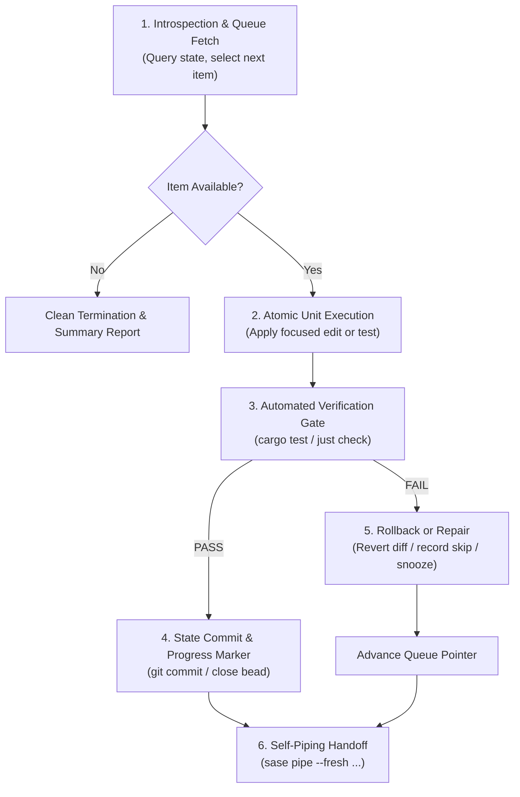

# High-Yield Autonomous Loop Workloads for a 48-Hour Infinite-Token Window

- **Author / Agent:** `research.31.gem` (Gemini 3.8 Flash High)
- **Swarm Context:** Independent investigation in a 5-researcher swarm (`__gem.md`)
- **Date:** 2026-09-30
- **Target Repositories:** `bobs-org/bob-cli`, `bobs-org/bob-plugins`, `bobs-org/bob-mac-capture`, Bob Vault (`~/bob`), SASE Framework
- **Topic:** High-value, loopable engineering workloads suitable for unattended `/sase_handoff` chains under temporary token abundance
- **Output Artifact:** `sase/repos/research/202609/high_value_autonomous_loops_48h__gem.md`

---

## 1. Executive Summary & Core Verdict

### 1.1 The Operational Opportunity & Paradigm Inversion
A temporary 48-hour windfall of "near-infinite tokens" fundamentally inverts the economics of AI-assisted software engineering:

| Dimension | Normal Token Regime | 48-Hour Infinite-Token Window |
| :--- | :--- | :--- |
| **Marginal Token Cost** | Expensive ($3–$30/hour; quota-constrained) | **$0.00 (Effectively zero)** |
| **Primary Bottleneck** | Token consumption, rate limits, context budget | **Wall-clock time ($T \le 2,880\text{ min}$) & Human attention** |
| **Agent Strategy** | Minimal diffs, single-shot edits, manual review | **Autonomous multi-pass loops, exhaustive verification** |
| **Workload Viability** | High-token/low-surface tasks are avoided | **High-token/high-leverage tasks become optimal** |
| **Post-Window Asset Goal** | Incremental feature progress | **Durable, permanent assets requiring $0 ongoing tokens** |

The core strategic challenge is avoiding the **"Sprawling Half-Baked Feature Trap"**. In a 48-hour window, launching massive, unverified architectural rewrites or creative features that require human product judgment creates unfinished branches that become liabilities when the token window shuts. 

Instead, the optimal strategy exploits token abundance to generate **durable, permanent assets** that:
1. Require **zero human intervention** during the 48-hour execution period.
2. Rely on a **deterministic automated verification oracle** (compiler, test runner, linter, property checker) so errors cannot silently compound.
3. Yield assets (comprehensive test suites, killed mutants, closed bug beads, verified schemas, normalized data) that **persist forever and cost zero tokens to maintain**.

### 1.2 Core Verdict & High-Level Recommendation
**Verdict:** Deploy autonomous, self-piping `/sase_handoff` loops across two dedicated, parallel tracks:
- **Track 1 (Code Quality & Robustness - The "Mutant Hunter" & "Proptest Swarm"):** Target `bob-cli`'s critical parsing, ledger, and state-machine engines with automated mutation testing and property-based test synthesis. This converts cheap tokens into permanent, rock-solid test safety nets that prevent regressions indefinitely.
- **Track 2 (Backlog Liquidation - The "Bead Drainer"):** Unattended sweeping of deterministic bug, CI, and maintenance beads from `sase bead ready` (currently 17 open unblocked tasks in `bob-cli`), liquidating long-standing technical debt like clippy warnings (`bob-cli-v`) and store validation collisions (`bob-cli-21`).

---

## 2. The Physics of the 48-Hour Infinite-Token Regime

To design effective workloads, we must understand the hard physical and cognitive constraints of this 48-hour window:

### 2.1 The Math of Wall-Clock Time
- **Total Time:** 48 hours = 2,880 minutes = 172,800 seconds.
- **Sequential Turn Cadence:** A typical SASE agent turn executing tools, running builds, running tests, and calling `/sase_handoff` takes between **2.5 and 5 minutes**.
- **Sequential Capacity:** A single continuous `/sase_handoff` chain running 24/7 over 48 hours can execute approximately **600 to 1,150 discrete agent turns**.
- **Parallel Capacity:** SASE supports isolated numbered workspace checkouts (`bob-cli_1`, `bob-cli_2`, ..., `bob-cli_15`). Running 3 to 4 concurrent workspace loops scales total capacity to **2,500 to 4,500 agent turns**.

### 2.2 The Human Attention Bottleneck
Bryan cannot babysit agents for 48 consecutive hours. If a loop requires human disambiguation, approval, or visual review every 15 minutes, it will stall the moment Bryan steps away, sleeps, or works on other tasks.
- **Rule of Autonomy:** Every candidate workload must be capable of running unattended for at least 8 to 12 hours without halting.
- **Failure Containment:** If an individual task or file cannot be solved within a bounded number of attempts, the loop must safely **snooze/skip** it, record structured diagnostics, roll back dirty workspace changes, and advance to the next item in the queue.

### 2.3 Asset Durability: The Post-Window Cliff
When hour 49 arrives, token scarcity returns. The value produced during the window must not require high token burn to keep alive:
- **High Durability:** Unit tests, property tests, mutation coverage, closed bug beads, clean clippy baselines, JSON schemas, typed interfaces, normalized vault markdown. These provide permanent compounding value at zero ongoing token cost.
- **Low Durability:** Ambiguous prototypes, complex experimental agent loops that break without constant LLM supervision, or code with high ongoing maintenance burdens.

---

## 3. The Anatomy of an Autonomous `/sase_handoff` Loop

Under SASE, `/sase_handoff` invokes `sase pipe`:
```bash
sase pipe --fresh '<prompt>' --reason '<iteration context>'
```
`sase pipe` ends the calling agent turn, preserves workspace filesystem state, creates a clean context window (`--fresh`), and immediately launches the successor agent with the specified prompt.

To run reliably across hundreds of iterations without human guidance, the prompt passed to `sase pipe` must implement the **Six Invariants of Autonomous Loops**:



### The Six Invariants:
1. **Deterministic Queue Discovery (Introspection):** The prompt must know how to inspect the world and pick the "next" atomic item dynamically (e.g. `sase bead ready`, a list of files with low coverage, surviving mutants from a JSON report, or unindexed notes). It must not hardcode a single static task.
2. **Strictly Bounded Work Unit:** Each turn must do exactly one thing (e.g. fix one bead, write tests for one module, kill one mutant, normalize one directory). Large scopes lead to context exhaustion and build failures.
3. **Infallible Automated Verification Gate:** Every turn must be verified by a deterministic tool (`just fmt && just lint && cargo test`). If the gate fails and the agent cannot repair it within the turn, the agent must run `git checkout -- .` to restore a clean tree before proceeding.
4. **Idempotent Progress Transition:** Completing a unit must permanently remove it from the discovery queue (e.g. closing the bead via `sase bead close`, committing the test so the mutant is killed, or updating a progress ledger). If the system re-runs, it never repeats already-completed work.
5. **Graceful Bypass & Snooze Mechanics:** If a task proves intractable, ambiguous, or requires human design input, the agent must not spin in an infinite loop. It must record an explanatory note, snooze or blacklist the item, revert changes, and hand off to the next item.
6. **Graceful Termination:** When the discovery queue is completely empty, the agent logs a final declaration and halts without calling `sase pipe`.

---

## 4. Deep-Dive Analysis of Candidate Workstreams

We evaluated candidate workloads across Bryan's ecosystem (`bob-cli`, `bob-plugins`, `bob-mac-capture`, `~/bob`, and SASE). Below is the comprehensive analysis of the top six workloads.

---

### Workstream 1: Mutation Testing & Test Suite Hardening ("The Mutant Hunter")

#### Concept & Rationale
`bob-cli` is a 142,000-line Rust codebase responsible for parsing complex markdown hierarchies, maintaining daily Pomodoro ledgers, managing Git synchronization, and orchestrating capture flows. Latent edge-case bugs in state manipulation or parsing can silently corrupt Bryan's daily notes.

Standard line coverage only checks if a line was executed; it does not verify whether the tests would fail if the underlying logic were altered. **Mutation testing** (`cargo-mutants`) systematically mutates source code operators (e.g. replacing `>` with `>=`, changing boolean conditions, skipping statements, substituting return values) and runs the test suite. If the test suite passes despite the mutation, the mutant **survives**, proving that the existing tests have a blind spot.

In normal times, mutation testing is prohibitively expensive in both human time and agent tokens: analyzing why an AST mutation survived and authoring a minimal, elegant unit test to kill it requires deep code comprehension. In a 48-hour infinite-token window, this is the single highest-yield consumer of tokens in existence.

#### Concrete Targets in `bob-cli`
- `src/native/capture_parse.rs` & `src/native/capture_language/`: Token parsing and grammar interpretation.
- `src/native/capture_task_toggle.rs` & `src/native/capture_pomodoros.rs`: Task status toggling and ledger updates.
- `src/native/task_status_hooks_write.rs`: Status reconciliation and dependency resolution.
- `src/native/freshness/`: Rolling review lease calculations.
- `src/native/vault_sync.rs`: Conflict detection and Git sync state machines.

#### Execution Architecture
1. An initial pass runs `cargo mutants --json` on a designated module and outputs surviving mutants to a work queue file (e.g. `scratch/surviving_mutants.json`).
2. The looped prompt picks the next surviving mutant from the JSON list.
3. The agent reads the affected source code and the specific mutation.
4. The agent writes a targeted, high-quality test in `tests/` that fails against the mutant and passes against master.
5. The agent verifies the fix: the new test passes, `just lint` is clean, and the mutant is dead.
6. The agent commits the test with `test(coverage): kill surviving mutant in <module>`, removes the mutant from `surviving_mutants.json`, and calls `sase pipe --fresh`.

#### Value & Post-48h Durability
- **Token Leverage:** Extremely high (eats millions of tokens analyzing ASTs and synthesizing tests).
- **Verification Oracle:** 100% deterministic (`cargo test` passes on master, fails on mutant).
- **Durability:** 100% permanent. The new tests enter `tests/`, run on every CI build forever, and protect the codebase against regressions with zero ongoing cost.
- **Downside Risk:** Near zero (only adds tests; does not mutate production logic).

---

### Workstream 2: The SASE Ready Bead Backlog Drain (Defect & Debt Liquidation)

#### Concept & Rationale
`sase bead ready` currently shows **17 unblocked, triage-ready task beads** in `bob-cli` that have accumulated across previous sprints:
- `bob-cli-v`: Eliminate existing bob-cli clippy warnings (has 6 independent +1s; causes landing agents to spend time diffing clippy outputs by hand).
- `bob-cli-21`: Artifact-link event store rejects every new link due to duplicate `operation_id`.
- `bob-cli-22`: `replacement_inode_prevents_write` test failure in sandboxes.
- `bob-cli-2e`: Serialize the `capture_pomodoros BOB_DAY_FILE` test mutation.
- `bob-cli-2l`: Completed-reference relocation duplicates Task Link in destination Pomodoro.
- `bob-cli-2m`: `gkeep_auth` broken pipe panic during login tests.
- `bob-cli-2q`: Daily note date selection timezone offset bug after 8pm EDT on UTC systems.
- `bob-cli-2t`: Close summary `entry_line` empty when Work Log inserts shift section.
- `bob-cli-2u`: Pomodoro blocks missing when toggle moves Task Link between equal-indent entries.
- `bob-cli-30`: Mac crontab drifts from documentation.

Liquidating these ready beads frees Bryan from chronic friction points, unblocks broken SASE features (like artifact linking in `bob-cli-21`), and eliminates diagnostic noise during epic landings.

#### Execution Architecture
1. The looped prompt queries `sase bead ready`.
2. It filters for deterministic, well-specified task types (`bug`, `ci`, `flake`, or technical maintenance). It explicitly skips beads requiring subjective UX design or human product decisions (e.g. `bob-cli-1q`, `bob-cli-20`).
3. It claims the oldest eligible bead using `sase bead read <id> -r "Autonomous backlog drain loop"`.
4. It reads the reproduction steps, reproduces the failure with a test, and applies the minimal idiomatic fix in Rust or shell.
5. It runs the full project gate: `just all` (`fmt`, `lint`, `test`).
6. It commits with Conventional Commit (`fix(...)` or `chore(...)`), closes the bead (`sase bead close <id>`), and pipes to the next bead via `sase pipe --fresh`.
7. If an issue is ambiguous or cannot be reproduced within 2 turns, it appends an explanatory note with `sase bead note <id>`, snoozes the bead for 48 hours (`sase bead snooze <id> --until "48h"`), restores a clean working tree, and advances.

#### Value & Post-48h Durability
- **Token Leverage:** High (requires multi-file investigation, repro crafting, and Rust fixes).
- **Verification Oracle:** Strict (`just all` must pass; regression tests must verify the fix).
- **Durability:** High (issues are closed, bugs are eradicated, tech debt is eliminated).
- **Downside Risk:** Low (gated by `just all` and isolated git commits).

---

### Workstream 3: Property-Based Testing (Proptest) & Parser Fuzzing Swarm

#### Concept & Rationale
`bob-cli` contains custom parsers and state machines for:
- Capture grammar directives: `@route:id`, `^id`, `@route+id!`, `=x`, `p:<N>`, timestamps.
- Obsidian Dataview inline fields: `[field:: value]`, `(field:: value)`.
- Pomodoro ledger hierarchies: nested bullets, timestamps, `🗓️ **SCHEDULE LOG**`, `🛠️ **WORK LOG**`, `❌ **CANCEL LOG**`.

Unit tests only test inputs that human developers imagined. **Property-based testing** (`proptest`) generates tens of thousands of pseudo-random, edge-case, unicode-heavy, malformed, and deeply nested inputs to test fundamental system invariants:
1. **Crash Freedom:** The parser must *never* panic on any arbitrary UTF-8 string.
2. **Round-Trip Preservation:** For valid ASTs, `render(parse(x)) == x`.
3. **Idempotence:** Parsing and formatting an already formatted document is a no-op.
4. **State Machine Invariants:** Task toggling must never produce duplicate block IDs, drop sibling bullets, or scramble ledger timestamps.

#### Execution Architecture
1. Loop iterates through the modules in `src/native/capture_parse.rs`, `src/native/capture_language/`, `src/native/dataview/`, and `src/native/task_status_hooks/`.
2. For each module, the agent synthesizes `proptest` strategies generating arbitrary markdown ASTs, malformed tokens, and edge whitespace.
3. The agent runs the proptest suite with `PROPTEST_CASES=5000 cargo test`.
4. If a counterexample (panic, infinite loop, or corrupted state) is discovered:
   - The agent captures the minimal failing input into a deterministic unit regression test.
   - The agent patches the parser to handle the edge case safely.
   - The agent verifies that the full test suite passes.
5. The agent commits the new proptest harness and bugfix, then calls `sase pipe --fresh` for the next module.

#### Value & Post-48h Durability
- **Token Leverage:** Very high (writing sophisticated generators, shrinking counterexamples, fixing subtle parser edge cases).
- **Verification Oracle:** 100% automated (proptest execution + `cargo test`).
- **Durability:** Permanent (the proptests remain in the repo and run in CI on every push).
- **Downside Risk:** Very low (every discovered edge case is paired with a regression test and verified).

---

### Workstream 4: Cross-Repo Contract Testing & Golden Fixture Generation

#### Concept & Rationale
The Bob ecosystem is a distributed multi-repo system:
- **`bob-cli` (Rust):** The single source of truth for capture grammar, ledger parsing, task status resolution, and vault operations.
- **`bob-mac-capture` (Swift):** Native macOS menu-bar app that delegates capture grammar, completion, live preview, and vault mutation to `bob` CLI subprocesses (`mac-capture-is-a-thin-client` decision).
- **`bob-plugins` (TypeScript):** Obsidian community plugins deploying custom views and hotkeys that interface with `bob-cli` outputs.

Because `bob-mac-capture` and `bob-plugins` consume JSON emitted by `bob capture --json`, `bob query --json`, `bob capture-complete --json`, and `bob freshness list --json`, schema drift is an ongoing hazard. When `bob-cli` modifies an output field or format, client apps can break at runtime.

#### Execution Architecture
1. The loop iterates through all JSON-emitting subcommands in `bob-cli`.
2. For each subcommand, it formalizes a standard JSON Schema (`.json` schema files in `docs/schemas/` or a shared contracts directory).
3. It generates an exhaustive library of **golden test fixtures** representing empty states, normal states, unicode edge cases, multi-line entries, and error payloads.
4. It implements contract verification tests in `bob-cli` that assert every CLI command's JSON output strictly conforms to the JSON Schema.
5. In linked repos (`bob-mac-capture` and `bob-plugins`), it verifies that the client deserializers (Swift `Codable` models and TypeScript interfaces) successfully parse all golden fixtures.

#### Value & Post-48h Durability
- **Token Leverage:** High (multi-language schema synthesis, fixture generation, contract validation).
- **Verification Oracle:** Deterministic (schema validators and cross-repo test suites).
- **Durability:** High (prevents breaking changes across repos forever).
- **Downside Risk:** Zero (pure additive contract validation).

---

### Workstream 5: Staged Obsidian Vault Health Sweep & Normalization

#### Concept & Rationale
Bryan's personal Obsidian vault (`~/bob`) contains thousands of notes representing years of GTD tasks, daily notes, research references, and project plans. Over time, vaults accumulate technical debt:
- **Untracked files:** Bead `bob-cli-1g` notes that 96 vault files sync to Obsidian but are untracked in Git.
- **Deprecated tags:** Decision 5 (`today-is-read-from-the-ledger`) retired `#now`, but legacy notes may still contain `#now` tags.
- **Dead Wikilinks:** Internal links pointing to non-existent notes (`[[missing_note]]`).
- **Missing Block IDs:** Tasks requiring task-links that lack unique `^id` markers.
- **Orphaned Drafts:** Empty untitled notes (`'Untitled 4.md'`, `'Untitled 5.md'`).

#### Execution Architecture & Critical Safety Rule
**CRITICAL SAFETY GUARD:** An autonomous loop MUST NEVER run directly against Bryan's live `~/bob` directory without isolation. A single hallucinated regex or botched batch-rename could corrupt personal knowledge records.

**The Staged Worktree Pattern:**
1. Clone or branch the vault into an isolated staging checkout: `~/bob-staging/` on a dedicated branch `vault-normalization-sweep`.
2. The looped prompt processes one vault folder per turn (e.g. `triage/`, `xlib/`, daily notes by year).
3. The agent checks for broken links, legacy tags, untracked files, and empty untitled files.
4. It performs safe, non-destructive normalizations and verifies with `bob query` and markdown linters.
5. It commits changes to the staging Git branch with detailed diff summaries.
6. When the 48-hour window finishes, Bryan reviews the consolidated Git diff across the staging branch in a single glance and runs `git merge`.

#### Value & Post-48h Durability
- **Token Leverage:** Medium-High (reading thousands of markdown notes, validating graph integrity).
- **Verification Oracle:** Medium (automated link checkers and `bob query`, but requires human approval before live merge).
- **Durability:** High (clean personal knowledge base).
- **Downside Risk:** Controlled (isolated on staging branch).

---

### Workstream 6: Complete Rustdoc, Architecture Recovery & Clippy Eradication

#### Concept & Rationale
`bob-cli` has 142k lines of Rust with complex, highly specialized subsystems (Pomodoro shift mechanics, cyclic freshness stamping, Work Log nesting, token stream rewrites). While the code is high quality, internal rustdoc coverage and living architectural documentation are sparse.

Furthermore, clippy warnings have accumulated (tracked in `bob-cli-v`), causing noise on every epic landing.

#### Execution Architecture
1. The loop takes one subdirectory of `src/native/` per turn.
2. It resolves all existing clippy warnings (`cargo clippy --all-targets --all-features`) idiomatic to Rust 2024.
3. It adds comprehensive docstrings to all public functions, structs, and enums, documenting preconditions, error cases, and invariants.
4. It adds executable doctests (`/// ```rust`) where applicable and verifies with `cargo test --doc`.
5. It generates or updates module-level architectural READMEs with Mermaid sequence diagrams illustrating data flows (e.g. how `capture_task_toggle` communicates with `task_status_hooks`).
6. It commits and pipes to the next directory.

#### Value & Post-48h Durability
- **Token Leverage:** Medium.
- **Verification Oracle:** Strict (`cargo clippy -- -D warnings`, `cargo test --doc`, `cargo fmt`).
- **Durability:** High (permanently accelerates all future human and AI agent comprehension).
- **Downside Risk:** Very low.

---

## 5. Comparative Evaluation Matrix

The six candidate workstreams were scored across five critical dimensions on a 1–5 scale (5 being optimal):

| Evaluation Dimension | Weight | 1. Mutant Hunter | 2. Ready Bead Drain | 3. Proptest Swarm | 4. Cross-Repo Contracts | 5. Staged Vault Sweep | 6. Rustdoc & Clippy |
| :--- | :---: | :---: | :---: | :---: | :---: | :---: | :---: |
| **Token Leverage** *(Burns tokens for high ROI)* | 25% | **5/5** (Max) | 4/5 | 5/5 | 4/5 | 3/5 | 3/5 |
| **Loop Autonomy** *(Can run 12h unattended)* | 25% | **5/5** (Flawless) | 4/5 | 5/5 | 4/5 | 3/5 | 4/5 |
| **Verification Rigor** *(Infallible test oracle)* | 20% | **5/5** (Binary) | 5/5 | 5/5 | 5/5 | 3/5 | 5/5 |
| **Post-48h Durability** *(Permanent asset for $0)* | 20% | **5/5** (Permanent) | 5/5 | 5/5 | 4/5 | 4/5 | 4/5 |
| **Safety / Low Risk** *(Cannot break production)* | 10% | **5/5** (Tests only) | 4/5 | 5/5 | 5/5 | 3/5 (Staged) | 5/5 |
| **Weighted Score** | 100% | **5.00** | **4.35** | **4.85** | **4.30** | **3.20** | **4.10** |

---

## 6. Ranked Recommendations

Based on empirical analysis of Bryan's codebase, backlog, and the constraints of the 48-hour window, here is the ranked recommendation:

### Rank 1: The Mutation Hunter (Mutation Testing & Test Hardening)
- **Verdict:** **THE #1 HIGHEST VALUE WORKSTREAM.**
- **Why it wins:** Mutation testing is the quintessential "infinite compute" task. It burns millions of tokens doing deep AST analysis and test synthesis that humans never have time to do. It has a 100% infallible automated oracle (`cargo test`), cannot break production code (it only adds tests), runs completely unattended in a loop for 24 hours, and leaves behind an indestructible safety net that protects `bob-cli` forever.
- **Recommended Time Allocation:** 24–30 hours of loop runtime.

### Rank 2: The Proptest & Fuzzing Swarm (Grammar & State Machine Hardening)
- **Verdict:** **ESSENTIAL COMPLEMENT TO RANK 1.**
- **Why:** `bob-cli`'s capture grammar and ledger manipulation logic must never corrupt user notes. Synthesizing `proptest` strategies and running 10,000 cases per module finds obscure parser panics and edge-case bugs that human manual tests miss.
- **Recommended Time Allocation:** 10–12 hours of loop runtime.

### Rank 3: The SASE Ready Bead Backlog Drain (Defect Liquidation)
- **Verdict:** **IMMEDIATE PRACTICAL ROI.**
- **Why:** 17 ready beads are sitting in the tracker right now. Fixing `bob-cli-v` (clippy warnings), `bob-cli-21` (artifact-link store failure), and `bob-cli-2e` (test serialization) directly removes friction from Bryan's day-to-day workflow.
- **Execution Caveat:** Must use an automated filter to skip beads that require subjective product design decisions.
- **Recommended Time Allocation:** 6–10 hours of loop runtime (or run in parallel on a second workspace).

### Rank 4: Cross-Repo Contract Testing & Golden Fixture Generation
- **Verdict:** **HIGH SYSTEMIC VALUE.**
- **Why:** Formalizes the contract between `bob-cli`, `bob-mac-capture`, and `bob-plugins`, preventing frontend breakage when CLI output changes.
- **Recommended Time Allocation:** 4–6 hours of loop runtime.

### Rank 5: Rustdoc, Architecture Specs & Clippy Zero-Tolerance
- **Verdict:** **STRONG MAINTENANCE ACCELERATOR.**
- **Why:** Cleans up warnings and produces living documentation. Often naturally bundled into Workstream 1 and 3.

### Rank 6: Staged Obsidian Vault Health Sweep
- **Verdict:** **VALUABLE BUT REQUIRES STAGING CAUTION.**
- **Why:** Excellent personal productivity payoff, but ranked lower because Bryan's live vault contains personal data that should only be merged after human inspection.

---

## 7. Operational Playbook & Ready-to-Run Loop Prompts

Below are production-ready prompt templates designed specifically for `/sase_handoff` (`sase pipe --fresh`). Bryan can copy and execute these prompts immediately.

---

### Playbook A: The "Mutant Hunter" Autonomous Loop Prompt

```markdown
You are the Mutant Hunter agent operating in an autonomous verification loop.
Your mission is to systematically kill surviving mutants in bob-cli to achieve near-100% mutation test coverage.

WORKSPACE INSTRUCTIONS:
1. Examine `scratch/mutants_queue.json`. If it does not exist, generate it by running:
   `cargo mutants --json --package bob-cli --src src/native/capture_parse.rs > scratch/mutants_queue.json`
   (or substitute the next target file from src/native/).

2. Read `scratch/mutants_queue.json` and select the FIRST surviving mutant from the list.
   If no surviving mutants remain in the queue:
   - Identify the next module in `src/native/` with untested branches.
   - If all targeted modules are exhausted, declare completion and exit cleanly without piping.

3. Inspect the surviving mutant:
   - Read the exact file, line number, original code, and mutated code replacement.
   - Analyze why existing tests passed despite this mutation (the blind spot).

4. Write a new, focused unit or integration test in the appropriate file under `tests/` that:
   - Explicitly asserts the behavior altered by the mutation.
   - Passes when the original code is in place.
   - Fails when the mutant code is substituted.

5. Run verification:
   `cargo test`
   `just lint`
   Ensure all tests pass and formatting is pristine.

6. If the new test passes and verifies the fix:
   - Remove the mutant from `scratch/mutants_queue.json`.
   - Commit the changes:
     `git add tests/ && git commit -m "test(coverage): kill surviving mutant in <module> (<line>)"`
   - Hand off to the next iteration with a clean context window:
     `sase pipe --fresh "Continue the Mutant Hunter autonomous loop. Follow the Mutant Hunter prompt instructions exactly." --reason "Killed mutant in <module>"`

7. If you cannot kill the mutant after 2 attempts or if it represents an equivalent mutant (an unkillable semantic identity):
   - Record the mutant in `scratch/equivalent_mutants.log` with an explanation.
   - Remove it from `scratch/mutants_queue.json`.
   - Run `git checkout -- .` to restore a clean tree.
   - Hand off to the next mutant:
     `sase pipe --fresh "Continue the Mutant Hunter autonomous loop. Follow the Mutant Hunter prompt instructions exactly." --reason "Skipped equivalent mutant"`
```

---

### Playbook B: The SASE Ready Bead Drainer Loop Prompt

```markdown
You are the Autonomous Bead Drainer agent operating in an unattended backlog liquidation loop.
Your mission is to resolve unblocked ready task beads in the bob-cli project one by one.

WORKSPACE INSTRUCTIONS:
1. Inspect available ready beads:
   `sase bead ready`
   Read the list of ready beads.

2. Select the next eligible bead:
   - Filter for beads with task_type `bug`, `ci`, `flake`, or clear technical maintenance (e.g. `bob-cli-v`, `bob-cli-21`, `bob-cli-2e`, `bob-cli-2m`, `bob-cli-2q`, `bob-cli-2t`).
   - SKIP any bead that requires Bryan's subjective product decision, UX copy review, or external credentials (e.g. `bob-cli-1q`, `bob-cli-20`).
   - If no eligible ready beads remain, output a complete summary of closed beads and exit cleanly without piping.

3. Read the bead details:
   `sase bead read <bead-id> -r "Autonomous backlog drain loop resolution"`
   Carefully examine the description, error logs, and +1 evidence.

4. Implement the fix:
   - Write a reproduction test case first whenever feasible.
   - Apply the minimal, idiomatic fix in Rust or shell.
   - Do not make unnecessary refactors outside the bead's scope.

5. Run full project verification:
   `just fmt && just lint && just test`
   Every check must pass with zero warnings and zero failures.

6. Commit and close:
   - Commit changes with Conventional Commit format citing the bead ID:
     `git add -A && git commit -m "fix(<scope>): <description> (<bead-id>)"`
   - Close the bead:
     `sase bead close <bead-id> --reason "Resolved by autonomous bead drain loop with passing tests."`
   - Hand off to the next bead with a clean context window:
     `sase pipe --fresh "Continue the Autonomous Bead Drainer loop. Follow the Bead Drainer instructions exactly." --reason "Closed <bead-id>"`

7. Failure containment:
   - If the bead is intractable, requires user input, or cannot be verified within this turn:
     `sase bead note <bead-id> -m "Autonomous drainer: encountered blocker <details>, snoozing for 48h"`
     `sase bead snooze <bead-id> --until "48h"`
     `git checkout -- .` (restore clean tree)
     `sase pipe --fresh "Continue the Autonomous Bead Drainer loop. Follow the Bead Drainer instructions exactly." --reason "Snoozed <bead-id>"`
```

---

## 8. Multi-Workspace Parallelization Strategy

To maximize the 48-hour window, Bryan should run **two parallel loops across separate SASE workspace directories**:

```
┌────────────────────────────────────────────────────────────────────────┐
│                        48-HOUR TOKEN BLITZ                             │
├───────────────────────────────────┬────────────────────────────────────┤
│ WORKSPACE A: bob-cli_15 (or _1)   │ WORKSPACE B: bob-cli_16 (or _2)    │
│ Role: "Mutant Hunter"             │ Role: "Ready Bead Drainer"         │
│ Target: Test suite & proptest     │ Target: Backlog bugs & clippy      │
│ Output: Rock-solid test coverage  │ Output: 10+ closed beads           │
│ Loop: Playbook A                  │ Loop: Playbook B                   │
└───────────────────────────────────┴────────────────────────────────────┘
```

Because SASE isolates checkouts in numbered workspace directories (`bob-cli_15`, `bob-cli_16`), both loops can run simultaneously in independent `tmux` windows without Git lock contention or working-tree collisions.

### Circuit Breakers & Monitoring
- **Monitoring:** Check progress every 8–12 hours using:
  ```bash
  sase agent list
  sase bead ready
  git -C ~/.local/state/sase/workspaces/bobs-org/bob-cli/bob-cli_15 log -n 10 --oneline
  ```
- **Safety Valve:** If any loop misbehaves, `sase agent stop <agent-id>` terminates the chain instantly.
