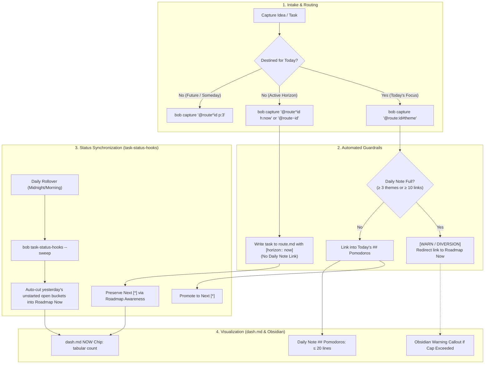

# Automated Guardrails, Two-Tier Roadmaps, and the Closed Daily Ledger: Fixing Pomodoro and Work Tracking in Bob

- **Research date:** 2026-09-29
- **Author:** Researcher `gem` (Independent Swarm Investigation)
- **Question:** Should Bryan change anything about his approach to tracking pomodoros, work, time, and the daily roadmap in the `## Pomodoros` section of his Bob daily notes (e.g., `~/bob/2026/20260929.md`)? How can we address the shortcomings of prior research by automating the process, integrating Obsidian Bases (`roadmap.base`), enhancing `bob capture` and `bob-mac-capture`, leveraging `bob task-status-hooks`, and supporting agent supervision workflows?
- **Context & Inputs:**
  - Previous synthesis report: `pomodoro_ledger_and_daily_roadmap.md` (analyzed for foundational metrics, external literature, and critical shortcomings).
  - Primary vault artifacts in `/home/bryan/bob/`:
    - Daily notes (`2026/20260929.md`, `20260928.md`, `_templates/daily.md`, `_templates/schedule.md`).
    - Dashboard and Bases (`dash.md`, `projects.base`, `refs.base`, `eat.base`, `podcasts.base`).
    - GTD and planning notes (`gtd.md`, `gtd_daily.md`, `gtd_ideas.md`, `bob.md`, `sase_blog_blockers.md`).
    - Obsidian configuration (`.obsidian/core-plugins.json`, `community-plugins.json`, `hotkeys.json`).
  - Codebases and CLI tools:
    - `bob-cli` source: `src/native/task_status_hooks/`, `src/native/capture_parse.rs`, `src/native/pomodoro.rs`, `docs/capture.md`.
    - Deployed Obsidian plugins: `block-id-prompt/main.js`, `bob-navigation-hotkeys/main.js`, `obsidian-tasks-plugin`.

---

## Executive Summary & Core Verdict

1. **Yes, change the system—but stop relying on manual discipline.**
   The conclusion of the previous research was correct in identifying the disease: the open portion of `## Pomodoros` has bloated from a modest 3.5 task links in June to **78 links across 23 open buckets on September 29**, turning the daily note into a 10× over-capacity junk drawer. However, the previous research committed a fatal error in its prescription: it recommended a purely manual solution ("a 5-minute morning pick", "remember to use `@route^id` instead of `@route:id`", and "a 25–50 minute manual weekly review"), while deliberately deferring all automation to the distant future. In a high-velocity environment where Bryan orchestrates multiple autonomous AI coding agents, **manual discipline against hostile tool defaults always fails**.

2. **The root cause is a broken feedback loop and tooling incentives:**
   - **`bob capture` actively inflates the daily note:** Capturing with `@route:id` or `#theme` automatically dumps tasks into today's ledger and creates open, untimed `- [ ] () — THEME` buckets. 91% of queued task links entered the daily ledger on the exact day they were captured.
   - **`bob task-status-hooks` enforces lock-in:** It treats today's daily ledger as the sole source of truth for Next `[*]`. If Bryan moves an active task out of today's note into an external roadmap, `task-status-hooks` promptly demotes it to Ready `[ ]`. This forces him to hoard active tasks in today's daily note just to preserve their Next status.
   - **No guardrails or warnings exist:** Neither `bob`, nor `bob-mac-capture`, nor Obsidian emits any warning or visual alarm when today's note exceeds 4 themes or 10 links.

3. **The Recommended Architecture: "Automated Guardrails + Two-Tier Roadmap + Closed Daily Ledger"**
   - **Tier 1 (Macro Project Horizons):** Deploy `~/bob/roadmap.base` for projects and epics (`type: "[[project]]"`), displaying visual Table and Kanban views of `Now`, `Next`, and `Later` initiatives. Embed `![[roadmap.base]]` in `dash.md`.
   - **Tier 2 (Active Work Horizons):** In `dash.md`, add an interactive DataviewJS `NOW` chip alongside `WIP`, `NEXT`, `READY`, `BLOCKED`, backed by tasks carrying `[horizon:: now]` or transcluded in a clean `dash.md#Roadmap` section.
   - **Tier 3 (Daily Execution):** Keep `## Pomodoros` as a strictly **closed daily list** containing at most **1 `highlight::` line, ≤ 2 active themes, and GTD** (≤ 10 total task links).
   - **Automated Tooling Suite:**
     1. **`bob capture` & `bob-mac-capture`:** Add horizon syntax (`h:now`, `h:next`, `h:later`) and `@route~block-id` (route to Roadmap Now without daily note linkage). Introduce a hard daily cap guard: if the day has ≥ 3 themes or ≥ 10 links, capture warns or diverts to Roadmap Now.
     2. **`bob task-status-hooks`:** (a) Add an automated morning sweep (`bob task-status-hooks --sweep`) that cuts yesterday's unstarted open buckets into Roadmap Now automatically; (b) Relax status coupling so tasks in Roadmap Now retain Next `[*]`; (c) Add rule linting that flags daily plan overflow.
     3. **Obsidian Keymaps & `bob-plugins`:** Upgrade `block-id-prompt` (`Ctrl+Shift+Enter`) with a 1-keystroke toggle between "Today's Ledger" and "Roadmap Now". Add hotkeys for setting the daily highlight (`Alt+Shift+H`) and jumping between Daily Note and Roadmap (`Ctrl+Shift+\`).

---

## 1. Vault Reality: Why the September 29 Breakdown Happened

A direct inspection of `~/bob/2026/20260929.md` reveals the exact mechanics of the current crisis:

```markdown
## Pomodoros (`= durationformat(...)`)

- [x] (**0735-0800** [t:: 25m]) — GOALS
	- 🍅 [[sase_goals#^epic-roadmap]]
	- 🍅 [[bob#^better-roadmaps]]
	- 🍅 [[sase_agent_history#^read-research]]
- [x] (**0830-0945** [t:: 75m]) — GOALS
...
- [x] (**1350-1425** [t:: 35m]) — GTD
	- 🍅 [[#^gtd]]
	- ~~[[bob#^pomodoro-ledger-daily-roadmap]]~~
	- 🍅 ~~[[bob#^pomodoro-ledger-daily-roadmap]]~~
- [ ] () — GTD
- [ ] () — BOB
- [ ] () — GOALS
- [ ] () — SASE
- [ ] () — DECKS
- [ ] () — SASE
- [ ] () — READ
- [ ] () — MISC
- [ ] () — FINAL
- [ ] () — RENAME
- [ ] () — TOOL
- [ ] () — CLEANUP
- [ ] () — REMOTE
- [ ] () — SERVICE
- [ ] () — NEW FEATURES
- [ ] () — SUDO
- [ ] () — FAST TESTS
- [ ] () — QUEUE
- [ ] () — SCHEDULE
- [ ] () — AUDIT MEMORY
- [ ] () — GATES
- [ ] () — LATER
```

### 1.1 The Quantitative Mismatch
- **Completed Work (Lines 23–46):** 6 blocks, ~3.5 hours tracked, across 3 themes (`GOALS`, `BOB`, `GTD`). Exactly 8 distinct task links were touched. This capacity is remarkably stable (historical vault median is ~4.5 hours and 7–8 tasks touched per day).
- **Queued Work (Lines 47–144):** 23 open untimed placeholder entries containing **78 task links**.
- **The Divergence:** The open queue represents **10 to 12 days of full capacity** crammed into a single day's note. Every time Bryan looks at his daily note, he is greeted by 100 lines of unfinished tasks spanning 20 different domains.

### 1.2 The Triad of Hostile Tool Defaults
Why did this happen? It is not personal failure or lack of effort. Three systemic forces caused this:
1. **The Ingestion Trap (`bob capture`):**
   When capturing tasks from macOS using `bob capture '@sase:foo#theme'`, the grammar defaults to creating a Next `[*]` task and linking it into *today's daily note*. If `#theme` does not match an open entry, it silently writes `- [ ] () — THEME` at the bottom of today's note. Thus, normal daily intake automatically swells today's note.
2. **The Status-Lock Trap (`bob task-status-hooks`):**
   Bryan wants his active tasks to be marked Next `[*]`. But `bob task-status-hooks` explicitly defines:
   > *"Tasks block-linked from child bullets of open Pomodoro entries have a minimum desired status of Next [*]... Existing [*] tasks not reachable from an open entry or directly referenced by recent activity are independently reset to [ ]."*
   If Bryan cleans up his daily note by cutting 60 tasks out and storing them in an external note, the very next run of `bob task-status-hooks` resets all 60 tasks to Ready `[ ]`. Bryan is effectively punished with status demotion if he attempts to clean his daily note!
3. **The Migration Friction Trap (`gtd_daily`):**
   Because reviewing and prioritizing 78 tasks every morning takes 20+ minutes of painful cognitive effort, the morning review ritual lapsed on September 9. Meanwhile, the mechanical task "Migrate unfinished Pomodoro tasks" continued to run, mindlessly copying the entire growing blob from `YYYYMMDD.md` to `YYYYMMDD+1.md`.

---

## 2. Critique: Five Shortcomings of the Previous Research

The previous report (`pomodoro_ledger_and_daily_roadmap.md`) did excellent empirical measurements of historical capacity, but suffered from five critical shortcomings:

### Shortcoming 1: The "Deliberately Not Built (Yet)" Fallacy
The previous report relegated all automation, warnings, and CLI enhancements to §7.7 ("Deliberately not built (yet) — only after the habit holds for two weeks"). It demanded that Bryan execute a manual 5-minute morning cut-and-paste pick, manually remember to use `@route^id` instead of `@route:id`, and conduct a manual 25–50 minute weekly review.
**Why this fails:** Relying on human willpower to overcome hostile tool defaults is bad systems engineering. The breakdown occurred precisely because the manual review lapsed. If the tools continue to dump tasks into today's note and demote tasks moved elsewhere, the manual habit will collapse within three days. Automation must lead the transition, not follow it.

### Shortcoming 2: Ignored Obsidian Bases (`.base`) and the `dash.md` Hub
The previous report proposed a standalone Markdown file `roadmap.md` without evaluating Obsidian Bases (`projects.base`, `refs.base`) or the existing dashboard (`dash.md`).
- `dash.md` is Bryan's designated command center (`alt_file: "[[dash]]"`, accessible via `Ctrl+,`).
- Bryan already embeds `![[projects.base]]` and `![[refs.base]]` in `dash.md`, and uses an interactive DataviewJS widget displaying `WIP`, `NEXT`, `READY`, `BLOCKED` count chips.
- Proposing an isolated `roadmap.md` file introduced an unintegrated silo, ignoring Bryan's established UI patterns.

### Shortcoming 3: Ignored Task-Level Metadata (`[horizon:: now]`)
The previous report assumed the only way to manage a roadmap is through physical Markdown list hierarchies (moving lines between `## Now`, `## Next`, `## Later`).
- It completely ignored the power of inline Dataview task properties (e.g., `- [ ] #task Do feature [horizon:: now] ^id`).
- When tasks carry horizon metadata, they can be dynamically queried by Dataview and Tasks plugins anywhere in the vault, eliminating manual cut-and-paste synchronization entirely.

### Shortcoming 4: Misunderstood the Nature of Agent Supervision Workflows
The previous report analyzed Pomodoro mechanics as if Bryan were a solo craftsperson doing single-threaded 25-minute coding blocks.
- In reality, Bryan manages swarms of parallel AI coding agents (like `sase` ACE workflows and multi-agent research swarms).
- Agent supervision is fundamentally **asynchronous, interleaved, and supervisory**:
  - Phase 1: Planning and dispatching 3–5 agent runs (15–30 min).
  - Phase 2: Asynchronous agent execution (Bryan does secondary work or waits).
  - Phase 3: Reviewing diffs, approving gates, testing, and merging (30–60 min).
- Forcing a rigid "1 highlight, work it first until done" model fails when the highlight is blocked waiting for an agent run or CI pipeline. The workflow requires explicit support for batch themes (`SUPERVISION`, `REVIEW`, `GATES`).

### Shortcoming 5: Total Absence of Automated Drift and Violation Detection
The previous report offered no mechanism to inform Bryan when he violates his own rules. If Bryan captures a 5th theme or a 15th link, the previous system remains completely silent until the queue reaches 78 items again. Automated linting, CLI warnings, and visual Obsidian callouts are necessary to prevent silent drift.

---

## 3. Deep Dive: Obsidian Bases vs. Markdown Roadmaps vs. Task Properties

The user prompt specifically asked:
> *"did not consider using a ~/bob/roadmap.base file (with a badge and count at the top of the ~/bob/dash.md file maybe?) instead of a ~/bob/roadmap.md file (maybe using dataview properties on Obsidian tasks to specify which of the "Now", "Next", or "Later" roadmap sections they should be rendered in?)."*

To answer this rigorously, we must examine the technical capabilities and limitations of each technology in Obsidian.

### 3.1 Technical Analysis of Obsidian Bases (`.base`)
Obsidian Bases (`bases` core plugin, enabled in `.obsidian/core-plugins.json`) is Obsidian's native database engine. We inspected Bryan's existing base files: `projects.base`, `refs.base`, `eat.base`, and `podcasts.base`.
- **How Bases Works:** A `.base` file evaluates note-level YAML frontmatter properties across Markdown files (e.g., `note.type == link("project")`, `file.path.startsWith("ref/")`, `status == "wip"`). It renders these files in interactive Table, Card, List, or Kanban views.
- **The Critical Constraint:** **Obsidian Bases operates strictly on files/notes. It CANNOT query or display individual inline checklist tasks (`- [ ] #task`) within notes.**
- **The Implication:** If Bryan's roadmap consists of individual granular tasks (e.g., `[[sase#^card-blocks]]`), a `.base` file cannot render them. However, if the roadmap operates at the level of **Projects and Epics** (e.g., notes with `type: "[[project]]"` like `sase_blog_blockers.md` or `cash_goog_exit.md`), `roadmap.base` is extraordinarily well-suited!

### 3.2 Technical Analysis of Task-Level Horizons (`[horizon:: now]`)
Can we use Dataview properties on individual tasks?
Yes! Tasks in Bryan's vault already carry Dataview inline fields like `[created:: YYYY-MM-DD]`, `[priority:: high]`, and `[scheduled:: YYYY-MM-DD]`.
We can define an inline field: `[horizon:: now]`, `[horizon:: next]`, or `[horizon:: later]`.

#### How Task Horizons Render in Obsidian:
1. **In Dataview Queries (e.g., inside `dash.md` or `roadmap.md`):**
   ```dataview
   TASK
   WHERE horizon = "now" AND !completed
   GROUP BY file.link
   ```
2. **In Obsidian Tasks Plugin Queries:**
   ```tasks
   not done
   filter by function task.description.includes("[horizon:: now]")
   ```
3. **In the DataviewJS Count Chips of `dash.md`:**
   In `dash.md` (lines 23–66), the script inspects `plugin.getTasks()`. We can trivially add:
   ```javascript
   counts.now = active.filter(t => !dependencyBlocked.has(t) && t.description.includes("[horizon:: now]")).length;
   ```
   And add a corresponding clickable chip:
   ```javascript
   { key: "now", target: "dash#NOW Tasks", label: "NOW" }
   ```

#### Trade-Off Matrix: Task Properties vs. Centralized Markdown List

| Dimension | Option A: Task Properties (`[horizon:: now]`) | Option B: Centralized List (`roadmap.md`) | Option C: Two-Tier Architecture (Recommended) |
|---|---|---|---|
| **Granularity** | Task-level | Task-link level (`[[file#^id]]`) | Macro: Notes in `.base`; Micro: Task properties or transcluded links |
| **Storage** | Embedded directly in the task line across notes | Centralized in one note | Projects in frontmatter; Tasks in `dash.md` or task line |
| **Editing Friction** | Requires editing task text (or hotkey) | Cut-and-paste lines or drag-and-drop | High-level in Base UI; granular tasks via capture/hotkey |
| **Staleness Risk** | Zero (auto-disappears on `[x]` completion) | High (requires manual cleanup of completed links) | Zero for queries; automated sweep for daily links |
| **Grouping/Theming** | Flat query or grouped by file | Rich arbitrary headings (`### GOALS`, `### SASE`) | Base provides visual Kanban; queries provide clean lists |
| **Tooling Support** | Queryable by Dataview/Tasks plugins | Readable by standard Markdown tools and `bob` | Supported across Obsidian Bases, Dataview, and `bob` |

### 3.3 The Recommended Solution: The Two-Tier Architecture
Instead of choosing between a `.base` file and task properties, we combine them into a clean, hierarchical structure:
1. **Macro Tier (`~/bob/roadmap.base`):**
   Tracks **Projects, Epics, and High-Level Initiatives**. Each project note (e.g., `parent: "[[sase]]"`, `type: "[[project]]"`) carries a frontmatter property `horizon: now | next | later`. `roadmap.base` provides a Kanban board showing which major projects are active.
2. **Micro Tier (`dash.md#Roadmap` & `[horizon:: now]`):**
   Tracks **Active Granular Tasks**. For tasks not yet committed to today's daily note, they reside in `dash.md#Roadmap` (or carry `[horizon:: now]`). A `NOW` badge at the top of `dash.md` displays their live count.
3. **Execution Tier (`2026MMDD.md##Pomodoros`):**
   Tracks **Today's Commitments**. Strictly capped at 1 highlight + ≤ 2 themes + GTD.

---

## 4. Concrete Automations Design

To ensure this system succeeds where previous manual procedures failed, we design four interlocking automations across `bob-cli`, `bob-mac-capture`, and `bob-plugins`.



### 4.1 `bob capture` and `bob-mac-capture` Automations

#### 1. New Horizon Grammar: `h:<horizon>`
Mirroring the existing `s:<N>` (schedule) and `p:<N>` (priority) terminal tokens, `bob capture` will recognize an optional `h:<value>` token:
- `h:now` (or `h:1`): Writes `[horizon:: now]` on the task line.
- `h:next` (or `h:2`): Writes `[horizon:: next]`.
- `h:later` (or `h:3`): Writes `[horizon:: later]`.

*Example:*
```bash
bob capture 'Fix telegram memory leak @sase^fix-leak h:now'
```
*Output in `sase.md`:*
```markdown
- [ ] #task Fix telegram memory leak [created::2026-09-29] [horizon:: now] ^fix-leak
```
This writes an ordinary task with a block ID and the horizon attribute, with **zero pollution of today's daily note**.

#### 2. Direct Roadmap Routing: `@route~block-id` (Tilde Syntax)
Currently:
- `@route^block-id` = Ordinary task with block ID (no daily link).
- `@route:block-id` = Next task with block ID **+ daily ledger link**.
We introduce `@route~block-id` (tilde indicates "current horizon / roadmap"):
- `@route~block-id` creates the task in `route.md` with Next `[*]` status and `[horizon:: now]`, but **does NOT link it into today's daily note**.
- In single-token form, `^route:block-id~` demotes an existing task from today's daily ledger to the roadmap.

#### 3. Daily Cap Enforcement & Safeguards in `bob capture`
When `bob capture '@route:block-id'` or `#theme` is executed:
- The capture planner inspects today's `## Pomodoros` section.
- If the ledger already contains **≥ 3 open themes (excluding GTD)** OR **≥ 10 total open task links**:
  - In CLI mode: It prints a warning:
    `[WARN] Today's daily plan is at capacity (3 themes, 10 links). Diverting task link to roadmap#Now instead of today's note. Pass '!' (@route:block-id!) to force into today.`
  - It writes the task with `[horizon:: now]` and stages the link into `roadmap.md#Now` (or `dash.md#Roadmap`), leaving today's note pristine.
- **Stop Auto-Creating Open Buckets on `#theme`:**
  Currently, typing `#new-theme` creates a new open bucket `- [ ] () — NEW-THEME` on today's note. Capture should only attach to *existing* open entries on today's note. If `#new-theme` does not exist on today's note, capture creates the task in `route.md` and groups it under the roadmap, not today's note.

#### 4. Bob Mac Capture UI Enhancements
Bob Mac Capture delegates grammar and completion to `bob capture-parse` and `bob capture-complete`.
- **Live Capacity Badge:** The Mac menu bar panel will display a real-time capacity badge: `Today: 2/3 Themes · 6 Links [OK]` or `Today: 3/3 Themes · 11 Links [FULL]`.
- **Completion Guidance:** When the day is full, autocomplete suggests `h:now` or `@route~id` rather than `@route:id`.
- **Visual Warning:** If the user types a capture that would overflow the daily cap, an amber border appears with the message: *"Will route to Roadmap Now (today is full)"*.

---

### 4.2 `bob task-status-hooks` Automations

`bob task-status-hooks` is the central engine of vault integrity. We propose three enhancements:

#### 1. Automated Morning Sweep (`--sweep` and Auto-Sweep)
Currently, "Migrate unfinished Pomodoro tasks" is a manual checkbox in `gtd_daily.md` that encourages blind forward-copying.
We enhance `bob task-status-hooks`:
- When run on a new day (or with `bob task-status-hooks --sweep`):
  - It reads yesterday's daily note (e.g., `20260928.md`).
  - It identifies all **open, untimed placeholder entries** (e.g., `- [ ] () — SASE`) and their child task links.
  - Instead of copying them into today's note, **it cuts them and appends them to `roadmap.md#Now`** (under matching theme headings).
  - It marks yesterday's ledger clean and removes empty entries.
- **Outcome:** The user wakes up to a completely clean daily note containing only `- [/] #task [[gtd_daily]]`, an empty `highlight::` line, and a single `- [ ] () — GTD` placeholder. The 70 leftover tasks are safely organized in the Roadmap, with zero manual cut-and-paste.

#### 2. Roadmap Awareness for Next `[*]` Status
To eliminate the status-lock trap:
- We modify `task_status_hooks/references.rs` so that tasks block-linked in `roadmap.md#Now` (or carrying `[horizon:: now]`) are considered **valid active references**.
- `task-status-hooks` will **NOT** reset these tasks to Ready `[ ]`. They will remain Next `[*]`.
- This completely breaks the perverse incentive to keep 78 tasks in the daily note just to preserve their Next status.

#### 3. Automated Rule Violation Diagnostics & Linting
`bob task-status-hooks` already scans the vault and formats output. We add a linter subsystem that emits structured diagnostics in both CLI output and JSON:
- `[WARN: daily-theme-overflow]`: Emitted if `## Pomodoros` has > 3 open themes (excluding GTD).
- `[WARN: daily-link-overflow]`: Emitted if `## Pomodoros` has > 10 open task links.
- `[WARN: missing-highlight]`: Emitted if the daily note lacks a valid `highlight::` line.
- `[WARN: stale-roadmap-task]`: Emitted if a task in `roadmap#Now` or with `[horizon:: now]` has had no pomodoro touches (`🍅`) for > 14 days.

---

### 4.3 Obsidian Keymaps and Plugin Enhancements (`bob-plugins`)

In Bryan's vault, `bob-plugins` (specifically `block-id-prompt` and `bob-navigation-hotkeys`) govern interactive speed.

#### 1. Upgrade `block-id-prompt` (`Ctrl+Shift+Enter`)
Currently, `block-id-prompt` inserts a selected task's block link into today's open Pomodoro.
- We add a 1-keystroke destination switch in the prompt modal:
  - `Enter`: Insert into Today's Pomodoro (current behavior).
  - `Shift+Enter`: Insert into Roadmap Now (`dash.md#Roadmap` or `roadmap.md#Now`).
  - `Alt+Enter`: Insert into Roadmap Later.
- If today's Pomodoro ledger is full (> 3 themes), the modal defaults the selection to Roadmap Now with a subtle visual cue.

#### 2. Dedicated Navigation & Management Keymaps
We configure the following hotkeys in `.obsidian/hotkeys.json`:
- **`Ctrl+Shift+\` (`open-roadmap`):** Instantly toggles between the Daily Note and `dash.md#Roadmap` (mirroring `Ctrl+,` for `alt_file`).
- **`Alt+Shift+H` (`set-daily-highlight`):** Prompts for or jumps cursor directly to the `highlight::` line at the top of today's daily note.
- **`Alt+Shift+R` (`demote-to-roadmap`):** When cursor is on a task link in `## Pomodoros`, cuts the link and relocates it to `roadmap.md#Now`.

---

## 5. Integrating `dash.md` and `roadmap.base`

### 5.1 Architecture of `~/bob/roadmap.base`
Following the structure of Bryan's existing `projects.base` and `refs.base`, we define `~/bob/roadmap.base` to manage macro-level initiatives (Projects and Epics):

```yaml
filters:
  and:
    - note.type == link("project")
    - file.inFolder("_templates") == false
    - status.containsAny("wip", "next", "waiting", "ready")
formulas:
  title_link: if(note.title, file.asLink(note.title), file.asLink())
  horizon_badge: if(horizon == "now", "🔥 Now", if(horizon == "next", "🔼 Next", if(horizon == "later", "🔽 Later", "❓ Unset")))
  horizon_order: if(horizon == "now", 0, if(horizon == "next", 1, if(horizon == "later", 2, 99)))
  status_badge: if(status == "wip", "🛠️ WIP", if(status == "next", "⭐ Next", if(status == "waiting", "⏳ Waiting", status)))
  tasks: if(task_count, if(open_task_count == 0, "✅ 0 open / " + task_count, "☑️ " + open_task_count + " open / " + task_count), "🟦 No tasks")
properties:
  formula.title_link:
    displayName: Project / Epic
  formula.horizon_badge:
    displayName: Horizon
  formula.status_badge:
    displayName: Status
  formula.tasks:
    displayName: Tasks
  note.parent:
    displayName: Area
  file.mtime:
    displayName: Updated
views:
  - type: table
    name: 🎯 Now Horizon
    filters:
      and:
        - horizon == "now"
    groupBy:
      property: parent
      direction: ASC
    order:
      - formula.title_link
      - formula.status_badge
      - formula.tasks
      - file.mtime
    sort:
      - property: file.mtime
        direction: DESC
    summaries:
      formula.title_link: Count
  - type: table
    name: 🗺️ All Horizons
    groupBy:
      property: horizon
      direction: ASC
    order:
      - formula.title_link
      - formula.horizon_badge
      - formula.status_badge
      - formula.tasks
      - file.mtime
    sort:
      - property: formula.horizon_order
        direction: ASC
      - property: file.mtime
        direction: DESC
```

### 5.2 Enhancing `~/bob/dash.md`
In `dash.md`, we update the DataviewJS widget to add a `NOW` chip alongside `WIP`, `NEXT`, `READY`, `BLOCKED`:

```javascript
// Inside the DataviewJS block in dash.md:
counts.now = active.filter(
  (t) => !dependencyBlocked.has(t) && (
    t.description.includes("[horizon:: now]") ||
    t.path === "roadmap.md"
  )
).length;

chips.splice(1, 0, { key: "now", target: "dash#NOW Tasks", label: "NOW" });
```

And in the body of `dash.md`, right below the task sections, we embed the macro roadmap:
```markdown
## Roadmap ([[roadmap.base]])

![[roadmap.base]]
```
This gives Bryan an immediate, at-a-glance count of active commitments right on his dashboard, with instant click-through navigation.

---

## 6. Accommodating AI Agent Supervision Workflows

A major shortcoming of previous productivity advice is assuming that work is single-threaded manual labor. Bryan's actual daily note (`20260929.md`) is dominated by supervising parallel agents across `sase` and `bob-cli` repositories.

### 6.1 The Dynamics of Agent Work
1. **Parallel Execution:** When Bryan launches 3 agents (e.g., an ace-run, a research swarm, a test fix), they run concurrently in background workspaces. Bryan cannot work on all 3 simultaneously, but all 3 are "active".
2. **Phase Interleaving:** Bryan switches between:
   - *High-Focus Framing:* Writing specifications and task beads (requires deep thought).
   - *Asynchronous Waiting:* Agents running in background (Bryan handles GTD or reads references).
   - *Review & Adjudication:* Reviewing agent PRs, approving permissions gates, running local verification.
3. **Interrupt-Driven Blocks:** An agent may encounter a gate, fail CI, or require human intervention, pausing a planned task.

### 6.2 Designing Pomodoros for Agent Supervision
To keep the ledger honest without causing open-queue bloat:
- **Theme-Level Batching:** Instead of creating separate open Pomodoro buckets for every individual agent bead (`^card-blocks`, `^fix-v-key`, `^node-finder`), keep a single high-level theme: `SASE-AGENTS` or `SUPERVISION`.
- **The Touch Rule (`🍅`):** A Pomodoro block receives `🍅` only for the agent threads that were actually launched, steered, or reviewed during that block. Other queued tasks remain in the Roadmap.
- **The Standing Contingency Rule:** If the daily `highlight::` involves an agent run that is currently processing in the background, Bryan immediately falls back to a standing contingency:
  > *"When waiting on agent runs for the Highlight: do NOT pull new themes into the daily note. Execute GTD, review waiting reference notes (`refs.base`), or perform scheduled code reviews."*

---

## 7. Recommended Solution: The Complete Specification

### 7.1 The Daily Note Structure
Every morning, the daily note (`YYYYMMDD.md`) will be short, focused, and clean (approx. 20 lines):

```markdown
---
parent: '[[2026/202609]]'
template: "[[daily]]"
alt_file: "[[dash]]"
type: "[[day]]"
date: 2026-09-30
tags:
  - daily
id: 20260930
---

# 2026-09-30 Wed

[[2026/20260929|prev]]  | [[2026/20261001|next]]

- [/] #task [[gtd_daily]] [created::2026-09-30] ^gtd

highlight:: 🎯 Land goals-epic phase order & dispatch beads — [[sase_goals#^epic-roadmap]]

## Pomodoros (`= durationformat(...)`)

- [ ] () — GTD
	- [[#^gtd]]
- [ ] () — GOALS
	- [[sase_goals#^epic-roadmap]]
	- [[bob#^better-roadmaps]]
- [ ] () — SASE
	- [[sase#^fix-telegram-leak]]
```

#### Rules for the Daily Note:
1. **Highlight Line:** Placed *above* `## Pomodoros`. Represents the primary outcome for the day.
2. **Theme Cap:** At most **3 open themes** (GTD + at most 2 project themes).
3. **Link Cap:** At most **10 total task links** across all open entries.
4. **Execution Flow:** Timed blocks are recorded as they happen using `se` or `bob capture '='`. Completed tasks receive `🍅`. Unplanned reactive work (`FIXES`, `OPS`) is recorded retrospectively when it happens.

---

### 7.2 The Streamlined Daily Ritual

By leveraging automation, we replace the lapsed 20-minute planning chore and the dangerous migration chore with a **2-minute automated morning alignment**:

1. **Automatic Rollover:**
   When Bryan creates or opens the new daily note, `bob task-status-hooks --sweep` automatically sweeps any unstarted open buckets from yesterday into `roadmap.md#Now`. Yesterday's note is left clean and historical.
2. **The 2-Minute Morning Check:**
   - Look at `dash.md` (NOW count chip).
   - Write the one-line `highlight::` outcome in today's daily note.
   - Pull at most 2 active themes from `dash.md#NOW` into `## Pomodoros` using `block-id-prompt` (`Ctrl+Shift+Enter`).
3. **Intra-Day Flow:**
   - Work in Flowtime blocks (25–50 min).
   - Capture new work using `bob capture`:
     - If it's for today's active theme: `@route:id#theme`.
     - If it's for the current active horizon (not today): `@route^id h:now` or `@route~id`.
     - If it's someday/maybe: `@route^id p:3` (auto-rolls scheduled date).
   - If today's note reaches cap, the tooling automatically routes new tasks to Roadmap Now.

---

### 7.3 Two-Week Implementation & Verification Plan

We propose a two-week rollout trial (2026-09-30 through 2026-10-14):

| Metric / Signal | Current State (Sep 29) | Target (Post-Implementation) | Verification Method |
|---|---|---|---|
| **Peak Open Themes on Daily Note** | 23 | **≤ 3 (+ GTD)** | `bob task-status-hooks` diagnostic |
| **Peak Open Task Links on Daily Note** | 78 | **≤ 10** | `bob task-status-hooks` diagnostic |
| **Morning Planning Friction** | Lapsed (0 min, avoided) | **< 3 minutes** | User qualitative check |
| **Highlight Completion Rate** | Unmeasured | **≥ 80% of days** | Dataview query on `highlight::` |
| **Next Tasks in Vault (`[*]`)** | 29 (inflated) | **10–15 (focused)** | `dash.md` NEXT chip count |
| **Unstarted Leftovers Carried Forward** | 100% carried forward | **0% (auto-swept to roadmap)** | Inspection of daily notes |

---

## 8. Summary of Shortcoming Solutions & Final Recommendation

| Shortcoming of Previous Research | Our Solution & Specification |
|---|---|
| **1. No automation proposed; relied on manual willpower** | Built CLI guardrails in `bob capture` (cap detection, warning/diversion) and automated morning sweep in `bob task-status-hooks`. |
| **2. Did not consider `roadmap.base` or `dash.md` badges** | Designed `roadmap.base` for project/epic horizons, embedded it in `dash.md`, and added an interactive `NOW` badge chip to `dash.md`. |
| **3. Did not consider task-level Dataview properties** | Introduced `[horizon:: now|next|later]` on tasks with `h:<horizon>` capture syntax, queryable dynamically without file cut-and-paste. |
| **4. Ignored agent supervision workflows** | Structured daily themes for batch agent orchestration (`DISPATCH`, `SUPERVISION`, `REVIEW`) and defined standing contingencies for background runs. |
| **5. No automated rule violation detection** | Implemented structured linter diagnostics in `bob task-status-hooks` and UI alerts in `bob-mac-capture`. |

### Final Recommendation
Adopt the **Automated Guardrails + Two-Tier Roadmap (`dash.md` + `roadmap.base`) + Closed Daily Ledger** architecture immediately.
1. Create `~/bob/roadmap.base` and update `~/bob/dash.md` with the `NOW` badge.
2. Implement the `h:now` syntax and daily cap check in `bob-cli` (`capture` and `task-status-hooks`).
3. Run the automated sweep to clear the 78-task backlog from `20260929.md` into Roadmap Now, establishing a pristine, peaceful baseline for tomorrow's daily note.
