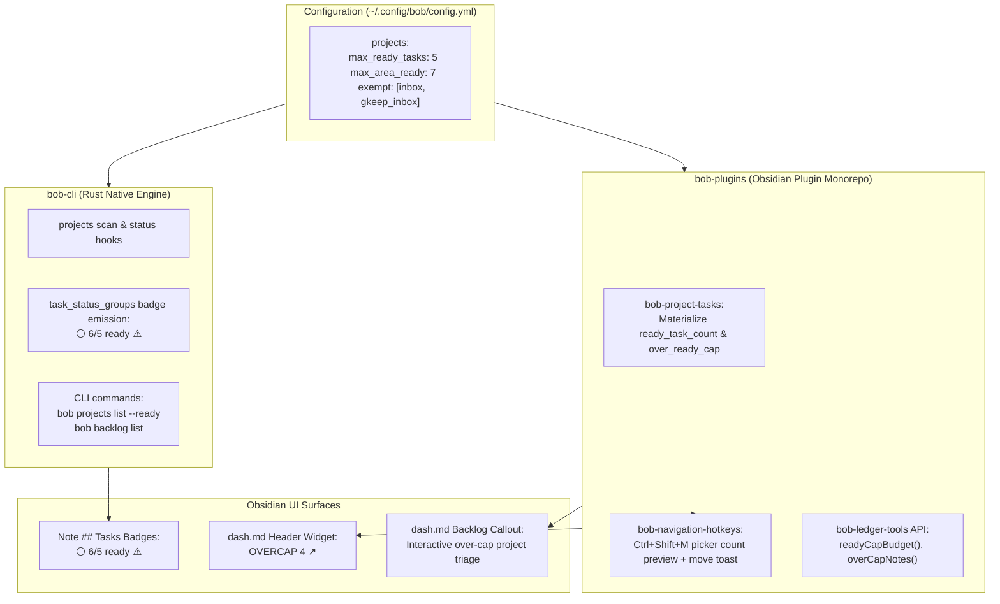

# Research Report: Area and Project Ready Task Limits, Enforcement, and Diagnostics

**Author:** Researcher `gem` (5-Researcher Swarm)  
**Date:** 2026-10-01  
**Project:** `bob-cli` / `bob-plugins` / Bob Vault (`~/bob/`)  
**Target File:** `sase/repos/research/202610/area_project_ready_task_limits__gem.md`  

---

## 1. Executive Summary & Thesis

During morning GTD review, a personal task management system must answer two fundamental questions: *What should I commit to today?* and *Are my active project backlogs well-formed and actionable?*

In the current Bob system, global WIP (Work In Progress) limits are strictly defined and monitored for active execution:
- Today's Pomodoro ledger enforces caps on themes (`max_themes: 3`) and open links (`max_links: 10`).
- Global lane caps exist for active work: `PENDING` (`[/]` In Progress, cap 10), `NEXT` (`[*]` Next, cap 15), and `READY` (global confirmed backlog in `dash.md`, soft cap 100).

However, **there is currently no per-project or per-area WIP limit on ready tasks**. As a result, an individual project or area note can accumulate dozens—or even over 60—ready `[ ]` tasks in its intake pool. This unconstrained accumulation causes severe friction:
1. **Backlog Hoarding & Decision Paralysis**: When reviewing a project note with 30–60 ready tasks during morning GTD, cognitive fatigue sets in. The user cannot quickly scan what is immediately pullable.
2. **Project Dilution in `dash.md`**: Because `dash.md#READY Tasks` is a shared global pool grouped by note path, a single sprawling project (such as `sase.md` with 62 ready tasks) floods the dashboard, pushing smaller, focused projects out of view.
3. **Lack of Project Decomposition**: Tasks that should be broken out into dedicated sub-projects or deferred into future scheduled windows instead linger as raw ready tasks in the parent note.

### Thesis
Capping the number of ready tasks at $N$ (default 5) per area and project note is a **fundamentally sound GTD and Kanban practice**, but a **naive, flat implementation will fail or generate frustrating noise**. 

To make this feature intuitive, reliable, and beautiful, the design must introduce five critical adjustments to the initial premise:
1. **Differentiate Areas vs. Finite Projects**: Areas of responsibility (e.g., `cash.md`, `body.md`) represent continuous maintenance domains without endpoints; projects represent discrete deliverables. They have different task accumulation dynamics.
2. **Strictly Exempt Inboxes**: Inboxes (`gkeep_inbox.md`, `inbox.md`, `mac_inbox.md`) carry `type: [[area]]` in the vault today, but are uncurated intake funnels, not curated project backlogs. They must be exempt from ready caps.
3. **Proactive Picker Feedback Beats Post-Move Toasts**: While post-move toasts (`Notice`) are necessary, warning the user *inside the destination picker* (`Ctrl+Shift+M`) before they press Enter prevents accidental overfilling before it occurs.
4. **Preserve Soft Limits (No Hard Operation Blocking)**: In accordance with Bob's architectural decisions, limits must remain soft warnings and diagnostic badges. Hard-blocking task movement or creation disrupts capture flow and creates resentment against the tool.
5. **Harmonize the Multi-Layer Architecture**: The solution must span `~/.config/bob/config.yml` (centralized configuration), `bob-cli` (Rust scanner, `bob projects list`, status-group badges), `bob-plugins` (`bob-navigation-hotkeys`, `bob-project-tasks`, `bob-ledger-tools`), and `dash.md` (morning GTD diagnostic callouts and chips).

---

## 2. Background & Current Architecture Analysis

### 2.1 The Bob Task Status & Lane Architecture
In the Bob ecosystem, task checkboxes adhere to Obsidian Tasks and Bob conventions:
- `[ ]` : **Ready** (TODO). Pullable work waiting for commitment.
- `[*]` : **Next**. Committed work queued for upcoming Pomodoros. Sticky lane (raised by ledger linking or `Alt+N`).
- `[/]` : **In Progress / PENDING**. Active WIP. Sticky lane (set by `=x` session start or `Alt+N`).
- `[?]` : **Blocked**. Derived status (open dependency via `[dependsOn:: ...]` or future date `[scheduled:: > today]`).
- `[x]` / `[X]` : **Done**. Completed work.
- `[-]` : **Canceled**. Abandoned work.

Under **Decision 3.1.4 (`task-lanes-are-sticky`)**, lanes are sticky: removing a Pomodoro link never lowers `[*]` or `[/]` back to `[ ]`; only explicit release via `Alt+N` returns them to Ready.
Under **Decision 3.1.5 (`ready-is-freshness-gated`)**, the global `READY` section in `dash.md` is freshness-gated: unreviewed `new` tasks and stale `rotten` tasks are routed to review queues, leaving `READY` as the confirmed backlog.

### 2.2 Status Grouping in Area and Project Notes (`task_status_groups`)
In `bob-cli` (`src/native/task_status_groups/mod.rs` and `docs/task-status-hooks.md`), `bob task-status-hooks` automatically organizes `## Tasks` sections in eligible `[[area]]` and `[[project]]` notes into canonical subheadings:
- **Intake**: Plain list directly under `## Tasks`. Contains unheaded, unblocked, non-hidden `[ ]` tasks (Ready work).
- **`### Next & In Progress`**: Marked with `<!-- bob:task-status-group:v1:active -->`. Holds `[*]` and `[/]` tasks.
- **`### Blocked`**: Marked with `<!-- bob:task-status-group:v1:blocked -->`. Holds `[?]` tasks.
- **`### Done & Canceled`**: Marked with `<!-- bob:task-status-group:v1:closed -->`. Holds `[x]` and `[-]` tasks.

Crucially, `task_status_groups` already generates a badge row directly under `## Tasks`:
```markdown
## Tasks
<!-- bob:task-status-badges:v1 -->
[`⚪ 61 open`](#Project#Tasks) · [`🔵 63 next/wip`](#Project#Tasks#Next%20&%20In%20Progress) · [`🔴 137 blocked`](#Project#Tasks#Blocked) · [`🟢 8 done/canceled`](#Project#Tasks#Done%20&%20Canceled)
```
Notice that **`⚪ <count> open` already exists as the exact representation of ready intake tasks** in every area and project note.

### 2.3 Current Area and Project Frontmatter
Project notes are identified by frontmatter:
```yaml
type: "[[project]]"
status: wip          # wip, waiting, done, canceled
parent: "[[parent_note]]"
task_count: 269      # materialized by bob-project-tasks
open_task_count: 124 # materialized by bob-project-tasks
```
Area notes are identified by:
```yaml
type: "[[area]]"
```
The `bob-project-tasks` plugin (`plugins/bob-project-tasks/main.js`) listens to metadata changes and updates `task_count` and `open_task_count` in frontmatter. However, it currently:
1. Only processes `type: [[project]]`, ignoring `type: [[area]]`.
2. Lumps all open statuses (`[ ]`, `[/]`, `[*]`) into `open_task_count`, completely obscuring how many tasks are actually Ready vs. In Progress vs. Next.

### 2.4 Empirical Vault Reality Check: Live Distribution of Ready Tasks
To ground this research in actual data rather than theoretical speculation, we ran an analysis across Bryan's live vault (`~/bob/`, containing 96 area and project notes).

The empirical count of unblocked Ready (`[ ]`) tasks reveals a stark pattern:

| Note Name | Kind | Ready Tasks (`[ ]`) | Total Open Tasks | Health Assessment |
| :--- | :--- | :---: | :---: | :--- |
| `gkeep_inbox.md` | Area | **65** | 65 | ⚠️ **Inbox anomaly**: Unprocessed hopper, not a project! |
| `sase.md` | Project | **62** | 262 | 🚨 **Severe overload**: Umbrella parent with 30 sub-projects! |
| `sase_remote.md` | Project | **12** | 15 | ⚠️ **Overloaded**: 12 ready tasks; needs prioritization / sub-project. |
| `sase_pager.md` | Project | **8** | 9 | ⚠️ **Over cap**: Exceeds 5; candidates for scheduling / rolling. |
| `sase_usage.md` | Project | **8** | 8 | ⚠️ **Over cap**: Exceeds 5. |
| `gtd_daily.md` | Area | **7** | 9 | ⚠️ **Over cap**: GTD routine items. |
| `bob.md` | Project | **6** | 30 | ⚠️ **Over cap**: Core parent project. |
| `sase_bug_bash.md` | Project | **6** | 6 | ⚠️ **Slightly over cap**: (6 vs 5). |
| `cash.md` | Area | **6** | 26 | ⚠️ **Area maintenance**: 6 routine financial tasks. |
| `sase_memory.md` | Project | **5** | 11 | ✅ **Exactly at cap** ($N=5$). |
| `sase_better_installs.md`| Project | **4** | 4 | ✅ Healthy ($< 5$). |
| `sase_art.md` | Project | **4** | 14 | ✅ Healthy ($< 5$). |
| `dev.md` | Area | **4** | 10 | ✅ Healthy ($< 5$). |
| *38 other active projects* | Project | **0 – 3** | 0 – 6 | ✅ Excellent WIP control ($< 5$). |

#### Key Takeaways from Live Vault Data:
1. **Most projects are already well-behaved**: Out of 41 active projects, 33 (80%) already have $\le 5$ ready tasks! The user's system is already close to this ideal.
2. **The "Big Four" problem**: The violations are concentrated in a few specific notes: `sase.md` (62), `sase_remote.md` (12), `sase_pager.md` (8), and `sase_usage.md` (8).
3. **The Inbox classification bug**: `gkeep_inbox.md` shows 65 ready tasks because it is tagged `type: [[area]]`. If treated as a normal area, it will permanently distort backlog metrics.

---

## 3. Critical Critique of the Plan

### 3.1 GTD & Flow Theory: Why the 5-Task Constraint Works
In classical David Allen Getting Things Done (GTD):
- A project is defined as an outcome requiring multiple physical action steps.
- At any given moment, a project typically has only **1 to 2 Next Actions** that can be executed in parallel without dependency blockers.
- Having 10, 20, or 60 ready tasks in a single project file violates GTD principles: it means the project is being used as an unsequenced "brain dump" rather than an actionable commitment.

In Kanban and Lean manufacturing:
- Setting explicit Work-In-Progress (WIP) limits at the column or queue level prevents bottleneck starvation and queuing congestion.
- By capping ready tasks at $N$ (default 5), the system creates a healthy forcing function:
  - If a task is not immediate, **schedule it** into a future window (`Ctrl+Shift+P` priority roll: P1, P2, P3).
  - If a task depends on another, **add a dependency** (`dependsOn:: ...` or `!` toggle), which moves it to Blocked (`[?]`).
  - If a cluster of tasks represents an independent outcome, **extract a sub-project** (`Ctrl+Shift+Alt+N`).

### 3.2 Flaw #1: The Area vs. Project Conflation
The prompt groups "area/project note files" into a single bucket. However, **Areas of Responsibility** and **Projects** are fundamentally different beasts in GTD:
- **Project**: Finite outcome, clear finish line (e.g., `sase_pager.md`, `bob_gtd.md`). Having >5 ready tasks almost always indicates incomplete decomposition or missing dependencies.
- **Area**: Ongoing standard of performance or domain of life with no end date (e.g., `cash.md`, `body.md`, `job.md`).
  - In `cash.md`, having 6 tasks: "Pay property taxes", "Review credit card annual fee", "Rollover 401k", "Rebalance crypto allocation", "Submit medical reimbursement", "Download bank statements". These are independent, valid, and non-blocking maintenance tasks.
  - If areas are strictly constrained to 5 tasks, the user will be forced to manufacture artificial "mini-projects" for everyday life admin, cluttering the vault with disposable project notes.

> [!IMPORTANT]
> **Adjustment 1: Distinct Defaults and Per-Note Overrides**
> The system should support separate default caps for projects vs. areas (e.g., `max_project_ready: 5` and `max_area_ready: 8` or `10`), and allow individual notes to declare an explicit frontmatter override:
> ```yaml
> ready_cap: 8
> ```
> If `ready_cap` is omitted, fall back to the configured type default (`max_project_ready` or `max_area_ready`).

### 3.3 Flaw #2: The Inbox Trap
As demonstrated in Section 2.4, notes like `gkeep_inbox.md`, `inbox.md`, and `mac_inbox.md` are marked with `type: [[area]]` so they can be targeted by `bob capture` and `bob capture-targets`.
However, an inbox is an intake container, not a curated backlog!
Applying a ready-task cap to `gkeep_inbox.md` (which has 65 pulled Google Keep notes waiting to be triaged) would result in constant warning spam and render the dashboard diagnostic useless.

> [!IMPORTANT]
> **Adjustment 2: Explicit Inbox Exemption**
> Notes designated as capture inboxes (by route name, filename pattern `*_inbox.md`, or frontmatter `inbox: true`) must be **strictly exempt** from ready-task cap enforcement and diagnostics.

### 3.4 Flaw #3: The Umbrella / Parent Project Dilemma
Consider `sase.md`. It has 30 sub-projects and 62 open tasks in its intake.
- Should parent projects with open sub-projects have a higher cap?
- **Our Verdict: No.**
  In fact, `sase.md` is the *primary culprit* of backlog sprawl! Having 62 loose tasks in a parent project that already has 30 sub-projects means those 62 tasks are escaping sub-project discipline.
  The 5-task cap is *exactly* what `sase.md` needs: it will pressure the user to triage those 62 tasks—either moving them into existing sub-projects (`sase_art`, `sase_remote`, `sase_memory`) using `Ctrl+Shift+M`, or bundling them into new sub-projects using `Ctrl+Shift+Alt+N`.

### 3.5 Flaw #4: Reactive Notification vs. Proactive Picker Feedback
The prompt suggests:
> *"We should show some kind of notification / toast in Obsidian anytime we use any one of the Obsidian keymaps that would cause this constraint to be violated (for example, when moving a task to a project note file that already has >=N ready tasks)."*

A toast *after* the user executes `Ctrl+Shift+M` is helpful, but reactive. The user has already selected the destination note, hit Enter, and watched the note focus. A toast saying *"Moved 1 task to sase_remote (now 13/5 ready ⚠️)"* tells the user they just made a problem worse, but requires an undo or follow-up action to fix.

> [!TIP]
> **Adjustment 3: Proactive Picker Previews**
> When the user opens the `Ctrl+Shift+M` destination picker modal, the picker row for each destination note should display its live ready count and warning status:
> - `sase_better_installs  [4/5 ready]` (neutral / green)
> - `sase_remote          [12/5 ready ⚠️]` (accent / warning red)
> 
> This provides immediate situational awareness *at decision time*, guiding the user to choose an alternative destination or decide to split the task instead.

### 3.6 Flaw #5: Strict vs. Soft Constraints
Should the system ever *block* a keymap or capture from executing if it violates the cap?
**Absolutely not.**
In Bob's design history:
- Plan budget links (`max_links: 10`) and themes (`max_themes: 3`) use soft linting by default; only an explicit `strict: true` flag in capture blocks entry.
- Next and Pending lane caps (`max_next: 15`, `max_pending: 10`) are soft limits: they turn red on the dashboard and trigger lints, but never refuse a release or link gesture.
- Hard-blocking a task move in Obsidian when an idea strikes would create intolerable friction. Soft feedback (prominent visual indicators, informative toasts, and diagnostic summaries) provides the right behavioral nudge without locking the user's hands.

---

## 4. Detailed Architectural Design



### 4.1 Configuration Contract (`~/.config/bob/config.yml`)
Configuration must be centralized, backwards-compatible, and shared between Rust (`bob-cli`) and JavaScript (`bob-plugins`).

We introduce a new `projects:` section in `~/.config/bob/config.yml`:

```yaml
projects:
  # Maximum ready tasks [ ] allowed in a project note before triggering warnings.
  max_ready_tasks: 5

  # Maximum ready tasks [ ] allowed in an area note (defaults to max_ready_tasks if omitted).
  max_area_ready: 7

  # Notes strictly exempt from ready cap monitoring (inboxes, templates, etc.).
  exempt:
    - inbox
    - gkeep_inbox
    - mac_inbox

  # Enable/disable toast notices on keymap operations that cause cap violations.
  notify_on_cap_violation: true
```

#### Note-Level Frontmatter Overrides
Any project or area note can override its cap by setting frontmatter:
```yaml
---
type: "[[area]]"
ready_cap: 10
---
```
A note can also explicitly exempt itself:
```yaml
---
type: "[[area]]"
ready_cap: exempt
---
```

---

### 4.2 Exact Semantic Definition of a "Ready Task"
To ensure 100% parity across Rust, JavaScript, and Dataview queries, a task $t$ in a note $N$ is counted as **Ready** if and only if:
1. **File Type**: Note $N$ has `type: "[[project]]"` or `type: "[[area]]"`.
2. **Exemption**: Note $N$ is not in `projects.exempt` and does not have `ready_cap: exempt` or path under `_templates/`, `_conflicts/`, or `done/`.
3. **Checkbox Status**: $t$ has status symbol ` ` (space, status type `TODO`).
   - `[*]` (Next) and `[/]` (In Progress) are excluded (already in active lanes).
   - `[x]`, `[X]`, `[-]` are excluded (closed).
4. **No Future Schedule**: $t$ has no inline `[scheduled:: YYYY-MM-DD]` date strictly after today (`BOB_NOW` or local calendar date). (Past or today's scheduled dates are mature and pullable).
5. **No Open Dependency**: $t$ has no `[dependsOn:: ...]` field pointing to an open task ID.
6. **No `#hide` Tag**: $t$ does not contain the `#hide` tag.
7. **Not in Today's Ledger**: $t$ is not currently linked under today's open Pomodoros (`isToday !== true`).
8. **Section Location**: If the note contains a canonical `## Tasks` section, $t$ must reside in that section (excluding fenced code and sub-headings other than the intake container).

> **Relationship to Freshness Gating**:
> In `dash.md`, the global `READY` chip excludes `bucket(new)` and `bucket(rotten)`. 
> **For note-level ready caps, should unreviewed `new` tasks count?**
> **Yes.** An unreviewed task captured into `sase_remote.md` sits in its intake pool and represents cognitive commitment. If we excluded `new` tasks, a note could hold 15 unreviewed tasks and appear "healthy" with 0 confirmed tasks. Note-level ready counting reflects the *physical backlog pressure* in that note.

---

### 4.3 Obsidian Plugins & Interactive Gestures (`bob-plugins`)

#### 4.3.1 `bob-navigation-hotkeys`: Proactive Destination Picker & Move Toasts (`Ctrl+Shift+M`)
The `Ctrl+Shift+M` gesture (`move-tasks-to-note`) is the primary vector for moving tasks into project notes.

##### Proactive Enhancement: The Destination Picker
In `plugins/bob-navigation-hotkeys/main.js`:
- In `TaskMoveDestinationPickerModal`, `destinations` are collected via `collectTaskMoveDestinations`.
- When rendering each item in `renderTypedNotePickerRow`:
  Query the destination's current ready count and cap via `bob-ledger-tools` API (or cached metadata).
  Render a compact badge next to the destination title:
  ```text
  sase_better_config    [2/5 ready]         (subtle muted tag)
  sase_remote           [12/5 ready ⚠️]     (high-contrast warning tag)
  ```
  This immediately informs the user *before* making the move.

##### Reactive Enhancement: The Move Notice
In `commitTaskMoveSession` (lines 34340–34343):
Currently:
```javascript
new Notice(`Moved ${count} task${count === 1 ? "" : "s"} to ${destinationName}${clamped}`);
```
Enhanced:
```javascript
const postMoveReady = destinationReadyCount + count;
const cap = getReadyCapForNote(destinationFile);
if (cap !== null && postMoveReady > cap) {
  const over = postMoveReady - cap;
  new Notice(
    `Moved ${count} task${count === 1 ? "" : "s"} to ${destinationName} (⚠️ ${postMoveReady}/${cap} ready · +${over} over cap)`,
    7000 // slightly longer duration to be readable
  );
} else {
  new Notice(`Moved ${count} task${count === 1 ? "" : "s"} to ${destinationName}${clamped}`);
}
```

#### 4.3.2 Lane Toggles (`Alt+N`) and Property Changes (`Ctrl+Shift+P`)
- **`Alt+N` (`toggleTaskLane`)**:
  When releasing Next `[*]` or In Progress `[/]` work back to Ready `[ ]`:
  Releasing adds to the ready count. If the note is an area/project and now exceeds its cap:
  Notice: `Released to Ready · sase_pager now 6/5 ready (⚠️ over cap)`.
- **`Ctrl+Shift+P` (`set-bullet-property`)**:
  - When setting a priority roll or future scheduled date: The task becomes Blocked `[?]` and drops out of the ready count. If the note transitions from over-cap to healthy:
    Notice: `Scheduled for 2026-10-08 · sase_pager now 5/5 ready (✅ cap satisfied)`.
  - When clearing a scheduled date or removing a dependency: The task returns to Ready `[ ]`. If this causes an overflow, warn the user.

#### 4.3.3 `task-status-cycler`: Hand-Unblocking (`Alt+]`) and Bullet Conversions (`Ctrl+Shift+]`)
- **`Alt+]` / `Alt+[`**: Hand-unblocking a `[?]` task to `[ ]` Ready checks the host note's ready count. If $> N$, toast the violation.
- **`Ctrl+Shift+]`**: Converting a normal bullet to a `#task` in `## Tasks` creates a new ready task. If $> N$, toast the violation.

#### 4.3.4 `bob-project-tasks`: Frontmatter Materialization
In `plugins/bob-project-tasks/main.js`:
Extend `countProjectTasks(content)`:
```javascript
function countProjectTasks(content, todayDate) {
  let taskCount = 0;
  let openTaskCount = 0;
  let readyTaskCount = 0;
  // ... iterate task lines ...
  if (isOpen(status)) {
    openTaskCount += 1;
    if (isReady(status, line, todayDate)) {
      readyTaskCount += 1;
    }
  }
  return { taskCount, openTaskCount, readyTaskCount };
}
```
Materialize `ready_task_count` into frontmatter for all `type: [[project]]` and `type: [[area]]` notes:
```yaml
task_count: 269
open_task_count: 124
ready_task_count: 62
```
This enables lightning-fast Dataview queries across the entire vault without re-reading file bodies.

---

### 4.4 Dashboard & Visual Diagnostics (`dash.md` and Note-Level Badges)

#### 4.4.1 `dash.md` Diagnostic Chip (`OVERCAP`)
In `dash.md`, the top widget currently renders:
`NEW 0` · `PENDING 49` · `NEXT 49` · `READY 87/100` · `BLOCKED 27` · `ROTTEN 31` · `TODAY 3/3`

We add a new diagnostic chip directly adjacent to `READY`:
```text
[OVERCAP 4 ↗]
```
- **State**:
  - `0`: Rendered in muted neutral style (`OVERCAP 0`).
  - `> 0`: Rendered with high-visibility accent (`--color-orange` or `--color-red`, `task-count-over`).
- **Tooltip**:
  `4 area/project notes exceed ready limit (>5): sase (62), sase_remote (12), sase_pager (8), sase_usage (8). Click to view diagnostic triage.`
- **Click Target**: Jumps to `#Project Backlog Health` in `dash.md`.

#### 4.4.2 `dash.md` Morning GTD Backlog Diagnostic Callout
Directly above `### READY Tasks` in `dash.md`, insert an interactive DataviewJS callout block:

````markdown
```dataviewjs
const ledgerApi = app.plugins.plugins["bob-ledger-tools"]?.api;
const overCapNotes = ledgerApi?.backlog?.getOverCapNotes?.() ?? [];

if (overCapNotes.length > 0) {
  dv.container.createEl("div", {
    cls: "callout callout-warning",
    text: `⚠️ ${overCapNotes.length} project backlogs exceed ready task limit (>5). Consider de-prioritizing (Ctrl+Shift+P) or splitting into sub-projects (Ctrl+Shift+Alt+N):`
  });
  
  const table = dv.container.createEl("table", { cls: "backlog-health-table" });
  // Render table with Note link, Ready Count / Cap, and Quick Action hints
  for (const item of overCapNotes) {
    const row = table.createEl("tr");
    row.createEl("td", { text: item.link });
    row.createEl("td", { text: `${item.ready}/${item.cap}`, cls: "text-bold text-red" });
    row.createEl("td", { text: item.recommendation, cls: "text-muted" });
  }
}
```
````

This provides an immediate, actionable punch-list during morning GTD: Bryan can click straight into `sase_remote.md` or `sase_pager.md`, roll 3 tasks into next week with `Ctrl+Shift+P`, and watch the counter drop to 5.

#### 4.4.3 Upgrading `## Tasks` Badges in Project Note Files
In `src/native/task_status_groups/emit.rs`, `render_badges` currently outputs:
```markdown
[`⚪ 61 open`](#Tasks) · [`🔵 63 next/wip`](#Tasks#Next%20&%20In%20Progress) · ...
```
We upgrade this badge rendering to display the fraction against the cap:
- **Under Cap ($3/5$)**: `[`⚪ 3/5 ready`](#Tasks)` (Neutral gray/white icon)
- **At Cap ($5/5$)**: `[`⚪ 5/5 ready`](#Tasks)` (Clean green icon)
- **Over Cap ($12/5$)**: `[`⚪ 12/5 ready ⚠️`](#Tasks)` (Warning orange/red icon)

When Bryan opens `sase_remote.md`, the very first line of `## Tasks` immediately communicates:
`[`⚪ 12/5 ready ⚠️`](#Tasks) · [`🔵 2 next/wip`](...) · [`🔴 1 blocked`](...)`
The visual feedback is right where work happens.

---

### 4.5 Command-Line Interface (`bob-cli`)

Following the SASE project rules (`sase/memory/cli_rules.md`):
- Clear, complete, consistent, and easy to scan `-h|--help`.
- Subcommands and options sorted alphabetically.
- Short aliases for all public long options.
- Beautiful, colored terminal output with graceful `NO_COLOR` degradation.

#### 4.5.1 Upgrading `bob projects list`
Currently:
```bash
$ bob projects list
Projects - 41 active - 0 waiting - 39 done - 3 canceled

  PROJECT                           STATUS    OPEN  SHOWN  ^PRJ
  bob                               wip         30     11  open
  sase                              wip        262    124  open
  sase_remote                       wip         15     12  open
  sase_pager                        wip          9      8  open
```

We upgrade `bob projects list` with:
1. **A `READY` Column**: Displaying `<ready_count>/<cap>`. If the count exceeds the cap, format with bold red/orange ANSI and a `!` warning marker.
2. **`-a, --areas`**: Include area notes in the listing (grouped or tagged).
3. **`-c, --cap <N>`**: Temporarily override the cap threshold for evaluation.
4. **`-o, --only-violations`**: Filter output to show *only* the notes currently violating the cap.
5. **`-f, --format {human,json}`**: Support JSON output for machine parsing and scripting.

Example upgraded human output:
```text
$ bob projects list -o
Area & Project Backlog Health — 4 notes violating ready cap (>5)

  NOTE                              KIND     STATUS    READY   OPEN  TOTAL  ACTION
  sase                              project  wip       62/5 !   124    269  split sub-projects
  sase_remote                       project  wip       12/5 !    12     15  de-prioritize / roll
  sase_pager                        project  wip        8/5 !     8      9  de-prioritize / roll
  sase_usage                        project  wip        8/5 !     8      8  de-prioritize / roll
```

#### 4.5.2 Dedicated Backlog Health Command: `bob backlog list` (or `bob projects audit`)
To provide an even richer CLI diagnostic experience for morning GTD, we can add `bob backlog` (or `bob projects audit`):

```bash
$ bob backlog list --help
Inspect area and project task backlogs against WIP ready-task caps.

Usage: bob backlog list [OPTIONS]

Options:
  -a, --areas            Include area notes alongside project notes
  -b, --bob-dir <DIR>    Bob vault root; defaults to BOB_DIR or ~/bob
  -c, --cap <N>          Override ready task cap threshold (default: from config or 5)
  -f, --format <FORMAT>  Output format: human, json [default: human]
  -h, --help             Print help
  -k, --kind <KIND>      Filter by note kind: all, area, project [default: all]
  -o, --only-violations  Show only notes that violate the ready task cap
  -s, --sort <KEY>       Sort by: ready, name, total, ratio [default: ready]
```

When run in terminal:
- Notes exceeding their cap are rendered in bold colored rows.
- A summary footer provides immediate diagnostic recommendations:
  `Triage recommendation: 4 notes need attention (86 tasks over cap). Run 'bob projects list -o' or review in 'dash.md'.`

---

## 5. Comparative Evaluation of Alternative Approaches

| Dimension | Proposed Baseline (Prompt) | Alternative A: Hard Gate | Recommended Solution (Researcher gem) | Rationale |
| :--- | :--- | :--- | :--- | :--- |
| **Constraint Enforcement** | Post-move toast only | Hard-refuse moves when $\ge N$ | **Proactive Picker Preview + Post-Move Toast** | Prevents friction while maximizing decision-time awareness. |
| **Area vs. Project Scope** | Flat $N$ across both | Projects only (Areas uncapped) | **Differentiated Defaults ($5$ prj, $7$ area) + Frontmatter Overrides** | Acknowledges maintenance nature of areas without letting them rot. |
| **Inbox Handling** | Implicitly included as areas | Manual deletion | **Automatic Exemption for Inboxes** | Prevents 65 tasks in `gkeep_inbox.md` from breaking the system. |
| **Dashboard UI** | Badge/diagnostic in `dash.md` | Separate dashboard note | **Dual-Tier: `OVERCAP` Widget Chip + Diagnostic Triage Callout** | At-a-glance status in header bar + actionable links right above `READY Tasks`. |
| **Project Note Badges** | Unspecified diagnostic | Manual review tag | **Upgrade `<!-- bob:task-status-badges:v1 -->` to `⚪ 6/5 ready ⚠️`** | Seamlessly leverages existing native Rust badge engine. |
| **CLI Experience** | View from command-line | Shell script wrapper | **First-Class `bob projects list -o` and `bob backlog list`** | Native, fast, colorized Rust commands matching `cli_rules.md`. |

---

## 6. Implementation Roadmap & Phasing

A phased rollout ensures each component delivers immediate standalone value while maintaining absolute stability:

### Phase 1: Core Semantics, Config & CLI Inspection (`bob-cli`)
- Add `projects:` configuration block in `src/native/config/` for `~/.config/bob/config.yml`.
- Implement `ready_task_count` evaluator in `src/native/projects/` adhering to the exact semantic contract.
- Upgrade `bob projects list` with the `READY` column, `-o/--only-violations`, `-a/--areas`, and colored terminal formatting.
- Unit and integration tests in `tests/cli/projects.rs`.

### Phase 2: Note Badges & Frontmatter Materialization
- Update `src/native/task_status_groups/` in `bob-cli` to render `⚪ <ready>/<cap> ready` with warning glyphs when over cap.
- Update `plugins/bob-project-tasks/` in `bob-plugins` to evaluate and write `ready_task_count` into frontmatter for projects and areas.
- Deploy to vault via `bob plugins sync` and run `bob task-status-hooks`.

### Phase 3: Interactive Obsidian Gestures (`bob-navigation-hotkeys`)
- Update `TaskMoveDestinationPickerModal` in `plugins/bob-navigation-hotkeys/main.js` to render `[ready/cap]` badges on destination rows.
- Enhance `commitTaskMoveSession` to trigger informative warning notices when a move results in a cap violation.
- Add warning notices to `Alt+N` (lane release) and `Ctrl+Shift+P` (un-scheduling).

### Phase 4: Morning GTD Dashboard Integration (`dash.md`, `bob-ledger-tools`)
- Expose `ledgerApi.backlog.getOverCapNotes()` in `bob-ledger-tools`.
- Update `dash.md` to include the `OVERCAP` chip in the widget bar.
- Add the interactive `# Project Backlog Health` diagnostic callout above `READY Tasks` in `dash.md`.

---

## 7. Conclusion & Recommended Next Steps

The goal of keeping area and project note files bounded to $\le 5$ ready tasks is one of the highest-leverage improvements to Bryan's morning GTD workflow. It directly combats backlog hoarding and revitalizes the freshness-gated `READY` pool in `dash.md`.

By adopting the recommended enhancements:
1. **Exempting inboxes** (`gkeep_inbox.md`, `inbox.md`),
2. **Differentiating area defaults and supporting frontmatter overrides**,
3. **Providing proactive visibility inside the `Ctrl+Shift+M` picker**,
4. **Upgrading the existing `task-status-badges` in project notes**, and
5. **Equipping `bob projects list` with colored violation flags**,

the system will achieve an implementation that is not merely functional, but genuinely **intuitive, reliable, and beautiful**.
