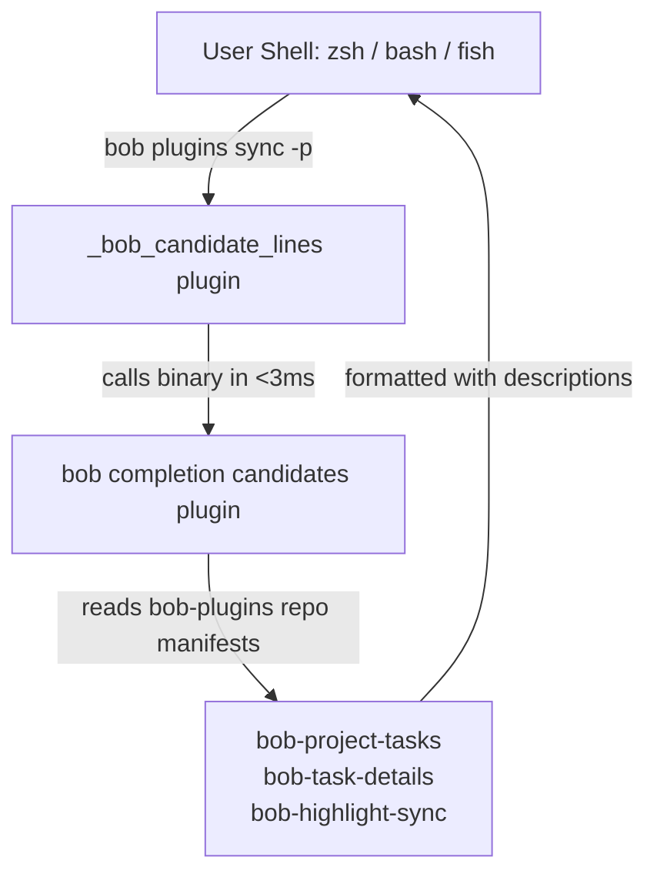

# Designing Beautiful, Reliable Shell Completion and `just install` for Bob CLI

- **Research date:** 2026-10-02
- **Author:** Researcher `gem` (5-researcher independent swarm)
- **Question:** What is the best design and implementation strategy to give the Rust `bob` command world-class, native command-line completion inspired by `sase completion`, and how should a new `just install` target coordinate source compilation and shell completion updates?
- **Evidence & Primary Sources:**
  - `sase completion` interface, implementation, and cache manifest (`~/.zfunc/_sase`, `~/.sase/completion/grammar/...`, `~/.local/share/bash-completion/completions/sase`, `~/.config/fish/completions/sase.fish`, and `sase completion spec`);
  - `bob-cli` workspace inspection (`Cargo.toml`, `justfile`, `src/runner.rs`, `src/native.rs`, and individual command clap definitions across `src/native/`);
  - Bryan's active shell environment (`/bin/zsh`, `~/.zshrc`, `~/.zfunc` in `$fpath`, `chezmoi` dotfiles manager);
  - Clap 4.5 and `clap_complete` 4.5 capabilities (static script generation, dynamic candidate completion, value hints, and engine features).

---

## 1. In One Breath

> **Summary Recommendation:**
>
> 1. **Adopt a unified CLI tree builder in Rust**: Bob currently uses a decoupled "router" parser in `src/runner.rs` where subcommands swallow arguments via raw `args: Vec<OsString>`. To generate rich completions with flags and nested subcommands (`bob freshness list`, `bob plugins sync -p`), `bob` must aggregate its module-level `ClapCommand` builders into a single structural CLI tree.
> 2. **Implement `bob completion` modeled on `sase completion`, but adapted to Rust native performance**:
>    - Subcommands: `list` (default), `install`, `refresh`, `zsh`, `bash`, `fish`, `loader`, `ensure`, `candidates`, and `spec`.
>    - **The Chezmoi / Dotfiles problem is real in Rust too**: While Rust is 100x faster than Python (~2ms vs ~250ms cold start, eliminating Python's startup lag), writing full generated scripts directly to `~/.zfunc/_bob` dirties Bryan's `chezmoi` git working tree on every version bump. Therefore, Bob should support **both** direct script installation and the **portable loader pattern**, automatically detecting when a target is managed by chezmoi.
> 3. **Dynamic Candidates Engine (`bob completion candidates <kind> [prefix]`)**: Expose high-value, instantaneous (~2ms) vault and repo completions: `plugin` (from `bob-plugins`), `route` and `target` (from Bob capture routes), `project` (active project notes), and `format` (`human`, `json`).
> 4. **Add `just install` with a two-phase workflow**:
>    - Phase 1: `cargo install --path . --locked` builds and places `bob` into `~/.cargo/bin/bob`.
>    - Phase 2: Run `bob completion refresh` to update all previously installed/stamped shells, falling back to `bob completion install` for the active `$SHELL` if no completions were previously stamped.
>    - Provide non-destructive `--dry-run` and non-failing warnings if executed in CI or non-interactive environments.
> 5. **Beauty and Reliability**: Format human tables with terminal colors and status badges matching `src/native/style.rs`, verify generated script syntax (`zsh -n`, `bash -n`, `fish --no-execute`), compile Zsh bytecode (`.zwc`), and snapshot the CLI structure (`bob completion spec`) in CI to prevent completion drift.

---

## 2. Deconstructing `sase completion`: What Makes It Great?

To design an exceptional completion experience for `bob`, we first examined the production implementation of `sase completion` across `sase`'s subcommands and Bryan's actual workstation configuration (`~/.zfunc/_sase`, `~/.local/share/bash-completion/completions/sase`, and `~/.config/fish/completions/sase.fish`).

### 2.1 The `sase completion` Subcommand Surface

```
sase completion
  ├── list           Show supported shells, install status, paths, bytecode, stamps, and diagnostics
  ├── install        Detect active shell, write script/loader, verify, compile .zwc, and stamp
  ├── refresh        Regenerate existing stamped completion installs across all registered shells
  ├── zsh            Emit standalone compsys completion script (#compdef sase)
  ├── bash           Emit standalone bash completion script (complete -o default -F _sase sase)
  ├── fish           Emit standalone fish completion directives (complete -c sase ...)
  ├── loader         Emit portable, lightweight shell loader script (indirection trampoline)
  ├── ensure         Ensure runtime grammar cache exists and print its absolute path
  ├── candidates     Print live dynamic candidates (value<TAB>description) for a kind
  ├── spec           Emit structural JSON spec of the CLI tree for snapshot testing
  └── deploy-chezmoi Render portable loaders into chezmoi dotfiles tree and apply
```

### 2.2 The Key Innovations in `sase`

1. **The Dotfiles Decoupling (The Loader Pattern):**
   - In dotfile-managed systems (e.g., using `chezmoi`), putting generated completion scripts directly in `~/.zfunc/_sase` causes frequent git dirty states: whenever `sase` updates, the generated script changes, showing up as uncommitted diffs in the dotfiles repo.
   - `sase` solved this by installing a **stable 35-line loader script** into `~/.zfunc/_sase` (tracked by chezmoi). The loader trampolines into `sase completion ensure zsh`, which maintains the actual volatile generated grammar in `~/.sase/completion/grammar/<hash>/zsh/_sase` (ignored by chezmoi).
   - Once loaded, `_sase` replaces the loader in memory for the lifetime of the shell session.
2. **Bytecode Compilation (`.zwc`):**
   - For Zsh, `sase` automatically compiles the grammar to word code (`zcompile -R <file>`). Zsh loads `.zwc` files via memory mapping, which is substantially faster than parsing large text scripts.
3. **Dynamic Candidates (`sase completion candidates KIND [PREFIX]`):**
   - Completion isn't just static subcommand names and flags; it completes live domain entities (beads, projects, plans).
   - In Python, running `sase` on every tab keypress would cause noticeable lag (~200ms). `sase` solved this with a pre-argparse fast-path in `entry.py` that intercepts `completion candidates` before initializing the full application framework.
4. **Structural Spec for CI Drift Prevention (`sase completion spec`):**
   - Emits a canonical JSON representation of all commands, options, mutex groups, and value kinds.
   - CI runs a snapshot test against this JSON. A developer cannot accidentally change an option flag, break an alias, or alter a command description without the test suite catching the drift.

---

## 3. Auditing Bob CLI: Current Architecture & Bottlenecks

### 3.1 The Decoupled / Router Architecture

An inspection of `src/runner.rs` reveals how `bob` currently processes command-line arguments:

```rust
// src/runner.rs
fn build_cli() -> ClapCommand {
    let mut command = ClapCommand::new("bob")
        ...
        .subcommand_required(true)
        .arg_required_else_help(true);

    for subcommand in SUBCOMMANDS {
        command = command
            .subcommand(delegate_subcommand(subcommand.name, subcommand.about));
    }
    ...
}

fn delegate_subcommand(name: &'static str, about: &'static str) -> ClapCommand {
    ClapCommand::new(name)
        .about(about)
        .disable_help_flag(true)
        .arg(
            Arg::new("args")
                .num_args(0..)
                .trailing_var_arg(true)
                .allow_hyphen_values(true)
                .value_parser(OsStringValueParser::new()),
        )
}
```

When `bob <subcommand> <args>` runs, `runner.rs` parses only the top-level command name and bundles the rest into `args: Vec<OsString>`. It then invokes `native::run(native_command, args)`, which hands the vector off to the specific module.

### 3.2 The Completion Problem With the Current Setup

If one simply ran `clap_complete::generate` on `runner.rs::build_cli()`, the resulting shell completion script would:
- Complete top-level command names (`bob capture`, `bob freshness`, `bob plugins`, etc.).
- **Completely fail** on any subcommand options, flags, or nested commands!
  - `bob plugins <TAB>` would show nothing (missing `list`, `sync`, `--no-pull`, `--repo`).
  - `bob freshness <TAB>` would show nothing (missing `list`, `seed`, `-f`, `--format`).
  - `bob capture <TAB>` would show nothing (missing `--format`, `--route`, `--bob-dir`).

### 3.3 Inventory of Command Parsers Across `src/native/`

Fortunately, most native commands in `bob-cli` already define rich `ClapCommand` structures internally:
- `src/native/plugins.rs`: `build_cli()` (has `list`, `sync`, `--repo`, `--bob-dir`, `--no-pull`, `--backup-dir`, `--dry-run`, `--force`, `-p/--plugin`).
- `src/native/freshness/cli.rs`: `build_cli()` (has `list`, `seed`, `--format`, `--bob-dir`, `--details`).
- `src/native/gkeep/cli.rs`: `build_cli()` (has `doctor`, `list`, `login`, `pull`).
- `src/native/highlights_ref/cli.rs`: `build_cli()` (has `clip`, `create`, `doctor`, `marker`, `scan`, `sync`).
- `src/native/projects/mod.rs`: `build_cli()` (has `list`, `sync`).
- `src/native/vault_sync.rs`: `build_cli()` (has `run`, `status`).
- `src/native/capture/cli.rs`: `build_cli()` (rich capture flags).
- `src/native/capture_*.rs`: (11 capture helper commands, each with `build_cli()`).
- `src/native/dataview/cli.rs`: `build_cli()` (query options).
- `src/native/note_ready/cli.rs`: `build_cli()`.
- `src/native/randomize.rs`: `build_cli()`.
- `src/native/task_status_hooks/mod.rs`: `build_cli()`.

Only 4 commands still use legacy hand-written `parse_args`:
- `collect_done` (`move-done-tasks`): `--threshold <N>`, `-h/--help`.
- `nightly`: `--no-sync`, `--no-pull`, `-h/--help`.
- `notify`: `-s/--seconds <N>`, `-h/--help`.
- `pomodoro` / `tmux-pomodoro`: status query flags.

---

## 4. Critique of the Proposed Plan

The user's prompt outlines:
1. Review `sase completion` for inspiration.
2. Add a `just install` target that runs `cargo install` and updates command-line completions for `bob`.
3. Design the feature to be intuitive, reliable, and beautiful.

Let us critically evaluate this proposal:

### 4.1 Critique of `just install`

**Is `just install` a good idea?**
- **Yes, with caveats.** Having a single `just install` command in `justfile` standardizes local source installs and ensures that developers and users do not end up with an updated `bob` binary while running stale shell completions.
- **Risks & Edge Cases:**
  1. *Subshell Environment Mismatch*: In `justfile`, `set shell := ["bash", "-eu", "-o", "pipefail", "-c"]` executes recipes in Bash by default. If a Zsh user runs `just install`, naive shell detection inside the recipe might see `bash` instead of the user's actual login shell.
     - *Adjustment*: Shell detection must inspect `$SHELL` or the parent terminal process, not just the executing subshell.
  2. *Multiple Installed Shells*: Power users frequently have both Bash and Zsh (or Fish) configured. If `just install` only updates one shell, completions for the other become stale.
     - *Adjustment*: `just install` should run `bob completion refresh`, which iterates over *all previously stamped/installed shells* on the system. If no shells have been stamped yet, it falls back to installing for `$SHELL`.
  3. *Chezmoi / Dotfiles Repository Pollution*:
     Bryan manages dotfiles with `chezmoi` (`/home/bryan/bin/chezmoi`). If `just install` overwrites `~/.zfunc/_bob` directly with new generated content, `chezmoi status` immediately shows a modified file in the git dotfiles repo (`M .zfunc/_bob`).
     - *Adjustment*: The completion installer must detect if `~/.zfunc/_bob` is managed by chezmoi. When managed by chezmoi, it should deploy the **portable loader** once, and let the runtime grammar cache handle version bumps cleanly without touching the chezmoi repo!
  4. *Headless / CI Environments*: If `just install` is run in an automated environment or container where user completion directories (`~/.zfunc`, `~/.local/share/bash-completion`) do not exist or are read-only:
     - *Adjustment*: The completion update step in `just install` must be non-fatal (warn and exit 0, or provide `--no-completion` / `--dry-run` options).

### 4.2 Python vs Rust: What Should We NOT Copy from `sase`?

While `sase completion` is a masterclass in completion architecture, some of its complexity is specifically designed to work around Python's performance limitations:

| Dimension | Python (`sase`) | Rust (`bob`) | Architectural Decision for `bob` |
|---|---|---|---|
| **Cold Startup Time** | 150 – 300 ms | 1 – 3 ms | Rust has no startup penalty; dynamic candidate queries don't need complex sub-process bypasses. |
| **Grammar Generation** | Heavy (imports argparse trees) | Instantaneous (< 5 ms) | Generating shell scripts on demand is virtually free. |
| **Why Loader is Needed** | Solves **both** startup lag and dotfiles/chezmoi drift | Solves **dotfiles/chezmoi git drift** | Keep loader support for dotfiles/chezmoi cleanliness, but allow direct script installation for standard setups. |
| **Bytecode Compilation** | Compiles Python `.pyc` and Zsh `.zwc` | Compiles Zsh `.zwc` | Keep `.zwc` compilation for Zsh because Zsh's compsys parser benefits from wordcode. |

---

## 5. Architectural Design: Intuitive, Reliable, Beautiful

### 5.1 Command Interface Design

We propose adding a native `bob completion` subcommand. When run with no arguments, it defaults to `bob completion list`.

```
bob completion [SUBCOMMAND] [OPTIONS]

SUBCOMMANDS:
  list                 Show supported shells, install status, paths, bytecode, stamps, and diagnostics (default)
  install [SHELL]      Install completion script or loader for SHELL (or auto-detected $SHELL)
  refresh [SHELL]      Regenerate existing stamped completion installs across all registered shells
  zsh                  Emit standalone Zsh compsys completion script (#compdef bob)
  bash                 Emit standalone Bash completion script (complete -F _bob bob)
  fish                 Emit standalone Fish completion script (complete -c bob ...)
  loader <SHELL>       Emit portable shell completion loader script
  ensure <SHELL>       Ensure cached runtime grammar exists and print its path
  candidates <KIND>    Emit live tab-separated dynamic completion candidates for KIND [PREFIX]
  spec                 Emit structural JSON specification of the Bob CLI tree for CI snapshot testing

OPTIONS:
  -h, --help           Print help
```

#### Detailed Subcommand Options

1. **`bob completion list`**
   - Flags: `--json` (emit machine-readable JSON array of shell install states).
   - Visual output: Beautiful colored table (see §5.3).
2. **`bob completion install [SHELL]`**
   - Arguments: `[SHELL]` (`zsh`, `bash`, `fish`). Defaults to detecting `$SHELL`.
   - Options:
     - `-t, --target <DIR>`: Override destination directory (e.g. `~/.zfunc`).
     - `-m, --mode <direct|loader>`: Install mode. Defaults to `loader` if target is chezmoi-managed, otherwise `direct` (configurable).
     - `-f, --force`: Overwrite existing files not stamped by `bob`.
     - `-d, --dry-run`: Preview actions and paths without modifying filesystem.
3. **`bob completion refresh [SHELL]`**
   - Arguments: `[SHELL]` (optional; refreshes all stamped shells if omitted).
   - Options:
     - `-d, --dry-run`: Preview planned refreshes.
     - `-j, --json`: Emit JSON report.
4. **`bob completion candidates <KIND> [PREFIX]`**
   - Kinds: `plugin`, `route`, `target`, `project`, `section`, `format`.
   - Output: `value<TAB>description` lines filtered by optional `PREFIX`.
5. **`bob completion spec`**
   - Options:
     - `-d, --descriptions`: Include full doc summaries instead of hashes.
     - `-j, --json`: Emit formatted JSON.
     - `-o, --output <FILE>`: Write to file instead of stdout.

---

### 5.2 Dynamic Completion Engine: Candidates and Values

Dynamic completion transforms a CLI from merely functional to delightful. In `bob`, dynamic completion should power the core workflows:



Supported Candidate Kinds:
1. `plugin`: Reads `<bob-dir>/../bob-plugins/plugins` or configured plugins repo; emits plugin directory names with descriptions from `manifest.json`.
2. `route`: Reads active capture routes via internal `capture_targets` API; emits routes like `groceries`, `cash`, `notes`, `inbox`, `work`.
3. `target`: Capture target note paths and stems.
4. `project`: Active project notes with open `^prj` tasks.
5. `section`: Section headings for a given route note.
6. `format`: `human`, `json`.

Because `bob` is written in Rust, querying dynamic candidates takes 2–4 milliseconds total—faster than human reaction time and completely free of perceptible stutter.

---

### 5.3 Beautiful Visual Presentation (Terminal Aesthetics)

Following the conventions established in `src/native/style.rs` (using `Styler`, ANSI colors on TTY, plain text when redirected, and the banner format from `justfile`), `bob completion list` and `install` should look striking and legible.

#### Output Mockup: `bob completion list`

```text
SHELL   STATUS      MODE     PATH                                                     ZWC    STAMP   DETAIL
zsh     installed   loader   /home/bryan/.zfunc/_bob                                  fresh  0.1.0   runtime grammar current
bash    stale       direct   /home/bryan/.local/share/bash-completion/completions/bob n/a    0.0.9   installed script is older than binary
fish    missing     —        ~/.config/fish/completions/bob.fish                      —      —       run 'bob completion install fish'
```

#### Output Mockup: `bob completion install`

```text
  🎨  BOB SHELL COMPLETION INSTALL
────────────────────────────────────────────────
  Target Shell:    zsh (detected from $SHELL=/bin/zsh)
  Install Mode:    loader (managed by chezmoi)
  Destination:     /home/bryan/.zfunc/_bob
  Grammar Cache:   /home/bryan/.cache/bob/completion/zsh/_bob

  ✓  Wrote loader trampoline to ~/.zfunc/_bob
  ✓  Generated Zsh compsys grammar in cache
  ✓  Compiled Zsh bytecode (~/.cache/bob/completion/zsh/_bob.zwc)
  ✓  Recorded install stamp (v0.1.0)

  ✓  COMPLETION INSTALLED SUCCESSFULLY

  Tip: Ensure ~/.zfunc is on your $fpath before compinit in ~/.zshrc:
    fpath=(~/.zfunc $fpath)
    autoload -Uz compinit && compinit
```

---

### 5.4 The `just install` Specification

In `justfile`, we define the new `install` target. It coordinates Cargo compilation, binary verification, and completion refresh:

```just
# Install bob to ~/.cargo/bin and refresh shell completions.
install: (_banner "32" "🚀" "INSTALL BOB")
    cargo install --path . --locked
    @if command -v bob >/dev/null 2>&1; then \
        printf '\n%s\n' "Updating command-line completions..."; \
        if bob completion refresh --dry-run >/dev/null 2>&1; then \
            bob completion refresh; \
        else \
            bob completion install; \
        fi; \
    else \
        printf '\n\033[33mWarning:\033[0m %s\n' "bob was installed to ~/.cargo/bin, but ~/.cargo/bin is not in your PATH."; \
        printf '%s\n' "Add 'export PATH=\"\$HOME/.cargo/bin:\$PATH\"' to your shell profile to enable bob and completions."; \
    fi
```

#### Why This Logic is Robust:
1. `cargo install --path . --locked` builds the release binary and copies it into `~/.cargo/bin`.
2. It verifies that `bob` is resolvable in `PATH`.
3. It calls `bob completion refresh`:
   - If the user previously had completions installed for Zsh, Bash, or Fish, `refresh` updates all of them simultaneously.
   - If no shells have been installed yet (first install), it gracefully invokes `bob completion install` to detect `$SHELL` and set up the active shell.
4. If `~/.cargo/bin` is not in `$PATH`, it prints a clear, helpful warning instead of crashing.

---

## 6. Implementation Architecture in Rust

### 6.1 Dependencies (`Cargo.toml`)

Add `clap_complete` matching the pinned `clap = "4.5"` version:

```toml
[dependencies]
clap = "4.5"
clap_complete = "4.5"
```

### 6.2 Assembling the Unified CLI Command Tree

To allow `clap_complete` to generate full completions, we introduce `src/cli_tree.rs` (or `src/native/completion/tree.rs`). This module assembles the top-level command and mounts the real `ClapCommand` for each subcommand:

```rust
// src/cli_tree.rs
use clap::Command as ClapCommand;
use crate::native::*;

pub fn build_full_cli() -> ClapCommand {
    let mut command = crate::runner::base_cli();

    // Attach all command parsers from native modules
    command = command
        .subcommand(capture::cli::build_cli())
        .subcommand(freshness::cli::build_cli())
        .subcommand(plugins::build_cli())
        .subcommand(gkeep::cli::build_cli())
        .subcommand(highlights_ref::cli::build_cli())
        .subcommand(projects::build_cli())
        .subcommand(vault_sync::build_cli())
        .subcommand(dataview::cli::build_cli())
        .subcommand(note_ready::cli::build_cli())
        .subcommand(randomize::build_cli())
        .subcommand(task_status_hooks::build_cli())
        .subcommand(plan_budget::cli::build_cli())
        // Legacy commands with newly provided lightweight ClapCommand descriptors:
        .subcommand(collect_done::build_cli())
        .subcommand(nightly::build_cli())
        .subcommand(notify::build_cli())
        .subcommand(pomodoro::build_cli())
        // Add the completion command itself:
        .subcommand(completion::cli::build_cli());

    command
}
```

*Note on decoupling*: `src/runner.rs` can continue to route commands using its fast string matching during normal execution, or migrate to `build_full_cli()`. The completion generator uses `build_full_cli()` to inspect every argument, flag, and help text.

### 6.3 Shell Generation & Portable Loaders

1. **Zsh Script Generator:**
   - Generated using `clap_complete::generate(clap_complete::shells::Zsh, &mut cmd, "bob", &mut buffer)`.
   - Augment with candidate completion functions for dynamic kinds (`_bob_candidates`).
2. **The Zsh Portable Loader (`src/native/completion/loaders.rs`):**

```zsh
#compdef bob
# Generated by bob completion loader zsh. Do not edit.

__bob_loader_run() {
  emulate -L zsh
  local -a found
  local cmd
  found=( ${(f)"$(whence -p -a bob 2>/dev/null)"} )
  for cmd in $found; do
    if [[ ! "$cmd" =~ '/bob-cli_[0-9]+/' ]]; then
      command "$cmd" "$@"
      return $?
    fi
  done
  command bob "$@"
}

if [[ -z ${__BOB_COMPLETION_LOADER_ACTIVE:-} ]]; then
  local __BOB_COMPLETION_LOADER_ACTIVE=1
  local loader=${funcfiletrace[1]%%:*}
  [[ -n $loader ]] || loader=${(%):-%N}
  local grammar
  grammar="$(__bob_loader_run completion ensure zsh --loader-path "$loader" 2>/dev/null)" || return 1
  if [[ -n "$grammar" && -r "$grammar" ]]; then
    source "$grammar"
    local loader_rc=$?
    unfunction __bob_loader_run 2>/dev/null || true
    _bob() { _bob_root "$@"; }
    return $loader_rc
  fi
fi
unfunction __bob_loader_run 2>/dev/null || true
```

*Notice the guard against ephemeral workspaces*: `[[ ! "$cmd" =~ '/bob-cli_[0-9]+/' ]]` ensures that an ephemeral test runner or agent workspace binary does not hijack the user's permanent interactive shell!

3. **`ensure` Logic:**
   - `bob completion ensure zsh` checks `~/.cache/bob/completion/zsh/manifest.json`.
   - Manifest stores: binary modification time, binary version, checksum, and grammar path.
   - If the binary is newer than the cache, it regenerates the grammar and recompiles `.zwc` in < 5ms.
   - Prints the path to the cached script.

---

## 7. Testing & Quality Assurance Plan

To guarantee reliability and prevent regressions, the completion system must be backed by automated tests:

1. **Structural Spec Snapshot Test (`tests/completion_spec.rs`):**
   - Implements `bob completion spec` emitting JSON.
   - Checked-in snapshot artifact: `tests/fixtures/cli_spec.json`.
   - A unit test verifies `build_full_cli()` produces a spec matching `cli_spec.json`. Any addition of commands, options, or changes to defaults requires intentional snapshot updates.
2. **Syntax Validation Gates:**
   - Add a test or justfile target (`just check-completions`):
     - `zsh -n <(bob completion zsh)`
     - `bash -n <(bob completion bash)`
     - `fish --no-execute <(bob completion fish)`
3. **Dynamic Candidate Unit Tests:**
   - Test `bob completion candidates plugin` against mock plugin folders.
   - Test `bob completion candidates route` against a test Bob vault.
4. **Smoke Test Integration:**
   - Update `just install-smoke` to verify `bob completion --help`, `bob completion zsh`, and `bob completion list` run cleanly.

---

## 8. Step-by-Step Implementation Roadmap

| Phase | Tasks | Key Deliverables |
|---|---|---|
| **Phase 1: Dependencies & CLI Tree Consolidation** | 1. Add `clap_complete = "4.5"` to `Cargo.toml`.<br>2. Add lightweight `build_cli()` descriptors for `nightly`, `notify`, `pomodoro`, and `collect_done`.<br>3. Create `src/native/cli_tree.rs` assembling the full clap tree. | Full `ClapCommand` tree accessible from code. |
| **Phase 2: Generator & Candidate Engine** | 1. Implement `src/native/completion/mod.rs` and `cli.rs`.<br>2. Implement generators for `zsh`, `bash`, `fish`.<br>3. Implement dynamic `candidates` for `plugin`, `route`, `target`, `format`.<br>4. Implement `spec` JSON export. | `bob completion zsh`, `bob completion candidates`, and `bob completion spec` working. |
| **Phase 3: Install, Loader & Refresh Lifecycle** | 1. Implement shell detection and standard path resolution (`~/.zfunc`, `~/.local/share/bash-completion`, `~/.config/fish`).<br>2. Implement `loader` and `ensure` with caching in `~/.cache/bob/completion/`.<br>3. Implement atomic file writes, syntax verification, `.zwc` compilation, and stamp recording.<br>4. Implement `bob completion list` with `Styler` UI. | `bob completion install`, `list`, and `refresh` fully functional. |
| **Phase 4: Tooling & `just install`** | 1. Add `just install` target to `justfile`.<br>2. Add snapshot test `tests/completion_spec.rs`.<br>3. Update `install-smoke` and `all` targets. | Complete developer workflow enabled. |

---

## 9. Conclusion

Implementing command-line completion for `bob` is not merely about outputting a static shell script from `clap_complete`. By adopting the architectural lessons of `sase completion`—particularly the **portable loader for dotfiles/chezmoi cleanliness**, **dynamic domain candidates**, **Zsh bytecode compilation**, and **structural spec snapshot testing**—while leveraging Rust's native sub-millisecond execution, `bob` will gain a command-line completion system that is blisteringly fast, resilient against dotfiles drift, and visually elegant. Coupled with the new `just install` target, installation and completion updates will be seamless and delightful.
