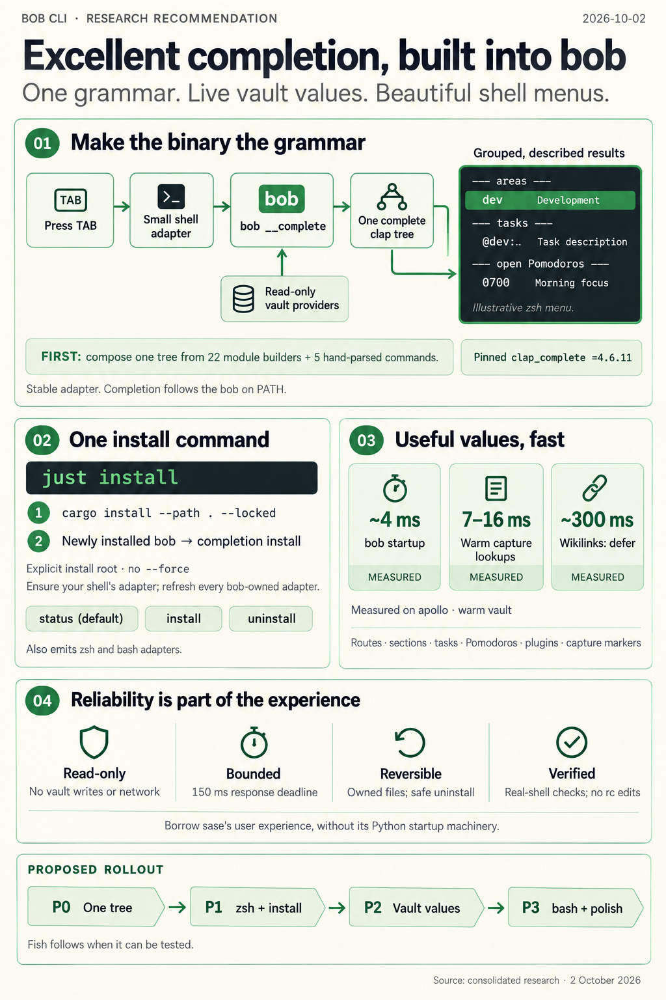

# Shell Completion For `bob` And A `just install` Target — Consolidated Recommendation

> **Research query:** What is the best way to give the `bob` command (a Rust CLI) excellent shell completion, using the `sase completion` command's interface for inspiration, and to add a `just install` target that installs bob from source with `cargo install` and also updates its completion? Is this plan a good idea, which requirement adjustments are justified, and what intuitive, reliable, and beautiful solution is recommended?



## Bottom line

Build it, and **make the `bob` binary the grammar.**

- **Engine.** Each `<TAB>` calls a hidden `bob __complete` endpoint. That endpoint runs clap_complete's completion engine (pinned exactly) over [one composed command tree](#one-tree-with-value-kinds-and-context). Bob's own read-only, vault-aware value providers sit on top.
- **Adapters.** `bob completion install` writes a small, protocol-versioned shell adapter. The adapter renders the results as [grouped, described, natively styled zsh menus](#adapters).
- **`just install`.** It runs `cargo install --path . --locked`, then runs `completion install` from the binary it just installed. That step is idempotent: it [ensures an adapter for your shell](#the-install-recipe) and refreshes any other adapter bob owns.
- **What to copy from sase.** Copy `sase completion`'s [*user contract*](#what-to-take-from-sase): a status-first command, install ethics, no rc edits, and honest verification. Do **not** copy its *engine*. The loader, `ensure`, grammar cache, `spec`, and the `candidates` fast path all exist to hide a 300–640 ms Python startup. Bob starts in [about 4 ms](#latency-on-apollo).

The largest piece of work is not completion itself. Bob has no single command tree today, so [building one is the real prerequisite](#what-the-request-misses).

## Is this a good idea

**Yes.** All five researchers agreed, and the local evidence is strong.

- **The surface is big.** Bob has 27 visible subcommands. Eleven start with `capture`, and ten of those are long-named frontend endpoints. The composed tree has about 123 value-taking long options. Ninety-three of them have no value completion today (cld §2.2).
- **The best values live in the vault.** That includes capture routes, task block IDs, open Pomodoros, and capture markers. A static script cannot reach them. Rust makes them cheap enough to compute per keystroke (see [latency on apollo](#latency-on-apollo)).
- **Drift is already happening.** The installed `~/.cargo/bin/bob` was built from another workspace (`bob-cli_10`). Today it rejects `bob ready` (re-verified by the lead). A statically generated script would drift the same way.

### What the request gets right

- **A first-class `bob completion` command.** Spelling it like `sase completion` gives Bryan one mental model across both tools.
- **`just install`.** It is worth adding on its own. The README still asks people to type `cargo install --path . --locked --force` by hand. The only install recipe today is the isolated `install-smoke`.
- **Tying completion upkeep to installation.** This closes the gap where the binary is updated but Tab completion is stale. Cargo has no post-install hook to do it otherwise.

### What the request misses

1. **One command tree is a hidden prerequisite.**
   - `src/runner.rs:403` registers every subcommand through `delegate_subcommand()` (`runner.rs:427`). That is a trailing-var-arg bag with `disable_help_flag(true)`.
   - The real flags live in 22 private module `build_cli()` functions.
   - Four hand-written `parse_args` functions serve five more commands: `move-done-tasks`, `nightly`, `notify`, `pomodoro`, and `tmux-pomodoro`.
   - Any generator pointed at today's root completes command *names* and then falls back to filenames. All five reports agree, and cdx reproduced it with a probe.
2. **"Like sase" should mean the contract, not the machinery.** Sase's completion package has about 45 Python modules, shaped by argparse and a slow interpreter. Porting it would add failure modes without adding speed (grk §4, cld §3).
3. **`just install` cannot be the only path.** People will keep running `cargo install --git …` and plain `cargo install --path .`. The primitive is `bob completion install`, and `just install` calls it.
4. **Under this design, "update completion" is the wrong verb.** There is no grammar to regenerate. `just install` *ensures a stable adapter*. The grammar is always whichever `bob` is on `PATH` (cld R1).
5. **Agents must not run `just install`.** It replaces the machine-wide `~/.cargo/bin/bob`. `just install-smoke` remains the isolated check. The [`cargo install` probes](#cargo-install-semantics) add a second reason.

## Requirement adjustments called out

| # | Requested or implied | Adjusted to | Why |
|---|---|---|---|
| A1 | Completion "like sase" | Copy the verbs and install ethics. Do not port loader, `ensure`, grammar cache, `spec`, a public `candidates` command, or `deploy-chezmoi`. | Those exist to hide Python startup; bob starts in ~4 ms. |
| A2 | `just install` "updates completion" | `cargo install --path . --locked --root <root>`, then `<root>/bin/bob completion install`. That command ensures `$SHELL`'s adapter and refreshes every adapter bob owns. | A runtime grammar cannot drift, and the adapter rarely changes. Calling the new binary by path avoids running an older `bob` that appears earlier on `PATH`. |
| A3 | (unstated) complete from the CLI definition | **P0 prerequisite:** compose one full clap tree for completion. Runtime dispatch stays unchanged. | Without it, Tab only knows command names. |
| A4 | "Excellent" completion | Include vault values: routes, sections, tasks, task sections, Pomodoro refs, plugin IDs, and capture markers inside `TEXT`. Defer wikilinks. | This is where completion pays off. Wikilinks take ~300 ms. |
| A5 | Shell coverage (sase does bash, fish, zsh) | zsh is first-class. bash is supported (values only). fish waits until a host can test it. | Ship only what real-shell tests cover. Apollo has no fish. |
| A6 | (new) | Add `status` (the default) and `uninstall`. Keep `list` as a hidden alias. | Anything that writes into dotfile directories must be inspectable and reversible. |
| A7 | (new) | **Porcelain before plumbing:** `bob <TAB>` lists daily commands first and groups the ten `capture-*` frontend endpoints last. | Those endpoints are for Bob Mac Capture, and they crowd out daily commands. |
| A8 | README's `cargo install … --force` | Drop `--force`. | Verified unnecessary ([cargo install semantics](#cargo-install-semantics)). It only adds the ability to overwrite *another* package's `bob` binary. |
| A9 | (new) | Never edit rc files, never `eval` in rc, never touch the chezmoi source. Print the exact fix instead. | These are sase's hard-won rules. |

## What to take from sase

What bob should take from `sase completion`, verb by verb:

| `sase completion …` | For bob |
|---|---|
| `bash` / `fish` / `zsh` (emit a script) | Keep `bash` and `zsh`; they print the **adapter** |
| `install` | **Keep.** It is the core of `just install` |
| `list` (the default) | Keep, renamed **`status`**, as the default. `list` stays as a hidden alias |
| `refresh` | **Fold into `install`.** It is idempotent and refreshes every adapter bob owns |
| `candidates KIND [PREFIX]` | Drop the public command. Hidden `__complete` plus `BOB_COMPLETE_DEBUG=<file>` cover debugging |
| `loader` / `ensure` / runtime grammar cache | **Drop.** The binary is the fast path |
| `spec` | Drop as a command; keep its intent as in-process coverage tests |
| `deploy-chezmoi` | Drop. The adapter is stable, so chezmoi can own a copy later ([open questions](#open-questions-for-bryan)) |

Rules to keep verbatim:

- Write a file. Never `eval` in rc and never edit rc files.
- Prefer a directory the shell already scans. Never use framework plugin or cache directories.
- Refuse to overwrite a foreign file without `--force`.
- A file on disk proves nothing, so verify registration in a real shell and print the exact `fpath` line on failure.
- Show descriptions with values.
- Return the full candidate set and let the shell filter it.
- **Anti-lesson:** on a narrow terminal, `sase completion list` wraps the path column one character per line (grk, cld). Use stacked per-shell blocks instead.

## Recommended design

### Shape

```text
 zsh/bash ──TAB──▶ adapter (_bob, ~50 lines, protocol 1; written by `bob completion install`)
                     │  command bob __complete zsh --protocol 1 -- ${words[1,CURRENT]}
                     ▼
 bob __complete ─▶ completion::tree()                one full clap tree (exhaustive over NativeCommand)
                ─▶ partial parse (ignore_errors)     context: --bob-dir, --route, --task, --repo …
                ─▶ clap_complete::engine::complete   subcommands / flags / static choices  (pinned =4.6.11)
                ─▶ bob value kinds                   routes, tasks, Pomodoros, capture markers …
                ─▶ post-filter + presenter           behavior rules below; human group names; descriptions
                ─▶ protocol lines                    value\tdesc\tgroup\tsuffix  |  !dirs  !files  !message
```

Principles:

- **One grammar.** Adapters never parse bob syntax; the thin-client rule applies (see [how the CLI is built](#how-the-cli-is-built)).
- **The binary is the grammar.** The adapter is stable, and all completion behavior ships with the binary.
- **The user's style wins.** Bob supplies defaults only where the user has set nothing.
- **Never noisy, never slow, never writing.** No stderr reaches the prompt, every request has a deadline, and completion never mutates anything.

### Command-line interface

```text
bob completion [COMMAND]

Install shell completion for bob and check that it works. Each <TAB> is answered
by the bob on your PATH, so completion always matches the installed binary; the
installed shell file is a small adapter that rarely changes.

Commands:
  bash       Print the bash completion adapter
  install    Install or refresh the completion adapter for your shells
  status     Show installed adapters and the bob they call (default)
  uninstall  Remove completion adapters that bob installed
  zsh        Print the zsh completion adapter

Examples:
  bob completion                   Same as `bob completion status`
  bob completion install           Install for $SHELL; refresh every bob-owned adapter
  bob completion install zsh -d    Show the zsh plan without writing anything
  bob completion status -v         Also check registration in a real shell
```

- **`install [SHELL]...`** takes `-d/--dry-run`, `-f/--force`, `-n/--no-verify`, `-q/--quiet`, and `-t/--target DIR`. It is an error to combine `-t` with more than one shell.
- **`status`** takes `-j/--json` and `-v/--verify`.
- **`uninstall [SHELL]...`** takes `-d/--dry-run`. It removes only files whose header and manifest digest show that bob wrote them.
- **`bash` and `zsh`** take `-o/--output FILE`.
- **Hidden entries:** the `list` alias and `bob __complete <SHELL> --protocol <N> -- <WORDS>...`. Internal subprocess arguments are exempt from the short-alias rule.
- **Per `cli_rules`:** commands and options are alphabetical, every public long option has a short alias, and output uses color on a TTY through `native::style::Styler`, respecting `NO_COLOR`.
- **Wording.** Help text always says "shell completion", to avoid confusion with `capture-complete` (mus).

### Adapter protocol

Protocol 1 (bob ↔ adapter):

- **Input.** The words up to and including the cursor word.
- **Output.** One line per candidate: `value<TAB>description<TAB>group<TAB>suffix`, where `suffix` is `space` or `nospace`. Lines arrive in display order, and the adapter keeps that order (`_describe -V`).
- **Directives** (whole lines):
  - `!dirs`
  - `!files <glob>`
  - `!files-in <root> <glob>` for vault-relative paths
  - `!message <text>` for free-text slots, for example `TEXT — task text; @route ^task #pomodoro`
- **Version skew is designed in.** The binary supports the current and the previous protocol. For anything older, it emits `!message bob completion is out of date — run: bob completion install`.
- **Failures are silent.** The adapter discards stderr, and an empty reply lets zsh fall through. `BOB_COMPLETE_DEBUG=<file>` appends the request, the response, and timing.

### One tree with value kinds and context

- **Tree.**
  - Add `NativeCommand::command(self) -> clap::Command` as an *exhaustive `match`*, so a new subcommand cannot compile without a tree entry.
  - Mount each module builder under its `SUBCOMMANDS` name and `about` text, model the bare `freshness` form, and skip the hidden aliases.
  - The five hand-parsed commands get completion-only descriptor `Command`s next to their parsers, plus a test that every descriptor flag appears in that command's `--help`.
  - Runtime dispatch is untouched.
- **Kinds.** Keep one table, `native/completion/kinds.rs`, keyed by `(command path pattern, arg id)` with the most specific entry first. The key must include the path because one ID can mean two things. For example, `--block-id` is a *new* ID in `capture-task-id` but an *existing* parent task in `capture-task-sections` (cld).
- **Context.** Partially parse the words before the cursor with `Command::ignore_errors(true)`. Value completers then read `bob_dir`, `route`, `task`, and `repo` from clap's own matches. That way short clusters, `--route=cash`, `BOB_DIR`, and config all behave exactly as in a real run.
- **Coverage tests.** These replace sase's `spec`:
  1. Every value-taking argument has a completion decision: possible values, a `ValueHint`, a kind, or explicit free text.
  2. Every kinds-table entry still matches a real argument.

v1 kind catalog (merged from cld §6.4, grk §5, and cdx):

| Kind | Slots | Source |
|---|---|---|
| Static choices | `--format`, `--engine`, `--status`, gkeep `--source`, … | clap possible values (add `PossibleValue::help` where useful) |
| Directories | `--bob-dir`, `--repo`, `--backup-dir`, `--lib-dir`, `--ref-dir`, `--xlib-dir` | `!dirs` |
| Files | `--query-file`, `--tasks-file`, highlights `MD_FILE` (`*.md`), `PDF` and `--output` (`*.pdf`) | `!files` |
| Vault notes | `query --tasks-note`, `--origin` | `!files-in $BOB_DIR *.md` |
| Route | `--route` on `capture` and the capture-* listers | `scan_capture_targets`, grouped as inbox / areas / projects |
| Section, task, task section | `capture --section/--task/--task-section`, `capture-task-sections --block-id` (these depend on `--route` and `--task`) | the existing capture scanners |
| Pomodoro ref | `capture-pomodoro-name --pomodoro-ref` | the Pomodoro scan; description such as `0700-0725 GTD` |
| Capture marker | `TEXT` on `capture`, `capture-parse`, `capture-rewrite` | in-process `capture_complete` (see [capture text release gates](#capture-text-release-gates)) |
| Plugin | `plugins sync --plugin` (depends on `--repo`) | directory listing of `<repo>/plugins/*/` — **never** `git pull` |
| Level | `randomize --level` | `randomize.levels[].label` from config |
| Free text | `--message`, `--name`, `--seed`, `--cursor`, gkeep `--id`, … | `!message <help>` |

### Behavior rules for intuitive completion

1. **Empty word.** Offer subcommands and positional values. Offer options only after `-`, or when nothing else applies.
2. **A lone `-`.** Show the short and long forms of an option on one row.
3. **Already-used options.** Drop options already given unless they repeat (`Append` or `Count`). Drop options that conflict with given ones. Drop `--help` once other arguments are present.
4. **Ranking.** Keep bob's ranking: routes in capture-targets order, tasks in `capture-complete` order. Never re-alphabetize what bob ranked.
5. **Descriptions.** They must add information: kind and status for routes, task text for task IDs, time range and name for Pomodoros.
6. **Trailing space.** Add no space after `/`, after `=`, or after a marker that expects a continuation (for example `@dev:`).
7. **Group names.** Use human words: `commands`, `options`, `inbox`, `areas`, `projects`, `tasks in dev`, `open Pomodoros`, and finally `capture protocol` for the ten frontend endpoints ([A7](#requirement-adjustments-called-out)).

### Capture text release gates

Release gates for capture `TEXT`, from cdx:

- **Boundary.** Detect when the trailing `TEXT` has started. From there, suppress option and subcommand candidates even without `--`, and route the word to the capture service.
- **In-process only.** Call `capture_complete::build_result` in-process; it needs a small `pub(crate)` extraction. Never spawn a second bob and never re-implement the grammar.
- **Safe rows only.** Omit picker rows that carry `requires_block_id` or `requires_name`. Never call `capture-task-id`, `capture-pomodoro-name`, any write handler, or any dry-run.
- **End of the active word only.** Complete only a marker at the end of the active word, keeping its sigil and suffix. Cursor-mid-word edits and multiline drafts return no candidates in v1. Excellent must never mean corrupting text.

### Adapters

**zsh** — use cld's tested function (cld §6.6), which rendered grouped, described menus in a real zsh 5.9 pty. Required properties:

- **First autoload completes immediately.** Use `if [[ $zsh_eval_context[-1] == loadautofunc ]]; then _bob "$@"; else compdef _bob bob; fi`. This fixes the first-Tab gap in cdx's probe.
- **No `emulate -L zsh` inside the function.** It breaks `_describe` (cld spike bug 1).
- **Split on tabs safely.** Use `"${(@ps:\t:)line}"`, because `IFS=$'\t' read` collapses empty fields (bug 2).
- **Escape `:` in values** before `_describe`.
- **Scoped default styles.** Apply them only when the user has set none: `zstyle -m … || zstyle ':completion:*:*:bob:*:descriptions' format …`.
  - Use bob's existing palette: green bold headers like `bob --help`, and the `──` rule character from the justfile `_banner`.
  - With these defaults, the first Tab shows `── areas ──` style headers.
- **Dispatch directives** to `_files -/`, `_files -g`, `_files -W`, and `_message`, so native colors, quoting, and `list-colors` keep working.

**bash** (~40 lines):

- **Reassemble the word.** Rebuild the cursor word from `COMP_LINE`/`COMP_POINT`, because `COMP_WORDBREAKS` splits `@dev:remote-power` at `:`.
- **Map directives** to `compgen -d` and `compgen -f`.
- **Values only.** Bash cannot show descriptions or groups.

Example of the target experience (cld's prototype output):

```text
% bob capture-sections --route <TAB>
── inbox ──
mac_inbox  -- inbox · default capture target
── areas ──
cash  dev  fun  gtd  gtd_daily  job  …                -- area
── projects ──
bob  bob_git  bob_gtd  …                              -- project · wip

% bob capture fix it @dev:<TAB>
── pomodoro block id ──
@dev:remote-power   -- Enable remote power on for Athena!
@dev:menu-bar-ping  -- Render tmux_ping in menu bar!
```

### Adapter lifecycle

How `install`, `status`, and `uninstall` behave:

1. **Shell selection.** Use the explicit `SHELL` arguments; otherwise use `$SHELL` **plus** every shell with a bob-owned adapter. An unsupported `$SHELL` with no owned adapters exits 1 with "pass bash or zsh".
2. **Target directory**, first match wins:
   1. `-t`.
   2. The manifest-recorded location, so an adapter's location stays stable.
   3. For zsh: the first user-owned, writable `fpath` entry under `$HOME` that is not a framework plugin or cache directory. Read it with a timed `zsh -ic 'print -rl -- $fpath'`. On Bryan's hosts this is `~/.zfunc`.
   4. For zsh: `${ZSH_CUSTOM:-~/.oh-my-zsh/custom}/completions`.
   5. For zsh: `~/.zfunc`, printing the exact `fpath=(~/.zfunc $fpath)` line to add before `compinit`.
   6. For bash: `${BASH_COMPLETION_USER_DIR:-${XDG_DATA_HOME:-~/.local/share}/bash-completion}/completions/bob`.
3. **Ownership.**
   - The adapter's first comment line is `Generated by bob completion (protocol N)`.
   - The manifest records the path, protocol, and SHA-256.
   - A foreign file, an edited file, or a symlink is refused without `--force`.
   - A foreign file whose bytes exactly equal the current adapter is reported as `current (externally managed)` and is not adopted. This is the hook for a future chezmoi-managed copy.
4. **Write.** Write atomically (temp file plus rename), and skip the write when the bytes are unchanged. Remove a stale `_bob.zwc` next to the file; a ~50-line adapter gains nothing from `zcompile`. A dry run creates nothing: no directories, manifest, or files.
5. **Verify.** This is the zsh default; `-n` skips it.
   - Run a bounded `zsh -ic` probe that checks `${_comps[bob]}` is `_bob`.
   - Also check that `$functions_source[_bob]` is *this* file, which catches shadowing.
   - Warn when `command -v bob` is not the binary that is running.
   - A timed-out probe is reported as "unverified", never as success.
6. **Report.** Use stacked blocks, never a wide table. Never print a success checkmark based only on file existence. Exit codes:
   - 2 for usage errors
   - 1 for a failed install
   - 0 for success or an explicit no-op

```text
🐚  Shell completion · bob 0.1.0 → ~/.cargo/bin/bob
  ✓ zsh   installed · protocol 1 · registered as _bob
          ~/.zfunc/_bob
  · bash  not installed      bob completion install bash

  Open a new shell (or run `exec zsh`) to start using it.
```

### The install recipe

The `just install` syntax below was checked with just 1.50 in a scratch justfile. Positional arguments stay as data; an argument containing a space stays one argument.

```just
# Install bob and its shims from this checkout, then install or refresh shell
# completion. Pass shells to choose explicitly: `just install zsh bash`.
[positional-arguments]
install *shells: (_banner "35" "📦" "INSTALL")
    #!/usr/bin/env bash
    set -euo pipefail
    root="${CARGO_INSTALL_ROOT:-${CARGO_HOME:-$HOME/.cargo}}"
    cargo install --path . --locked --root "$root"
    if ! "$root/bin/bob" completion install "$@"; then
        printf '\nbob is installed at %s; shell completion needs attention (see above).\n' \
            "$root/bin/bob" >&2
        exit 1
    fi
```

- **`--root` is resolved explicitly.** The recipe then invokes exactly the binary it installed, never an older `bob` earlier on `PATH` (cdx). It overrides cargo's `install.root` config, which Bryan does not set; document this.
- **No `--force`** (see [cargo install semantics](#cargo-install-semantics)). Install time is ~45 s incremental and ~1m47s clean (cld).
- **Partial success is honest.** The binary is already updated, the recipe exits nonzero, and bob has already printed the exact remedy.
- **`install-smoke` stays isolated.** Add `--help` checks for the new commands, then `"$root/bin/bob" __complete zsh --protocol 1 -- bob cap | grep -q '^capture'`, then `bob completion install zsh -d -t "$root/zfunc"` under a temporary `HOME`/`XDG_*`.
- **README.** Installation leads with `just install`. The git-remote line becomes `cargo install --git … && bob completion install`. Add `docs/completion.md` to the README's command-contract table.

### Reliability and tests

- **Pinning.** `clap_complete = { version = "=4.6.11", features = ["unstable-dynamic"] }`, with every engine call in one module. If upstream breaks, the fallback is a ~300-line in-house walker over clap's public introspection (cld), or grk's emitter design, behind the same public surface.
- **Deadline.** Completers run on a worker thread, and the reply goes out after 150 ms regardless, with whatever is ready. Targets:
  - p50 ≤ 10 ms for structural slots and ≤ 30 ms for vault slots (cld).
  - p95 < 20 ms and < 75 ms respectively on a large vault (cdx).
  - No value cache until measurements demand one.
- **Read-only, enforced by test.**
  - Completers call only scanners.
  - No `git`, network, clipboard, locks, logging, or script materialization.
  - The `__complete` check runs before any of those.
  - Run every completer against a `chmod -w` fixture vault with a fake `git` on `PATH`, and assert byte-identical files and zero `git` calls.
- **Tests:**
  - tree ↔ `SUBCOMMANDS` parity, with hidden aliases absent
  - `debug_assert()` on the composed tree
  - the two coverage tests (see [one tree with value kinds and context](#one-tree-with-value-kinds-and-context))
  - descriptor ↔ help drift tests
  - golden protocol output against a fixture vault (`tests/cli/completion.rs`)
  - real-shell smoke tests, skipped when the shell is absent:
    - zsh through a pty, including the first Tab after autoload
    - bash through `COMP_LINE`
    - cases: `--flag=value`, colons, quotes, Unicode, options after `TEXT`
  - install tests under a temporary `HOME`: idempotence; refusal of foreign, edited, and symlinked files; dry run writes nothing; uninstall
  - a warn-only latency check

## Phased plan

| Phase | Size | Contents |
|---|---|---|
| **P0 — One tree** | S/M | `NativeCommand::command()`; mount module builders (`pub(crate)`); descriptors for the five hand-parsed commands plus drift tests; the bare `freshness` form; parity and coverage tests. No user-visible change. |
| **P1 — MVP** | M | Pinned dependency and lockfile bump; `__complete`; protocol 1; static kinds (choices, `!dirs`, `!files`, `!message`); the [behavior rules](#behavior-rules-for-intuitive-completion); zsh adapter; `completion install/status/uninstall/zsh`; manifest; verification; `just install`; `install-smoke`; `docs/completion.md`; README. |
| **P2 — Vault kinds** | M | Partial-parse context; routes, sections, tasks, task sections, Pomodoro refs, plugins, levels; capture markers with the [capture text release gates](#capture-text-release-gates); deadline; read-only test. |
| **P3 — Breadth and polish** | S | bash adapter and smoke test; porcelain/plumbing grouping; `PossibleValue` help text. |
| **Later** | — | fish adapter (when a host has fish); a wikilink index cache; a chezmoi-managed `_bob` for athena and the Mac; unify runtime parsing onto the composed tree; upstream tag-grouping in clap_complete's zsh adapter. |

Rejected alternatives, in brief:

- **AOT static scripts on today's tree.** They complete names only and drift (mus phase 1).
- **Checked-in `completions/` files.** They drift.
- **A full sase port, or loader + `ensure` + cache.** It solves Python's problem, and the chezmoi premise is false (gem).
- **`source <(COMPLETE=zsh bob)` in `.zshrc`.** It edits the chezmoi-managed rc file and makes `just install` irrelevant.
- **External spec tools (carapace, `usage`).** They add a second grammar and a dependency on every host (cld).

## Report inputs and baseline

- **Lead researcher:** consolidates five independent reports (cdx, cld, grk, mus, gem) and adds new verification · 2026-10-02
- **Baseline:** bob-cli `f11a9f8` on apollo. Tools: clap 4.6.1 (lockfile), clap_complete 4.6.11 (registry source), zsh 5.9, bash 5.2, cargo 1.95, just 1.50.
- **Sibling reports:** `bob_shell_completion_and_just_install__{cdx,cld,grk,mus,gem}.md` in this directory ([cdx](bob_shell_completion_and_just_install__cdx.md), [cld](bob_shell_completion_and_just_install__cld.md), [grk](bob_shell_completion_and_just_install__grk.md), [mus](bob_shell_completion_and_just_install__mus.md), [gem](bob_shell_completion_and_just_install__gem.md)). References such as "cld §6.6" point into them.

## Verified ground truth

This section lists only facts that settle a disagreement or that a planner needs.

### How the CLI is built

- **Module builders.** There are 22 module builders. Most are private, and they are named for help output: `"bob gkeep"`, `"bob capture"`, and so on. To mount one, call `.name("gkeep")` on it. The hand parsers are in:
  - `collect_done/mod.rs:248`
  - `nightly.rs:92`
  - `notify.rs:78`
  - `pomodoro.rs:198`, which serves both `pomodoro` and `tmux-pomodoro`
- **Hidden aliases.** `mark-next-tasks` and `task-status-setter` (`HIDDEN_SUBCOMMAND_ALIASES`) must stay out of Tab.
- **Bare `freshness`.** It reparses as `list` (`freshness/cli.rs:44,74`). The composed tree must accept `bob freshness -f json` (cdx).
- **Capture `TEXT`.** It is `trailing_var_arg(true)` plus `allow_hyphen_values(true)` (`capture/cli.rs:487`). Once the text has started, `--r` is text, not an option. cdx's probe showed that clap's engine still offers `--route` there, so bob must suppress it.
- **Thin-client decision.** `decisions:mac-capture-is-a-thin-client` makes bob the only implementation of capture grammar and completion data. It explicitly names "zsh completion" as a future client of the JSON endpoints. Shell adapters must therefore never parse bob syntax.

### Latency on apollo

Measured warm, on the real `~/bob` vault (5,781 notes):

| Source | Measured | Usable per keystroke? |
|---|---|---|
| `bob --version` (process start) | 3.7–4.0 ms (lead); 4.4 ms (cld) | yes |
| Composed-tree completion (cld prototype) | ~5 ms | yes |
| Route scan, `capture-targets` | 13–16 ms; 31 ms on first run (lead); ~103 ms cold FS (cld) | yes |
| `capture-complete '@dev:'` | 7–8 ms (lead); 10–16 ms (cld) | yes |
| Open Pomodoros scan | 6–9 ms (cld) | yes |
| Wikilink context | ~300 ms (cld) | **no**, so defer |
| `bob plugins list` | 497–700 ms, plus a `git pull` (grk, cld) | **never call**; list `<repo>/plugins/*/` instead |
| `bob projects list` / `bob plan -f json` | ~640 ms / 3.2 s (cld) | **never call** |
| `sase version`, for contrast | 567 ms (grk) | — |

Per-keystroke cost matters on Bryan's machines specifically. `~/.zshrc:29` sets `ZSH_AUTOSUGGEST_STRATEGY=(history completion)`, so zsh-autosuggestions runs the completer *while typing*, not only on `<TAB>`.

### The clap completion engine

Read from the `clap_complete` 4.6.11 registry source:

- **Version requirement.** It requires `clap >= 4.6.6`, but the lockfile has 4.6.1. Adding it needs a deliberate lockfile bump; `--locked` will not resolve this silently (cdx).
- **Unstable surface.** The `unstable-dynamic` feature also enables `clap/unstable-ext`. The semver-exempt surface therefore reaches clap itself. Pin `clap_complete = "=4.6.11"`, keep the lockfile, and isolate every engine call in one module.
- **Presentation data exists.** `engine::complete()` is public under that feature. `CompletionCandidate` carries `help`, `tag`, `display_order`, and `hide`.
- **No context for value completers.** `ValueCompleter::complete(&self, current: &OsStr)` receives only the current word. For example, a `--section` completer cannot see `--route`. Context needs a partial parse on bob's side (cdx, cld).
- **The upstream zsh adapter falls short.** See `env/shells.rs:403-466`:
  - It renders every candidate in one `_describe -V 'values'` group, so tags are dropped (cld).
  - Placed on `fpath` as an autoload file, its first invocation only defines and `compdef`s the function. It never completes that first Tab (cdx probe).
  - Owning the adapter fixes both problems and buys more (see [adapters](#adapters)).

### Cargo install semantics

From the lead's `cargo install` probes in a temp root:

- **`cargo help install`:** "Installing with `--path` will always build and install, unless there are conflicting binaries from another package."
- **Same package, different checkout.** Installing package `probe-same` from checkout `b` over the copy from checkout `a` reported `Replaced package`, with no `--force` needed. A *different* package (`probe-other`) with the same binary name failed with `Add --force to overwrite`. So switching between `bob-cli_N` checkouts needs no `--force`. With `--force`, cargo would silently overwrite any other crate's `bob` binary.
- **New hazard found: a shared `CARGO_TARGET_DIR`.** SASE sets one per agent run. Installing from checkout `b` right after `a` finished in 0.03 s and installed **`a`'s binary**. Cargo apparently reused the fingerprint because the workspace-relative paths match and `b`'s files had older mtimes.
  - Bryan's interactive shell does not set `CARGO_TARGET_DIR` (each checkout builds in its own `./target`), so this mainly affects agents.
  - It is one more reason agents must not run `just install`.
  - It is also why the install report should name the binary it installed (see [adapter lifecycle](#adapter-lifecycle)).

### Shell environment

Facts about Bryan's shell environment:

- **zsh and `fpath`.** `$SHELL=/bin/zsh`. `~/.zfunc` is first on `fpath` both before and after oh-my-zsh loads (`~/.zshrc:19,47`). The `_sase` loader lives there, and no `_bob` exists anywhere on `fpath`.
- **chezmoi.** The chezmoi source uses `home/dot_zfunc/`, not `exact_dot_zfunc/`. An unmanaged `~/.zfunc/_bob` therefore survives `chezmoi apply` and does not show up as chezmoi drift. **This refutes gem's premise** that writing `_bob` "dirties the chezmoi git working tree", and with it gem's reason for porting the loader/`ensure` layer.
- **Styles.** Only `zstyle ':completion:*' menu select` is set (plus a matcher-list, per cld). There is no `group-name` and no `descriptions format`, so menus show no group headers unless the adapter supplies scoped defaults.
- **Shell detection.** just recipes run under bash (`set shell := ["bash", …]`), so detecting the shell from the parent process would report bash. Use the explicit argument first, then `$SHELL` (cdx). This refutes the parent-process step in grk and gem.
- **fish.** fish is not installed on apollo, and bash 5.2 is.

## Where the researchers disagreed and how I resolved it

| Question | Positions | Resolution |
|---|---|---|
| **Engine** | **mus:** static AOT scripts on today's tree first, flags later. **grk:** a custom walker with native emitters and a `candidates` callback. **gem:** static scripts plus a sase-style loader/`ensure` cache. **cdx:** the clap dynamic engine with upstream `CompleteEnv` behind portable loaders, plus a `--static` fallback. **cld:** the clap dynamic engine with a bob-owned protocol and adapters. | **cld's design, plus cdx's correctness gates.** Static scripts cannot reach vault values, and they drift (see [is this a good idea](#is-this-a-good-idea)). Upstream `CompleteEnv` drops tags and misses the first autoload (see [the clap completion engine](#the-clap-completion-engine)). About 50 lines of owned zsh buys groups, file directives, and version-skew messages. grk's emitter design is the fallback if measured latency breaks the budget. |
| `refresh` verb | Everyone except cld kept it | Fold it into idempotent `install`; there is nothing to regenerate. |
| Public `candidates` | grk and gem keep it; mus reserves it | Use hidden `__complete`, so there is no second public protocol to version. |
| Default verb | `list` (sase, grk, gem, cdx) vs. `status` (cld) | **`status`**, which matches `bob vault-sync status`; in bob, `list` verbs list collections (`plugins list`, `projects list`). Add a hidden `list` alias. |
| fish | v1 for cdx, grk, mus, gem; deferred by cld | **Defer.** It cannot be tested here, and the adapter is ~5–10 lines once a host has fish. |
| `--force` on `cargo install` | Kept by grk, cdx, and the README; dropped by cld and mus | **Drop** (verified in [cargo install semantics](#cargo-install-semantics)). |
| Verify by default? | cld: `install` probes `zsh -ic` by default. cdx: opt-in, because rc files are slow and run user code. | `install` verifies by default with a timeout (`-n` skips it), because install is rare and honesty matters. `status` stays cheap and probes only with `-v`. |
| Shell detection | grk and gem: parent process. cdx: `$SHELL`. | Explicit argument, then `$SHELL`, plus every adapter bob already owns (see [shell environment](#shell-environment)). |
| chezmoi | gem: use a loader so chezmoi stays clean. grk and cdx: defer. | **Defer.** gem's premise is false (see [shell environment](#shell-environment)). |
| Hand-parsed commands | cld: migrate to clap now. gem and cdx: completion-only descriptors. | **Use descriptors in v1, with a drift test.** Migrate later as cleanup, so Tab does not wait on help-text changes (grk §2.4). |
| Capture markers in `TEXT` | grk and mus: defer. cld and cdx: include. | **Include them (P2)**, using in-process `capture_complete` with cdx's safety rules (see [capture text release gates](#capture-text-release-gates)). |
| Ownership record | cld: a header comment only. grk and cdx: a state manifest. | **Both.** The header marks bob-written files. A small manifest under `$XDG_STATE_HOME/bob-cli/completion/` (bob already uses XDG state; see `native/env.rs:46`) records custom `-t` targets and content digests, so a hand-edited adapter is never silently overwritten. |
| Static grammar export | cdx: `-s/--static` | Not in v1. |

## Open questions for Bryan

1. Should the ten `capture-*` frontend endpoints be grouped last in `bob <TAB>` (recommended), or hidden from it entirely?
2. Is bash worth P3, or is zsh used on every host (apollo, athena, the Mac)?
3. Is it acceptable for `_bob` to apply bob-scoped default group headers when you have set no style? The alternative is sase's approach: print a recommended `zstyle` block after install.
4. Should the hand-parsed commands get completion-only descriptors now (recommended), or migrate to clap now and accept help-output changes for `notify`, `pomodoro`, `move-done-tasks`, and the `bob_*` shims?
5. Once the stable adapter ships, should chezmoi own `dot_zfunc/_bob` so every host has completion wherever bob is installed?
6. Should the accepted design be recorded as a decision ("shell completion is a thin client of bob"), alongside `mac-capture-is-a-thin-client`?

## Recommended solution

Build **runtime completion computed by the `bob` binary**:

- **P0 prerequisite.** Build one exhaustive, completion-only clap tree from the existing module builders, plus descriptors for the five hand-parsed commands. Coverage tests guard it, and runtime dispatch is untouched.
- **Engine.** clap_complete's `unstable-dynamic` engine, pinned to `=4.6.11` and isolated in one module. On top of it sit a bob partial parse for context, bob's post-filter and presenter, and read-only vault providers: routes, sections, tasks, Pomodoros, plugins, and capture markers through the existing `capture_complete` service. A 150 ms deadline applies, and nothing is written.
- **Shell side.** A protocol-versioned, bob-owned zsh adapter, with bash to follow. It renders bob's tagged candidates as grouped, described menus in bob's own colors, fixes zsh's first-autoload gap, and tells the user how to recover from version skew.
- **Command.** `bob completion` with `bash`, `install`, `status` (the default), `uninstall`, and `zsh`, following sase's install ethics:
  - no rc edits, scanned directories only
  - ownership header plus manifest, atomic writes
  - real-shell verification and honest reports
- **`just install`.** `cargo install --path . --locked --root "$root"` (no `--force`), then `"$root/bin/bob" completion install "$@"`. That one command installs the adapter for your shell and keeps every other bob-owned adapter current. Completion then stays correct for whichever `bob` is on `PATH`, however it was installed.

**Why this design meets the brief:**

- **Intuitive:** sase's verbs, one command, sensible defaults.
- **Reliable:** it cannot drift, providers are read-only with a deadline, failures are silent at the prompt, and installs are verified.
- **Beautiful:** grouped menus with informative descriptions in bob's own palette.

It reaches sase-grade polish with a small fraction of sase's machinery.
