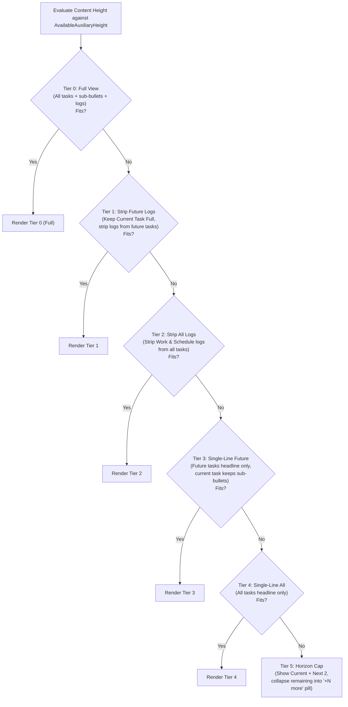

# Research Report: Default Pomodoro & Task Preview for Bob Mac Capture

**Researcher:** `research.48.gem`  
**Date:** 2026-10-09  
**Status:** Complete  
**Scope:** Architecture, UX design, performance caching, and folding hierarchy for showing the running Pomodoro and upcoming planned Pomodoros in `bob-mac-capture` when no input text is typed.

---

## 1. Executive Summary & Assessment

### 1.1 The Proposal
The user proposes enhancing the native macOS menu-bar app `bob-mac-capture` so that when the capture panel pops up with an empty draft (no text typed), it automatically renders a rich preview of:
1. The **current Pomodoro** (if currently open and running), and
2. All **future Pomodoros** scheduled in today's daily file (`## Pomodoros`).
3. For every task referenced by a dedicated **Task Link** (`[[Note#^block-id]]`) under these Pomodoros, the preview renders the task definition and its sub-bullets.
4. The window expands vertically to fit this content without scrolling.
5. If the full content exceeds the available screen height, tasks fold progressively through two fallback tiers:
   - **Folded View 1**: Show task headlines and general sub-bullets, but omit the `🛠️ **WORK LOG**` and `🗓️ **SCHEDULE LOG**`.
   - **Folded View 2**: Single-line view showing only the task headline.
6. The preview must load **blazing fast** via caching when today's daily file has not changed.

### 1.2 Verdict: Is This a Good Idea?
**Yes, with critical architectural and UX refinements.**

In its current state, opening the capture panel displays an empty text editor ("Type to capture…") and an empty auxiliary pane. The user is capturing in the dark, disconnected from what they are actively supposed to be doing or what comes next. Grounding the capture window in the user's active focus converts `bob-mac-capture` from a transient text box into an ambient **daily HUD and focus bridge**. It dramatically speeds up relevant capture workflows:
- Adding a sub-bullet or note under the current running task via `@route+` is immediately guided by seeing the task's existing bullet hierarchy.
- Starting the next queued Pomodoro via `=` or `=<NAME>` is obvious because the user sees exactly what is queued next.
- Closing or logging the session via `=x` is clear because the user sees the active task and link count.

However, a naive implementation of the proposed prompt contains **five severe pitfalls**:
1. **The Cache Invalidation Trap (Multi-File Dependency)**: Caching based solely on the daily file's modification time or contents will cause **stale task views**. While the *task links* reside in the daily note, the *task contents, status, sub-bullets, and work logs* reside in separate project and area notes (`Projects/bob-cli.md`, `Areas/dev.md`). If Bryan edits a task in Obsidian, the daily note remains untouched. Keying the cache only to the daily note would show outdated tasks.
2. **The Window Height Jerk / Snap on First Keystroke**: If the window expands to 650pt to show three Pomodoros and their tasks when empty, what happens the moment Bryan types `t`? If the window collapses instantly to 160pt (a 1-line draft preview), the window snaps violently under the user's cursor. We must design a steady-height transition policy.
3. **The "All Future Pomodoros" Screen Overflow Dilemma**: If Bryan plans 8–10 Pomodoros for the day, even Folded View 2 (single-line per task) will exceed the vertical display budget on common laptop screens (e.g. 13" MacBook with 900pt height). Without a sensible horizon cap (e.g., Current + Next 2–3 Pomodoros), the "no scrolling" mandate becomes physically impossible.
4. **All-or-Nothing Global Folding vs. Asymmetric Folding**: If folding is applied globally across all tasks simultaneously, a single long task in a distant future Pomodoro would force the *current running task* to collapse down to a single line. The user needs the current task expanded with high fidelity, while future tasks can fold aggressively.
5. **Disconnected Entity Presentation**: In `bob-mac-capture`'s existing preview cards, `task_blocks` and `pomodoro_blocks` render in two disjoint batches. If we simply dump task cards and Pomodoro cards separately, the user cannot tell which task belongs to which Pomodoro. The tasks must be visually nested or grouped directly under their parent Pomodoro session.

This report critiques these aspects, refines the requirements, and delivers a concrete, end-to-end design spanning `bob-cli`'s Rust core, the CLI/JSON contract, and `bob-mac-capture`'s Swift/SwiftUI presentation layer.

---

## 2. Critique of the Proposed Plan & Required Adjustments

### 2.1 Critical Nuance 1: The Multi-File Cache Invalidation Hazard
* **User Requirement:** *"Since we will load this preview so often, we should make sure to cache it somehow when the daily file's contents haven't changed at all. IMPORTANT: The bob-mac-capture app MUST be blazing fast."*
* **The Problem:** In Bob's vault architecture (governed by `decisions:today-is-read-from-the-ledger` and `glossary:Task Link`), the daily file (`YYYY/YYYYMMDD.md`) contains:
  ```markdown
  ## Pomodoros
  - [ ] (**0920-0950** [t:: 30m]) — DEV
      - [[Projects/bob-cli#^task-abc]]
  ```
  The daily file contains *only* the link `[[Projects/bob-cli#^task-abc]]`. The text `- [/] Implement capture cache`, its sub-bullets, its `🛠️ **WORK LOG**`, and its checkbox status live in `/home/bryan/bob/Projects/bob-cli.md`.
  If Bryan edits `bob-cli.md` in Obsidian (e.g., checks a subtask or adds a work log line), the daily file's `mtime`, size, and SHA-256 digest are **100% unchanged**.
  If `bob-mac-capture` or `bob` caches the preview keyed only on the daily file, the user will see stale task data whenever they edit task files directly.
* **Recommended Adjustment:**
  1. The cache key must encompass **both** the daily file and the resolved task source notes.
  2. Fortunately, `bob-mac-capture` already runs a background `VaultTargetWatcher` (using macOS `FSEvents`) anchored at `vaultPath` (`AppDelegate.swift:566`). This watcher invalidates caches whenever *any* file in the vault changes.
  3. `bob-cli`'s JSON output for the default preview must report a `manifest` of touched files:
     `{"path": "2026/20261009.md", "mtime": 1791578400}, {"path": "Projects/bob-cli.md", "mtime": 1791578450}`.
  4. In `bob-mac-capture`, an in-memory `CaptureLedgerPreviewCache` actor holds the decoded snapshot. When the panel appears, if no FSEvents have fired and the cached manifest matches, the cached SwiftUI model renders **synchronously on frame 0 (<0.5ms)**.

### 2.2 Critical Nuance 2: Window Sizing Hysteresis & Keystroke Transitions
* **User Requirement:** *"we should expand the height of the window as necessary [to avoid scrolling]"*
* **The Problem:**
  - Let default preview height be $H_{\text{default}} \approx 520\text{pt}$ (Current Pomodoro + 2 Future Pomodoros + 4 tasks).
  - Bryan presses the global hotkey. The window opens tall at 520pt.
  - Bryan types `t` to capture a quick thought (`task: check email`).
  - As soon as text is typed, `plainDraft.isEmpty` becomes `false`. The default preview is replaced by `CaptureLivePreview`.
  - A single-item capture draft preview takes roughly $H_{\text{draft}} \approx 140\text{pt}$.
  - If the window abruptly contracts from 520pt to 140pt on the very first keystroke, the bottom edge snaps upward by 380pt. This causes jarring visual instability while typing.
* **Recommended Adjustment:**
  1. Use a **soft steady-height decay** or distinct visual zones.
  2. When the user begins typing, the pane smoothly transitions via SwiftUI `.animation(.snappy(duration: 0.2), value: model.previewState)` to the draft preview.
  3. When the draft is cleared (user backspaces to empty), the panel immediately restores the cached default preview without needing a subprocess round-trip.

### 2.3 Critical Nuance 3: The "All Future Pomodoros" Screen Overflow Dilemma
* **User Requirement:** *"showing the current pomodoro (if any) and all future pomodoros... without causing the user to need to scroll the preview pane."*
* **The Problem:** In a typical workday, Bryan might plan 6–10 Pomodoros in the morning review.
  Suppose there are 8 future Pomodoros with a total of 12 linked tasks:
  - 1 Current Pomodoro card: ~70pt
  - 8 Future Pomodoro cards: 8 * ~40pt = 320pt
  - 12 Tasks (even at single-line Folded View 2): 12 * ~26pt = 312pt
  - Panel chrome, titlebar drag inset, editor, footer: ~150pt
  - **Total required height:** $70 + 320 + 312 + 150 = 852\text{pt}$.
  On a 14" MacBook Pro or standard external display with dock/menu bar, the visible screen height is often 800–900pt. After subtracting `panelScreenMargin * 2` (48pt), the available ceiling is ~750pt.
  Even at maximum compression (Folded View 2), 8 future Pomodoros will **exceed the screen height**.
* **Recommended Adjustment:**
  1. Introduce a **Planning Horizon Cap**:
     - Always display the **Current Pomodoro** in full fidelity.
     - Display the **Next 2 upcoming future Pomodoros** with their tasks.
     - If more future Pomodoros exist beyond that horizon, collapse them into a single, clean footer summary row:
       `+ 5 more planned Pomodoros (AFTERNOON, REVISE, SYNC…)` with an expand disclosure.
  2. If the user explicitly clicks the expand disclosure, allow standard vertical scrolling via `ScrollView(.vertical)` as a natural escape hatch.

### 2.4 Critical Nuance 4: Asymmetric Folding Priority
* **User Requirement:**
  *"support two folded views, which we will use in this order of priority, if necessary: 1. A view of each task that does not show the work log or schedule log... 2. A single-line view of each task."*
* **The Problem:** If folding is applied as a uniform global switch across all tasks, a giant historical task in *Future Pomodoro #3* (which might have 15 sub-bullets) would force *Current Pomodoro #1's task* to collapse to a single line.
  This violates user intent: the user is currently working on the current task! The current task's active subtasks and checklist items are the most relevant information on screen.
* **Recommended Adjustment:** Implement **asymmetric tiered folding**:
  - **Stage A (Full Fidelity)**: Everything in Full View.
  - **Stage B (Strip Future Logs)**: Strip Work/Schedule logs from *future* tasks only. Keep the current task Full.
  - **Stage C (Strip All Logs)**: Strip Work/Schedule logs from all tasks (both current and future).
  - **Stage D (Collapse Future Tasks to Single-Line)**: Compress *future* tasks to single-line view. Keep the current task's sub-bullets visible.
  - **Stage E (Full Compression)**: Compress all tasks to single-line view.
  - **Stage F (Horizon Truncation)**: Truncate distant future Pomodoros with "+N more" badge.
  This guarantees that Bryan's *current active task* stays informative for as long as possible before being forced into a single line.

---

## 3. System Architecture & CLI Contract

### 3.1 Strict Thin-Client Conformance
Per `decisions:mac-capture-is-a-thin-client`:
> *"bob-cli is the only implementation of capture grammar, completion data, preview, and vault mutation. Bob Mac Capture owns presentation, process orchestration, the global hotkey, settings, launch at login, and packaging. It spawns `bob` directly... and renders what comes back."*

Under no circumstances should `bob-mac-capture` parse markdown files, scan for wikilinks, read `note_tasks`, or strip Work Logs itself. `bob-cli` must expose a dedicated, high-performance read endpoint that returns the structured, multi-tier data ready for rendering.

### 3.2 Proposed Command: `bob capture-default-preview`
We introduce a dedicated CLI subcommand in `bob-cli`:
```bash
bob capture-default-preview --format json [--bob-dir <DIR>]
```
*(Following `sase/memory/cli_rules.md`: kebab-case subcommand, `--format json` support, optional `--bob-dir`, read-only, deterministic).*

#### 3.2.1 Why a dedicated subcommand instead of overloading `capture-pomodoros`?
- `bob capture-pomodoros` is called during live typing for autocomplete, comma-assist, and picker index operations (`CaptureCloseTaskCommaAssist`). It is tuned for extreme lightweight execution (<2ms) and only scans the daily note.
- Generating task previews requires reading external note files (`Projects/foo.md`), resolving block IDs (`NoteTaskScan`), and tokenizing lines.
- Keeping `capture-default-preview` distinct ensures that autocomplete and typing aids never pay the disk I/O cost of resolving full task ASTs.

#### 3.2.2 JSON Output Schema (`schema_version: 1`)
```json
{
  "ok": true,
  "schema_version": 1,
  "day_file": "/home/bryan/bob/2026/20261009.md",
  "relative_day_file": "2026/20261009.md",
  "manifest": [
    { "path": "2026/20261009.md", "mtime": 1791578400000 },
    { "path": "Projects/bob-cli.md", "mtime": 1791578420000 },
    { "path": "Areas/dev.md", "mtime": 1791578415000 }
  ],
  "plan_budget": {
    "themes": { "count": 2, "cap": 3, "over_cap": false },
    "links": { "count": 5, "cap": 10, "over_cap": false }
  },
  "current_pomodoro": {
    "ref": "46:ae8bb2f6",
    "line": 46,
    "name": "FIX",
    "time_range": "(**0920-0950** [t:: 30m])",
    "status": "running",
    "tasks": [
      {
        "relative_target": "Projects/bob-cli.md",
        "route": "bob",
        "line": 142,
        "block_id": "fix-cache",
        "status_symbol": "/",
        "status_name": "In Progress",
        "headline_text": "- [/] Fix memory leak in capture-pomodoros ^fix-cache",
        "sub_bullet_count": 4,
        "work_log_count": 2,
        "schedule_log_count": 1,
        "tiers": {
          "full": [
            { "text": "- [/] Fix memory leak in capture-pomodoros ^fix-cache", "depth": 0, "kind": "headline" },
            { "text": "  - Check jemalloc stats", "depth": 1, "kind": "bullet" },
            { "text": "  - Add regression test", "depth": 1, "kind": "bullet" },
            { "text": "  - 🛠️ **WORK LOG**", "depth": 1, "kind": "log_header" },
            { "text": "    - *10:15* Profiling complete", "depth": 2, "kind": "log_entry" }
          ],
          "no_logs": [
            { "text": "- [/] Fix memory leak in capture-pomodoros ^fix-cache", "depth": 0, "kind": "headline" },
            { "text": "  - Check jemalloc stats", "depth": 1, "kind": "bullet" },
            { "text": "  - Add regression test", "depth": 1, "kind": "bullet" }
          ],
          "headline_only": [
            { "text": "- [/] Fix memory leak in capture-pomodoros ^fix-cache", "depth": 0, "kind": "headline" }
          ]
        }
      }
    ]
  },
  "future_pomodoros": [
    {
      "ref": "52:872a7840",
      "line": 52,
      "name": "SASE",
      "time_range": null,
      "status": "queued",
      "tasks": [ ... ]
    }
  ],
  "warnings": []
}
```

---

## 4. Caching & Performance Architecture ("Blazing Fast")

The user emphasized: **"IMPORTANT: The bob-mac-capture app MUST be blazing fast."**

### 4.1 The Two-Tiered Cache Architecture
If `bob-mac-capture` executes `bob capture-default-preview` on the critical path of `show()` when the hotkey is pressed, the user pays:
- Process spawn: ~3–5 ms
- Vault file reads (3–5 files): ~2–4 ms
- JSON parse: ~1 ms
- SwiftUI first render: ~4 ms
- **Total latency:** ~10–14 ms.

While 10–14 ms is decent, it is not "blazing fast" (0ms) and can introduce a visible 1-frame micro-stutter when opening the panel.
To achieve true instantaneous presentation:

```
[ VaultTargetWatcher (FSEvents) ]
               │
               ▼ (Vault file modified)
[ CaptureDefaultPreviewCache (Actor) ] ──(Background Prewarm)──► [ Spawns `bob capture-default-preview` ]
               │                                                                    │
               ▼                                                                    ▼
   Cached Snapshot in Memory ◄──────────────────────────────────────── Cache Populated in <10ms
               ▲
               │
    [ Hotkey Pressed: show() ]
               │
               ▼
   Synchronous Frame 0 Render! (0.2 ms)
```

1. **Prewarm at App Launch**: `AppDelegate` requests the preview during app prewarm.
2. **Instant Frame-0 Presentation**: When the hotkey is pressed, `show()` immediately loads `CaptureDefaultPreviewCache.currentSnapshot()` into `CapturePanelModel.defaultPreview`. There is **zero waiting, zero subprocess spawn, zero disk I/O**.
3. **Event-Driven Background Invalidation**:
   - `AppDelegate`'s `vaultWatcher` observes file modifications across the entire vault.
   - When an event occurs within the vault, `CaptureDefaultPreviewCache` is marked stale and triggers an async background refresh.
   - If the panel is currently closed, the refresh completes quietly in the background.
   - If the panel is currently open on an empty draft, it updates seamlessly via SwiftUI.
4. **Fingerprint Verification**:
   - Each snapshot records the `(path, mtime)` of every note involved.
   - A fast file-attribute check confirms snapshot freshness without re-parsing markdown if needed.

---

## 5. Visual Hierarchy & Design Specification

The user requested: *"I want you to lead the design on this one. Make sure you design this feature so it is intuitive, reliable, and (last but not least) beautiful!"*

### 5.1 Component Composition
Currently, `CapturePanelView` arranges auxiliary content in a linear stack: `pickerChip` -> `taskIDPrompt` -> `completion` -> `destinationSummary` -> `errorMessage` -> `previewContent`.

When `plainDraft.isEmpty` is true, the auxiliary pane should render `DefaultLedgerPreviewView`, structured as follows:

```
┌────────────────────────────────────────────────────────────────────────┐
│ [ TextEditor: "Type to capture…" ]                                      │
├────────────────────────────────────────────────────────────────────────┤
│ [ Plan Budget:  Themes 2/3 · Links 5/10  ]                             │
│                                                                        │
│ 🍅 CURRENT SESSION · 09:20–09:50 (18m remaining) ──────────────────── │
│ ┌─ In Progress · Projects/bob-cli.md · line 142 ──────────────────────┐│
│ │ ▌ - [/] Fix memory leak in capture-pomodoros ^fix-cache            ││
│ │ ▌   ├── Check jemalloc stats                                        ││
│ │ ▌   └── Add regression test                                         ││
│ │ ▌   ⋯ 2 work log entries collapsed [Click to expand]                ││
│ └─────────────────────────────────────────────────────────────────────┘│
│                                                                        │
│ ⏱️ UPCOMING SESSIONS (2 planned) ───────────────────────────────────── │
│ ┌─ Next: SASE (Queued) · Projects/sase.md · line 52 ──────────────────┐│
│ │ ▌ - [ ] Port memory web indexer to Rust ^sase-port                  ││
│ └─────────────────────────────────────────────────────────────────────┘│
│ ┌─ Later: BOB (Queued) · Areas/dev.md · line 18 ──────────────────────┐│
│ │ ▌ - [ ] Clean up deprecated CLI flags ^bob-flags                    ││
│ └─────────────────────────────────────────────────────────────────────┘│
├────────────────────────────────────────────────────────────────────────┤
│ Ready    [Stash 0]   [Discard]   [Preview]   [Capture]                 │
└────────────────────────────────────────────────────────────────────────┘
```

### 5.2 Visual Details & Styling Tokens
1. **Current Session Card**:
   - Status rail: Highlighted in Bob's `pomodoroStart` accent color (vibrant orange/pink).
   - Header badge: Pill badge `CURRENT` in `.green.opacity(0.15)` with a ticking timer icon (`timer`).
   - Time remaining pill: Calculated live from the timespan `(**0920-0950** [t:: 30m])`.
2. **Future Sessions Cards**:
   - Status rail: Subtle secondary tint (`Color.secondary.opacity(0.4)`).
   - Header badge: `NEXT` (for the very next placeholder) and `QUEUED` (for subsequent placeholders).
   - Clear visual differentiation so the active task immediately draws focus.
3. **Tasks nested directly under Pomodoros**:
   - Instead of isolating tasks into a generic bucket, each task card is nested within its owning Pomodoro section.
   - Tasks use `BlockDiffCard` styling: rail tint matching task status (Todo = `.secondary`, In Progress = `.accentColor`, Done = `.green`), monospace font, syntax tokens for tags (`#task`), dataview brackets (`[t:: 30m]`), and block IDs (`^fix-cache`).
4. **Fold Chips**:
   - Rather than completely erasing work logs without a trace, folded logs appear as elegant inline chips:
     `⋯ 2 work log entries hidden`
   - These chips are clickable (`Button`) and expand inline using `BlockDiffCard`'s existing `onExpandFold` handler.

### 5.3 Empty State & Graceful Degradation
What if no Pomodoros are running or planned?
- **Scenario A: No running Pomodoro, but future Pomodoros planned**:
  - Top card displays an inviting prompt:
    `⏱️ No active session · Next up: FIX`
    `Press = to start this session immediately.`
- **Scenario B: No Pomodoros planned today (e.g. before morning GTD review)**:
  - Clean minimalist placeholder:
    `☀️ No open Pomodoros in today's daily note.`
    `Capture a thought above, or press = to plan a session.`
- **Scenario C: Daily note does not exist yet**:
  - `☀️ 20261009.md not created yet.`

---

## 6. Height Budgeting & Progressive Folding Algorithm

### 6.1 Height Calculation Math
`CapturePanelWindowSizer.swift` calculates available content height:
$$\text{ScreenLimit} = \text{AvailableScreenHeight} - (2 \times \text{panelScreenMargin})$$
$$\text{AvailableAuxiliaryHeight} = \text{ScreenLimit} - \text{ChromeHeight} - \text{EditorHeight} - \text{FooterHeight}$$

Given:
- Standard screen height: $900\text{pt}$
- Margin: $2 \times 24 = 48\text{pt} \implies \text{ScreenLimit} = 852\text{pt}$
- Fixed chrome: $\approx 150\text{pt}$
- Maximum budget for preview pane: $\approx 700\text{pt}$.

### 6.2 The Progressive Resolution Engine
To determine the rendering tier without causing scrolling, `bob-mac-capture` implements a deterministic layout evaluation:



### 6.3 Height Estimation Constants
To avoid iterative multi-pass SwiftUI rendering thrashing, the tier is selected via pure layout estimation before rendering:
- Header chrome & spacing per Pomodoro: $34\text{pt}$
- Task headline row: $24\text{pt}$
- Sub-bullet row: $20\text{pt}$
- Log row: $20\text{pt}$
- Fold chip row: $22\text{pt}$

The model computes the height of each tier in $O(N)$ time, picks the highest-fidelity tier that satisfies `estimatedHeight <= AvailableAuxiliaryHeight`, and binds it to `@Published var ledgerPreviewTier`.

---

## 7. Implementation Plan

### Phase 1: `bob-cli` Core & CLI Subcommand
1. **Add `capture_default_preview` module** in `src/native/capture_default_preview.rs`.
2. Implement ledger resolution using existing modules:
   - Use `pomodoro::day_file_for(&bob_dir)` and `capture_pomodoros::scan(&contents)` to find the running Pomodoro and open placeholder Pomodoros.
   - Use `capture_pomodoro_close::number_task_links` and `plan_budget::today::today_links` to extract dedicated Task Links.
   - Use `VaultLinkResolver` to resolve targets to absolute vault paths.
   - Use `note_tasks::scan` to locate `NoteTask` instances by block ID.
   - Extract task block lines and classify them into `headline`, `sub_bullet`, `work_log`, `schedule_log`.
3. Construct the tiered output models (`full`, `no_logs`, `headline_only`).
4. Register `bob capture-default-preview` in `src/native/cli.rs`.
5. Add unit and integration tests covering:
   - Daily file with 1 running + 2 queued Pomodoros.
   - Tasks with extensive Work Logs and Schedule Logs.
   - Missing daily note and daily note without `## Pomodoros`.
   - Broken or ambiguous task links (verify they do not crash the preview).

### Phase 2: `bob-mac-capture` Process Client & Models
1. **Swift Models (`CaptureCore/CaptureLedgerPreviewModels.swift`)**:
   - `CaptureLedgerPreviewResponse`: Codable models decoding `schema_version: 1`.
   - `CaptureLedgerPomodoro`: Pomodoro identity, status, time range, list of tasks.
   - `CaptureLedgerTask`: Relative path, line, status, tiers (`full`, `noLogs`, `headlineOnly`).
2. **Add `captureDefaultPreview()` method to `BobProcessClient`**:
   - Spawns `bob capture-default-preview --format json`.
3. **Implement `CaptureLedgerPreviewCache` actor**:
   - In-memory storage of the latest valid `CaptureLedgerPreviewResponse`.
   - Invalidation triggered by `VaultTargetWatcher`.

### Phase 3: SwiftUI Presentation Layer
1. **Create `DefaultLedgerPreviewView.swift`**:
   - Renders `CurrentPomodoroCard` with running status glyph, time countdown, and nested `TaskBlockView`.
   - Renders `FuturePomodorosStack` with queued sessions.
   - Implements inline expansion buttons for folded chips.
2. **Integrate into `CapturePanelView.swift`**:
   - In `auxiliaryContent`:
     ```swift
     if !model.hasDraft && model.isDefaultLedgerPreviewEnabled {
         DefaultLedgerPreviewView(model: model)
             .id(AuxiliarySection.defaultPreview)
     }
     ```
3. **Wire into `CapturePanelModel.swift`**:
   - In `prepareForPresentation()`: Load the cached preview instantly.
   - In `editorTextDidChange()`: When `draft.isEmpty`, re-display the default preview. When `!draft.isEmpty`, switch to draft analysis.
   - In `prepareForDismissal()`: Reset expanded fold states.

---

## 8. Summary of Recommendations & Decisions

| Area | User Proposal | Recommended Adjusted Design | Rationale |
| :--- | :--- | :--- | :--- |
| **Cache Key** | Daily file only | Daily file **+** linked task note mtimes & vault `FSEvents` | Task definitions live outside the daily file; daily file cache alone causes stale tasks. |
| **CLI Transport** | Unspecified | Dedicated `bob capture-default-preview --format json` | Preserves thin-client architecture and avoids slowing down typing autocomplete. |
| **Folding Policy** | Uniform global folding | Asymmetric progressive folding (protect current task) | The running task is active context; it should not collapse just because a future task is large. |
| **Horizon Limit** | Show all future Pomodoros | Show Current + Next 2–3; collapse remainder into `+N more` | 8–10 Pomodoros physically cannot fit on a laptop screen without scrolling. |
| **Folded Representation** | Silently omitted | Interactive clickable fold chips (`⋯ N logs collapsed`) | Preserves clean aesthetics while allowing inline discovery without scrolling. |
| **Window Sizing** | Auto-expand | Auto-expand with smooth keystroke transition | Prevents window snapping/jitter when typing begins. |

---
*Report registered under durable SASE research snapshot.*
