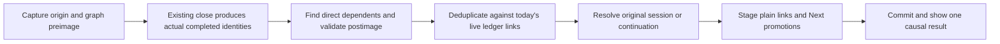

# Completion-triggered follow-on Task Links: independent cdx research

Researcher: **cdx**. Date: **2026-10-09**. Scope: implementation research and product critique; no feature code or vault content changed.

I independently examined bob-cli, bob-plugins, and Bob Mac Capture. I did not read, locate, or obtain the findings of the other researchers in this swarm. Repository sources were accessed through `sase repo open`; project decisions and glossary material were read through audited `sase memory read` calls. The report distinguishes current behavior, proposed behavior, and measured evidence.

## 1. Judgment

This is a good idea **as a continuation aid for the work session Bryan just chose**. Closing a prerequisite is an excellent moment to surface the work it releases. Adding a readable Task Link to the same session avoids another search, preserves context, and makes the next step visible in both the ledger and Today.

The broad wording needs tightening. Dependency means “cannot start until,” not “must do today.” Linking also promotes work into a sticky lane; it is a commitment, not merely a notification. Automatically linking every downstream task would populate Today with blocked work, revive deferred plans, and let a high-fan-out prerequisite expand the day's commitments. I would automatically queue **direct dependents whose final blocker this particular action removes**, and explain that causal relationship in the close confirmation.

I would retain automatic insertion for the common case, without an extra confirmation dialog or a new mode. I would not add a new arbitrary selection cap in the first version. Preserve existing plan-budget warnings, make the complete added set inspectable, and use a collapsed notification for large sets. If real use produces large unwanted fan-out, the next product change should be an explicit “available, review before queuing” policy for that case, rather than silently choosing the first few tasks. This is a deliberate tradeoff: the first release implements the requested automation, while measuring its commitment cost.

## 2. What the implementation already provides

Source baselines examined:

| Repository | Revision |
| --- | --- |
| bob-cli | `b566ba4431b97df6405a75babe9d17899bae7eea` |
| bob-plugins | `53e773f771a87373347febc15950193a6a09e823` |
| bob-mac-capture | `9979d36b37fa92c8d3402bc91a829e8b14fe10f0` |

### Dependency semantics and identity

The authoritative dependency input is the managed first-child `⛓️ **DEPENDS ON:**` line; `[dependsOn::]` and target `[id::]` fields are projections. Dependencies are AND, finish-to-start: any recognized open prerequisite blocks, as does a strictly future scheduled date. Done and Cancelled prerequisites stop blocking. Closing a dependent does not close its prerequisites. The contract also defines legacy children, unresolved links, moved-link healing, cycles, and archive targets. [S1]

A task is identified for a ledger link by **vault-relative note path plus block ID**. A dependency's `[id::]` can be an existing custom ID; it is not safe to assume it equals a freshly reconstructed `note__block-id`. Basenames can be ambiguous, identical block IDs can exist in different files, and archive targets require explicit paths. [S1]

Today is computed from dedicated Task Links under **open** Pomodoros in the current daily file. Closing the enclosing Pomodoro turns its links into history. A new plain link raises Ready/eligible Blocked work to Next, while existing Next or Pending stays in its lane. Removing a link does not automatically undo that promotion. These accepted decisions make the feature meaningful, but also make indiscriminate queue growth costly. [S1, S12; audited decisions `task-lanes-are-sticky`, `today-is-read-from-the-ledger`]

### Obsidian has the right event seam

Task Status Cycler already gathers successfully closed task identities and routes them through `finalizeClosedTasks`, which serializes immediate Blocked-dependent recovery and reference retirement. Recovery reads unsaved open Markdown editors before falling back to vault reads, checks other open prerequisites and future schedules, and currently restores eligible `[?]` dependents to Ready. It scans Markdown files and parses their tasks on each invocation. [S2]

The close handlers carry enough context to distinguish a selected Task Link from an enclosing Pomodoro close. Whole-Pomodoro completion closes embedded task trees, starts ordinary worked links, writes Work Logs, applies the ledger completion plan, and then finalizes the closed identities. A plain selected link is root-only; an embedded selected link beneath a Pomodoro can close a tree. Reopen is a separate path. These distinctions must survive this feature. [S3]

Do not place follow-on insertion indiscriminately inside the existing public recovery API. Cancel gestures also call recovery, and closes outside today's ledger also finalize tasks. They should not silently start creating today's commitments.

### Capture closes and direct completion are related, but separate

`=x!1` completes the chosen task link while closing the running Pomodoro; `=!1` is its alias, and `=!` completes the remaining numbered links through wildcard selection. `=x` can also complete already embedded links without an explicit `!` group. Detect **actual task transitions**, not the presence of an exclamation mark. [S4]

The Pomodoro close planner exposes task status transitions, changed-file postimages, the running session, and the successor ledger plan. It currently does not perform the whole-vault dependent recovery that the separate `!note:block-id` task-completion path performs. The latter already has shared tree completion, scoped ledger retirement, and a dependent-recovery engine, but that recovery still works from projected fields and a whole-vault snapshot. It is a useful foundation, not a complete implementation of the requested rule. [S5, S6]

Both Rust and JavaScript currently create a continuation placeholder when there are carried links or no later session. **If all links complete and a later planned session exists, they can choose that later session without creating a continuation.** Therefore “put it in the newly created Pomodoro” cannot be implemented just by appending to the existing `next_pomodoro`: that may be an unrelated ADMIN session. [S7]

### The Mac app already has the needed presentation chain

Bob Mac Capture submits an aggregate draft as one `bob capture --format json` call and hides the panel after success. It delegates grammar, completion, previews, and vault mutation to bob. It stores the latest success, builds close presentations from typed JSON, announces status, and sends an existing native notification. New optional fields are decoded with `decodeIfPresent`. [S8]

Live analysis has a default 50 ms debounce and performs parse/completion/preview work through subprocesses. Cancellation and generation guards prevent old analyses from replacing the current draft. The subprocess timeout is 20 seconds; that is a wedge guard, not a latency target. [S8]

The app should decode and display a new result, not search dependencies itself or run a second command after capture to insert the links.

## 3. Explicit requirement adjustments

These are recommended changes or clarifications to the request, not descriptions of shipped behavior.

| Topic | Recommended contract | Reason |
| --- | --- | --- |
| Which dependents | Queue direct dependents that become runnable because of successfully completed identities in this action. All their prerequisites must now be terminal/nonblocking and their schedule must allow work today. | Avoid adding partially blocked work or unrelated backlog. |
| Trigger scope | Trigger from a dedicated Task Link under an open Pomodoro in the current daily file, or from the close of that Pomodoro. Only actual open-to-Done transitions qualify. | Provides an intentional session context; excludes historical notes, reopen, failed close, cancel, and routine reconcile. |
| Nested completions | Include identities actually closed by the existing embedded/subtask completion policy, inheriting their initiating session. Exclude tasks merely visited, started, parked, or left open. | A completed child can legitimately release a dependent; a requested but failed close cannot. |
| Destination | Reuse the exact originating open session; if that session closes, use its newly created continuation. If eligible additions need a continuation and normal close would skip it, create one immediately after the closed session, with the same name. | Avoids inserting HEALTH work into an unrelated later ADMIN session. |
| Existing links | Deduplicate against live dedicated links across all today's open sessions. Leave existing placements alone. | An availability event is not authorization to relocate an existing plan. |
| Schedules and freshness | Never pull a future scheduled date forward. Never stamp a dependent's freshness just because automation linked it. | Automation does not constitute human review of the dependent. |
| Missing identity or unsafe resolution | Keep eligible tasks without a unique valid block ID available for review; do not invent IDs during closure. Skip uncertain, malformed, ambiguous, or protected candidates with a useful reason. | Automatic links must be real and stable; the existing Add block ID flow is an explicit edit. |
| Large fan-out | Add the eligible set, retain existing budget warnings, show a concise summary plus access to the full set. Treat surprise queue growth as a trial metric. | No arbitrary hidden ranking or cap; retain a route to a more conservative policy if use warrants it. |
| Failure | An optional discovery failure must not prevent an otherwise valid close. Report that follow-ons could not be checked. Once writes are planned, preserve the CLI's existing conflict/refusal and rollback contract. | Distinguishes inability to offer automation from a failed mutation transaction. |

The existing manual-link helper is an especially important trap: `plan_task_link` retires a future scheduled field and stamps freshness when it changes the task line. Those are appropriate for an explicit user link, but inappropriate here. Reuse the lower-level status and ledger planners, or factor out an explicit automation policy that preserves schedule and freshness. Do not call the manual gesture and hope filtering will suppress every side effect. [S9; audited glossary `Task Freshness`, decisions `ready-is-freshness-gated`]

I would include otherwise eligible normal tasks in nested or case-sensitive notes; the dependency system already permits them. Use the shared link resolver/formatter, not the root-only capture route grammar. Exclude hidden tasks, archived/closed dependents, tasks in terminal projects, and protected historical daily snapshots from automatic commitment. They may still participate as prerequisite history. These exclusions are product policy and should be written into the new conformance contract.

## 4. The rule should be a small, pure planner

Let `C` be the set of identities that actually changed from open to Done. Preserve pre-close session provenance and pre-close graph inputs before any retirement or line shifts. For candidate `d`, require:

```text
eligible(d) =
  d directly depends on at least one member of C
  AND d remains a recognized open task after this action
  AND the action removes its final dependency blocker
  AND no prerequisite remains open
  AND d has no strictly future scheduled date
  AND d is eligible for automatic commitment
  AND its dependency and task identities are safe to resolve
```

Do not use `d.status == '?'` as the only test. A stale Ready/Next/Pending checkbox can still have an open prerequisite in the preimage. Compute readiness from the authoritative dependency inputs and the before/after states; use the checkbox for status compatibility, not as a substitute for the graph.

For a candidate with a present managed line, that line controls the edges. Support existing field-only/legacy adoption semantics where appropriate, but do not allow stale projected fields to manufacture an edge absent from a valid present line. Perform resolution and supported healing as a read-only semantic operation; do not run whole-vault reconciliation as a hidden side effect of closing one session. A malformed line or unresolved dependency can remain nonblocking under current reconciliation rules, yet still make **automatic commitment unsafe**. Skipping such a candidate does not redefine its Blocked status. [S1]



Collect all successful completions from one Pomodoro/tree operation before evaluating its dependents. When A and B both block C and both close in one action, evaluate the combined postimage, add C once, and record both causes. Never recurse forward through C's descendants merely because C is now available. Queuing C is not completing C.

For each newly inserted task, promote Ready or an unblocked Blocked status to Next; leave Next/Pending unchanged. Preserve freshness, scheduled dates, priority, task text, and all unrelated managed children. Write **plain** dedicated Task Links, not embeds: an embed would make the next Pomodoro close complete that task automatically under existing semantics.

Sort new additions deterministically by vault-relative path and source order, keeping every existing ledger child in its current order. Append additions after existing/carry-forward children, replacing an empty placeholder bullet when suitable. Reasons belong in the result/notice, not on the dedicated link bullet: adding explanatory prose would stop it being a counted Task Link.

### Concrete destination example

Suppose `health#^choose-provider` is the last prerequisite of `health#^book-scan`.

Closing only the selected task link keeps the open HEALTH session:

```markdown
- [ ] (**0920-0950** [t:: 30m]) — HEALTH
    - ~~[[health#^choose-provider]]~~
    - [[health#^book-scan]]
```

Closing the session via `=x!1` places the follow-on in a continuation, even if an unrelated later session already exists:

```markdown
- [x] (**0920-0940** [t:: 20m]) — HEALTH
    - ~~[[health#^choose-provider]]~~
- [ ] () — HEALTH
    - [[health#^book-scan]]
- [ ] () — ADMIN
    - [[admin#^email]]
```

The snippets illustrate destination and plain-link policy; the existing close writer remains authoritative for its exact history-marker formatting.

A continuation is planned work. Do not start its timer. Preserve already carried links and append new ones; do not rerun completed-task traversal against a ledger that now contains the additions. No additions means no extra placeholder beyond today's existing close behavior.

## 5. Architecture across the three repositories

### bob-cli: semantics, staged writes, and one response

Add a focused completion-follow-on module with pure before/after planning and structured outcomes. Refactor the task-complete recovery path and Pomodoro-close path to share candidate readiness/identity evaluation, while keeping their existing close policies. Supply a vault snapshot interface with staged overlays; the feature must see edits made earlier in the same capture batch. [S5, S6]

Integrate follow-on planning **inside each close item's staged operation**, after actual completion identities are known and before the next capture item executes. This matters for `=x!1 =`: the subsequent start must see the newly queued links in the continuation. Deferring all additions until the batch ends would give misleading start semantics.

Maintain transaction-scoped session handles and existing line maps/block tracking. A name such as HEALTH is not a unique identifier, and a raw line number becomes stale after insertion/retirement. Resolve final lines from the planned postimage. Do not add permanent Pomodoro IDs just for this feature.

Preview and submit use the same planner; preview does not write vault notes. Add an optional per-item `follow_on` result to both legacy single-item responses and `captures` items. For example:

```json
{
  "follow_on": {
    "state": "applied",
    "destination": {
      "relative_day_file": "2026/20261009.md",
      "line": 14,
      "name": "HEALTH",
      "created": true
    },
    "added": [
      {
        "note_path": "health.md",
        "block_id": "book-scan",
        "text": "Book CT scan",
        "block_link": "[[health#^book-scan]]",
        "reason": "last_prerequisites_completed",
        "causes": [{"note_path": "health.md", "block_id": "choose-provider", "text": "Choose provider"}]
      }
    ],
    "skipped": []
  }
}
```

This is a proposed shape, not an existing API. Use `planned` for dry runs, `no_change` for a checked empty result, and `unavailable` when discovery cannot be trusted. Skipped rows need typed reasons such as `already_today`, `future_scheduled`, `still_blocked`, `missing_block_id`, `ambiguous_identity`, `hidden`, or `unsafe_dependency`. A missing optional object means an older backend, not a known empty computation. Preserve the existing schema version and decode additively where compatible.

A final batch notification must describe **net surviving additions**. A later item can complete/remove a task that an earlier item queued. Keep per-item execution history useful, but do not toast “added Book CT scan” when the final ledger no longer contains that link. Reuse final postimage tracking rather than introducing a second mutation pass.

### Obsidian: extend the existing writer, preserve editor truth

Add an explicit origin context to the selected-link and whole-Pomodoro close paths. Extend the serialized close finalization orchestration to perform follow-on planning only when that context qualifies. Keep generic `recoverBlockedDependents` available for cancellation and other writers without auto-linking.

Use the existing dependency grammar and task snapshot infrastructure. A Rust pure planner plus a JavaScript mirror sharing a documented vector suite fits the current repository design; duplicating the feature in Swift does not. Keep one policy contract and shared fixtures, rather than introducing a new transport/daemon solely to eliminate the existing Rust/JavaScript boundary.

Do not replace Ctrl+Enter with a CLI disk mutation: that loses unsaved editor state and can disrupt Tasks recurrence behavior. Keep completion through the established handler; overlay every open Markdown editor when discovering and validating candidates. Batch additions to the active daily editor in one editor transaction and preserve cursor/focus. For unopened files, use `Vault.process` with preimage validation after asynchronous planning. The official API guarantees the single file does not change between its process callback's read and write; it does not make a multi-file action atomic. [S10]

Preserve the existing review-walk contract: source completion advances only where today's accepted gesture rules permit; inserted tasks do not steal focus or cause a second advance. Combine follow-on detail with the action/walk notice where possible. [S3; audited decisions `answering-advances-the-walk`, `review-walk-is-tiered`]

### Mac: typed presentation only

Extend `CaptureCommandSuccess` decoding, the close presentation, preview card, accessibility announcement, and `NotificationService` content builder. Append a “Ready now” group after completion rows and before the next-session summary. Share a small presentation object between preview and success so destination, cause, and added-task wording stay consistent. Decode missing arrays as empty and absent objects as unavailable/legacy presentation without breaking older bob builds. [S8]

Schedule the existing notification after committed success; do not wait for notification delivery before dismissing capture. Include the daily note among review targets. No follow-up `capture-complete` scan, graph construction, or vault mutation belongs in Swift.

## 6. Make the feedback beautiful by making it understandable

Use one grouped confirmation per action, with a calm checkmark, one short cause line, the destination, and readable task titles. Small secondary text can disambiguate notes. Do not lead with block IDs, parser details, or dependency metadata.

Example Obsidian notice:

```text
✓ Closed Choose provider

Ready now · added to HEALTH
  Book CT scan
  Send referral

Their last prerequisite is complete.
Review
```

For an entire session: “Closed HEALTH · 2 follow-on tasks queued” plus the same rows and “In the next HEALTH Pomodoro.” For a dry run: “Will add …”. For mixed prerequisites, use per-row causes or a compact grouped cause list; do not claim the same prerequisite released every row if it did not.

Show at most three task titles in the small toast, followed by “+4 more · Review all 7.” That is a **display limit**, not an insertion limit. The full preview/result view must preserve every added task and its cause. A live existing link can read “Book CT scan was already in ADMIN”; it must not count as newly added.

Keep ordinary no-op closes quiet. Surface actionable exceptional results: “Choose provider closed. Book CT scan is ready but needs a block ID” or “Task closed; follow-ons could not be checked. Retry check.” Retry must use the captured closure context; it must not rerun Ctrl+Enter and accidentally reopen the task.

Provide a Review action that opens today's daily note/session and preserves keyboard control. Do not advertise a generic Undo for a multi-note close. Undoing links alone leaves the promoted Next lane sticky; undoing source completion can involve recurrence and Work Logs. Existing unlink and explicit release gestures are the truthful correction mechanisms. A future “Undo follow-on” could be implemented as a guarded removal plus an explicit release for only this action's newly promoted tasks, but it deserves its own tested contract.

On macOS, use the existing native notification and persistent latest-result presentation. System notifications require consent, so success detail must remain accessible when notification authorization is absent; notification delivery is not proof the user saw it. Apple's notification guidance supports this consent boundary. [S8, S13]

Use text and icons as well as color; announce count, titles, destination, and why through the existing accessibility path. Avoid sounds or animation added specifically for each dependent. The pleasing part is the visible continuity of work, not extra visual ceremony.

## 7. Performance: there is already a measurable cost to address

I ran a synthetic benchmark of the installed `/home/bryan/.cargo/bin/bob` executable on this Linux host, using only `--dry-run` against disposable synthetic vaults. No real vault contents were read or changed for the benchmark. Temporary benchmark directories were removed afterward.

Binary SHA-256: `52ee3152ca7954b727a09d495460e1d9dfb53dadcf20261d28a90535a3557caf`. `bob --version` reports `0.1.0`; this does not prove the installed binary was built from the source revision above. Its observed close/recovery behavior agrees with the examined implementation.

Each vault contained N filler area notes with ten open tasks each, a task note with A and a Blocked B depending on A, today's daily note with an open DESIGN Pomodoro linking A, and a later unrelated ADMIN placeholder. The Tasks settings explicitly recognized Ready, Blocked, Next, In Progress, Done, and Cancelled. Fixed clock: `2026-10-09 09:37:00`.

For each case: one initial invocation, then seven timed fresh subprocesses. The table reports median and maximum of those seven. Files were freshly generated and likely in the OS page cache; **this is not a cold-disk test, a Mac measurement, or a tail-latency estimate**.

| Filler notes / tasks | Draft | Median ms | Maximum ms |
| --- | --- | ---: | ---: |
| 100 / 1,000 | `=x` | 12.23 | 16.77 |
| 100 / 1,000 | `=x!1` | 12.26 | 16.85 |
| 100 / 1,000 | `!tasks:a` | 14.96 | 17.55 |
| 1,000 / 10,000 | `=x` | 84.16 | 96.95 |
| 1,000 / 10,000 | `=x!1` | 82.45 | 101.02 |
| 1,000 / 10,000 | `!tasks:a` | 127.34 | 159.86 |
| 5,000 / 50,000 | `=x` | 409.77 | 434.88 |
| 5,000 / 50,000 | `=x!1` | 414.87 | 517.13 |
| 5,000 / 50,000 | `!tasks:a` | 619.62 | 655.60 |

The direct-completion cases each returned one recovered dependent. The `=x!1` cases reported `next_pomodoro.created: false`, independently confirming the unrelated-next-session destination edge case. Plain `=x` carried its worked link and created a continuation.

Representative invocation, with the synthetic vault and date overrides supplied in the subprocess environment:

```text
bob capture -b SYNTHETIC_VAULT -d -f json -- '=x!1'
BOB_DAY_FILE=SYNTHETIC_VAULT/2026/20261009.md
BOB_NOW=2026-10-09 09:37:00
```

A source explanation is visible: `plan_capture_batch` eagerly constructs `DependencyContext`, whose constructor runs vault-wide prerequisite discovery even for a simple capture. Discovery walks files and scans their tasks. The direct-completion recovery adds a second cached-per-batch Markdown snapshot and reparses it. A per-batch cache does not persist across the Mac app's preview subprocesses. [S11, S6]

**Consequent recommendation:** do not add another independent full scan to close. Make dependency context lazy, unify discovery/recovery data, and give the short-lived CLI a reusable per-note dependency/task summary cache. In Obsidian, derive reverse lookup from the existing Tasks/dependency snapshot lifecycle with live-buffer overlays; never rescan every document merely to find dependents of one task. The ledger-tools dependency index already shares a memo's invalidation rather than creating an independent render-time disk cache. [S14]

### An honest cache contract

Maintain reverse edges from resolved prerequisite identity to dependent identities, plus per-note parsed summaries and a basename catalog. A cache is acceleration, not authority.

For the CLI, a practical first design is a versioned disposable cache outside synced Markdown, keyed by canonical vault identity, parser/schema versions, and task-status settings. Store per-note change fingerprints and dependency summaries. Refresh created, modified, renamed, and deleted files before lookup; changes to the basename catalog must re-resolve affected ambiguous/short links. Overlay staged batch text after disk cache refresh. Re-read candidate notes, their prerequisite notes, and the destination ledger before mutation.

A metadata catalog walk may still be O(number of files). The goal is to avoid O(total Markdown content) parsing on every preview. Do not claim constant-time capture simply because there is a reverse map. With a complete warm cache, the semantic work is proportional to affected reverse edges, candidate/prerequisite text, and today's ledger; metadata validation remains an additional cost.

Revalidating only known candidates cannot find a newly added dependent absent from a stale reverse index. Correctness therefore requires changed-file discovery/completeness before using cached negative results. Missing/corrupt cache: rebuild once from the same parser. An incomplete/unreadable refresh must be an explicit unavailable/skipped result, not “no dependents.” Coarse/unreliable file timestamps require stronger fingerprints or content validation. Read-only previews must not modify vault Markdown; a disposable local cache can be refreshed separately.

Do not require a new always-running service. An on-disk cache plus runtime memoization respects the accepted thin-client decision. Consider a daemon only after Mac profiling shows spawn/catalog/cache-load cost still violates the agreed targets.

Suggested acceptance targets, **proposals rather than measured promises**: warmed additional follow-on planning p95 under 15 ms on Bryan's normal vault; capture preview/submit subprocess p95 under 100 ms on the target Mac; no new graph work in syntax-only `capture-parse`; no additional spawn to report the result. Profile all stages with existing Mac signposts and Rust timings. Test large fan-out separately, including output decoding and rendering. If the targets fail, fix cache/discovery costs before shipping the feature into live preview.

## 8. Reliability and validation matrix

| Scenario | Expected result |
| --- | --- |
| A closes; B depends only on A | One plain B link in the originating session/continuation; B is Next. |
| B depends on A and still-open C | B stays blocked; no link. |
| A and C both close in one operation | B added once, with both causes; no intermediate partial decision. |
| A → B → C | B added; C waits until B actually completes. |
| B is already in an open session elsewhere today | No duplicate and no relocation. |
| B has only closed-session history links | History does not suppress a new live B link. |
| B is Done/Cancelled, closes in the same tree, or is excluded/hidden | No B addition; never reopen it. |
| B is scheduled for tomorrow | No addition, no date removal, no Schedule Log pull-forward. |
| B's checkbox is stale Ready but A really blocked it | Evaluate graph transition; do not rely only on `[?]`. |
| B has no block ID or a duplicate ID | No invented/ambiguous link; actionable review result. |
| Another task has the same `[id::]` and remains open | No false unblock; retain conservative identity handling. |
| Dependency line changed while fields/cache are stale | Live managed line wins; no manufactured edge. |
| Cycle, malformed line, unreadable prerequisite, unresolved/ambiguous link | No unsafe automatic commitment; distinguish warning from zero results. |
| Only the selected task link closes | Enclosing Pomodoro stays open; append there. |
| Whole session closes and later ADMIN exists | Create/use same-context continuation when additions require it. |
| `=x!1 =` / wildcard `=!` / partial recursive completion | Same planner; subsequent item sees additions; only actual successful closes contribute. |
| Double press, retry, or duplicate aliases for a task | Deduplicate by resolved identity; no second insertion. Reopen does not count as close. |
| Task A later reopens | Existing derivation can re-block B; do not silently delete today's plan or lower its sticky lane. |
| Existing freshness stamp or no stamp on B | Preserve it exactly; no artificial review confirmation. |
| Same task queued then completed later in one draft | Net notification excludes an addition absent from the final ledger. |
| CLI file conflict or write failure | Existing guarded commit refuses/rolls back; no success toast for uncommitted links. |
| Obsidian partial close/follow-on failure | Keep the completed source, report the failed enhancement, and offer safe recheck context. |
| Mac notifications denied or old bob/app version | Capture succeeds; details remain accessible; additive decoding degrades predictably. |

Guard the **read set** as well as the write set where feasible: a prerequisite file that is not being modified can change between readiness checking and commit. Existing capture preimage validation covers planned write targets and explicitly is not a cross-process lock or a fully serialized transaction. Queue competing plugin operations; use existing maintenance coordination where compatible, and replan once on a detected conflict. Do not imply this makes unsaved editors and unrelated external writers globally atomic. [S15]

Keep the close in the existing staged transaction whenever follow-on planning succeeds. Obsidian's existing best-effort multi-note close cannot be retrospectively made atomic by adding links. Emit accurate partial outcomes rather than rolling back a successfully completed task because an enhancement failed. For an optional discovery failure before follow-on writes are staged, return a normal close with an explicit unavailable enhancement result; for a stale staged write or I/O failure, preserve the existing transaction failure semantics.

Use shared semantic vectors for Rust and JavaScript, CLI integration tests with temporary vaults, and Mac decoding/presentation tests for single-item and aggregate drafts. Add tests for unsaved buffers, CRLF/no final newline, duplicate basenames and block IDs, protected previous-day snapshots, custom status mappings, archive prerequisite history, and generation/cancellation during preview. Verify notification content and accessibility on a real Mac; no macOS UI or Swift execution was performed in this research.

## 9. Alternatives and tradeoffs

| Approach | Assessment |
| --- | --- |
| Automatically link every task that names a closed prerequisite | Reject: includes still-blocked work and overstates what closure enabled. |
| Only notify “these tasks are ready” | Safest commitment policy, but does not deliver the requested seamless continuation. Useful fallback for unsafe identities and a future fan-out policy. |
| Scan the entire vault in a new post-close hook | Easy prototype; poor fit for repeatedly spawned live previews, extra reads, and unguarded delayed placement. |
| Let `bob task reconcile` add links later | Reject: it lacks the gesture's origin session and notification surface; routine derivation should not infer daily commitment. |
| Have Swift look up dependencies and issue additional captures | Reject: duplicates semantics, adds round trips, complicates aggregate success and preview. |
| Route every Obsidian close through bob | Reject for this feature: unsaved buffers and Tasks recurrence are already handled by the plugin's existing write path. |
| Shared documented planner policy, Rust/JS implementations, typed Mac presentation | Recommended: matches current boundaries and can be verified with common vectors. |
| New daemon, SQLite-backed service, or event journal as a prerequisite | Defer: useful only if actual latency/recovery needs demand it. Avoid turning a small continuation feature into an orchestration system. |

The first release should change the two requested close entry points and the common planning/presentation contract. The separate `!note:block-id` path is a good semantic reuse point, but auto-queuing from a close outside today's session should not be silently added. If that path later gets follow-ons, require an unambiguous qualifying ledger context and document it explicitly.

A sensible build order is contract/vectors and pure planning, then CLI staged integration and cache work, then Obsidian context/index integration, then Mac preview/notification support. Ship when the two requested surfaces have parity and the actual Mac latency targets are measured. Track added count, already-today count, skips, follow-on failures, stage timings, and how often Bryan immediately releases additions; do not log task text just to measure the feature.

## 10. Evidence references

Repository links below point to revisions inspected locally, not to mutable branch heads. Accepted memory selectors were consulted through the audited read mechanism; no prior research artifacts or peer swarm reports were consumed.

- **S1:** [Task dependency contract](https://github.com/bobs-org/bob-cli/blob/b566ba4431b97df6405a75babe9d17899bae7eea/docs/task-dependencies.md), especially §§3–5 and R1–R10.
- **S2:** [Cycler close finalization and recovery](https://github.com/bobs-org/bob-plugins/blob/53e773f771a87373347febc15950193a6a09e823/plugins/task-status-cycler/src/130-plugin-references.js) and [pure dependency recovery](https://github.com/bobs-org/bob-plugins/blob/53e773f771a87373347febc15950193a6a09e823/plugins/task-status-cycler/src/080-dependencies.js).
- **S3:** [Selected-link completion](https://github.com/bobs-org/bob-plugins/blob/53e773f771a87373347febc15950193a6a09e823/plugins/task-status-cycler/src/160-plugin-completion.js), [Pomodoro completion](https://github.com/bobs-org/bob-plugins/blob/53e773f771a87373347febc15950193a6a09e823/plugins/task-status-cycler/src/170-plugin-pomodoro.js), and [Ctrl+Enter dispatch](https://github.com/bobs-org/bob-plugins/blob/53e773f771a87373347febc15950193a6a09e823/plugins/task-status-cycler/src/140-plugin-vim.js).
- **S4:** [Capture close grammar and selection outcomes](https://github.com/bobs-org/bob-cli/blob/b566ba4431b97df6405a75babe9d17899bae7eea/docs/capture.md), “Choosing each Task Link's outcome.”
- **S5:** [Rust Pomodoro close composition](https://github.com/bobs-org/bob-cli/blob/b566ba4431b97df6405a75babe9d17899bae7eea/src/native/capture_pomodoro_close/linked_tasks.rs) and [capture staging integration](https://github.com/bobs-org/bob-cli/blob/b566ba4431b97df6405a75babe9d17899bae7eea/src/native/capture/pomodoro_close.rs).
- **S6:** [Direct task completion integration](https://github.com/bobs-org/bob-cli/blob/b566ba4431b97df6405a75babe9d17899bae7eea/src/native/capture/task_complete.rs) and [dependent recovery](https://github.com/bobs-org/bob-cli/blob/b566ba4431b97df6405a75babe9d17899bae7eea/src/native/task_complete/recovery.rs).
- **S7:** [Rust continuation creation](https://github.com/bobs-org/bob-cli/blob/b566ba4431b97df6405a75babe9d17899bae7eea/src/native/capture_pomodoro_close/ledger.rs#L345) and [JavaScript continuation creation](https://github.com/bobs-org/bob-plugins/blob/53e773f771a87373347febc15950193a6a09e823/plugins/task-status-cycler/src/060-pomodoro.js#L862).
- **S8:** Mac [process client](https://github.com/bobs-org/bob-mac-capture/blob/9979d36b37fa92c8d3402bc91a829e8b14fe10f0/Sources/CaptureCore/BobProcessClient.swift), [models](https://github.com/bobs-org/bob-mac-capture/blob/9979d36b37fa92c8d3402bc91a829e8b14fe10f0/Sources/CaptureCore/CaptureModels.swift), [panel model](https://github.com/bobs-org/bob-mac-capture/blob/9979d36b37fa92c8d3402bc91a829e8b14fe10f0/Sources/BobMacCapture/CapturePanelModel.swift#L4507), [close presentation](https://github.com/bobs-org/bob-mac-capture/blob/9979d36b37fa92c8d3402bc91a829e8b14fe10f0/Sources/CaptureCore/CapturePomodoroClosePresentation.swift), and [notification service](https://github.com/bobs-org/bob-mac-capture/blob/9979d36b37fa92c8d3402bc91a829e8b14fe10f0/Sources/BobMacCapture/NotificationService.swift).
- **S9:** [Manual task-link update side effects](https://github.com/bobs-org/bob-cli/blob/b566ba4431b97df6405a75babe9d17899bae7eea/src/native/capture_task_toggle/task_update.rs#L135).
- **S10:** [Obsidian official Vault API guidance](https://docs.obsidian.md/Plugins/Vault), especially cached reads, `Vault.process`, and asynchronous modification preimage checks.
- **S11:** [Eager dependency-context construction](https://github.com/bobs-org/bob-cli/blob/b566ba4431b97df6405a75babe9d17899bae7eea/src/native/capture/plan.rs#L84), [context and recovery snapshot cache](https://github.com/bobs-org/bob-cli/blob/b566ba4431b97df6405a75babe9d17899bae7eea/src/native/capture/dependencies.rs), and [vault-wide discovery](https://github.com/bobs-org/bob-cli/blob/b566ba4431b97df6405a75babe9d17899bae7eea/src/native/capture_dependency_tasks.rs#L90).
- **S12:** [Ledger-derived Today implementation](https://github.com/bobs-org/bob-cli/blob/b566ba4431b97df6405a75babe9d17899bae7eea/src/native/plan_budget/today.rs) and [capture budget policy](https://github.com/bobs-org/bob-cli/blob/b566ba4431b97df6405a75babe9d17899bae7eea/src/native/capture/budget.rs). Link caps are advisory; strict refusal currently concerns a new named theme under the documented conditions. A same-name continuation should not introduce a new theme.
- **S13:** [Apple official notification guidance](https://developer.apple.com/design/human-interface-guidelines/notifications/), including consent before sending system notifications.
- **S14:** [Existing memo-owned dependency task index](https://github.com/bobs-org/bob-plugins/blob/53e773f771a87373347febc15950193a6a09e823/plugins/bob-ledger-tools/src/270-plugin-dependency-model.js).
- **S15:** [Capture preimage guards and staged writer](https://github.com/bobs-org/bob-cli/blob/b566ba4431b97df6405a75babe9d17899bae7eea/src/native/capture/commit.rs#L133).

## 11. Recommended solution

Implement **completion-triggered continuation**: when a successfully closed task came from today's open Pomodoro, automatically add plain Task Links for its direct dependents whose final blocker that action clears. Keep the originating session if open; otherwise append them to its same-name continuation, creating that continuation only when necessary. Deduplicate against all today's live links and preserve existing placements, schedules, freshness, and sticky-lane rules.

Use a small pure planner with indexed discovery, staged/live-buffer validation, and one documented Rust/JavaScript policy. Make CLI discovery lazy and reusable across preview subprocesses; keep the Mac app a typed presenter. Return a structured causal result with the close and show one concise “Ready now” confirmation with titles, destination, and a Review action. Unsafe or ID-less candidates remain available for review, and failure to check follow-ons is explicit.

This delivers the requested continuity while keeping readiness, commitment, and human review distinct. The two release conditions I would insist on are correctness under real editor/batch changes and measured responsiveness on Bryan's Mac.
