# Ctrl+Shift+P redesign: a fast task action palette with the existing property engine

Researcher: **cdx**  
Research date: **2026-10-03**  
Scope: independent implementation and interaction research; no production changes.

## Decision in brief

**Yes, improve this panel. Treat it as an interaction redesign of Bob's existing task-property tool, with a compact action palette as the new front door. Keep its command identity, targeting rules, configuration, planners, and guarded writers.**

The central change should be that Bryan can choose an **action and its value together**: `P2`, `Tomorrow`, `+7d`, or `every 14`, followed by Enter. The current picker normally requires choosing the property first, then its value. Retain the full property editor and the existing sophisticated dependency editor for work that needs them. Add visible, modal-scoped priority accelerators for an even shorter expert path.

Combine the optional Schedule Log reason and optional Work Log summary into **one review view with one confirmation**, while preserving their separate meanings and write rules. Preserve the existing Ctrl+Enter recommended roll/decay/cancel gesture and its frozen preview. Opening, searching, highlighting, and dismissing must continue to write nothing.

A wholesale new plugin, generic command palette replacement, or all-properties form would bring unnecessary migration risk. A visual restyle alone would leave the main interaction cost intact.

## 1. What actually opens today

This is **not Obsidian's general command palette**. The plugin registers `bob-navigation-hotkeys:set-bullet-property`, named **Set bullet property**. Its physical Ctrl+Shift+P listener handles Vim counts and opens `BulletPropertyPickerModal`. The current plugin manifest is **1.71.0**, with minimum Obsidian version **1.8.7**. Obsidian's own command palette normally opens with Ctrl+P / Cmd+P. [Current command registration and targeting][S1], [physical hotkey handling][S2], [manifest][S3], [Obsidian command palette documentation](https://obsidian.md/help/Plugins/Command%2Bpalette).

The panel already has considerably more behavior than “set priority”:

- A property list, fuzzy filtering, current-value pills, and a value stage.
- Context-dependent lane and refresh rows, and an explicit Cancel row.
- A recommended scheduling roll, potentially a priority decay or terminal cancellation, accessible with Ctrl+Enter; the scheduled property is promoted to the first row on prioritized tasks.
- Scheduling reasons and Work Log summaries, with no mutation before the final confirmation.
- Ordinary tasks, plain bullets, project lifecycle tasks, counted task sessions, and dedicated Task Links whose targets live in other notes.
- A vault-wide dependency picker with its own search, sections, marking, block-ID prompts, cycle checks, and stale-data handling.

The visual foundation is also already reasonable: a custom Obsidian `Modal`, themed CSS variables, icon-and-text rows, selection highlighting, pills, and keyboard hints. Its shared modal dimensions are up to **960 × 840 px**, constrained by **92vw / 82vh**, with a substantial fixed height. The redesign should refine that foundation for frequent short decisions rather than assume it is unstyled. This is a source-based observation, not a judgment from a live screenshot. [Modal implementation][S4], [current stylesheet][S5].

### Evidence and limitations

I inspected bob-cli at `f3e64a68391aa7f61020b780b179571cafa16f1f` and the linked bob-plugins checkout at `79d597559435484bcbdcd9d04778859ccdd117ce`. I read the applicable reference memories through audited SASE memory reads, including task lanes, dependency links, ledger-only Today, review, and approved decay. I consulted primary Obsidian API/documentation and external interaction/accessibility guidance.

I did not read another report, transcript, or finding from this swarm. I did not inspect usage history, a live vault census, or Bryan's running Obsidian UI. Actual intent frequencies, perceived beauty, keyboard ergonomics on his devices, and runtime latency remain to be measured. Keypress comparisons below are source-derived examples, not observed productivity gains.

## 2. Functionality that must survive

A replacement should pass the following compatibility checklist. “No functionality lost” includes side effects and failure behavior, not merely a familiar list of controls.

| Capability | Current behavior to preserve | New presentation |
| --- | --- | --- |
| Property configuration | Enumerated values, dates, priorities and dependency configuration are read from Bob configuration; arbitrary configured properties remain editable. | Common actions appear directly; all configured properties remain searchable and browsable. Do not hard-code a three-property universe. |
| Ordinary bullets | Configured metadata can be edited on plain bullets; task-only actions are context gated. Closed tasks can still have applicable ordinary properties edited. | Use **Bullet properties** in this context; do not manufacture task actions or roll recommendations. |
| Target identity | A real task line edits itself. A dedicated Task Link edits the linked task in its own note. A Depends-On line opens its owning task's dependency stage directly. Multi-task selections and ambiguous prose are refused. | Persistent target title, source note, and target count; preserve the existing resolver. |
| Counted tasks | `N` means **N additional tasks**, so `2<Ctrl+Shift+P>` means three actual tasks, not two lines. Discovery skips non-task material and clamps at the end. | Show `3 tasks` and expand to the actual target list; show clamping explicitly. |
| Counted Task Links | Collect the link plus the next N sibling links, respecting the Pomodoro boundary and cross-note identity. | Show linked-target scope, deduplicate identities as current planners require, and retain the boundary semantics. |
| Priority | Defaults P1–P4 store `high`, `medium`, `low`, `lowest` and roll schedules in configured windows. Per-task batch rolls are independent. | Direct values with readable labels, configured windows, and frozen concrete date/date-span previews. |
| Implicit P0 | Absence of priority is P0. Clearing priority leaves a previously committed scheduled date intact. | Label **Clear priority · keep scheduled date**. Do not invent a stored P0 value. |
| Explicit dates | Preserve Today, Tomorrow, +2/+3 days, weekend, next Monday, +1/+2 weeks, +1 month; ISO dates, month/day inputs, and `+Nd`, `+Nw`, `+Nm`. | Search these values at the root and retain a dedicated date view. Reuse the existing parser and calendar arithmetic. |
| Recommended scheduling | Ctrl+Enter applies the previewed roll, decay, or cancellation; ordinary Enter on the scheduled property opens dates. Ctrl+R explicitly re-rolls. Explicit same-level rolls differ from decay recommendations. | Keep the scheduled row selected for prioritized tasks, show the recommendation prominently, and retain these distinctions. |
| Project lifecycle task | On a valid `^prj` task, scheduled edits target project YAML and propagate schedules/status effects; priority remains inline. Unscheduling removes matching propagated dates while preserving task-owned ones. | Show **Project schedule** and propagation scope before applying; use the current project writer. |
| Schedule Log | Explicit dates offer an optional reason. Empty reason does not create a log, but an existing log records its fallback where appropriate. Automatic priority/roll/decay reasons retain their exact classification and offset. | Preserve the reason input and opt-in rules inside one review view. |
| Work Log | Scheduling an explicitly targeted Next or Pending task offers an optional work summary; propagated-only targets do not qualify. Empty summary creates neither entry nor marker. | A separate, clearly labeled optional field appears when any explicit target qualifies. Show the qualifying count. |
| Lane | Commit eligible Ready tasks to Next; release Next/Pending to Ready; release Pending offers its optional Work Log. Lane behavior is sticky and releases clean today's live links. | An accurately named **Commit to Next** / **Release to Ready** action, plus the existing Alt+N path. Do not offer a freely editable status dropdown. |
| Refresh | Configured/default freshness semantics, presets 2/3/7/14/30/90/180/365, custom 1–365, and use-default removal; human edits stamp through the existing freshness API. Walked lane intervals can override Ready-chain refresh values. | **Refresh every…** with effective interval and source. A warning explains lane overrides; never label refresh as scheduling. |
| Dependency editing | One managed Depends-On line is authoritative; fields and IDs are projections. Add/remove/toggle, CURRENT/RESULTS/BLOCKED groups, fuzzy ranking, hidden/closed current targets, cycle guards, target-ID creation, and counted add-to-all/remove-from-all remain available. | Direct **Depends on…** access; keep the specialized dependency view and its keys. |
| Property deletion | Ctrl+D deletes the selected actual property; scheduled/priority/dependency deletion has its own specific semantics and freshness effects. | Retain actual property rows with Ctrl+D, and add explicit named clear actions where useful. Do not overload deletion to mean cancel task. |
| Cancellation | Optional reason, `[-]`, `[cancelled:: date]`, Cancel Log rules, recurring-task refusal, dependent recovery, and today's live-link cleanup. | Separated **Cancel task…** action; selection opens its existing reason/review flow, never instant cancellation from a bare letter. |
| Freshness and review continuity | Supported human edits stamp/clear keeps through the existing helper; cancellation and pure toggles retain their exceptions; review anchors survive handling the target. | Reuse these effects rather than adding a separate “reviewed” flag or automatic freshness mutation on open. |
| Failure and undo | Stale snapshots are checked, local task edits are grouped, and cross-note writes have their existing preparation, preimage, rollback and cleanup behavior. | Accurate outcome feedback; no promise of global atomicity or whole-vault undo. |

Sources for this inventory are the current picker/value/targeting code, the task-property documentation, freshness writer inventory, and dependency contracts. [Property rows][S6], [value/date behavior][S7], [picker stages][S4], [projects documentation][S8], [dependency documentation][S9], [freshness documentation][S10].

### Two compatibility traps worth calling out

**Linked dependency batches are not a fully implemented bulk dependency editor.** The current code retains a Depends on row for a batch of Task Links, but choosing it opens the first linked task's dependency stage and notices that the user should reopen for the rest. A nearby comment describes opening each in turn; the implementation is narrower. The redesign should show **Edit dependencies for first linked task…**, with the limitation visible, unless a separately scoped enhancement adds real bulk linked dependency editing. Counted tasks in one note do have their existing bulk dependency operations. Do not accidentally label a first-target operation “apply to all.” [Actual branch][S11], [existing batch-row test][S12].

**Cross-note work is not a database transaction.** The linked-note writer rechecks all preimages, writes targets, attempts best-effort rollback on target-write failure, and then performs daily-note cleanup. A cleanup failure can leave the scheduling write committed and produce a warning. A redesign must not claim that one Ctrl+Z reverses every touched note or that every error guarantees no changes. A cleanup warning must remain visible, without automatic retries. [Linked writer and cleanup core][S13], [documented cleanup outcomes][S8].

## 3. Critique of the proposal

### The idea is good, but the optimization target needs adjustment

Repeatedly entering the same tool is a strong reason to invest in it. The cost is more than pressing keys: identifying the target, finding a row, remembering what Enter does, explaining a date, and recovering from a wrong action all contribute.

Change the requirement from **“as few keypresses as possible”** to **“the least effort to reach the intended correct result, with visible effects and complete escape/undo behavior.”** This is a justified requirements adjustment. Fewer keys that produce unintended cancellation or an invisible project-wide change are not an improvement.

The most common action is not established by the prompt. If most uses are the existing prioritized-task Ctrl+Enter recommendation, that path already requires only the opener and one follow-up chord. A redesign cannot greatly improve that without collapsing inspection and approval. If most uses change priority or schedule explicit dates, direct value access can save substantially more. Do not promise a large overall percentage before measuring Bryan's mix of intentions.

### Requirements adjustments I recommend explicitly

1. **Preserve stored semantics; permit interaction consolidation.** Combining two optional logging prompts into one view is allowed, but both inputs and all blank-input rules stay. Otherwise “preserve every prompt exactly” would prohibit a useful improvement.
2. **Common actions get short paths; complex actions retain sufficient context.** Dependency search, a batch with mixed roll/decay/cancel outcomes, and project propagation should not be forced into one-key blind writes.
3. **Keep command identity and existing learned chords.** Preserve `set-bullet-property`, Ctrl+Shift+P, Vim count meaning, Ctrl+Enter, Ctrl+R, Ctrl+D on actual property rows, and existing task/dependency entry points. The displayed task-context title can become **Task actions**.
4. **Stable layout is a requirement.** Do not reorder root actions by recency or guessed intent. Keep a documented context rule for the prioritized-task scheduled-row promotion. User-chosen pins could be added later, but no adaptive learning is needed.
5. **Typing must be text input.** Never instantly execute a root action because its first letter or digit was typed. Treat exact values as search results that need Enter, with optional modifier accelerators as a separate path.
6. **Availability must be truthful.** Hide genuinely inapplicable actions; explain temporarily unavailable ones caused by loading, missing companion APIs, recurring-task rules, invalid configuration, or unresolved targets.
7. **Beauty must work with Bryan's theme and small windows.** A calm hierarchy, comfortable text, and precise previews are acceptance criteria; an attractive hard-coded dark mockup is insufficient.
8. **Rollout must be reversible.** Pilot the renderer behind a setting and retain the legacy renderer until the workflows are validated.

I would not add multi-action command strings, automatic priority changes, a new task status, a new persisted Today field, a calendar-first workflow, or migration of the property grammar into an unrelated CLI/client. This is an Obsidian interaction change; it need not change bob capture or Bob Mac Capture contracts.

## 4. What outside research supports

**Searchable contextual actions are an established useful pattern.** Raycast's own action panel presents actions for the current item, displays shortcut hints, flattens matching actions while searching, and allows complex choices to open inline views. This supports combining direct actions with specialized detail views. It does not prove that copying its entire launcher is right for Bob. [Raycast action panel](https://manual.raycast.com/action-panel).

**Visible alternatives help users recognize commands.** Nielsen Norman Group's recognition/recall guidance supports keeping readable action labels and shortcuts visible. My inference is that a search-only syntax box or unlabeled icon grid would impose unnecessary recall for this tool. [Recognition and recall](https://www.nngroup.com/articles/recognition-and-recall/).

**Obsidian already supplies the appropriate host primitives.** Official `Modal`, `SuggestModal`, and `FuzzySuggestModal` APIs support modal interfaces and suggestions; `Modal.scope` and `Scope.register()` support local key bindings. For this panel's mixed list/form/dependency views, the existing custom Modal is an appropriate base. The official guidelines recommend CSS classes and Obsidian variables, safe DOM helpers for user text, and file-aware mutation APIs. The current guarded editor/project writers remain the implementation authority; do not replace them merely to follow a generic example. [Official modal documentation][E1], [public Modal/Scope API][E2], [plugin guidelines][E3].

**Accessibility clarifies the focus model.** W3C's combobox guidance keeps typing focus in the input while `aria-activedescendant` identifies the active result, and cautions against intercepting normal text-editing keys. Its modal guidance calls for contained focus, a visible dismiss control, and sensible focus restoration. These are useful implementation contracts, not evidence that the present tool has failed an accessibility audit. [Combobox pattern](https://www.w3.org/WAI/ARIA/apg/patterns/combobox/), [modal dialog pattern](https://www.w3.org/WAI/ARIA/apg/patterns/dialog-modal/).

**Bare character accelerators need care.** W3C explains why character-only shortcuts can interfere with dictation and must have suitable focus, remapping, or disabling behavior. Even a focus-scoped shortcut can still be a bad choice inside an editable search field. My recommendation therefore preserves ordinary typing and uses optional modal-scoped modifier chords for immediate actions. [Character-key shortcuts](https://www.w3.org/WAI/WCAG22/Understanding/character-key-shortcuts.html).

## 5. Options compared

| Approach | Benefit | Cost or weakness | Assessment |
| --- | --- | --- | --- |
| Restyle the existing two-stage picker | Smallest implementation surface; full compatibility is easy. | Most property-then-value navigation remains. | Good first visual checkpoint, insufficient as the final design. |
| Add only more global hotkeys | Can make a few expert actions extremely short. | More chords to remember; conflicts and poor discoverability; no general improvement. | Retain current useful chords; avoid a proliferation of new global bindings. |
| Permanent sidebar inspector | Good for comparing many properties. | Costs screen space and focus changes; too much form navigation for one quick decision. | Wrong primary tool for the described workflow. |
| Radial/icon grid with bare-letter or digit writes | Very few sequential presses for learned actions. | Conflicts with typing dates/search, unclear effects, and limited generic-property/dependency capacity. | Do not use as the main interaction. |
| One large editable form | Multiple properties can be edited at once. | More navigation, harder partial-change/roll/dependency semantics, delayed commitment. | Reserve forms for the specific logging review, not the root. |
| Entirely new plugin or Tasks modal | Fresh implementation, possible off-the-shelf UI. | Duplicates Bob's specialized scheduling, dependency, logging, and project contracts. | Poor fit. The existing dependency decision also records why the Tasks modal cannot replace its editor. |
| **Compact action palette plus existing detail views** | Direct action/value selection, familiar search, short expert paths, complete long tail. | Needs an explicit action model, clear keys, and real migration tests. | **Recommended.** |

## 6. Proposed interaction design

### 6.1 Root: task context, direct values, and property access

A compact centered modal opens over the current editor. The header names the target task, its note, and the target mode. Single-task metadata is readable; a batch header names its count and offers an accessible target-list disclosure. For a Task Link, the source note is the **target's** note, and the header says `via Task Link`.

Use a focused input with a short example placeholder: **P2, tomorrow, +7d, or an action…**. Below it are stable actual-property/action rows, with a small priority strip for direct expert selection. Keep roughly six to eight root rows visible rather than showing every possible value.

Illustrative prioritized Ready task, with frozen example dates:

```text
┌─────────────────────────────────────────────────────────────────┐
│ Task actions                                               [×]  │
│ Ship the API change                                             │
│ Work_api · 1 task · Ready · P2 · scheduled Oct 8                  │
│                                                                 │
│ [ P2, tomorrow, +7d, or an action…                            ]  │
│                                                                 │
│ Priority  [P1 ^1]  [P2 ^2]  [P3 ^3]  [P4 ^4]                      │
│           Oct 6     Oct 20     Nov 18     Mar 4                   │
│                                                                 │
│ ▸ Schedule…          P2 roll → Oct 20 · +17d · ^Enter             │
│   Priority…          P2 · set level and roll a date              │
│   Depends on…        2 linked · 1 open                           │
│   Commit to Next     Ready → Next                                │
│   Refresh every…     7d · note default                            │
│   Other properties…  All configured fields                       │
│   ───────────────────────────────────────────────────────────   │
│   Cancel task…       Optional reason                             │
│                                                                 │
│ ↑↓ move · Enter choose · ^Enter recommendation · Esc dismiss     │
└─────────────────────────────────────────────────────────────────┘
```

This is a layout sketch, not a screenshot. `^` means Ctrl in this Linux example; UI legends must render the actual platform/binding. Each priority chip displays its own frozen date below its label; its accessible name/tooltip also includes the year and configured window. Focus or selection reveals the complete effect preview. A visible **Priority…** row keeps the full editor and Ctrl+D deletion discoverable.

Do not make Cancel task the initial selection. With an empty query on a prioritized task, preserve the current scheduled-row default; **Enter opens its date choices** and **Ctrl+Enter takes the shown recommendation**. For other task contexts, preserve the established relative property ordering during the first migration rather than invent an untested primary write.

On a plain bullet the title and rows adapt to property editing. On a Depends-On line the existing direct entry still goes straight to the dependency view, without showing the root first.

### 6.2 Searching addresses values as well as properties

When a query is present, show a flat, ranked result list with concrete action labels and effects:

| Input | Selected result/effect |
| --- | --- |
| `p2` | **Set P2 and defer** · exact rolled date · configured 8–30d window by default |
| `2` | Same action as displayed priority slot 2, only when that shortcut is unambiguous |
| `tom` or `tomorrow` | **Schedule tomorrow** · weekday and ISO date |
| `+7d` | **Schedule in 7 days** · resolved date |
| `2026-10-12` | **Schedule Oct 12** · Monday · ISO date |
| `every 14` / `refresh 14` | **Refresh every 14 days** · effective interval/source caveat |
| `dep` | **Depends on…** · open the existing dependency view |
| `priority` | **Priority…**, plus matching configured level actions |
| `clear priority` | **Clear priority** · leave scheduled date intact |
| `drop` / `cancel` | **Cancel task…** · open reason/review, no immediate write |

Use the existing date presets and parser rather than a new natural-language library. `tom` is a fuzzy match to an existing Tomorrow action, not a claim to understand arbitrary prose. Preserve the existing month/day behavior, including next-year resolution for dates at or before today, but show the resolved year explicitly.

Ranking: recognized complete qualified input first, exact action/value labels next, prefix matches next, then fuzzy matches, with stable ties. A bare digit shortcut applies only to an explicitly displayed priority slot; `14` must not become a refresh interval or an incomplete calendar date by guessing. If generic configured properties collide, display qualified alternatives such as **scheduled: tomorrow** and **custom-field: tomorrow**, and require disambiguation. Never choose a hidden action or execute an invalid/incomplete date.

Changing the query updates selection; background cache updates should preserve a still-valid selection by action identity. Searching does not allocate IDs, change freshness, or perform disk reads on each keystroke.

### 6.3 Keyboard contract

| Key | Contract |
| --- | --- |
| Ctrl+Shift+P | Open the same command; consume an existing Vim count exactly once. Preserve the literal current binding rather than silently replacing it with Cmd on macOS. |
| Printable characters | Edit/filter text. No bare `p`, `d`, or digit instantly mutates anything. |
| Up/Down, existing Ctrl+N/Ctrl+P | Navigate results. |
| Enter on a property or detail action | Open its detail view. Enter on a concrete quick action dispatches it or opens the required review. |
| Ctrl+Enter / existing Cmd+Enter | Apply the shown scheduling recommendation in its valid scheduled context. It does not become a universal “recommendation” command that ignores the selected result. |
| Ctrl+R | Explicitly re-roll the relevant frozen preview, retaining current date-stage distinctions. |
| Ctrl+D | Preserve property deletion on actual selected property rows. Direct value results do not secretly acquire a destructive deletion interpretation. |
| Optional Mod+1…Mod+4 | At the empty root, with focus inside this panel, choose the visibly labeled configured priority slot directly. Route through the same frozen planner; open Work Log review when required. Disable unavailable/ambiguous slots. |
| Tab | Normal form/controls navigation, except the legacy dependency view's documented mark-and-advance behavior. |
| Esc | Dismiss the entire uncommitted operation with zero writes, as current prompts promise. |
| Back / Alt+Left | A visible Back control, plus an optional tested local chord, returns from details/review without writing. Do not capture normal input Left/Right or Backspace. |

Modifier priority accelerators are an optional expert affordance, not a prerequisite for ordinary use. Render them in the UI and allow disabling them. Limit their scope to the root and suppress them during text entry in review/dependency views, IME composition, or execution. Consume supported events locally; verify actual host/Vim conflicts before choosing defaults.

I deliberately **do not copy Raycast's Esc-back behavior**: this picker currently promises that Esc at logging prompts cancels the whole operation. Keeping that promise is more valuable than adopting a launcher convention. A separate Back action provides recovery within the tool.

### 6.4 One scheduling review instead of serial prompts

For an explicit date, selecting the concrete action opens the following view in the same modal shell:

```text
┌─────────────────────────────────────────────────────────────────┐
│ ← Back                  Schedule 3 tasks                    [×]  │
│ Oct 4, Sun · 2026-10-04 · +1 day                                 │
│ 3 targets · 2 qualify for Work Log                               │
│                                                                 │
│ Reason for this date (optional)                                  │
│ [ Waiting for the API review                                  ] │
│                                                                 │
│ Work summary (optional · 2 Next/Pending targets only)             │
│ [ Finished the integration tests                              ] │
│                                                                 │
│ Will schedule 3 tasks · mark future targets Blocked               │
│ Remove today's live links where applicable                       │
│ Schedule Log: reason on selected targets                         │
│ Work Log: summary on the 2 qualifying targets                    │
│ Nothing written yet                                             │
│                                                                 │
│ Esc dismisses                          [Apply schedule · Enter]  │
└─────────────────────────────────────────────────────────────────┘
```

The first relevant optional input gets focus. **Enter once commits with both fields as currently entered; blank fields invoke the existing per-target rules.** Tab moves to Work summary if Bryan wants to fill it. If no target qualifies, omit that field. For priority/recommended rolls, the machine reason is fixed and displayed; show only the work-summary input when needed. A Ready task's priority action keeps its immediate existing write semantics after the explicit choice.

This removes one empty confirmation for Next/Pending explicit schedules while preserving both logging capabilities. It does not silently merge a scheduling reason into a Work Log or log a shared summary on propagated-only tasks. Typed reasons on unchanged dates, automatic-entry no-op suppression, fallback Schedule Log entries, and roll-streak classification remain writer-owned.

Cancellation keeps its own reason/review view and recurring-task guard. Terminal recommended cancellation retains the existing explicit Ctrl+Enter path; its root preview must say **Cancel task**, not euphemistically “roll.” A mixed batch recommendation must display roll/decay/cancel/skip counts before that gesture is available.

### 6.5 Dependency details remain specialized

Keep the existing dependency stage rather than flattening every vault task into the root action search. Retain CURRENT, RESULTS and BLOCKED sections, matched text, canonical ranking, hidden rows, `+ id` and guard badges, Tab marks, Enter toggle/apply, block-ID prompts, and cycle validation after the complete proposed batch.

Opening on a Depends-On line remains the fastest path because the entry point already expresses the user's intent. A root `dep` result gives another direct path. Do not add raw `[dependsOn::]` editing as a supposedly simpler advanced feature.

## 7. What the keypress savings really are

The following counts exclude the unchanged Ctrl+Shift+P opener. Each typed character, Enter, or navigation press counts as one sequential interaction; a modifier chord counts as one interaction **but involves multiple physical keys**. These are illustrative routes under the default property/priority setup with unambiguous filter strings, not a claim that each is the shortest route in every configured menu.

| Intent and context | Current illustrative route | Proposed route | Sequential interactions |
| --- | --- | --- | --- |
| Recommended roll, prioritized Ready | Ctrl+Enter | Ctrl+Enter | **1 → 1**; already fast |
| Recommended roll, Next/Pending, skip summary | Ctrl+Enter, Enter | Ctrl+Enter, Enter | **2 → 2**; preserve the summary opportunity |
| Choose P2, Ready | `pri`, Enter, `p2`, Enter | `2`, Enter; optionally Mod+2 | **7 → 2**, or one optional chord |
| Choose P2, Next/Pending, skip summary | Same route, then Enter | `2`, Enter, Enter; optionally Mod+2, Enter | **8 → 3**, or two with accelerator |
| Schedule Tomorrow, prioritized Ready, skip reason | Enter into scheduled, `tom`, Enter, Enter | `tom`, Enter, Enter | **6 → 5** |
| Schedule Tomorrow, prioritized Next/Pending, skip both logs | Same route, another Enter for summary | `tom`, Enter, Enter in combined review | **7 → 5** |
| Schedule Tomorrow, unprioritized task, filter scheduled first | `sch`, Enter, `tom`, Enter, Enter; plus summary if eligible | `tom`, Enter, Enter | **9/10 → 5** |
| Edit dependencies from owning Depends-On line | Hotkey directly opens dependency stage | Same direct entry | **No added navigation** |

Arrow-based current priority selection can be shorter than the filter example; custom values can make filters ambiguous. Validate complete best-known sequences on Bryan's actual configuration. Also measure deliberation and errors: a new accelerator may reduce sequential steps without reducing physical key count relative to `2` plus Enter.

Do not compute an overall win until the intent mix is known. Use `expected effort = Σ(intent frequency × best complete route cost)`, with separate frequencies for Ready versus Next/Pending scheduling. A ten-minute manual tally of roughly 20–30 real uses is sufficient to choose first-release quick actions. No automatic vault telemetry or content logging is needed.

## 8. Visual design direction

Aim for a **small, calm command surface**, with precise information revealed at the decision point.

- Root width approximately **640–720 px**, constrained to the active window; content-driven height, bounded around **70–75vh**. Larger dependency/result views may expand, but keep width stable within a view and avoid large layout jumps while typing.
- A short task title is the primary heading content, with note and target-mode details below. Avoid hiding the entire target in a generic “Set property” subtitle. Long text wraps to two lines with an accessible full-text disclosure.
- Consistent 40–48 px rows, readable labels, quiet supporting text, aligned value pills, and a strong selected-row/focus treatment. Destructive color is reserved for cancellation; icons reinforce text rather than replace it.
- Use the existing Obsidian surface, border, text, spacing, radius, and accent variables. Add a panel-specific CSS class rather than changing the shared 960px picker for every other command.
- One subdued effect preview explains date, priority transition, project propagation, Today-link removal, and relevant batch counts. Avoid repeating all effects on every row or showing raw Markdown field syntax as primary product text.
- For batches, display **Mixed** truthfully and let the target disclosure show per-target dates/outcomes. Do not present the first task's current value as the whole batch's value.
- The footer shows only currently valid gestures. Reason/work inputs use ordinary form labels and controls, not listbox options pretending to be text fields.
- Use no network fonts or decorative motion dependency. Existing theme-native icons and reduced-motion handling are enough. Success feedback should confirm the actual date/priority and important side effects, then return focus to the editor.

For the root search/results, implement a properly associated combobox/listbox with stable option IDs and active-descendant state; selection must not trigger writes. The containing dialog has an accessible title, explicit dismiss button, and appropriate focus restoration. Marked dependency targets require a deliberate multi-selection representation distinct from the active keyboard row; preserve the current Tab behavior but announce its purpose and verify it with a screen reader. These recommendations follow the W3C patterns cited above; do not assume adding ARIA attributes alone establishes conformance.

## 9. Implementation approach and reliability boundaries

### 9.1 Change the presentation layer in bob-plugins

The source of truth is **bob-plugins**, especially `plugins/bob-navigation-hotkeys/main.js` and `styles.css`; bob-cli documentation and tests supply shared semantic contracts. Keep `set-bullet-property` as the registered command and preserve the companion dependency API/entry points. Deploy an approved implementation through `bob plugins sync`, not edits to the deployed vault plugin.

Use the existing Modal foundation; no React package, new plugin, new fuzzy-search dependency, or backend service is justified. A scoped new renderer can coexist with the legacy renderer. Existing writer functions accept picker/session state, so isolate that dependency with an explicit session adapter rather than pretending to generate UI keystrokes to invoke the old flow.

A practical separation is:

1. **Target session:** existing task/count/link/project resolution and original snapshots.
2. **Action catalog:** descriptors for property details, direct values, recommendation, clear, lane, refresh, dependency and cancel. Derive it from configuration and context.
3. **Preview planning:** stable per-action/per-target dates and effects, cached for the session. Expose old and new entry points to the same planners.
4. **Interaction state:** root, detail, review, dependency/ID collection, executing and result/error states.
5. **Commit adapter:** dispatch frozen proposals through the current local/count/link/project writers and freshness/logging helpers.

Keep code placement consistent with this repository's plain `main.js` and `__testHelpers` convention for the first patch. A module/build-system reorganization should not be a prerequisite for the UI improvement.

### 9.2 Freeze every visible random choice

The current recommendation already implements “the date shown is the date written.” New priority chips and root-level priority results must maintain that standard too. Materialize each visible action's per-target roll once, using injected date/random sources in tests; cache by stable action/target identity. Repainting, filtering, selection, review entry, and Apply must reuse it. Explicit Ctrl+R or a stale/day/config invalidation can create a replacement preview, which must be presented for a fresh choice.

Use the existing precomputed-roll hooks and recommended-roll planners. Do not preview one date at the root and ask the legacy priority writer to choose another on commit. For large batches, materialize only bounded visible action previews as needed; never rescan the vault to paint the priority strip.

### 9.3 Preserve truthful transaction outcomes

Before any commit, revalidate the target snapshots and relevant child logs, priority/decay configuration, and local day. Reject a stale proposal and rebuild it; preserve ordinary user text where safe, but require renewed approval rather than applying it to a changed target. Dependency refreshes remain cancellable by request generation, with open-buffer overrides and no disk reads during search.

Entering **executing** locks actions, ignores repeats/double-clicks, and consumes a pending confirmation once. Dismissing while execution is in progress must not show a misleading “cancelled, nothing written” message; no undo or cancellation claim is made after the write boundary. Before execution, Esc guarantees zero writes.

Keep local/count edits in their existing undo grouping. Cross-note target preparation, rollback and today's-note cleanup retain their current semantics. Distinguish a stale preflight refusal, successful target edits, cleanup warning and uncertain partial failure when reporting outcomes. If the existing writer cannot expose those distinctions, use conservative wording and address the outcome contract before adding stronger UI claims. Do not add an “Undo all” button until it can actually reverse the complete operation safely.

```mermaid
stateDiagram-v2
    [*] --> Root: Resolve target and build session
    Root --> Details: Choose property
    Root --> Dependencies: Choose Depends on
    Root --> Review: Explicit date or action requiring optional input
    Root --> Executing: Choose permitted direct action
    Details --> Review: Choose schedule
    Details --> Executing: Choose value with no review required
    Dependencies --> IDs: Apply targets needing IDs
    Dependencies --> Executing: Apply valid toggles
    IDs --> Executing: Confirm final required ID
    Review --> Executing: Enter / Apply
    Review --> Root: Back, no writes
    Details --> Root: Back, no writes
    Executing --> Root: Refused or stale; rebuild for fresh approval
    Executing --> [*]: Report actual outcome and restore editor focus
    Root --> [*]: Esc, no writes
    Details --> [*]: Esc, no writes
    Dependencies --> [*]: Esc, no writes
    IDs --> [*]: Esc, no writes
    Review --> [*]: Esc, no writes
```



The diagram is an interaction overview. It does not assert that every cross-note writer is globally atomic or that dependency ID preparation has the same transaction boundary as scheduling.

## 10. Validation and rollout

### What I verified during research

Two targeted existing Node test runs completed successfully against the unchanged linked repository:

- **55 passed, 0 failed** from `test-navigation-hotkeys.cjs` and `test-navigation-roll-decay.cjs`, selecting scheduled-first ordering, physical counts, date/priority choice, optional scheduling Work Logs, escape behavior, and single/count/link roll behavior.
- **18 passed, 0 failed** from `test-navigation-dependencies-stage.cjs`, selecting Task Link row availability, dismissal, batches/stale guards, snapshot reuse, and warm-empty-cache behavior.

These establish useful regression coverage, not validation of an unimplemented new renderer or an on-device accessibility/visual audit. [Existing picker tests][S14], [roll tests][S15], [dependency tests][S12].

### Tests and acceptance gates for implementation

Use meaningful behavioral tests, extending the existing harnesses:

| Gate | Necessary proof |
| --- | --- |
| Parity | Same configured action and frozen inputs produce the same stored task/project/log changes through legacy and new entry points. Cover local, counted and Task Link modes. |
| Combined review | Ready, Next, Pending and mixed batches preserve typed/blank reason and summary rules, log eligibility, unchanged-date behavior, and Esc cancellation. |
| Preview fidelity | Repaint/search/review does not re-roll; Ctrl+R does; commit exactly matches displayed dates for priority, roll, decay and batch actions. |
| Target safety | Count remains N+1, links edit target notes, owning Depends-On entry skips the root, selections/prose are refused, clamping and mixed values remain visible. |
| Keyboard safety | Typing `2026-10-12`, `14`, `priority`, text reasons, paste and IME composition causes no mutation; Ctrl+D and Ctrl+Enter retain their valid contexts; repeat/double approval writes once. |
| Dependency parity | Marks, counted operations, missing-ID prompts, cycle guards, closed-current removal, cancellation and stale rebuild preserve existing behavior; linked-batch scope is honestly labeled. |
| Outcome safety | Local undo grouping; cross-note preflight and write failures; daily cleanup warnings; no fabricated success/no-write/global-undo guarantee. |
| UI/host | Light/dark/community theme, small split window, enlarged font, keyboard-only operation, active/announced result, screen reader, editor focus restoration, real Vim and macOS modifier handling. |
| Speed | Frequent priority actions use at most two root interactions (or one optional chord), plus the required one review for Next/Pending. Existing recommendation paths and direct dependency-line entry do not get longer. |

Proposed performance targets, to be measured on the real vault: initial useful root paint within roughly **100 ms warm**, query/result updates within roughly **50 ms**, and immediate visible response while dependency fallback indexing continues. These are design targets, not current measurements; measure them at the handler-to-paint boundary and protect selection from asynchronous refreshes.

Implement in three reviewable increments:

1. **Action catalog and compact root behind a renderer setting.** Add direct priority/date/refresh value access and scoped accelerators while reusing existing detail/reason/Work Log flows. Prove writer parity first.
2. **Combined scheduling review and complete visual/focus polish.** This is the intentional prompt-flow change; test it separately and retain Esc's contract.
3. **Pilot on Bryan's real tasks, then make the renderer default.** Manually compare 20–30 actual uses to the legacy paths, fix error/hesitation cases, and run the full plugin suite and manifest validation before deployment. Keep legacy fallback until parity and actual use are convincing.

Do not silently migrate the binding to a new command ID. Do not ship a broad global hotkey override to compensate for focus bugs. Updating documentation is necessary because the current “choose property, then value” instructions and batch-link dependency description may otherwise mislead.

## 11. Remaining decisions that need real use, not more speculative design

- Which intents dominate actual Ctrl+Shift+P usage: recommendation, priority, explicit dates, dependency edits, or lane/refresh changes? Use the small manual tally to choose visible quick actions.
- Does Bryan prefer the physical modifier priority shortcut or the `2`-Enter route on his keyboards? Both remain available; no answer is needed to implement the common action model.
- Does the combined review make reason versus work summary clear with his real task language? Validate that it does not encourage putting both in the same field.
- How often does he use the existing linked-dependency batch limitation? A proper bulk linked dependency editor could be worthwhile, but should have its own target semantics and tests rather than slip into this redesign.
- Are any companion APIs unavailable or cache reads noticeably slow in his environment? Root quick actions must remain useful while dependency data warms.

These are pilot questions, not reasons to delay the code-grounded recommendation. Do not add automatic analytics or read private task histories merely to answer them.

## Source ledger

Local implementation evidence uses commit-pinned repository links. External sources were accessed independently on 2026-10-03. Obsidian documentation-site routes failed for the developer pages, so I opened and read the official repositories locally through `sase repo open` rather than fetching repository files over the web. Official API checkout: `40301c12bb922dd8b954c60d674069b6818f0be4` (package metadata 1.14.4); official developer-docs checkout: `c56c7e770ba25dd0ea392aacf4588f9425970d36`. That API version is not a measurement of Bryan's installed Obsidian version; preserve and test the plugin's stated minimum compatibility.

[S1]: https://github.com/bobs-org/bob-plugins/blob/79d597559435484bcbdcd9d04778859ccdd117ce/plugins/bob-navigation-hotkeys/main.js#L31910
[S2]: https://github.com/bobs-org/bob-plugins/blob/79d597559435484bcbdcd9d04778859ccdd117ce/plugins/bob-navigation-hotkeys/main.js#L41569
[S3]: https://github.com/bobs-org/bob-plugins/blob/79d597559435484bcbdcd9d04778859ccdd117ce/plugins/bob-navigation-hotkeys/manifest.json
[S4]: https://github.com/bobs-org/bob-plugins/blob/79d597559435484bcbdcd9d04778859ccdd117ce/plugins/bob-navigation-hotkeys/main.js#L24359
[S5]: https://github.com/bobs-org/bob-plugins/blob/79d597559435484bcbdcd9d04778859ccdd117ce/plugins/bob-navigation-hotkeys/styles.css#L5
[S6]: https://github.com/bobs-org/bob-plugins/blob/79d597559435484bcbdcd9d04778859ccdd117ce/plugins/bob-navigation-hotkeys/main.js#L17683
[S7]: https://github.com/bobs-org/bob-plugins/blob/79d597559435484bcbdcd9d04778859ccdd117ce/plugins/bob-navigation-hotkeys/main.js#L21913
[S8]: https://github.com/bobs-org/bob-cli/blob/f3e64a68391aa7f61020b780b179571cafa16f1f/docs/projects.md
[S9]: https://github.com/bobs-org/bob-cli/blob/f3e64a68391aa7f61020b780b179571cafa16f1f/docs/task-dependencies.md
[S10]: https://github.com/bobs-org/bob-cli/blob/f3e64a68391aa7f61020b780b179571cafa16f1f/docs/freshness.md
[S11]: https://github.com/bobs-org/bob-plugins/blob/79d597559435484bcbdcd9d04778859ccdd117ce/plugins/bob-navigation-hotkeys/main.js#L24770
[S12]: https://github.com/bobs-org/bob-plugins/blob/79d597559435484bcbdcd9d04778859ccdd117ce/scripts/test-navigation-dependencies-stage.cjs
[S13]: https://github.com/bobs-org/bob-plugins/blob/79d597559435484bcbdcd9d04778859ccdd117ce/plugins/bob-navigation-hotkeys/main.js#L32985
[S14]: https://github.com/bobs-org/bob-plugins/blob/79d597559435484bcbdcd9d04778859ccdd117ce/scripts/test-navigation-hotkeys.cjs
[S15]: https://github.com/bobs-org/bob-plugins/blob/79d597559435484bcbdcd9d04778859ccdd117ce/scripts/test-navigation-roll-decay.cjs
[E1]: https://github.com/obsidianmd/obsidian-developer-docs/blob/c56c7e770ba25dd0ea392aacf4588f9425970d36/en/Plugins/User%20interface/Modals.md
[E2]: https://github.com/obsidianmd/obsidian-api/blob/40301c12bb922dd8b954c60d674069b6818f0be4/obsidian.d.ts#L4489
[E3]: https://github.com/obsidianmd/obsidian-developer-docs/blob/c56c7e770ba25dd0ea392aacf4588f9425970d36/en/Plugins/Releasing/Plugin%20guidelines.md

## Recommended solution

**Build a compact, searchable Task actions palette inside bob-navigation-hotkeys, retaining the existing Ctrl+Shift+P command and property engine.** Let users select priority, date and refresh values directly from the root; provide visible optional priority accelerators; retain full property access and the specialized dependency editor. Keep the existing recommended-roll path just as short. Combine Schedule Log reason and qualifying Work Log summary into one explicit review, with no changes before approval and no changes on Esc.

This is a worthwhile improvement because it removes repeated property navigation and one redundant optional confirmation while preserving Bob's specialized semantics. Its success should be judged by Bryan completing his common intentions with less effort and no new mistakes. Implement it incrementally behind a reversible renderer setting, verify stored-outcome parity, and make it the default after a brief real-use pilot. A full rewrite is not needed to achieve the intended result.
