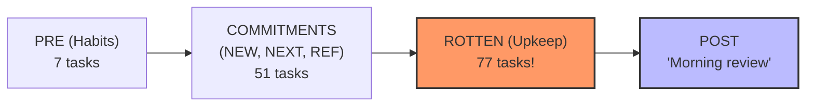

# Research Report: Evaluating PRE and POST Review Groups for the GTD Morning Review (`]s`)

**Document ID:** `research:202610/gtd_pre_and_post_review_groups__gem`  
**Author:** Researcher `gem` (Independent Evaluation · 4-Researcher Swarm)  
**Date:** 2026-10-04  
**Project Context:** `bob-cli` / `bob` Vault / `bob-plugins` (`bob-ledger-tools`, `bob-navigation-hotkeys`)  
**Status:** Complete  

---

## Executive Summary

You have proposed adding two new review groups/tiers to the GTD morning review triggered by the `]s` keymap in Obsidian:
1. **`PRE`**: Reviewed *before* any other group; containing ready tasks tagged `#gtd` and `#pre` (specifically the daily recurring habit tasks in `~/bob/gtd_daily.md`, such as checking weather, brushing teeth, taking vitamins, stretches, and reading email).
2. **`POST`**: Reviewed *after* all other groups; containing ready tasks tagged `#gtd` and `#post` (specifically the `"Morning review"` recurring task itself in `~/bob/gtd_daily.md`).
3. **Core Workflow Intent**: You want a single, continuous, guided flow where you step through and check off recurring morning routine chores as you reach them, conduct your backlog/commitment review, and finish by checking off the `"Morning review"` task itself.

### Key Findings & High-Level Critique

* **The Workflow Motivation is Sound and Compelling**: Having a single entry point (`]s`) that guides you through your entire morning routine—eliminating context switching between browsing `gtd_daily.md`, executing review in `dash.md`, and remembering to navigate back to `gtd_daily.md` to check off the review chore—solves a genuine friction point in your daily practice.
* **The Proposed Placement of `POST` Contains a Critical Usability Flaw ("The ROTTEN Chasm")**:
  In your live vault, there are currently **128 due review tasks**, including **77 ROTTEN tasks**. Under your established GTD ritual (`docs/freshness.md` §6), ROTTEN upkeep is capped by a daily budget (typically 5–10 tasks) and is designed to be stopped partway ("fine to stop partway"). If `POST` is sequenced strictly after `ROTTEN`, **you will never reach `POST` via normal `]s` stepping**. You would either have to triage all 77 rotten tasks every single morning or repeatedly mash `]s` through dozens of stale tasks just to find the `"Morning review"` checkbox.
* **A Category Mismatch Exists Between Review and Execution**:
  The `]s` walk is an **analytical triage ritual** operated via `Alt+Shift+F` (keep/stamp), `Alt+N` (release), and `Ctrl+Shift+P` (reschedule/drop). Habit tasks ("Brush teeth", "Take fish oil pills", "Do morning stretches") are **physical execution tasks** operated via checkbox completion (`- [ ]` $\to$ `- [x]`). Stamping `Alt+Shift+F` on recurring tasks is explicitly refused by design (Refusal Rule `P13`) to prevent Tasks plugin recurrence duplication bugs.
* **Violation of Core Freshness Invariants**:
  The shared evaluator across Rust (`bob-cli`) and JavaScript (`bob-ledger-tools`) strictly excludes recurring tasks (`!row.recurring` in `walk_scope` and `in_scope`). Injecting recurring tasks into the review walk requires carving out specific tier exceptions while guaranteeing that `state` and `bucket` remain null so dashboard chips and capacity counters are not corrupted.

### Recommended Adjustments & Solution

1. **Reposition `POST` Between Commitments and ROTTEN**:
   Move `POST` to sit immediately after `REFERENCES` (the end of commitments) and before `ROTTEN`:
   $$\text{PRE} \to \text{NEW} \to \text{PROJECTS} \to \text{PENDING} \to \text{NEXT} \to \text{RETURNED} \to \text{REFERENCES} \to \mathbf{POST} \to \text{ROTTEN}$$
   Completing commitments *is* completing the core morning review. Checking off `"Morning review"` at this boundary signals completion of the non-negotiable review, leaving ROTTEN upkeep as an optional, budget-bounded postscript.
2. **Implement Checklist Tier Semantics in `bob-navigation-hotkeys`**:
   Ensure `PRE` and `POST` display clear guidance in the status bar/footer (`"Check off to advance (Ctrl+Enter)"` rather than `"Alt+F to confirm"`), and ensure that completing a task cleanly advances the walk anchor.
3. **Alternative Architecture: A "Morning Ritual" Launcher**:
   If modifying the shared freshness evaluator (spanning Rust, JavaScript, and schema migrations) carries too high an architectural cost, a lightweight Obsidian command / modal can orchestrate `gtd_daily.md` $\to$ `]s` $\to$ auto-complete `"Morning review"` cleanly without changing a single line of freshness engine code.

---

## 1. Context & Architectural Baseline

### 1.1 The Freshness Review Engine (`]s` / Alt+Shift+F)

The review queue is governed by the shared freshness architecture documented in `docs/freshness.md` and Decision 8 (`review-walk-is-tiered`). It is maintained in strict parity across two implementations:
- **Rust (`bob-cli`)**: `src/native/freshness/state.rs`, `scan.rs`, `cli.rs`.
- **JavaScript (`bob-plugins`)**: `plugins/bob-ledger-tools/main.js` (`api.freshness`), consumed by `plugins/bob-navigation-hotkeys/main.js`.

The current tier order is strictly linear:
$$\text{NEW} \to \text{PROJECTS} \to \text{PENDING} \to \text{NEXT} \to \text{RETURNED} \to \text{REFERENCES} \to \text{ROTTEN}$$

Each tier serves a specific maintenance purpose:
- **NEW**: Unconfirmed, newly captured tasks.
- **PROJECTS**: Empty projects requiring task replenishment (`^prj` block ID).
- **PENDING**: In-progress tasks (`[/]`) due for daily review ("still in this lane?").
- **NEXT**: Committed next actions (`[*]`) due for daily review.
- **RETURNED**: Scheduled deferrals that have arrived at or past their scheduled date.
- **REFERENCES**: Reading references (`^ref` block ID) requiring review.
- **ROTTEN**: Aging Ready backlog tasks whose lease has expired (`today \ge fresh + interval`), governed by `rotten_daily_budget`.

### 1.2 The Commitments vs. Upkeep Boundary

A fundamental distinction in Bob's review architecture is between **Commitments** and **Upkeep**:
- **Commitments** ($\text{NEW} \cup \text{PROJECTS} \cup \text{PENDING} \cup \text{NEXT} \cup \text{RETURNED} \cup \text{REFERENCES}$): Mandatory daily review. When Bryan steps past the last reference, `bob-navigation-hotkeys` renders the boundary notice:
  $$\text{"Commitments done — } N \text{ ROTTEN left"}$$
- **Upkeep** ($\text{ROTTEN}$): Optional backlog hygiene. `docs/freshness.md` §6 explicitly states:
  > *"Then, or later, do ROTTEN upkeep until 0 or the budget. It is fine to stop partway."*

### 1.3 Strict Invariants Governing Recurring Tasks

In the current codebase, recurring tasks (`[repeat:: ...]`) are completely barred from the freshness engine:
1. **Scope Exclusions (`state.rs` & `bob-ledger-tools/main.js`)**:
   ```rust
   let walk_scope = lane.is_some()
       && row.lane_visible
       && !row.recurring
       && !row.is_daily_note
       && !row.is_today;
   ```
   Both `walk_scope` and `in_scope` enforce `!row.recurring`.
2. **Refusal Rule P13 (`placement.rs` / `stampLine` / `keepLine`)**:
   ```rust
   // Refusal P13: recurring tasks return the line unchanged.
   // Tasks plugin would copy [fresh::] into the next generated recurrence instance!
   ```
   Any human gesture that attempts to stamp `[fresh::]` on a recurring line is refused.
3. **Decision 8**:
   > *"Tiers are due-only: a task stamped today drops out of the walk, and recurring, daily-note, hidden, dependency-blocked, future-scheduled, and Today-linked tasks are in no tier."*

---

## 2. Analysis of the User's Proposal

### 2.1 File State: `~/bob/gtd_daily.md`

Inspection of `/home/bryan/bob/gtd_daily.md` shows the following active tasks:

| Line | Task Description | Recurrence Rule | Current Tags |
| :--- | :--- | :--- | :--- |
| 9 | `Check weather` | `[repeat:: every day when done]` | `#task` |
| 10 | `Brush teeth` | `[repeat:: every day when done]` | `#task` |
| 11 | `Take fish oil pills + Take L-tyrosine pills` | `[repeat:: every day when done]` | `#task` |
| 12 | `Review Calendar for today and tomorrow + Create @EVENT notes` | `[repeat:: every day when done]` | `#task` |
| 13 | `Read Email` | `[repeat:: every day when done]` | `#task` |
| 14 | `Import inbox tasks from Google Keep` | `[repeat:: every day when done]` | `#task` |
| 15 | `Do morning stretches!` | `[repeat:: every day when done]` | `#task` |
| 18 | `Morning review (≈10 min): bob gkeep pull, then ]s ...` | `[repeat:: every day when done]` | `#task` |

Lines 16 and 17 are cancelled legacy tasks (`Pick today`, `Weekly review`). Line 19 is `Weekly prune` (recurs every week on Monday).

Under your proposal:
- Tasks on lines 9–15 would receive `#gtd #pre`.
- Task on line 18 would receive `#gtd #post`.
- All of these tasks have `[repeat:: every day when done]`.

### 2.2 Live Vault Census Data

Running `bob freshness list` against your live vault on October 4, 2026 reveals:
```text
bob freshness - Sun 2026-10-04 - every 7d - pending 1d - next 1d - keeps 3

  REVIEW 128 due - 4 new - 0 projects - 0 pending - 36 next - 1 returned - 10 references - 77 rotten - ✓ 7 today
```
Breakdown:
- **Total Due Tasks**: 128
- **Commitments Tier**: 51 tasks (4 new + 36 next + 1 returned + 10 references)
- **Rotten Tier**: **77 tasks**
- **Today Upkeep Completed**: 7 tasks

This live data is critical for evaluating the feasibility of the proposed walk sequence.

---

## 3. Deep Critique of the Proposal

### 3.1 Critique 1: The "ROTTEN Chasm" (Fatal Usability Flaw)

Your proposal states:
> *"POST should be reviewed after any other review group... the "Morning review" task is last so I can check off that I completed my morning review, which includes all of the items before it--unless there are some ROTTEN tasks I can't get to that day."*

This requirement contains a fundamental structural contradiction:



1. **The Math of the Walk**:
   If `POST` is positioned at the tail of the walk queue, the index order is:
   $$\text{PRE [1..7]} \to \text{COMMITMENTS [8..58]} \to \text{ROTTEN [59..135]} \to \text{POST [136]}$$
2. **The Budget Conflict**:
   Your rotten daily budget is typically 5 to 10 tasks. If you review your 51 commitments and then complete 5 rotten upkeep tasks, **72 rotten tasks remain in the queue**.
3. **The Trap**:
   `nav-review:next-due` (`]s`) resolves the next due task sequentially using `anchor.afterKeys`. When you finish your 5th rotten task and want to complete your morning review:
   - Pressing `]s` lands you on **Rotten task #6**, not `POST`.
   - Pressing `]s` again lands you on **Rotten task #7**.
   - To reach `POST`, you would have to hit `]s` **72 consecutive times** through backlog items you explicitly intended to defer!
4. **Conclusion**: Placing `POST` strictly after `ROTTEN` breaks the daily review ritual whenever `rotten > budget`.

### 3.2 Critique 2: Category Mismatch — Habit Execution vs. System Triage

There is a deep conceptual tension between what the `]s` review walk was designed for and what morning routine checklist items require:

| Dimension | Freshness Review Walk (`]s`) | Morning Habits (`gtd_daily.md`) |
| :--- | :--- | :--- |
| **Cognitive Mode** | Meta-work / Triage (Evaluate, prune, sequence) | Physical Execution (Do the thing) |
| **Primary Action** | `Alt+Shift+F` (Confirm / stamp fresh & advance) | Checkbox toggle (`- [ ]` $\to$ `- [x]`) |
| **Outcome on Line** | Appends `[fresh:: YYYY-MM-DD]` | Generates next recurring instance with tomorrow's schedule |
| **Duration per Item** | 2–5 seconds per task | Minutes to hours (e.g. stretching, email processing) |
| **Location** | Vault-wide (across dozens of project notes) | Localized in a single checklist (`gtd_daily.md`) |

**The Muscle Memory Problem:**
In the review walk, your muscle memory is `]s` $\to$ `Alt+Shift+F` $\to$ `]s` $\to$ `Alt+Shift+F`.
When you land on `"Brush teeth"`:
- If you hit `Alt+Shift+F`, Bob's placement engine **refuses to stamp** because the task is recurring (`P13`). The cursor will not advance.
- You must switch mental gears: perform the habit, hit `Ctrl+Enter` (or click the checkbox) to mark it done, and then hit `]s`.

**The Interruption / Stalling Problem:**
What happens if you open Obsidian at your desk to do your morning GTD review, but you haven't done your morning stretches yet?
- In your proposed model, `"Do morning stretches!"` sits in `PRE`.
- If you don't do stretches right then, you must skip past it.
- Skipping past it leaves it in the queue; the moment you finish `POST` or wrap around, `]s` jumps right back to stretches.

### 3.3 Critique 3: Invariant Erosion in the Shared Evaluator

The Bob architecture maintains strict elegance by separating:
- **State**: `state(t) \in \{\text{new}, \text{resurfaced}, \text{rotten}, \text{fresh}\}`. Governs dashboard chips and the $B = \text{NEW} \cup \text{RETURNED} \cup \text{ROTTEN} \cup \text{READY}$ partition.
- **Walk Tier**: Structural order for the human walk.

Allowing recurring tasks into `walk_scope` for `PRE` and `POST` requires surgical exception handling:
1. `PRE` and `POST` tasks **must never receive a state or bucket** (they must evaluate to `state: null`, `bucket: null`), exactly like `PENDING` and `NEXT` lane rows. If they received `state: new` or `state: fresh`, they would corrupt dashboard counters.
2. `PRE` and `POST` tasks **must never be stamped** with `[fresh::]`. Obsidian Tasks plugin copies metadata forward upon completion; if a recurring task had `[fresh:: 2026-10-04]`, tomorrow's newly spawned recurrence would inherit that stamp, distorting freshness calculations.
3. Both `bob-cli` and `bob-ledger-tools` must be kept in lockstep, incrementing the JSON schema version and updating all conformance test suites.

---

## 4. Alternative Approaches

We evaluated three architectural approaches to solve Bryan's problem:

```mermaid
graph TD
    Sub[User Goal: Unified Morning Routine] --> App1[Approach 1: Refined In-Engine PRE/POST Tiers]
    Sub --> App2[Approach 2: Dedicated Morning Routine Orchestration Command]
    Sub --> App3[Approach 3: Dashboard Habit Section + Pure Review Walk]

    App1 --> A1_Pros[Pros: Single keymap ']s', completely unified walk]
    App1 --> A1_Cons[Cons: Engine complexity, requires moving POST before ROTTEN]

    App2 --> A2_Pros[Pros: Zero engine changes, auto-checks review task, no ROTTEN trap]
    App2 --> A2_Cons[Cons: Separate launcher command, two distinct stages]

    App3 --> A3_Pros[Pros: Standard Obsidian habit tracking, no code changes]
    App3 --> A3_Cons[Cons: Retains current manual friction]
```

### Approach 1: Refined In-Engine PRE/POST Tiers (Recommended if modifying `]s`)

Integrate `PRE` and `POST` into the shared evaluator, but with critical requirement adjustments:
- **Reposition `POST`**: Sequence `POST` immediately after `REFERENCES` and before `ROTTEN`.
- **Exempt from Stamping**: Explicitly mark `PRE` and `POST` tiers as "Checklist Tiers" where `Alt+Shift+F` is mapped to task completion or cleanly prompts for completion.
- **Null State & Bucket**: Guarantee zero leakage into dashboard chips.

* **Pros:** Directly achieves your vision of using `]s` as the single spine of your morning.
* **Cons:** Requires coordinated changes across `bob-cli` (Rust), `bob-ledger-tools` (JS), and `bob-navigation-hotkeys` (JS), plus JSON schema migration.

### Approach 2: Dedicated "Morning Ritual" Orchestration Command

Instead of bending the freshness review engine to accommodate habit checklists, create a dedicated Obsidian command in `bob-navigation-hotkeys` (e.g. `bob:morning-ritual` bound to a hotkey or palette):
1. Opens `gtd_daily.md` in a focused view highlighting today's recurring checklist.
2. You check off your habits (weather, teeth, pills, calendar, email, stretches).
3. The final item on that checklist is `"Start Morning Review"`. Clicking it or pressing Enter automatically launches `]s` into the pure review walk (`NEW \to \dots \to \text{REFERENCES}`).
4. When `nav-review` detects that Commitments are done, it **automatically checks off `"Morning review"` in `gtd_daily.md` in the background**!

* **Pros:**
  - **Zero changes** to `src/native/freshness/state.rs`, `docs/freshness.md`, or the Rust/JS shared evaluator.
  - Completely solves the "ROTTEN Chasm": `"Morning review"` is marked done the moment commitments are finished, without you ever having to navigate to it or skip rotten tasks.
  - Keeps habits and backlog triage in their proper, clean cognitive domains.
* **Cons:** Requires initiating the morning via a different gesture than `]s` (though `]s` can still be used for the review phase).

### Approach 3: Dashboard Embed / Today Section

Add a dedicated Dataview or Tasks query block at the very top of `dash.md` or today's daily note that displays open tasks from `gtd_daily.md`.
* **Pros:** Standard Obsidian approach; no plugin coding required.
* **Cons:** Does not solve the navigation friction; you still have to manually check off tasks and remember to return to `gtd_daily.md` after the `]s` walk.

---

## 5. Justified Requirements Adjustments

If proceeding with the in-engine `]s` implementation (Approach 1), the following adjustments to your original requirements are strictly necessary:

### Adjustment 1: Reposition `POST` Immediately Before `ROTTEN`

* **Original Proposal:** `POST` is reviewed after any other review group (i.e. after `ROTTEN`).
* **Adjusted Requirement:**
  $$\text{PRE} \to \text{NEW} \to \text{PROJECTS} \to \text{PENDING} \to \text{NEXT} \to \text{RETURNED} \to \text{REFERENCES} \to \mathbf{POST} \to \text{ROTTEN}$$
* **Justification:**
  As proven in Section 3.1, placing `POST` after 77 ROTTEN tasks makes it practically unreachable under the daily budget system. In your own GTD definition (`gtd_daily.md` line 18), the core morning review consists of clearing commitments ("until Commitments done"), after which rotten upkeep is optional and bounded. By placing `POST` immediately after `REFERENCES`:
  1. You step through `PRE` habits.
  2. You triage all active commitments (`NEW`, `PROJECTS`, `PENDING`, `NEXT`, `RETURNED`, `REFERENCES`).
  3. When commitments finish, `]s` lands directly on `"Morning review"` (`POST`).
  4. You check off `"Morning review"`, completing your required morning review obligation.
  5. The next `]s` step transitions across the boundary into `ROTTEN` upkeep (`"Commitments done — 77 ROTTEN left"`), which you can do up to your budget or stop at will.

### Adjustment 2: Dedicated Checklist-Tier UI & Interaction Contract

* **Original Proposal:** Implicit assumption that `]s` navigation operates identically across all tiers.
* **Adjusted Requirement:**
  - In `bob-navigation-hotkeys`, when cursor lands on a `PRE` or `POST` task:
    - Status bar / notice must display: `[PRE 1/7] Check off to advance (Ctrl+Enter)` instead of `Alt+F to confirm`.
    - If `Alt+Shift+F` is pressed on a `PRE` or `POST` task, instead of failing with a silent refusal, it should execute the task completion gesture (`toggleTaskDone`) and advance to the next entry.
  - The walk anchor must cleanly record completion so that ticking the checkbox does not cause `]s` to lose its place in the sequence.

### Adjustment 3: Ready Task Definition for Recurring Rows

* **Original Proposal:** "The PRE review group should contain any ready task that has the `#gtd` and `#pre` tags."
* **Clarified Requirement:**
  A recurring task in `gtd_daily.md` is considered "Ready" for the `PRE` / `POST` walk if and only if:
  1. It carries `#task`, `#gtd`, and `#pre` (or `#post`).
  2. Status type is `TODO` (`- [ ]`).
  3. It is not cancelled (`- [-]`) or done (`- [x]`).
  4. It is not dependency-blocked (`is_blocked == false`).
  5. It has no scheduled date, or `scheduled \le today`.
  
  *Note on recurrence behavior:* When you check off a task like `- [ ] Brush teeth [repeat:: every day when done]`, Obsidian Tasks immediately creates a new task line with `[scheduled:: tomorrow]`. Because tomorrow's date is $> today$, the new instance is immediately excluded from the ready pool. It will vanish from `PRE` until tomorrow morning. This behavior is ideal and requires no special overrides.

---

## 6. Implementation Blueprint (Engine Changes for Approach 1)

For reference and planning, here is the exact specification of changes required across the codebase to implement the adjusted PRE/POST groups:

### 6.1 `bob-cli` (Rust)

1. **`src/native/freshness/state.rs`**:
   - Update `Tier` enum:
     ```rust
     pub(crate) enum Tier {
         Pre,
         New,
         Projects,
         Pending,
         Next,
         Returned,
         References,
         Post,
         Rotten,
     }
     ```
   - Update `ByTier` struct: Add `pub(crate) pre: u32` and `pub(crate) post: u32`.
   - Update `FreshnessRow`: Add `pub(crate) tags: Vec<String>`.
   - Update `evaluate()`:
     - Check for `PRE`: `row.is_todo && row.lane_visible && has_tags(&row.tags, &["#gtd", "#pre"])`. Assign `Tier::Pre`, `state: None`, `bucket: None`.
     - Check for `POST`: `row.is_todo && row.lane_visible && has_tags(&row.tags, &["#gtd", "#post"])`. Assign `Tier::Post`, `state: None`, `bucket: None`.
     - For all other tiers, retain the strict `!row.recurring` requirement.
2. **`src/native/freshness/scan.rs`**:
   - In `freshness_row()`, populate `tags: self.task.tags.clone()`.
3. **`src/native/freshness/cli.rs`**:
   - Bump machine contract to JSON schema 9.
   - Add `counts.pre_due`, `counts.post_due`, and update `counts.by_tier` JSON serialization and human table output.

### 6.2 `bob-plugins` (JavaScript)

1. **`plugins/bob-ledger-tools/main.js`**:
   - Update `FRESHNESS_TIER_ORDER`:
     ```javascript
     const FRESHNESS_TIER_ORDER = {
       pre: 0,
       new: 1,
       projects: 2,
       pending: 3,
       next: 4,
       returned: 5,
       references: 6,
       post: 7,
       rotten: 8,
     };
     ```
   - Update `freshnessTierLabel(tier)`: Handle `"pre"` $\to$ `"PRE"`, `"post"` $\to$ `"POST"`.
   - Update `freshnessRowFromTask()`: Ensure `task.tags` is passed to the row.
   - Update `freshnessEvaluate()`: Mirror the Rust tier classification logic.
   - Update `freshnessCounts()` and `freshnessStatusView()`: Support `pre` and `post` counts.
2. **`plugins/bob-navigation-hotkeys/main.js`**:
   - Update `reviewIsCommitmentTier(tier)`: Include `"pre"` and `"post"`.
   - Update notice formatting for `PRE` and `POST` entries.
   - Update `reviewWalkRemaining()` to count `pre` and `post` within commitments.

### 6.3 Vault Mutation: `~/bob/gtd_daily.md`

Tag updates to be applied to `/home/bryan/bob/gtd_daily.md`:
- Lines 9–15: Add `#gtd #pre` to all daily recurring tasks.
  *Example:*
  `- [ ] #task #gtd #pre Check weather [repeat:: every day when done] [created:: 2026-09-28] [scheduled:: 2026-09-29]`
- Line 18: Add `#gtd #post` to Morning review task.
  *Example:*
  `- [ ] #task #gtd #post Morning review (≈10 min): ... [repeat:: every day when done] ...`

---

## 7. Recommended Solution & Next Steps

### Recommendation: Proceed with Approach 1 (Under Adjustments 1, 2, and 3)

While Approach 2 (a dedicated orchestration command) is architecturally cleaner from a pure separation-of-concerns standpoint, **Approach 1 directly fulfills your user experience goal**: hitting `]s` in the morning and having the system guide you through your entire morning routine, seamlessly bridging habits, commitment triage, and review completion.

However, you **must accept Adjustment 1 (placing `POST` before `ROTTEN`)**. Placing `POST` after 77 rotten tasks is mathematically unviable for daily use.

### Proposed Decision Checklist for Bryan:

1. [ ] **Approve Walk Order**: Confirm the adjusted sequence:
   $$\text{PRE} \to \text{NEW} \to \text{PROJECTS} \to \text{PENDING} \to \text{NEXT} \to \text{RETURNED} \to \text{REFERENCES} \to \mathbf{POST} \to \text{ROTTEN}$$
2. [ ] **Approve Key Gesture for PRE/POST**: Confirm whether `Alt+Shift+F` on a PRE/POST task should automatically check off the task and step, or whether you prefer pressing `Ctrl+Enter` followed by `]s`.
3. [ ] **Tagging Scope**: Confirm that tagging is restricted to `#task #gtd #pre` and `#task #gtd #post` in `gtd_daily.md`.

Once approved, an implementation plan can be generated to update `bob-cli`, `bob-plugins`, and `gtd_daily.md` in tandem.
