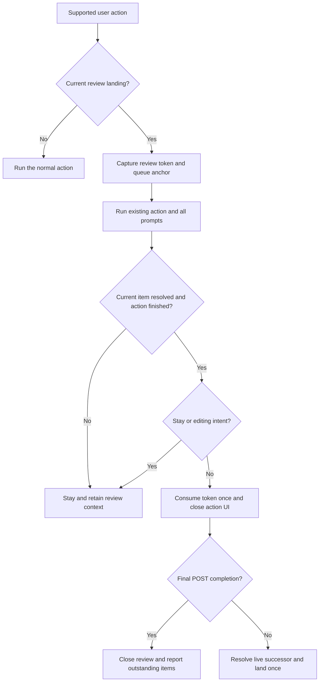

GTD morning review: continue after committed task actions

Independent research by cdx · 2026-10-06

**Recommendation in brief.** Adopt automatic continuation when a supported action successfully resolves the task the review walk just landed on. Put the decision in one small coordinator owned by `bob-navigation-hotkeys`; have existing action handlers report committed outcomes to it. Extend Ctrl+Enter completion to every review tier and allow the last PRE completion to enter the next tier. Add Today linking, lane commit/release, and successful Task Card decisions. Preserve explicit “stay” gestures, editing actions, cancellation, and POST closeout. Do not make disappearance from the queue, by itself, a navigation trigger.

This is a useful improvement to an existing workflow, with a bounded implementation. The difficult part is preserving intent, identity, and focus through asynchronous actions—not adding more key bindings.

**Scope and evidence.** I independently inspected the current bob-cli documentation and the source-of-truth bob-plugins checkout, consulted the accepted review/lane/dependency/Today/freshness decisions through audited memory reads, and ran relevant existing tests. I did not read or request any peer report, transcript, or findings. This report proposes implementation; it makes no plugin, vault, configuration, or memory changes.

Source snapshots: bob-cli `1d4d9fdc4bc28f3694358bbc39dadae781d8f170`; bob-plugins `b66201867008d00d48c5535ca9ab2ea2ef197e12`. The inspected navigation plugin is 2.4.0. Binding descriptions below come from the current implementation and command documentation; I did not inspect Bryan's live desktop session or verify its installed hotkey overrides. The linked chezmoi checkout did not yield a relevant Obsidian binding source in the focused filename search, so no proposed behavior depends on a guessed dotfile binding.

**What exists already.** The walk is one shared evaluator-backed queue:

`PRE → NEW → PROJECTS → PENDING → NEXT → RETURNED → REFERENCES → ROTTEN → POST`.

PRE/POST are checklist tiers, resolved by completing their Tasks checkboxes, including recurrence. The other tiers usually resolve through a successful review stamp, completion/cancellation, blocking/deferral, or exclusion through Today membership. PROJECTS and REFERENCES are special tracker tiers; they do not inherit ordinary lane cadence and never participate in decay decisions. ROTTEN is optional upkeep, whereas POST is an explicit closing ritual. These distinctions must survive a navigation improvement. [S1]

The existing implementation already solves much of the navigation problem:

- `landOnReviewQueueEntry()` remembers a `reviewLanding` with the entry's path, exact original task text, key, tier, and local day. It handles same-note cursor placement and opening a different note.
- `buildReviewAnchor()` records where to continue, including ordered successor/predecessor keys from the queue before the action. `planReviewJump()` can keep walking when a completed, stamped, released, or rolled task disappears, and can exclude a handled entry still visible in a lagging Tasks cache.
- Ctrl+Enter has a versioned cross-plugin claim: task-status-cycler asks navigation's `claimReviewWalkCompletion(editor)`. Currently navigation claims only the exact PRE/POST row it just landed on. Checklist completion goes through `completeTaskAtCursor()`, which invokes the Tasks completion command, checks the resulting closed row, and awaits completion side effects.
- Ctrl+Alt+F already means refresh/complete and advance; Alt+F means refresh/complete in place. The decay card carries that choice through successful outcomes. Reword is explicitly a stay-on-task exception, even when opened through Ctrl+Alt+F. [S2–S5]

There is a deliberate difference between current Ctrl+Enter and Ctrl+Alt+F: Ctrl+Enter walks *within* PRE and pauses on its last row with `PRE done` and a `]s` hint; Ctrl+Alt+F crosses from PRE into the next tier. POST completion advances within POST and closes the review at its terminal row. Thus the requested generalization includes an explicit change to the existing PRE boundary behavior, not merely a missing hook. [S1, S3]

**Is the idea sound?** Yes, for terminal review decisions. Right now a person can decide “do today,” “release this lane,” or “defer” and then press a second key solely to restore the review flow. The remembered walk anchor shows that this continuation is already intended; automating that second navigation step makes the ritual more consistent.

The benefit is predictable removal of one navigation gesture per qualifying decision. If there are N such decisions, that saves approximately N extra `]s` presses; this is a mechanical estimate, not a measured productivity claim. It also prevents a common interruption: finishing a decision and wondering whether the next `]s` will continue or restart.

The risk is treating navigation as a reward for every mutation. Some actions are steps toward a decision, and some remove the queue item as a side effect while deliberately opening an editing context. Reword stamps immediately but then positions the cursor for editing. A move stamps the task while routing it to a different note. Creating a project opens material that may need further work. Automatically leaving those contexts can interrupt the actual task.

A second risk is fast repeated input: a held or duplicated completion key must not complete the successor merely because it has just received focus. A third is asynchronous focus theft: a task action may finish after Bryan has navigated elsewhere. Both are more important than shaving a small amount of jump latency.

The appropriate rule is therefore **“continue after the current review interaction commits and finishes,”** with queue membership used as evidence, rather than **“continue whenever an item disappears.”** The W3C modal-dialog pattern normally returns focus to the invoker but permits a different logical destination when the dialog's completed task directly leads to the next workflow step. That supports moving to the next review task after a terminal decision, while retaining focus for cancellation or further editing. This is my application of that guidance to Bob, not a W3C prescription for GTD. [E1]

**Requirements I would adjust explicitly.**

1. Limit automatic continuation to a current review landing established by `]s`, `[s`, `[S`, or `]S`. Completing an ordinary task elsewhere should not start the morning review or jump to its first item. The existing landing guard is a strong starting point; a remembered anchor alone is insufficient.
2. Define success at the end of the action, including mandatory side effects and secondary prompts. Selecting a card row, accepting a date preview, or closing a modal is not success. Escape, stale-data refusal, failed writes, and no-op changes stay put.
3. Replace the last-PRE Ctrl+Enter pause with automatic continuation into the next due tier, and show a boundary notice. This is a conscious UX change to the documented behavior. Preserve notice counts for skipped PRE rows.
4. Preserve Alt+F as “keep/complete and stay” and Ctrl+Alt+F as “keep/complete and continue.” Unifying these would erase an existing intentional distinction and make it harder to inspect or edit the result. This is an exception to an unrestricted “any removal advances” rule.
5. Preserve Reword and other operations that intentionally begin editing. Their incidental stamp does not authorize immediate navigation.
6. Treat Ctrl+Shift+Enter by its outcome. Linking the current review task into Today is a resolution candidate; unlinking is a different operation and should not automatically advance or acquire a new stamp.
7. Do not promise that automatic progression drains every group. The accepted ritual allows skipped items and bounded/optional ROTTEN upkeep. POST remains deliberate; reaching it does not complete it. Final POST completion closes the review with truthful outstanding counts rather than looping back into earlier work.
8. For batch actions, advance once only if the current review item itself was resolved. Other successes in the batch must not hide a skipped or failed current item. A Vim count scopes the mutation; it must not also become a navigation count.

Items 3 and 7 clarify boundaries; items 1, 2, 4, 5, 6, and 8 narrow the broadest possible reading of the request. No changes to freshness intervals, lane policy, queue tiers, tags, or review-stamp semantics are needed.

**Action inventory and proposed policy.** “Continue” below always assumes a valid current review landing, successful final commit, and no explicit stay/edit intent.

| Gesture or action | Proposed result during the walk | Why / important qualification |
| --- | --- | --- |
| Ctrl+Enter on an open source task | Continue after successful completion in every tier | Direct completion is terminal. Keep Tasks recurrence, dependency recovery, reference lifecycle updates, and existing propagation semantics. Reopening a completed task does not continue. |
| Ctrl+Enter on the last PRE item | Enter the next due tier | Removes the current extra `]s` step; announce the transition and skipped PRE count. |
| Ctrl+Enter on POST | Next POST row, then explicit closeout | Never auto-complete POST or restart the review after its closing completion. |
| Ctrl+Shift+Enter linking the current task to today's open Pomodoro | Continue after the complete link operation | Today excludes ordinary review rows. Ready/Blocked may become Next; already-Next/Pending tasks can still resolve through the new Today link even when their checkbox is unchanged. PRE/POST remain checklist rows and must not resolve through Today linking. |
| Ctrl+Shift+Enter unlink or Task Link deletion | Stay | Unlink preserves the lane and does not stamp. Today removal can make a task newly eligible, rather than resolve it. Actions from unrelated ledger bullets also fail the current-landing guard. |
| Alt+N: commit Ready to Next, release Next/Pending to Ready | Continue | A concrete lane decision stamps the task. Pending release waits for its optional Work Log prompt and link cleanup; Escape cancels. This is the strongest additional direct-keymap candidate. |
| Task Card priority digits `1`–`4` (configured extra digits), or its Ctrl+Enter recommendation | Continue after the final write | Priority/roll/decay/terminal cancellation are decisions. Preserve the frozen displayed date and any Work summary stage; do not jump when the recommendation preview is refreshed. |
| Task Card Schedule → confirmed date | Continue when the current item resolves | Future deferral generally blocks it; other actual supported task-line schedule writes may stamp it. Choosing the date is only an intermediate stage when Reason/Work summary is still pending. |
| Task Card `x` → confirmed cancellation | Continue | The initial `x` only opens the reason stage. Wait for cancellation and its existing dependency/reference/link side effects; no stamp on closed rows. |
| Task Card `b` → committed dependency selection | Continue after a changed, final dependency commit resolves the task | This can block and/or stamp the parent. Search, highlight, open-prerequisite, and intermediate selection are not commits. Dependents remain distinct from their prerequisite targets. |
| Task Card `f` → committed refresh interval | Continue when the current row is actually resolved | The action can change cadence and stamp; the visible 14/30/90 Ready presets do not replace daily lane intervals. Preserve the existing evaluator's result. |
| Task Card `0`, Ctrl+D, or a More-property commit | Continue only for an actual resolving task change | A clearing/edit gesture may stamp and resolve, but deleting an absent value, changing project frontmatter, or a change that leaves the current item due must stay. Do not special-case only a few properties and miss other genuine task decisions. |
| Ctrl+Alt+F | Preserve existing continue behavior | Route it through the coordinator so it does not also trigger a second jump. |
| Alt+F | Preserve existing stay behavior | An explicit inspection/editing escape hatch, including checklist completion in place. |
| Approved-decay card Not now / Less often / explicit level / Drop | Continue when opened from the active review and committed | Natural terminal triage decisions. Preserve an explicit Alt+F stay request; never advance on opening or dismissing the card. Ctrl+Alt+F already requests continuation. |
| Approved-decay card Keep | Follow the opening stay/continue request | Avoid silently changing Alt+F into a continue gesture. |
| Approved-decay card Reword (`E`) | Stay, place cursor for editing | This already intentionally suppresses continuation despite writing a stamp. After editing, Bryan can use Ctrl+Alt+F or `]s`. |
| Ctrl+Shift+M task relocation | Candidate for a second phase, with explicit “route and continue” semantics | It stamps, but moving normally has destination-navigation behavior. Coordinate that behavior before enabling review continuation; never let both destinations race. Initial recommendation is to preserve focus at the move destination. Pomodoro-bullet moves are not review resolutions. |
| Alt+[ / Alt+] status cycling | Stay by default | These stamp open transitions, but a status cycle can require several presses. Advancing after the first intermediate state makes the chord hard to use correctly. Prefer Alt+N/card decisions for terminal lane triage. |
| Ctrl+Shift+] demote `#task` to ordinary bullet | Possible later “drop from task system and continue” adapter | A real demotion could be terminal; the same chord also creates tasks and may open a section picker. Preserve editing/placement until its completion semantics are explicitly covered. |
| Create project note from task / reverse project to task | Stay in the resulting editing context initially | Structural conversion and note navigation can start planning rather than finish review. `create-project-note-from-task` is explicitly not a review-stamping action. |
| Native checkbox clicks, Tasks modal, raw edits, background hooks/sync/capture | No ambient auto-jump | These lack a reliable current-interaction completion signal in the researched integration. A future explicit adapter can support native completion; a global file watcher should not guess intent. |

The Task Card is only the entry surface: mouse clicks or command-palette invocation of the same committed actions should receive the same continuation policy. This keeps behavior tied to the action instead of its keyboard spelling. [S1, S6–S10]

Two subtleties make a simple post-write queue diff insufficient. First, linking an already-Next task that already has a block ID can leave its source line unchanged: Today is derived from the daily ledger, so the ledger write itself can resolve review. Second, scheduling `^prj` can target project frontmatter; such writes never stamp, and project tracker review deliberately ignores note-frontmatter scheduling as its own exclusion. Do not mark that tracker handled merely because a scheduling modal successfully closed. [S1, S6, S7]

**Implementation choices.**

| Approach | Assessment |
| --- | --- |
| Bind each relevant key to “action, then `]s`” | Small first diff, but asynchronous prompts and cancellation break it; duplicated key capture risks double handling. Reject. |
| Observe queue/cache/file changes globally and jump when the current entry vanishes | Covers many inputs, but confuses automation, partial actions, undo, and editing with review completion. Reject as the primary trigger. |
| Have each successful writer call `jumpToDueTask()` directly | Better causality, but repeats eligibility, identity, prompt timing, and exception logic in multiple plugins. Useful only as a short-lived prototype. |
| Shared review-action coordinator with explicit outcome hooks | Recommended. Reuse existing queue/anchor/landing helpers, centralize the navigation policy, and leave writes with their current owners. |
| A separate review-only Task Card or a new keymap for every outcome | More explicit but duplicates surfaces and conflicts with the accepted single-walk direction. Consider only if testing shows ordinary review focus is too ambiguous. |

**A concrete coordinator design.** Keep it inside `bob-navigation-hotkeys`; expose an additive, frozen, never-throwing API through the existing plugin API pattern. A top-level nav API version bump plus a feature-detected `reviewWalk` capability is appropriate. Names below are illustrative, not a proposed final public schema:

```js
const token = nav.api?.reviewWalk?.beginAction({
  editor,
  action: "link-today",          // a semantic operation
  intent: "default",            // default | stay | continue | edit
  targets: selectedTaskRefs,
});

const outcome = await existingActionFlow();
// outcome describes a settled commit, not opening a secondary prompt.
closeActionUIAfterSuccessfulCommit(outcome);
await nav.api?.reviewWalk?.finishAction(token, outcome);
```

`beginAction` should synchronously return null unless the editor's task is the current valid review landing. Otherwise it captures the queue before the write, current task identity/preimage, original tier, local day, origin editor/leaf, and a generation/operation ID. Store the token across Work Log, Reason, cancellation, ID, and dependency picker stages. Do not let intermediate-stage returns masquerade as final outcomes.

`finishAction` should receive enough information to distinguish `{committed, affectedTargets, effect, focusIntent}`. Useful effects include completed, cancelled, stamped/confirmed, Today-linked, and unresolved. Do not invent new freshness stamps just to make continuation easier. For compound cross-file operations, commit means all required components succeeded; a partially applied Today link or failed mandatory cleanup should report its partial failure and leave focus available for recovery.

The coordinator should then:

1. Validate that the token is current, unconsumed, same local day, and still owns the interaction. A user navigation away, a newer manual review jump, or plugin unload invalidates permission to move focus. Ordinary modal focus within the captured action chain does not.
2. Confirm that the current review task—not merely another batch member—was resolved through an allowed terminal effect. Checklist tiers require actual completion; a stamp or Today link cannot stand in for that completion. Explicit stay/edit wins over removal.
3. Consume the token once, record the handled original identities, and use the queue-before-action anchor for successor ordering. Read the live queue for remaining eligibility. Do not use the mutated cursor as the source of truth.
4. Resolve the first surviving forward candidate; if no forward candidate survives, use the first remaining due entry with a wrap notice, following manual-walk semantics. If there is nothing due, stop. Final POST completion is a separate closeout outcome and never wraps.
5. Close the modal/action chain before focusing and centering the destination. Reuse the existing review landing and jump-history helpers, then render one coherent outcome/landing notice with appropriate tier-boundary and outstanding counts.



The eligibility check should have two complementary inputs: a verified committed outcome from the action owner, and the evaluator/live task state. The former permits truthful continuation while the Tasks cache lags; the latter prevents unjustified exclusion when a successful writer did not resolve this particular review row. Unsupported or inconsistent evidence should retain the anchor and allow manual `]s`, rather than claim the review is complete.

**Important engineering constraints.**

- Preserve the ordinary Ctrl+Enter implementation. Simply broadening the checklist claim and calling `completeTaskAtCursor()` for every task could bypass the ordinary path's transcluded-task propagation. Keep the existing action precedence and completion finalizers, and report the settled outcome around those paths. The exact landed PRE/POST claim should continue to handle its special `[?]` checklist case. Completion callbacks should also cover the non-Vim command path where applicable. [S3, S8]
- Guard reentrancy and held-key repetition. One action produces at most one continuation. The existing `opening` and modal `settled` flags are useful, but the coordinator also needs a token/epoch so old asynchronous callbacks cannot land over a newer `]s`.
- Treat identity carefully. Ledger queue keys use `path#blockId` when available and `path:line` otherwise. Line numbers alone are unstable when Tasks inserts a recurring occurrence above the completed row, a log is inserted, or a task moves. Use captured text/preimages and unique live resolution; retain the existing recurrence handling, and refuse ambiguous duplicate matches instead of guessing. Do not add block IDs merely to implement this feature. [S2, S3, S11]
- A handled original task is not the next occurrence of a recurring chore. Continue past the occurrence just completed without suppressing a genuinely due replacement. Verify both Tasks recurrence insertion modes already covered by the checklist tests.
- Reuse live-entry validation. `jumpToDueTask()` rereads and retries a stale landing once; repeating the same stale queue is not always enough when several entries changed. The checklist path already batches reads by note and filters stale rows. Generalize that bounded validation where needed; avoid polling on arbitrary sleeps or spinning through unbounded retries. [S2, S3]
- Keep cursor motion and writes separate. Continuation adds no transaction, status change, review tag, or persistent session marker. Same-note writes keep their existing undo grouping; cross-note undo remains subject to existing limitations. A successful write followed by a failed jump should say the action succeeded and navigation failed, retain the continuation anchor, and never replay the action.
- Own focus restoration explicitly. Close/tear down the complete modal chain before the new landing; late modal-restoration or task-move callbacks must not steal focus back. Register new listeners through Obsidian lifecycle helpers and invalidate pending tokens on unload. Official Obsidian guidance documents automatic listener cleanup through `registerEvent`/`registerDomEvent`; its Vault guidance also supports guarded preimage writes. Those are reasons to retain the current action writers rather than create a second mutation path for review. [E2, E3]
- Keep policy in navigation, truth in the existing evaluator. The Rust queue, bucket semantics, budgets, and lane rules need no behavioral change. Documentation and tests must describe the updated desktop gesture contract; a native/schema change should be justified separately if implementation discovers a missing outcome contract.

**A practical implementation sequence.** First extract the common continuation planner from the current refresh/checklist/decay paths and introduce the transient token/capability. Preserve current behavior while consolidating exactly-once handling. Then wire ordinary Ctrl+Enter completion, successful source-task Today linking, Alt+N, and the final Task Card commit paths. Update the last-PRE boundary and its notices deliberately. Finally fold the approved-decay paths into the same mechanism, preserving Alt+F and Reword exceptions. Leave relocation, project conversion, status cycling, and native checkbox clicks for a separately justified extension after the core UX is tested.

Work mainly belongs in bob-plugins: navigation review helpers and mixins; task-status-cycler completion paths; block-id-prompt's completed Today-link flow; and Task Card/decay commit handlers. Documentation belongs in bob-cli `docs/freshness.md`, `docs/getting-started.md`, and the Task Card description in `docs/projects.md`, with corresponding plugin README/API notes. For a future implementation, edit `src/` fragments, regenerate `main.js` with the repository build, run the appropriate checks, and deploy with `bob plugins sync`; generated entrypoints are not the editing source.

**Validation and remaining uncertainty.** I ran 12 focused existing Node test files, all passing: the first six reported 107 tests; the second six completed successfully with the dot reporter. These covered checklist Ctrl+Enter/recurrence, jump history, Task Card Reason/Work review, decay handlers, ordinary Ctrl+Enter and propagation, freshness/anchor behavior, stamps, lane toggles, task moves, and block-id-prompt link/unlink behavior. This validates the cited existing behavior, not the proposed integration. No new implementation was tested and no live desktop smoke test was performed.

The implementation should add meaningful integration cases for:

| Case | Expected result |
| --- | --- |
| Same task action outside review | Existing mutation, no jump |
| Completion in each of the nine tiers | Exactly one correct landing; terminal POST closes |
| Final PRE, including skipped earlier chores | Next tier with truthful skipped counts |
| Stale Tasks cache, recurrence inserted above/below, duplicate task text | Correct successor or safe refusal; never skip or complete an unintended row |
| Today link on Ready vs already-Next/Pending | Continue based on successful ledger effect, even without a source-line change |
| Today linking a PRE/POST row | Stay unless actual checklist completion occurred |
| Link ID prompt cancelled, missing daily note, partial cross-file write | No automatic continuation; truthful error |
| Schedule/priority/cancel with pending Reason or Work summary | Stay through prompts; continue only on final successful commit |
| Escape, stale preimage, no-op clear, current item skipped in a batch | Stay |
| Alt+F vs Ctrl+Alt+F, including decision cards | Preserve explicit stay/continue choice |
| Reword, relocation, project conversion | Preserve intentional editing/destination focus |
| User navigates away while action is pending; newer `]s`; double event; held key | Old action cannot steal focus or resolve the successor |
| Old/missing navigation capability or unloaded plugin | Mutation still works; graceful manual continuation |
| No successor / skipped earlier entries / remaining ROTTEN / POST | Honest empty, wrap, boundary, and closeout notices |

Desktop smoke tests should exercise Vim normal mode and ordinary editing, same-note and cross-note jumps, nested modal cancellation, and Ctrl+O history after a continuation. The most consequential unresolved implementation detail is where each compound writer exposes a *settled* commit result; several current APIs return booleans rather than effect-rich outcomes. Do not infer that a `true` return from an intermediate modal transition means the vault decision finished.

**Source references.** These are exact inspected repository snapshots. Line links identify useful starting points, not claims that an entire feature resides on one line.

- [S1: Freshness rules, gesture stamping, and current ritual](https://github.com/bobs-org/bob-cli/blob/1d4d9fdc4bc28f3694358bbc39dadae781d8f170/docs/freshness.md#L606); also the tracking-review section earlier in the same document.
- [S2: Review jump planner and versioned navigation API](https://github.com/bobs-org/bob-plugins/blob/b66201867008d00d48c5535ca9ab2ea2ef197e12/plugins/bob-navigation-hotkeys/src/480-review-jump-and-nav-api.js#L16); [anchor and cursor identity helpers](https://github.com/bobs-org/bob-plugins/blob/b66201867008d00d48c5535ca9ab2ea2ef197e12/plugins/bob-navigation-hotkeys/src/470-keydown-and-freshness.js#L641).
- [S3: Exact PRE/POST claim, live filtering, and completion boundaries](https://github.com/bobs-org/bob-plugins/blob/b66201867008d00d48c5535ca9ab2ea2ef197e12/plugins/bob-navigation-hotkeys/src/535-plugin-review-checklist-walk.js#L60).
- [S4: Review landing and live-queue jump implementation](https://github.com/bobs-org/bob-plugins/blob/b66201867008d00d48c5535ca9ab2ea2ef197e12/plugins/bob-navigation-hotkeys/src/520-plugin-lane-links-and-review.js#L278).
- [S5: Existing approved-decay continuation and Reword exception](https://github.com/bobs-org/bob-plugins/blob/b66201867008d00d48c5535ca9ab2ea2ef197e12/plugins/bob-navigation-hotkeys/src/530-plugin-freshness-refresh-and-decay.js#L660); [Reword writer](https://github.com/bobs-org/bob-plugins/blob/b66201867008d00d48c5535ca9ab2ea2ef197e12/plugins/bob-navigation-hotkeys/src/540-plugin-decay-picker-and-cancel.js#L110).
- [S6: Task Card actions, project scheduling, and secondary prompts](https://github.com/bobs-org/bob-cli/blob/1d4d9fdc4bc28f3694358bbc39dadae781d8f170/docs/projects.md#L276).
- [S7: Today-link and lane-preserving unlink writers](https://github.com/bobs-org/bob-plugins/blob/b66201867008d00d48c5535ca9ab2ea2ef197e12/plugins/block-id-prompt/src/120-plugin-pomodoro-links.js#L408).
- [S8: Task completion, Tasks command, and propagation](https://github.com/bobs-org/bob-plugins/blob/b66201867008d00d48c5535ca9ab2ea2ef197e12/plugins/task-status-cycler/src/160-plugin-completion.js#L1); [Vim dispatch precedence](https://github.com/bobs-org/bob-plugins/blob/b66201867008d00d48c5535ca9ab2ea2ef197e12/plugins/task-status-cycler/src/140-plugin-vim.js#L128).
- [S9: Lane and refresh-interval writers](https://github.com/bobs-org/bob-plugins/blob/b66201867008d00d48c5535ca9ab2ea2ef197e12/plugins/bob-navigation-hotkeys/src/510-plugin-link-commit-and-lane.js#L435); [priority recommendation commit and revalidation](https://github.com/bobs-org/bob-plugins/blob/b66201867008d00d48c5535ca9ab2ea2ef197e12/plugins/bob-navigation-hotkeys/src/390-picker-roll-write.js#L352).
- [S10: Generic property writer's conditional final stamp](https://github.com/bobs-org/bob-plugins/blob/b66201867008d00d48c5535ca9ab2ea2ef197e12/plugins/bob-navigation-hotkeys/src/580-plugin-properties-and-dependency-edit.js#L197).
- [S11: Queue identity](https://github.com/bobs-org/bob-plugins/blob/b66201867008d00d48c5535ca9ab2ea2ef197e12/plugins/bob-ledger-tools/src/100-freshness-evaluate.js#L609); [queue fields/order](https://github.com/bobs-org/bob-plugins/blob/b66201867008d00d48c5535ca9ab2ea2ef197e12/plugins/bob-ledger-tools/src/110-freshness-queue.js#L1).
- [E1: W3C APG modal-dialog keyboard and focus guidance](https://www.w3.org/WAI/ARIA/apg/patterns/dialog-modal/), consulted 2026-10-06.
- [E2: Obsidian plugin lifecycle management](https://docs.obsidian.md/plugins/guides/lifecycle-management), consulted 2026-10-06.
- [E3: Obsidian Vault API guidance](https://docs.obsidian.md/Plugins/Vault), consulted 2026-10-06.

The source facts and test results above are observed evidence. The action policy, transient-token design, phased scope, and UX tradeoffs are my recommendations. No evidence in this investigation establishes a need for a new persistent review state or for changing the underlying task model.

**Recommended solution.** Implement a shared, transient review-action coordinator in `bob-navigation-hotkeys`, invoked by the existing successful action flows. Its first release should cover Ctrl+Enter completion across all tiers, automatic PRE-to-next-tier continuation, successful Today linking, Alt+N lane decisions, and final Task Card commits that resolve the current item. Reuse queue anchors and live target resolution, await all prompts and side effects, and advance exactly once. Preserve Alt+F, Reword, unlink, and intentional editing contexts; stop on explicit POST closeout. Keep `]s` as the universal manual next/skip gesture. This gives the requested smoother morning review while keeping each jump accountable to a finished human decision.
