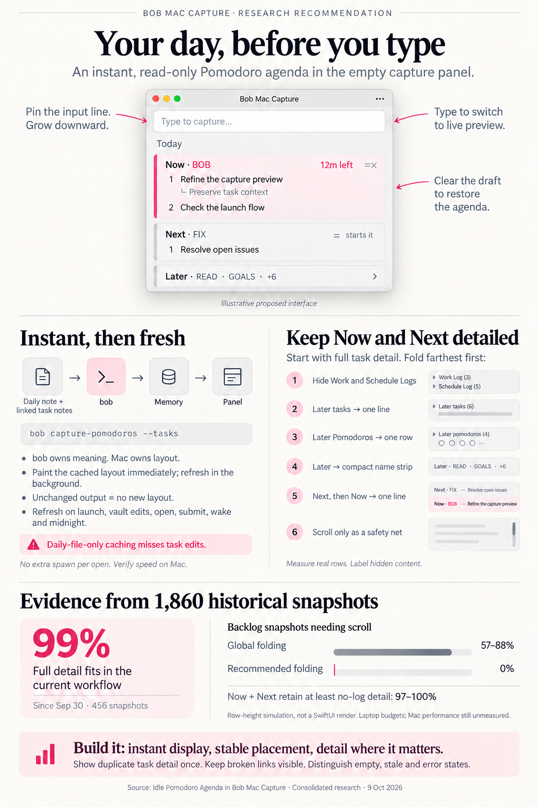

# Idle Pomodoro Agenda in Bob Mac Capture — Consolidated Research

> **Research query:** What is the best way to show the current Pomodoro, if any, and all future Pomodoros in Bob Mac Capture’s preview by default when the panel opens with no input, with caching when today’s daily file is unchanged and blazing-fast performance? Show as much of every linked task as possible without scrolling, expanding the window to fit full task definitions and sub-bullets, then folding Work Logs and Schedule Logs first and using single-line task views if necessary. Design an intuitive, reliable, beautiful experience; critique whether this is a good idea, clearly call out justified requirement adjustments or different approaches, and recommend a solution.



## Bottom line

- **[Build it.](#critique---is-this-a-good-idea)** People open the capture panel all day, and when the draft is empty it
  shows nothing useful. Under `decisions:today-is-read-from-the-ledger`, "Today" already
  means the Task Links under today's open Pomodoros. Showing that ledger in the empty
  panel adds no new concept. It answers "what am I doing, and what's next?" in the window
  Bryan already opens. All five researchers agree.
- **Keying the cache on the daily file alone would show stale content.** Task bodies,
  statuses, and Work Logs live in other notes (`sase.md`, `bob.md`, …), so editing them
  leaves the daily file byte-identical. The [design below](#freshness-and-caching) meets the speed requirement in
  a different way:
  - The show path does no new work. The agenda is already decoded, planned, and laid
    out inside the pre-warmed panel.
  - Refreshes run in the background. One ~10 ms `bob` spawn replaces the
    `capture-pomodoros` spawn the app already makes on every show, so the number of
    spawns per show is unchanged.
- **The requested global fold ladder would scroll most of the time on a heavy ledger.**
  New evidence comes from replaying every daily-note commit between Aug 27 and Oct 9.
  - **Current workflow (since Sep 30):** at most 5 open entries and 17 links, so full
    detail fits about 99% of the time. The folding never triggers.
  - **September backlog workflow:** a median of 10 and up to 24 open placeholders, with
    up to 78 links. The requested global ladder scrolls on **57–88%** of laptop
    snapshots.
  - **[Recommended "focus gradient"](#fit-planner---the-heart-of-the-feature):** fold the farthest Pomodoros first, then collapse
    them to one row each, then to a single name strip. This scrolls on **0%** of those
    snapshots, and Now and Next keep at least the no-logs view on **97–100%**.
- **[Pin the input line.](#window-placement---a-fixed-eye-line)** Today the panel is re-centred on every show
  (`panel.center()`), so a tall agenda would push the editor up the screen by a
  different amount each day. Put the top edge where the compact bar appears today and
  grow downward, the way Spotlight does.
- **[Thin-client split.](#bob-contract)** Following `decisions:mac-capture-is-a-thin-client`:
  - **bob owns meaning:** roles, Task Links, operator numbers, task blocks, and Work Log
    and Schedule Log tags. All of it comes from one additive flag,
    `bob capture-pomodoros --tasks` (`-t`).
  - **The app owns pixels:** measuring, fitting, and drawing.


## Critique - Is this a good idea

**Yes.** The arguments that hold up across the reports:

1. **It adds a view, not a concept.** The ledger is already the source of truth for
   Today. Showing it every time the panel opens also reinforces the habit of linking
   work into Pomodoros.
2. **It makes the session operators easier to use.** `=x1*2`, `=~2`, and `=#bob` refer to
   numbers and names that today stay invisible until you type. If the agenda shows the
   same numbers bob will use, the next keystrokes need no look-up. This came from cld
   and grk, and it was not in the original request.
3. **Its marginal cost is near zero** if it reuses the existing show-path spawn and the
   pre-warmed panel.
4. **It fits the architecture:** one additive bob flag, one decoder, one view. It needs
   no new grammar, no Swift vault parsing, and no daemon.

**Risks, and how the design handles them:**

| Risk | Handling |
|---|---|
| The capture bar becomes a dashboard and slows down capture | The editor stays first, focused, and in the same place. Typography is calm, and only the running card has colour. The first keystroke replaces the agenda. A Settings toggle turns it off. |
| The editor jumps around | Fixed eye line ([Window placement](#window-placement---a-fixed-eye-line)). |
| Stale task bodies | Refresh on vault events, on show, after submit, on wake, and at midnight. Never show a snapshot for another day. |
| Content changes on screen right after the panel appears | Measure and plan *while the panel is hidden*, so a show is one frame from memory. |
| A wall of Work Log history | Logs are the first thing folded. Each fold chip says what is hidden. |
| One huge task forces every other task down to one line | Folding works per Pomodoro, by distance in time, instead of one global switch. |
| A second definition of "current" | Use bob's `scan()` rule: exactly one open timed entry. Do not use the clock, as mus proposed. |
| The panel looks like it is about to write | Read-only styling, no diff gutter or washes, and proportional text instead of monospaced diff cards. |


## Adjustments to the requirements - Explicitly called out

| # | Original requirement | Adjustment | Why |
|---|---|---|---|
| **A1** | Cache when the daily file is unchanged | Cache bob's **output** in the app, and treat any relevant vault change as invalidating it. Paint from memory, revalidate in the background, and skip identical bytes. Add no bob-side or disk cache. | Task contents live outside the daily file (about 88% of links point to other notes, per cld). The refresh costs about 10 ms and stays off the hotkey path. |
| **A2** | Three global views: full → no logs → one line | Keep the views and their order, but apply them **per Pomodoro, farthest first**. Add two compact tiers: **one row per Pomodoro**, then a **"Later" name strip**. Scrolling becomes a safety net only. | The global ladder scrolls on 57–88% of backlog snapshots on a laptop. The gradient scrolls on 0% and keeps Now and Next detailed on 97–100% ([New evidence](#new-evidence---how-much-content-does-the-agenda-really-have-to-fit)). |
| **A3** | "Never scroll" | Guaranteed for realistic ledgers by A2. Scrolling is allowed only as a last-resort cue, or after Bryan deliberately expands a fold. | No finite screen can promise "never scroll" for unbounded content. |
| **A4** | Grow the window as needed | Grow **downward from a fixed eye line**, where the compact bar appears today. Stop re-centring a tall panel. | Keeps the input line in the same place. Thanks to A2 it costs no scrolling. |
| **A5** | "Full task definition" | Show the task's **clean title** (bob's `text`, without `#task`, inline fields, or `^id`) plus every child line with light inline Markdown styling. Clamp any single child line at 4 wrapped lines. | Raw `[created:: …] ^id` syntax is noise. One giant bullet should not push every other task down a tier. |
| **A6** | (not specified) | Show the `=x` numbers on Now and the `=` lineup numbers on Next. Label the entries **Now** and **Next**. | Makes the agenda usable for typing operators, at no extra cost. |
| **A7** | (not specified) | A task linked in two open Pomodoros appears in full **once**, at its nearest occurrence. Later occurrences get one line with "↑ in Now". | Avoids paying twice for the same block. Duplicates are common; in September, `clean-core` repeated across entries. |
| **A8** | (not specified) | Never drop a link silently:<br>• Struck links in Now become one dim "✓ 2 done this session" line.<br>• A done or cancelled task still linked to a future Pomodoro becomes one struck line.<br>• Unresolved, ambiguous, or non-task links become a warning row showing the raw link. | Reliability. A silent omission hides a broken ledger. |
| **A9** | (not specified) | Explicit empty, stale, and error states ([Visual design](#visual-design)), plus a Settings toggle that is on by default. | Distinguishes "nothing planned" from "failed to load". |
| **A10** | (implicit) | Pin the input line when typing starts. The agenda gives way to the live preview with **one** height change ([Transitions](#transitions)). Clearing the draft brings the agenda back instantly from memory. | Avoids a tall → compact → preview double jump. |
| **A11** | (not specified) | Rewrite the README's "no empty preview placeholder, no dead space" principle, and record the accepted policy as a `decisions` record. | This feature deliberately changes a documented principle. |


## Verified facts that shape the design

*Lead researcher, 2026-10-09. Merges five independent reports (`__cdx`, `__cld`, `__grk`,
`__mus`, `__gem`) with my own code verification, benchmarks, and a replay of 1,860
real ledger snapshots from the vault's git history.*

| Fact | Source | Consequence |
|---|---|---|
| `show()` runs `prepareForPresentation()`, then `refreshCurrentPomodoroTaskLinkCount()` (a `bob capture-pomodoros` spawn), then replays cached metrics and runs `makeKeyAndOrderFront`. Subprocess work is kept off the hotkey path. | `CapturePanelController.swift:259-275`; README "pre-warmed non-activating `NSPanel`" | The agenda fetch can **replace** an existing spawn, so the spawn count stays the same. Nothing new may run before `orderFront`. |
| On every show, `pendingRecenter = true`, and `applyContentMetrics` calls `panel.center()` with the new target height. | `CapturePanelController.swift:314, 373-376` (I verified this; cdx and grk assumed the top stays fixed) | A tall agenda would move the editor. A fixed eye line needs a small change in the controller. |
| Later height changes keep `maxY` fixed (`CapturePanelWindowSizer`). The screen limit is the visible frame minus 2 × 24 pt. The auxiliary region is a `ScrollView`. Panel content is 760 pt wide initially and 620 pt at minimum. | `CapturePanelWindowSizer.swift`, `CapturePanelView.swift:10-50` | The existing growth and clamping can be reused. The fit planner only has to choose content. |
| An empty draft sets `previewState = .idle`, and the auxiliary region then disappears. The README describes the fresh popup as "a compact, Spotlight-like bar … no empty preview placeholder, no dead space". | `CapturePanelModel.swift`; `README.md:290-291` | The agenda is a new state, not a dry-run of an empty draft. The README principle must be rewritten. |
| `CapturePreviewPaneHeightPolicy` holds the last settled height while a live preview is `.loading`. | `CapturePanelView.swift` | The first keystroke must not hold the *agenda's* height for a spinner ([Transitions](#transitions)). |
| `VaultTargetWatcher` watches the vault root with FSEvents (0.3 s latency plus a 0.3 s debounce) and ignores event paths. The vault root contains `.git/`, `.obsidian/`, and `.sase/`. | `VaultTargetWatcher.swift`; `ls -a ~/bob` | Git sync and Obsidian's own state writes also fire events. The watcher should pass paths through so the agenda can skip non-note churn. |
| `capture-pomodoros` is spawned **only** on show and on watcher events while the panel is visible. It is not spawned while typing. | `CapturePanelController.swift:262`, `AppDelegate.swift:570` | gem argued for a separate command to keep the typing path cheap. That premise is false, and an opt-in flag leaves the default output unchanged anyway. |
| bob already has every semantic piece: `capture_pomodoros::scan` / `next_future_pomodoro` (roles), `number_task_links` (`=x` numbers), `list_queued_links` (`=` / `=~K` lineup), `VaultLinkResolver` with `note_tasks::scan(...).by_block_id` (resolution), `task_block_extent` / `block_depths` (block shape), `parse_managed_task_log_marker` (Work and Schedule Log markers, including legacy spellings), and `clean_description` (clean title). | `src/native/…` (cited by every report; spot-checked) | No new semantics are needed, only one read-only composition. |
| `today_tasks()` re-reads and re-scans each target note for every link, drops closed tasks, deduplicates, and returns headlines only. `bob plan -f json` takes about 320 ms on the live vault. | cld (`plan_budget/today.rs`); cld hyperfine | Use them as a reference for how links resolve, but do not build the agenda on them. |

**Benchmarks.** These were measured on athena against the live vault with `hyperfine -N`.
My numbers reproduce cld's:

| Command | Mean (mine) | cld |
|---|---:|---:|
| `bob capture-pomodoros -f json` | 3.1 ms | 2.8 ms |
| `bob capture --dry-run --no-clip -f json -- =` (resolves the next lineup's 5 links, including the 110 KB `sase.md`) | 10.5 ms | 10.8 ms |
| `bob capture-targets --format json` | 8.7 ms | 8.6 ms |

The `=` dry-run is the closest existing proxy for the new endpoint. All of these numbers
come from Linux. The Mac's spawn cost has never been measured and must be checked with
the app's signposts before tuning anything.


## New evidence - How much content does the agenda really have to fit

cld surveyed the *final* state of 45 daily notes, treating all of a day's Pomodoros as
"ahead". A day's final state shows neither which entries were open at a given moment
nor how large their task blocks were then. So I replayed history instead.

- **Method.**
  - For each of 44 days, I took every vault commit that touched that day's note on that
    day: 1,860 snapshots, roughly one per sync while Bryan was active.
  - In each snapshot I parsed the ledger the way `scan()` does:
    - Now is the single open timed entry.
    - Every open untimed placeholder is upcoming.
    - Dedicated, unstruck direct-child links are Task Links.
  - I resolved each link's task block **at that same commit**, then tagged Work Log and
    Schedule Log subtrees.
  - I fitted the result to screen budgets with a row-height model:
    - 19 pt per row and 15 pt per extra wrapped line.
    - About 105 characters per line at the 760 pt width.
    - 180 pt of chrome.
    - The eye line 22% from the top of the visible frame.
  - The script was ad hoc and read-only. Nothing in the vault was written.
- **Caveats.**
  - The heights are a model, not a SwiftUI render.
  - Commit frequency stands in for "moments Bryan opens the panel".
  - Basename lookups used HEAD's file list. Only 12 of 47,672 link resolutions failed.

**Two very different periods appear in the data:**

| Per snapshot | Since Sep 30 (current, 456 snapshots) | Aug 27 – Sep 29 (backlog, 1,404 snapshots) |
|---|---|---|
| Open entries shown | median 3 · p90 4 · max 5 | median 10 · p90 21 · max 24 |
| Linked tasks shown | median 7 · p90 12 · max 17 | median 24 · p90 61 · max 78 |
| Full task-block lines | median 11 · p90 17 · max 27 | median 62 · p90 160 · max 189 |
| Lines without logs | median 8 · p90 14 · max 18 | median 44 · p90 109 · max 127 |
| Everything fits at full detail (14", eye line) | **99%** | 1% |

In September the ledger built up a backlog of 20+ queued placeholders, such as
`CLEAN CORE`, `PACKET`, `READ`, `MUSE`, `SUDO`, and `QUEUE`. On Sep 30 the backlog
dropped to 3–5 entries. That is the day Bryan changed his morning GTD and Pomodoro
practice (`research:202610/gtd_morning_review_pomodoro_cutover/gtd_morning_review_pomodoro_cutover__final.md`).
A Pomodoro was running in 65% of snapshots.

**Fit results for the backlog period.** Percentages are of snapshots.

| Screen and placement (budget) | Scrolls: global ladder (as requested) | Scrolls: cld focus gradient | Scrolls: **recommended gradient + name strip** | Now and Next keep ≥ no-logs: global / cld / **recommended** |
|---|---:|---:|---:|---|
| 13", Dock shown, eye line (467 pt) | 88% | 35% | **0%** | 1% / 54% / **97%** |
| 14", Dock hidden, eye line (533 pt) | 78% | 25% | **0%** | 2% / 68% / **98%** |
| 14", Dock hidden, re-centred (717 pt) | 57% | 2% | **0%** | 20% / 94% / **100%** |
| 16", Dock hidden, eye line (638 pt) | 65% | 10% | **0%** | 10% / 81% / **100%** |
| 27", eye line (900 pt) | 43% | 0% | **0%** | 32% / 100% / **100%** |

In the current period nothing scrolls under any policy.

**What this means:**

1. On today's workflow, the requested behaviour (full detail, no scroll) holds almost
   every time, and folding is rare insurance.
2. The workflow changed sharply within the last six weeks and could change again. When
   the ledger acts as a backlog, a global ladder fails badly. It either scrolls or
   reduces even the running session to headlines.
3. The fix costs very little: a pure planner with two more compact tiers. With it, the
   fixed eye line costs nothing in scrolling and almost nothing in Now/Next detail.
   That settles the eye-line trade-off cld left open.


## Recommended design

### What is shown

The agenda is visible when all of these hold:

- the setting is on;
- the draft contains only whitespace;
- no picker, stash, prompt, or error owns the auxiliary region;
- `snapshot.date` is today.

A retained draft reopens without the agenda, exactly as Bryan left it.

**Roles come from bob and are never inferred in Swift:**

- **Now:** the single open timed entry (`is_current`). It stays Now even after its
  planned end has passed, and then shows as overdue.
- **Next:** `next_future_pomodoro`, the first open untimed placeholder. Typing `=`
  starts it.
- **Later:** every other open placeholder, in ledger order. Empty and unnamed entries
  stay visible ("Untitled Pomodoro", "No linked tasks").
- **Several open timed entries:** show an orange "Multiple open timed sessions" warning
  and list those entries as **Open**, with no Now. Do not guess.

**Task Links** follow bob's existing rule: a direct child line whose only content is a
plain or embedded block link. 🍅 markers are ignored. Struck links, mixed prose, deeper
descendants, and fenced lines are excluded. `[[#^gtd]]` resolves against the daily note
itself.

Other content in the Pomodoro is kept:

- **Ledger notes** (deeper children under a link, such as "epic on athena") show as
  italic secondary lines.
- **Non-link direct children** are session notes and show under the header.

Dependency links inside a task are content. They are never expanded into other tasks.

### bob contract

`bob capture-pomodoros --tasks` (`-t`)

The flag is additive and keeps schema 1. The default output stays the cheap list. This
follows the CLI rules:

- `capture-*` commands grow only additively;
- every long option gets a short alias, and `-t` is free;
- options stay alphabetical: `-a -b -f -h -t`;
- help text must be excellent, and human output should be coloured.

Do not add a subcommand under `bob capture`.

Additions to the payload (★ marks new fields; values are illustrative):

```json
{
  "ok": true, "schema_version": 1,
  "day_file": "…/2026/20261009.md", "relative_day_file": "2026/20261009.md",
  "date": "2026-10-09",                                   // ★ the app never shows another day's snapshot
  "completed_summary": {"count": 5, "minutes": 160},      // ★ optional title-row summary
  "pomodoros": [{
    "ref": "46:ae8bb2f6", "line": 46, "name": "FIX", "time_range": null,
    "placeholder": true, "is_current": false,
    "role": "next",                                       // ★ current | next | later | open
    "ends_at": null,                                      // ★ naive local time, timed entries only
    "notes": [{"text": "…", "depth": 1}],                 // ★ non-link children
    "items": [{                                           // ★ in ledger order
      "kind": "task_link",                                // task_link | retired_link
      "index": 2,                                         // =x number on Now, = lineup number on Next, otherwise null
      "ledger_line": 48, "block_link": "[[sase#^just-install-venv]]", "embedded": false,
      "resolution": "resolved",                           // resolved | missing | ambiguous | not_a_task | unreadable
      "relative_target": "sase.md", "line": 812, "block_id": "just-install-venv",
      "text": "Use `just install-venv` instead of `install` …",
      "status_symbol": "/", "status_type": "in_progress",
      "lines": [                                          // task block minus the task line
        {"text": "\t- 🛠️ **WORK LOG**", "depth": 1, "log": "work"},
        {"text": "\t\t- *2026-10-08* — Running research on athena.", "depth": 2, "log": "work"}
      ],
      "ledger_notes": [{"text": "\t\t- epic on athena", "depth": 1}],
      "warning": null
    }]
  }],
  "warnings": []
}
```

Rules for the bob side:

- **Reuse, don't re-derive:** `scan`, `next_future_pomodoro`, `number_task_links`,
  `list_queued_links`, `VaultLinkResolver`, `note_tasks`, `task_block_extent`,
  `parse_managed_task_log_marker`, and `clean_description`. A log subtree means the
  marker line plus all of its descendants, including logs inside nested tasks. Prose
  that merely mentions "work log" is not tagged.
- **Speed:**
  - read the daily note once;
  - read and scan each *distinct* target note once (memoize by path, unlike `today_tasks`);
  - resolve exact paths before falling back to basenames;
  - never touch `TaskIndex`, Dataview, or `bob plan`.
- **Budgets to gate in tests:**
  - p95 ≤ 15 ms on athena for a 10-entry, 25-link fixture;
  - p95 ≤ 30 ms for a September-shaped fixture with 24 entries and 78 links.
- **Determinism:** no fields that depend on the current time. The same vault bytes must
  produce the same output bytes, which is what lets the app skip identical results.
  Countdowns are computed in Swift.
- **Fail soft:** a missing note or missing section returns `ok` with an empty list and a
  warning, as today. A problem with one link becomes that link's `resolution` and
  `warning`, never a command failure.
- **Deferred:** `sources[]`, the files read, is proposed by grk and gem. Add it only if
  Mac signposts show that unfiltered refreshes cost something ([Freshness and caching](#freshness-and-caching)).

Rejected payload shapes:

- three pre-rendered tier arrays (gem), because they triple the payload;
- bob choosing the fold from a height hint, because bob cannot see fonts, wrapping, or
  the screen.

### Freshness and caching

| Layer | What it holds | Invalidated by |
|---|---|---|
| L0 view | The laid-out agenda inside the pre-warmed panel, plus measured row heights keyed by text, depth, width, and text size | A new snapshot, a width change, a text-size change |
| L1 `CaptureAgendaStore` | The last good decoded snapshot plus a digest of bob's stdout. Identical bytes mean no decode, no publish, and no re-layout. | The refresh triggers below |
| bob | Nothing persistent; a per-run memo of note reads | — |

**Refresh triggers.** All refreshes use one `agenda` process lane. A generation counter
discards stale results, and refreshes never cancel the parse, preview, or submit lanes.

1. **App launch**, after `prewarm()`, so the first hotkey after login already has data.
2. **Vault FSEvents, whether or not the panel is visible.**
   - The watcher should pass event paths and flags through.
   - The agenda ignores high-churn non-note paths such as `.git/`, `.sase/`, and
     Obsidian's workspace state.
   - A `MustScanSubDirs` or root-changed flag always triggers a refresh.
3. **Panel show with an empty draft (stale-while-revalidate).**
   - The cached agenda paints first, then one background `--tasks` call checks it.
   - This call **replaces** `refreshCurrentPomodoroTaskLinkCount()`; the close-comma
     count comes from the snapshot.
   - It is also the safety net for missed events, settings changes, and newly created
     notes that change how a link resolves.
4. **After a successful submit.** Capture just wrote to the vault, and FSEvents adds
   0.3–0.6 s of latency.
5. **Wake, unlock, and a local-midnight timer.** If `snapshot.date` is not today, show a
   one-line "Loading today…" and never yesterday's plan.

**Settle while hidden.** When a new snapshot arrives while the panel is hidden:

- measure the rows, run the planner, and call `layoutSubtreeIfNeeded()`;
- the next hotkey press then replays the settled metrics in one frame, as today.

If the hosting screen differs at show time, only the *budget* changes. Re-planning is
then arithmetic on the cached heights, and no re-measuring is needed.

**Why not the alternatives:**

- **Daily-file key (the request):** stale.
- **stat fingerprints of `sources[]` checked on show (grk):**
  - it needs a manifest;
  - it misses resolution changes (a new or renamed note affecting a basename link) and
    settings changes;
  - it saves only one 10 ms background spawn.
- **Content hashing on present (cdx):** correct but heavier than re-asking bob.
- **A 60-second `as_of` expiry (mus):** the content does not depend on time.
- **A disk snapshot (grk):** the app stays resident and prefetches at launch.
- **A daemon or FFI:** premature per the thin-client decision.

### Fit planner - The heart of the feature

**Measure rows once and sum them.** A task's height at each tier is a sum of
independent row heights:

- **Full:** the headline plus every line.
- **No logs:** the headline plus the non-log lines, with a trailing chip.
- **One line:** a fixed single-line height.

So each rendered row (headline, child line, ledger note) is measured **once** at the
current width, using a hidden SwiftUI pass while the panel is hidden. That replaces both
cld's plan to measure three full variants and grk's and gem's pure line-count estimates,
which cannot predict wrapping. Measurements are cached by row content, so an
incremental snapshot re-measures only the rows that changed.

**Budget.** Measure from the eye line down to the bottom of the visible frame, then
subtract:

- the screen margin;
- the measured chrome (one-line editor, footer, title row, spacing);
- one row of slack.

The budget never depends on the panel's current height, which avoids resize loops.

**Ladder.** Planning stops at the first step that fits. Groups are Now (or Next when
nothing is running), Next, then Later in ledger order.

1. Full detail everywhere.
2. **Hide Work and Schedule Logs**, farthest group first: the Later groups, then Next,
   then Now. *(The request's first fold.)*
3. **Later tasks → one line**, farthest first. *(The request's second fold.)*
4. **Later Pomodoros → one row each**, farthest first, for example
   `◌ SASE  Dynamic AGENTS.md · Plan epic roadmap…  2`.
5. **The remaining Later rows merge into one wrapped name strip**:
   `Later · READ · GOALS · BLOG · CLEANUP · +6`, at most 3 lines.
6. **Next tasks → one line**, then **Now tasks → one line**.
7. Scroll, as a safety net, with a bottom fade and an "N more" cue.

Detail fades with distance in time, and there is at most one visible boundary per tier,
so the result looks deliberate rather than ragged. The planner is pure, deterministic
arithmetic over O(rows) values. It lives in `CaptureCore` with table-driven tests: each
step, duplicates, empty days, overflow, and determinism.

**Manual disclosure.** Each folded unit carries a chip that says exactly what is hidden:
`🛠 3`, `+5 lines`, or `4 tasks`. Clicking a chip expands that unit in place. If the
expansion overflows, the region scrolls, because Bryan asked for it. Manual expansions
reset on hide and when the snapshot changes. Keyboard focus never leaves the editor in
v1.

### Window placement - A fixed eye line

On show, place the panel's top edge where `center()` would put the **compact**
(agenda-free) panel. Then let the agenda grow downward, clamped at the bottom margin.
`CapturePanelWindowSizer` already keeps `maxY` fixed, so only the show-time placement
changes.

The result:

- the compact bar looks exactly as it does today;
- the input line sits in the same place whether the agenda is empty, tall, or absent;
- with the gradient planner, this costs no scrolling on any screen tested.

### Transitions

- **Show:** no animation. Cached content appears in the first frame.
- **First keystroke ("dim-hold"; my addition):**
  - The agenda fades to about 35% and stays until the first live-preview result arrives,
    with a cap of about 250 ms.
  - Then it swaps to the live preview with one height change, the top staying pinned.
  - The live preview's loading hold must not inherit the agenda's height.
  - If the dim feels slow on the Mac, fall back to an immediate swap. That costs one
    extra small resize.
- **Clearing back to empty:** the agenda reappears immediately from memory, with a
  background revalidation.
- **In-place updates while visible:** a 120 ms cross-fade, disabled under Reduce Motion.
  The window height is never animated.

### Visual design

```
╭──────────────────────────────────────────────────────────────────────────╮
│  Type to capture…                                                        │ editor: focused, fixed eye line
│                                                                          │
│  Today · Fri 9 Oct                                    5 done · 2h 40m    │ quiet title row
│                                                                          │
│ ▍▶ BOB                              14:10–14:35 · 12m left         =x    │ Now: pink rail + faint wash
│ ▍  1  ◐ Use `just install-venv` instead of `install` so …                │ number capsule · status glyph
│ ▍         epic on athena                                                 │ ledger note (italic, secondary)
│ ▍         🛠 Work log                                                    │ logs: footnote, tertiary
│ ▍           Oct 8 — Running research on athena.                          │
│ ▍  2  ◉ Add `bob mac` command to manage bob-mac-capture                  │
│ ▍     ✓ 2 done this session                                              │ retired links: one dim line
│                                                                          │
│   ◌ FIX  Next                                           =  starts it     │ Next: dashed glyph, Next capsule
│      1  ○ Launch the agents archive view                                 │
│      2  ◐ Use `just install-venv` instead of …              ↑ in Now     │ duplicate → one line
│      3  ○ Fix muse reply streaming                              🛠 2     │ folded logs → chip
│      4  ○ Re-launch all failed agents on apollo                          │
│           Depends on: Fix apollo                                         │ non-log children stay
│                                                                          │
│   ◌ SASE   Dynamic AGENTS.md · Plan epic roadmap for goals          2    │ Later: one row per Pomodoro
│   Later · READ · GOALS · BLOG · +6                                       │ name strip (heavy days only)
├──────────────────────────────────────────────────────────────────────────┤
│ Ready                                    Stash 0   Discard   Capture     │ footer unchanged
╰──────────────────────────────────────────────────────────────────────────╯
```

**Typography**

- Pomodoro names: `.subheadline.weight(.semibold)` with slight tracking.
- Times: `.monospacedDigit()`.
- Task rows: `.callout`, proportional.
- Children: `.callout`, secondary.
- Logs: `.footnote`, tertiary.
- Inline code: monospaced, using the `CapturePomodoroLineTokens` code role.
- Block IDs are hidden and inline fields are dimmed.

Proportional text fits about 15–20% more per line than the monospaced diff cards, and it
signals that this is not a mutation preview.

**Colour.** The running card gets the only accent: the existing `pomodoroStart` pink on
its rail, wash, and play glyph. Status glyphs and their colours come from
`CaptureEditorPalette.taskStatus`. Everything else uses system secondary and tertiary
colours on `.thinMaterial`, like the existing preview pane. There is no diff gutter and
no change washes.

**Glyphs (reused, not invented)**

- `play.circle.fill`: running.
- `circle.dashed`: queued.
- `hammer`: Work Log.
- `calendar`: Schedule Log.
- `arrow.turn.left.up`: also shown above.
- `exclamationmark.triangle`: unresolved link.
- `clock.badge.exclamationmark`: stale snapshot or overdue session.

Number badges reuse the quaternary capsules from the start and close previews, so a `1`
in the agenda looks exactly like the `1` that `=x` will show.

**Time.** Now shows its authored range plus "12m left", or "overdue 8m" in amber. This
is computed in Swift from `ends_at`, with `TimelineView(.everyMinute)` running only while
the panel is visible. It is not a second always-on timer. It is worth having because the
panel opens over full-screen apps, where the menu-bar Pomodoro indicator is hidden.

**States**

| State | Rendering |
|---|---|
| Nothing running, placeholders queued | No Now card. The header reads "Nothing running · `=` starts FIX". |
| No open Pomodoros | One quiet line: "No Pomodoros planned · `=#NAME` starts one". |
| No daily note yet | One line: "No daily note for today yet". |
| Refresh failed, snapshot is today's | Keep the last good snapshot with a stale glyph. "Couldn't refresh" appears in the title row. |
| Snapshot is from another day, or none exists | "Loading today…" (one line), then the agenda. |
| bob unresolved, or too old for `--tasks` | Hide the agenda and show a Settings diagnostic. Do not retry an unsupported flag on every show; cache the capability per executable. |

**Accessibility**

- Each Pomodoro is one accessibility container, for example "Running Pomodoro BOB, 14:10
  to 14:35, 12 minutes left, 2 tasks".
- Fold chips are announced, for example "Work log hidden, 3 entries".
- The countdown uses `.accessibilityValue`, so it is not re-announced every minute.
- Increase Contrast raises the washes to the `BlockDiffCard` levels.
- Return in an empty editor never acts on an agenda row.


## Where the researchers disagreed and how I resolved it

| Topic | Positions | Resolution |
|---|---|---|
| **Transport** | Additive flag on `capture-pomodoros` (cdx `--with-tasks`, cld `--tasks`, grk `--expand`) vs a new command (mus `capture-day-preview`, gem `capture-default-preview`) | **`--tasks` / `-t`.** It shares the scan, the app already calls this command on show, and it adds the least CLI surface. gem's "keep the typing path cheap" premise is false: the command is never spawned while typing. |
| **Cache** | Daily file only (request) · dependency manifest with digests (cdx) · any change plus byte compare (cld) · `sources[]` stat plus disk snapshot (grk) · bob `content_hash` plus 60 s expiry (mus) · FSEvents plus mtime (gem) | **cld's model plus path filtering** ([Freshness and caching](#freshness-and-caching)). It is the simplest correct option, and its cost is already paid by today's show-path spawn. |
| **Fold policy** | Global (request; mus for v1) · global, then greedy per-task upgrades (cdx) · focus gradient plus one row per Pomodoro (cld) · progressive plus "N more" row (grk) · asymmetric stages plus a horizon cap (gem) | **Gradient + name strip** ([Fit planner](#fit-planner---the-heart-of-the-feature)), backed by the replay in [New evidence](#new-evidence---how-much-content-does-the-agenda-really-have-to-fit). |
| **Horizon cap** | gem: Now plus the next 2; mus: the next 3–5 | **Rejected.** The request says *all* future Pomodoros. The name strip keeps every name visible without scrolling. |
| **Height measurement** | Measure three variants (cld) · estimate from line counts (grk, gem) · measure the real render (cdx, mus) | **Measure each row once and sum.** Exact enough, and cheap. |
| **Window placement** | Keep the top fixed, assumed to be today's behaviour (cdx, grk) · fixed eye line (cld) | **Fixed eye line.** I verified the re-centring, and the new evidence shows it costs nothing. |
| **First keystroke** | Animated height change (gem) · immediate swap with no hold (cld, grk) | **One-resize dim-hold**, falling back to an immediate swap. The window height is never animated. |
| **Countdown** | Not in v1 (cdx) · a local tick (cld, grk, gem) · refetch every 60 s (mus) | **Local, minute granularity, only while visible.** |
| **Duplicate tasks** | Show the full block in both places (grk) · keep each occurrence and memoize the definition (cdx) · full block once plus a pointer (cld) | **cld.** |
| **Plan-budget capsules** | Include them (grk, gem) | **Defer.** Keep the agenda about sessions. Revisit after use. |


## Alternatives rejected

| Alternative | Why |
|---|---|
| Treating an empty draft as `capture --dry-run` | It describes a planned write, has time-sensitive semantics, and the empty path is deliberately idle. |
| Swift reads the daily file and task notes | Violates the thin-client decision and creates a second definition of current, next, and numbering. |
| Building on `bob plan -f json` | About 320 ms. Headlines only, no Pomodoro structure, duplicates collapsed. |
| One spawn per task | Process and parse overhead grows with task count. Batch the work into one call. |
| `ViewThatFits` with three global variants | It picks one whole variant, so it cannot fold per Pomodoro. It scrolls on most backlog days. |
| A fixed-height scrolling list (Raycast style) | Contradicts "no scrolling" and hides Later behind a gesture. |
| A separate HUD or menu-bar dropdown | Loses the main benefit: the numbers are visible exactly when Bryan types `=x` or `=`. |


## Implementation plan and acceptance criteria

Each phase can ship on its own. The Mac phases are gated by macOS CI, because agent
hosts have no Swift toolchain.

1. **bob-cli: the contract.**
   - Add `capture-pomodoros --tasks` (`-t`), covering everything in [bob contract](#bob-contract), plus coloured
     human output.
   - Document it in the `docs/capture.md` Discovery section.
   - Add CLI tests and a golden JSON fixture for the Mac tests.
   - Add a perf gate using both fixture shapes.
2. **Mac: data plumbing (no UI).**
   - Add `decodeIfPresent` decoders, so an older bob simply yields no agenda.
   - Add `CaptureAgendaStore`: digest compare, an `agenda` lane, the five triggers, and
     settle-while-hidden.
   - Pass event paths through the watcher.
   - Derive the close-comma count from the snapshot and remove the separate spawn.
3. **Mac: planner and view.**
   - Add `CaptureAgendaPresentation` and `CaptureAgendaFitPlanner` in `CaptureCore`.
   - Add `CaptureAgendaView`, with the hidden row-measuring pass.
   - Integrate it into `auxiliaryContent`.
   - Add fixed eye-line placement and the Settings toggle.
4. **Polish.**
   - The dim-hold transition, the empty, stale, and warning states, and accessibility.
   - Signposts: `agenda-refresh`, `agenda-measure`, `agenda-plan`.
   - Design snapshot tests, in the style of `PomodoroBlockDesignTests` and
     `CapturePreviewFullHeightTests`.
   - Rewrite the README principle, and add a `decisions` record once accepted.

**Acceptance criteria**

- **Warm show.** The show path does no new disk reads, process waits, or hashing.
  Hotkey to focused editor stays within the existing target (p50 < 50 ms, p95 < 100 ms,
  per `research:202608/bob_mac_capture_replacement`). Measured on the Mac.
- **Spawns per show.** Unchanged, because the agenda call replaces `capture-pomodoros`.
- **Freshness:**
  - after an Obsidian edit to a linked task, the hidden panel is current within about
    1 s;
  - after a successful submit, the agenda is current before the next show;
  - it never shows another day's plan.
- **Fit:**
  - zero settled overflow for current-period and September-shaped fixtures on 13" and
    14" budgets;
  - Now and Next keep at least the no-logs view on the September fixture at 14".
- **Semantic fixtures:**
  - a running entry plus queued ones;
  - several open timed entries;
  - unnamed and empty placeholders;
  - duplicates across entries;
  - struck links, embeds, mixed prose, and fences;
  - `[[#^self]]` links;
  - missing and ambiguous targets;
  - closed linked tasks;
  - logs inside nested tasks;
  - CRLF line endings and no final newline.
- **State tests:**
  - typing or clearing during a refresh, and retained drafts;
  - successful and failed submits;
  - midnight and sleep/wake;
  - unavailable or old bob, and watcher recovery;
  - late callbacks never steal focus or publish to the wrong pane.


## Open questions for Bryan

1. **Fixed eye line or re-centring?** I recommend the fixed eye line ([Window placement](#window-placement---a-fixed-eye-line)).
2. **Countdown and overdue in the Now header?** I recommend yes, at minute granularity,
   only while the panel is visible.
3. **A "5 done · 2h 40m" summary in the title row?** I recommend yes. It is cheap and
   calm.
4. **Ledger notes such as "epic on athena"?** I recommend showing them as italic
   secondary lines.
5. **Is the September backlog of queued placeholders likely to return?** Either way, I
   would ship tiers 4–5 of the ladder in v1. They are a few lines of pure planner code,
   and without them a backlog day would scroll or collapse Now to headlines.
6. **v1.1 interactions:**
   - click a row to open the task in Obsidian (`ObsidianOpenURL` already exists);
   - hold ⌥ to see every task at full detail in a scroll view;
   - ⌘1…9 to insert the Nth link into the draft.


## Recommended solution

Make the empty capture panel show **today's Pomodoro agenda**, split the way the
thin-client decision requires:

1. **bob (meaning).** Add `bob capture-pomodoros --tasks` (`-t`), additive and keeping
   schema 1. In one memoized pass over the daily note and each distinct linked note, it
   returns:
   - each open entry's role: Now, Next, Later, or Open;
   - the exact `=x` and `=` numbers;
   - each Task Link's resolved task: clean title, status, and child lines tagged with
     Work Log and Schedule Log;
   - ledger notes, retired links, link problems, and the date.

   The output is deterministic and should take about 10–15 ms. It never goes through
   `bob plan` or `TaskIndex`.
2. **Mac (freshness).**
   - `CaptureAgendaStore` keeps the last good snapshot in memory.
   - It refreshes in the background on launch, on vault events (filtered by path,
     whether or not the panel is visible), on show (replacing today's
     `capture-pomodoros` spawn), after submit, on wake, and at midnight.
   - Identical output bytes are a no-op.
   - New snapshots are measured and planned while the panel is hidden, so the hotkey
     still costs one frame and adds no spawn.
3. **Mac (fit).** A pure planner sums once-measured row heights against the space below
   the eye line. It folds farthest-first:
   1. logs;
   2. Later tasks to one line;
   3. Later Pomodoros to one row each;
   4. a name strip;
   5. Next, then Now, to one line.

   It scrolls only as a safety net. On 1,860 real snapshots this never scrolls. It keeps
   full detail about 99% of the time on today's workflow, and keeps Now and Next at the
   no-logs view or better 97–100% of the time on the September backlog.
4. **Window and motion.**
   - The top edge sits at today's compact eye line, and the agenda grows downward.
   - The first keystroke dims the agenda and swaps it for the live preview with one
     height change.
   - Clearing the draft restores the agenda instantly.
5. **Look.**
   - One accent, on the Now card: pink rail, play glyph, "12m left".
   - Next has a dashed glyph and the hint "`=` starts it". Later is calm secondary text.
   - Status glyphs and number capsules are shared with the existing previews.
   - Fold chips say exactly what is hidden, and repeated tasks appear in full once.
   - Broken links stay visible, and empty, stale, and error states are distinct.

Ship it in four phases: the bob contract, then Mac plumbing, then the planner and view,
then polish. Measure on the Mac with signposts before tuning anything. Record the
accepted fold and placement policy as a `decisions` record, and rewrite the README's
"no dead space" principle to match.
