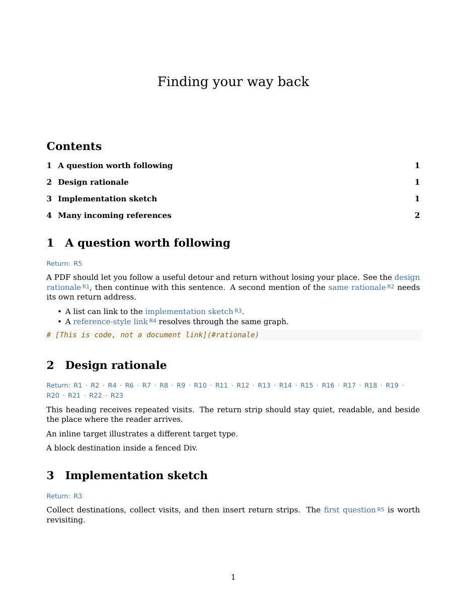

# Markdown PDF return links: a design that preserves the reading flow

Researcher: **cdx**. Independent investigation for the five-researcher swarm.
No peer reports, transcripts, or findings were consulted.

**Recommendation:** add a Pandoc Lua pass that assigns a short label to each
supported same-document link occurrence, preserves the original link text, and
adds a grouped **Return:** strip beside the destination. Keep the existing
Pandoc/XeLaTeX renderer. Start with heading destinations, explicitly diagnose
unsupported anchors, and expand target adapters after their layout is tested.
Use ordinary internal PDF destinations, with reader history as a complementary
way to retrace longer detours.

## 1. Is the proposed idea good?

Yes. It solves a real interruption in reading: follow an interesting reference,
inspect it, then resume the original sentence. Explicit return links travel with
the PDF, work offline, and do not require the reader to discover an application
shortcut. The source Markdown can remain untouched.

There are two different promises to distinguish. A generated return link can
return to the **source passage**. It cannot restore the previous viewport,
scroll offset, zoom, selection, or navigation history. For A → B → C, the reader
must choose C's return to B and then B's return to A. A reader's history feature
is better for that dynamic behavior; Acrobat documents Previous View separately
from Previous Page. [Adobe's navigation documentation](https://helpx.adobe.com/acrobat/desktop/get-started/learn-the-basics/navigation.html).

A destination reached from three different source passages needs three return
addresses. A single unqualified “Back” link cannot choose correctly. The PDF
has a static graph of destinations, not a record of the current visit. Labeling
each **occurrence**, rather than each destination or distinct URL, is therefore
the strongest part of Bryan's proposal.

The main cost is visual and cognitive: badges enter the prose, and popular
destinations accumulate return links. The feature succeeds when those marks
remain legible, subordinate to the content, and consistent. Long opaque IDs,
full boxes around every reference, and a list of unlabeled arrows would weaken it.

## 2. What bob does today

Inspected repository revision: `e5d12ca4407baca64a859f89402d2d245dea5582`.
These are local-code findings, not assumptions about the latest upstream Pandoc.

| Existing boundary | Implication for the design |
| --- | --- |
| `src/native/highlights_ref/create.rs:2023`, `render_temp_pdf` | Markdown goes directly through Pandoc to XeLaTeX. It already requests a three-level TOC, numbered sections, and colored links. |
| `create.rs:39` and `:50` | bob supplies a TeX preamble and a Lua filter for wrapping code and rendering listen cards. The new feature can use this established mechanism. |
| `create.rs:788` | The embedded Lua filter is written into private render scratch. Add a separate bundled navigation filter rather than searching and rewriting the input file. |
| `create.rs:2075` | Successful Pandoc stderr is discarded. A filter that merely prints warnings will have its warnings hidden unless this boundary changes. |
| `src/native/highlights_ref/stamp.rs:350` and `:414` | bob loads the rendered PDF, prepends its `/Text` scan marker to page-one annotations, then saves. Generated navigation must survive this step. |
| `docs/highlights-create.md` | Existing PDFs are stamped as-is; URL articles use the separate clip engine. Scope this feature to Markdown rendering. |

The current fonts are DejaVu Serif/Sans/Mono; body size is 10 pt, line stretch
1.08, margins 0.85 inches. The listen-card accent is `#3B6EA8`. Reusing that
accent for navigation is a reasonable starting point for a coherent appearance.

The existing listen-card `Div` handler serializes part of the AST into raw
LaTeX. Filter order matters: links or anchors inside a node can become invisible
to later AST passes. For the first release, exclude generated listen cards from
return-link discovery and document that exclusion. Do not collect destinations
that another transformation subsequently removes.

Pandoc provides resolved `Link` nodes and parsed identifiers. Its own heading
IDs depend on the Markdown reader and differ from GitHub's in some cases.
Use the parsed IDs as the authority; recreating a slug algorithm in Rust would
create a second source of truth. [Pandoc's heading identifiers and internal links](https://pandoc.org/MANUAL.html#heading-identifiers).

## 3. Alternatives and tradeoffs

| Approach | What it does well | Why I would or would not choose it |
| --- | --- | --- |
| Reader Previous View only | Retraces actual history without changing the page design | Useful complement; discoverability and availability differ by reader. It does not meet the portable in-document affordance Bryan requested. |
| A PDF “GoBack” button | Superficially offers one smart return control | hyperref documents `Acrobatmenu` and `GoBack` under Acrobat-specific behavior. I would not make correctness depend on other readers honoring it. |
| Matched labels and grouped return strips | Every source occurrence has an explicit, portable return address | Recommended. It adds modest visual cost and requires reliable target resolution. |
| Page-number return links | Familiar and useful on paper | Two source links can share a page. Numbers describe pages, not exact occurrences, and require TeX reference resolution. Good optional secondary context, not the identity. |
| Footnotes for every local reference | Familiar paired numbers | Changes document semantics, competes with real footnotes, and consumes footnote space. Internal section references are not notes. |
| Margin chips | Keeps the main text clean | Tables, narrow margins, page breaks, and multiple incoming links make placement fragile. Not the first implementation. |
| Return list at the end of each section | Less noise at a heading | The reader has to hunt for it after landing; long sections make this frustrating. |
| An appendix of all return addresses | Scales to extreme fan-in | Adds another navigation hop. Consider only for exceptional dense documents, not the ordinary experience. |
| Switch to HTML/WeasyPrint or Chromium | CSS gives more styling freedom | A rendering migration is much larger than this feature and affects pagination, fonts, code, math, and annotation coordinates. The current pipeline already supports the required primitives. |

hyperref's `backref` option adds references to bibliography entries; it does not
automatically construct occurrence-level return paths for arbitrary Markdown
links. Ordinary `hypertarget`/`hyperlink` or Pandoc-emitted labels are appropriate
primitives. [hyperref manual](https://tug.ctan.org/macros/latex2e/contrib/hyperref/doc/hyperref-doc.html).

Use PDF internal destinations and GoTo actions. A local-file URI to the source
Markdown would open a file rather than return inside the finished PDF, and would
break when the PDF is moved. The PDF Association distinguishes internal
destinations from external URI actions. [PDF/A and external references](https://pdfa.org/pdf-a-and-external-references/).

## 4. Proposed reading experience

Source text remains meaningful:

> See the **design rationale**ᴿ¹, then continue with this sentence.

Both the words and the small adjacent `R1` badge belong to the same forward link.
At the target, below the heading:

> **Design rationale**  
> Return: **R1** · **R2** · **R4**

Each return label is its own link to the corresponding source occurrence. A
single incoming reference still gets `Return: R1`; keeping the same convention
helps the reader learn it. Do not use one label for all incoming visits.

Use `R1`, `R2`, … in reading order, with decimal numbers after the prefix.
This is alphanumeric, easy to say, and less cryptic than a random hash. The
visible label and the hidden PDF anchor are separate concerns. Hidden IDs
should have a reserved, collision-checked prefix such as `bob-pdf-return-`.
Labels need to be deterministic for the same parsed input; they need not remain
unchanged after an earlier link is inserted. Cross-version stable labels would
require persisted identity or unattractive hashes, with little benefit here.

Suggested visual specification:

- A modestly raised, approximately 7.5–8 pt sans-serif source badge, attached to
  the linked phrase with a small nonbreaking gap. The full phrase is clickable;
  the user does not have to hit the tiny badge.
- An 8–9 pt return strip in the established blue accent. Use the word **Return**
  and ordinary separators. An arrow may supplement the label, but is unnecessary.
- A little separation from the heading, less than an ordinary body paragraph.
  No decorative frame, colored background, or extra heading level.
- Put strips outside heading text so they never enter the TOC or PDF bookmarks.
- Wrap between return entries. Never clip or silently omit the later entries.
  Give each clickable label breathing room; check actual tap targets on iPad.
- Keep a heading, its small return strip, and the start of its content together
  where possible. A return strip stranded on the next page defeats the design.

For high fan-in, begin with wrapping rather than a hidden “more” mechanism. The
prototype fits 21 return entries into two lines. Much larger lists need a
separate stress test. If IDs alone become difficult to scan, add brief source
heading context or group entries by source section; retain each occurrence's
individual return address. Do not merge them merely because they share a page.

Add one short legend near the TOC, only when at least one return pair exists:
“Local links have R labels; choose the matching Return label to resume reading.”
Reader-specific keyboard shortcuts belong in command documentation, not in the
PDF. Apple documents adjacent-page shortcuts, but the page inspected does not
establish a history-return shortcut; I would not publish an assumed universal
Mac binding. [Preview keyboard shortcuts](https://support.apple.com/guide/preview/keyboard-shortcuts-cpprvw0003/mac).

### Rendered experiment



[Open the two-page prototype PDF](markdown_pdf_return_links_design__cdx_assets/demo.pdf).
[Prototype and reproduction instructions](markdown_pdf_return_links_design__cdx_assets/README.md).

This experiment uses the current body typography and blue navigation styling.
It demonstrates heading targets, repeated visits, a list source, a reference-style
source, a link wrapping across a line, forward and backward jumps, and a dense
return strip. It is evidence of feasibility, not a production implementation.
Its return spacing should be tightened before shipping; actual touch interaction
has not been tested.

## 5. Requirement adjustments, called out explicitly

1. **“Local” means same rendered document.** Include `#fragment` and, when
   canonical path identity proves it, a relative link back to the same input
   Markdown file. Do not interpret every relative filesystem link as a location
   inside this PDF. Other files, external URLs, and assets keep their existing
   treatment. This avoids a surprise multi-document export feature.
2. **Preserve the original link words; append a badge.** The badge supplements
   meaning instead of replacing it with an ID. At the destination, group matching
   return labels in one strip instead of scattering separate new links through
   the heading.
3. **Allocate IDs per occurrence.** Two identical links on the same page still
   receive two labels and two exact source anchors.
4. **Return to the passage, not the prior reader state.** Exact viewport restoration
   is an application-history behavior. Do not promise it from static backlinks.
5. **Ship a defined support matrix, not an “any local link” claim.** First-release
   automatic targets should be unique heading IDs. Explicit Pandoc `Div`,
   `CodeBlock`, and prose `Span` targets can follow as tested adapters. Raw HTML,
   Obsidian block IDs, raw TeX, and special writer-generated targets need distinct
   decisions, rather than guessed conversions.
6. **Exclude renderer-generated navigation.** The LaTeX TOC and outline need no R
   labels. They are writer output, outside the source link graph. Initially leave
   links inside headings, repeated table headers, captions, and generated listen
   cards uninstrumented; those contexts can duplicate anchors or badges in moving
   output. Warn when an authored local link is skipped for an unsupported context.
7. **Keep source files unchanged.** All additions are transient render-AST changes.
   Ordinary local-PDF ingest does not re-render or retrofit old captures. A fresh
   render is needed for existing PDFs, and may change pagination and highlights.
8. **Provide an escape hatch.** Default the feature on for supported links, with a
   documented Markdown metadata opt-out such as `bob-pdf-backlinks: false`.
   An explicitly marked container can suppress badges in an authored TOC later.
   Avoid adding a command-line mode matrix until real use establishes a need.

The deliberately smaller initial support matrix is the largest adjustment.
It is justified by the current renderer's behavior and prevents convincing-looking
labels that cannot complete a round trip. If Bryan's typical inputs rely heavily
on raw HTML anchors or Obsidian links, expand that first milestone before enabling
the default. The problem statement did not provide a representative document.

## 6. Resolution contract and failure behavior

| Input or situation | Recommended behavior |
| --- | --- |
| Inline, full-reference, collapsed-reference Markdown link to a unique heading | Process the resolved AST `Link`; assign one occurrence label. |
| Repeated automatic heading titles | Use Pandoc's parsed distinct IDs, including its suffixes. |
| Duplicate explicit destination IDs | Diagnose ambiguity; do not choose the first or decorate links as if the target were unique. |
| Forward reference | Resolve after collecting all targets, before adding source badges. |
| Percent-encoded fragment | Decode valid percent sequences exactly once as UTF-8, then match the parsed ID exactly. Rewrite the link to the canonical fragment before LaTeX output. Do not treat `+` as a space. |
| Unicode or case differences | Preserve identifier spelling and case. Do not lowercase, normalize Unicode, or invent fuzzy matches behind the author's back. |
| Relative `input.md#target` pointing to this very input | Normalize against the input file's directory and canonical identity; if proven equal, convert to `#target`. No external-file expansion. |
| Other Markdown file, PDF, or relative image | Do not add a return pair or reinterpret the file as this document. |
| `#`, missing target, malformed encoding, unsupported raw anchor | No misleading badge; emit a clear navigation warning with the target and available context. |
| Markdown link syntax inside code | Ignore; it is not a `Link` node. |
| Self-section link | Still give the occurrence its own return path. “Same page” is not proof it is useless. |
| Two logical links to one target on a page | Keep distinct source anchors. |
| Footnote reference or citation | Preserve its existing semantic machinery; do not treat a `Note` or citation as an ordinary `Link`. Test any authored local link inside a footnote before supporting that source context. |
| A user ID collides with the generated prefix | Choose another prefix/suffix after scanning all attribute IDs, not just headings. |

Warnings are part of the product contract. A successful render should visibly
report navigation limitations, not quietly produce a label that implies success.
Because bob currently drops successful Pandoc stderr, either surface the filter's
structured warnings through the Rust render result or expose selected navigation
warnings from stderr. Preserve useful Pandoc warnings as well. Avoid vague
“some links failed” messages. For malformed inputs, preserving ordinary forward
links plus a warning is a compatible default; a later strict setting could refuse
installation if full navigation is required.

Supporting new target types should use explicit adapters:

- **Heading:** insert a strip immediately after it; keep its original ID.
- **Div:** place the strip at the start of the anchored container.
- **CodeBlock:** use an anchored wrapper containing the strip and original code;
  transfer the target ID once, rather than placing a strip above an anchor that
  the reader lands below.
- **Span in prose:** preserve the inline landing, but place the strip beside its
  enclosing paragraph. Test very long paragraphs and multiple inline targets;
  blindly inserting a block in an inline AST position is invalid.

Those are design proposals; only heading panels were exercised in the prototype.
Do not advertise image/table/equation or raw-HTML target support until their
writer behavior and placement have their own test cases.

## 7. Implementation structure

Use one dedicated navigation module/filter with a small TeX style layer. Keep
link resolution and collection separate from presentation. Pandoc Lua exposes
`Link`, `Header`, attributes, list walks, and explicit traversal control; the
ordinary default traversal is typewise. [Pandoc Lua filters](https://pandoc.org/lua-filters.html#traversal-order).

A safe transformation looks like this:

```text
parsed body AST
  → index every existing attribute ID; classify supported destinations
  → enumerate eligible authored Link occurrences in reading order
  → resolve canonical targets and collect diagnostics
  → reserve collision-free source anchor names
  → attach anchors and badges to the original links
  → insert destination return strips from the frozen occurrence registry
  → finish code/listen transformations in the declared order
  → Pandoc LaTeX writer → XeLaTeX → bob marker stamping
```

Important constraints:

- Walk body blocks, not metadata, for source occurrences. A link in an unprinted
  metadata value must not create a phantom return entry.
- A reading-order traversal needs context: heading versus paragraph, table header
  versus body, and excluded containers. Pass that context explicitly or use a
  controlled recursive walker. Do not assume separate `Header` and `Link`
  callbacks naturally establish the active source section.
- Freeze the graph before inserting return links. Generated return links must not
  themselves acquire labels or generate further return links.
- Guard replacement subtrees in top-down walks. In an early experiment, returning
  a `Span` that contained the same unmarked `Link` caused recursive reprocessing.
  Marking the original link as already visited fixed it. Production can instead
  annotate without re-wrapping recursively or stop traversal of the replacement.
- Let Pandoc emit anchors and links from AST attributes. It correctly escapes
  labels for the writer. Never interpolate an arbitrary source fragment directly
  into `\hypertarget{...}` or another TeX command.
- Keep raw TeX limited to vetted styling macros and internally generated label
  tokens. The demonstration uses ordinary AST links and source `Span` IDs.
- Do not compute page numbers by pre-rendering and then inserting strips: the
  insertion changes pagination. If page context is later desired, use TeX labels
  and references in the same final document.
- Put navigation styling in a documented preamble hook. On the installed Pandoc
  template, `header-includes` comes before hyperref is available; an immediate
  `\hypersetup` failed. `\AtBeginDocument{\hypersetup{...}}` worked.

This changes rendering only. No vault-link resolver, clip-engine migration,
PDF JavaScript, or persistent link registry is needed. Text extraction will
include R badges and return strips; that can affect copy/paste and the Markdown
`--listen` route, which narrates the staged PDF. Test whether the listen extractor
reads navigation furniture aloud, and skip it there through a documented contract
if it does. Do not casually turn the feature off whenever audio is requested.

## 8. Experiments and what they establish

The machine provides Pandoc **3.1.11.1**, Lua **5.4**, and XeTeX from
**TeX Live 2025/dev/Debian**. I examined emitted native AST and LaTeX, rendered
and rasterized a real PDF, then inspected PDF objects with pypdf.

Baseline findings:

- A link's explicit attribute ID emits `\phantomsection\label{...}` before the
  forward link. Pandoc prose `Span`, `Div`, and `CodeBlock` IDs also produced
  anchors in the tested cases.
- `<a id="raw-target"></a>` remained raw HTML in the AST and disappeared from
  LaTeX output, while a Markdown link to it still emitted a reference. A general
  source-text anchor scan would incorrectly count this as supported.
- `#caf%C3%A9` stayed encoded in the AST. LaTeX emitted a label reference based
  on the encoded characters, whereas heading `Café` emitted a different label.
  Matching and rewriting the resolved fragment is necessary on this version.
- A same-file `probe.md#details` was emitted as a file `href`, rather than an
  internal heading reference. It needs explicit same-input normalization.
- Repeated automatic `Details` headings became `details` and `details-1`.
  An explicitly repeated `details` stayed duplicated and produced a warning.

The working prototype:

- **23 semantic forward links, 23 distinct source anchors, and 23 reverse links.**
  There are also four generated TOC links and four outline entries.
- A popular destination carries **21 return entries**, which wrap onto two lines.
- The 50 semantic links occupy **51 `/Link` annotations** because one forward
  phrase wraps over a line. Tests must not confuse annotation rectangles with
  logical link count.
- Every physical link action is **`/GoTo`**, and every named destination resolves.
  The TeX auxiliary label map confirms that each of the 23 generated source
  destinations receives exactly one return link.
- Running the installed **`bob ref create` Markdown route** with the experimental
  filter injected through `BOB_PANDOC_COMMAND` preserved all **51** link
  annotations and all four outline entries. bob's scan marker is the first
  annotation on page one.
- The output has **no tagged-PDF structure tree**. Clickable links alone do not
  establish screen-reader accessibility.

[Machine-readable verification](markdown_pdf_return_links_design__cdx_assets/verification.json).
The inspected checkout was not modified. The end-to-end exercise used the
installed bob binary rather than a newly compiled binary from that exact commit;
source inspection independently confirms the matching render and stamp boundaries.

Limits: no actual Highlights, Preview, Acrobat, or iPad interaction was available
on this Linux host. Destination existence and raster inspection establish
structural feasibility, not application-specific scrolling, zoom, touch behavior,
or preservation after a Highlights annotation/save cycle. Highlights' own
changelog documents internal-link navigation and a historical fix, which makes
it a relevant acceptance target, not a guarantee for every current release.
[Highlights changelog](https://highlightsapp.net/changelog/).

## 9. What should gate implementation acceptance

Use a few strong invariants rather than snapshots of every generated ID:

1. Every decorated source occurrence has one unique source anchor and appears
   exactly once in its destination's return registry.
2. Every generated reverse link resolves to that source, and every decorated
   forward link resolves to its intended target.
3. Generated furniture creates no new source occurrences on a second pass.
4. Original source bytes and heading titles remain unchanged; TOC and outline
   labels contain no return badges or strips.
5. Missing, ambiguous, and unsupported destinations produce observable warnings
   without false success markers.
6. Stamping preserves all GoTo destinations, links, and bookmarks while keeping
   the scan marker first.

The fixture matrix should include escaped/reference-style links, Unicode and
encoded fragments, duplicate explicit IDs, repeated automatic headings, generated
ID collisions, same-file versus other-file links, list/table/footnote context,
links that wrap, and destinations close to a page break. Stress 0, 1, 6, 21, and
100 incoming links. With 0 links, no legend or navigation furniture should appear.

Visually inspect the normal and dense examples at reading size, in grayscale,
and on an iPad. Click two different occurrences to the same target and return
from each. Verify A → B → C, a source and target on the same page, and a
heading near a page boundary. Open and annotate/save the PDF in Highlights,
then confirm its navigation still works. Also exercise `--listen` extraction.

Keep meaningful link text and visible return context; do not rely on tooltips
for explanation. W3C's PDF link technique calls for properly associated link
text and structure, keyboard operation, and descriptive purpose. The current
untagged XeLaTeX output does not prove those properties. Full PDF accessibility
would be a separate rendering/tagging decision, not a claim attached to these
badges. [W3C PDF11](https://www.w3.org/WAI/WCAG22/Techniques/pdf/PDF11).

## 10. Recommended solution

**Implement matched occurrence labels plus grouped Return strips in the existing
Pandoc/XeLaTeX pipeline.** Use small `R1`, `R2` badges on meaningful source link
text, separate source anchors, and wrap-safe return links immediately below
unique target headings. Resolve the graph from Pandoc's AST before adding any
navigation furniture; normalize same-input paths and percent-encoded fragments;
surface unresolved and unsupported cases through bob's successful-render output.

Ship heading targets first with an honest support matrix, a metadata opt-out,
and verified round trips after marker stamping. Add block and inline-target
adapters when their landing and page-break layouts pass the same checks. Keep
reader Previous View as the preferred complement for multi-step history and
viewport restoration. This retains Bryan's useful core idea while making its
identity, visual grammar, compatibility limits, and failure behavior explicit.
