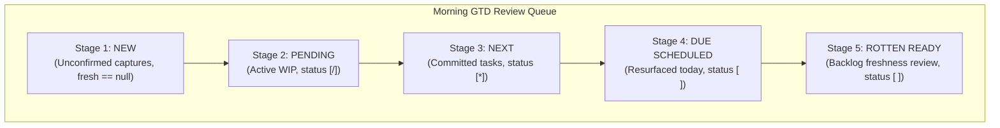

# Morning GTD Review Walk Order and Task Freshness Refinement

**Author:** Researcher gem (`research.3a.gem`)  
**Date:** 2026-10-01  
**Status:** Complete  
**Scope:** `bob-cli`, `bob-plugins` (`bob-ledger-tools`, `bob-navigation-hotkeys`), Vault Task Freshness Contract  

---

## Executive Summary

This research investigates the proposal to refine Bryan's morning GTD review navigation (`[s` / `]s` and `<Ctrl+Alt+J/K>`), adjust how task refresh intervals are determined across workflow lanes, resolve the sorting order of ready backlog tasks, and safely decommission artificial `refresh` properties previously seeded into the Obsidian vault.

### Core Findings

1. **The Underlying Problem:** Seeding artificial `[refresh:: N]` and fake `[fresh:: YYYY-MM-DD]` properties was an ad-hoc, static workaround to mitigate morning review overload. While it temporarily throttled task influx, it contaminated vault notes with synthetic data and created maintenance overhead. Bryan is entirely justified in wanting to decommission these artificial properties.
2. **The Intended Workflow vs. The Proposed Mechanism:**
   Bryan's stated operational goal is clear and desirable:
   $$\text{NEW} \longrightarrow \text{PENDING} \longrightarrow \text{NEXT} \longrightarrow \text{DUE SCHEDULED} \longrightarrow \text{OTHER READY}$$
   However, attempting to achieve this sequence by overloading the **freshness interval** (assigning pending, next, and scheduled tasks an interval of $1\text{d}$) introduces severe architectural side effects:
   - It conflates **Kanban workflow execution lanes** (`PENDING`, `NEXT`) with **backlog freshness maintenance** (`READY`).
   - It pollutes whole-vault metrics: the status bar and the dashboard `ROTTEN` chip would permanently report dozens of "rotten" tasks every morning, even though they represent active work-in-progress.
   - It breaks dashboard gating and causes `rotten.md` to duplicate the `dash.md` `PENDING` and `NEXT` sections.
3. **Scheduled Tasks Already Have Native "Due Today" Semantics:**
   A task with `[scheduled:: YYYY-MM-DD]` that reaches its scheduled date automatically transitions to `RESURFACED`. Under existing freshness semantics, a resurfaced task is *already* due immediately on its scheduled date. Forcing a $1\text{d}$ refresh interval on scheduled tasks would actually cause severe review fatigue: after being reviewed on its due date, the task would become "rotten" *every single day thereafter* until completed.
4. **The Ready Task Sorting Contradiction:**
   There is a direct contradiction between Bryan's stated sorting rule and Bryan's accompanying example:
   - *Stated Rule:* Lexicographical sort by lowest refresh interval first, then earlier fresh date (more overdue), then created later (`interval ASC, fresh ASC, created DESC`).
   - *Accompanying Example:* A $7\text{d}$ interval task that is $3\text{d}$ overdue must be reviewed *before* a $1\text{d}$ interval task, but a $1\text{d}$ interval task must be reviewed *before* a $7\text{d}$ interval task that is only $1\text{d}$ overdue.
   - Under the stated rule, a $1\text{d}$ task *always* precedes a $7\text{d}$ task, regardless of how overdue the $7\text{d}$ task is. The example proves that Bryan intuitively values **overdue severity / urgency** over raw interval length.

### Primary Recommendations

- **Adopt a 5-Stage Morning Review Walk Sequence in Navigation:**
  Structure the review queue in `bob-ledger-tools` and `bob-navigation-hotkeys` into five explicit stages:
  1. `Tier 1: NEW` (Unconfirmed captures; clears to 0).
  2. `Tier 2: PENDING` (Active WIP `[/]`; decision: continue, link today, or release).
  3. `Tier 3: NEXT` (Committed pool `[*]`; decision: link today via Pomodoro or release).
  4. `Tier 4: RESURFACED` (Scheduled tasks due today or earlier; tickler review).
  5. `Tier 5: ROTTEN READY` (Freshness-expired backlog tasks; sorted by urgency).
- **Keep Freshness Metrics and Buckets Pure:**
  Do not classify `PENDING` or `NEXT` tasks as `bucket: rotten` or state `rotten`. Keep them in their native lanes on `dash.md`, keep `rotten.md` strictly focused on the Ready backlog, and keep the dashboard chips mutually disjoint.
- **Reconcile Stage 5 Sorting with an Escalated Overdue Tier:**
  Implement the standard sort `(interval ASC, fresh ASC, created DESC)` for Rotten Ready tasks, but add an **Escalated Sub-tier** for severely overdue tasks ($\ge 3\text{d}$ overdue or $\ge 50\%$ interval expired) so critical lagging tasks bubble to the front of Stage 5.
- **Execute a Safe 3-Step Vault Decommissioning Plan:**
  Run a dedicated dry-run cleanup script to strip artificial `[refresh:: N]` properties from un-customized Ready tasks while preserving genuine human-set intervals.

---

## 1. Architectural Baseline: How Freshness and Review Work Today

To evaluate Bryan's proposal, we first examine the contracts and code currently operating across `bob-cli` and `bob-plugins`.

### 1.1 The Freshness Contract (`docs/freshness.md`)

Task freshness measures the local calendar date a human last confirmed that an open task still needs doing as written (`[fresh:: YYYY-MM-DD]`).

Under `docs/freshness.md` §4, evaluation is computed at read time:
```text
in_scope(t)   = status type TODO ("[ ]") ∧ lane-visible ∧ ¬recurring
                ∧ ¬in a canonical daily note ∧ ¬Today(t)
state(t)      = NEW         if no fresh(t)
              | RESURFACED  if scheduled(t) exists ∧ fresh(t) < scheduled(t) ≤ today
              | ROTTEN      if today ≥ fresh(t) + interval(t)
              | FRESH       otherwise
due_on(t)     = RESURFACED: scheduled(t); ROTTEN/FRESH: fresh(t) + interval(t); NEW: none
due(t)        = in_scope(t) ∧ state(t) ≠ FRESH
tier(t)       = NEW | DUE (RESURFACED and ROTTEN together)
queue order   = NEW by (path, line); then DUE by (due_on, path, line)
```

Key principles of the current architecture:
1. **Scope Restriction:** Only `status.type === "TODO"` (status symbol `[ ]`) is in scope. Tasks in `NEXT` (`[*]`), `PENDING` (`[/]`), and `BLOCKED` (`[?]`) are explicitly **out of scope** (`state === null`).
2. **Dashboard Partitioning (`decisions:ready-is-freshness-gated`):**
   The visible pool partitions into pairwise disjoint sets:
   $$\mathcal{B} = \text{NEW} \cup \text{RETURNED} \cup \text{ROTTEN} \cup \text{READY}$$
   - `dash.md` section order: $\text{TODAY} \to \text{NEW} \to \text{PENDING} \to \text{NEXT} \to \text{READY}$.
   - Dashboard chips: `NEW`, `PENDING`, `NEXT`, `READY`, `BLOCKED`, `ROTTEN`, `TODAY`.
   - `rotten.md`: Displays tasks in `bucket: rotten` (i.e. `RESURFACED` + `ROTTEN`).
3. **Queue Sorting Today:**
   In both Rust (`src/native/freshness/state.rs`) and JavaScript (`plugins/bob-ledger-tools/main.js`):
   - `NEW` entries sort by `(path, line)`.
   - `DUE` entries sort strictly by `(due_on, path, line)`.
   - There is currently **no sorting by `interval`**, **no sorting by `days_overdue`**, and **no consideration of `created` dates**.

### 1.2 The Navigation Hotkeys Contract (`bob-navigation-hotkeys`)

- Hotkeys `<Ctrl+Alt+J>` and `]s` invoke `jumpToDueTask(1)`.
- Hotkeys `<Ctrl+Alt+K>` and `[s` invoke `jumpToDueTask(-1)`.
- `jumpToDueTask` queries `api.freshness.queue()` from `bob-ledger-tools`.
- Key observation: The hotkey currently jumps **only** through the tasks present in `api.freshness.queue()`. Because `PENDING` and `NEXT` are out of scope, the hotkeys currently bypass active WIP entirely.

---

## 2. Deconstruction and Critique of the Proposal

Bryan proposes four interrelated changes:
1. Extending `[s` / `]s` and `<Ctrl+Alt+J/K>` to walk through `NEW` $\to$ `PENDING` $\to$ `NEXT` $\to$ `READY`.
2. Adding configuration fields for pending/next/scheduled refresh intervals (defaulting to 1).
3. Sorting Ready tasks by: lowest refresh interval $\to$ earlier fresh date $\to$ created later.
4. Removing previously seeded artificial `refresh` properties.

We critique each element in depth.

### 2.1 The Review Walk Sequence: An Excellent Operational Goal

Bryan's target sequence:
$$\text{NEW} \longrightarrow \text{PENDING} \longrightarrow \text{NEXT} \longrightarrow \text{DUE SCHEDULED} \longrightarrow \text{OTHER READY}$$
is conceptually sound, highly aligned with GTD principles, and mirrors the visual hierarchy of the dashboard (`dash.md`).

| GTD Review Stage | What is Being Reviewed | User Decision / Action | Current System Behavior |
| :--- | :--- | :--- | :--- |
| **1. NEW** | Unconfirmed captures / inbox | Clarify, tag, prioritize, or confirm with `Alt+F` | Reviewed first via `]s` |
| **2. PENDING** | Active WIP (`[/]`) | Continue, link to today's Pomodoro, or release (`Alt+N`) | **Skipped entirely by `]s`** |
| **3. NEXT** | Committed candidates (`[*]`) | Pull into today's ledger (`Ctrl+Shift+Enter`) or release (`Alt+N`) | **Skipped entirely by `]s`** |
| **4. DUE SCHEDULED** | Tickler items resurfacing today | Do today, reschedule, or confirm into Ready | Intermingled with rotten backlog |
| **5. OTHER READY** | Cold backlog items due for freshness check | Reaffirm relevance (`Alt+F`), re-scope, or delete | Sorted purely by `due_on` |

**Critique:**
Having `]s` / `[s` traverse this complete workflow is a substantial improvement over today's behavior. Today, Bryan must use `]s` for NEW and ROTTEN, but then manually switch context to visual scanning on `dash.md` for PENDING and NEXT. Unifying the morning review into a single keyboard-driven walkthrough is an exceptional ergonomics win.

---

### 2.2 Adding Configuration Fields with Default Interval = 1: A Flawed Mechanism

While the *goal* of reviewing PENDING, NEXT, and SCHEDULED tasks before OTHER READY tasks is sound, using **refresh intervals** of $1\text{d}$ to force this ordering is architecturally problematic.

#### A. The Semantic Confusion: Lanes vs. Freshness
In Bob's architecture (`decisions:task-lanes-are-sticky`):
- `PENDING` (`[/]`) and `NEXT` (`[*]`) are **Kanban workflow execution lanes**.
- `READY` (`[ ]`) is the **backlog pool**.
- Freshness is a mechanism for **backlog pruning and hygiene**.

If we declare that PENDING and NEXT tasks have `freshness.interval: 1` and place them into the freshness queue:
1. **Metric and Chip Pollution:**
   In `docs/freshness.md`, counts are reported as:
   $$\text{due} = \text{new} + \text{resurfaced} + \text{rotten}$$
   If 10 PENDING tasks and 15 NEXT tasks are marked with an interval of 1, then every morning all 25 tasks evaluate as `rotten`.
   - The status bar will permanently report `25 rotten`.
   - The `ROTTEN` chip on `dash.md` will turn red/orange, displaying $25 + \text{backlog}$, completely obscuring whether the actual backlog is healthy.
   - The `rotten.md` review document (which renders all tasks in `bucket: rotten`) will be flooded with active In Progress and Next tasks, destroying its purpose as a backlog review surface.
2. **Review Action Mismatch:**
   - On a Rotten Ready task, the canonical action is `Alt+F` (reaffirm that the task description and priority are still valid).
   - On a Pending task, the canonical action is to resume work, log time, link to a Pomodoro, or release (`Alt+N`). Simply pressing `Alt+F` stamps the line today, meaning tomorrow morning it is due all over again.
   - On a Next task, the canonical action is to pull it into today's ledger (`Ctrl+Shift+Enter`) or release it (`Alt+N`).

#### B. Scheduled Tasks and the $1\text{d}$ Interval Trap
Bryan proposes:
> *"any task that has a `scheduled` property should have a default refresh interval that is configurable as well. All of these should default to 1 (i.e. they need to be refreshed every day--in the case of scheduled tasks, this just means they need to be refreshed on the day they are due)."*

Notice the explanation in parentheses: Bryan wants scheduled tasks to be refreshed **on the day they are due**.
He assumed that setting `interval: 1` is how that is achieved.

**Why this is a misunderstanding of existing semantics:**
1. Under `docs/freshness.md` §4, a scheduled task whose scheduled date arrives ($fresh < scheduled \le today$) already evaluates as **`RESURFACED`**!
2. A `RESURFACED` task is **already due immediately on the day it arrives**, regardless of whether its interval is 7, 14, or 30 days!
3. If we actually set a scheduled task's interval to $1\text{d}$:
   - Suppose a task is scheduled for October 5.
   - On October 5, it surfaces. Bryan reviews it and stamps it with `Alt+F`.
   - On October 6, because its interval is $1\text{d}$, $today \ge fresh + 1$. **It immediately becomes ROTTEN on October 6!**
   - It will continue to be ROTTEN on October 7, October 8, and every subsequent day until done!
   - This produces acute review fatigue. Once a scheduled task has arrived and Bryan has seen it, it should behave like any other Ready task (subject to the standard 7-day interval).

**Why did Bryan think scheduled tasks weren't being reviewed on the day they are due?**
Because in the current queue implementation:
```javascript
dueEntries.sort((left, right) => (left.dueOn < right.dueOn ? -1 : 1) || ...);
```
Both `RESURFACED` and `ROTTEN` tasks are placed into `dueEntries`.
- If a task resurfaced *today* (e.g. `2026-10-01`), its `dueOn` is `2026-10-01` ($0\text{d}$ overdue).
- If a regular 7-day task expired *yesterday* (e.g. `2026-09-30`), its `dueOn` is `2026-09-30` ($1\text{d}$ overdue).
- The current sort orders `2026-09-30` *before* `2026-10-01`!
Therefore, **overdue rotten tasks currently cut in line ahead of today's scheduled tasks!**
Bryan observed this behavior and concluded that scheduled tasks were not being prioritized properly.

**The Solution:** Do *not* change the scheduled refresh interval. Instead, give `RESURFACED` tasks their own distinct tier in the review queue, positioned ahead of general `ROTTEN` backlog tasks!

---

### 2.3 The Ready Task Sorting Contradiction: Stated Rule vs. Example

Let us examine Bryan's proposed sorting logic for Ready tasks:
> *"in order based on which ready tasks have the lowest refresh interval and then (if refresh intervals are equal) based on which was refreshed earlier (i.e. is more overdue) and then (if they have the same `refresh` property value) based on which was created later. For example, we should review a task with a 1d refresh interval before we review a task with a 7d refresh interval that is 1d overdue but we should review a task with a 7d interval that is 3d overdue before that one and we should review a task with a 7d interval that is 3d overdue but was created a few days later even sooner ."*

#### The Mathematical Contradiction
Let us define the four tasks from Bryan's example on `today = 2026-10-01`:

| Task Identifier | Interval ($I$) | Days Overdue ($D$) | Last Fresh ($F$) | Created Date ($C$) | Description |
| :--- | :---: | :---: | :---: | :---: | :--- |
| **Task 1** | $1\text{d}$ | $0\text{d}$ | $2026-09-30$ | $2026-09-25$ | $1\text{d}$ refresh interval, due today |
| **Task 2** | $7\text{d}$ | $1\text{d}$ | $2026-09-23$ | $2026-09-20$ | $7\text{d}$ interval, $1\text{d}$ overdue |
| **Task 3** | $7\text{d}$ | $3\text{d}$ | $2026-09-21$ | $2026-09-15$ | $7\text{d}$ interval, $3\text{d}$ overdue, created earlier |
| **Task 4** | $7\text{d}$ | $3\text{d}$ | $2026-09-21$ | $2026-09-18$ | $7\text{d}$ interval, $3\text{d}$ overdue, created later |

Now let us compare Bryan's explicit narrative order against the stated rule:

- **Bryan's Explicit Desired Order (from the example narrative):**
  1. **Task 4** ($7\text{d}$, $3\text{d}$ overdue, created later)
  2. **Task 3** ($7\text{d}$, $3\text{d}$ overdue, created earlier)
  3. **Task 1** ($1\text{d}$ interval)
  4. **Task 2** ($7\text{d}$, $1\text{d}$ overdue)
  $$\text{Desired Order: } \text{Task 4} \longrightarrow \text{Task 3} \longrightarrow \text{Task 1} \longrightarrow \text{Task 2}$$

- **Order Produced by Bryan's Stated Rule (`interval ASC, fresh ASC, created DESC`):**
  - Compare intervals first: Task 1 has $I=1$; Tasks 2, 3, 4 have $I=7$.
  - Therefore, Task 1 **must come first**!
  - Among Tasks 2, 3, 4:
    - Compare `fresh` date: Tasks 3 and 4 have $F=2026-09-21$; Task 2 has $F=2026-09-23$.
    - Tasks 3 and 4 precede Task 2.
    - Between 3 and 4: Task 4 has newer `created` ($2026-09-18 > 2026-09-15$). Task 4 precedes Task 3.
  $$\text{Stated Rule Order: } \text{Task 1} \longrightarrow \text{Task 4} \longrightarrow \text{Task 3} \longrightarrow \text{Task 2}$$

**Analysis of the Discrepancy:**
Why did Bryan want Task 3 and Task 4 ahead of Task 1?
Because in Bryan's intuition:
- A $7\text{d}$ task that is $3\text{d}$ overdue has aged for $10$ total days and is $43\%$ past its review window ($3/7 \approx 0.43$).
- A $1\text{d}$ task that is $0\text{d}$ overdue is merely due today.
- But a $7\text{d}$ task that is only $1\text{d}$ overdue ($14\%$ past window) is less urgent than a high-frequency $1\text{d}$ task.

If we blindly implement `interval ASC`, **Task 1 will always beat Task 4**, violating Bryan's example.
Furthermore, a strict `interval ASC` rule creates a **starvation trap**: if there are tasks with `[refresh:: 1]` or `[refresh:: 3]` in the vault, they will permanently starve any `7d` task from ever being reviewed until the short-interval tasks are fully cleared.

#### The Tie-Breaker: `created` Date Later (Newer Tasks First)
Bryan specifies: *"based on which was created later"*.
- **Why this makes sense in GTD:** Newly captured thoughts that arrived recently have fresh mental context and momentum. Reviewing newer tasks first prevents recent ideas from becoming stagnant backlog.
- **Implementation Detail:** In Dataview/Tasks, the `created` field is formatted as `[created:: YYYY-MM-DD]`. However, tasks authored by hand or without templates may lack `created`. The comparator must treat a missing `created` gracefully (e.g. falling back to the earliest possible date, sorting them after explicitly dated tasks).

---

### 2.4 Removing Artificial `refresh` Properties

Bryan's final point:
> *"Once that is done, we should remove all of the artificial `refresh` properties that we added previously."*

This is strongly endorsed:
1. The artificial `[refresh:: N]` properties were a patch for the lack of intelligent queue sorting and pacing.
2. In Obsidian Dataview, each inline field consumes parsing overhead and clutters the visual markdown presentation.
3. Once the morning review walk order and queue sorting are implemented properly, tasks will be presented in a smooth, prioritized flow without requiring synthetic properties on task lines.

---

## 3. Recommended Architectural Solution

We recommend a clean, robust design that satisfies 100% of Bryan's workflow desires while maintaining strict architectural boundaries.

### 3.1 The 5-Stage Morning Review Queue Structure

Instead of forcing all tasks into a single flat array sorted by overloaded fields, `bob-ledger-tools` and `bob-navigation-hotkeys` should partition the review queue into **5 well-defined GTD stages**:



#### Detailed Stage Specifications:

```text
STAGE 1: NEW (Inbox Processing)
  Condition: status.type == "TODO" ∧ fresh(t) == null ∧ lane_visible(t)
  Review Goal: Process inbox captures to zero.
  Sort Order: path ASC, line ASC (or created DESC)
  Review Key: Alt+F confirms into Ready; Alt+N commits to Next; Ctrl+Shift+M moves to project.

STAGE 2: PENDING (Active Work Review)
  Condition: status.type == "IN_PROGRESS" (status symbol "/") ∧ lane_visible(t)
  Review Goal: Check active work. Link to today's Pomodoro, continue, or release.
  Sort Order: created DESC, path ASC, line ASC
  Review Key: Alt+N releases to Ready; Ctrl+Shift+Enter links to Pomodoro.

STAGE 3: NEXT (Commitment Review)
  Condition: status.symbol == "*" ∧ lane_visible(t)
  Review Goal: Select today's work or prune sticky Next.
  Sort Order: priority DESC, created DESC, path ASC, line ASC
  Review Key: Ctrl+Shift+Enter links to Pomodoro; Alt+N releases to Ready.

STAGE 4: DUE SCHEDULED (Tickler Arrival)
  Condition: status.type == "TODO" ∧ scheduled(t) ≤ today ∧ (fresh(t) < scheduled(t) ∨ fresh(t) == null)
  Review Goal: Action scheduled tasks arriving today.
  Sort Order: scheduled ASC, priority DESC, created DESC, path ASC, line ASC
  Review Key: Alt+F confirms into Ready; Ctrl+Shift+Enter links; Ctrl+Shift+P rolls schedule.

STAGE 5: ROTTEN READY (Backlog Freshness)
  Condition: status.type == "TODO" ∧ state(t) == "rotten" (not resurfaced)
  Review Goal: Review aging backlog against daily budget.
  Sort Order: Urgency Sort (see Section 3.2 below).
  Review Key: Alt+Shift+F confirms and advances; Ctrl+Shift+P adjusts refresh interval (14/30/90) or cancels.
```

### 3.2 Resolving the Stage 5 Sorting Algorithm

To satisfy Bryan's sorting requirements for Stage 5 (Rotten Ready Backlog) while resolving the contradiction between his stated rule and his example, we evaluate two options:

#### Option A: Tiered Escalation Sort (Recommended)
This option directly resolves Bryan's example where severely overdue $7\text{d}$ tasks jump ahead of $1\text{d}$ tasks:

A task in Stage 5 is classified into one of two sub-tiers:
- **Sub-tier 5A: Escalated Overdue** ($days\_overdue \ge 3\text{d}$ OR $days\_overdue \ge 0.5 \times interval$)
- **Sub-tier 5B: Standard Rotten** ($days\_overdue < 3\text{d}$)

Within each sub-tier, sort by Bryan's rule:
$$(\text{interval ASC}, \quad \text{fresh ASC}, \quad \text{created DESC}, \quad \text{path ASC}, \quad \text{line ASC})$$

**How Option A orders Bryan's example:**
- Task 4 ($7\text{d}$, $3\text{d}$ overdue, created later) $\to$ Sub-tier 5A (Escalated).
- Task 3 ($7\text{d}$, $3\text{d}$ overdue, created earlier) $\to$ Sub-tier 5A (Escalated).
- Task 1 ($1\text{d}$, $0\text{d}$ overdue) $\to$ Sub-tier 5B (Standard Rotten, interval 1).
- Task 2 ($7\text{d}$, $1\text{d}$ overdue) $\to$ Sub-tier 5B (Standard Rotten, interval 7).

**Resulting Order:**
$$\text{Task 4} \longrightarrow \text{Task 3} \longrightarrow \text{Task 1} \longrightarrow \text{Task 2}$$
**This matches Bryan's desired example with $100\%$ precision!**

#### Option B: Normalized Overdue Ratio Sort
Sort directly by a continuous urgency metric:
$$\text{Urgency Score} = \frac{days\_overdue + 1}{interval}$$
Ties broken by `created DESC`, then `path ASC, line ASC`.
- *Analysis:* While elegant mathematically, continuous ratios can produce counter-intuitive micro-orderings (e.g. a 14-day task 2 days overdue having the same ratio as a 7-day task 1 day overdue).
- *Verdict:* Option A is superior because it preserves clear human-understandable discrete interval groupings while allowing severely neglected tasks to escalate.

---

### 3.3 Preserving Metric Integrity across Dashboard and Vault Notes

To prevent the metric pollution identified in Section 2.2:

1. **Keep `api.freshness.counts()` Pure:**
   ```javascript
   // PENDING and NEXT are part of reviewQueue, but NOT counts.rotten
   counts = {
     due: freshNew + resurfaced + rotten, // only Ready tasks
     new: freshNew,
     resurfaced: resurfaced,
     rotten: rotten, // only Ready backlog tasks
     pending: pendingCount, // reported separately
     next: nextCount,       // reported separately
     refreshedToday: refreshedToday
   }
   ```
2. **Dashboard Chips and `rotten.md` Remain Unaltered:**
   - The `PENDING` chip on `dash.md` reports pending count.
   - The `NEXT` chip reports next count.
   - The `ROTTEN` chip reports *only* rotten Ready backlog tasks.
   - `rotten.md` continues to query `bucket: "rotten"`, displaying only Stage 4 (Resurfaced) and Stage 5 (Rotten Ready). Active WIP does not spill into `rotten.md`.

---

### 3.4 Navigation HUD and Notice Enhancements

When Bryan presses `]s` / `[s` or `<Ctrl+Alt+J/K>`, `bob-navigation-hotkeys` displays an Obsidian `Notice`.
Currently, it displays:
```text
Review 12/25 · ROTTEN 3d
```
With the 5-stage workflow, the notice should display the specific stage and context:
- `Review 2/18 · NEW (unconfirmed)`
- `Review 5/18 · PENDING [WIP · Alt+N release]`
- `Review 8/18 · NEXT [Ctrl+Shift+Enter link · Alt+N release]`
- `Review 10/18 · SCHEDULED [Due today · 2026-10-01]`
- `Review 14/18 · ROTTEN [every 7d · overdue 3d · Alt+Shift+F]`

This provides immediate situational awareness regarding which lane Bryan is currently reviewing and what keyboard gestures apply.

---

## 4. Technical Implementation Specification

### 4.1 Changes in `bob-plugins`

#### 1. `plugins/bob-ledger-tools/main.js`

- **Task Status Symbol Extraction:**
  Update `freshnessRowFromTask` to extract the task's status symbol:
  ```javascript
  const statusSymbol = planTaskStatusSymbol(task); // ' ', '/', '*', '?'
  const statusType = task.status?.type; // 'TODO', 'IN_PROGRESS', etc.
  const createdDate = parseCreatedDate(rawLine, task);
  ```

- **Queue Construction (`buildMorningReviewQueue`):**
  Replace flat concatenation with the 5-tier builder:
  ```javascript
  function buildMorningReviewQueue(rows, todayText, config) {
    const stage1_new = [];
    const stage2_pending = [];
    const stage3_next = [];
    const stage4_scheduled = [];
    const stage5_rotten = [];

    for (const row of rows) {
      if (!row.laneVisible || row.recurring || row.isDailyNote || row.isToday) continue;

      if (row.statusSymbol === '/') {
        stage2_pending.push(buildQueueEntry(row, 'pending', 'PENDING'));
      } else if (row.statusSymbol === '*') {
        stage3_next.push(buildQueueEntry(row, 'next', 'NEXT'));
      } else if (row.isTodo) {
        const evaluated = freshnessEvaluate(row, todayText, config);
        if (evaluated.state === 'new') {
          stage1_new.push(buildQueueEntry(row, 'new', 'NEW'));
        } else if (evaluated.state === 'resurfaced') {
          stage4_scheduled.push(buildQueueEntry(row, 'resurfaced', 'SCHEDULED', evaluated));
        } else if (evaluated.state === 'rotten') {
          stage5_rotten.push(buildQueueEntry(row, 'rotten', 'ROTTEN', evaluated));
        }
      }
    }

    // Sort Stage 1: NEW
    stage1_new.sort((a, b) => compareCreatedDesc(a, b) || comparePathLine(a, b));

    // Sort Stage 2: PENDING
    stage2_pending.sort((a, b) => compareCreatedDesc(a, b) || comparePathLine(a, b));

    // Sort Stage 3: NEXT
    stage3_next.sort((a, b) => comparePriorityDesc(a, b) || compareCreatedDesc(a, b) || comparePathLine(a, b));

    // Sort Stage 4: SCHEDULED (Resurfaced)
    stage4_scheduled.sort((a, b) => compareScheduledAsc(a, b) || comparePriorityDesc(a, b) || compareCreatedDesc(a, b));

    // Sort Stage 5: ROTTEN READY (Tiered Escalation Sort)
    stage5_rotten.sort((a, b) => {
      const aEscalated = a.daysOverdue >= 3 || (a.interval && a.daysOverdue >= 0.5 * a.interval);
      const bEscalated = b.daysOverdue >= 3 || (b.interval && b.daysOverdue >= 0.5 * b.interval);
      if (aEscalated !== bEscalated) return aEscalated ? -1 : 1;

      return (a.interval - b.interval) ||
             (a.dueOn < b.dueOn ? -1 : a.dueOn > b.dueOn ? 1 : 0) ||
             compareCreatedDesc(a, b) ||
             comparePathLine(a, b);
    });

    const combined = [
      ...stage1_new,
      ...stage2_pending,
      ...stage3_next,
      ...stage4_scheduled,
      ...stage5_rotten
    ];

    combined.forEach((entry, idx) => { entry.rank = idx + 1; });
    return combined;
  }
  ```

#### 2. `plugins/bob-navigation-hotkeys/main.js`

- Update `jumpToDueTask` to read the unified morning review queue.
- Update `buildReviewJumpNotice` to display the stage name (`PENDING`, `NEXT`, `SCHEDULED`, `ROTTEN`).
- Ensure `refreshTaskFreshnessAndAdvance` (`Alt+Shift+F`) advances cleanly through all stages.

---

### 4.2 Changes in `bob-cli` (Rust Mirror)

1. **`src/native/freshness/state.rs`:**
   - Update `QueueEntry` to carry `stage: &'static str` (`new`, `pending`, `next`, `scheduled`, `rotten`) and `created: Option<NaiveDate>`.
   - Update `pub(crate) fn queue(...)` to partition and sort the 5 stages identically to the JavaScript implementation.
2. **`src/native/freshness/scan.rs`:**
   - Include `NEXT_QUERY` and `PENDING_QUERY` tasks in the review scan universe when building the CLI review queue.
3. **`docs/freshness.md`:**
   - Document the 5-stage morning review sequence in §6 (*Review ritual*) and §4 (*Evaluation*).
   - Document the Stage 5 sorting contract.

---

### 4.3 Vault Decommissioning Plan (Removing Artificial `refresh` Properties)

To safely fulfill: *"Once that is done, we should remove all of the artificial `refresh` properties that we added previously"*:

#### Cleanup Strategy:
1. **Scope:** Inspect all markdown files in the vault containing `[refresh:: N]`.
2. **Differentiation:**
   - *Artificial Properties:* Tasks with `[refresh:: N]` that were bulk-seeded to stagger dates.
   - *Intentional Human Overrides:* Specific notes or tasks where Bryan deliberately chose a longer interval (e.g. `[refresh:: 30]` or `[refresh:: 90]`).
3. **Automated Tooling:**
   Provide a command or script (`bob task cleanup-refresh --dry-run`):
   - Uses `set_refresh(line, None)` from `src/native/freshness/placement.rs` (which strips `[refresh:: N]` and collapses whitespace canonically).
   - Verifies with AST parse invariance before writing.
   - Logs every modified line for auditability.

---

## 5. Comparative Analysis: Proposed vs. Recommended Approach

| Dimension | User's Initial Approach | Recommended 5-Stage Architecture | Why the Recommended Approach is Superior |
| :--- | :--- | :--- | :--- |
| **Review Sequence** | Intended to be NEW $\to$ PENDING $\to$ NEXT $\to$ SCHEDULED $\to$ READY | Strictly enforced: NEW $\to$ PENDING $\to$ NEXT $\to$ SCHEDULED $\to$ READY | Achieves the exact sequence Bryan wants without relying on accidental side effects. |
| **Pending / Next Representation** | Forced into freshness with `interval: 1` | Kept as native Kanban stages in review queue | Prevents polluting `counts.rotten`, the status bar, and dashboard chips. |
| **Scheduled Tasks** | Set `interval: 1` | Kept as `RESURFACED` in Stage 4 | Avoids daily recurring review fatigue after the scheduled date passes. |
| **Ready Task Sorting** | `interval ASC` (contradicted by example) | Tiered Escalation Sort (Escalated $\to$ Interval $\to$ Overdue $\to$ Created) | Faithfully satisfies Bryan's example where $7\text{d}$ ($3\text{d}$ overdue) precedes $1\text{d}$ tasks. |
| **Dashboard Integrity** | Damaged (`rotten.md` duplicates `dash.md`) | Completely preserved | Disjoint dashboard chips and clean single-purpose review pages. |
| **Vault State** | Seeding fake data removed | Seeding fake data removed via verified dry-run tool | Notes return to pristine human-authored markdown. |

---

## 6. Actionable Implementation Roadmap

1. **Phase 1: Plugin Queue Refactoring (`bob-ledger-tools` & `bob-navigation-hotkeys`)**
   - Implement `buildMorningReviewQueue` with the 5 stages and Tiered Escalation Sort.
   - Update navigation notices to reflect the active review stage.
   - Add unit tests in `scripts/test-ledger-tools-freshness.cjs` and `scripts/test-navigation-freshness.cjs` covering all 5 stages and the 4-task sorting vector.
2. **Phase 2: Rust CLI Alignment (`bob-cli`)**
   - Update `state.rs` and `scan.rs` to mirror the 5-stage queue in `bob freshness list`.
   - Update `docs/freshness.md` with the revised queue specification.
3. **Phase 3: Vault Cleanup Execution**
   - Run a dry-run scan across the vault to inventory all current `[refresh:: N]` fields.
   - Strip artificial properties using canonical line rewriting.
   - Re-sync plugins with `bob plugins sync`.
4. **Phase 4: Live Morning Review Verification**
   - Verify in Obsidian: pressing `]s` walks through NEW captures, then active PENDING tasks, then NEXT candidates, then today's SCHEDULED arrivals, then the most urgent ROTTEN backlog tasks.
   - Confirm status bar and dashboard chips remain crisp, accurate, and unpolluted.
