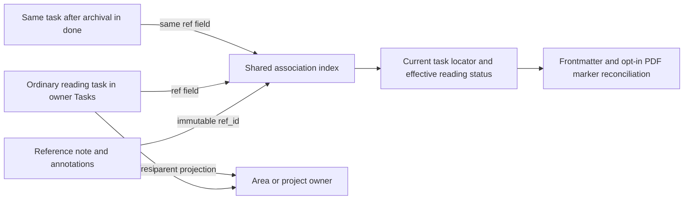

# Parent-owned reference tasks: ordinary work, durable reference identity

Independent research by **cdx**, 2026-10-09. Scope: design and implementation research across bob-cli, bob-plugins, Bob Mac Capture, SASE, its research-artifact plugin, global configuration, and a read-only vault snapshot. No peer swarm reports or findings were consulted. This research does not implement the feature or migrate the live vault.

The proposal is a good idea. Reading is work, and keeping its actionable checkbox beside the rest of a project's work makes ownership, planning, dependencies, and completion more understandable. Keep the reference note as the source-and-annotation document and put its one reading task in the owner's `## Tasks` section.

The change is larger than moving a line. Today `^ref` is simultaneously a task address, a reference-lifecycle recognizer, and a freshness-review identity. Several readers assume that the checkbox lives in the reference note. Those assumptions must be replaced by one association contract. Otherwise a moved or archived tracker can look absent, get recreated, or make the wrong references appear in Today.

My recommendation is **one ordinary parent-owned task per modern reference, an immutable reference identifier shared by note and task, normal work-lane eligibility, and retained reference review and PDF reconciliation contracts**. The following evidence and requirements explain the tradeoffs.

## 1. What the current system actually does

### Creation and capture are staged

`bob ref create` already has `-P|--parent`, defaulting to `obsidian_ref`. It creates an intake PDF; `bob ref scan` later materializes the reference note. `-p` already means `--published`. The request's proposed “new required `-p|--parent`” therefore combines a useful tightening with an existing short-option collision. [B1]

Automatic bare-URL capture does not run the public command. It queues a ref job whose worker calls typed `ingest_url`. Keep URL imports call that same function inline. Both currently inherit a hardcoded `obsidian_ref` parent; `IngestRequest` has no parent field. Updating Clap alone would leave both main capture paths unchanged. [B2]

Bare URL routing is deliberately narrow: one admitted URL, with no task operator, children, dependencies, explicit destination, or global destination. In particular, adding `@bob`, a route flag, or `@@bob` currently makes the item an ordinary URL task. A new reference-parent choice must not accidentally enter this existing destination mechanism. [B3]

### The tracker is physically and semantically tied to its reference note

Generated notes contain approximately:

```markdown
- [ ] #task #ref [[lib/papers/example.pdf]] #hide ^ref
```

The generated body, status parser, dirty-note allowance, annotation-task insertion, library date backfill, and freshness evaluator all recognize this shape or exact block ID. The library reader has a looser recognizer than the PDF sync writer; a shared replacement should prevent those readers from diverging again. [B4, B5, B6]

The library row's effective status can already lead the stored frontmatter when the tracker changes. A tracker edit conflicts with independent marker/frontmatter status edits that moved differently from the stored base. Blocked `[?]` is an overlay and uses the existing open reading status; it is not another reference status. PDF write-back remains explicit. [B5, B6]

### The Mac task picker problem is mainly residence, not a Swift blacklist

The Rust scanner behind `^` enumerates routable **vault-root** Markdown notes and selects open `[*]` and `[/]` tasks with block IDs. I did not find a reference-specific blacklist in that scanner. References under `ref/...` fail its residence rule. Moving their trackers into today's root-level area/project notes should make them eligible through the ordinary path. Existing Today links seed picker ordering; a separate Rust Today resolver already identifies tasks by `(path, block_id)`. [B7]

There is a different Mac bug waiting for this migration: the **Refs** panel joins Today by reference **note path**, and its Swift plan decoder currently discards `block_id`. After moving several references into `bob.md`, joining on the parent's path either loses their Today state or identifies every reference in that parent as Today. Use the exact tracker's task locator instead. [B8]

### Archiving already moves whole task blocks and repairs links

`bob task archive` collects closed `#task` blocks, including children, into `done/<source>_done.md`, with nested source directories mirrored. It already repairs task links and dependency IDs. Its collision handling can rename a block ID, such as `foo` to `foo-1`. Reference identity therefore should not depend solely on a block ID remaining unchanged. [B9]

The Obsidian move engine likewise carries children and rewrites links and dependency identities across files. Its usual move also stamps freshness. That is correct for an explicit review gesture, but **must not run during the structural migration**, because migration is not a user confirmation. [B10]

### Reference review is an intentional separate contract

The current evaluator places due reference trackers in REFERENCES, including Pending and Next references. They use `reference_interval` or the Ready interval chain, rather than the lane's daily interval. They do not count keeps or receive the ordinary approved-decay treatment. The conventional `#hide` bypass exists specifically to admit them to this review while hiding them from ordinary lane views. Rust and JavaScript implement the same rules. [B11]

Bryan's checked configuration sets reference review to **7 days**, Pending and Next review to **1 day**, and soft caps of **10 Pending** and **15 Next**. Flattening all special cases would change this review rhythm as well as visibility. [B12]

### SASE already knows the hook's project

SASE captures the logical project name, serializes it into each durable hook run, and includes it in notifications. The runner builds `command + quoted absolute file path` and supplies only an inherited environment. It does not inject the run's project or interpolate a project placeholder. The missing piece is execution context, not discovering a project name. [B13]

The configured hook comes from `sase-research-artifacts@research-highlights`; the actual command override is currently `bob highlights create --include-id`, using the permanent legacy command alias. The plugin filters out swarm drafts and researcher agents. Keep those filters: producing five independent drafts should not create five reading tasks. [B12, B14]

## 2. A bounded migration census

I opened the vault through `sase repo open gh:bobs-org/bob` and inspected the external snapshot at commit `de30d858058dc357673543f46c2df7faeccb9baf`. This is a remote checkout, **not a claim about the live state of `~/bob`**, its uncommitted changes, or unsynced PDFs. [V1]

A read-only `bob ref list -b <snapshot> -R all -A -f json`, reduced to aggregate counts, reports:

| Population | Count |
| --- | ---: |
| Notes covered by the reference index | 950 |
| Rows listed across all reading states, excluding superseded notes | 948 |
| Modern listed references | 346 |
| Legacy listed references | 602 |
| Queued or started references with usable modern trackers | 27 |
| Queued or started references without tracker-derived reading state | 355 |

A separate source-line census of open trackers found:

| Open tracker property | Count |
| --- | ---: |
| Ready `[ ]` | 10 |
| Next `[*]` | 8 |
| Pending/In Progress `[/]` | 8 |
| Blocked `[?]` | 1 |
| `#hide` present | 27 |
| Parent `[[obsidian_ref]]` | 27 |
| Chat / paper / blog notes | 21 / 3 / 3 |
| Open annotation follow-up tasks in these notes | 0 |

The blocked reference has frontmatter `next`, matching the status-neutral overlay contract. The old parent chain is `obsidian_ref → zorg_ref → ref → type → org`; it does **not** supply an area/project owner. Titles may suggest likely projects, but they are not adequate authority for automatic assignment. None of these 27 notes had a `research` frontmatter value usable for deterministic routing.

A bounded scan also found 99 wikilink occurrences ending in the old `#^ref` anchor. That is an inventory warning, not a claim that all 99 point to these 27 open trackers. It found no exact `^ref` task in `done/`. Ordinary tasks already use descriptive IDs such as `ref-notes`; a `ref-` prefix is not sufficient evidence of a lifecycle tracker.

The source-body census excluded filenames with other swarm-researcher suffixes. The library totals are aggregate metadata from the pinned remote snapshot; no peer findings were read. These counts must be regenerated against the live vault immediately before migration.

**Implication:** migrating the 27 open modern trackers is tractable. Treating every queued legacy reading record as currently actionable would activate another 355 entries, which is a different product decision. Eight reference tasks in each active lane also consume substantial fractions of the existing caps before other work is counted. The caps should include them truthfully; do not solve the increase by excluding reference tasks again.

## 3. Critique and explicit adjustments to the request

1. **Make the existing `--parent` required, retain `-P`, and retain `-p` for publication dates.** This meets the ownership requirement without silently changing existing command meanings. Examples below use the unambiguous long spelling. If lowercase `-p` is essential, that requires a separately accepted compatibility break; I do not recommend it. [B1]

2. **Require resolved ownership at admission, not an interactive prompt in every backend.** The Mac app and a TTY Keep pull can prompt. Detached workers, scheduled pulls, file hooks, JSON consumers, and dry runs need an explicit parent, structured “needs parent” information, or a preserved unprocessed item. They must never hang waiting for a terminal or quietly pick a parent.

3. **Keep `#ref` in stored Markdown and replace its rendered appearance.** A presentation icon should not become the association format. This follows the existing `#task` mark architecture and keeps source mode, queries, and plugin-free reading comprehensible. [B15]

4. **Separate reference identity from task location and block identity.** Add a dedicated immutable reference ID rather than overloading frontmatter `id`, which already identifies imported sources. A task's address is still the normal `(path, block_id)`; the association survives when that address changes. [B5, B9]

5. **Remove work exclusions, preserve reference-specific review and source synchronization.** I recommend retaining REFERENCES and Bryan's 7-day reference cadence in the first release. This is a deliberate qualification of “like any other task”: the task participates fully in ordinary work lanes, but its existing review category remains. If the goal includes daily lane review and normal decay for reading work, make that a separately visible decision and update both evaluators together. Do not let it happen accidentally when renaming anchors. [B11, B12]

6. **Separate modern actionable migration from historical bibliography.** Move current open modern trackers and require a valid owner for every newly imported reference. Do not manufacture tasks for the 355 queued/started legacy rows. Terminal historical notes and taxonomy hubs remain readable; reopening an old reference goes through the new parent-selection flow.

7. **Apply the residence rule to annotation follow-up work too.** New annotation tasks should default to the reference's area/project parent rather than recreate ordinary `#task` rows in ref notes. Existing explicit annotation routing remains available, with destination validation. Such follow-ups are ordinary tasks and never control the reading status. The sampled open notes have none to move, but the supported ingestion behavior would otherwise recreate the inconsistency. [B16]

8. **Define ownership across moves and archives.** Moving the tracker to another area/project changes its operational owner. Archiving it into `done/` preserves the last area/project owner; `done/` is history, not a new parent. A reference may be linked from many projects, but it has one canonical reading task and one operational owner. Separate rereading or application actions may link to the same source without becoming additional lifecycle trackers.

There is one practical cost to the proposed model: some captured material is only interesting, not a committed reading obligation. Use a real reading/research area for those captures, or explicitly choose an existing inbox area when the actual owner is unknown. Any such fallback must be an affirmative capture choice or explicit user configuration, not an inference that all research belongs to `sase`. Do not create synthetic project notes merely to satisfy the schema.

## 4. Recommended data model

### One immutable association, ordinary task addresses

Use a 128-bit random identifier, represented as 32 lowercase hexadecimal characters. Mint it once when a new reference is admitted; carry it through the intake PDF marker and later reference note. Existing references receive it during migration. Name the field `ref_id`, separate from existing `id`.

```yaml
# ref/papers/harness_engineering.md
parent: "[[bob]]"
type: "[[ref]]"
ref_id: 9f57279d5ac14baea71489d186ca8df0
status: next
source_pdf: lib/papers/harness_engineering.pdf
```

```markdown
# bob.md

## Tasks

- [*] #task #ref Read [[ref/papers/harness_engineering|Harness Engineering]] [ref:: 9f57279d5ac14baea71489d186ca8df0] [created:: 2026-10-09] ^ref-9f57279d5ac1
```

The name and wording remain editable. Only the tracker carries the `[ref:: …]` association. Its `#ref` tag identifies the displayed kind. A normal source link does not confer lifecycle identity, and neither does a block-ID prefix. A valid association field without the cosmetic tag can remain resolvable with a repair diagnostic, just as legacy trackers without `#ref` are currently recognized.

The association uses the full ID. The block ID can use `ref-` plus a checked unique abbreviated ID, extended on collision. Generate it against existing IDs and all IDs reserved by the same batch. It uses only characters Obsidian permits. Never derive it from mutable titles, note paths, or a URL alone. An archive collision may change this navigation ID without changing `[ref:: …]`. [O1, B9]

A reference note can show a **plain `Reading task: [[bob#^ref-…]]` link**, maintained as a navigation projection. It is not another checkbox. Standard move/archive link repair can update it; association resolution can rebuild it after a manual cut-and-paste. Do not require the link to be correct to locate the actual task. If a projection refresh changes a dirty reference note, use the same preimage/merge safeguards as other managed writes.

Why pay for an association field instead of just a frontmatter `ref_task` wikilink? A wikilink-only design is attractive and smaller, but manual task moves require block-ID recovery, archive collisions can change that ID, and duplicated/copied tracker blocks need detection. The immutable ID makes those cases explicit without making a mutable pointer into another source of truth. The cost is a new machine field and index logic. Hide that field through existing inline-field display conventions; do not expose it in the capture UI.

### A shared resolver, built from vault files

Add a shared reference-task resolver used by library list/show/find, sync/scan, and reference diagnostics. Build it once per operation, not once per PDF. The index includes ordinary eligible Markdown notes **and `done/`**, plus legacy in-note trackers during the transition. It excludes templates, conflict copies, generated copies, fenced code, and embeds that only display another task.

Resolve `ref_id` to exactly one owning reference note and exactly one source checkbox. Return:

```json
{
  "ref_id": "9f57279d5ac14baea71489d186ca8df0",
  "path": "bob.md",
  "block_id": "ref-9f57279d5ac1",
  "link": "[[bob#^ref-9f57279d5ac1]]",
  "archived": false
}
```

Expose this as an additive optional `task` object on `bob ref list/show/find` rows. The locator is derived, not a new authoritative manifest. A persistent cache, if measurements justify one, must be disposable and refreshed on moves, renames, edits, deletions, and sync. No cache may turn an ambiguous duplicate into a silently chosen task.

| Resolver result | Read behavior | Write behavior |
| --- | --- | --- |
| Exactly one task in an area/project | Derive lifecycle from that task | Reconcile its projections normally |
| Exactly one closed task in `done/` | Derive terminal lifecycle and close date | Preserve historical location |
| An open tracker found in `done/` | Report that it was reopened in history | Require an explicit restoration to a valid owner |
| No task for a migrated reference | Show cached metadata with `missing_ref_task` | Never recreate automatically |
| Multiple tasks with the same association | Report ambiguity and all locations | Refuse lifecycle/ownership writes |
| Task outside permitted residence | Return its location with a diagnostic | Require routing; do not bless a new exception |
| Unmigrated terminal/legacy reference | Read the legacy representation | No implicit task creation |

This distinguishes “absent because archived” from “deleted,” “temporarily cut,” and “duplicated.” Prefer a recoverable diagnostic to silent duplicate work. Reopening an archived reference can be one explicit operation that moves the existing task back into the still-valid parent, preserving its identity and history. If that parent project is terminal, select another open project or area first.



## 5. Lifecycle, ownership, and synchronization

Preserve the existing checkbox mapping:

| Task mark | Reference status | Interpretation |
| --- | --- | --- |
| `[ ]` | `ready` | Available reading work |
| `[*]` | `next` | Sticky commitment |
| `[/]` | `wip` | Sticky Pending/In Progress lane |
| `[?]` | Existing open reading status | Blocked overlay |
| `[x]` or `[X]` | `read` | Finished material |
| `[-]` | `abandoned` | Stopped reading |

“Read” applies to this one lifecycle task, not to every task linked to the reference. Completing a reference never automatically closes annotation follow-ups or downstream work. Completing a dependent task never completes its reading prerequisite. These remain normal dependency semantics. Upstream Tasks also distinguishes status types from literal checkbox characters; do not implement a new “anything other than space is done” rule. [B5, B17, O3]

The task remains the action surface. Frontmatter and the PDF marker retain their established synchronization relationship, including the saved base, narrow conflict checks, and explicit marker write permission. In the first release, change **where the existing status signal comes from**, rather than replacing the reconciliation policy.

- Tracker-only status edits produce the existing pending projection update.
- Independent incompatible marker/frontmatter status edits produce a conflict; report the actual external task's location.
- A blocked task keeps its open reading status; terminal cached status plus an open blocked tracker is handled as the existing reopen case.
- Existing close dates and cancellation logs survive task moves and reopening. Do not reset a finish date to the date of migration or archival.
- Archived tasks are found before any missing-task decision. Annotation refresh of a completed reference must not create a fresh open tracker.
- A valid reference parent change must correspond to a task move. A lone frontmatter/PDF parent edit is an ownership mismatch or explicit move request, not authority to append a duplicate task into a second project.

For a normal move, update the reference note's `parent` and navigation link along with the existing move's task and link changes. Do not write the PDF from a hotkey. The changed parent remains a note-side projection pending the existing explicit PDF reconciliation. A manual cut-and-paste is discovered through the immutable association; the next reconciliation repairs the parent projection, or reports a conflicting independent parent edit. When the task is archived, retain the last parent instead of assigning `done/bob_done`.

The important concurrency boundary changes. A scan now touches popular area/project notes shared with capture, other references, plugins, and vault synchronization. Existing per-PDF plans cannot independently each append to the same parent from the same old snapshot: the last write would lose the earlier append. Generalize the existing annotation routed-group finalizer into **one coordinated planned change per destination**, containing all tracker creations, tracker patches, and annotation tasks for that batch. [B16]

Use the established cooperative vault-lock conventions where writers share them, and optimistic preimage checks for user/Obsidian changes that do not take that lock. Stage and verify all affected files; keep a small recovery journal for multi-file application so a crash cannot cause a retry to append another tracker. Do not claim atomic rename makes several files one atomic transaction: capture's writer itself documents that its preimage guard is not full cross-process serialization. [B18]

Preserve dirty-file safety, but avoid an overbroad rejection of every uncommitted parent. Prefer narrow patches against the exact matched tracker and an aggregate insertion point; preserve unrelated current text and refuse changed target preimages. Never transplant the old “any dirty ref body except an exact `^ref` checkbox is refused” exception into permission to overwrite an entire parent note. Read-only library indexing can safely inspect dirty tasks while metadata/PDF write-back waits for a valid write plan. [B6, B18]

`--ref-dir` still scopes **reference documents**. External tracker resolution is scoped to the effective `--bob-dir` vault and its archive, never the caller's other vault or the default home vault. Handle custom lib/ref/xlib paths with the existing configuration contract.

## 6. Capturing references without sacrificing speed

### One exact parent resolver in bob-cli

Validate that a parent names an existing area or a non-terminal project; never create a project through a failed name lookup. Accept a vault-relative path, a simple wikilink, or a bare name. Persist the canonical vault-relative target: `bob`, not the alias `bob-cli`.

Implement `project_name_aliases` as an explicit YAML list of non-empty strings **on project notes**:

```yaml
# bob.md, alongside its current metadata
project_name_aliases: ["bob-cli"]
```

Resolution rules should be predictable:

1. An explicit vault-relative path selects that exact file and validates its type/status.
2. A bare name matches eligible note stems and project-name aliases with surrounding whitespace trimmed and case-insensitive exact comparison.
3. Exactly one candidate succeeds. No candidate reports useful suggestions; more than one reports ambiguity and requires an explicit path.
4. Diagnose duplicate aliases, aliases shadowing another eligible stem, malformed lists, and terminal projects. Do not silently prefer whichever file happened to be scanned first.
5. Fuzzy matching belongs in the picker and suggestions, never in unattended mutation. Do not conflate hyphens and underscores unless a note explicitly lists the alternative.

Use this resolver for reference creation, intake, parent completion, and future commands that accept a project **name**. Do not replace ordinary Obsidian link resolution wholesale; dependency links and existing capture routes have their own documented addressing contracts.

Native Obsidian `aliases` would be a credible simpler alternative, and Obsidian correctly writes canonical targets when an alias is selected. I nevertheless favor the requested custom field for external software-project names: those names are routing identifiers, may differ from the note's human title, and should not expand global wikilink aliases unintentionally. Avoid maintaining both fields for the same purpose. [O2]

### Mac capture: choose the owner at the point of capture

Keep the current bare-URL detection and asynchronous import. When the draft has a **new** reference without a parent, replace the ordinary submit confirmation with a compact owner picker:

```text
[book icon] Harness Engineering

Where does this reading belong?
Search areas and open projects…

  Bob          Project · gtd
  SASE         Project · dev
  Dev          Area

[Enter] Queue in selected owner       [Esc] Back to draft
```

Show the actual destination and filename subtly, particularly when `bob-cli` matched `Bob · bob.md`. Keep the title/URL visible, reuse the existing target picker styling, and preserve the draft on cancel or failure. A recently used owner may rank first; it must not be submitted automatically. One explicit “use for these N links” choice makes batch capture fast while retaining per-item overrides.

The app renders bob-cli's requirements and candidates. It does not parse aliases or infer URL ownership in Swift. Add a `ref_parent` completion/requirement capability and make new JSON fields optional for older clients; unsupported clients receive a useful missing-parent error and keep the draft. Preserve the thin-client contract. [B19]

A simple CLI form is:

```sh
bob capture 'https://example.org/article' -P bob
bob ref create 'https://example.org/article' --parent bob
```

For `capture`, use the currently free `-P|--ref-parent` as a separate semantic option, not `--route`. It supplies metadata to an item already classified as a reference. It does not turn a URL-plus-prose task into a reference, and `--no-ref` remains the explicit URL-task path. It applies to reference items in a batch; machine clients can additionally supply validated per-item parent assignments through the JSON request contract.

Library deduplication happens before prompting when possible. If the URL is already captured, show the actual owner and offer the existing task; do not silently move or duplicate it under the new caller's parent. Attaching narration to an existing reference uses its existing owner. The proposal's required parent applies to **new admission**, not a pointless ownership prompt for an attach-only operation.

Persist the resolved parent and immutable `ref_id` in each new ref job before reporting successful queueing. Workers never prompt. Revalidate the destination before materialization; if it disappeared or became terminal, preserve the import and report `needs_parent`. Older pending jobs that lack ownership need explicit assignment, not a backfilled `obsidian_ref` default. Clip failure fallback tasks and their retry command must include the selected owner.

Keep the existing import boundary: a queued or intake reference does not become an active task until scan creates its note and tracker together. The UI should distinguish `Queued for import → Bob` from `Reading task created in Bob`. Selecting ownership before background work makes this delay understandable without inventing placeholder tasks and another lifecycle.

### Keep pull: human and unattended modes

Add `-P|--parent` as an optional batch default, with the same resolver. Lowercase `-p` is already `--include-pinned` here. A TTY pull should collect missing parent choices for new URL imports before clipping or archiving. Present a batch table, permit one owner for selected items and per-item overrides, and support leaving an item in Keep.

For unattended/JSON pulls with no configured or supplied parent, return a structured `needs_parent` outcome for affected URLs, leave those notes unarchived, and process unrelated admitted work according to existing partial-failure semantics. Offer explicit `--no-ref` if the user wants ordinary inbox URL tasks instead. An explicitly configured inbox-area default is possible; it is not a silent system default.

Keep's guarantee remains: archive only once the accepted content is durably verified under the import contract. Missing ownership is neither a successful import nor a permanent clip failure. Store the chosen parent and association in the durable import journal so a crash/re-pull preserves assignment and does not create a second tracker. A previously accepted library/intake duplicate can finish its existing archive action without inventing a new parent prompt. [B2]

## 7. SASE hook integration

The smallest safe extension is a per-run environment variable populated from the **serialized event**, not guessed from the detached worker's inherited environment:

```python
hook_env = os.environ.copy()
hook_env["SASE_FILE_HOOK_PROJECT"] = str(run["project"])
# existing subprocess.run(..., env=hook_env, ...)
```

Then configure:

```yaml
file_hooks:
  - use: sase-research-artifacts@research-highlights
    command: 'bob ref create --include-id --parent "$SASE_FILE_HOOK_PROJECT"'
```

The runner already appends the quoted absolute source path, so the resulting call is `bob ref create --include-id --parent <project-name> <source-file>`. Quoted shell-variable expansion passes spaces and shell punctuation as data; avoid raw string replacement of `{project}` into shell source. Missing/unknown project context should fail with an actionable notification rather than default to the current project or `obsidian_ref`. [B13]

The `bob-cli → bob.md` mapping belongs in `project_name_aliases`, not in SASE or a shell case statement. `sase` uses its canonical project note or an explicit alias. Tests should cover primary and research-sidecar events, detached execution after the producer exits, explicit artifact registration, filenames with spaces, unknown projects, and malicious-looking project strings that remain a single argument.

Do not automatically broaden the research hook to include every artifact producer or every `__<researcher>` file. Keep its existing admission and draft filters. Global command configuration belongs in the opened chezmoi source; future implementation must apply its existing deployment workflow. The research-artifact plugin owns the hook filter/template contract, SASE owns event execution context, and bob-cli owns parent resolution.

## 8. Treating reference work normally: remove and retain

| Behavior | Recommendation | Reason |
| --- | --- | --- |
| Generated `#hide` on new/migrated reference trackers | Remove | Reading work should appear in lanes and budgets |
| User-authored `#hide` on a reference task | Honor normally | No new reference-specific visibility bypass |
| Root residence barrier for `^` | Use ordinary parent residence | Existing scanner can then include reference work |
| Today/Pending/Next exclusions based on reference kind/path | Remove | Participation follows status and ledger links |
| Per-note Ready cap and global work caps | Include references | Backlog pressure should be truthful |
| Project schedule/dependency/blocking rules | Apply normally | Reading prerequisites are work like other tasks |
| Project lifecycle visibility | Apply normally | Reading work in a project counts as its open work |
| REFERENCES tier and reference cadence | Retain initially | Protects Bryan's explicit weekly review contract |
| Keep/decay exemption for reference lifecycle review | Retain initially | No silent reference cancellation from a parser change |
| Tracker recognition by exact `^ref` | Replace for migrated/new notes | Many trackers may now share a parent |
| Legacy terminal in-note `^ref` reading | Retain | Historical access needs no bulk rewrite |
| In-note checkbox generation after migration | Remove | Prevents a second task/source of truth |
| PDF status mapping and conflict/PDF-write safeguards | Retain | These protect source synchronization, not task exclusion |
| Display embeds treated as dependency edges | Continue refusing inference | A quotation is not a prerequisite |
| Archive exclusion from normal work scans | Retain | Closed history should not become a live lane |
| Archive exclusion from reference association lookup | Remove | Historical tracker remains lifecycle evidence |

This follows the important distinction between work membership and source-specific lifecycle behavior. “Ordinary” should remove arbitrary exclusion, not remove every safeguard that mentions references.

For freshness, classify a migrated tracker from its association, then keep the same evaluation rules except for the hide bypass. Update Rust and JavaScript together and add shared conformance vectors. The existing REFERENCES dashboard remains a library view and may coexist with ordinary task dashboards; it must not add a second task or a second count to the work budget.

If a later decision adopts fully ordinary review semantics, explicitly retire the REFERENCES override/cadence and tracker decay exemption, and show the resulting daily-review/cap increase in its acceptance criteria. This research recommends preserving them for the initial rollout.

## 9. A restrained visual design

Use a small **book-open outline icon** for the reference kind. A bookmark is already used for annotation-source backlinks, so reusing `🔖` would blur two different meanings. Use one shape and a constant theme-aware ink; status continues to live in the checkbox/row tint, priority in its existing bars, and freshness in its existing mark.

Retain `#task #ref` in Markdown. In Live Preview and rendered notes, an adjacent eligible `#task #ref` pair may appear as a single book icon so reading tasks do not gain a distracting double-icon prefix. This is purely compositional rendering; a cursor entering the range or a click reveals the source tags. Standalone `#ref` in prose, code, headings, or ordinary non-tracker tasks does not receive a lifecycle symbol.

In Tasks query results, the ordinary `#task` mark is already hidden; retain one reference-kind icon in its place. In Mac picker rows, show the same book shape with the task's ordinary lane status and parent label. No separate “reference priority” or new status palette.

A useful rendered task is:

```text
[Next checkbox] [book icon] Read Harness Engineering   [priority] [date]
                           Bob · Papers               [PDF shortcut]
```

The main title opens the reference note for highlights and context. Offer a discreet PDF shortcut where supported, preserving the existing ability to open the source. On the reference note, show `Reading task · Bob · Next` as a lightweight link, not another checkbox. After archive, show `Read · completed <date> · Bob` with the archive task link.

Extend bob-ledger-tools' existing task-tag mark infrastructure, including its CodeMirror decorations, rendered-note processing, and Tasks-result handling. Preserve theme adaptation, exact-token recognition, code exclusion, reveal-on-edit, session toggle, keyboard accessibility, and a textual fallback. Give the icon an accessible label such as `Reference reading task`; hue alone never conveys kind or status. A stored emoji or a global CSS substring selector is simpler but produces inconsistent source text, false matches, and little control over edit behavior. [B15]

## 10. Migration and rollout

Implement compatible readers before changing stored tasks, and finish by enforcing the new admission rule. This is a design sequence, not an instruction to mutate the vault during research.

1. **Inventory and parent mapping.** Regenerate the live census and exact link graph. Produce a reviewable mapping for every open modern tracker: old note/task, current lane, freshness/fields/children, proposed destination, and assignment evidence. Accept existing valid explicit area/project parents; use authoritative event/source-project metadata only when actually present. Ask for the remaining choices in one batch. The observed 27 old hub parents are all unresolved by existing parent metadata. A title-based suggestion may rank candidates, but cannot authorize a move.

2. **Land the association resolver and backward-compatible readers.** New association-based rows and legacy in-note trackers coexist. Add diagnostic behavior and optional task locators. Update the Mac Refs Today join to `(path, block_id)` and keep legacy fallback only for legacy tracker rows. Verify archive resolution before changing live data.

3. **Update writers and capture paths.** Carry parent and reference identity through public create, typed ingest, jobs, Keep journals, PDF markers, and scan. Aggregate parent writes. Add the Mac parent picker and unattended outcomes. Update SASE event execution and the chezmoi hook command. Add `project_name_aliases: ["bob-cli"]` to the live `bob.md` through the vault's authorized write/sync workflow. New imports always use the new model; missing ownership blocks admission.

4. **Apply a resumable, idempotent migration.** Use explicit per-reference mapping and before-image hashes. Preserve checkbox marks, created/completion/cancelled dates, priority, schedule, freshness, keeps, dependency lines, arbitrary children, and work/schedule/cancel logs. Remove only the generated visibility tag; legacy generated syntax can establish that tag's origin, and ambiguous user hiding needs an explicit migration choice. Insert into the owner's existing status grouping in `## Tasks`. Do not put reading work below `^prj` as a dependency unless an actual dependency exists.

5. **Rewrite identity and links as one planned graph edit.** For each old `(ref-path, ref)` target, assign a new association and block address, then rewrite all resolved wikilinks/Markdown task links, embeds, today's and historical Pomodoro links, Depends-On links/derived IDs, and pathless links inside the moved subtree. Preserve aliases and strike state. Do not rewrite unrelated terminal anchors or code examples. Convert internal annotation links to explicit reference-note paths when their task block moves. Updating a block ID and its note path must happen together; the generic move engine's existing ID-preserving rewrite is not enough for the initial `ref → ref-…` change.

6. **Keep source metadata consistent.** Update the reference note's parent, immutable association, plain task link, and PDF marker/base under explicit migration write authority. Preview PDF marker changes and retain recovery material. Since library/intake/PDF synchronization is not guaranteed by the remote checkout, perform this against the actual configured live files, with the existing vault-sync/maintenance coordination. A missing PDF should be reported, not silently replaced or used to omit the task migration's durable association. Whether to complete that item or leave it pending is explicit in the migration manifest.

7. **Verify and resume safely.** Reread all writes, compare the preserved task fields, resolve every rewritten reference/dependency/ledger link, and ensure one association per migrated reference. Re-run the migration unchanged: no further inserts or rewrites. A crash after a destination write must resume from recorded evidence, not append another copy. Rollback restores recorded before-images only when their corresponding after-images still match; refuse to overwrite later user edits.

8. **Enable the presentation and observe real work.** Ship/deploy compatible plugin and Mac readers before the migration. Then enable book icons and exercise `^`, Task Card, moves, archiving, and source opens with real fixtures. The new task volume may make caps crowded; report that honestly without rewriting configured caps or freshness dates automatically.

Do not reuse a user-gesture move with freshness stamping enabled. Migration must neither auto-confirm tasks nor promote them by creating Today links. Existing linked trackers retain Today solely through rewritten dedicated links under today's open Pomodoros. Preserve reference documents and highlights in place; only the work and ownership model changes.

## 11. Implementation boundaries and acceptance tests

| Component | Main change |
| --- | --- |
| bob-cli reference model/index | Stable association resolver and additive task locator; shared classification |
| bob-cli create/ingest/jobs/Keep | Required admission parent, canonical resolution, durable assignment, retry semantics |
| bob-cli sync/scan | External tracker patches, grouped destination plans, archive-aware state, preserved conflicts |
| bob-cli archive and dependency handling | Preserve association fields; repair ordinary addresses and initial migration maps |
| bob-cli freshness + bob-ledger-tools | Association-based reference classification, normal visibility, retained reference cadence |
| bob-navigation-hotkeys | Parent projection on moves; source links/logs preserved; explicit restore workflow |
| bob-ledger-tools rendering | Reference icon and edit/accessibility behavior across all hosts |
| Bob Mac Capture | Owner picker; task locator decoding; exact Today join; normal `^` rows |
| SASE hook runner | Export serialized per-run project context safely |
| sase-research-artifacts / chezmoi | Preserve hook admission filters; update configured command |
| Vault | Explicit 27-item-or-current inventory mapping, parent-task migration, `bob-cli` alias |

Use meaningful cross-component fixtures rather than only tests that repeat a helper's implementation:

- **Association:** two references in one parent; two references with the same title; renamed note/PDF; manually moved task; copied tracker; ordinary `ref-notes` ID; missing task; malformed association; independent vaults.
- **Archive:** complete, archive, rescan, and show status without recreating; archive collision renames the block ID while association still resolves; cancel/archive; explicit reopening restores the same task; simultaneous archive and scan yields a conflict/retry rather than duplicate work.
- **State:** Next and Pending stay sticky across scans and unlinks; Blocked stays status-neutral and recovers through ordinary hooks; conflicting PDF/frontmatter edits refuse; only explicit PDF writes occur; close dates survive migration and reopen.
- **Planning:** one reference linked Today and a second reference in the same parent unlinked; exactly the first appears Today in Rust, plugins, and Mac Refs. Both appear under `^` when their ordinary active statuses qualify. No work budget double-counts library and task views.
- **Review:** association-based tracker vectors preserve the 7-day REFERENCES behavior in Rust and JS; manual `#hide` now obeys ordinary visibility; migration does not stamp or reset keeps.
- **Capture:** explicit parent and alias; ambiguous alias; terminal/missing parent; cancel picker; multi-link batch; known reference with a different proposed parent; attach-only narration; older client; legacy queued job; queued parent closes before scan.
- **Keep:** missing ownership in headless mode leaves source unarchived; per-item parent choices survive retry; existing accepted imports can finish archiving; clip failure retains the selected destination and usable retry command.
- **Grouped writes:** several references and annotations target one parent; unrelated dirty parent text survives; changed preimage refuses; interrupted application resumes once; second migration run is a no-op.
- **Rendering:** light/dark, long titles, source mode, keyboard edit/reveal, callouts/fences, Tasks results, repeated rerenders, no plugin, and accessible text.
- **Hooks:** the serialized project drives the command for detached/sidecar events; `bob-cli` resolves to `bob`; missing/ambiguous mapping fails visibly; project values and filenames containing shell punctuation are passed as data; draft exclusions remain unchanged.

Run the appropriate repository checks when implemented, including shared Rust/JavaScript conformance vectors and the Mac project's macOS CI. This research ran read-only source and metadata checks, not implementation tests or a live migration.

## 12. Evidence and limitations

Source links below are pinned to inspected checkout commits; the public Obsidian/Tasks links were checked online. Code links identify the reviewed source, not a promise that all deployed binaries already match it.

- **B1 — Public create options and staging:** [create.rs](https://github.com/bobs-org/bob-cli/blob/b566ba4431b97df6405a75babe9d17899bae7eea/src/native/highlights_ref/create.rs), [pipeline guide](https://github.com/bobs-org/bob-cli/blob/b566ba4431b97df6405a75babe9d17899bae7eea/docs/highlights-ref-sync.md).
- **B2 — Actual automatic ingestion paths:** [ingest.rs](https://github.com/bobs-org/bob-cli/blob/b566ba4431b97df6405a75babe9d17899bae7eea/src/native/highlights_ref/ingest.rs), [job worker](https://github.com/bobs-org/bob-cli/blob/b566ba4431b97df6405a75babe9d17899bae7eea/src/native/ref_jobs/worker.rs), [job spool](https://github.com/bobs-org/bob-cli/blob/b566ba4431b97df6405a75babe9d17899bae7eea/src/native/ref_jobs/spool.rs), [Keep pull](https://github.com/bobs-org/bob-cli/blob/b566ba4431b97df6405a75babe9d17899bae7eea/src/native/gkeep/pull.rs), [Keep contract](https://github.com/bobs-org/bob-cli/blob/b566ba4431b97df6405a75babe9d17899bae7eea/docs/gkeep.md).
- **B3 — Bare-reference grammar and route precedence:** [item.rs](https://github.com/bobs-org/bob-cli/blob/b566ba4431b97df6405a75babe9d17899bae7eea/src/native/capture_language/item.rs), [draft.rs](https://github.com/bobs-org/bob-cli/blob/b566ba4431b97df6405a75babe9d17899bae7eea/src/native/capture_language/draft.rs), [grammar tests](https://github.com/bobs-org/bob-cli/blob/b566ba4431b97df6405a75babe9d17899bae7eea/src/native/capture_language/tests/ref_grammar.rs).
- **B4 — Generated body and constants:** [note.rs](https://github.com/bobs-org/bob-cli/blob/b566ba4431b97df6405a75babe9d17899bae7eea/src/native/highlights_ref/note.rs), [module constants](https://github.com/bobs-org/bob-cli/blob/b566ba4431b97df6405a75babe9d17899bae7eea/src/native/highlights_ref/mod.rs), [region.rs](https://github.com/bobs-org/bob-cli/blob/b566ba4431b97df6405a75babe9d17899bae7eea/src/native/highlights_ref/region.rs).
- **B5 — Library identity, state, and dates:** [status.rs](https://github.com/bobs-org/bob-cli/blob/b566ba4431b97df6405a75babe9d17899bae7eea/src/native/ref_library/status.rs), [row.rs](https://github.com/bobs-org/bob-cli/blob/b566ba4431b97df6405a75babe9d17899bae7eea/src/native/ref_library/row.rs), [list.rs](https://github.com/bobs-org/bob-cli/blob/b566ba4431b97df6405a75babe9d17899bae7eea/src/native/ref_library/list.rs), [ref command guide](https://github.com/bobs-org/bob-cli/blob/b566ba4431b97df6405a75babe9d17899bae7eea/docs/ref.md).
- **B6 — PDF/task reconciliation and write safeguards:** [annotation_tasks.rs](https://github.com/bobs-org/bob-cli/blob/b566ba4431b97df6405a75babe9d17899bae7eea/src/native/highlights_ref/annotation_tasks.rs), [projection.rs](https://github.com/bobs-org/bob-cli/blob/b566ba4431b97df6405a75babe9d17899bae7eea/src/native/highlights_ref/projection.rs), [guard.rs](https://github.com/bobs-org/bob-cli/blob/b566ba4431b97df6405a75babe9d17899bae7eea/src/native/highlights_ref/guard.rs), [sync.rs](https://github.com/bobs-org/bob-cli/blob/b566ba4431b97df6405a75babe9d17899bae7eea/src/native/highlights_ref/sync.rs).
- **B7 — Ordinary active picker and Today:** [capture_active_tasks.rs](https://github.com/bobs-org/bob-cli/blob/b566ba4431b97df6405a75babe9d17899bae7eea/src/native/capture_active_tasks.rs), [note_tasks.rs](https://github.com/bobs-org/bob-cli/blob/b566ba4431b97df6405a75babe9d17899bae7eea/src/native/note_tasks.rs), [today.rs](https://github.com/bobs-org/bob-cli/blob/b566ba4431b97df6405a75babe9d17899bae7eea/src/native/plan_budget/today.rs).
- **B8 — Mac reference Today assumptions:** [RefsToday.swift](https://github.com/bobs-org/bob-mac-capture/blob/9979d36b37fa92c8d3402bc91a829e8b14fe10f0/Sources/RefsCore/RefsToday.swift), [RefsDecoding.swift](https://github.com/bobs-org/bob-mac-capture/blob/9979d36b37fa92c8d3402bc91a829e8b14fe10f0/Sources/RefsCore/RefsDecoding.swift), [RefsRanking.swift](https://github.com/bobs-org/bob-mac-capture/blob/9979d36b37fa92c8d3402bc91a829e8b14fe10f0/Sources/RefsCore/RefsRanking.swift).
- **B9 — Archive collection, destinations, and collision renaming:** [transform.rs](https://github.com/bobs-org/bob-cli/blob/b566ba4431b97df6405a75babe9d17899bae7eea/src/native/collect_done/transform.rs), [archive.rs](https://github.com/bobs-org/bob-cli/blob/b566ba4431b97df6405a75babe9d17899bae7eea/src/native/collect_done/archive.rs), [plan.rs](https://github.com/bobs-org/bob-cli/blob/b566ba4431b97df6405a75babe9d17899bae7eea/src/native/collect_done/plan.rs).
- **B10 — Obsidian task moves:** [250-task-move.js](https://github.com/bobs-org/bob-plugins/blob/53e773f771a87373347febc15950193a6a09e823/plugins/bob-navigation-hotkeys/src/250-task-move.js), [240-cancel-and-lanes.js](https://github.com/bobs-org/bob-plugins/blob/53e773f771a87373347febc15950193a6a09e823/plugins/bob-navigation-hotkeys/src/240-cancel-and-lanes.js).
- **B11 — Current reference review contract and mirrors:** [freshness.md](https://github.com/bobs-org/bob-cli/blob/b566ba4431b97df6405a75babe9d17899bae7eea/docs/freshness.md), [state.rs](https://github.com/bobs-org/bob-cli/blob/b566ba4431b97df6405a75babe9d17899bae7eea/src/native/freshness/state.rs), [scan.rs](https://github.com/bobs-org/bob-cli/blob/b566ba4431b97df6405a75babe9d17899bae7eea/src/native/freshness/scan.rs), [100-freshness-evaluate.js](https://github.com/bobs-org/bob-plugins/blob/53e773f771a87373347febc15950193a6a09e823/plugins/bob-ledger-tools/src/100-freshness-evaluate.js).
- **B12 — Checked global settings:** [SASE config](https://github.com/bbugyi200/dotfiles/blob/b4757a17a5a33ab1ad267ba19583ffcc4a357f18/home/dot_config/sase/sase.yml), [Bob config](https://github.com/bbugyi200/dotfiles/blob/b4757a17a5a33ab1ad267ba19583ffcc4a357f18/home/dot_config/bob/config.yml). The checkout was opened by configured name `chezmoi`; the repository URL is a navigation aid, not an assumption about public accessibility.
- **B13 — SASE event context and runner:** [context.py](https://github.com/sase-org/sase/blob/73f593a3a5dd4732af63023aee47d3465807dada/src/sase/file_hooks/context.py), [models.py](https://github.com/sase-org/sase/blob/73f593a3a5dd4732af63023aee47d3465807dada/src/sase/file_hooks/models.py), [dispatch.py](https://github.com/sase-org/sase/blob/73f593a3a5dd4732af63023aee47d3465807dada/src/sase/file_hooks/dispatch.py), [runner.py](https://github.com/sase-org/sase/blob/73f593a3a5dd4732af63023aee47d3465807dada/src/sase/file_hooks/runner.py).
- **B14 — Research hook admission:** [provider.py](https://github.com/sase-org/sase-research-artifacts/blob/555a0add8d10c1919ff468c2b70c2e6136321b7e/src/sase_research_artifacts/provider.py).
- **B15 — Existing display-only identity mark:** [task-tag-marks.md](https://github.com/bobs-org/bob-cli/blob/b566ba4431b97df6405a75babe9d17899bae7eea/docs/task-tag-marks.md), [138-task-tag-marks.js](https://github.com/bobs-org/bob-plugins/blob/53e773f771a87373347febc15950193a6a09e823/plugins/bob-ledger-tools/src/138-task-tag-marks.js), [264-plugin-task-tag-marks.js](https://github.com/bobs-org/bob-plugins/blob/53e773f771a87373347febc15950193a6a09e823/plugins/bob-ledger-tools/src/264-plugin-task-tag-marks.js).
- **B16 — Annotation tasks and grouped destination writes:** [annotation_tasks.rs](https://github.com/bobs-org/bob-cli/blob/b566ba4431b97df6405a75babe9d17899bae7eea/src/native/highlights_ref/annotation_tasks.rs), [sync.rs](https://github.com/bobs-org/bob-cli/blob/b566ba4431b97df6405a75babe9d17899bae7eea/src/native/highlights_ref/sync.rs).
- **B17 — Dependency and project contracts:** [task-dependencies.md](https://github.com/bobs-org/bob-cli/blob/b566ba4431b97df6405a75babe9d17899bae7eea/docs/task-dependencies.md), [projects.md](https://github.com/bobs-org/bob-cli/blob/b566ba4431b97df6405a75babe9d17899bae7eea/docs/projects.md).
- **B18 — Capture's write/preimage boundary:** [commit.rs](https://github.com/bobs-org/bob-cli/blob/b566ba4431b97df6405a75babe9d17899bae7eea/src/native/capture/commit.rs).
- **B19 — Thin-client capture contract:** [capture.md](https://github.com/bobs-org/bob-cli/blob/b566ba4431b97df6405a75babe9d17899bae7eea/docs/capture.md), plus audited project decision `decisions:mac-capture-is-a-thin-client`.
- **V1 — Pinned vault metadata:** [bob.md](https://github.com/bobs-org/bob/blob/de30d858058dc357673543f46c2df7faeccb9baf/bob.md), [obsidian_ref.md](https://github.com/bobs-org/bob/blob/de30d858058dc357673543f46c2df7faeccb9baf/obsidian_ref.md), snapshot census described in §2.
- **O1 — Obsidian internal/block link syntax:** [Internal links](https://help.obsidian.md/links). Block IDs admit Latin letters, digits, and dashes; paths are vault-relative and can include folders.
- **O2 — Native alias behavior:** [Aliases](https://help.obsidian.md/aliases), [Properties](https://help.obsidian.md/properties). Native aliases are list properties; selecting one writes the canonical target with display text.
- **O3 — Upstream task status semantics:** [Tasks filters](https://publish.obsidian.md/tasks/Queries/Filters). Status types determine done/open query behavior.

Audited memory consulted: Obsidian vault conventions, CLI rules, artifact rules, glossary entries for Area Note / Project Note / Reference Note / Reference Task / Task Link, and decisions for sticky lanes, ledger-derived Today, tiered review, dependency links, and thin-client capture. Existing accepted policies constrain the implementation; adopting the review/ownership changes requires recording the accepted new policy through the project's memory authorization process, not silently editing its old rationale.

Limitations: no live-vault mutation, no Mac UI execution, no deployed version matrix, no performance benchmark, and no migration rehearsal with actual unsynced PDF bytes. The configured linked Mac checkout was absent, so its source was opened as an external GitHub checkout. The source-level findings are verified; the proposed interaction design and engineering choices are recommendations.

One additional implementation detail deserves explicit coverage: `ref list -g` currently searches Git history for `^ref` lines inside reference notes. External trackers break that date backfill. Preserve old-history fallback for legacy records, but obtain future dates from the associated task's created/completion/cancelled fields and, when those are missing, association-aware history in owner/archive files. Moving or archiving a reference must not make it appear newly added. [B5]

## 13. Recommended solution

Proceed with the parent-owned task model. Make the existing `-P|--parent` mandatory for new reference admission, resolve canonical area/project owners with strict `project_name_aliases` support, and create one normal reading task under the owner's `## Tasks` when scan materializes the reference. Keep a dedicated immutable reference association independent of its editable task address, and use a shared archive-aware resolver everywhere that reads or synchronizes reference status.

Prompt for ownership in the Mac panel and interactive Keep pulls; require explicit assignment or preserve unprocessed items in unattended paths. Export SASE's serialized hook project through a quoted per-run environment variable and map `bob-cli` to `bob.md` in that note's frontmatter. Keep `#ref` in source and render a restrained book icon through the existing mark system.

Remove generated hiding and reference exclusions from ordinary work lanes, pickers, dependencies, project scheduling, and budgets. Preserve the existing REFERENCES cadence and PDF conflict/write contracts initially. Migrate the current open modern trackers with an explicit parent mapping, stable IDs, complete link repair, unchanged freshness, and resumable writes. Keep the legacy bibliography out of that migration.

This gives references the same practical home and gestures as other tasks, while preserving the source identity and history needed to make moves, completion, archiving, and future capture reliable.
