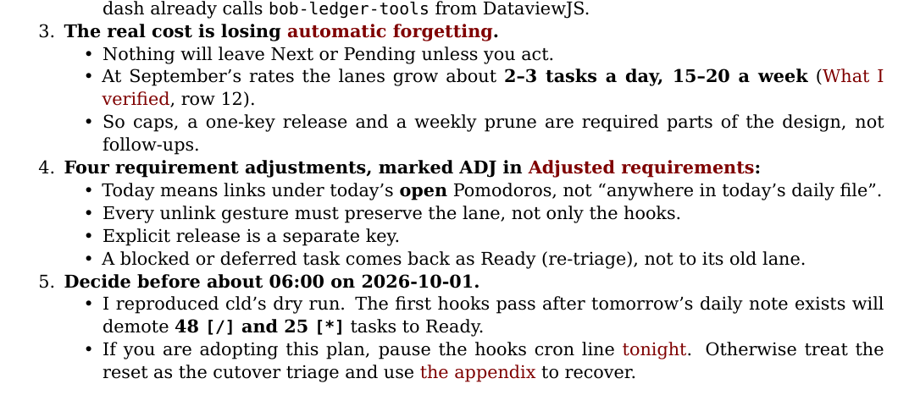
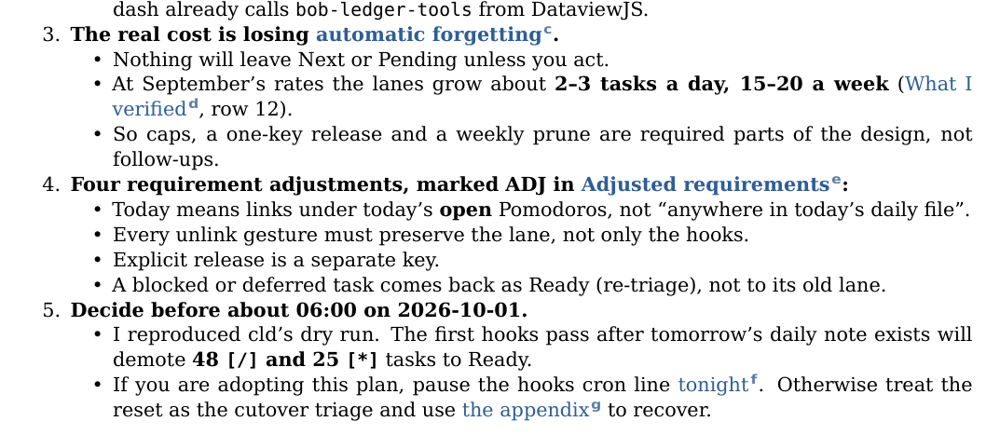
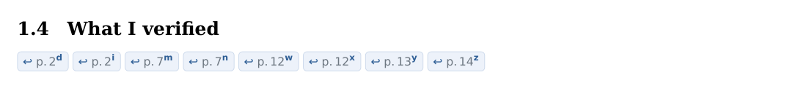
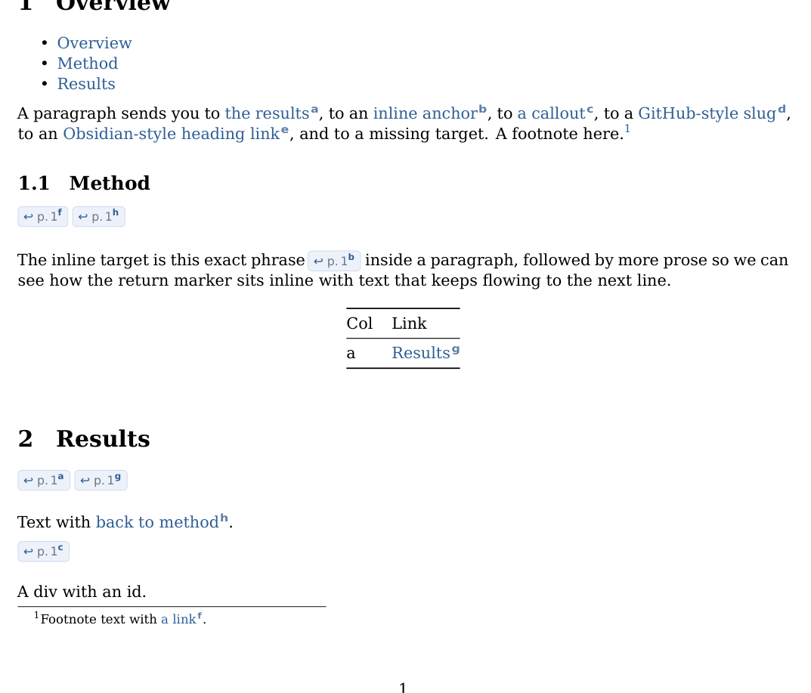

# Paired return links for local links in `bob ref create` Markdown PDFs

Researcher: cld · Date: 2026-10-07 · Scope: the Markdown route of `bob ref create`
(pandoc → XeLaTeX → lopdf stamp → Highlights)

## Bottom line

1. **Build it. The idea is good, and real documents need it.** Your recent research reports
   (the main input to `bob ref create`, whose Markdown ref type defaults to `chat`) contain
   101 local links across 7 reports. Up to 8 of them point at a single target. Highlights
   for Mac has had Back/Forward buttons since 2016, but I found no evidence of Back
   navigation in Highlights for iPad. Return links built into the PDF work in every viewer,
   and on paper too.
2. **Keep your mechanism, change the details.** Keep a visible ID on every followed link
   and the same ID on a return link at the target. Change three things:
   - **IDs are short sequential letters**, not random alphanumerics.
   - **The ID is a small raised tag beside the link text**, not spliced into it.
   - **All return links for one target form a single row of "return pills".** Each pill
     reads `↩ p. 12ᵈ`: the page you came from plus the tag you clicked.
3. **I built a working prototype and ran it through the real pipeline.** On a 16-page,
   27-link report, the `bob ref create` stamp step kept all 85 internal links. All 27 return
   pills point to the page they print. Rendering took about 0.6 s longer (5.1 s → 5.7 s), and
   the page count didn't change. Screenshots are below.
4. **Two problems you didn't ask about turned up, and they belong in this feature:**
   - **4% of local links in your real reports are dead today, and nobody is told.** Pandoc's
     identifiers don't match GitHub-style heading slugs. LaTeX logs a warning that bob
     throws away, and the reader gets colored text that does nothing when tapped.
   - **Tags would leak into Highlights exports.** Apple's PDFKit reportedly ignores
     `/ActualText`, so a tag can't be hidden from text extraction. The design therefore draws
     tags with reserved Unicode modifier letters that `bob ref sync` can strip
     deterministically.
5. **Some things only real devices can settle:** tapping on iPad Highlights, landing
   position, links surviving a Highlights save, and what the exported text looks like.
   §6.4 lists the checks.







## 1. What exists today

- `create_markdown_route` calls `render_temp_pdf` in `src/native/highlights_ref/create.rs`.
  `render_temp_pdf` runs pandoc with `--toc --toc-depth=3 --number-sections
  --pdf-engine=xelatex -V colorlinks=true`, DejaVu Serif/Sans/Mono, the
  `PANDOC_HEADER_INCLUDES` preamble (fvextra code wrapping, listen-card macros), and the
  `PANDOC_CODE_BREAK_FILTER` Lua filter (inline-code breaks, listen-card callout).
- Pandoc 3.1.11.1, the version on athena, turns `[text](#id)` into `\hyperref[id]{text}`.
  Headings get `\label{id}`; spans and divs get `\phantomsection\label{id}`.
  `--number-sections` puts a number on every heading.
- Pandoc's default `linkcolor` is Maroon and its `urlcolor` is Blue, so local and web links
  currently render in two unrelated colors. Neither matches the listen card's `3B6EA8`
  blue.
- `stamp_and_install` (`stamp.rs`) loads the render with lopdf, embeds the page-1 marker,
  and saves the result. I confirmed that this keeps link annotations and named
  destinations.
- `render_temp_pdf` captures pandoc's stderr and prints it **only when pandoc fails**. Any
  warning from a successful render, such as an undefined reference, never reaches you.
- Highlights exports highlighted text to sidecars. `bob ref sync` cleans that text only
  when rendering the note, through `beautify_annotation_text` and
  `clean_pdf_text_artifacts_line` in `text.rs`. Block IDs use the raw text.

## 2. Evidence

### 2.1 Your documents use local links, often several per target

I parsed every report from 2026-08 and 2026-09 that contains a local link (7 of them), using
pandoc's AST with an audit filter. Peer reports from this swarm were excluded.

| Report | Local links | Max links to one target | Dead today (pandoc ids) | Dead with GitHub slugs |
| --- | ---: | ---: | ---: | ---: |
| retire_now_sticky_lanes_ledger_today | 27 | 8 | 0 | 0 |
| token_window_48h_loop_portfolio | 27 | 4 | 0 | 0 |
| ready_task_freshness_review | 24 | 4 | 0 | 0 |
| ready_task_freshness_review__cld | 17 | 8 | 0 | 0 |
| bob_mac_capture_replacement__b | 4 | 1 | **4** | 0 |
| bob_gkeep_inbox_drain__grk | 1 | 1 | 0 | 0 |
| ready_task_freshness_review__grk | 1 | 1 | 0 | 0 |
| **Total** | **101** | **8** | **4** | **0** |

The links sit in prose, bullets, emphasis, and table cells. A typical one is
`([What I verified](#what-i-verified), row 12)`. Several targets are pointed at many times:
evidence sections, "Cutover", and "Recommended solution".

### 2.2 Dead local links fail silently

All four dead links point at numbered headings such as `## 10. Phased implementation plan`.
GitHub slugs that heading as `10-phased-implementation-plan`. Pandoc's identifier rules
remove leading digits, so pandoc's id is `phased-implementation-plan`. A render of that
report today logs `Hyper reference '9-recommendation' ... undefined` and creates **no link
annotation**: the reader sees link-colored text that does nothing. pandoc's
`gfm_auto_identifiers` extension, or a resolver that also accepts GitHub slugs (what the
prototype does), fixes all four. With the prototype, the same report has 35 working internal
links instead of 27 (27 TOC entries, 4 forward links, 4 return pills).

### 2.3 What the reader's apps already offer

- **Highlights for Mac** added "back and forward buttons" in v1.5 (March 2016) and moved
  PDF navigation into a separate **Go** menu in 2020.3
  ([Mac changelog](https://highlightsapp.net/changelog/mac/)).
- **Highlights for iPad/iPhone** can follow internal links (2021.1 fixed "a bug that broke
  navigating PDFs using internal links"). The iPad
  [open-and-read tutorial](https://highlightsapp.net/how-to/ipad/open-and-read-pdf/)
  describes no back history, and its top-left "back arrow" closes the document. The
  changelog didn't settle this either, so treat iPad back navigation as **absent until shown
  otherwise**.
- **PDFKit's** `PDFView.goBack` covers "page history", which "gets built as your application
  calls navigation methods" ([Apple docs](https://developer.apple.com/documentation/pdfkit/pdfview/goback(_:))).
  Whether a tapped link adds to that history is up to the app.
- **Apple's PDF library reportedly ignores `/ActualText`**
  ([zathura #189](https://git.pwmt.org/pwmt/zathura/-/issues/189),
  [ConTeXt list](https://lists.contextgarden.net/archives/list/ntg-context@ntg.nl/message/X3XWFVKFPHNLJUKPW3O5IALDKQ6ZZFED)).
  The usual trick of hiding decorations from copy/extract with `accsupp` will therefore not
  protect Highlights exports.

Conclusion: the viewer's back button is a nice extra on the Mac but no foundation. Return
links in the document work on iPad, on Mac, and in any other viewer, and the page numbers
still mean something on paper.

### 2.4 Prototype results

I wrote a pandoc Lua filter and a set of LaTeX macros (Appendices A–B). I ran them through
pandoc alone, and through the real `bob ref create` using `BOB_PANDOC_COMMAND` pointed at a
wrapper. The results:

| Check | Result |
| --- | --- |
| Internal links after bob's lopdf stamp | 85 of 85 resolve; 0 unresolved |
| Return pills: printed page vs actual destination | 27 of 27 match (automated check: mutool + pdftotext) |
| Converges within pandoc's xelatex reruns | Yes (no "labels may have changed") |
| Page count (16-page report) | 16 → 16 |
| Render time | 5.1 s → 5.7 s (filter alone 0.3 s; most of the rest is loading TikZ) |
| Return landing | XYZ destination with `left = null`, top raised about 1.6 lines above the source line |
| GitHub-slug and `#Heading%20Text` links | Resolved to the right headings |
| Missing target | Rendered as plain text plus a `warning:` line |
| Tags in extracted text | `forgetting ᶜ.`: one reserved code point, easy to strip |

Two variants I tried **failed**, and they shaped the design:

- **Letters restarting on each page (Bible-style "12b").** This needs `perpage` and
  converged only on the **4th** xelatex pass. Pandoc stops after 3, and the shipped
  prototype printed pills like `p. 2 d` next to a source tagged `ᵇ`. That is wrong, and it
  fails silently. Rejected.
- **Letters numbered per target (Wikipedia-style a, b, c).** Most targets have exactly one
  inbound link, so nearly every tag in the body became "a". That is noise that looks like a
  broken footnote series. Rejected.

I also found and fixed one hyperref default. `\hypertarget` records the link's own **x**
position as the destination's left edge (x = 516 pt for a link near the right margin), so a
zoomed-in viewer would scroll sideways on return. The prototype writes its own destination
with `/XYZ null <y> null`, which leaves the horizontal position alone.

## 3. Critique of the plan

### What is right

- **Pairing by a visible ID is the right core idea.** It improves on the best-known
  precedent. Wikipedia's "^ a b c" back-links make readers guess which letter was theirs,
  because the letter is not shown at the source. Your plan shows it.
- **Return links in the document beat relying on the viewer.** Viewer support differs (iPad
  Highlights), and return links in the PDF need nothing from the viewer.
- **It makes targets self-describing.** A heading with three pills tells you, before you
  click anything, that three places point here and which pages they are on. That is
  Obsidian's "linked mentions" carried into print. LaTeX's own precedent is hyperref's
  `backref` ("Cited on pages 3, 7").

### What needs correcting

1. **Random or opaque alphanumerics are hard to scan or remember.** Use short sequential
   letters in reading order.
2. **Putting the ID inside the link text changes the prose and pollutes Highlights
   exports.** Use a raised tag beside the text, drawn with code points that sync can
   strip.
3. **"A new local link at the target" for each source breaks down at fan-in 8.** Without
   grouping and placement rules, a target collects a pile of links. Use one ordered row of
   pills per target.
4. **Placing anything inside heading text leaks into the TOC and PDF bookmarks.** Headings
   are copied into both. Put the row below the heading.
5. **Tiny return links are hard to hit on an iPad.** The pills must be large and padded, not
   a single letter.
6. **The plan assumes every link resolves.** 4% don't, and today that failure is invisible.
   Resolution and dead-link reporting are part of making return links reliable.
7. **Manual TOCs and links inside headings would get pills on every heading.** A list made
   only of `#` links is navigation, not a reference, and should be skipped.

### Would I take a different approach?

No. The paired-link idea is the right one. Here is what I weighed:

| Alternative | Verdict | Why |
| --- | --- | --- |
| Rely on the viewer's Back button | Complement only | Mac Highlights has one; no evidence for iPad; it doesn't survive printing or exporting |
| Page-only back-references ("Referenced on p. 3, 7"), no source tags | Close second | Least clutter. But two sources on the same page are ambiguous, nothing tells you a link can be returned from, and you asked for source IDs. The design keeps page numbers inside the pills. |
| Margin cross-reference column (Tufte / Bible style) | Rejected for v1 | Beautiful, but `\marginpar` fails in tables, footnotes, and floats; `\marginnote` overlaps; the 0.85 in margin is too narrow; tap targets get tiny |
| Letters restarting per page ("12b") | Rejected | Needs 4 LaTeX passes; pandoc runs 3; mismatches are silent (tested) |
| Letters per target (a, b, c) | Rejected | "a" everywhere (tested) |
| Tags only when a target has 2+ inbound links | Rejected | Less ink, but it's inconsistent, and the tag also tells you a return exists |
| Move Markdown rendering to the Chromium reader renderer (web-clip `reader.css`) | Not now | CSS pills would be easy, but Chromium has no `target-counter()`, so no "p. N" labels; it would also be a large migration of TOC, numbering, code wrapping, and the listen card |
| Pandoc → Typst | Future option | Typst's introspection gives page numbers and per-page counters natively and converges by itself. Worth considering only if the whole route moves to Typst. |

## 4. Adjusted requirements

Each change to your stated requirements is marked **ADJ**. Lines marked **ADD** are scope I
recommend adding.

| # | Your requirement | Adjusted requirement | Why |
| --- | --- | --- | --- |
| ADJ-1 | Unique alphanumeric ID | **Unique, sequential lowercase letter tags in reading order**: `a … z`, then `aa, ab …`. `q` is skipped. | Scannable and stable. Letters can't be mistaken for footnote numerals or section numbers. DejaVu has no superscript q. |
| ADJ-2 | ID added to the rendered link text | **The ID is a raised tag right after the link text**, inside the link's tap area, drawn with Unicode modifier letters (ᵃ ᵇ ᶜ …) in bold sans, link-blue | Prose stays intact; the tag is visible but quiet; sync can strip it from exports |
| ADJ-3 | One back-link per source at the target | **One return row per target**: a pill per inbound link, in reading order, each labeled `↩ p. N` plus the same tag | Handles fan-in of 8+; the page number orients you even if you never noticed the tag; still useful on paper |
| ADJ-4 | Back-link "at the target" | **Placement rules by target kind** (§5.4): under the heading; inline after a span; first line of a div; after other blocks | Keeps headings, the TOC, and bookmarks untouched |
| ADJ-5 | "Any local links" | **Except** links inside headings, captions, and pure navigation lists, plus pandoc's own TOC | Avoids a pill on every heading; avoids LaTeX moving-argument hazards |
| ADD-1 | — | **Resolve targets robustly** (pandoc id → GitHub slug → URL-decoded heading text). Render unresolvable `#` links as plain text and report them on a `warning:` line. | 4% of real links are dead today and nobody is told |
| ADD-2 | — | **Return lands with context**: destination about 1.6 lines above the source line, with `left = null` | The source line doesn't land flush against the top edge, and the view doesn't scroll sideways |
| ADD-3 | — | **One ink color for every link** (`linkcolor` and `urlcolor` → `#2F5E96`), with tags and pills in the same family | Pandoc's maroon/blue defaults clash with blue tags (seen in the first prototype) |
| ADD-4 | — | **`bob ref sync` strips tags and pills from Highlights annotation text** for bob-rendered Markdown PDFs | PDFKit ignores `/ActualText` |
| ADD-5 | — | **bob reports link stats**: `links: 27 paired (16 targets)` on success | Makes the feature and its failures visible |
| Non-goal | — | No opt-out flag in v1 | Adds nothing when a document has no local links. If ever needed, `-R, --no-return-links` (short alias free per the CLI rules). |

## 5. The design

### 5.1 What the reader sees

1. On page 12 you read "…grows about 2–3 tasks a day (What I verifiedᵈ, row 12)." The
   link is ink-blue, and the small bold **ᵈ** marks it as an in-document jump that you can
   return from.
2. Tap the link (the text or the tag). You land on **1.4 What I verified**. Right under the
   heading is a row of pills: `↩ p. 2ᵈ  ↩ p. 2ⁱ  ↩ p. 7ᵐ …`. One of them shows the tag you
   just tapped.
3. Tap `↩ p. 2ᵈ`. You land about a line and a half above the sentence you left, so the
   sentence is in view with a line of context above it, and its **ᵈ** marks your spot.
   This matters on viewers that only jump to a page.
4. On a later visit, the pill row also tells you the section is cited from pages 2, 7, 12,
   13, and 14 before you click anything.



### 5.2 Tag scheme

- **One global sequence in reading order**, assigned by the Lua filter. It is deterministic,
  needs no LaTeX convergence, and every tag is unique in the document.
- **Alphabet**: `abcdefghijklmnoprstuvwxyz` (25 letters, no `q`), then two-letter tags.
  A 27-link report ends at `ab`. A 100-link report ends at `cy`.
- **Source glyphs**: Unicode modifier letters (ᵃ U+1D43, ᵇ U+1D47, ᶜ U+1D9C, …, ʰ, ⁱ, ʲ,
  ˡ, ⁿ, ʳ, ˢ, ʷ, ˣ, ʸ, ᶻ), set at about 1.3× in bold DejaVu Sans with color `#5C7FA8`.
  At normal size they are too faint; I tested that. Since these are their own code points,
  an extracted "forgetting ᶜ." can be cleaned without guessing.
- **Pill glyphs**: the same letter as an ordinary bold superscript (`\textsuperscript`).
  At pill size it reads better than a modifier glyph, and it still visually matches the
  source tag.

### 5.3 Return pill

- Content: `↩` in link blue, `p. N` in muted gray `#6E7781` (`\pageref*` of the source
  anchor), then the raised bold tag in link blue.
- Shape: a TikZ rounded rectangle (2.4 pt radius), fill `#EEF3FA`, 0.4 pt rule `#C9D7EA`.
  This matches the listen card palette. Sans `\footnotesize`.
- Row: left-aligned with the text, ragged right, wraps naturally. It sits at `\nopagebreak`
  under its heading with 0.55 line of space below it.
- Hit area: the whole pill is the link. Prototype link boxes are about 11 × 28 pt. If
  device testing finds them too small, enlarge the `/Rect` of `bob:ret:*` links in lopdf
  at stamp time (§6.4); xdvipdfmx ignores invisible struts.

### 5.4 Placement by target kind

| Target | Where the return row goes |
| --- | --- |
| Heading (`#`–`######`) | A block directly under the heading. The heading text, TOC, and bookmarks are untouched. |
| Span `[text]{#id}` | Inline pills right after the span |
| Div `::: {#id}` | First line inside the div |
| Code block, table, figure with an id | A block right after it |
| Footnote content | Same as its kind; pages come out right (tested) |

### 5.5 Landing

- **Forward**: unchanged. hyperref's heading/label anchor is raised above the heading.
- **Return**: `\raisebox{1.6\baselineskip}[0pt][0pt]{\special{pdf:dest (bob:ret:N)
  [@thispage /XYZ null @ypos null]}}` at the start of the source link, plus
  `\label{bob:ret:N}` for `\pageref*`. Writing the destination with `null` left and zoom
  keeps the reader's zoom and horizontal position.

### 5.6 What gets no tag

- Links inside **headings** and **figure/table captions**. Both are moving arguments that
  go into the TOC, bookmarks, and lists of figures. These links still work as plain
  forward links.
- **Navigation lists**: a bullet list where each item is only a `#` link, optionally with a
  nested list of the same kind. This is a hand-written TOC, which pandoc's `--toc` already
  provides. The prototype checks this only for top-level, non-nested lists; production
  should recurse.
- Pandoc's generated TOC and bookmarks are not `Link` elements, so the filter never sees
  them.
- The **listen card**. Running the return-link filter after the existing card filter leaves
  the card as an opaque raw block.

### 5.7 Target resolution and dead links

Resolve `#target` in this order:

1. The exact element id.
2. The URL-decoded id.
3. The GitHub slug of a heading's text.
4. The lowercased heading text, which covers `#Heading%20Text` and Obsidian-style links.

Production should compute GitHub slugs with GitHub's own numbering for duplicate headings
(`-1`, `-2`); the prototype takes the first match. If nothing matches, the link's content is
rendered as plain text (not link-colored, so it doesn't promise anything), and a dead-link
record is emitted for bob to report.

### 5.8 Highlights export hygiene

- When rendering annotation text, `bob ref sync` should drop runs of the 25 modifier-letter
  code points that directly follow a word character or closing punctuation, together with
  any space PDF extraction inserted before them. It should also drop pill fragments matching
  `↩\s*p\.\s*\d+\s*[a-z]{1,3}`.
- **Strip only for bob-rendered Markdown PDFs.** A linguistics paper's `pʰ` must survive.
  The safest flag is one Highlights is already known to preserve: the page-1 marker. A
  render field set at create time works, but marker extras are copied into ref-note
  frontmatter (`MARKER_EXTRA_ORDER`), so either accept a visible `render:` line or exclude
  that key from the copy. A custom Info key is cheaper, but PDFKit may drop it when
  Highlights saves. Verify before relying on it.
- Like the existing cleanup, stripping is render-only, so block IDs stay stable.

### 5.9 Narration (`--listen`)

For Markdown, sase-listen narrates the **staged render PDF**, so tags and pills reach its
text input. Its writer stage may well ignore stray modifier letters and `↩ p. 2` pills, but
check with one real episode. If they are narrated, render the narration copy with the
filter disabled (`--metadata bob-return-links=false`). This costs about 5 s extra, only on
listen runs.

### 5.10 CLI and output

- No new flag. The feature is always on for the Markdown route and does nothing when a
  document has no local links.
- The filter writes machine-readable lines to stderr: `bob-return-links: summary links=27
  targets=16 dead=0`, and `bob-return-links: dead #nope "missing target"` for each dead
  link. On success, `render_temp_pdf` turns these into a `links: 27 paired (16 targets)`
  line (after `pages:`) and `warning: local link #nope ("missing target") has no target;
  rendered as plain text`.
- Optional: a dry run (`-d`) could run `pandoc -t native` with the filter (about 0.3 s) to
  preview the same counts.

## 6. Implementation plan

### 6.1 Code

1. **New module `src/native/highlights_ref/return_links.rs`** holding:
   - the Lua filter (`include_str!("return_links.lua")`, so the Lua stays readable and easy
     to diff);
   - the TeX preamble additions;
   - the stderr summary parser.

   This keeps `create.rs` (already about 2.5k lines) from growing.
2. **`create.rs`**:
   - write `return-links.lua` into the scratch directory next to `filter.lua`, and pass it
     as a second `--lua-filter` after the code-break/listen filter;
   - add `-V linkcolor=BobLinkInk -V urlcolor=BobLinkInk`;
   - append the macros to `PANDOC_HEADER_INCLUDES`;
   - on success, parse the `bob-return-links:` lines from stderr and print them.

   Keep `\hypersetup` out of header-includes: pandoc puts them **before** hyperref loads
   (the prototype failed on exactly this), which is why the colors go through `-V`.
3. **Lua simplifications over the prototype**:
   - emit the modifier glyph directly (`\BobTag{ᵈ}`) instead of mapping it in expl3;
   - recurse through blocks while tracking context (heading, caption, nav list) instead of
     only handling top-level blocks;
   - compute GitHub slugs with duplicate numbering;
   - show bare wikilink text without its leading `#`, if wikilinks are ever enabled.
4. **Sync hygiene**:
   - add the render flag (§5.8);
   - read it in `read_pdf_marker` (`marker.rs`), which already loads the PDF;
   - thread a `strip_return_tags` bool into `beautify_annotation_text` (`text.rs`) for the
     two call sites in `sidecar_render.rs`.

### 6.2 Tests

- **Filter → LaTeX unit tests**, in the style of `code_break_filter_splits_long_inline_code_paths`.
  Cover: anchor, tag, and return row emitted; nav list skipped; heading link untagged;
  GitHub-slug and `%20` resolution; dead link becomes plain text and a stderr record;
  fan-in ordering; span, div, and code-block placement.
- **XeLaTeX integration test**, skipped without xelatex like the listen-card test:
  - render a fixture;
  - in lopdf, check every `bob:ret:*` destination resolves, its link exists, and pages
    are consistent;
  - extend `listen_card_xelatex_render_uses_only_existing_packages` to cover TikZ.
- **Text cleanup tests**: `forgetting ᶜ.` → `forgetting.`, `verifiedᵈ, row 12` →
  `verified, row 12`, a pill fragment is dropped, and `pʰ` is kept when the flag is off.

### 6.3 Docs

- `docs/highlights-create.md`: a "Local links and return pills" subsection.
- The `create` long help: "Pandoc renders TOC/bookmarks, pairs every in-document link with a
  return pill, and embeds the page-1 scan marker."
- `docs/highlights-ref-sync.md`: the cleanup list.

### 6.4 Device acceptance (needs Bryan's Mac and iPad)

1. iPad Highlights: tap a tagged link, then its pill. Do both land where §5.5 says? Is the
   pill comfortable to tap at page-width zoom? If not, enlarge the link `/Rect` in lopdf.
2. Mac Highlights: the same, plus check that the Back button still works alongside the
   pills.
3. Annotate the PDF in Highlights, let it save, reopen, and tap a pill. If named
   destinations broke, convert all GoTo actions to explicit destinations at stamp time.
   Pandoc's TOC links depend on named destinations too, so this would already be visible
   today.
4. Highlight a sentence that contains a tag, then run `bob ref sync`. Is the exported text
   clean?
5. One `--listen` episode on a document with local links (§5.9).

### 6.5 Phasing

- **Phase 1**: filter, macros, colors, resolution, dead-link warnings, tests, docs. This is
  the feature.
- **Phase 2**: sync hygiene (flag + strip). Ship it right after Phase 1, before you annotate
  many new PDFs.
- **Phase 3**: device acceptance, plus the conditional fixes (hit-area padding, explicit
  destinations, a narration-copy render) only where the checks fail.

## 7. Risks and open questions

| Risk | Likelihood | Mitigation |
| --- | --- | --- |
| Highlights' save rewrites named destinations | Low (TOC links would already break) | Device check 3; convert to explicit destinations at stamp time |
| Pills too small to tap on iPad | Medium | Device check 1; enlarge `/Rect` in lopdf |
| Tags narrated by sase-listen | Medium | One test episode; narration-copy render |
| Strip rule eats real modifier letters | Low (flag-scoped) | Scope by render flag; unit tests |
| Long documents get two-letter tags (`ab`, `cy`) | Certain beyond 25 links | Acceptable; still unique and in order |
| Very high fan-in makes pill rows wrap | Low (max 8 observed) | Rows wrap cleanly; don't cap, since every link keeps its return |
| TikZ load time | Certain (+0.4 s or so) | Acceptable; `\colorbox` square pills if speed matters more than polish |

Open question for you: should the web-article route get the same treatment? Blog footnotes
(`#fn1` and their `↩` back-refs) are the same pattern, and that renderer is Chromium/CSS.
It's out of scope here, and it would need its own check that Chromium's print output keeps
same-document links.

## 8. Recommended solution

In the Markdown route of `bob ref create`, run a second pandoc Lua filter that pairs every
resolvable in-document link with a return path:

1. **Resolve** each `#target`, accepting pandoc ids, GitHub slugs, and URL-decoded heading
   text. Unresolvable links become plain text, and bob prints a `warning:` for each.
2. **Tag** each followed link, in reading order, with a unique sequential letter (`a…z`,
   no `q`, then `aa…`). The tag is a bold, link-blue Unicode modifier letter raised right
   after the link text and inside the link's tap area. Skip links in headings, captions,
   and navigation lists.
3. **Anchor** each source with a raised `/XYZ null y null` named destination
   (`bob:ret:N`) plus a `\label` for its page.
4. **Return**: give each target one row of rounded pills, `↩ p. N` + tag, in reading
   order. The row goes under a heading, inline after a span, at the top of a div, or after
   any other block. Headings, the TOC, and bookmarks stay untouched.
5. **Unify** link color (`#2F5E96`) across local links, URLs, tags, and pills.
6. **Report** `links: N paired (M targets)` on success, and keep pandoc's warnings instead
   of discarding them.
7. **Keep exports clean**: `bob ref sync` strips tag glyphs and pill fragments from
   Highlights text for bob-rendered Markdown PDFs, flagged through the page-1 marker.
8. **Verify on devices** (§6.4) before calling it done, and apply the conditional fixes
   only if a check fails.

## Appendix A: prototype Lua filter (tested)

This is the filter behind every result above. For readability I removed two unused variables
and merged two identical branches. §6.1 lists the production changes.

```lua
-- Prototype: paired forward/return links for local (#id) links.
local function gfm_slug(text)
  local s = pandoc.text.lower(text)
  s = s:gsub("[^%w%s%-_\128-\255]", "")
  s = s:gsub("%s", "-")
  return s
end

local ALPHABET = "abcdefghijklmnoprstuvwxyz" -- 25 letters: no superscript q
local function letters(n)
  local out = ""
  while n > 0 do
    local r = (n - 1) % 25
    out = ALPHABET:sub(r + 1, r + 1) .. out
    n = (n - 1 - r) // 25
  end
  return out
end

local function is_nav_list(list)
  if #list.content < 3 then return false end
  for _, item in ipairs(list.content) do
    local first = item[1]
    if not first or (first.t ~= "Plain" and first.t ~= "Para") then return false end
    local inl = first.content
    if #inl ~= 1 or inl[1].t ~= "Link" or inl[1].target:sub(1, 1) ~= "#" then
      return false
    end
  end
  return true
end

function Pandoc(doc)
  if not FORMAT:match("latex") then return nil end
  local ids, alias = {}, {}
  local function add_id(el)
    if el.identifier and el.identifier ~= "" then ids[el.identifier] = true end
  end
  doc:walk({
    Header = function(h)
      add_id(h)
      if h.identifier ~= "" then
        local text = pandoc.utils.stringify(h.content)
        local g = gfm_slug(text)
        if g ~= "" and alias[g] == nil then alias[g] = h.identifier end
        local low = pandoc.text.lower(text)
        if alias[low] == nil then alias[low] = h.identifier end
      end
    end,
    Div = add_id, Span = add_id, CodeBlock = add_id, Table = add_id,
    Figure = add_id, Image = add_id,
  })
  local function resolve(target)
    local raw = target:sub(2)
    local ok, decoded = pcall(function()
      return (raw:gsub("%%(%x%x)", function(h) return string.char(tonumber(h, 16)) end))
    end)
    if ids[raw] then return raw end
    if ok and ids[decoded] then return decoded end
    if alias[raw] then return alias[raw] end
    if ok and alias[pandoc.text.lower(decoded)] then return alias[pandoc.text.lower(decoded)] end
    return nil
  end

  local inbound, counter, dead = {}, 0, {}
  local skip_depth = 0
  local function mark(link)
    if link.target:sub(1, 1) ~= "#" then return nil end
    local id = resolve(link.target)
    if not id then
      table.insert(dead, link.target)
      return link.content
    end
    link.target = "#" .. id
    if skip_depth > 0 then return link end
    counter = counter + 1
    local anchor = "bob:ret:" .. counter
    inbound[id] = inbound[id] or {}
    table.insert(inbound[id], {anchor, letters(counter)})
    local content = link.content:clone()
    content:insert(pandoc.RawInline("latex", "\\BobTag{" .. letters(counter) .. "}"))
    link.content = content
    return { pandoc.RawInline("latex", "\\BobReturnAnchor{" .. anchor .. "}"), link }
  end
  -- Document-order walk: headers and nav lists keep plain links.
  local function walk_blocks(blocks)
    local out = pandoc.List()
    for _, b in ipairs(blocks) do
      if b.t == "Header" or (b.t == "BulletList" and is_nav_list(b)) then
        skip_depth = skip_depth + 1
        b = b:walk({ Link = mark })
        skip_depth = skip_depth - 1
      else
        b = b:walk({ Link = mark, traverse = "topdown" })
      end
      out:insert(b)
    end
    return out
  end
  doc.blocks = walk_blocks(doc.blocks)

  local function pills(id)
    local list = inbound[id]
    if not list then return nil end
    local parts = {}
    for _, entry in ipairs(list) do
      table.insert(parts, "\\BobBack{" .. entry[1] .. "}{" .. entry[2] .. "}")
    end
    return table.concat(parts, "\\BobBackSep{}")
  end
  local function attach(blocks)
    local out = pandoc.List()
    for _, b in ipairs(blocks) do
      out:insert(b)
      local id = b.identifier
      if b.t == "Header" and id and pills(id) then
        out:insert(pandoc.RawBlock("latex", "\\BobBacklinks{" .. pills(id) .. "}"))
      elseif b.t == "Div" and id and id ~= "" and pills(id) then
        b.content:insert(1, pandoc.RawBlock("latex", "\\BobBacklinks{" .. pills(id) .. "}"))
      elseif (b.t == "CodeBlock" or b.t == "Table" or b.t == "Figure")
          and id and id ~= "" and pills(id) then
        out:insert(pandoc.RawBlock("latex", "\\BobBacklinks{" .. pills(id) .. "}"))
      end
    end
    return out
  end
  doc = doc:walk({
    Blocks = attach,
    Span = function(s)
      if s.identifier ~= "" and pills(s.identifier) then
        return { s, pandoc.RawInline("latex", "\\BobBackInline{" .. pills(s.identifier) .. "}") }
      end
    end,
  })
  for _, t in ipairs(dead) do
    io.stderr:write("warning: local link " .. t .. " has no target; rendered as plain text\n")
  end
  return doc
end
```

## Appendix B: prototype TeX macros (tested)

These are passed with `-H` in the prototype; production appends them to
`PANDOC_HEADER_INCLUDES`. The `fvextra` lines repeat the existing preamble. Add
`-V linkcolor=BobLinkInk -V urlcolor=BobLinkInk` to the pandoc arguments.

```latex
\usepackage{tikz}
\definecolor{BobLinkInk}{HTML}{2F5E96}
\definecolor{BobTagInk}{HTML}{5C7FA8}
\definecolor{BobPillFill}{HTML}{EEF3FA}
\definecolor{BobPillRule}{HTML}{C9D7EA}
\definecolor{BobMuted}{HTML}{6E7781}
\makeatletter
\ExplSyntaxOn
\cs_new:Npn \bob_mod:n #1 { \str_case:nnF {#1} {
 {a}{ᵃ}{b}{ᵇ}{c}{ᶜ}{d}{ᵈ}{e}{ᵉ}{f}{ᶠ}{g}{ᵍ}{h}{ʰ}{i}{ⁱ}{j}{ʲ}{k}{ᵏ}{l}{ˡ}{m}{ᵐ}
 {n}{ⁿ}{o}{ᵒ}{p}{ᵖ}{r}{ʳ}{s}{ˢ}{t}{ᵗ}{u}{ᵘ}{v}{ᵛ}{w}{ʷ}{x}{ˣ}{y}{ʸ}{z}{ᶻ} } {#1} }
\NewDocumentCommand{\BobModifier}{m}{ \str_map_inline:nn {#1} { \bob_mod:n {##1} } }
\ExplSyntaxOff
% Return landing: raised named destination that keeps the reader's x and zoom.
\newcommand{\BobReturnAnchor}[1]{\raisebox{1.6\baselineskip}[0pt][0pt]{%
  \special{pdf:dest (#1) [@thispage /XYZ null @ypos null]}}\label{#1}}
% Source tag: bold sans modifier letter, about 1.3x, inside the forward link.
\newcommand{\BobTag}[1]{{\sffamily\bfseries\fontsize{1.32em}{0pt}\selectfont
  \color{BobTagInk}\kern0.04em\BobModifier{#1}}}
\newcommand{\BobPill}[1]{\tikz[baseline=(p.base)]\node[fill=BobPillFill,
  draw=BobPillRule,line width=0.4pt,rounded corners=2.4pt,inner xsep=3.4pt,
  inner ysep=1.8pt,text height=1.75ex,text depth=0.45ex](p){#1};}
\newcommand{\BobBack}[2]{\hyperlink{#1}{\BobPill{{\color{BobLinkInk}↩}\hspace{0.3em}%
  {\color{BobMuted}p.\,\pageref*{#1}}{\color{BobLinkInk}\textsuperscript{\bfseries #2}}}}}
\newcommand{\BobBackSep}{\hspace{0.35em}\allowbreak}
\newcommand{\BobBacklinks}[1]{\par\nopagebreak[4]\vspace{0.15\baselineskip}\noindent
  {\raggedright\sffamily\footnotesize #1\par}\nopagebreak[4]\addvspace{0.55\baselineskip}}
\newcommand{\BobBackInline}[1]{\,{\sffamily\footnotesize #1}}
\makeatother
```

## Appendix C: method

- **Corpus**: every `202608/` and `202609/` research report with a `](#` link. I parsed
  them with a pandoc Lua audit filter that compares link targets to element ids, under both
  `markdown` and `markdown+gfm_auto_identifiers`.
- **Renders**: `bob ref create`'s exact pandoc arguments (copied from `render_temp_pdf`) on
  pandoc 3.1.11.1 and XeTeX (TeX Live 2025/dev).
- **End to end**: the installed `bob` with `BOB_PANDOC_COMMAND` set to a wrapper that adds
  the filter, the macros, and the colors, writing into a scratch vault. Output was checked
  with `mutool run` (link resolution, destination coordinates) and `pdftotext -bbox`
  (pill text against destination page).
- **Convergence**: per-page lettering checked by running xelatex manually 1–6 times; it
  stabilized on pass 4.

## Sources

- [Highlights Mac changelog](https://highlightsapp.net/changelog/mac/): v1.5 "back and forward buttons"; 2020.3 Go menu
- [Highlights changelog (all platforms)](https://highlightsapp.net/changelog/): iOS 2021.1 internal-link navigation fix
- [Highlights iPad: open and read a PDF](https://highlightsapp.net/how-to/ipad/open-and-read-pdf/)
- [MacStories: Highlights for iPhone and iPad](https://www.macstories.net/reviews/highlights-for-iphone-and-ipad-an-excellent-companion-for-researchers/)
- [Apple PDFKit `PDFView.goBack(_:)`](https://developer.apple.com/documentation/pdfkit/pdfview/goback(_:)) and [`canGoBack`](https://developer.apple.com/documentation/pdfkit/pdfview/cangoback)
- [zathura issue 189: ActualText support](https://git.pwmt.org/pwmt/zathura/-/issues/189) (states Apple's PDF library lacks ActualText)
- [ConTeXt mailing list on ActualText copy/paste reliability](https://lists.contextgarden.net/archives/list/ntg-context@ntg.nl/message/X3XWFVKFPHNLJUKPW3O5IALDKQ6ZZFED)
- [hyperref bundle README (backref, hyperindex)](https://tug.ctan.org/macros/latex/contrib/hyperref/README.md)
- [Pandoc manual: `gfm_auto_identifiers` and identifier rules](https://pandoc.org/MANUAL.html#extension-gfm_auto_identifiers)
- [Apryse discussion: go back after following an internal hyperlink](https://community.apryse.com/t/go-back-after-following-an-internal-hyperlink/3358)
