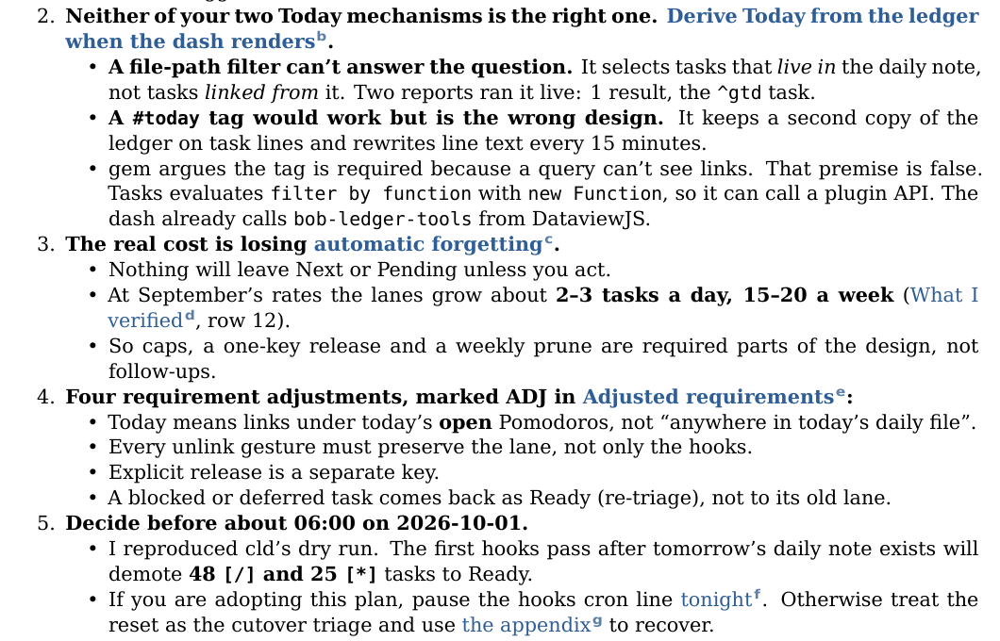
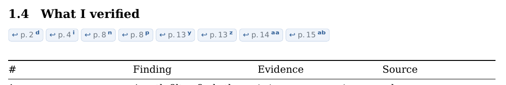

# Return links for `bob ref create` Markdown PDFs

> **Research query:** How should `bob ref create` add backlinks to the PDFs it renders
> from Markdown, so a reader can follow a local link to another part of the document and
> jump back to where they were, using the proposed approach of tagging each rendered local
> link with a unique alphanumeric ID and placing a link with that same ID at the target
> that points back to the original link? Is this plan a good idea, would a different
> approach be better, which requirement adjustments are justified, and what intuitive,
> reliable, and beautiful solution is recommended?

## Bottom line

1. **Build it. Your core idea is right.** Every in-document jump gets a visible ID, and
   the destination gets a matching link back. All [five reports](#scope-and-inputs)
   agree, and the evidence supports it. Your main research reports typically carry 20–33
   local links each. Every link that resolves points at a heading, and up to 8 links
   point at the same heading. Highlights for Mac has a Back command, but a link built
   into the PDF works on iPad, on paper, and in any viewer.
2. **Change the mechanics. These adjustments are called out in
   [Explicit requirement adjustments](#explicit-requirement-adjustments).**
   - Keep the author's link words, and put a small raised **letter tag** beside them.
     The tag sits inside the clickable area, not spliced into the text.
   - Use sequential letters, not random alphanumerics.
   - Draw tags with Unicode modifier letters (ᵃ ᵇ ᶜ…). Highlights' text extraction cannot
     be told to hide them ([I tested this](#what-i-added-beyond-the-five-reports)), but
     these code points can be stripped reliably later.
   - Group every return link for a target into one
     **[row of pills](#visual-specification)** directly under the heading. Each pill
     reads `↩ p. 12ᵈ`: the page you came from, plus your tag.
3. **Treat reliability as part of the feature.**
   - Resolve link targets the way pandoc does, plus GitHub-style slugs. 3.1% of local
     links in your reports are dead today only because of the slug style, and nothing
     tells you.
   - Render a link that truly has no target as plain text, and print a warning.
   - Report the pairing counts when a render succeeds.
4. **It is proven end to end.** On a real 17-page, 27-link report, the merged prototype
   gave these results:
   - all 27 pills printed the same page they jump to;
   - all 85 internal links resolved, and the page count didn't change;
   - the filter added about 0.4 s.

   cld and cdx separately confirmed that bob's lopdf stamp step keeps every link and
   destination.
5. **Only your devices can settle a few things.** These are iPad tap comfort, where a
   return lands, whether links survive a Highlights save, and what exported highlights
   look like. [The device checks](#device-checks-on-your-mac-and-ipad) list five quick
   checks. Each has a fallback fix ready.

## Scope and inputs

Lead researcher's consolidated report · 2026-10-07 · Scope: the Markdown route of
`bob ref create` (pandoc → XeLaTeX → lopdf stamp → Highlights).

Inputs: five independent reports in this directory, [cdx](ref_create_pdf_return_links__cdx.md),
[cld](ref_create_pdf_return_links__cld.md), [grk](ref_create_pdf_return_links__grk.md),
[mus](ref_create_pdf_return_links__mus.md), and [gem](ref_create_pdf_return_links__gem.md),
plus my own experiments. The experiments were a corpus audit, a PDFKit probe on the
MacBook, an inspection of the Highlights app bundle, and an end-to-end prototype that
merges the reports' strongest choices. Prototype and probes:
[`ref_create_pdf_return_links__final_assets/`](ref_create_pdf_return_links__final_assets/README.md).

## Critique of the plan

### Is this a good idea

Yes. Reading a research report means following "see What I verified" and then needing
to resume the sentence. Static return links are the only way back that works on every
viewer, on iPad (where Back is unproven), and on paper. Your plan already gets the one
non-obvious point right: IDs belong to each **occurrence**, not each destination. The
PDF can't know which of three sources a reader came from, so a single "Back" link at the
destination can't be correct. All five reports converge on this, and Wikipedia's
footnote back-references (`^ a b c`) are the familiar precedent.

### What your plan gets wrong or leaves open

1. **Splicing the ID into the link text** changes the prose. It also pollutes Highlights
   exports: PDFKit extracts whatever is drawn, and nothing can hide it.
2. **Random alphanumerics** look like error codes and don't scan. Sequential letters in
   reading order do.
3. **"A new link at the target" per source** becomes a pile at fan-in 8 unless grouped.
   Anything placed *in* the heading text leaks into the TOC and the PDF bookmarks.
4. **It assumes every link resolves.** 3.3% of your links don't (16 of 489). A return
   path is only as reliable as its resolution, so that work belongs in this feature.
5. **"Search the markdown"** must mean walking pandoc's AST. A regex over the file would
   break on code, reference-style links, and slug rules. All reports agree on this.

### Would I take a different approach

No. I would keep your paired-ID design and change the details. Alternatives considered
across the reports:

| Alternative | Verdict |
| --- | --- |
| Rely on the viewer's Back button | **Complement only.** It exists on Mac Highlights (confirmed), but there's no evidence for iPad, and it does nothing on paper. |
| `/Named /GoBack` button (`\Acrobatmenu`) | **Reject as the mechanism.** It is not one of ISO 32000's four standard named actions, and readers that don't know it do nothing (grk). Highlights *might* map it to PDFView `goBack`; that's an experiment, not a contract. |
| Semantic breadcrumbs, e.g. `↩ Return to §1: Executive Summary` (gem) | **Reject.** The labels are long, wrap badly at fan-in 8, and need quoted link text to tell apart two links from one section. Page plus tag gives most of the orientation in a tenth of the width. gem didn't prototype it at real fan-in. |
| Page-only back-references, `backref` style ("cited on pp. 3, 7") | **Close second.** Least clutter, but ambiguous when two sources share a page, and the source gives no hint that a return exists. The page numbers survive inside the pills. |
| Margin notes (Tufte or Bible style) | **Reject for v1.** The 0.85 in margins are too narrow, and margin notes collide with tables and floats. |
| Per-page letters ("12b") or per-target letters (a, b, c) | **Rejected by experiment (cld).** Per-page letters need 4 XeLaTeX passes, pandoc runs at most 3, and the mismatch is silent. Per-target letters put "a" on nearly every link. |
| Move to an HTML/Chromium or Typst renderer | **Not now.** It's a migration of TOC, numbering, code, and listen cards. Chromium also lacks `target-counter()` for page labels. |

## What bob does today

Checked at bob-cli `65501f6`.

- `render_temp_pdf` (`src/native/highlights_ref/create.rs:2111`) runs pandoc with:
  - `--toc --toc-depth=3 --number-sections --pdf-engine=xelatex -V colorlinks=true`;
  - DejaVu fonts at 10 pt, with 0.85 in margins;
  - one Lua filter, `PANDOC_CODE_BREAK_FILTER` (`:50`: inline-code breaks and the listen
    card), written to scratch at `:849`;
  - the `PANDOC_HEADER_INCLUDES` preamble (`:39`: fvextra plus the listen-card colours
    `#3B6EA8` and `#EEF3FA`).
- The input is pandoc `markdown`, so heading ids follow pandoc's rules: leading digits
  are dropped, and duplicates get `-1`. They are not GitHub slugs.
- Forward local links already work. `[t](#id)` becomes `\hyperref[id]{t}`, which becomes
  a `/GoTo` to a named destination. Pandoc's default colours are Maroon for internal
  links and Blue for URLs.
- On success, pandoc's stderr is discarded (`:2163`), so warnings about undefined
  references never reach you. A link to a missing id renders as link-coloured text that
  does nothing.
- The lopdf stamp step (`stamp.rs`) keeps link annotations, named destinations, and
  outlines. cdx and cld both verified this through the installed `bob ref create`.
- With `--listen`, sase-listen narrates the staged render PDF itself. Anything printed in
  that PDF reaches the narration.
- Highlights' exported highlight text is cleaned only when a note is rendered
  (`beautify_annotation_text` in `text.rs`). Block ids use the raw text.

## What I added beyond the five reports

| Question | What I did | Result |
| --- | --- | --- |
| Can `/ActualText` hide tags from Highlights exports? grk said yes; cld cited reports that it can't. | Built a probe PDF with each tag style (`pdfkit_probe.md`) and extracted its text with **Apple PDFKit on the MacBook (macOS 26.5)**. | **No.** PDFKit ignores both `/ActualText` and `/Alt`. A tag "hidden" this way extracts as `What I verifieda`, which corrupts the word. An ASCII `R1` badge extracts as `verifiedR1`. A modifier-letter tag extracts as `verifiedᵈ`, a reserved code point that can be stripped exactly. Poppler (`pdftotext`) does honor ActualText, so a Linux-only test would have misled us. |
| Does Highlights use PDFKit, and does it have Back? | Ran `otool -L` and searched the strings of `Highlights.app` 2026.1.2 on the Mac. | It links Apple **PDFKit** and no other PDF engine. Its Go menu has **Back** and **Forward**, wired to PDFView's `goBack:`/`goForward:`. On the Mac, viewer history exists. There is still no evidence of Back on iPad (cld). |
| How do your real documents use local links? | Ran a pandoc AST audit (`corpus_audit.lua`) over every report in `202608`–`202610` that has a `](#` link. This swarm's own reports were excluded. | 39 reports and **489 local links**. **All 473 resolvable links point at headings.** 15 links (3.1%) are dead today only because they use GitHub slugs (`#7-ranked-recommendations` style for numbered headings). 1 is a real typo. **28% of the links sit in table cells.** No links appear in headings, and there are no hand-written TOC lists. Max fan-in is 8. |
| Should one-to-one targets skip the source tag (grk)? | Measured fan-in per target. | 51% of targets have exactly one inbound link, but those carry only **28% of links**. The other **72% of links** point at targets with 2 or more. Tagging only crowded targets would tag most links anyway and leave the rest inconsistent. **Tag every link.** |
| Can pandoc's own slug code resolve GitHub-style links? | Inside the filter, read each heading's text with `pandoc.read("# "..text, "gfm")`. | Yes. It fixed all 15 slug-style links (including the 4 in `bob_mac_capture_replacement__b.md`) without copying a slug algorithm into Rust or Lua. That answers cdx's objection to cld's hand-written slugger. |
| What did the merged design look like on a real document? | Rendered `retire_now_sticky_lanes_ledger_today.md` with bob's exact pandoc arguments plus the filter. Checked each pill's printed page against its resolved destination with mutool and pdftotext. | 27 pairs to 11 targets. 27 of 27 pills print the page they jump to. 85 internal links. 17 → 17 pages. 15.3 s → 15.7 s. |
| Layout bugs | Looked at the rasterized pages. | **(a)** A modifier glyph at pill size is too small; scaling it 1.3× fixes it. **(b)** A heading with pills stranded at a page bottom when a table followed. The cause is that `longtable` forces `\vfil\break` when its header plus first row won't fit; no penalty can stop that. A `\needspace{16\baselineskip}` before such headings fixed it. |
| Can the pill's tap area be enlarged in TeX? | Measured the link boxes, then tried a mid-document `dvipdfmx:config g` and an invisible strut rule. | Pill link boxes are only **25–35 × 8.8 pt**. Neither trick changed `/Rect`. If the iPad check finds them too small, grow the `/Rect` of `bob:ret:*` links in lopdf at stamp time. |
| Does a return landing keep the reader's horizontal position? | Read the GoTo destinations back with PDFKit. | cld's `/XYZ null y null` destination reads as "x unspecified" (FLT_MAX), so horizontal scroll and zoom are kept. A plain pandoc Span anchor records the link's own x (392 pt in the test), which can scroll a zoomed view sideways. |

## Disagreements I resolved

| Topic | Positions | Resolution and why |
| --- | --- | --- |
| Tag at the source | Always: cdx, cld, mus. Only when fan-in > 1: grk. Never: gem. | **Always.** 72% of links point at crowded targets anyway. A uniform tag also signals "you can come back from here" and marks your spot when you return. |
| Tag form | `R1` (cdx), modifier letters (cld), letters (grk), `↩1` (mus) | **Modifier letters.** PDFKit tested on the Mac: ASCII tags glue onto words (`verifiedR1`, `verifieda`) and can't be stripped safely. Digits read as footnote markers. `↩` on the *forward* link (mus) confuses the two directions. |
| Hiding tags from exports | `accsupp` ActualText (grk), strip in sync (cld) | **Strip in `bob ref sync`.** ActualText is ignored by PDFKit (tested on macOS 26.5). |
| Return label | page + tag (cld), `Return: R1 · R2` (cdx), bare `↩` / `↩ a` (grk), section titles (gem) | **`↩ p. N` + tag in a pill.** It orients you even if you never noticed your tag, still means something on paper, and stays narrow. |
| Placement | Row under the heading (cdx, cld, gem), right-aligned on the heading line (grk), end of section (mus) | **Under the heading.** grk's version replaces pandoc's Header with raw LaTeX (`\subsection[..]{..\hfill pills}`), which is fragile across levels and `.unnumbered` and wraps long titles. mus's makes you hunt for the way back after landing. |
| Cap on pills | 5 (mus), 4–5 (gem), 8 then `+n` (grk), none (cdx, cld) | **No cap; wrap.** Every occurrence keeps its return. The max observed fan-in of 8 fits on one row (see the image under [Bottom line](#bottom-line)). |
| Resolution | Exact only (cdx); exact, then GitHub slug, then lowercase text (cld) | **Exact, then percent-decoded, then a GitHub alias from pandoc's own `gfm` reader** (unique aliases only). No lowercase or "heading text" fuzzing (cdx's caution). This fixes 15 of 16 dead links in the corpus. |
| Dead links | Keep the dead link (cdx, grk, mus); plain text (cld) | **Plain text plus a warning.** Link-coloured text that does nothing is a broken promise. |
| Where the code lives | Merged into the existing filter (grk, mus, gem); separate filter (cdx, cld) | **Separate `return_links.lua`, run second.** Listen cards are already raw LaTeX by then, so they can't be decorated by accident, and `create.rs` (2.5k lines) doesn't grow. |
| Preamble and colour | No preamble changes and keep Maroon (mus, grk); macros and one ink (cld, cdx) | **Macros, and one link ink (`#2F5E96`).** Maroon links with blue tags clash (cld saw this). Set colours with `-V linkcolor/urlcolor`, because `\hypersetup` in header-includes runs before hyperref loads (cdx and cld both hit this). |
| Return landing | Span label (cdx, mus), raised `\hypertarget` (grk), raw `/XYZ null y null` (cld) | **cld's raw destination**, raised 1.6 lines so the source line isn't flush with the top edge. PDFKit reads its x as unspecified (verified). |
| Opt-out | None (cld, grk, mus), metadata key (cdx), CLI flag plus config (gem) | **The metadata key `bob-return-links: false` only.** The filter needs that switch anyway for a narration copy, and a CLI flag would need a short alias under bob's CLI rules for no demonstrated need. |
| Run a Mac "Back" test before building (grk's Phase 0) | | **Not a gate.** Mac Back exists (confirmed in the bundle), but it doesn't help iPad or paper. Keep it as a [device check](#device-checks-on-your-mac-and-ipad). |
| Legend near the TOC (cdx) | | **Skip.** You are the reader. One tap teaches the convention. |

## Explicit requirement adjustments

| # | Your requirement | Adjusted | Why |
| --- | --- | --- | --- |
| ADJ-1 | Unique alphanumeric ID | **Sequential letter tags in reading order**: `a…z` without `q`, `l`, `o`, then `aa, ab…`. A 27-link report ends at `ad`; 100 links ends at `dh`. | Scannable, short, and deterministic. `q` has no modifier glyph, `ˡ` reads as 1, and `ᵒ` reads as a degree sign. |
| ADJ-2 | ID added *to* the link text | **A raised tag right after the link text**, inside the link's clickable area, drawn with Unicode modifier letters (ᵃ ᵇ ᶜ…). Bold sans, 1.3× size, muted link blue. | The prose stays intact. PDFKit can't hide it, but sync can strip it exactly. |
| ADJ-3 | One back link per source at the target | **One row of pills per target**: each pill is `↩ p. N` plus the same tag, in reading order. They wrap and are never capped. | Handles fan-in 8 and gives page orientation. |
| ADJ-4 | Back link "at the target" | **Placement by kind**: a row under a heading; first line inside a Div; inline after a Span. The heading text, TOC, and bookmarks are untouched. | Headings feed the TOC and the outline. |
| ADJ-5 | "Any local links" | **Same-document `#id` links in prose, lists, table body cells, and footnotes.** Skipped (still working as plain forward links): links in headings, captions, and table header rows; hand-written TOC lists; listen cards. Pandoc's generated TOC isn't in the AST. | Moving arguments and repeated longtable headers would duplicate anchors. A TOC list would put pills on every heading. |
| ADJ-6 | Return to the original link | **Return to the passage**: a raised destination about 1.6 lines above the source line, with x and zoom left alone. It can't restore the exact previous viewport; that's the viewer's Back. | Honest promise. Static links can't know the prior view. |
| ADD-1 | — | **Resolve robustly**: pandoc id, then decoded id, then the GitHub alias from pandoc's `gfm` reader. Diagnose duplicate explicit ids. | 3.1% of real links are dead today only because of slug style. |
| ADD-2 | — | **Dead links become plain text**, and bob prints `warning: local link #x ("text") has no target`. | Today they fail silently. |
| ADD-3 | — | **One link ink** (`#2F5E96`) for internal links, URLs, tags, and pills. | Coherent palette, the same family as the listen card. |
| ADD-4 | — | **`bob ref sync` strips tags and pill text** from Highlights annotation text, but only for bob-rendered Markdown PDFs. | PDFKit ignores ActualText (tested). |
| ADD-5 | — | **Report on success**: `links: 27 paired (11 targets)`, plus warnings. | Makes the feature and its failures visible. |
| SCOPE | — | **Markdown route only.** Ingested PDFs, arXiv, and web clips have no AST and are out of scope. Existing PDFs aren't retrofitted; re-render to get the feature. | Other routes have nothing to walk. |
| DEFER | — | Targets on code blocks, tables, or figures; raw-HTML `<a id>` (it vanishes in LaTeX, cdx); Obsidian `^block` and `[[#heading]]` links; same-file `doc.md#x` normalization (none in the corpus). | Not used in your documents. Each needs its own placement test. |

## Recommended design

### What the reader experiences

1. On page 2 you read "…grows about 2–3 tasks a day (What I verifiedᵈ, row 12)". The
   phrase and its small bold ᵈ are one link, in the document's single link ink.
2. Tap it. You land on **1.4 What I verified**. Directly under the heading is a row of
   pills: `↩ p. 2ᵈ  ↩ p. 4ⁱ  ↩ p. 8ⁿ …`. One of them carries your ᵈ. Even if you didn't
   notice the tag, "p. 2" is where you were.
3. Tap `↩ p. 2ᵈ`. You land a line and a half above your sentence, at your current zoom
   and horizontal position, and the ᵈ marks your spot.
4. Before you click anything, the row also tells you this section is cited from pages
   2, 4, 8, 13, 14, and 15.

### Mechanics in a second-pass pandoc Lua filter

1. **Index**: collect every element id. Add GitHub aliases for headings by reading the
   heading text with pandoc's `gfm` reader, using GitHub's `-1`, `-2` duplicate
   numbering. Drop ambiguous aliases.
2. **Tag**: walk the blocks in reading order with context (heading, caption, table head,
   nav list, or prose). For each `#` link: resolve it. If it is dead, emit plain text and
   a dead record. If it is in a skip context, rewrite it to the canonical id but don't
   tag it. Otherwise, number it, prepend `\BobReturnAnchor{bob:ret:N}`, and append
   `\BobTag{<glyphs>}` inside the link. Freeze the registry before inserting any return
   links, so generated links never get tagged (cdx).
3. **Attach**: insert `\BobBacklinks{…}` after each target heading, at the top of a
   target Div, or inline after a target Span.
4. **Report** on stderr: `bob-return-links: summary paired=27 targets=11 untagged=0
   dead=0`, plus one `bob-return-links: dead #x "text"` line per dead link.
5. **Escape hatch**: if the metadata `bob-return-links` is `false`, return the document
   unchanged.
6. **Safety**: ids are written by Pandoc or by vetted macros with generated `bob:ret:N`
   names. Never put author text into a raw `\hypertarget` (cdx). Scan every id for the
   `bob:ret:` prefix and change the prefix on a collision.

A working version of all of this is
[`return_links.lua`](ref_create_pdf_return_links__final_assets/return_links.lua) (about
160 lines). The TeX side is
[`return_links.tex`](ref_create_pdf_return_links__final_assets/return_links.tex). They
build on cld's tested macros, with my fixes.

### Visual specification

- **Tag**: modifier-letter glyph, DejaVu Sans Bold at 1.3× the surrounding size, colour
  `#5C7FA8`, with a 0.04 em kern from the text.
- **Pill**: a TikZ rounded rectangle (2.4 pt radius), fill `#EEF3FA`, 0.4 pt rule
  `#C9D7EA`, sans `\footnotesize`. It contains `↩` in link ink, `p. N` in muted gray
  `#6E7781` (`\pageref*` of the source anchor), and the tag at 1.3×. The whole pill is
  the link. TikZ adds about 0.4 s (cld). If speed ever matters more than the rounded
  shape, `\colorbox` is the fallback.
- **Row**: left-aligned and ragged right, with 0.35 em between pills, allowed to wrap.
  It has `\nopagebreak` on both sides, then `\@afterheading`, so the first paragraph
  stays with it.
- **Page-break guard**: before a heading that has pills *and* is directly followed by a
  table, emit `\needspace{16\baselineskip}`. `longtable` forces a page break when its
  header and first row don't fit (`\LT@start` in `longtable.sty`). That strands a
  heading even in today's renders, and the pill row makes it more likely. This is a
  heuristic, so a fixture test covers it.

### Export and narration hygiene

- **Sync strip**: applies only to bob-rendered Markdown PDFs (a linguistics paper's `pʰ`
  must survive). When rendering annotation text, strip:
  1. runs of the 23 reserved modifier code points that directly follow a non-space
     character;
  2. pill fragments matching `↩\s*p\.\s*\d+\s*[reserved]+`.

  Do this inside `beautify_annotation_text`, threaded from its call sites in
  `sidecar_render.rs`. Like the existing cleanup it is render-only, so block ids stay
  stable.
- **The flag**: mark bob-rendered Markdown PDFs where Highlights is already known to
  preserve data, the page-1 marker. One catch: marker extras are copied into note
  frontmatter (`MARKER_EXTRA_ORDER`). Either accept a visible `render:` line or exclude
  that key from the copy. A custom PDF Info key is cheaper, but PDFKit may drop it when
  Highlights saves.
- **Narration**: run one `--listen` episode on a document with local links. If
  sase-listen reads the tags and pills aloud, render a separate narration copy with
  `-M bob-return-links=false`, at the cost of one extra render on listen runs only.

### CLI surface

- No new flags.
- On success, after `pages:`, print `links: 27 paired (11 targets)`.
- Print one `warning:` line per dead link.
- Optionally add `(4 via GitHub-style slugs)` to the summary, so you notice slug drift
  in your writers.

## Implementation plan

1. **New module** `src/native/highlights_ref/return_links.rs`:
   - `include_str!("return_links.lua")`;
   - the TeX macros;
   - a parser for the `bob-return-links:` stderr lines.
2. **`create.rs` / `render_temp_pdf`**:
   - write `return-links.lua` beside `filter.lua` and pass it as a second
     `--lua-filter`;
   - add `-V linkcolor=BobLinkInk -V urlcolor=BobLinkInk`;
   - append the macros to the header-includes;
   - on success, parse the filter's lines and print the summary and warnings.
3. **Tests**, written in the style of the existing pandoc filter tests around
   `create.rs:2330`:
   - **Filter → LaTeX:**
     - anchor, tag, and row emitted;
     - TOC list, heading link, caption link, and table-header link left untagged;
     - GitHub alias and `%20` resolution;
     - dead link becomes plain text plus a stderr record;
     - fan-in order;
     - Span and Div placement;
     - metadata opt-out;
     - a second pass adds nothing new.
   - **XeLaTeX integration**, skipped when xelatex is missing, like the listen-card test.
     Using lopdf:
     - every `bob:ret:*` destination resolves;
     - each pill's printed page equals its destination's page;
     - outline titles have no tags;
     - the stamp step keeps all of it.

     Extend the "only existing packages" test to cover `tikz` and `needspace`.
   - **Fixtures**: a heading near a page bottom followed by a table; fan-in 0, 1, 8, and
     21; a link that wraps across lines (two `/Rect`s for one logical link).
   - **Sync strip**:
     - `verifiedᵈ, row 12` → `verified, row 12`;
     - a pill fragment is dropped;
     - `pʰ` is kept when the flag is off.
4. **Docs**:
   - a "Local links and return pills" section in `docs/highlights-create.md`, covering
     the support matrix, dead-link warnings, the opt-out key, and the advice to prefer
     explicit `{#id}`s on headings you link to often;
   - the cleanup list in `docs/highlights-ref-sync.md`;
   - one line in `create`'s long help.
5. **Phasing**:
   - **P1** is the filter, macros, colour, resolution, warnings, tests, and docs.
   - **P2** is the sync strip and its flag. Ship it with P1, or right after and before
     you annotate many new PDFs.
   - **P3** is the device checks, plus the
     [conditional fixes below](#device-checks-on-your-mac-and-ipad) only where a check
     fails.

## Device checks on your Mac and iPad

These take about 15 minutes.

1. **iPad Highlights**:
   - Tap a tagged link, then your pill. Do both land as
     [What the reader experiences](#what-the-reader-experiences) describes?
   - Is an 8.8 pt-tall pill comfortable to tap at page-width zoom?
   - *If not:* in `stamp.rs`, grow the `/Rect` of links whose destination starts with
     `bob:ret:`, by about 4 pt vertically and 1.4 pt horizontally (the gap between
     pills limits this).
2. **Mac Highlights**: the same checks, plus Go ▸ Back after a forward tap. Does it
   restore the view? This is informational only.
3. **Annotate, save, reopen**, then tap a pill. *If* named destinations broke, convert
   GoTo actions to explicit destinations at stamp time. The TOC links would show the
   same breakage, so this is unlikely.
4. **Highlight a sentence containing a tag**, and highlight a pill row. Run
   `bob ref sync`. Is the exported text clean?
5. **One `--listen` episode** on a document with local links (see
   [Export and narration hygiene](#export-and-narration-hygiene)).

## Risks and open questions

| Risk | Likelihood | Mitigation |
| --- | --- | --- |
| Pills too small to tap on iPad | Medium (8.8 pt measured) | [Device check 1](#device-checks-on-your-mac-and-ipad); grow `/Rect` in lopdf |
| Sase-listen narrates tags and pills | Medium | Device check 5; render a narration copy |
| Heading stranded before a tall table | Low (the guard fixed the real case) | `needspace` guard plus a fixture; baseline LaTeX has the same weakness |
| Strip rule eats real modifier letters | Low (scoped by flag) | Flag scoping and unit tests |
| Highlights save rewrites destinations | Low | Device check 3; explicit destinations |
| GitHub alias collides with a real pandoc id | Very low | Real ids win; ambiguous aliases are dropped and warned |
| Untagged PDF is not screen-reader accessible | Already true today | Out of scope (cdx). Link text stays meaningful. |

Open question for you: should web-article captures (Chromium renderer) get the same
treatment for their footnote back-references? That would be a separate design; cld
raised it.

## Recommended solution

In the Markdown route of `bob ref create`, add a
[second pandoc Lua filter](#mechanics-in-a-second-pass-pandoc-lua-filter),
`return_links.lua`, plus a small TeX macro set. Together they pair every resolvable
same-document link with a return path:

1. **Resolve** each `#target` in this order: the pandoc id, the percent-decoded id, then
   a GitHub-style alias computed by pandoc's own `gfm` reader. Render dead links as
   plain text, and have bob print a warning for each.
2. **Tag** every eligible link occurrence in reading order with a sequential letter
   (`a…z` without q, l, o, then `aa…`). Draw it as a bold, 1.3× Unicode modifier letter
   right after the link text, inside the link. Skip links in headings, captions, table
   headers, hand-written TOC lists, and listen cards.
3. **Anchor** each source with a raised `/XYZ null y null` named destination
   (`bob:ret:N`) and a `\label` for its page.
4. **Return**: give each target one row of [rounded pills](#visual-specification), each
   `↩ p. N` plus the tag, in reading order and never capped. The row sits under a
   heading, at the top of a Div, or inline after a Span. Headings, the TOC, and
   bookmarks stay untouched.
5. **Protect the layout**: `\@afterheading` after the row, and a `needspace` guard
   before pill-bearing headings that are followed by tables.
6. **Unify** the ink: one link colour, `#2F5E96`, for links, URLs, tags, and pills.
7. **Report** `links: N paired (M targets)` and warnings on success, instead of
   discarding stderr.
8. **Keep exports clean**: `bob ref sync` strips tag glyphs and pill text from
   Highlights annotations for bob-rendered Markdown PDFs, flagged through the page-1
   marker (see [Export and narration hygiene](#export-and-narration-hygiene)).
9. **Verify on devices** ([Device checks](#device-checks-on-your-mac-and-ipad)), and
   apply the conditional fixes (tap area, narration copy, explicit destinations) only if
   a check fails.

This keeps the heart of your idea: one occurrence, one visible ID, and the same ID at
the destination. It changes how the ID is drawn and where it sits, so that it stays
quiet in the prose, readable at the destination, robust for the documents you actually
write, and clean in what flows back into the vault.

## Sources

- bob-cli `65501f6`: `src/native/highlights_ref/create.rs` (`render_temp_pdf`, the
  filter, and the preamble), `stamp.rs`, `text.rs`, `sidecar_render.rs`,
  `docs/highlights-create.md`.
- Experiments on athena: Pandoc 3.1.11.1, XeTeX from TeX Live 2025/dev, mutool, Poppler,
  and `longtable.sty` (`\LT@start`).
- MacBook probes: macOS 26.5 PDFKit text extraction and GoTo destinations; the
  Highlights 2026.1.2 bundle (`otool -L` and the Go-menu strings).
- [Pandoc manual: heading identifiers and `gfm_auto_identifiers`](https://pandoc.org/MANUAL.html#extension-auto_identifiers);
  [Pandoc Lua filters](https://pandoc.org/lua-filters.html).
- [hyperref manual](https://tug.ctan.org/macros/latex2e/contrib/hyperref/doc/hyperref-doc.html)
  (`backref`, Acrobat-specific `GoBack`). ISO 32000-1 §12.6.4.11 lists only four
  standard named actions (via grk).
- [Highlights changelog](https://highlightsapp.net/changelog/) and
  [Mac changelog](https://highlightsapp.net/changelog/mac/) (Back/Forward since 1.5);
  [iPad open-and-read guide](https://highlightsapp.net/how-to/ipad/open-and-read-pdf/).
- [Apple PDFKit `PDFView.goBack(_:)`](https://developer.apple.com/documentation/pdfkit/pdfview/goback(_:)).
- zathura #189, where Apple's PDF library lacks ActualText (now confirmed directly).
- [Wikipedia Help:Footnotes](https://en.wikipedia.org/wiki/Help:Footnotes) (the `^ a b c`
  back-reference precedent); [W3C PDF11](https://www.w3.org/WAI/WCAG22/Techniques/pdf/PDF11).
