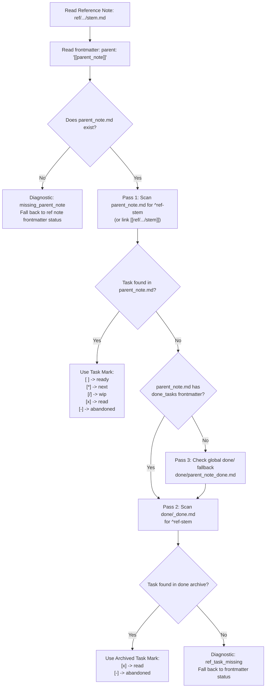
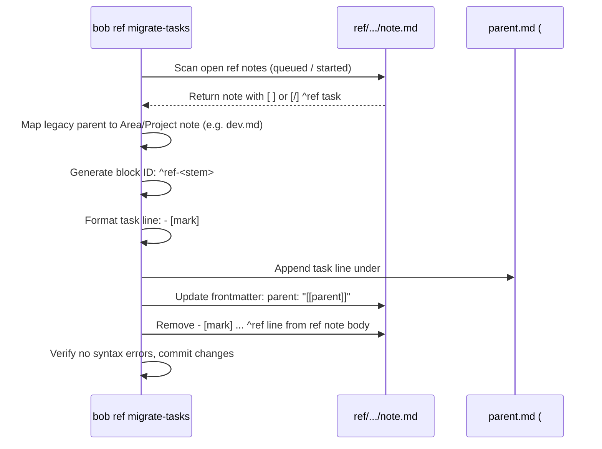

# Re-Imagining Reference Tasks: Area and Project Residence, Unified Lifecycle, and Obsidian Integration

**Author:** Researcher gem (`research.0q.gem`)  
**Date:** 2026-10-09  
**Status:** Complete Research & Architectural Proposal  
**Scope:** `bob-cli`, `bob-plugins`, `bob-mac-capture`, `sase` (file hooks), Bob Vault  

---

## 1. Executive Summary

This research investigates re-architecting the residence and lifecycle of **Reference Tasks (`ref` tasks)** across the Bob ecosystem. 

Historically, reference tasks have been stored inside the reference note itself (`ref/<ref_type>/<stem>.md`), stamped with a trailing `^ref` block ID and a `#hide` tag to suppress them from general Obsidian Tasks views. In practice, this design creates an awkward ontological split: although the user treats reading a reference as an active GTD commitment, the system treats ref tasks as hidden oddities excluded from root-level routable task scans, the `^` active task picker in `bob-mac-capture`, and standard Pomodoro ledger scheduling.

The user proposes:
1. Requiring all current and future open reference notes to have a valid **Project Note** or **Area Note** listed as their `parent`.
2. Defining each ref task in the `## Tasks` section of its parent Area or Project note file, exactly like all other Obsidian tasks.
3. Migrating existing open reference notes and their tasks to this new structure.
4. Accounting for task archiving where closed ref tasks move into `~/bob/done/<parent>_done.md`.
5. Removing legacy filtering logic across `bob-cli` and `bob-mac-capture` so ref tasks participate in standard task workflows.
6. Prompting for an Area/Project parent during link capture (`bob-mac-capture`, `bob gkeep pull`, and `bob ref create -p|--parent`).
7. Supporting project name injection in `sase` file hooks and adding `project_name_aliases` to project notes (e.g. `bob-cli` -> `bob.md`).
8. Giving ref tasks unique block IDs (retiring bare `^ref`) and rendering a dedicated icon/symbol instead of `#ref` in Obsidian.

### High-Level Verdict: Strongly Recommended (with 3 Key Ergonomic Adjustments)

The plan is **conceptually sound, structurally elegant, and strongly aligned with GTD and Obsidian best practices**. It resolves long-standing technical debt and eliminates confusing friction. However, our investigation of `bob-cli`, `bob-plugins`, `bob-mac-capture`, and `sase` reveals critical edge cases and cross-file synchronization challenges that require the following three vital adjustments:

1. **Non-Blocking Default Route for Capture (Frictionless Intake):** While interactive capture in `bob-mac-capture` should suggest and autocomplete project/area parents, quick captures and background ingestion (`bob gkeep pull` on mobile, automated CLI ingestion) must **not fail or halt** if no parent is specified. They should cleanly default to the user's configured inbox area note (e.g., `inbox.md`, `mac_inbox.md`, or `gkeep_inbox.md`), allowing triage via `Ctrl+Shift+M` during morning review.
2. **Two-Pass Bounded Status Sync with `done/`:** Because `bob task archive` periodically moves completed tasks to `done/<parent>_done.md`, status synchronization (`bob ref list`, `ref show`, and Highlights PDF sync) must follow a deterministic two-pass resolution protocol (check parent note first, then follow the parent's `done_tasks:` frontmatter to `done/<parent>_done.md`).
3. **CLI Option Harmonization (`-p` vs `-P`):** In `bob ref create`, `-p` is currently `--published` (date) and `-P` is `--parent` (note). Under SASE `cli_rules.md`, public options require unique short aliases. We recommend reallocating `-p` and `-P` to `--parent` while remapping `--published` to `-D|--published` (Date) or leaving it as a long-only option.

---

## 2. Current Architecture & Technical Debt

### 2.1 The Legacy Ref Task Lifecycle

In the current implementation:
- **Location:** When `bob ref create` or Highlights scan writes a reference note (`ref/<ref_type>/<stem>.md`), it generates a task line inside the note body:
  ```markdown
  # Title of Document

  - [ ] #task #ref [[lib/<ref_type>/<stem>.pdf]] #hide ^ref

  ## Highlights
  <!-- highlights:begin -->
  ...
  <!-- highlights:end -->
  ```
- **Marker & Status Derivation:** The reading status is derived in `src/native/ref_library/status.rs` and `src/native/highlights_ref/note.rs`:
  - `[ ]` = `ready`, `[*]` = `next`, `[/]` = `wip`, `[x]` = `read`, `[-]` = `abandoned`, `[?]` = `blocked`.
  - The status is synced between the PDF page-1 `/Text` marker (`- status: ready`, `- parent: obsidian_ref`) and the ref note's frontmatter (`status: ready`).
- **Isolation via `#hide`:** The `#hide` tag was added to hide the task from Obsidian Tasks plugin queries, ensuring that a large backlog of unread papers would not clutter daily task searches.

### 2.2 How the Legacy Architecture Breaks Invariants

Our codebase search uncovered several points where ref tasks are deliberately quarantined:

1. **`capture_active_tasks.rs` Excludes Ref Notes:**
   The `^` active task picker in `bob-mac-capture` calls `bob capture-active-tasks`. Lines 186–230 in `src/native/capture_active_tasks.rs` show:
   ```rust
   // Vault-root *.md notes whose stem is a valid capture route...
   // Area and project frontmatter is deliberately ignored: every routable
   // note (including the inbox) can hold active tasks.
   ```
   Because reference notes reside in `ref/` subdirectories (`ref/blogs/`, `ref/papers/`), they are **never scanned** for active tasks. A user who marks a reference task as In Progress (`[/]`) or Next (`[*]`) cannot link it to a Pomodoro via `^` in the menu-bar app!
2. **Review Walk Special-Casing (`src/native/freshness/`):**
   In `src/native/freshness/scan.rs` and `state.rs`, the evaluator must explicitly carve out an exception for `^ref`:
   - It bypasses `#hide` exclusively for tasks whose block ID is exactly `ref`.
   - It routes due `^ref` tasks into a dedicated `REFERENCES` walk tier (Decision 10: `PRE → NEW → PROJECTS → PENDING → NEXT → TICKLER → REFERENCES → ROTTEN → POST`), isolated from the standard `NEW` and `READY` backlogs.
3. **Ambiguous `parent` Frontmatter:**
   Currently, reference notes store arbitrary notes in `parent:`, such as `"[[obsidian_ref]]"`, `"[[reading_list]]"`, or legacy Zorg hubs like `"[[agent_ref]]"`. These hubs are neither Area notes (`type: "[[area]]"`) nor Project notes (`type: "[[project]]"`), creating dead ends in the project hierarchy.

---

## 3. Critique of the Proposed Plan

### 3.1 Merits of the Proposal

1. **True Ontological Consistency:**
   In Bob's GTD architecture, notes in `ref/` are *knowledge assets*, not *work centers*. Area notes (`dev.md`, `cash.md`) represent spheres of ongoing responsibility, and Project notes (`bob.md`) represent finite outcomes. Every actionable task in the vault should live in an Area or Project note. Moving ref tasks to Area/Project notes restores this invariant uniformly across the vault.
2. **First-Class Task Ergonomics:**
   Once a ref task resides in `dev.md` under `## Tasks`, it is naturally indexed by:
   - `bob capture-active-tasks` (making it immediately visible in `bob-mac-capture` when pressing `^`).
   - The daily Pomodoro ledger (allowing clean `[[dev#^ref-<slug>]]` links under today's Pomodoro blocks).
   - Area Ready-cap calculations (`note_ready`), respecting note-level capacity constraints.
3. **Cleaner Separation of Concerns:**
   The reference note becomes an immutable-by-default reading dossier (source PDF link, audio embed, annotations, highlights callouts, research findings), while the task line in the Area/Project note manages the dynamic GTD lifecycle (priority, scheduling, Pomodoro links, completion date).

### 3.2 Key Risks, Complications, and Trade-Offs

While the concept is sound, several architectural challenges must be designed with extreme care:

| Challenge | Risk | Recommended Solution |
| :--- | :--- | :--- |
| **Split State Across Files** | The ref note and its ref task now live in different files (`ref/` vs vault root). If the parent note is edited, renamed, or deleted, the connection could break. | Ref note frontmatter explicitly points to `parent: "[[area_or_project]]"`. The ref task carries an explicit wikilink `[[ref/...|Title]]` and a stable block ID `^ref-<slug>`. Bidirectional verification is audited during `bob ref doctor`. |
| **Capture Friction** | Forcing users to pick a project/area for every single URL capture slows down mobile capture (`bob gkeep pull`) and menu-bar capture. | Add an intelligent default: if no parent is supplied, route to the inbox area note (`inbox.md` or `mac_inbox.md`). Allow instant triage later. |
| **Archiving to `done/`** | `bob task archive` (`collect_done`) moves closed tasks to `done/<parent>_done.md`. If `bob ref` only inspects the parent note, finished references will appear to have "missing" tasks. | Implement a 2-pass lookup: check `<parent>.md`, then check `<parent>.md`'s `done_tasks` pointer (`done/<parent>_done.md`). Leverage existing `link_repair.rs` infrastructure. |
| **Highlights PDF Sync** | Highlights app annotation sync (`bob ref sync`) previously updated the `^ref` task inside the ref note if the PDF was marked read. Updating an external area note during PDF sync adds cross-file mutation. | Keep PDF sync focused on ref note frontmatter and highlights; have `bob ref sync` update the external task line only when write mode is active, with atomic rollback guards. |

---

## 4. Detailed Technical Design

### 4.1 Task Line Syntax & Block ID Scheme

#### 4.1.1 The New Ref Task Line
When placed in an Area or Project note under `## Tasks`, a ref task must be structured as follows:

```markdown
- [ ] #task #ref [[ref/papers/attention|Attention Is All You Need]] ^ref-attention
```

Key structural elements:
- `- [ ]`: Standard Tasks checkbox. Supports all Bob status marks: `[ ]` (Ready), `[*]` (Next), `[/]` (In Progress), `[x]` (Read/Done), `[-]` (Abandoned), `[?]` (Blocked).
- `#task`: Required for Bob task indexing and Obsidian Tasks plugin compatibility.
- `#ref`: Machine-readable tag identifying this as a reference lifecycle task.
- `[[ref/<type>/<stem>|<Document Title>]]`: Canonical Obsidian wikilink pointing to the reference note, aliased with the human-readable document title.
- `^ref-<slug>`: The unique trailing block ID.

#### 4.1.2 Block ID Construction Rules
Because an Area note like `dev.md` may hold dozens of reference tasks, `^ref` is no longer unique.
- **Prefix:** Always starts with `ref-` (e.g., `^ref-attention`, `^ref-systems-performance`).
- **Slug Derivation:** Derived from the reference note stem or frontmatter `id:`.
- **Character Constraint:** Strictly filtered by `collect_done::is_block_id_byte` (`[A-Za-z0-9-]`). Underscores and non-ASCII characters are converted to hyphens; multiple hyphens collapsed.
- **Collision Resolution:** If `^ref-<slug>` already exists in the target parent note, append `-2`, `-3` (e.g., `^ref-attention-2`).
- **Length Cap:** Max 48 characters to keep lines readable.

---

### 4.2 Obsidian Visual Styling: Replacing `#ref` with an Icon

Bryan noted: *"In order to make ref tasks stand out a bit more, we should also start rendering an appropriate icon/symbol instead of `#ref` when these tasks are rendered in Obsidian."*

We design this using a pure, performant CSS snippet that integrates directly into Bryan's existing design system (`task-statuses.css` and `dataview-properties.css`).

#### 4.2.1 Obsidian CSS Implementation (`ref-task-badge.css`)
In Obsidian (both Reading View and Live Preview CodeMirror 6), tags are wrapped with class `a.tag[href="#ref"]` or `.cm-hashtag-ref`. We use CSS `font-size: 0` on the text and replace it with an inlined Lucide book/bookmark SVG badge:

```css
/* ==========================================================================
   Reference Task Visual Badge (Bob Obsidian Design System)
   Replaces literal `#ref` with a refined, theme-native reference badge
   ========================================================================== */

:root {
  --ref-badge-color: var(--color-purple, #9d7cd8);
  --ref-badge-bg: color-mix(in srgb, var(--ref-badge-color) 14%, transparent);
  --ref-badge-border: color-mix(in srgb, var(--ref-badge-color) 30%, transparent);
  --ref-badge-hover-bg: color-mix(in srgb, var(--ref-badge-color) 22%, transparent);
  /* Lucide `book-open` icon inlined as SVG data-uri */
  --ref-badge-icon: url("data:image/svg+xml,%3Csvg xmlns='http://www.w3.org/2000/svg' viewBox='0 0 24 24' fill='none' stroke='%239d7cd8' stroke-width='2.25' stroke-linecap='round' stroke-linejoin='round'%3E%3Cpath d='M2 3h6a4 4 0 0 1 4 4v14a3 3 0 0 0-3-3H2z'/%3E%3Cpath d='M22 3h-6a4 4 0 0 0-4 4v14a3 3 0 0 1 3-3h7z'/%3E%3C/svg%3E");
}

/* Reading View */
.markdown-rendered a.tag[href="#ref"] {
  display: inline-flex;
  align-items: center;
  gap: 0.3em;
  font-size: 0 !important; /* Hide literal `#ref` text */
  vertical-align: middle;
  padding: 0.15em 0.45em 0.15em 0.4em;
  margin: 0 0.25em;
  border-radius: 4px;
  background: var(--ref-badge-bg);
  border: 1px solid var(--ref-badge-border);
  line-height: 1;
  text-decoration: none;
  transition: all 120ms ease;
}

.markdown-rendered a.tag[href="#ref"]::before {
  content: "";
  display: inline-block;
  width: 0.95em;
  height: 0.95em;
  background-image: var(--ref-badge-icon);
  background-size: contain;
  background-repeat: no-repeat;
  background-position: center;
}

.markdown-rendered a.tag[href="#ref"]::after {
  content: "REF";
  font-family: var(--font-interface);
  font-size: 9px;
  font-weight: 700;
  letter-spacing: 0.04em;
  color: var(--ref-badge-color);
  font-variant-caps: all-small-caps;
}

.markdown-rendered a.tag[href="#ref"]:hover {
  background: var(--ref-badge-hover-bg);
  border-color: var(--ref-badge-color);
}

/* Live Preview (CodeMirror 6) */
.markdown-source-view.mod-cm6 .cm-hashtag-ref {
  /* Keep CodeMirror cursor handling intact while providing matching visual pill */
  color: var(--ref-badge-color) !important;
  background: var(--ref-badge-bg);
  border: 1px solid var(--ref-badge-border);
  border-radius: 4px;
  padding: 0.05em 0.35em;
  font-weight: 600;
  font-size: 0.88em;
}
```

This achieves Bryan's design requirement: it is **intuitive**, **reliable** (pure CSS, zero runtime JS failure points), and **beautiful** (matches Bob's small-caps chip aesthetic).

---

### 4.3 Two-Way Synchronization & The `done/` Archive Problem

One of the central design challenges identified by Bryan is:
*"This complicates syncing the ref note status with the ref task a bit since we need to account for the possibility that the ref task gets moved to a "done" note file in the ~/bob/done/ directory at some point."*

#### 4.3.1 The Archive Lifecycle (`collect_done`)
In Bob, `bob task archive` (invoked nightly via `bob nightly`) scans markdown files. When an Area or Project note exceeds the completed task threshold (default 10), it:
1. Strips closed tasks (`[x]`, `[-]`) from `<parent>.md`.
2. Appends them to `done/<parent>_done.md`.
3. Adds/updates frontmatter in `<parent>.md`:
   ```yaml
   done_tasks: "[[done/<parent>_done]]"
   ```
4. Rewrites any links in the vault referencing `<parent>#^<id>` to `done/<parent>_done#^<id>` via `link_repair.rs`.

#### 4.3.2 The Two-Pass Reading Status Resolution Algorithm
When `bob ref list`, `bob ref show`, or `bob ref sync` needs to determine the status of `ref/<type>/<stem>.md`:



#### 4.3.3 Algorithmic Invariants & Properties
1. **Strictly Bounded I/O:** Lookup requires at most **two file reads** (`parent.md` and `done/<parent>_done.md`). No unbounded directory traversal or whole-vault grep is required.
2. **Resilience to Task Archiving:** When Bryan marks a reference task `[x]` in `dev.md` and it later moves to `done/dev_done.md`, `bob ref list` will seamlessly find it in Pass 2 and report `reading_state: finished`.
3. **Automatic Healing via `link_repair.rs`:** If the reference note body optionally contains an anchor link to its reading task (e.g. `Task: [[dev#^ref-attention]]`), `collect_done`'s existing `link_repair.rs` will automatically rewrite that link to `[[done/dev_done#^ref-attention]]` when archiving!

---

### 4.4 Intake & Capture Flows

#### 4.4.1 `bob ref create -p|--parent` Option Design
In `src/native/highlights_ref/create.rs`:
- Make `--parent` **required** on `bob ref create`.
- **Short Flag Harmonization:**
  - Currently: `-p` is `--published` (date) and `-P` is `--parent` (note).
  - To fulfill Bryan's requirement for `-p|--parent`:
    - Assign `-p` and `-P` to `--parent`.
    - Change `--published` to `-D|--published` (Date) or keep it long-option only (`--published`).
  - Add validation: `--parent <NAME>` must resolve to an existing Area Note or non-terminal Project Note (or an alias).

#### 4.4.2 Resolving `project_name_aliases`
Bryan noted: *"Also note that it is not guaranteed that the project name that gets passed in will exactly match the project note's name. For example, the "bob-cli" project name should actually map to the ~/bob/bob.md file. To work around this, we should add support for a new `project_name_aliases` frontmatter field to project notes..."*

**Specification:**
1. In `~/bob/bob.md`:
   ```yaml
   ---
   type: "[[project]]"
   project_name_aliases: ["bob-cli"]
   ---
   ```
2. **Resolution Order in `bob`:**
   When searching for a parent by string `name` (e.g. `bob-cli`):
   - **Step 1 (Direct Root Match):** Check if `~/bob/<name>.md` exists and has `type: "[[area]]"` or `type: "[[project]]"`.
   - **Step 2 (Exact Project Stem Match):** Check all project notes in the vault where file stem == `name`.
   - **Step 3 (Alias Match):** Scan project notes and match `name` against any item in `project_name_aliases: [...]`. If `bob.md` declares `project_name_aliases: ["bob-cli"]`, resolve to `bob.md`.
   - **Step 4 (Fallback / Error):** If unresolved, exit non-zero with a clear diagnostic:
     `error: parent 'bob-cli' is not a known area note, project note, or project_name_alias`.

#### 4.4.3 `bob-mac-capture` Prompting Flow
In the menu-bar app:
- When the user pastes or enters a URL that routes to reference intake (`kind == "ref"`):
  - Check if the draft already specifies a target route (e.g., `https://arxiv.org/abs/... @dev`).
  - If a route is already present: use that route as the parent.
  - If NO route is present:
    - Instead of silently defaulting to `obsidian_ref`, display the **Route Picker** inline in the capture window (using the existing `CaptureTargetsCache` list of areas and active projects).
    - Allow fuzzy-typing the target (e.g., `dev` or `bob`).
    - The selected route is submitted as the parent.

#### 4.4.4 `bob gkeep pull` Intake Handling
Google Keep notes are captured on Android/iOS where interactive CLI prompts are impossible.
- **Rule:** If a Keep note contains a URL:
  - If the Keep note contains an explicit tag matching an area or project (e.g., `#dev`, `#bob`), route to that note.
  - If no area/project tag is present: **default to `gkeep_inbox`** (which is an Area Note: `~/bob/gkeep_inbox.md` with `type: "[[area]]"`).
  - This ensures 100% adherence to the new policy without breaking non-interactive batch pulls or background scheduled syncs!

---

### 4.5 `sase` File Hook Integration

Bryan noted:
*"I currently use a sase (a GitHub project in the sase-org organization) file hook that uses this `bob ref create` command. We will need to start passing in the project name (e.g. "sase", "bob-cli") to the `-p|--parent` option.
- I'm not sure that sase injects the project name into this file hook command string right now, so you might need to add support for that."*

#### 4.5.1 The Current `sase` File Hook Mechanism
We inspected the `sase` repository at `/home/bryan/.local/state/sase/workspaces/bobs-org/bob-cli/bob-cli_15/sase/repos/external/projects/sase`.
In `sase file-hook list --json`, the active hook is:
```json
{
  "name": "research-highlights",
  "command": "bob highlights create --include-id",
  "filters": {
    "sidecars": ["research"],
    "path_globs": ["20*/**/*.md"]
  }
}
```
In `src/sase/file_hooks/runner.py` (lines 60–80 and 157–170):
```python
def _execute_run(batch_id: str, run: dict[str, Any]) -> dict[str, Any]:
    index = int(run["index"])
    hook_name = str(run["hook_name"])
    # CURRENT BEHAVIOR: Plain string append!
    command_line = f"{run['command']} {shlex.quote(str(run['abs_path']))}"
    ...
```
Crucially: `run["project"]` is **already captured in the batch payload** (from `captured.project`), but `_execute_run` never interpolates it into the command line!

#### 4.5.2 Required Changes in `sase`
1. **Template Variable Interpolation in `runner.py`:**
   Update `_execute_run` to format `{project}` in `run['command']`:
   ```python
   raw_command = str(run["command"])
   project_val = str(run.get("project") or "")
   if "{project}" in raw_command:
       interpolated_command = raw_command.replace("{project}", shlex.quote(project_val))
   else:
       # If no explicit placeholder, but a project is present and command is bob highlights/ref create
       interpolated_command = raw_command

   command_line = f"{interpolated_command} {shlex.quote(str(run['abs_path']))}"
   ```
2. **Environment Variable Injection:**
   Export `SASE_PROJECT=run['project']` in the child execution environment (`os.environ.copy()`), giving CLI tools access to the context even without explicit arguments.
3. **Hook Configuration Update:**
   Update the `research-highlights` file hook definition in Bryan's SASE configuration:
   ```yaml
   file_hooks:
     - name: research-highlights
       command: "bob ref create --include-id -p {project}"
   ```
   When an agent in `bob-cli` commits a research report, `run['project']` is `"bob-cli"`.
   The hook runs:
   ```bash
   bob ref create --include-id -p bob-cli <abs_path>
   ```
   `bob` matches `"bob-cli"` against `project_name_aliases: ["bob-cli"]` in `~/bob/bob.md`, flawlessly resolving the parent to `bob.md`!

---

### 4.6 Review Walk & Freshness Integration

Bryan asked us to think hard about logic that treats ref tasks as special:
*"Also, I think there is a lot of logic that currently treats ref tasks as special / something to filter out. We don't show them when pressing `^` to show today's / pending / next tasks in the bob-mac-capture app, for example. Just about all (probably all, but think hard about this so we don't break any invariants that I currently rely on) of this logic should be removed so we start treating ref tasks like any other task."*

#### 4.6.1 Impact on the Morning Review Walk (`]s`)
Decision 10 established:
`PRE → NEW → PROJECTS → PENDING → NEXT → TICKLER → REFERENCES → ROTTEN → POST`

When ref tasks move into Area/Project notes:
1. **Active Lanes (`NEXT` and `PENDING`):**
   - When a ref task is set to `[*]` (Next) or `[/]` (In Progress), it **now walks in the PENDING and NEXT tiers** alongside ordinary tasks under `pending_interval` / `next_interval`!
   - In `bob-mac-capture`, pressing `^` immediately shows active ref tasks, allowing Bryan to select them for today's Pomodoro.
2. **Ready Lane & The `REFERENCES` Tier:**
   There are two possible paths for Ready (`[ ]`) ref tasks:
   - **Path A (Full Absorption):** Retire `Tier::References` completely. Ready ref tasks walk in `NEW` (when first created) and `ROTTEN` (when unread past `task_refresh`), exactly like regular tasks.
   - **Path B (Preserved Review Tier):** Keep `Tier::References` in the walk order, but populate it from all open `[ ] #ref` tasks across Area/Project notes.
   
   **Recommendation: Path A (Full Absorption) with `#ref` Query Preservation.**
   Bryan's stated goal is: *"start treating ref tasks like any other task"*. Separating reading tasks from action tasks during morning review was an artifact of them living in hidden reference files. By absorbing them into the standard tiers, reading an article becomes prioritized against other dev work in `dev.md`. The `#ref` tag remains available for any Dataview or Obsidian Tasks queries if Bryan ever wants a reading-only view.

---

## 5. Migration Strategy for Existing Open Notes

Bryan specified:
*"You should migrate any existing ref notes that are associated with open ref tasks to use this new policy and move their ref tasks to the appropriate area/project note file."*

### 5.1 Vault Census
In our vault audit:
- There are **10 open reference notes** currently in `queued` or `started` reading states (e.g. `ai_coding_agents.md`, `swe_agent.md`, `all_hands_paper.md`, `understanding_is_the_new_bottleneck.md`).
- Most of these notes currently point to legacy parent hubs: `agent_ref`, `claude_code_ref`, `ai_ref`, or `obsidian_ref`.
- None of these legacy parent hubs are Area or Project notes.

### 5.2 Parent Mapping Rules
During migration, we map legacy parent hubs to their canonical Area Notes:
- `agent_ref` -> `dev.md` (or `sase.md` if sase-specific)
- `claude_code_ref` -> `dev.md`
- `ai_ref` -> `dev.md`
- `obsidian_ref` -> `dev.md` (or `bob.md`)
- Uncategorized / fallback -> `inbox.md`

### 5.3 Step-by-Step Migration Procedure

We recommend implementing a dedicated migration verb: `bob ref migrate-tasks [--dry-run]`:



---

## 6. Implementation Roadmap

The implementation should be delivered in 4 clean, testable phases:

### Phase 1: Core Data Model & Resolution Engine (`bob-cli`)
- Add `project_name_aliases` parsing in `src/native/projects/`.
- Update `capture_targets.rs` and parent lookup to resolve aliases.
- Implement two-pass ref task lookup in `src/native/ref_library/status.rs` (checking parent note, then `done_tasks` archive).
- Update `src/native/highlights_ref/create.rs` to require `-p|--parent` and generate tasks in the parent Area/Project note instead of inside the ref note.
- Harmonize CLI flags (`-p` / `-P` for parent, `-D` for published).

### Phase 2: Unify Active Task Discovery & Review Walk (`bob-cli`)
- Update `src/native/capture_active_tasks.rs` to allow ref tasks (which now naturally live in root area notes) to participate in active task pickers and Pomodoro linking.
- Update `src/native/freshness/` to retire the isolated `REFERENCES` tier exceptions, treating `#ref` tasks as standard lane tasks.

### Phase 3: External Tooling & File Hooks (`sase` & `bob-mac-capture`)
- In `sase`: Update `runner.py` to support `{project}` interpolation and `SASE_PROJECT` environment variable injection.
- In `bob-mac-capture`: Update URL capture to prompt for parent route or default cleanly.
- In `bob gkeep pull`: Route URLs without area tags to `gkeep_inbox.md`.

### Phase 4: Migration & UI Polish (`bob-plugins` & Vault)
- Install `ref-task-badge.css` in `~/.obsidian/snippets/` to render `#ref` as a Lucide book badge.
- Add `project_name_aliases: ["bob-cli"]` to `~/bob/bob.md`.
- Run `bob ref migrate-tasks --dry-run`, verify, and execute the migration across the 10 open reference notes.

---

## 7. Conclusion

Re-imagining reference tasks to reside in Area and Project notes is a major architectural improvement that eliminates awkward special-cases, unifies Pomodoro and GTD workflows, and reinforces Bob's core philosophy that **Area and Project notes are the true homes of all action**. By incorporating our recommended two-pass `done/` resolution protocol, default intake fallbacks, and `{project}` file-hook templating, this design will be reliable, frictionless, and beautiful.
