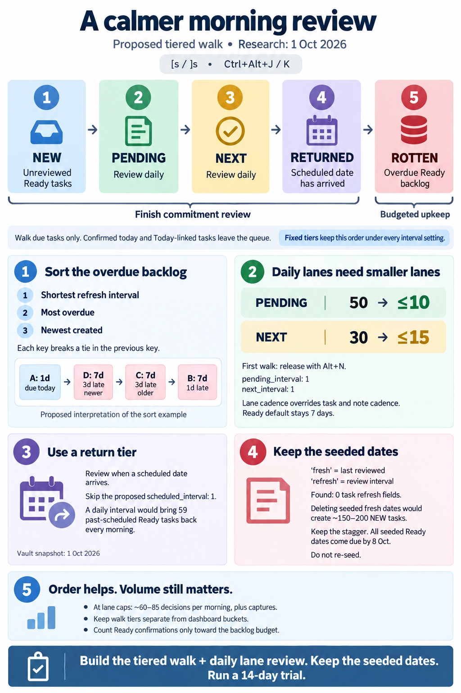

# A tiered morning review walk: NEW → PENDING → NEXT → RETURNED → ROTTEN

> **Research query:** Instead of seeding fake `fresh` dates on ready Obsidian tasks, how should
> the morning GTD review change so the `[s` / `]s` and `<ctrl+alt+j/k>` keymaps walk new, then
> pending, then next, then due scheduled, then other ready tasks, with ready tasks ordered by
> lowest refresh interval, then most overdue, then latest created? New config fields would give
> pending, next, and `scheduled` tasks refresh intervals that default to 1 day, after which the
> artificial `refresh` properties added previously would be removed. Is this a good idea, would a
> different approach be better, and what requirement adjustments and recommended solution are
> justified?



## Bottom line

1. **The walk order is right. Build it, with the tiers made explicit.** All six analyses agree.
   NEW → PENDING → NEXT → due scheduled → other Ready is GTD's daily order: inbox, then
   commitments, then the tickler, then backlog upkeep. Today's ritual does the open-ended ROTTEN
   walk *before* the lanes, which the 10-01 morning-review research called upside down. Today `]s`
   cannot reach the 80 Pending/Next tasks at all. Build the five groups as
   **[structural tiers](#model)** in the evaluator's queue. Don't let them fall out of interval
   sorting: that only works while every lane interval is shorter than every Ready interval, and
   one `[refresh:: 1]` would break it.
2. **Pending and Next intervals defaulting to 1 day: build them as asked.** You filed this
   yourself as `^wip-next-refresh` ("Make WIP and NEXT tasks have a refresh interval of 1 day!",
   `bob_gtd.md`, 10-01). It is also the missing mechanism behind
   `decisions:task-lanes-are-sticky`, whose stated cost is "a daily review with release". Every
   lane outcome already stamps (Alt+F keep, Alt+N release) or removes the task from the walk
   (linking it today). The catch is [load](#daily-lane-intervals): lanes are at **50 Pending /
   30 Next against caps of 10 / 15**. Releasing down to the caps once is a prerequisite, not an
   implementation detail.
3. **Don't build the scheduled interval as written. A [RETURNED tier](#a-scheduled-interval-of-1)
   delivers what you described.** "Refreshed on the day they are due" is already the RESURFACED
   rule (`fresh < scheduled ≤ today` is due that day, whatever the interval). A 1-day interval on
   *every task that has a `scheduled` field* means something else. Each Ready task past its date
   comes back **every** morning until you roll it, clear it, or finish it. That is **59 tasks on
   day one**, and the set grows as priority rolls write more `scheduled` dates. Four of the five
   reports reached this conclusion independently.
4. **There are no artificial `refresh` properties, and the seeded `fresh` dates should be left
   alone.** I [verified](#live-vault-census) **0** `[refresh::]` fields on any task, in any
   status, and **0** notes with `task_refresh`. The seed only wrote staggered `[fresh::]` dates.
   [Stripping them](#removing-the-seeded-stamps) would turn about 150–200 Ready tasks NEW at once.
   NEW is the uncapped first tier, and it is gated out of READY. Flattening them to one date
   creates a weekly cliff that keeps coming back. Doing nothing resolves itself: by **10-08** every
   seeded Ready stamp will have come due once. After that each one is either a real confirmation
   or an honestly overdue task. "We won't need to seed again" is already true, because the seed
   was a one-time cutover.
5. **Better ordering won't fix the overwhelm by itself, but a defined stopping point helps.** The
   [load comes from volume](#will-it-reduce-overwhelm): 200 Ready tasks on a 7-day interval is
   about 28 a day, plus lanes, plus returning deferrals, plus about 14 captures a day. The new
   order's real gift is a **finish line for the commitment tiers** (NEW, PENDING, NEXT,
   RETURNED). After that, ROTTEN is budgeted upkeep you can stop partway through.

The recommended design is in [the recommended solution](#recommended-solution).

## What exists today

Verified facts about the current system, at the commits listed in
[About this report](#about-this-report).

### Code and configuration

| # | Fact | Evidence |
| --- | --- | --- |
| E1 | `]s` / `[s` → `:bob_next_due` / `:bob_prev_due` → `bob-navigation-hotkeys:jump-to-next-due-task` / `jump-to-prev-due-task`, the same commands as Ctrl+Alt+J/K. | vault `obsidian_vimrc.md` lines 33–36 (lead-verified; mus had left this unverified) |
| E2 | Nav has **no ordering logic**. `planReviewJump` walks `api.freshness.queue()` in order, wraps at the end, and after Alt+Shift+F resumes from the remembered rank, minus the just-stamped keys, because the Tasks cache lags. | nav `main.js` ~24253 |
| E3 | The queue is NEW by (path, line), then DUE by (due_on, path, line). DUE mixes RESURFACED and ROTTEN, so an old ROTTEN task can come before a deferral that returned today. That contradicts `docs/freshness.md` §6's "RETURNED first". Neither `interval` nor `created` affects the order. | `state.rs` `queue()`; JS `freshnessQueue` |
| E4 | Scope is Ready `[ ]` only: lane-visible, non-recurring, not in a canonical daily note, not Today. `FreshnessRow.status` and `.created` are filled in but marked `dead_code`. | `state.rs` `evaluate`, lines 86–96 |
| E5 | Interval chain: task `[refresh:: N]` → note `task_refresh` → `freshness.interval` → 7. Nav's `describeRefreshInterval` **reimplements** this chain for the Ctrl+Shift+P refresh row. | `state.rs` `interval_for`; nav `main.js` ~24034 |
| E6 | Stamps apply in every lane (`docs/freshness.md` §5). Alt+N commit/release stamps. Ctrl+Shift+Enter stamps only when it rewrites the line. Capture's `=x` rows stamp. Automation never stamps. | `docs/freshness.md` §5 |
| E7 | `set_refresh(line, None, date)` goes through `stamp_inner`, so **clearing an interval also stamps today**. | `placement.rs` lines 96–107 |
| E8 | The seed bin-packed unstamped Ready tasks into 7 buckets, `today − 7 + k`. It raised each stamp to at least the task's arrived `scheduled` date, so nothing arrived RESURFACED, and it stamped **every other open non-recurring task with today**. | `docs/freshness.md` §7 |
| E9 | `dash.md` sorts PENDING `by created` (oldest first) and NEXT `by priority`. Both exclude Today. | vault `dash.md` lines 569–583 |
| E10 | Today's ritual: NEW → `rotten.md` (RETURNED, then ROTTEN, until 0 or budget) → PENDING → NEXT. This is written into `decisions:ready-is-freshness-gated`, `docs/freshness.md` §6, and the `gtd_daily.md` chore. | memory read; vault `gtd_daily.md` line 18 |
| E11 | The gated-READY trial runs **2026-10-05 → 10-18**. If rollout misses the start, it slips to a full 14 days. | `docs/freshness.md` §13 |
| E12 | JSON is `schema_version: 2`. Queue rows carry `tier` (`new`/`due`), `state`, `bucket`, `status_symbol`, `created`, `interval`, `interval_source`, `due_on`, and `days_overdue`. Nav gates on ledger-tools api `version >= 3`. | `docs/freshness.md` §7 |

### Live vault census

Live vault on 2026-10-01 (lead's `bob query` tallies: visible, non-recurring, outside daily
notes, `_templates`, and `_conflicts`; these match cdx's, cld's, and grk's censuses):

| Population | Count | `fresh` dates | `created` present |
| --- | ---: | --- | ---: |
| Ready `[ ]` | 200 | 26 / 26 / 26 / 15 / 20 / 38 / 48 on 09-25 … 10-01; 1 unstamped | 199 |
| …with `scheduled ≤ today` | 59 | all ≥ `scheduled` (the seed raised them), so 0 RESURFACED | — |
| Pending `[/]` | 50 | all 10-01 (seed "other" bucket) | 50 |
| Next `[*]` | 30 | 26 on 10-01; 4 unstamped | 30 |
| Blocked `[?]`, any visibility | 269 | 264 on 10-01 | — |
| `[refresh::]` on any task, any status | **0** | — | — |
| Notes with `task_refresh` | **0** | — | — |

`bob freshness list -f json`: interval 7, budget off; `1 new · 199 fresh · 0 resurfaced · 0 rotten
· ✓ 393 today`. The 393 counts stamps in **any** status, seed writes included.

## How the request was read

| You wrote | Read as | Why |
| --- | --- | --- |
| "…remove all of the artificial `refresh` properties" | The seeded **`[fresh::]`** dates | There is no `refresh` property anywhere ([above](#live-vault-census)). gem's report assumed seeded `[refresh:: N]` fields existed and planned to strip them; that is factually wrong. |
| "(if they have the same `refresh` property value) … created later" | The same **`fresh`** date | Equal intervals are already the first key. At an equal interval, an equal `fresh` means an equal due date, so `created` is the next tie-break. |
| "…a 7d interval that is 3d overdue before **that one**" | "That one" = the 7d task that is 1d overdue | This is the only reading consistent with your explicit lexicographic rule. It gives **A → D → C → B** ([vector below](#the-example-as-a-conformance-vector)). cdx, cld, grk, and mus read it this way. gem read "that one" as the 1d task and invented an escalation tier to make 3d-overdue 7d tasks beat it. That contradicts the stated rule, and no plain key produces it. Plain due-date order gives C/D → B → A, which breaks "A before B". **Confirm this in one line before implementation.** |
| "any task that has a `scheduled` property … default 1 … refreshed on the day they are due" | **Intent:** review on the due day | The literal rule is a daily re-review for as long as the date is past (see [A scheduled interval of 1](#a-scheduled-interval-of-1)). |
| "always walk through new tasks first…" | The **queue order** is always tiered; navigation still moves from the cursor | Next/previous keep stepping from your position and wrapping. They don't jump back to rank 1 on every press. |

### The example as a conformance vector

The example as a conformance vector (today 10-08, every task in the ROTTEN tier):

| Task | Interval | `fresh` | Due | Days overdue | `created` | Rank |
| --- | ---: | --- | --- | ---: | --- | ---: |
| A | 1 | 10-07 | 10-08 | 0 | 09-01 | 1 |
| D | 7 | 09-28 | 10-05 | 3 | 09-04 | 2 |
| C | 7 | 09-28 | 10-05 | 3 | 09-01 | 3 |
| B | 7 | 09-30 | 10-07 | 1 | 09-01 | 4 |

## Critique of the plan

Is this a good idea? Each part of the request in turn:

### The tiered walk

**Verdict: yes, it's the biggest win.**

- **One key walks the dash in its own order.** The dash reads TODAY → NEW → PENDING → NEXT →
  READY, and `rotten.md` reads RETURNED → ROTTEN. The new walk is that order minus TODAY and
  READY, limited to items not yet confirmed today. You get one mental model and one key.
- **Planning comes before upkeep.** Today an open-ended ROTTEN walk comes before the lanes. The new
  order handles commitments first and then stops at a clear boundary.
- **The lanes finally get a walk.** Sticky lanes removed automatic forgetting, and the decision
  record names "a daily review with release" as the price. Today nothing walks you through that
  review, and the lanes are 2–3× over their caps.
- **It costs no new keys or write paths.** Keep is Alt+F / Alt+Shift+F. Release is Alt+N, which
  stamps and returns the task to Ready as FRESH. Do today is Ctrl+Shift+Enter, which makes the task
  Today and takes it out of the walk. Roll, close, cancel, and route work as they do today.

### Daily lane intervals

**Verdict: yes, with release to the caps first.**

At interval 1, a lane task is due whenever it hasn't been stamped *today*. Each morning's
PENDING/NEXT tiers are therefore exactly the lane tasks you haven't touched yet, and each one drops
out once you act on it. The other options are worse:

- Walking every lane task unconditionally (gem) makes Alt+Shift+F land back on tasks you just
  confirmed.
- Slower defaults like 3 / 7 (mus) contradict `^wip-next-refresh` and the decision record's daily
  review.
- Confirm-on-lane-entry (mus) means a lane task is never reviewed again after it arrives.

The risks:

- **Load.** 80 lane decisions every morning at today's sizes, 25 at the caps. The first walk should
  *be* the one-time triage: Alt+N until the chips read ≤ 10 and ≤ 15.
- **Rubber-stamping.** Confirming the same 25 tasks every day can become automatic. Word the lane
  notice as "still in this lane?" and keep Alt+N one key away. If more than about 90% of Next
  reviews end in "keep", lengthen `next_interval` to 2–3. Leave Pending at 1.
- **The budget meter lies.** `refreshed_today` counts stamps in every status, so 25 lane stamps
  would turn a 15-task `rotten_daily_budget` green before you touch Ready. The budget should count
  Ready confirmations only. It is off today, so this is a latent bug, but it's cheap to fix now.

### A scheduled interval of 1

**Verdict: no, as written.**

Walk through a task with `scheduled 10-05` under the literal rule:

1. On 10-05 it is due. That's the existing RESURFACED rule, and it's what you described.
2. You confirm it with Alt+F, which writes `fresh 10-05`.
3. With interval 1 it's due again on 10-06, 10-07, and every day after, until you roll it to a
   future date, clear `scheduled`, or finish it.

Bob's priority rolls write `scheduled` on everything you defer, so elapsed schedules are usually
ticklers, not deadlines. cld's forecast: the 59 past-scheduled Ready tasks are due on day one. If
you answer them with Alt+F, the daily set grows to about 200 within two weeks. The load stays flat
only if every one of them is rolled or cleared, never confirmed. The literal rule would quietly
change Alt+F's meaning on those lines from "keep" to "remind me tomorrow".

Your ordering goal still holds: due scheduled tasks should come before other Ready tasks. That's a
**tier** (RETURNED), not an interval. While you're in there, it also fixes
[E3](#code-and-configuration)'s interleaving.

### Removing the seeded stamps

**Verdict: no.**

| Option | Effect |
| --- | --- |
| Strip seeded `fresh` from Ready | About 150–200 NEW the next morning. Provenance is ambiguous: the 10-01 bucket mixes seed stamps with real confirmations, and an Alt+F on a line already stamped today changes nothing, so it leaves no trace in git (cdx). NEW is first and uncapped, and those tasks vanish from READY until cleared. |
| Strip the seed's "other" stamps too | The 264 Blocked tasks return as **NEW** instead of RETURNED when their dates arrive. That's the wrong tier for a deferral. The 76 lane stamps don't matter at interval 1. |
| Flatten to one real date | 140–199 tasks come due together on 10-08, mid-trial, and again every 7 days, because tasks confirmed together come due together (cld, forecast C2). |
| Use `set_refresh(…, None)` as a cleanup tool (gem) | It stamps today (E7), so it would *fabricate* confirmations while trying to remove fake ones. |
| **Do nothing** | Every seeded Ready stamp comes due by 10-08. From then on a seeded stamp only means "overdue since then", which is true. Lane stamps expire on day one at interval 1. Blocked stamps only decide that a returning deferral is RETURNED, which is correct. |

### Will it reduce overwhelm

Decisions per morning, excluding new captures. Most rows come from cld's day-by-day simulation. The
~121 row is the lead's arithmetic: grk's first-morning count (~107) plus the Blocked deferrals that
cld's census shows returning (14, 20, 21, 23, 10, 9, 8 on 10-02 … 10-08), which grk left out.

| Scenario | First morning | Steady state |
| --- | ---: | ---: |
| Today's rules (lanes not walked) | ~41 | ~45–60 |
| Literal request (lanes 50/30 at 1d, `scheduled` 1d, scheduled tasks confirmed with Alt+F) | ~180 | grows past 300 by 10-15 |
| **Recommended**, lanes not yet released | ~121 (1 NEW + 80 lanes + 14 RETURNED + 26 ROTTEN) | — |
| **Recommended**, lanes at the caps | ~66 | ~60–85 |
| Recommended + seeded stamps stripped | ~220 (about 150+ NEW) | same, after a one-time flood |

Add about 14 captures a day at September's rate. At 5–10 seconds a decision, the steady state is
about 5–15 minutes. The commitment tiers (≈25 lane + ≈10–20 RETURNED + NEW) are the "must finish"
part; ROTTEN is the stoppable part. Interval-first sorting changes nothing today, because every
Ready interval is 7. It starts to matter once you use the refresh row's presets. Long-interval
tasks can then wait behind 7-day ones, but the weekly prune ("clear any leftover ROTTEN") bounds
that wait at about a week. If ROTTEN regularly reaches the weekly prune, lengthen `task_refresh` on
low-churn notes rather than reordering.

## Where the reports disagreed

Each row gives the reports' positions and the resolution.

| Issue | Positions | Resolution |
| --- | --- | --- |
| Ready sort example | cdx/cld/grk/mus: A→D→C→B. gem: D→C→A→B through a "≥3d or ≥50% overdue" escalation sub-tier | **A→D→C→B.** It's the only reading consistent with the stated rule. gem's threshold is arbitrary. Confirm with Bryan. |
| Lane interval default | cdx/cld/grk: 1. mus: unset (falls back to the global value), with 3/7 suggested. gem: no lane intervals at all; lanes always in the walk | **1**, per `^wip-next-refresh` and the sticky-lanes cost. Unconditional inclusion breaks Alt+Shift+F's advance. |
| Lane vs task/note precedence | cld: the lane interval wins while the task is in the lane. cdx: task > lane > note. grk/mus: task > note > lane | **The lane interval wins while the task is in the lane** (cld). `[refresh::]` is a *backlog* cadence set on Ready tasks, and it stays on the line through promotion. A stale `[refresh:: 90]` would otherwise exempt a Next task from the daily review the decision requires. No overrides exist today, so nothing migrates. The cost: there's no per-task lane cadence until someone asks for one. |
| Scheduled interval | cdx: build it as asked (lane/scheduled minimum, persistent). cld: opt-in, default off. grk/mus/gem: drop it; use a RESURFACED tier | **Drop it for now and add the RETURNED tier.** If you later want the daily nag, use cld's opt-in shape (default `null`, applies only to Ready tasks past their date) and pair it with a "roll or clear, not Alt+F" habit. |
| Seeded stamps | cld/grk/mus: leave them. cdx: careful provenance-manifest removal. gem: strip `[refresh::]` | **Leave them** (see [Removing the seeded stamps](#removing-the-seeded-stamps)). |
| Pending/Next sort | cdx/cld: overdue first, then newest `created`. grk: overdue first, then **oldest** `created`. gem: newest first; Next by priority | **Never-stamped first, then due date ascending, then oldest `created`, then path/line.** This matches dash PENDING's `sort by created`, and the oldest commitments are the likeliest to be released. Optionally sort NEXT by priority first, to match its dash section exactly. |
| NEW sort | cdx/cld/mus: (path, line). grk/gem: newest `created` | **Keep (path, line).** That processes inbox notes top to bottom, and it's unchanged. mus's reason ("`created` is mostly missing") is wrong: 279 of 280 visible lane tasks have it. That makes `created` a sound tie-break wherever it is used. |
| Today-linked tasks | cdx: keep reviewing overdue tasks linked Today. Others: exclude them | **Exclude them.** Linking a task today *is* the "do today" outcome, and it matches the dash's Today exclusion. |
| JSON version | cdx/cld: schema 3 / namespace v4. grk: stay at 2 with additive fields | **Bump.** The queue starts holding rows whose `state` and `bucket` are null, and `tier` gains values. A consumer that checks `tier ∈ {new, due}` would misread them. Nav must gate on the v4 capability. |
| Tier-boundary notice | cld: after NEXT | **After RETURNED.** A deferral that returned today may be today's highlight, so RETURNED belongs to planning. |

## Requirement adjustments

Each change to what you asked for is called out here.

| # | You asked for | Recommended instead | Why |
| --- | --- | --- | --- |
| **ADJ-1** | An order that comes out of interval sorting | **Explicit tiers** NEW → PENDING → NEXT → RETURNED → ROTTEN, with each comparator applied only inside its tier | The order holds under any config or override (see [The tiered walk](#the-tiered-walk)). |
| **ADJ-2** | Ready: interval ↑, refreshed earlier, created later | **As asked:** `interval ↑, due_on ↑, created ↓ (missing last), path, line` | It matches your example. At an equal interval, `due_on ↑` is the same as `fresh ↑`. |
| **ADJ-3** | (no order given inside the lanes) | Never-stamped first, `due_on ↑`, `created ↑`, path, line | Dash parity; oldest commitments first. |
| **ADJ-4** | `pending_interval`, `next_interval`, default 1 | **As asked.** Range 1–365; `null` means the lane isn't walked (a one-line rollback). The lane interval **overrides** task/note `refresh` while the task is in the lane. | The precedence row in [Where the reports disagreed](#where-the-reports-disagreed). |
| **ADJ-5** | A `scheduled` interval, default 1 | **No knob.** A **RETURNED tier** (`fresh < scheduled ≤ today`) after NEXT | It delivers "reviewed on the day it's due" without a daily leash on 59+ tasks (see [A scheduled interval of 1](#a-scheduled-interval-of-1)). |
| **ADJ-6** | (implicit) | Walk only **due** tasks: anything stamped today drops out | Otherwise Alt+Shift+F loops over work you just reviewed. |
| **ADJ-7** | Remove the artificial `refresh` properties | **Do nothing.** None exist, and the seeded `fresh` dates expire on their own by 10-08. Never re-seed. | See [Removing the seeded stamps](#removing-the-seeded-stamps). |
| **ADJ-8** | (implicit) | Keep the **walk separate from the dash buckets**: lane rows carry `state`/`bucket` null, a walk `tier`, and `lane`. `counts.due`, NEW, ROTTEN, `rotten.md`, and the chips stay Ready-only. The budget counts Ready confirmations only. | This keeps the `B = NEW ∪ RETURNED ∪ ROTTEN ∪ READY` partition and the trial's measurements intact. |
| **ADJ-9** | (implicit) | Release the lanes to their caps (≤ 10 / ≤ 15) once, as the first walk | Without it the ritual is about 120 decisions, not about 10 minutes. |
| **ADJ-10** | (implicit) | Recurring, daily-note, hidden, blocked, and Today-linked tasks stay out of every tier | `stampLine` refuses recurring lines, and daily-note lanes clear on their own (R9). |

## Recommended solution

### Model

Every tier holds only tasks that are due. Walk scope: lane-visible, non-recurring, not in a
canonical daily note, not Today, and status in `[ ]`, `[/]`, or `[*]`.

| # | Tier | Members | Due when | Order within the tier |
| --- | --- | --- | --- | --- |
| 1 | **NEW** | Ready with no valid `fresh` | always | path, line |
| 2 | **PENDING** | `[/]` | no `fresh`, or `today ≥ fresh + pending_interval` | never-stamped first, `due_on ↑`, `created ↑` (missing last), path, line |
| 3 | **NEXT** | `[*]` | no `fresh`, or `today ≥ fresh + next_interval` | same as PENDING (optionally priority first) |
| 4 | **RETURNED** | Ready, `fresh < scheduled ≤ today` (today's RESURFACED) | on return | `scheduled ↑`, `created ↓`, path, line |
| 5 | **ROTTEN** | Ready, `today ≥ fresh + interval` | today's rule | **`interval ↑`, `due_on ↑`, `created ↓` (missing last)**, path, line |

```yaml
freshness:
  interval: 7          # Ready backlog (unchanged)
  pending_interval: 1  # [/] lane review cadence, 1–365; null = lane not walked
  next_interval: 1     # [*] lane review cadence, 1–365; null = lane not walked
  # rotten_daily_budget: 15   # counts Ready confirmations only
```

**Interval precedence:** a lane task uses the lane's interval (`interval_source: pending|next`). A
Ready task uses task `refresh` → note `task_refresh` → `freshness.interval` → 7, as today.

**Unchanged:** `state()` and `bucket()` for Ready, READY/NEW/ROTTEN gating, `rotten.md` filters, the
dash chips, the stamping rules, and "freshness never changes a lane, Today, schedule, or priority".

### Changes by repository

**bob-cli (owns the contract).**

- `docs/freshness.md` §2 (keys, precedence), §4 (tier evaluation next to the unchanged
  state/bucket rules), §6 (new ritual; "for a past-scheduled task, roll or clear rather than
  Alt+F"), §7 (JSON schema 3: `tier ∈ new|pending|next|returned|rotten`, `lane`, counts
  `pending_due`, `next_due`, `walk`, `confirmed_ready_today`; `due` keeps its Ready meaning), §10
  vectors, §12 lane marks.
- `src/native/config/freshness.rs`: the two keys, validated like `interval`. Keep the
  raw-`serde_yaml::Value` isolation so a bad block never breaks other loaders.
- `src/native/freshness/state.rs`: a `Tier` enum and `tier_for`. Start reading `status` and
  `created` (drop their `dead_code` markers). Make interval resolution lane-aware. `queue()` sorts
  by (tier, the tier's comparator). `counts()` gains lane counts and a Ready-only budget.
- `src/native/freshness/cli.rs` / `scan.rs`: feed rows for Ready, Pending, and Next (filtered
  `OPEN_QUERY` rows, or the existing `PENDING_QUERY` / `NEXT_QUERY`) instead of `READY_QUERY` only.
  Human output gets NEW / PENDING / NEXT / RETURNED / ROTTEN sections.

**bob-plugins / bob-ledger-tools (JS mirror, namespace v4).**

- `coerceFreshnessConfig` gets the keys. `freshnessRowFromTask` carries `statusSymbol` and a
  normalized `created`.
- `freshnessEvaluate` / `freshnessQueue` add tiers and comparators. `freshnessCounts` gets lane
  counts and the Ready-only budget. `reviewModel()` stays the Ready view.
- Expose `intervalFor(task)` with its source. Lane-due marks get the `due` tone, with a tooltip
  like `Daily NEXT review · Alt+F keep · Alt+N release · Ctrl+Shift+Enter today`.

**bob-plugins / bob-navigation-hotkeys (small; no ordering code).**

- The jump notice names the tier, for example `NEXT · 14/62`. Show **one boundary notice** when
  the walk leaves RETURNED: `Commitments done — N ROTTEN left`.
- `describeRefreshInterval` calls `api.freshness.intervalFor`, so the refresh row reads
  `every 1 d (next lane)` instead of a misleading `every 7 d (config)`.
- Gate on the v4 capability. Add tests for post-stamp advance across a tier boundary and for
  previous after a stamp. `planReviewJump`'s `rank − count` arithmetic assumes the stamped entries
  were contiguous.
- Deploy with `bob plugins sync`. Never edit the installed copies in `~/bob`.

**Vault, config, memory.**

- Add the `freshness:` block to the chezmoi-managed `config.yml`.
- Rewrite the `gtd_daily.md` chore: "`]s` through NEW → PENDING → NEXT → RETURNED (keep, link
  today, release with Alt+N); start the highlight; later, ROTTEN until 0 or the budget."
- When it ships, close `^wip-next-refresh`.
- Through `/sase_memory_write`: a **new decision record** for the tiered walk and daily lane review,
  marking the ritual-order clause of `decisions:ready-is-freshness-gated` as partly superseded
  (never edited in place), plus an update to the `glossary:freshness` strand's interval chain and
  scope sentence.

### Conformance vectors

In both languages:

- **Q1:** the [A/D/C/B vector](#the-example-as-a-conformance-vector) above.
- **Q2:** one task per tier, in reverse path order. The queue still comes out in tier order.
- **L1:** a `[*]` stamped today is not queued. One stamped yesterday is tier `next` with
  `days_overdue` 0, and `state`/`bucket` null.
- **L2:** `[/]` with `[refresh:: 30]`, stamped yesterday → due, because the lane overrides it.
- **L3:** a recurring `[*]` and a Today-linked `[*]` → in no tier.
- **L4:** `next_interval: null` → `[*]` is never queued.
- **R1:** RETURNED comes before a ROTTEN task with an earlier `due_on`. This replaces S14's
  interleaving.
- **B1:** 20 lane stamps plus 5 Ready stamps against budget 15 → `budget_met: false`.
- Missing `created` sorts last in descending keys and first in ascending keys.
- Update S13 (lanes are out of *state* scope but in *tier* scope), plus the M9/M10/M14 tooltips.

### Rollout

1. **Ship before the trial starts, or slip the trial.** This is a medium epic: contract and Rust,
   then ledger-tools and nav, then vault and config, then memory. If it misses Mon 10-05, start the
   14-day window when it lands (`docs/freshness.md` §13 allows that), so the trial measures the
   ritual you'll keep. Don't change the ritual mid-trial.
2. **Make the first walk the lane triage.** All 80 lane tasks will be due. Release with Alt+N until
   the chips read ≤ 10 / ≤ 15. After that it's about 25 a day.
3. **Leave the `[fresh::]` stamps alone; there are no `[refresh::]` fields to remove; don't
   re-seed.** On 10-08, check that every 09-25 … 10-01 stamp still on a Ready task is truthfully
   overdue.
4. **Watch three signals:** the lane keep rate (above 90% → lengthen `next_interval`); minutes from
   the first `]s` to the boundary notice (aim for ≤ about 10 once the lanes are at the caps); and
   ROTTEN leftovers at the weekly prune (lengthen `task_refresh` on low-churn notes; don't reorder).

## Alternatives rejected

| Alternative | Why not |
| --- | --- |
| One interval-sorted queue with no tiers (the literal model) | The order only holds while lane intervals are shorter than every Ready interval (see [The tiered walk](#the-tiered-walk)). |
| An escalation sub-tier or an overdue-ratio score | Contradicts the stated rule and the A-before-B example. Arbitrary thresholds make the walk hard to predict. Revisit only if long intervals starve past the weekly prune. |
| Lanes always in the walk, regardless of stamps (gem) | Alt+Shift+F lands back on work it just confirmed, and "due" stops meaning anything. |
| A nav-only lane walk (mus prototype) | Forks "due" between `]s` and `bob freshness list`, breaking the one-evaluator contract. |
| Put the lanes into `bucket = rotten` | They would also show up on `rotten.md` and in the ROTTEN chip, breaking the gated partition. |
| A session-only walker with no lane stamps | Forgets across devices and restarts. Stamps are already the persistent "looked at today" record. |
| A Ready default interval of 1 | Brings back the roughly 200-task morning. |
| Deterministic interval jitter | Not needed while the seed's stagger persists. Keep it in reserve in case a big weekly-prune confirmation creates weekly spikes. |

## About this report

- **Date:** 2026-10-01
- **Lead:** consolidated from five independent reports (`__cdx`, `__cld`, `__grk`, `__mus`, `__gem`)
  plus the lead's own checks of the code, the vault, and live commands
- **Repos at time of writing:** bob-cli `5d24c98`, bob-plugins `4744607` (bob-ledger-tools 1.14.1,
  bob-navigation-hotkeys 1.49.0), vault `b42eda51`
- **Question:** Should `]s` / `[s` and Ctrl+Alt+J/K walk new → pending → next → due scheduled →
  other ready tasks, with Ready ordered by interval, then lateness, then newest `created`? Should
  Pending, Next, and scheduled tasks get configurable refresh intervals that default to 1 day? Should
  the artificial values from the cutover seed be removed? Is this a good idea, and what would we
  build?

## Sources

- **Constituent reports:** `tiered_morning_review_walk__cdx.md`, `__cld.md`, `__grk.md`,
  `__mus.md`, and `__gem.md` in this directory.
- **bob-cli `5d24c98`:**
  - `docs/freshness.md` §§2, 4–7, 13;
  - `src/native/freshness/state.rs` (`evaluate`, `interval_for`, `queue`, `FreshnessRow`);
  - `src/native/freshness/placement.rs` (`set_refresh`);
  - `src/native/dataview/tasks/mod.rs` (`READY_QUERY`, `PENDING_QUERY`, `NEXT_QUERY`,
    `OPEN_QUERY`).
- **bob-plugins `4744607`:**
  - `plugins/bob-navigation-hotkeys/main.js` (`describeRefreshInterval` ~24034, `planReviewJump`
    ~24253);
  - `plugins/bob-ledger-tools/main.js` (`freshnessReviewModel` ~4938, `freshnessQueue` ~4699,
    `freshnessRowFromTask` ~5647).
- **Vault `b42eda51`:** `obsidian_vimrc.md` 33–36, `dash.md` 551–594, `gtd_daily.md` 18, and
  `bob_gtd.md` `^wip-next-refresh`.
- **Live commands, 2026-10-01:** `bob freshness list -f json`, plus `bob query` Tasks tallies by
  lane: `fresh` histogram, `created` coverage, `[refresh::]` and `task_refresh` census.
- **Memory:** `decisions:task-lanes-are-sticky`, `decisions:ready-is-freshness-gated`, and
  `glossary:freshness`.
- **Prior research (via the reports):**
  `research:202610/gtd_morning_review_pomodoro_cutover/gtd_morning_review_pomodoro_cutover__final.md`
  ("plan first, maintain later"; lane-cap triage) and
  `research:202610/freshness_gated_ready_dash/freshness_gated_ready_dash__final.md`.
- **External (cdx):** David Allen Company GTD guidance on daily next-action review vs. the weekly
  review. A freshness queue complements the weekly review; it doesn't replace it.
