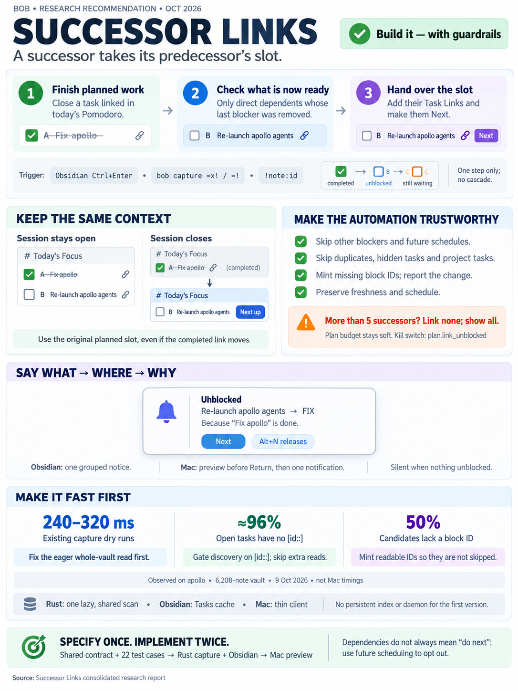

# Successor Links: auto-linking the tasks a planned close unblocks

> **Research query:** How should Bob automatically add Task Links for tasks that depend on a
> task closed in the current daily file (via Obsidian's Ctrl+Enter or `bob capture`'s `=x!` /
> `=!`), placing them in the closed task's Pomodoro (or the newly created one if that whole
> Pomodoro closed) and showing a toast in Obsidian or Bob Mac Capture about which links were
> added and why? It must stay fast, especially in Bob Mac Capture, and be intuitive, reliable,
> and beautiful. Is this a good idea, would a different approach be better, which requirement
> adjustments are justified, and what is the recommended solution?



## Bottom line

**Build it, in a narrowed form.** I call it **Successor Links**: *a successor takes its
predecessor's slot.* In one sentence Bryan could say out loud:

> "When I finish something that's on today's plan, Bob puts whatever that finally unblocked
> into the same spot — or into the next session of the same name if I closed the whole
> session — and tells me."

All five researchers say yes, and all five reject the literal version ("every dependent of
every closed task"). They split on details.
[The disagreements section](#disagreements-between-the-reports-and-how-i-resolved-them)
resolves each disagreement with evidence.

The version I recommend (in full under [Recommended solution](#recommended-solution)):

1. **When it fires.** A Bob close gesture completes a task that has a live Task Link under
   one of today's open Pomodoros, or under the Pomodoro being closed.
2. **What it links.** Only **direct** dependents that this close **fully** unblocked.
3. **Where.** Right after the predecessor's link. If the session closed, into a same-name
   continuation, created if needed.
4. **Status.** The successor becomes **Next** in the same write. There is **no** freshness
   stamp and no schedule change.
5. **Block IDs.** A missing block ID is minted deterministically, and the toast says so.
6. **Feedback.** One grouped notice per gesture. In Bob Mac Capture, the preview shows the
   successor *before* Return.
7. **Speed.** Three layers (see [Performance design](#performance-design)):
   - an O(1) **`[id::]` gate** skips all discovery when the closed task carries no `[id::]`,
     which is true of about 96% of open tasks;
   - one lazy, shared, parallel, prefiltered vault read in bob-cli;
   - the Tasks plugin cache in Obsidian.

There is also a prerequisite that cld and cdx found independently, and that mus and gem
missed or mis-measured: **capture is already roughly 50× over the thin-client decision's
~5 ms spawn premise** ([Performance today](#performance-today)). Fix that first
(`bob-cli-5v`). The feature then ships with capture getting *faster*, not slower.

## Is this a good idea

**Yes, with guardrails.** A dependency edge is the one place where Bryan has already written
"B comes after A." When A finishes *inside today's plan*, pulling B into A's slot:

- keeps momentum and removes a context switch (find B's note, Ctrl+Shift+Enter, pick a
  session);
- makes the ledger read as a hand-off;
- completes an existing symmetry. Linking a dependent already pulls its prerequisites to Next
  (`task-dependencies.md` §5); closing a prerequisite should push its dependent into the plan.

It is **not** a rerun of the failed `#now` automation (grk's point). That inferred a weekly bet
on a timer. This fires on an explicit completion gesture, only for work Bryan already put on
today's ledger, and it always says what it did.

### Where the request read literally goes wrong

1. **"Tasks that depend on tasks that we close" is too broad.** Linking a still-blocked
   dependent has two bad effects:
   - it puts unworkable `[?]` work on Today;
   - via Pomodoro-root promotion, it raises that dependent's *other* open prerequisites to
     Next. That is a silent second automation.

   Only "this close removed the last blocker" makes the toast's *why* true.
2. **"Blocked by" ≠ "do right after".** For example, "Apply to roles" depends on "Update GOOG
   end date", but probably isn't next. The vault already has a precise "not right after"
   signal, a future `scheduled` date, and two live dependents use it today. Treat it as the
   per-task opt-out instead of inventing grammar.
3. **Linking is a sticky commitment, not a notification.** A link raises the task to Next, and
   only Alt+N releases it (`task-lanes-are-sticky`). A wrong successor costs a lane, not a
   bullet. Hence: fully-unblocked only, preview before submit, every added task named, and
   Alt+N taught in the toast.
4. **"In the current daily file" means "planned in today's ledger".** Tasks live in
   project/area notes; only their *links* live in the daily note. The same close should
   produce the same result whether the cursor is on the link, on the task line, or on the
   Pomodoro line.
5. **"The newly created Pomodoro" doesn't always exist**
   ([Code facts](#code-facts-the-design-depends-on)). The rule has to say when one is
   created.
6. **The two named syntaxes live in two engines.** `=x!` doesn't even recover dependents
   today.
7. **"Blazing fast" is already violated** ([Performance today](#performance-today)). A naive
   implementation would add a third vault read.
8. **On the Mac, the "toast" arrives after the panel is gone.** The beautiful, honest surface
   is the **preview before Return**. The notification confirms; it doesn't inform.

## Requirement adjustments

Called out explicitly. Each row is a deliberate change to, or clarification of, the
request.

| # | The request says | I recommend | Why |
| --- | --- | --- | --- |
| **A1** | Closes "in the current daily file" via Ctrl+Enter or `=x!` / `=!` | Fire when a Bob close gesture completes a task with a **live Task Link under an open Pomodoro today**, or under the Pomodoro being closed, whatever the cursor position. That covers: Ctrl+Enter on the link, the task line, or the Pomodoro line (closed embeds); `!note:id`; every `=x…` that completes links (`!M`, `=!`, embeds). It does **not** cover: cancel, reopen, raw Tasks checkbox clicks, hooks runs, or Alt+] closes (until `bob-cli-3k` routes them through `finalizeClosedTasks`). | Same close, same result. "Won't do" is no reason to plan the follow-up. A task not planned today has no slot to hand over. |
| **A2** | Tasks that depend on the closed task | Only **direct** dependents whose last blocker this action removed: no other open prerequisite and no future `scheduled` date. Decide this from the dependency graph before and after the close, **not** from the checkbox (a stale `[ ]` can hide an open prerequisite). | Truthful "why"; no cascade promotion; no `[?]` rows on Today. |
| **A3** | Same Pomodoro, or the newly created one | The predecessor's **planned slot**: immediately after its link's subtree in its open entry. If that entry is the one being closed, the successor goes in its **same-name continuation**, created if needed (successors count as carried). If `!` relocates the struck link into the running entry, the successor still takes the vacated planned slot. | Keeps themes coherent. Doesn't grow the running session behind Bryan's back. Matches the request's "newly created" wording. |
| **A4** | (unstated) | The successor becomes Next in the same write. **No `[fresh::]` stamp.** No schedule edits. | Next is already the invariant for linked tasks. Automation never stamps freshness (glossary). An unstamped successor comes up in tomorrow's NEXT review, which is correct. |
| **A5** | (unstated) | Mint a missing `^block-id` with the shared deterministic suggester (unique in its note), and report it. | Half of today's candidates lack IDs. There is precedent in nav's writers. The Mac preview shows the ID before it is written. |
| **A6** | `=x!` / `=!` | Close gains dependent recovery, which is the contract change noted in [Code facts](#code-facts-the-design-depends-on). | Without it, close has nothing honest to link. It also removes a 15-minute lag. |
| **A7** | (unstated) | Link every eligible successor and keep the plan budget soft (show the meter). **Circuit breaker:** if one gesture would add more than 5, link none and report all. | No ranking Bryan can't predict. The maximum fan-out in the vault is 4. |
| **A8** | A toast | One grouped notice per gesture, quiet when nothing unblocked. On the Mac, the **dry-run preview** is part of the requirement. | Rare event (a few per week): every notice must explain itself; no habituation. |
| **A9** | (unstated) | One kill switch, `plan.link_unblocked: true`, read by Rust and the plugins. | The review-walk record rejected a switch for a cursor-only feature. This one writes across notes on its own, so insurance is cheap. |
| **A10** | Stay fast | The performance groundwork is **part of the feature**: `bob-cli-5v`, the `[id::]` gate, and the Tasks-cache index. | The budget is already blown without the feature. |

## What exists today

Everything in this section was verified against the code and a read-only copy of the vault,
at the baselines listed under [Sources and baselines](#sources-and-baselines).

### Close paths

| Gesture | What happens to the closed task's link | Dependents recovered? | Success feedback |
| --- | --- | --- | --- |
| Ctrl+Enter on a Task Link under an open Pomodoro (cycler `160-plugin-completion.js`) | Struck in place; the session stays open | Yes, always to Ready (`130-plugin-references.js`) | **None** on success, except when composed into a walk landing toast |
| Ctrl+Enter on the Pomodoro line (`170-plugin-pomodoro.js`) | Embedded `![[…]]` targets close. Plain links are started and carried into `- [ ] () — NAME` | Yes, for closed embeds | None |
| Ctrl+Enter on the task line in its own note | Embeds retired vault-wide; a plain ledger link is left for the hooks | Yes, to Ready | None |
| `bob capture '!note:id'` (`capture/task_complete.rs`) | Struck, and **moved** into the running entry by retirement | Yes, always to Ready (`task_complete/recovery.rs`) | CLI `unblocked` row; Mac `lock.open.fill` rows; notification `· unblocked X` |
| `bob capture '=x…!M'` / `'=!'` (`capture_pomodoro_close/*`) | Completed links struck in the closed entry; worked links carried | **No** | Close card and notification; nothing about dependents |

### Code facts the design depends on

**Recovery definition.** `recover_blocked_dependents` matches dependents on the **derived
`[dependsOn::]` field**:

- a match is against the closed task's `[id::]` value or its canonical `note__block-id`;
- blocking resolves only through tasks that carry `[id::]` (`task_dependency_states`,
  `task_status_hooks/sync.rs:701`);
- only `[?]` rows are considered;
- a matching row always recovers to `' '`.

The cycler mirrors this rule in JS.

**`=x!` skipping recovery is a documented contract, not a bug.** `docs/capture.md` (close
section) says: "Vault-wide Blocked recovery and completed-reference retirement outside the
session stay in `bob task reconcile`." Adding recovery to close is a **deliberate contract
change**. mus calls it a bug fix; it is not one.

**Continuations are not always created.** Rust `ledger.rs:346`
(`should_create = !carried_lines.is_empty() || later_entry.is_none()`) and JS
`060-pomodoro.js:863` agree: if every link completes and a later entry exists, **no**
continuation is created. "The newly created Pomodoro" therefore does not always exist (cdx
confirmed this by running it).

**The manual link helper has the wrong side effects for automation.** `plan_task_link`
(`capture_task_toggle/task_update.rs`) is the manual link policy. It retires a future
`scheduled` field and **stamps `[fresh::]`**. The glossary is explicit: freshness is stamped
by "supported Bob keymaps, Alt+F, and `bob capture` edits of existing tasks … **creation and
automation never do**." Automation must not call it as-is.

**The next `=` start picks the first open untimed placeholder** (`docs/capture.md`, "Next
future Pomodoro"). A created continuation therefore becomes "next up".
[Placement examples on the real ledger](#placement-examples-on-the-real-ledger) covers why
that is acceptable.

**Block-ID minting has precedent.** Nav's Depends-On writer appends missing block IDs to
targets (`080-dependency-identity.js`, `needsBlockId`). Its project-note writer mints
`suggestBlockIdFromTask` slugs silently (`120-project-notes.js:378`). Capture's pickers list
ID-less tasks with deterministic `block_id_suggestions` (`suggest_ids_with_used`).

**Obsidian feedback surfaces.**

- Nav owns a rich notice-card family (`280-notices-and-dates.js`): priority cards, and cancel
  cards with a plan-budget chip and an `unblocked N dependents` chip.
- Nav's public `api` (v3) exposes `taskLinkLane` and `reviewWalk`, which the cycler already
  consumes. It does **not** expose notices.
- **No plugin spawns a subprocess** (no `child_process` / `spawn` anywhere in bob-plugins).

**The cycler reads the whole vault on every close.** `recoverBlockedDependentsNow` does a
sequential `await vault.cachedRead` of every Markdown note.

**Bob Mac Capture feedback surfaces.**

- Live preview runs a `bob capture --dry-run` after a 50 ms debounce.
- The panel hides on success.
- After submit, the surfaces are the macOS notification (which needs authorization) and the
  menu-bar pulse.
- "Open Note(s)" counts the daily note as changed only if `taskComplete?.ledger != nil`
  (`NotificationService.swift:665`).
- gem's file names (`BobCaptureResponse.swift`, `PreviewCardView.swift`,
  `CaptureNotificationController.swift`) **do not exist**. The real ones are
  `CaptureModels.swift`, `CaptureTaskCompletePresentation.swift`,
  `CapturePomodoroClosePresentation.swift`, `CapturePanelView.swift`, and
  `NotificationService.swift`.

### Vault census

Read-only, 2026-10-09.

| Measure | Value | Source |
| --- | --- | --- |
| Markdown notes | 6,208 | lead |
| Notes containing `[dependsOn::` | 24 (0.4%) | lead; cld and gem agree |
| Open dependents (all `[?]` today) | 20 | lead, cld |
| …of which **lack a `^block-id`** | **10 (50%)** | lead (cld: 22 of 50 across all statuses) |
| Fan-out among open dependents | 4 (`cash__unemployment`), 3 (`sase__dynamic-agents-md`), 2, then 1s | lead |
| Fan-in among open dependents | 19 with one prerequisite, 1 with two | lead |
| Same-note vs cross-note edges | 46 vs 6 (88% same note) | cld |
| Open tasks carrying `[id::]` (possible prerequisites) | **21 of 477 open `#task` lines (≈4%)** | lead |
| Today's ledger | BOB (running), FIX, SASE; **10/10 links**, 3/3 themes | lead |

These numbers drive four design choices:

- **Successors usually share their predecessor's theme**, so "same slot" is the right default.
- **Minting is mandatory.** Skipping ID-less dependents would halve the feature.
- **Fan-out above 1 is real but small** (max 4). gem's "Hydra" scenario (5–10 dependents) is
  hypothetical for this vault, and its 1–2 link cap would truncate real cases.
- **About 96% of open tasks cannot unblock anything when they close**, because they carry
  no `[id::]`.

Live motivating case: `[[sase#^fix-apollo]]` sits in today's FIX session, and
`sase.md:82` "Re-launch all failed agents on apollo!" `[?]` depends on it.

### Performance today

Lead-measured on apollo with `bob capture -d -n -f json`, 7 runs after warm-up.

| Draft | Runs (ms, sorted) |
| --- | --- |
| `hello world` | 256 263 271 273 300 308 324 |
| `=x` | 260 268 273 280 285 316 323 |
| `=x!4` | 240 260 265 273 285 285 287 |
| `!sase:fix-apollo` | 368 422 431 438 450 454 458 |

| Raw I/O on the same copy | ms |
| --- | --- |
| parallel `rg -l -F dependsOn` (prefilter of every note) | 28–31 |
| `find` stat walk (the floor for any mtime-validated cache) | 32–55 |
| single-thread `rg` | 85–104 |

**Cause.** `src/native/capture/plan.rs:84` eagerly builds `DependencyContext::new`. That
calls `capture_dependency_tasks::discover`, which reads and task-scans every note, plus a
second `markdown_files` walk for `previous_daily`. A `!` then builds another full snapshot
(`recovery_base_snapshot`).

cld's strace and prototype tie this down:

- 5,071 file opens for `hello`, and 10,125 for `!`;
- a plain capture drops to about 40 ms with eager discovery skipped.

cdx's synthetic benchmark shows the same linear scaling. This is filed as **`bob-cli-5v`**
(READY, medium, bug).

Two reported figures are wrong:

- gem's "`=x` ~18 ms warm" does not reproduce on this vault.
- The thin-client decision's "~5 ms spawn" premise (repeated by mus) no longer holds.

## Design

### Vocabulary

- **Predecessor**: a task this gesture completed.
- **Successor**: an open direct dependent whose last blocker this gesture removed.
- **Slot**: the line position of the predecessor's live link in its open entry, captured
  *before* any write.
- **Successor link**: the plain Task Link the close inserts. Proposed glossary term, to be
  added via `/sase_memory_write` when it ships.

### The rule shared by Rust and JS

```text
C       = identities this gesture actually moved open → Done
          (root + closed embedded subtrees), from the staged pre/post images
anchors = for each c in C: (open entry, link line) BEFORE close/retirement,
          taken AFTER any explicit link step in the same item (^route:id=x…),
          or "closing" when c's entry is the Pomodoro being closed

0. gate: if no c in C carries an [id::] in the staged text → done, zero extra I/O
1. index: dependents whose dependsOn names id(c) or canonical(c), from the
   shared snapshot (Rust) / Tasks cache + open buffers (JS)
2. for each open dependent D:
     pre_open  = D's open prerequisites before the close
     post_open = D's open prerequisites after the close
     if post_open ≠ ∅                          → still_blocked{waits_on: |post_open|}
     elif D.scheduled > today                  → still_blocked{scheduled}
     elif pre_open ∩ C = ∅                     → skip (this close didn't unblock it)
     elif D is ^prj / #hide / closed           → recover only; not_linked{reason}
     elif D linked under any open entry today  → recover to Next; not_linked{already_planned}
     elif no c ∈ pre_open ∩ C had an anchor    → recover to Ready; not_linked{not_planned_today}
     else                                      → successor(D, anchor of its first predecessor in ledger order)
3. order: anchor ledger order, then path, then line
4. breaker: > 5 successors → link none; all not_linked{breaker}
5. place:
     anchor entry still open → insert after the predecessor link's subtree
                                (at the vacated line if retirement moved it)
     anchor = closing entry  → append after carried lines in the continuation;
                                create "- [ ] () — NAME" if close wouldn't have
                                (replace a lone "\t- " stub)
6. write, in one batch: mint ^id if missing; status → [*] (Next/Pending unchanged);
   daily note gets "<indent>- [[<shortest unambiguous link>#^<id>]]"
```

Notes on the rule:

- **Identity.** Use the same `[id::]` / canonical `note__block-id` identities as
  `task_dependency_states`, so there is exactly one definition of "open dependency."
- **Optional guard.** When the dependent has a managed Depends-On line, check that it still
  links the predecessor. This is cheap, since the note is already being read, and it stops a
  stale field from manufacturing an edge (cdx).
- **Link form.** The shortest unambiguous form, by the same rules as dependency links
  (`task-dependencies.md` §3).
- **Idempotence.** A re-run finds the successor `already_planned`. Two predecessors closed
  together link a shared successor once, with both listed in `unblocked_by`.
- **No recursion.** Linking C is not completing C, so C's own dependents wait.

### Placement examples on the real ledger

These examples use today's real ledger.

**(a) Ctrl+Enter on `[[sase#^fix-apollo]]` in FIX.** The link is struck in place, and the
successor takes the next line. `sase.md:82` goes from `[?]` to `[*]`.

```markdown
- [ ] () — FIX
	- [[sase_agent_history#^launch-agent-archive-view]]
	- [[sase#^just-install-venv]]
	- ~~[[sase#^fix-apollo]]~~
	- [[sase#^re-launch-apollo-agents]]
	- [[sase#^fix-muse-reply]]
```

**(b) `bob capture '!sase:fix-apollo'` while BOB runs.** Retirement moves the struck link into
BOB, as it does today. The successor takes the vacated FIX slot, so FIX reads exactly as in
(a) minus the struck line.

**(c) `bob capture '^sase:fix-apollo=!'`: link into BOB, then close BOB, completing
everything.** Today nothing would be carried and FIX follows, so no continuation would be
created. With a successor, one is:

```markdown
- [x] (**1000-1020** [t:: 20m]) — BOB
	- ~~[[bob#^better-refs]]~~
	…
	- ~~[[sase#^fix-apollo]]~~
- [ ] () — BOB
	- [[sase#^re-launch-apollo-agents]]
- [ ] () — FIX
	…
```

**Consequence to accept.** The new BOB continuation is now the first open untimed placeholder,
so a following `=` (or `=x!1 =`) starts **it**, not FIX. That is the same behavior as carried
work today, and it is the momentum the request wants. The toast says "in a new BOB session ·
next up", so it is never a surprise. Bryan can still start FIX with `=#FIX`, or move the bullet
with `Ctrl+Shift+M`.

**(d) Fan-out: closing `[[sase#^dynamic-agents-md]]` in SASE.** Three successors are inserted
after the struck link. The meter reads `links 12/10` in red. That is a lint, not a refusal,
like every other writer.

### Status and side effects

| Effect | Rule |
| --- | --- |
| Successor lane | `' '` / `'?'` → `'*'`. `'*'` and `'/'` unchanged. Recovery and promotion are **one** status write, not "Ready, then Next". |
| Freshness | Untouched. Never stamped. An existing stamp is preserved exactly. |
| Schedule | Untouched. Eligible successors have no future date, and nothing is pulled forward. |
| Unlinked unblocked dependents | Recover to the derived rank, as the hooks do: Next if linked today, else Ready. This also removes today's "always Ready" divergence. |
| Implementation | Reuse the lower-level status and ledger planners (`insert_link_into_entry` / `planExplicitPomodoroLinkInsertion`). Do **not** call `plan_task_link`, or factor out an automation policy without its freshness or schedule effects. |

### JSON contract

Additive; old clients keep working.

Extend the **existing** `unblocked[]` on `task_complete` and add it, with the same shape, to
`pomodoro_close`. Older Mac builds already render `[?] → [*]` rows correctly.

```json
"unblocked": [{
  "note_path": "sase.md", "block_id": "re-launch-apollo-agents", "line": 82,
  "text": "Re-launch all failed agents on apollo!",
  "previous_status_symbol": "?", "previous_status_name": "Blocked",
  "status_symbol": "*", "status_name": "Next",
  "unblocked_by": [{"note_path": "sase.md", "block_id": "fix-apollo", "text": "Fix apollo machine!"}],
  "link": {"day_file": "2026/20261009.md", "entry_name": "FIX", "entry_line": 37,
           "entry_created": false, "line": 40,
           "block_link": "[[sase#^re-launch-apollo-agents]]", "block_id_created": false},
  "not_linked": null
}],
"still_blocked": [{"note_path": "sase_agents_repo.md", "line": 21,
  "text": "Start adding `sase--<name>` badges…", "reason": "scheduled",
  "scheduled": "2026-10-13", "waits_on": 0}],
"unblocked_check": "checked"
```

- `not_linked` takes one of: `already_planned`, `not_planned_today`, `breaker`,
  `project_task`, `hidden`, `disabled`, `failed`.
- `unblocked_check` is `checked`, `unavailable`, or `disabled`. A missing key means an older
  `bob`, which is different from "checked, nothing found" (cdx).
- `pomodoro_blocks` lines that were added gain an optional `reason: "unblocked"`, so the app
  can badge them with 🔓.
- Batch results report **net surviving additions**. A later item that completes or drops a
  successor removes it from the summary (cdx).
- Dry-run JSON equals real-run JSON except for `dry_run`.
- No new subcommand (`cli_rules.md`).

### Feedback design

What → where → why.

**Copy rules.**

- One notice per gesture.
- Successor text first, then the destination (`→ FIX`), then the cause
  (`unblocked by ✓ Fix apollo machine!`).
- Existing glyphs only: 🔓 unblocked (Mac `lock.open.fill`), ⛓ dependency, ✓ done.
- Existing `--task-status-*` tokens.
- Show at most 3 rows, then `+N more`. That is a **display** limit, not an insertion limit.
- Never lead with block IDs.
- Silent when nothing unblocked.

**Obsidian: an `Unblocked` card in nav's notice family.**

- Add a modifier, `bob-nh-notice is-unblock`, and expose it through an additive nav `api`
  entry, e.g. `api.notice.showUnblocked(model)`. The cycler then renders nav's card instead
  of inventing a second visual language.
- If nav is absent, it degrades to the plain-text `aria-label` string.

```text
┌──────────────────────────────────────────────────────────────┐
│ 🔓  Unblocked   1 → FIX                 ✓ Fix apollo machine!  │
│  ＋ Re-launch all failed agents on apollo!            [ Next ] │
│  🔒 Start adding sase--<name> badges · waits until Oct 13      │
│ ────────────────────────────────────────────────────────────── │
│  (links 10/10)  (added ^re-launch-apollo-agents)  (Alt+N releases) │
└──────────────────────────────────────────────────────────────┘
```

- The duration is 6 s plus 1 s per extra row. Clicking a row opens that task.
- Cross-note rows show `↗ note`. Inbox rows show an `inbox` chip.
- **On a `]s` walk landing**, the card's text becomes `outcome.notice` for
  `reviewWalk.continue`. The walk keeps its single toast (`answering-advances-the-walk`), and
  inserted rows never steal focus or cause a second advance:

  ```text
  ✓ Done · Fix apollo machine!
  🔓 Next in FIX: Re-launch all failed agents on apollo!
  → <landing line>
  ```

- On failure: `⚠ Closed Fix apollo machine! — couldn't link 1 successor (<reason>)`. The close
  is never rolled back for this.

**Bob Mac Capture: preview first, notification second.**

- **Preview.** This is the main surface, because it explains *before* anything is written.
  - The `!` card's existing unblocked rows become `[?] → [*]  Re-launch… → FIX`, with an
    `added ^id` caption when an ID is minted.
  - Not-linked rows keep `[?] → [ ]` with a reason (`Ready · not planned today`).
  - Still-blocked rows are muted (`lock.fill · stays Blocked · Oct 13`).
  - The `=x` close card gains the same **Unblocked** section under its task rows, with
    `→ new BOB session · next up`.
  - In the Pomodoro block diff, inserted lines carry the 🔓 badge, so the successor visibly
    sits under its struck predecessor.
- **Notification.** One extra body line, and no second notification:

  | Situation | Body line |
  | --- | --- |
  | One successor | `🔓 Next in FIX: Re-launch all failed agents on apollo!` |
  | Several | `🔓 3 linked → SASE: Review memory beads, Ship AGENTS.md…, +1` |
  | Breaker | `🔓 7 unblocked · not linked (more than 5)` |

  Also fix the `ledger != nil` heuristic so "Open Note(s)" includes the daily note when
  anything was linked. Success detail must remain visible without notification permission.

**CLI.**

```text
✓ completed [*] → [x] Fix apollo machine!  sase.md ^fix-apollo
  ledger  Task Link struck in FIX · moved FIX → BOB (struck) · 2026/20261009.md
  🔓 linked [?] → [*] Re-launch all failed agents on apollo!  sase.md ^re-launch-apollo-agents  → FIX
  🔒 still blocked  Start adding `sase--<name>` badges…  scheduled 2026-10-13
plan 3/3 themes · 10/10 links
```

**Optional polish.** bob-ledger-tools could draw a faint 🔓 after a live ledger link whose task
had a prerequisite completed today. It is derived at read time and never stored.

### Performance design

| Layer | What | Effect |
| --- | --- | --- |
| **0. `[id::]` gate** (new; no report stated it outright) | Before any discovery, check whether any completed task's staged line carries `[id::]`. Blocking only resolves through `[id::]` identities, so without one the close cannot unblock anyone. | **Zero extra I/O whenever the closed task has no `[id::]`** (about 96% of open tasks), in Rust and JS alike. It also speeds up *today's* Ctrl+Enter recovery, which currently reads the whole vault on every close. It must read the **staged** line, so an `&` edit earlier in the batch is honored. |
| **1. `bob-cli-5v`** | Make `DependencyContext` lazy: build it only for `&`, `!`, or a close that completes something. One snapshot shared by `&` discovery, `!` resolution, recovery, and successor lookup, with the second `!` read removed. | `hello` / `=x` previews drop from about 270 ms to about 40 ms on apollo (cld prototype). |
| **2. Prefiltered parallel read** | `std::thread::scope` byte reads plus a `memchr::memmem` prefilter for `dependsOn` and `id::`. Fully parse only the roughly 24–41 matching notes. | About 30 ms for the whole pass on apollo (measured with the `rg` proxy). Paid only by closes of real prerequisites. |
| **3. Obsidian** | Reverse index `id → dependents` from `getTasks()` when Tasks reports Warm; open buffers override; then read only the candidate notes to check preimages and write. Keep the full scan only as a cold-cache fallback. | The toast lands about 50 ms after the keypress. The `referenceMutationQueue` keeps ordering. |
| **No** daemon and **no** persistent cache in v1 | An mtime-validated cache needs a stat walk (32–55 ms) that costs as much as layer 2. A hooks-written index is up to 15 minutes stale. | Respects `mac-capture-is-a-thin-client`. Revisit only if Mac signposts disagree. |

**Targets** (proposals, to be confirmed on the Mac with the existing `preview` / `submit`
signposts):

- plain or `=x` dry run ≤ 40 ms on apollo;
- `!` / `=x!` closing a real prerequisite ≤ 70 ms;
- no new work in `capture-parse`;
- no extra spawn to report results.

**Guard tests:**

- a plain capture opens no unrelated notes;
- a close that completes nothing does no extra reads;
- the Obsidian Warm path does not run a vault-wide `cachedRead`.

### Reliability

- **Capture atomicity.** Recovery, minted IDs, status changes, the continuation, and links
  join the existing staged batch, so they commit or roll back together. Plan successors
  **inside each close item**, before the next item runs, so `=x!1 =` starts a continuation
  that already holds the successor (cdx).
- **Obsidian order of operations.** The close lands first, as today.
  1. Capture the anchors (pre-write).
  2. Close.
  3. Recover and link, as one planned pass.
  4. Retire embeds.
  5. Show one notice.

  Write daily-note insertions through the open editor in one transaction, ideally the same one
  as the strike. Write other notes with `vault.process` plus a preimage check. Successor
  linking is best-effort: a failure leaves the successor recovered but unlinked, and the
  notice says so. The hooks never add links, so no silent write follows later.
- **Discovery failure** (unreadable note, cold cache with no fallback) yields
  `unblocked_check: "unavailable"` and a normal close. A failure *after* writes are staged
  follows capture's existing conflict and rollback semantics.
- **Hooks interaction.** Successors are linked once. Hooks deduplication would collapse a
  duplicate anyway. The hooks' Next-if-linked rule agrees with what was written. Derived
  Blocked stays authoritative: reopening the predecessor re-blocks the successor, and the
  successor's sticky Next does not survive Blocked (`task-lanes-are-sticky`, "lanes don't
  survive Blocked").
- **One rule, two implementations.** A new section in `docs/task-dependencies.md`
  ("Successor links") with shared vectors, run by Rust `task_complete` tests and cycler JS
  tests. This is the same pattern as Depends-On (DP vectors) and R1–R10.
- **ID parity.** The Rust and JS suggesters must produce the same slug for the same task, so
  that capture and Ctrl+Enter mint identical IDs. Pin this in the vectors.

### Undo

- **One successor:** Alt+N on its link releases it, removing the link and lowering Next to
  Ready. It is the exact inverse of what was written, uses an existing gesture, and is taught
  by the card's hint chip.
- **The whole gesture (later polish):** reopening the predecessor (Ctrl+Enter on its struck
  link) also removes the successor links that close added, if they are untouched (same line,
  still `[*]`, no Work Log). This uses an in-memory receipt; nothing is stored in Markdown.
- **Not an undo:** deleting the bullet, or editor `u` in the daily note. Either leaves the
  sticky Next. Document this as the general sticky-lane cost.

### Conformance vectors

Merged from cld UL1–17 and the cdx matrix.

| # | Situation | Outcome |
| --- | --- | --- |
| SL1 | Predecessor linked in the running entry; one dependent; sole prerequisite | Inserted after the struck link's subtree; `[?]`→`[*]`; `unblocked_by` set |
| SL2 | Predecessor in a queued entry; `!` moves the struck link to running | Successor at the vacated line of the queued entry |
| SL3 | Dependent has a second open prerequisite | Not linked; `still_blocked{waits_on: 1}` |
| SL4 | Dependent's only blocker is a future `scheduled` date | Not linked; `still_blocked{scheduled}`; no pull-forward |
| SL5 | Dependent already linked under another open entry | Not linked (`already_planned`); recovers to Next; not relocated |
| SL6 | Dependent's only links today are under closed entries | Linked; history doesn't suppress |
| SL7 | `=!` closes the entry; nothing carried; a later entry exists | `- [ ] () — NAME` created holding only the successor; it is next up |
| SL8 | `=x` with carried links | Successor appended after the carried lines |
| SL9 | `!` on a task with no live link today | Recovers to Ready; `not_planned_today`; ledger untouched |
| SL10 | Dependent has no `^block-id` | ID minted, unique in its note; `block_id_created: true`; Rust and JS agree |
| SL11 | Dependent is `^prj` or `#hide` | Recovery only; `not_linked{project_task \| hidden}` |
| SL12 | A and B close together; both block C | C linked once, after the first in ledger order; both causes listed |
| SL13 | A → B → C | B linked; C waits |
| SL14 | Ambiguous basename | `[[dir/note#^id]]` |
| SL15 | Checkbox is a stale `[ ]` but A really blocked it | Graph transition decides; linked |
| SL16 | Closed task has no `[id::]` | Gate: no discovery, no reads |
| SL17 | 6 successors from one gesture | None linked (`breaker`); all reported |
| SL18 | `plan.link_unblocked: false` | Today's behavior; `unblocked_check: "disabled"` |
| SL19 | Same close re-applied / double press | No writes |
| SL20 | Successor queued, then completed later in the same draft | Net notice excludes it |
| SL21 | Cancel / reopen / raw checkbox / hooks run | Never links |
| SL22 | Ctrl+Enter on a Depends-On line, or a park (`=*`) | Nothing |

## Disagreements between the reports and how I resolved them

| Topic | Positions | Resolution | Deciding evidence |
| --- | --- | --- | --- |
| Freshness stamp on the successor | grk: stamp like `plan_task_link`. cdx, cld: never. | **Never** | Glossary *Task Freshness*: "creation and automation never do." |
| Missing block IDs | cld: mint. cdx, grk, gem: skip and report. | **Mint, and report it** | 10 of 20 live candidates lack IDs. Nav already mints slugs as gesture side effects. gem's "random-ID churn" doesn't apply: the suggesters produce readable slugs. |
| Destination on a full session close | grk: existing `next_pomodoro` (maybe an unrelated session). cdx, cld, gem: same-name continuation. mus: own → running → next → create. | **Same-name continuation, created when needed** | The request says "newly created". An unrelated session smears themes. A same-name continuation adds no theme to the budget. |
| Destination when `!` moves the link | cld: planned slot. Others silent. | **Planned slot** | Bryan chose that session. Retirement's move is for credit, not intent. |
| Position inside an open entry | cdx: append at the end. cld, grk, gem: right after the predecessor. | **Right after the predecessor's subtree** | Reads as a hand-off. Ledger order is execution order, so the successor is next. |
| Fan-out cap | cdx: none. cld: soft, plus breaker >5 → none. grk: remaining `max_links`, plus 5. mus: 5 per op. gem: 1–2. | **Soft budget, breaker >5 → none** | Max fan-out is 4. Truncating needs an unpredictable ranking. `max_links` is advisory everywhere else. The ledger sits at 10/10, and a 1:1 hand-off is net zero (the `!sase:fix-apollo` dry run already reports links 9/10 after retirement). |
| `plan.strict` binding links | cld: yes. | **No** (keep strict theme-only) | `docs/plan.md`: strict "refuse[s] #NAME captures that would create a theme". Extending it is a separate decision. |
| `!note:id` in scope | cdx: defer. cld, grk, gem: include. mus: ship first. | **Include, when the task was linked today** | The Mac `!` picker and `=x!` must not disagree; `!` already reports `unblocked`. |
| Inbox dependents | grk: skip. cld: link. | **Link, with an `inbox` hint chip** (open question) | The edge was authored deliberately. Automation never prompts for a route, so the hint is the nudge. |
| Obsidian implementation | mus: the plugin spawns a new `bob task link-dependents`. Others: JS mirror with shared vectors. | **JS mirror** | No plugin spawns subprocesses. A spawn ignores unsaved buffers and adds about 250 ms or more today. Mirrored JS with shared vectors is the established pattern (Depends-On, plan, Today). |
| Obsidian reverse index | gem: `metadataCache` backlinks ("1–3 files"). cld, grk: Tasks cache. | **Tasks cache** (`getTasks()` when Warm, open buffers override) | Backlinks are file-level: 39 notes link into `sase.md` alone. They can't reliably see same-note `[[#^id]]` edges (88% of edges), and they miss field-only legacy edges. The nav Depends-On stage already trusts the Tasks cache. |
| Rust index | gem: hooks-written JSON index. cdx: on-disk fingerprint cache. cld, grk: lazy prefiltered walk, no cache. | **`[id::]` gate, then a lazy parallel prefilter; no persistent cache in v1** | Measured: the stat walk any validated cache needs (32–55 ms) costs as much as the full parallel prefilter (28–31 ms). A hooks-written index goes stale for up to 15 minutes. |
| Eligibility test | Most: `status == '?'`. cdx: graph transition. | **Graph transition** | It catches stale-checkbox and already-Ready rows; the checkbox only gates status compatibility. |
| Reasons on the ledger | Some sketches annotate the bullet. | **Never annotate**: reasons live in the notice and JSON | Prose on the bullet stops it being a counted Task Link (cdx). |
| Embed or plain link | — | **Plain `[[…]]` only** | An embed would make the next session close auto-complete the successor (cdx). |

## Alternatives considered

| Approach | Verdict |
| --- | --- |
| Link every dependent named by the closed task | **Reject.** Still-blocked work, cascade promotion, misleading "why". |
| Suggest only (the toast lists them; Bryan links them) | **Reject as default.** It defeats the request, and Obsidian notices can't take keystrokes. Kept as the behavior for breaker overflow. |
| Auto-link only when exactly one successor, else ask (grk's respected alternative) | **Defer.** It is the right design for a bushy graph, but Bryan's graph is sparse (19 of 20 dependents have one prerequisite; max fan-out 4). Reopen if breaker or `+N` notices become routine. |
| Read-time "ghost rows" under struck links | **Reject.** Invisible to Today, the budget, the CLI, and the Mac. Kept only as the 🔓 glyph polish. |
| `bob task reconcile` adds the links | **Reject.** Up to 15 minutes late, no toast, no origin session. Hooks must not invent Today. |
| Explicit successor grammar (`⏭️ THEN:` line) | **Defer.** New grammar in four parsers; `scheduled` already says "not now". Reopen if more than a third of successor links are released the same day. |
| Obsidian shells out to `bob` | **Reject.** It would be the first plugin subprocess, it ignores unsaved buffers, and it adds about 250 ms or more today. |
| Swift computes dependents | **Reject.** It violates the thin-client rule. |
| Persistent index, daemon, or SQLite | **Defer.** Measured: no gain over the prefilter on apollo. |

## Implementation plan

One epic.

| Phase | Repo | Content | Depends on |
| --- | --- | --- | --- |
| **P0 snapshot** | bob-cli | `bob-cli-5v`: lazy, shared, parallel, prefiltered snapshot; one read for `!`; the `[id::]` gate; guard tests. Worth landing even if the feature never ships. | — |
| **P1 contract** | bob-cli | `docs/task-dependencies.md` "Successor links" with rule, placement, status, JSON, copy, and SL1–22. `docs/capture.md`: the close section's recovery contract change, plus one sentence in `=x!` help. `docs/plan.md`: the `link_unblocked` key. | — |
| **P2 capture** | bob-cli | A pure `task_complete::successors` planner, wired into `!` and close (adding recovery to close). JSON and human output. Config. Tests in `task_complete/tests` and `capture_pomodoro_close`. | P0, P1 |
| **P3 mac** | bob-mac-capture | Decode the extended `unblocked[]`, `still_blocked`, `unblocked_check`, and `pomodoro_close.unblocked`. Preview section, 🔓 diff badge, notification line, Open Note(s) fix, render fixtures. macOS CI only. | P2 JSON frozen |
| **P4 obsidian** | bob-plugins | Cycler: anchors in every Ctrl+Enter branch; `[id::]` gate; Tasks-cache index; ported planner with SL vectors; single recover-and-link write; minting. Nav: additive `api.notice` with the `is-unblock` card, plus walk composition. Config key in the loaders. Then `bob plugins sync`. | P1 |
| **P5 polish** | bob-plugins | Reopen-undo receipt; 🔓 read-time glyph; route Alt+] closes through `finalizeClosedTasks` (`bob-cli-3k`). | P4 |

- P3 and P4 run in parallel once P2's JSON is frozen.
- After shipping, record a decision via `/sase_memory_write`: "A closed planned task hands its
  slot to its unblocked dependents", listing the rejected alternatives from
  [Alternatives considered](#alternatives-considered).
- That decision should also amend `task-status-is-derived`: close-time recovery uses the
  derived rank.
- Add the "Successor Link" glossary term.

## Risks

| Risk | Mitigation |
| --- | --- |
| A wrong successor leaves a sticky Next | Fully-unblocked only; `scheduled` as the opt-out; Mac preview before Return; every row named; Alt+N hint; reopen-undo later. |
| Fan-out pushes the ledger over budget | The meter in every notice; breaker above 5; 1:1 hand-offs are net zero. |
| Preview latency on the Mac | P0 first; the `[id::]` gate; measure with signposts before enabling in live preview. |
| Rust and JS drift | One contract section and shared vectors, written before either engine. |
| A created continuation changes what `=` starts next | Same as carried work today; the notice says "next up"; `=#NAME` or Ctrl+Shift+M to override. |
| Minted IDs write into notes Bryan didn't touch | Shown in the Mac preview and in the Obsidian chip; deterministic readable slugs; the kill switch. |
| Review-walk double toast | Compose into `outcome.notice`. |
| Stale projected fields | The optional managed-line guard ([The rule shared by Rust and JS](#the-rule-shared-by-rust-and-js)); this is the same staleness window Blocked derivation already has. |

## Open questions for Bryan

Each question gives my default.

1. **Anchor when `!` completes a task planned in a queued entry while another session runs.**
   Default: the planned slot. Alternative: the running session, for momentum.
2. **Missing block IDs.** Default: mint and report. Alternative: skip with "needs a block ID",
   which would currently halve the feature.
3. **Inbox successors.** Default: link them with an `inbox` chip. Alternative: skip, so they
   are triaged first.
4. **Breaker threshold.** Default: more than 5 links none. Alternative: no breaker.
5. **Kill switch.** Default: add `plan.link_unblocked`.
6. **Reopen criterion for the decision.** If more than about a third of successor links are
   released or unlinked the same day, revisit with explicit successor edges. Measuring that
   needs a link/release counter; never log task text for it.

## Recommended solution

Build **Successor Links: a successor takes its predecessor's slot.**

- **Trigger.** Any Bob close gesture that completes a task planned in today's ledger. That
  means Ctrl+Enter on the link, the task line, or the Pomodoro line; `!note:id`; and `=x…!M` /
  `=!`. It never fires on cancel, reopen, raw checkbox clicks, or hooks runs.
- **Who.** Direct dependents this close *fully* unblocked, judged by the graph transition:
  - not still blocked, not future-scheduled, not `^prj` or hidden;
  - not already planned today;
  - at most 5 per gesture, otherwise none are linked and all are reported.
- **Where.**
  - Right after the predecessor's link, in the entry where it was planned.
  - If that session closed, in its same-name continuation, created when needed (successors
    count as carried) and "next up".
  - Always plain links, with no annotations.
- **What.** One atomic write per note:
  - the successor becomes Next;
  - a missing block ID is minted deterministically;
  - no freshness stamp, no schedule change;
  - `=x!` gains the dependent recovery it lacks today.
- **Tell Bryan, once and beautifully** (see [Feedback design](#feedback-design)).
  - Obsidian: an `Unblocked` card in nav's notice family (what → where → why, plan meter,
    minted-ID chip, Alt+N hint), folded into the walk toast on landings.
  - Bob Mac Capture: the same story in the live preview *before* Return, then one 🔓 line in
    the notification.
  - CLI: a 🔓 row.
  - Nothing when nothing unblocked.
- **Make it fast first** (see [Performance design](#performance-design)).
  1. Land `bob-cli-5v`: one lazy, shared, parallel, prefiltered vault read.
  2. Gate all discovery on the closed task carrying `[id::]` (about 96% of open tasks carry
     none).
  3. Use the Tasks cache in Obsidian.

  The feature then *reduces* capture and Ctrl+Enter latency instead of adding to it.
- **Specify once, implement twice.**
  - one `docs/task-dependencies.md` section with SL1–22
    ([Conformance vectors](#conformance-vectors)), implemented in Rust capture and in
    task-status-cycler;
  - Bob Mac Capture only decodes the extended, additive `unblocked[]` JSON;
  - Alt+N is the per-link undo;
  - `plan.link_unblocked` is the kill switch.

## About this report

### Sources and baselines

**Date:** 2026-10-09. **Lead:** consolidation of five independent reports (`__cdx`, `__cld`,
`__grk`, `__mus`, `__gem`, all in this directory) plus my own verification against the code
and a read-only copy of the vault.

**Baselines:** bob-cli `b566ba4`, bob-plugins `53e773f`, bob-mac-capture `649e0b9` (cdx
read `9979d36`; nothing it cites changed). Measurements were taken on **apollo** (Linux, 16
cores, warm page cache) against a `/tmp` copy of the 6,208-note vault. None were taken on the
MacBook.

### The request as restated by the lead

When a task closes via Obsidian Ctrl+Enter or `bob capture` `=x!` / `=!`, automatically add
Task Links for the tasks that depended on it:

- put them in the closed task's Pomodoro, or in the newly created one if that whole Pomodoro
  closed;
- show a good toast (Obsidian or Bob Mac Capture) saying what was added and why;
- stay fast, especially in Bob Mac Capture;
- make the feature intuitive, reliable, and beautiful.

### Evidence index

- **bob-cli.**
  - `src/native/capture/plan.rs:84`: eager `DependencyContext::new`.
  - `src/native/capture/dependencies.rs:43-86`: discovery, `previous_daily`,
    `recovery_base_snapshot`.
  - `src/native/task_complete/recovery.rs`: `[?]`-only, field-based, always Ready.
  - `src/native/task_status_hooks/sync.rs:701`: `task_dependency_states`.
  - `src/native/capture/task_complete.rs:173-203`: `completed_ids`, made of `[id::]` plus the
    canonical id.
  - `src/native/capture_pomodoro_close/ledger.rs:345-346`: `should_create`.
  - `src/native/capture_task_toggle/task_update.rs`: `plan_task_link` freshness and schedule
    side effects.
  - `docs/capture.md`: close-section recovery contract; "next future Pomodoro"; block-ID
    suggestions.
  - `docs/plan.md:573-579`: caps, and strict being theme-only.
  - Beads `bob-cli-5v` and `bob-cli-3k`.
- **bob-plugins.**
  - `task-status-cycler/src/130-plugin-references.js`: sequential whole-vault `cachedRead`.
  - `060-pomodoro.js:863`: `shouldCreatePomodoro`.
  - `160-plugin-completion.js`: nav `taskLinkLane` and `reviewWalk` consumption.
  - Nav `280-notices-and-dates.js`: notice-card family.
  - Nav `480-review-jump-and-nav-api.js`: api v3, with no notice entry.
  - Nav `080-dependency-identity.js` and `120-project-notes.js`: block-ID minting precedent.
  - No `child_process` use anywhere.
- **bob-mac-capture.**
  - `CaptureModels.swift`: `unblocked` decoded with `decodeIfPresent`.
  - `CaptureTaskCompletePresentation.swift:199-218`: unblocked rows and the notification body.
  - `CapturePanelView.swift:2958`.
  - `CapturePanelModel.swift:249` (50 ms debounce) and `:4507` (`completeSubmit`).
  - `NotificationService.swift:665`: the `ledger != nil` heuristic; authorization.
- **Memory** (audited reads):
  - decisions `task-lanes-are-sticky`, `task-deps-are-depends-on-links`,
    `mac-capture-is-a-thin-client`, `answering-advances-the-walk`;
  - glossary `Task Freshness`, `Task Link`, `Task Dependency Link`, `Pomodoro`, `Inbox File`.
- **Lead measurements.** Vault census and capture and I/O timings on apollo against a `/tmp`
  vault copy ([Vault census](#vault-census), [Performance today](#performance-today)). Live
  vault reads were read-only `rg` only.
- **Swarm reports** (this directory): `__cdx` (identity, graph-transition eligibility, batch
  semantics, synthetic benchmark); `__cld` (census, strace, slot placement, UL vectors, card
  design); `__grk` (Successor Queue framing, recovery gap, preview-as-truth); `__mus` (scope
  critique, never auto-start timed sessions); `__gem` (fan-out framing, rich-card sketches;
  its latency figures, file names, and budget keys did not verify).
