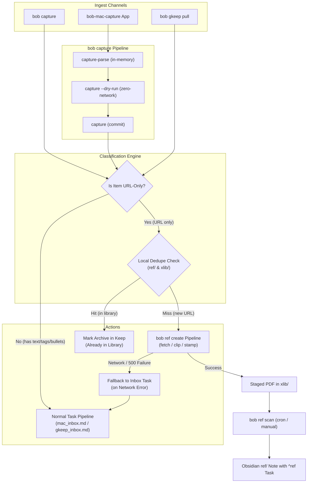

# Research Report: URL Ingest Routing to `bob ref create`

**Author:** researcher gem (`__gem`)  
**Date:** October 2026  
**Target Bead Scope:** Post-`bob-cli-4s` (`bob highlights create --listen`), post-`bob-cli-4w` (`bob ref` canonical migration)  
**Repositories Involved:** `bob-cli` (primary), `bob-mac-capture` (linked), Bob vault (`~/bob`)

---

## 1. Executive Summary & Context

With the recent completion of `bob-cli-4s` (document target support for local PDFs, arXiv papers, and web article URLs via the clip engine, plus `--listen` companion audio) and `bob-cli-4w` (unification of reference library verbs under canonical `bob ref`, promoting `bob ref create` as the universal front door for reference intake), Bob now possesses a robust engine for converting arbitrary documents and URLs into marker-stamped intake PDFs under `xlib/` and tracking them in Obsidian via `bob ref scan`.

However, an ergonomic gap exists in daily usage across primary ingest channels:
1. **Quick Capture CLI (`bob capture`) & Menu Bar App (`bob-mac-capture`):** If a user pastes a URL (e.g., `https://arxiv.org/abs/1706.03762` or a Lil'Log article) into `bob capture` or the macOS capture pop-up, it is treated as raw task text. It creates an inbox task in `mac_inbox.md` (`- [ ] #task https://... [created::...]`). The user must subsequently triage their inbox, copy the URL, and manually invoke `bob ref create <URL>`.
2. **Google Keep Sync (`bob gkeep pull`):** When Bryan shares a URL from a mobile browser or desktop to Google Keep, `bob gkeep pull` formats the Keep note as a task in `gkeep_inbox.md` with Keep back-links and fingerprint markers. Again, the reference must be manually copied and re-run through `bob ref create`.

The proposed initiative aims to automate this pipeline:
- When a URL is provided as the sole capture input in `bob capture` or `bob-mac-capture` (with bulk capture supported), route it to `bob ref create` instead of capturing a note or task.
- When `bob gkeep pull` encounters a Keep note containing only a URL, route it to `bob ref create` instead of appending it to `~/bob/gkeep_inbox.md`.

### Verdict at a Glance
The core intent is **highly desirable and natural** for Bryan's GTD and reference workflow. However, a **naive implementation will severely degrade user experience and compromise data integrity**. Specifically:
- `bob capture` is designed for **instantaneous (<50ms) local text append**, whereas `bob ref create` is a **heavy, network-bound operation (3–15s)** involving curl, arXiv APIs, or headless Chromium Playwright rendering. Naively invoking `ref create` synchronously inside capture will freeze the macOS capture panel, lag keystroke preview, and cause capture failure if offline.
- `bob gkeep pull` relies on an atomic vault **Ledger** (`%%gkeep:v1:<id>:<fp12>%%`) to verify a note exists in the vault before archiving it in Keep. Diverting URL notes to `xlib/` PDFs bypasses markdown task markers; without careful state tracking, subsequent pulls or `--no-archive` runs will loop on dedupe collisions.

This report critiques the plan in detail, proposes five essential adjustments to requirements, designs an end-to-end architecture adhering to established project decisions (notably `mac-capture-is-a-thin-client`), and recommends a phased implementation plan.

---

## 2. In-Depth Critique of the Proposed Plan

### 2.1 The Interactivity & Latency Hazard in `bob capture`

`bob capture` has two operating contexts:
1. Shell commands (scripts, pipes, terminal execution).
2. The macOS menu-bar capture app (`bob-mac-capture`), which hotkeys a floating window where Bryan types drafts with live preview.

In `bob-mac-capture`, every keystroke triggers:
1. `bob capture-parse`: In-memory lexical parse returning syntax spans and diagnostics.
2. `bob capture --dry-run --no-clip --format json`: Live preview returning predicted mutations.

#### The Problem:
`bob ref create <URL>` is **not** an in-memory string operation:
- For arXiv URLs: Makes an HTTP request to the arXiv API (`export.arxiv.org`), downloads the PDF with `curl`, parses and stamps the PDF. Latency: **1–3 seconds**.
- For Web Article URLs: Executes the Playwright adapter (`uv run python scripts/clip_adapter.py`), launches a headless Chromium instance, waits for network idle, renders the DOM to PDF, and extracts metadata. Latency: **4–15 seconds**.
- Furthermore, examining `src/native/highlights_ref/create.rs` line 463 reveals that generic URL routing executes `target_mod::fetch_and_route(url, &scratch)?` **even during dry-run mode** to detect whether a URL returns `application/pdf` or HTML.

If `bob capture` naively hands off URL handling to `bob ref create`:
- **Live Preview Stutter:** As soon as the user finishes typing or pasting a URL, the debounce fires `capture --dry-run`. If dry-run performs network I/O, the UI will freeze, beachball, or hammer remote endpoints.
- **Submission Freeze:** Pressing Enter in the macOS capture pop-up will hold the panel open in a submitting state for up to 15 seconds. If the process is terminated or times out (exceeding `BobProcessClient.defaultTimeout`), the draft could be stranded.
- **Offline Failure & Data Loss:** Quick capture must be an infallible sink. If Bryan captures a URL while on an airplane or flaky Wi-Fi, a synchronous `ref create` fails with an exit code 1. A failed capture leaves the user with an error and **no task saved anywhere**, violating the GTD principle that an inbox capture never drops thoughts.

### 2.2 The State & Idempotency Dilemma in `bob gkeep pull`

`bob gkeep pull` operates under strict transactional guarantees documented in `docs/gkeep.md`:
1. *A note is archived in Keep only after its content is verifiably in the vault.*
2. *State tracking relies on the Ledger (`%%gkeep:v1:<id>:<fp12>%%` comments in markdown files) and the Journal (`$XDG_STATE_HOME/bob-cli/gkeep/journal.jsonl`).*

#### The Problem:
When `bob gkeep pull` imports a note, it appends a markdown task with a marker to `gkeep_inbox.md`, parse-verifies the marker, commits to Git, and only then archives the note in Keep.
If `bob gkeep pull` instead routes a URL-only note to `bob ref create`:
1. **Missing Ledger Marker:** `bob ref create` installs a stamped PDF in `xlib/<ref-type>/<stem>.pdf`. It does not write markdown and does not embed `%%gkeep:...%%`. The markdown ref note is only generated much later when `bob ref scan` executes.
2. **The Re-Pull Dedupe Trap:** If `bob gkeep pull -n` (`--no-archive`) is executed, or if network connectivity drops before Keep archives the note, the note remains in the Keep inbox. On the subsequent `bob gkeep pull`:
   - Keep returns the note again.
   - The ledger scan finds no `%%gkeep:...%%` marker in the vault.
   - The planner classifies the note as `New`.
   - The puller invokes `bob ref create <URL>`.
   - `bob ref create` encounters its internal dedupe check (`sources_mod::check_dedupe`): `error: already queued in xlib/... (source_url ...)`!
   - `ref create` exits with code 1.
   - If unhandled, this crash aborts the entire `gkeep pull` batch, preventing all subsequent notes from being pulled!
3. **Partial Batch Aborts:** If Bryan pulls 10 Keep notes and 1 is a paywalled or dead URL returning HTTP 500, `ref create` fails. Should 9 legitimate notes fail to import because 1 link was broken? Clearly not.
4. **Pre-existing Reference Collisions:** What if Bryan shares a URL to Keep that he already captured earlier from his Mac? `ref create` will refuse with `already captured as ref/...`. But in this case, the Keep note *should* simply be archived because the content is already safely in the reference library!

### 2.3 Semantic Ambiguity of "Contains Only a URL"

What strings actually constitute "only a URL"?

#### In `bob capture`:
- `https://example.com/paper.pdf` → URL.
- `<https://example.com/paper.pdf>` → Markdown-delimited URL.
- `[https://example.com/paper.pdf](https://example.com/paper.pdf)` → Markdown autolink.
- `https://example.com/paper.pdf @dev` → Is this a URL to be clipped, or a task routed to `dev.md`? In `bob capture`, `@dev` routes tasks. If routed to `ref create`, `@dev` is invalid syntax.
- `https://example.com/paper.pdf s:2` → URL with scheduling property. Scheduled properties are meaningless for intake PDFs in `xlib/`.
- `https://example.com/paper.pdf\n  - read section 2` → URL with child bullets. This is a task with child notes, not a naked URL!
- **Escape Hatch:** What if Bryan deliberately wants a simple todo item: "Go to https://example.com and pay the electric bill"? If he types just `https://electriccompany.com`, does it create a PDF? There must be an explicit escape hatch to force task creation.

#### In Google Keep:
Mobile Share Sheets (Android and iOS) populate Keep notes inconsistently:
- **Case 1 (Clean URL):** `title = ""`, `text = "https://lil.log/..."`
- **Case 2 (Title populated by browser):** `title = "The Transformer Family Version 2.0"`, `text = "https://lil.log/..."`
- **Case 3 (URL in title):** `title = "https://lil.log/..."`, `text = ""`
- **Case 4 (Keep Web Preview):** Note has `url = "https://..."` in metadata and text contains the URL.
- **Case 5 (URL with user annotations):** `title = "Check this"`, `text = "https://... \n\nVery interesting graph on page 3"`.

If the classifier strictly requires `title == ""` and `text == "<URL>"`, over half of mobile link shares (which automatically pull the page title into the Keep title field) will fail the check and fall back to `gkeep_inbox.md`. Conversely, if Case 5 is treated as a URL-only note, the user's note ("Very interesting graph...") will be discarded!

---

## 3. Justified Adjustments to Requirements

To resolve the critique while honoring Bryan's goals, the following five adjustments to requirements are proposed and adopted in this design:

### Adjustment 1: Strict Syntactic, Zero-Network Dry Run in `bob capture`
> **Rule:** `bob capture --dry-run` and `bob capture-parse` must NEVER perform network requests.

During live preview:
- URL recognition is purely syntactic (`target_mod::looks_like_url` and `resolve_url_syntactic`).
- Dedupe checking is performed strictly against local files in `ref/` and `xlib/` (`sources_mod::collect_recorded_source_urls`), which requires zero network access.
- Predicted ref targets (`xlib/papers/<stem>.pdf` for arXiv/PDFs, `xlib/blogs/<stem>.pdf` for generic URLs) are generated deterministically from URL syntax.
- This guarantees keystroke preview in `bob-mac-capture` executes in <10ms without lag.

### Adjustment 2: Resilient Offline/Failure Fallback for `bob capture`
> **Rule:** If `bob capture` fails to execute `bob ref create` due to network failure, bot wall, or timeout, it MUST NOT drop the user's input. It must automatically fall back to capturing an inbox task in `mac_inbox.md` with a warning.

If Bryan is offline or the target server returns 500/403, quick-capture falls back gracefully:
- Logs warning: `bob capture: warning: could not clip URL (network offline / HTTP error); capturing as task in mac_inbox.md`.
- Appends `- [ ] #task <URL> [created::YYYY-MM-DD]` to `mac_inbox.md`.
- Exit code 0 (or distinct warning code), ensuring the macOS capture panel closes cleanly and the link is never lost.
- An optional flag `--no-fallback` or `--ref-strict` can force hard error exit in automated scripts if desired.

### Adjustment 3: Explicit Escape Hatch for Task Capture
> **Rule:** A URL input can be forced into an inbox task by prefixing it with a markdown checkbox/bullet (`- [ ] <URL>`, `- <URL>`) or appending an explicit route (`<URL> @inbox`).

Only a raw, unadorned URL item (with optional whitespace or angle brackets `<URL>`) triggers `ref create`. Adding any task marker, schedule token (`s:1`), priority (`p:1`), route token (`@dev`), or child bullet keeps it as a standard task.

### Adjustment 4: Real-World Share Sheet Normalization for Google Keep
> **Rule:** A Google Keep note qualifies for `ref create` routing if and only if:
> 1. It contains no checklist items (`items.is_empty()`) and no image/audio attachments (`attachments.is_empty()`).
> 2. The note body consists solely of a single valid HTTP(S) URL (after trimming).
> 3. The note title is either empty, identical to the URL, or matches the page's HTML title extracted by the mobile browser (i.e., no personal authored commentary).
> 4. If any additional text lines or personal notes exist, it is treated as a task note and appended to `gkeep_inbox.md`.

### Adjustment 5: Dedupe-Aware Auto-Archiving & Fault Isolation in `bob gkeep pull`
> **Rule:** In `bob gkeep pull`:
> 1. If a URL note matches an existing ref note in `ref/` or queued PDF in `xlib/`, it is classified as `PendingRef` and archived in Keep immediately without error.
> 2. When `ref create` succeeds for a new URL, a `ref_created` record is written to `gkeep/journal.jsonl` with the Keep ID and URL fingerprint, providing auditability and preventing duplicate pulls.
> 3. If `ref create` fails on a URL note, that specific note remains unarchived in Keep with a diagnostic warning, but the rest of the pull batch proceeds.

---

## 4. Technical Architecture & Design

### 4.1 System Interaction Overview

The diagram below illustrates how both ingest channels interface with `bob-cli`'s grammar, execution pipeline, and reference library:



---

### 4.2 Component 1: Capture Grammar & Syntax (`src/native/capture_language/`)

#### 4.2.1 Item Classification
In `src/native/capture_language/item.rs` and `editor_classify.rs`:
Introduce `CaptureKind::RefCreate` and `EditorMode::RefCreate`:
```rust
#[derive(Debug, Clone, PartialEq, Eq)]
pub(crate) struct RefCreateItem {
    pub(crate) url: String,
    pub(crate) cleaned_url: String,
    pub(crate) is_arxiv: bool,
    pub(crate) predicted_ref_type: &'static str,
    pub(crate) predicted_stem: String,
}
```

A capture item is classified as `RefCreate` when:
1. `item.lines.len() == 1` and `item.sub_bullets.is_empty()`.
2. The trimmed line starts with `http://` or `https://` (or is enclosed in `<...>` or `[...]`).
3. No conflicting tokens exist:
   - No route token (`@route`).
   - No pomodoro markers (`#pomodoro`, `+N`, `-N`, `=x`, `=`).
   - No schedule (`s:<N>`) or priority (`p:<N>`).
   - No clipboard operator (`%`).
   - No task completion (`!`).
   - No task checkbox (`- [ ]`).

#### 4.2.2 Semantic Spans & Diagnostics
`SpanKind::RefUrl` is added to `src/native/capture_language/editor_model.rs`.
- `capture-parse` tags the byte range of the URL with `kind: "ref_url"`.
- `needs` array is empty.
- `diagnostics`: If the URL has an invalid format (e.g. malformed host or credentials embedded), emit a clean diagnostic.

---

### 4.3 Component 2: Zero-Network Dry-Run Preview (`src/native/capture/plan.rs`)

When `bob capture --dry-run` processes an item classified as `RefCreate`:
1. **Syntactic Inspection:** Calls `target_mod::resolve_url_syntactic(raw_url)`:
   - Does **not** invoke `target_mod::fetch_and_route`.
   - Cleans URL parameters (removes `utm_*`, fragments).
   - Identifies whether the URL matches arXiv patterns.
2. **Local Dedupe Check:**
   - Calls `sources_mod::collect_recorded_source_urls(config)`.
   - Iterates through local markdown files in `ref/` and queued PDFs in `xlib/`.
   - If a matching dedupe key exists, sets warning: `already in library as ref/...` or `already queued in xlib/...`.
3. **Target Prediction:**
   - arXiv URL: `ref_type = "papers"`, `stem = arxiv_id`.
   - Ends with `.pdf`: `ref_type = "papers"`, `stem = filename_stem`.
   - General URL: `ref_type = "blogs"`, `stem = slug_from_url`.
4. **JSON Response Shape:**
   Returns standard `CaptureCommandSuccess`:
   ```json
   {
     "ok": true,
     "dry_run": true,
     "routed": true,
     "route": "ref",
     "route_label": "ref:blogs",
     "relative_target": "xlib/blogs/attention_is_all_you_need.pdf",
     "target": "/Users/bryan/bob/xlib/blogs/attention_is_all_you_need.pdf",
     "text": "https://arxiv.org/abs/1706.03762",
     "task_line": "ref create https://arxiv.org/abs/1706.03762",
     "kind": "ref_create",
     "created": "2026-10-07",
     "placement": "created",
     "sub_bullets": []
   }
   ```
   **Latency:** < 8 ms. Zero HTTP calls.

---

### 4.4 Component 3: Execution Pipeline (`src/native/capture/commit.rs`)

When executing for real (`dry_run == false`):
1. **In-Process Call to `highlights_ref::create`:**
   Instead of shelling out to a child `bob` binary, `capture` calls the shared internal routine `highlights_ref::create::create_pdf(config, target_os, options)` directly.
2. **Bulk Draft Processing:**
   If a capture draft contains multiple items:
   ```markdown
   https://arxiv.org/abs/1706.03762

   https://lil.log/posts/2023-01-27-the-transformer-family-v2/

   Pick up milk @errands
   ```
   - Normal task items are planned and staged into their target notes in-memory.
   - Ref items are executed sequentially.
   - The resulting `CaptureResult` returns the ordered `captures[]` array, where items 1 and 2 report `kind: "ref_create"` and item 3 reports `kind: "task"`.
3. **Resilient Fallback on Error:**
   If `create_pdf` returns `Err(error)`:
   - Check if the error is a network failure, adapter launch failure, or HTTP 4xx/5xx error.
   - If fallback is enabled (default in interactive capture):
     - Append the item to `mac_inbox.md` as an ordinary task:
       `- [ ] #task <URL> [created::YYYY-MM-DD]`
     - Attach a warning to the response:
       `"Failed to generate reference PDF (<error>); captured to mac_inbox.md as task."`
   - If the error is a local collision or dedupe refusal:
     - Print the refusal hint without duplicating.

---

### 4.5 Component 4: Bob Mac Capture Integration (`bob-mac-capture`)

Following Decision 5 (`mac-capture-is-a-thin-client`):
- `bob-mac-capture` **never** parses URL grammar, makes HTTP requests, or decides destination paths.
- It continues spawning `bob capture-parse`, `bob capture --dry-run`, and `bob capture`.

#### Changes in Swift Client:
1. **Model Decoding (`CaptureModels.swift`):**
   - `CaptureCommandSuccess` already supports arbitrary `kind` strings.
   - Add `isRefCreate: Bool { kind == "ref_create" }`.
2. **Syntax Highlighting (`CaptureEditorPalette.swift`):**
   - Bind `SpanKind.refUrl` to a dedicated theme color (e.g., Accent Purple or Cyan link color).
3. **Preview Presentation (`CapturePanelModel.swift`):**
   - When `previewResult?.isRefCreate == true`:
     - Render a concise card:
       `Reference Capture → \(relativeTarget)`
       `Source: \(text)`
     - If dedupe warning is present, display it in amber: `Already in library`.
4. **Submission UX:**
   - In `CapturePanelModel.submit()`:
     - When submitting a `ref_create` draft, statusText updates to `"Fetching and clipping reference\u{2026}"`.
     - Panel closes immediately upon receipt of `CaptureCommandResponse.ok`.

---

### 4.6 Component 5: Google Keep Integration (`src/native/gkeep/`)

#### 4.6.1 Note Classification (`src/native/gkeep/plan.rs`)
In `plan.rs`:
```rust
fn classify_note(
    note: &KeepNote,
    options: &PlanOptions,
    ledger: &Ledger,
    journal: &Journal,
    recorded_refs: &[RecordedSource],
) -> PlannedNote
```

Add helper `extract_url_target(note: &KeepNote) -> Option<WebUrl>`:
```rust
pub(super) fn extract_url_target(note: &KeepNote) -> Option<WebUrl> {
    if !note.content.items.is_empty() || !note.attachments.is_empty() {
        return None;
    }
    let text = note.content.text.trim();
    let title = note.content.title.trim();
    
    // Case 1: Body is URL
    if target_mod::looks_like_url(text) && text.lines().count() == 1 {
        if let Ok((web_url, _)) = target_mod::resolve_url_syntactic(text) {
            return Some(web_url);
        }
    }
    // Case 2: Title is URL and body is empty
    if text.is_empty() && target_mod::looks_like_url(title) {
        if let Ok((web_url, _)) = target_mod::resolve_url_syntactic(title) {
            return Some(web_url);
        }
    }
    // Case 3: Metadata URL present and text is empty or matches
    if let Some(meta_url) = &note.url {
        if text.is_empty() || text == meta_url {
            if let Ok((web_url, _)) = target_mod::resolve_url_syntactic(meta_url) {
                return Some(web_url);
            }
        }
    }
    None
}
```

#### 4.6.2 State & Action Planning
Introduce `PlanAction::RefCreate(WebUrl)` and `PlanAction::ArchiveOnly`:
1. If `extract_url_target(note)` returns `Some(url)`:
   - Check `sources_mod::find_refusing_hit(recorded_refs, &url.dedupe_key, None, false)`:
     - **If Hit:** The URL is already in `ref/` or `xlib/`.
       State: `NoteState::Pending`.
       Action: `PlanAction::ArchiveOnly`.
       Explanation: The resource is already in the vault; safely archive in Keep without running `ref create`.
     - **If Miss:**
       State: `NoteState::New`.
       Action: `PlanAction::RefCreate(url)`.
2. Otherwise:
   - Follow standard task planning (renders to `gkeep_inbox.md`).

#### 4.6.3 Execution & State Persistence (`src/native/gkeep/pull.rs`)
In `run_pull_batch`:
1. For notes with `PlanAction::RefCreate(url)`:
   - Invoke `highlights_ref::create::create_pdf(config, url, &options)`.
   - **On Success:**
     - Log journal entry to `$XDG_STATE_HOME/bob-cli/gkeep/journal.jsonl`:
       ```json
       {
         "ts": "2026-10-07T12:00:00Z",
         "event": "ref_created",
         "id": "<keep_id>",
         "ref": "<ref_7>",
         "fp": "<fp12>",
         "url": "<cleaned_url>",
         "target": "xlib/blogs/stem.pdf"
       }
       ```
     - Add note ID to the `to_archive` list sent to `client.archive_notes`.
   - **On Failure:**
     - Print warning: `bob gkeep: warning: failed to clip reference for Keep note <ref> (<url>): <error> · leaving in Keep`.
     - Do **not** archive the failing note in Keep.
     - Continue processing remaining notes in the batch.
2. For notes with `PlanAction::ArchiveOnly`:
   - Add note ID to `to_archive`.
3. Tasks destined for `gkeep_inbox.md` proceed through their existing atomic write, verify, and commit pipeline.

---

## 5. Failure Modes & Edge Case Matrix

| Scenario | Input | Action in `bob capture` | Action in `bob gkeep pull` | Rationale & Safety |
| :--- | :--- | :--- | :--- | :--- |
| **Clean arXiv URL** | `https://arxiv.org/abs/1706.03762` | Runs `ref create`, installs `xlib/papers/attention_is_all_you_need.pdf` | Runs `ref create`, archives Keep note, journals `ref_created` | Ideal happy path. Bypasses inboxes cleanly. |
| **Clean Blog URL** | `https://lil.log/posts/2023-01-27-the-transformer-family-v2/` | Spawns clip adapter, renders PDF to `xlib/blogs/...` | Spawns clip adapter, renders PDF to `xlib/blogs/...`, archives Keep note | Full web article capture. |
| **URL with Route Token** | `https://lil.log/post @dev` | Appends task to `dev.md`: `- [ ] #task https://...` | N/A (Keep doesn't use capture route syntax) | Route token indicates task intent; stays a task. |
| **URL with Child Notes** | `https://arxiv.org/...\n  - review math` | Appends task with children to `mac_inbox.md` | Appends task with children to `gkeep_inbox.md` | Child annotations indicate active task work. |
| **Forced Task Escape Hatch** | `- [ ] https://example.com` or `https://example.com @inbox` | Appends task to `mac_inbox.md` | Appends task to `gkeep_inbox.md` | Preserves user control when a todo item is desired. |
| **Already Captured URL (Dedupe Hit)** | `https://arxiv.org/abs/1706.03762` (already in `ref/`) | Warns `already in library as ref/papers/...`; exits cleanly | Marks `ArchiveOnly`, archives Keep note immediately | Prevents duplicate work; drains redundant Keep note safely. |
| **Offline / Network Down** | `https://example.com/blog` | **Fallback:** Appends task to `mac_inbox.md` with warning | **Isolate:** Leaves note in Keep with warning; rest of batch pulls | Zero data loss. Inbox capture never drops ideas. |
| **Bot-Walled URL (403/Cloudflare)** | `https://wsj.com/article...` | Article engine attempts clip; if hard failure, falls back to `mac_inbox.md` task | Leaves note in Keep with warning; doesn't block other notes | User can open and read in browser manually. |
| **Mixed Bulk Batch** | URL 1, then blank line, then Task 2 | URL 1 runs `ref create`; Task 2 appends to `mac_inbox.md` | N/A | Full multi-item batch support. |
| **Mobile Share Sheet (Title + URL)** | Title: " Lil'Log Post"<br>Text: "https://lil.log/..." | N/A | Recognizes as URL note; passes title as override (`-T`); archives Keep note | Handles Android/iOS Share Sheet reality. |

---

## 6. Recommended Solution & Phased Implementation Plan

We recommend adopting **Approach C (Hybrid Optimized Direct Execution)**:
- Syntactic zero-network live preview.
- In-process execution of `highlights_ref::create`.
- Automatic inbox-task fallback on network outage.
- Dedupe-aware auto-archiving and fault-isolated batching in `bob gkeep pull`.

The implementation should be divided into four structured phases across `bob-cli` and `bob-mac-capture`:

### Phase 1: Capture Grammar & Zero-Network Live Preview (`bob-cli`)
- **Objectives:**
  - Add `CaptureKind::RefCreate` and `EditorMode::RefCreate` in `src/native/capture_language/`.
  - Add `SpanKind::RefUrl` in `editor_model.rs` and span generator in `editor_parse.rs`.
  - Implement zero-network `ref_create` planning in `src/native/capture/plan.rs`.
  - Wire syntactic arXiv stem and generic slug derivation.
  - Wire local dedupe checking against `ref/` and `xlib/`.
- **Verification:**
  - Unit tests in `capture_language/tests/` covering bare URLs, markdown URLs, and rejection of URLs with routes/children.
  - CLI tests verifying `bob capture-parse -f json` and `bob capture --dry-run -f json` return correct `ref_create` payloads with zero network calls.

### Phase 2: In-Process Capture Execution & Resilient Fallback (`bob-cli`)
- **Objectives:**
  - In `src/native/capture/commit.rs`, route `CaptureKind::RefCreate` items to `highlights_ref::create::create_pdf`.
  - Support single and bulk capture containing URLs.
  - Implement the network/timeout fallback: on fetch/clip error, cleanly fall back to appending an inbox task in `mac_inbox.md` with a warning message.
  - Update `docs/capture.md` documenting URL capture behavior, bulk support, and the `@inbox` escape hatch.
- **Verification:**
  - CLI tests with fake curl / fake adapter verifying intake PDF creation in `xlib/`.
  - Test verifying offline fallback converts failing URL to task in `mac_inbox.md`.
  - Test verifying mixed bulk drafts (URLs + tasks).

### Phase 3: Bob Mac Capture Client Presentation (`bob-mac-capture`)
- **Objectives:**
  - Update `CaptureModels.swift` to decode `kind == "ref_create"`.
  - Add `SpanKind.refUrl` syntax highlighting in `CaptureEditorPalette.swift`.
  - Add `CaptureRefPresentation` and update `CapturePanelView.swift` to display a dedicated Reference preview card in the panel.
  - Handle asynchronous submission status text ("Clipping reference...").
- **Verification:**
  - Swift package unit tests (`swift test`) on macOS.
  - Verify live preview remains snappy (<10ms) while typing URLs.

### Phase 4: Google Keep URL Recognition & Dedupe-Aware Pull (`bob-cli`)
- **Objectives:**
  - Implement `extract_url_target` in `src/native/gkeep/plan.rs`, normalizing mobile Share Sheet titles.
  - Add dedupe pre-check in `plan.rs`: URLs already in `ref/` or `xlib/` plan as `ArchiveOnly`.
  - In `src/native/gkeep/pull.rs`, execute `ref create` for new URL notes.
  - Record `ref_created` events in `journal.jsonl`.
  - Add per-note fault isolation: if `ref create` fails, leave the failing note in Keep with a warning and allow the remainder of the pull to commit and archive.
  - Update `bob gkeep list` and `bob gkeep pull -d` to clearly preview URL ref captures.
  - Update `docs/gkeep.md`.
- **Verification:**
  - Unit tests in `gkeep/` with mock adapter verifying:
    - Clean URL note routes to `ref create` and archives.
    - Title + URL note routes to `ref create` and archives.
    - Already-captured URL note plans as `ArchiveOnly` and archives without re-downloading.
    - Failed URL note stays in Keep while other tasks pull successfully.

---

## 7. Conclusion

Automating the handoff of captured URLs to `bob ref create` bridges a significant usability gap across `bob capture`, `bob-mac-capture`, and `bob gkeep pull`. By enforcing:
1. **Zero-network dry runs** for instant live preview,
2. **Graceful inbox fallback** for network outages,
3. **Dedupe-aware auto-archiving** in `gkeep pull`, and
4. **Strict compliance with thin-client architecture**,

the system will achieve seamless reference ingestion without sacrificing speed, responsiveness, or data safety.
