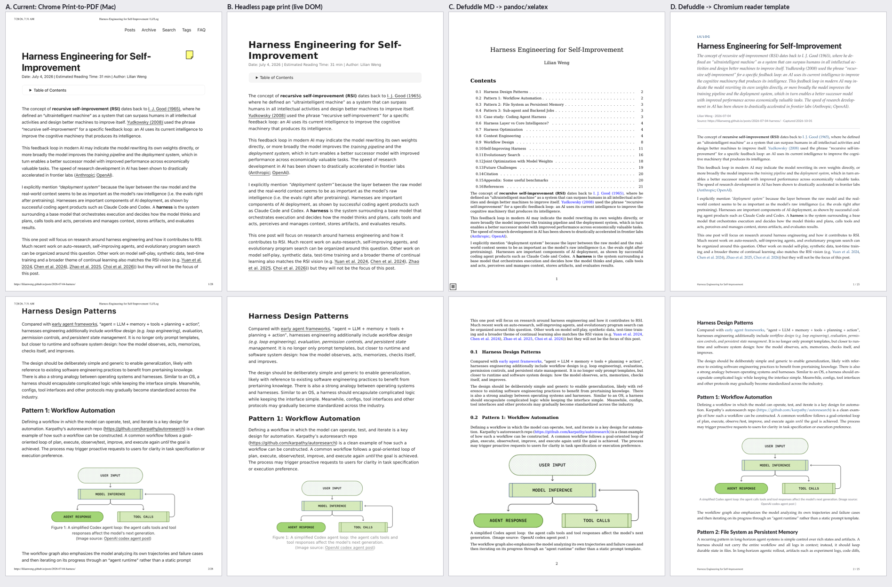

# Web URL → Highlights-Ready Reference PDF (researcher `cld`)

**Question.** What is the most reliable way to turn a web URL (for example
`https://openai.com/index/open-source-codex-orchestration-symphony/`) into a beautiful,
readable PDF that enters the Bob vault as a reference: a PDF in the Highlights library plus a
reference note under `~/bob/ref/`, by analogy with `bob highlights create -i` for Markdown?
Is it a good idea, what would I change, and what should be built?

**Method.** I read the `bob highlights` code and docs, inspected the vault's current web
references, and ran experiments on apollo (Linux) against three real articles: the OpenAI
Symphony post, Lilian Weng's "Harness Engineering for Self-Improvement" (Lil'Log), and Stan's
"netclode" post. The experiments covered 8 fetch channels, 3 content extractors, 4 rendering
pipelines, a PDF-size study, and a marker round trip through bob's own `lopdf` 0.40 code
path. All numbers below come from those runs on 2026-10-01.

---

## 0. TL;DR

- **Yes, build it**, but treat it as **capture** (a faithful-enough, immutable snapshot with
  provenance), not just "conversion". Today's manual flow (Chrome Print-to-PDF on the Mac,
  rename, move into `lib/blogs`, add a sticky-note marker by hand) has produced **4 blog refs
  vs 237 chat refs**. The output also has avoidable defects: browser timestamp headers, site
  navigation, a 20 MB / 64-page PDF, titles that fall back to the filename ("build with muse
  code"), and no standard `source_url`.
- **The hard part isn't the PDF; it's getting the page and not losing content.** Every
  headless fetch of the example URL was blocked by Cloudflare: curl, both headless Chromium
  modes, Defuddle's fetcher, and Claude's WebFetch all got 403 "Just a moment…". Only a
  rendering proxy (Jina Reader) got through, and presumably Bryan's real Chrome does too. On
  that page, **all three extractors silently dropped both diagrams**, two of three picked an
  embedded tweet's author as the byline, and one took a tweet's `<time>` as the publish date.
- **Rendering: use headless Chromium with a Bob-owned print template, not pandoc/xelatex,
  for web content.** The LaTeX path is beautiful for Markdown research reports, but on web
  content it **hard-fails on SVG and WebP images** and turns emoji/CJK into tofu. Chromium
  renders SVG, WebP, MathML, tables and `<details>` natively, produces PDF outlines, does
  page-number footers via CSS margin boxes, and rendered in 0.3–1.7 s.
- **Recommended shape:** extend `bob highlights create` so `SOURCE` may be an `http(s)` URL.
  Implement it as a pinned, embedded **web-capture adapter** run via `uv run --script` with a
  JSON stdin/stdout protocol, exactly like the existing `bob gkeep` adapter. The adapter
  drives Chromium (Playwright), runs a vendored **Defuddle** in the page, localizes and
  recompresses images, and prints a Bob reader template. Rust keeps everything
  Highlights-specific: target planning (`xlib/blogs/<slug>.pdf`), collision refusal, marker
  composition (now with `source_url`, `author`, `published`), marker embedding, and atomic
  install. The **reference note stays the job of the existing `bob highlights scan`**.
- **Reliability comes from refusing to guess:**
  - detect bot walls and fail with fallbacks (`--html FILE`, macOS `--from-chrome`, opt-in
    `--via jina`);
  - run a fidelity check that warns when the extraction dropped images or code the page
    showed;
  - provide a `--mode page` escape hatch (print the page itself);
  - accept metadata overrides (`--title`, `--author`, `--published`).



*Figure: the same Lil'Log article, page 1 (top) and page 2 (bottom). A = Bryan's current
Chrome print (Mac), B = headless page print, C = Defuddle Markdown → existing pandoc/xelatex
`create`, D = Defuddle → Chromium reader template (prototype). Note D's dek duplicates the
first paragraph, a fixable template bug discussed in §6.4.*

---

## 1. What exists today (the analogy we're extending)

### 1.1 `bob highlights create` (Markdown → PDF)

- `src/native/highlights_ref/create.rs:282` `plan_create` takes the title from frontmatter
  `title` → first H1 → file stem. It derives the target `xlib/<ref_type>/<stem>.pdf` (default
  `ref_type` is `chat`, `create.rs:22`) and refuses collisions (`create.rs:360`): an existing
  same-stem `.md` sidecar, an occupied library destination, or an existing target without
  `--force`.
- `create.rs:667` `render_and_install` runs pandoc with `--pdf-engine=xelatex`, a TOC,
  numbered sections, DejaVu fonts, an `fvextra` code-wrapping preamble and a Lua filter that
  adds break points in inline code. It then loads the PDF with `lopdf`.
- `create.rs:746` `embed_marker` adds a page-1 `/Text` annotation holding the marker list
  (`status`, `parent`, `title`, optional `id`). `marker.rs:177` `atomic_save_pdf` installs it.
- `-i/--include-id` adds `id: <md stem>`. The sase research `file_hooks` entry runs
  `bob highlights create --include-id` on every research report, which is why `ref/chat/` has
  237 notes.

### 1.2 How a PDF becomes a reference note

The PDF lands in `~/bob/xlib/<ref_type>/` (on athena/apollo for agent output). On the Mac,
the `bob_xlib_pull` pre-scan hook pulls it over SSH, and `bob highlights scan` moves it to
`lib/<ref_type>/` and writes `ref/<ref_type>/<stem>.md`. The note gets frontmatter synced from
the marker, a lifecycle task `- [ ] #task #ref [[lib/…pdf]] #hide ^ref`, and the managed
highlights region fed by the Highlights app's sidecar.

**Important for this feature:** `source_url`, `author`, and `published` are already
**standard synced marker fields** (`src/native/highlights_ref/mod.rs:143-153`). A web capture
only has to put them in the marker and the existing scan carries them into the reference
note's frontmatter. No new note-writing code is needed.

### 1.3 How web pages get in today (evidence from the vault)

| PDF (`lib/blogs`, `lib/docs`) | Producer | Pages / size | Marker |
| --- | --- | --- | --- |
| `netclode.pdf` | Chrome 149 Print-to-PDF, macOS Quartz | 64 p / **20 MB** | hand-added; no title/url |
| `harness_for_rsi.pdf` | Chrome 150 Print-to-PDF | 28 p / 3.9 MB | hand-added |
| `build_with_muse_code.pdf` | Chrome 151 Print-to-PDF | 15 p / 0.8 MB | hand-added; page 1 shows "Hero image" / "Meta blue bg" alt-text junk |
| `steve_kinney_agent_memory.pdf` | Chrome 148 Print-to-PDF | 21 p / 0.7 MB | hand-added ad hoc `url:` (not the standard `source_url`) |
| 9 of 11 `lib/docs/*.pdf` | Chrome Print-to-PDF | — | hand-added |

The resulting notes are titled from the basename (`# build with muse code`, `# netclode`)
because the hand-written markers carry no `title`. Page 1 of each print still has Chrome's
date/title header and URL footer, plus site navigation. Only one of four blog refs records
its URL. Highlight text taken from these prints shows text-layer splits (Steve Kinney's
note quotes "Hu et al. p ublished").

---

## 2. What "reliable" and "beautiful" should mean

I'd hold any solution to these acceptance criteria:

1. **No silent content loss.** If the page showed diagrams, code, or tables, the PDF has them,
   or the command says loudly that it doesn't.
2. **Deterministic failure on blocked pages**, with a concrete next step (not a PDF of a
   Cloudflare interstitial).
3. **Correct provenance**: `source_url`, title, author, published date (or none, rather than a
   wrong one), and capture date.
4. **Readable typography**: a comfortable measure, real headings and a PDF outline, figures
   that don't split across pages, code that wraps, page numbers, and no site chrome.
5. **Highlights-friendly text layer**: no auto-hyphenation, no zero-width junk, tagged PDF.
   Highlight quotes are copied from this layer into the vault.
6. **Reasonable size**: single-digit MB for image-heavy posts, not 20 MB.
7. **Same vault contract as Markdown create**: marker, `xlib` intake, collision refusal,
   `scan` creates the note.
8. **Runs headless on agent hosts and on the Mac.**

---

## 3. Experiments and findings

### 3.1 Fetching: the example URL is bot-walled for every headless client

| Channel (OpenAI Symphony URL) | Result |
| --- | --- |
| `curl` (Chrome UA) | **403**, Cloudflare challenge page |
| Playwright Chromium `chrome-headless-shell` 153 | **403**, title "Just a moment…" (15 s) |
| Playwright full Chromium, new headless, `AutomationControlled` disabled | **403**, "Just a moment…" after 30 s of waiting |
| `defuddle parse <url>` (Node fetch) | **403** |
| Claude WebFetch | **403** |
| Wayback Machine availability API | no snapshot |
| `openai.com/news/rss.xml` | 200, but **metadata only** (title, description, `pubDate` 2026-04-27, category) |
| Jina Reader `r.jina.ai/<url>` | **200**: default Markdown includes all site nav/footer; `X-Return-Format: html` returned the rendered DOM (880 KB) |

By contrast, Lil'Log and stanislas.blog loaded fine headlessly (6 s and 15 s with
`networkidle`). A replay of OpenAI's captured DOM at its real origin rendered **unstyled**:
117 of the page's static-asset requests also got 403. So "faithful page print" is impossible
headlessly for bot-walled sites; only reader-style re-typesetting works there, or capturing in
the real browser.

**Implications.**

- A headless-only design will fail on exactly the high-profile sources (OpenAI,
  Medium-style CDNs) Bryan is likely to clip. The design must accept a DOM captured in the
  real browser (`--html`, macOS `--from-chrome`) and should detect challenge pages
  explicitly.
- I would **not** adopt stealth/anti-detection plugins. It's an arms race, it's fragile, and
  it's at odds with site terms. Bryan's own browser session is the legitimate path.
- Jina Reader works, but it's a third party that sees every URL. Free use is rate-limited
  (about 20 requests/min without a key, per its 2026 docs). It should be an explicit opt-in
  (`--via jina`), never a silent default.

### 3.2 Extraction: all extractors are heuristic, and they fail differently

Run on the same rendered OpenAI DOM:

| Extractor | Title | Author | Published | Diagrams (2 in page) | Embedded `SPEC.md` (~7k words) |
| --- | --- | --- | --- | --- | --- |
| **Defuddle 0.19.4** (Obsidian Web Clipper's engine) | ✓ (keeps og:title's trailing ".") | ✓ | ✗ 2026-03-08, an embedded tweet's `<time>` | **0** | ✓ kept |
| Mozilla Readability 0.6.0 | ✓ | ✗ "Caleeeb@gearcaleeeb·Follow" (tweet) | none | **0** | ✗ dropped |
| trafilatura | ✓ | ✗ "Caleeeb · Follow" | ✓ 2026-04-27 | **0** (kept 5 tweet avatars instead) | ✗ dropped |
| Defuddle **in-page** (bundle injected into Chromium) | same as CLI | ✓ | ✗ same tweet date | **0** | ✓ |

The diagrams are `<picture>` elements with light/dark/mobile `<source>` variants inside
`overflow-hidden` / `transition-opacity` wrappers. Removing the `<source>` tags and
`data-nosnippet` did not change Defuddle's verdict.

On friendlier pages Defuddle was excellent:

- **Lil'Log:** correct title, author, date, and site; **18/18 images**; MathJax converted to
  **42 native MathML** elements; tables and code kept.
- **netclode:** correct metadata, 18 images, 17 code blocks.

**Implications.** Use Defuddle; it's the best of the three and aligned with the Obsidian
ecosystem. But add:

- **metadata layering and overrides**, ignoring candidates inside embeds such as tweets and
  iframes;
- a **fidelity check** that compares what the page showed with what was kept;
- a human-in-the-loop path: keep the extracted source, re-render from edited HTML or
  Markdown, or switch to `--mode page`.

### 3.3 Rendering: four pipelines compared

| Pipeline | Lil'Log | netclode | OpenAI (via Jina DOM) | Notes |
| --- | --- | --- | --- | --- |
| **A. Chrome Print-to-PDF (current, Mac)** | 28 p, 3.9 MB | 64 p, **20 MB** | (would work in real browser) | browser header/footer, nav, collapsed TOC, hand marker |
| **B. Headless page print** (`emulate_media("print")`, cleanup CSS) | 31 p, 3.5 MB | 60 p, 19 MB | blocked / unstyled | `<details>` TOC printed collapsed |
| **C. Defuddle Markdown → existing `bob highlights create`** (pandoc/xelatex) | 23 p, 3.6 MB, **22 s** | — | 32 p, 0.1 MB, no images; SPEC as 28 pages of monospace | "0.1 / 0.10Self-Improving…" numbering because articles start at H2; **SVG and WebP hard-fail the whole render**; emoji/CJK render as tofu |
| **D. Defuddle → Chromium reader template** (prototype) | 25 p, 3.7 MB, render **1.7 s** | 53 p, **3.3 MB** (images localized + JPEG) | 31 p, 2.3 MB with 2 rescued diagrams | SVG/WebP/MathML/CJK/tables native; outline + `n / N` footer; never "fails to compile" |

Details worth knowing:

- **The LaTeX path's failure mode is the problem.** Without `rsvg-convert` (not installed on
  apollo; TinyTeX also lacks `svg.sty`), one SVG image made pandoc exit 43. One WebP image
  failed with "Cannot determine size of graphic". Web content is full of both. Emoji 🚀✅ and
  CJK 日本語 rendered as missing glyphs with DejaVu. Each is fixable (convert images,
  font fallback chains), but that's a long tail of fixes for a renderer that wasn't made for
  HTML.
- **The LaTeX path still produced very good math and solid text** (panel C). It remains the
  right engine for the research Markdown it was built for.
- **The Chrome CLI alone is enough for rendering.**
  `chrome --headless --no-pdf-header-footer --generate-pdf-document-outline
  --print-to-pdf=out.pdf file://…` produced a 25-page PDF with a correct heading outline.
  CSS page margin boxes (`@page { @bottom-right { content: counter(page) " / "
  counter(pages) } }`, supported since Chrome 131) produced "3 / 25" footers with no
  Playwright header/footer templates. `--dump-dom` returned the JS-rendered DOM. So
  rendering doesn't strictly need Playwright. Lazy-image scrolling, in-page extraction,
  `<details>` expansion, and request routing do.

### 3.4 PDF size: Chromium stores non-JPEG images as lossless Flate

For netclode, the extracted article's 18 images printed from their remote URLs gave a 9.8 MB
PDF. `mutool info -I` showed every image as `[ Flate ] 1320×…`: Chromium/Skia re-encodes
WebP/PNG losslessly. Pointing `` at local JPEGs (largest `srcset` candidate, ≤1400 px,
quality 82) made Chromium **pass them through as DCT**, giving **3.3 MB at full resolution**
(about 6× smaller than the current 20 MB Chrome print).

Two gotchas:

- Chromium prefers `srcset` over `src`, so `srcset`/`<source>` must be stripped after
  localizing.
- Naively using `src` picked a 330 px thumbnail.

Keep SVG as vectors.

### 3.5 Highlights compatibility: the marker round trip works on Chromium PDFs

Using `lopdf = "=0.40.0"` (bob's exact version) and the same annotation shape as
`embed_marker`, I added a page-1 `/Text` marker (`status`, `parent`, `title`, `source_url`)
to three Chromium-generated PDFs (tagged, with outline). `bob highlights marker` parsed it
back verbatim (`marker_note: 1`), and the outline survived the `lopdf` save. **No new PDF
plumbing is needed.**

### 3.6 Text-layer gotchas that matter for highlights

- **Auto-hyphenation leaks into highlight text.** With `hyphens: auto` + justified text, the
  reader PDF had 104 hyphenated line ends in 25 pages (e.g. "recursive self-im-" /
  "provement"); the LaTeX PDF had 29. bob's render-time healer joins `lower-` + `lower`, so a
  genuine compound broken at its hyphen ("self-" / "improvement") would become
  "selfimprovement". **Use `hyphens: manual` and ragged-right text.**
- **Zero-width characters:** OpenAI link text carries U+2060 word joiners ("harness
  engineering⁠"). Strip them during normalization rather than relying on the healer.
- **`<details>` must be force-opened.** Lil'Log's TOC printed collapsed in pipelines A and B,
  and a collapsed section in my stress test printed only its summary.
- **Scroll boxes:** OpenAI's embedded `SPEC.md` lives in a fixed-height scroll container.
  Print CSS must clear `max-height`/`overflow` on `pre` and similar boxes, or a page print
  keeps only the visible portion.
- **Chromium on agent hosts:** full Chromium aborted with "Socket path too long" because
  SASE's per-agent `TMPDIR` is deep. The adapter must point `TMPDIR` / `--user-data-dir` at
  a short path. Playwright also launches Linux Chromium with `--no-sandbox` by default; turn
  the sandbox on where the host allows it, since pages are untrusted JS.

### 3.7 The cheapest possible MVP works, within limits

`defuddle parse <url> --md -f > clip.md && bob highlights create clip.md -t blogs` produced a
correct, marker-stamped 23-page PDF of Lil'Log in about 23 s (panel C). It fails on
bot-walled pages, SVG/WebP images, emoji/CJK, and numbering. It's a fine stopgap for simple
blogs, not the end state.

---

## 4. Options considered

| # | Approach | Verdict |
| --- | --- | --- |
| 1 | **Keep manual Chrome Print-to-PDF**, maybe automate the marker | Lowest effort; keeps the defects in §1.3; no agent use. Rejected as the end state. |
| 2 | **Faithful page print only** (headless Chromium + print CSS) | Good for print-friendly blogs (panel B ≈ A), but site chrome varies, PDFs are huge, and it's impossible on bot-walled sites. Keep as `--mode page`. |
| 3 | **URL → Markdown (Defuddle / Obsidian Web Clipper) → existing pandoc/xelatex `create`** | Maximum code reuse and an editable intermediate, but brittle on web images (SVG/WebP hard-fail), emoji/CJK, wide tables and raw HTML. Good stopgap (§7, Phase 0). |
| 4 | **Defuddle → Bob HTML print template → Chromium** (Python/Playwright adapter, Rust owns the Highlights contract) | **Recommended.** Web-native rendering, fastest, best-looking in tests, robust; matches the gkeep adapter precedent. |
| 5 | Same as 4, but all in Rust (CDP crate such as `chromiumoxide`; `dom_smoothie` Readability port; `image` crate) | Single binary, but adds an async runtime (bob-cli has none), a Readability-class extractor (weaker than Defuddle in §3.2), and more code to own. Revisit only if the uv/Playwright dependency proves painful. |
| 6 | Same as 4, but Rust shells out to `chrome --dump-dom` / `--print-to-pdf` and Node `defuddle` | Viable (both CLI paths verified) but needs Node + npm pins, can't scroll lazy images, run in-page extraction, or route `--html` replays at the real origin, and needs Rust HTML rewriting. |
| 7 | Other renderers: WeasyPrint (no JS, no MathML), Typst via pandoc (fast, pretty, but HTML→Typst is lossy), wkhtmltopdf (**archived 2023**, 2012-era WebKit, open CVEs), Paged.js (only needed for footnotes/running heads beyond margin boxes) | Not better than Chromium for this input; wkhtmltopdf ruled out. |
| 8 | **Don't make PDFs at all**: Obsidian Web Clipper to Markdown + in-Obsidian highlighting, or Readwise Reader | Lower friction and no new tooling, but abandons the Highlights reading surface, page anchors and the `^ref` lifecycle; Readwise adds a paid second system. Rejected, but Web Clipper is useful as a capture front end (§7.4 Phase 0). |
| 9 | Prior art **percollate** (Readability + Puppeteer → PDF/EPUB) | Same architecture as #4 and worth borrowing CSS ideas from, but Readability did worst here, its last release is about a year old, and it knows nothing about markers or intake. Don't depend on it. |

---

## 5. Critique: is this a good idea?

**Yes.** The reading pipeline (Highlights → `ref/` note → `^ref` lifecycle task → annotation
tasks) is one of the vault's strongest workflows. Web articles are under-represented in it
only because getting them in is manual and ugly. A one-command capture also:

- **defeats link rot** with an immutable snapshot;
- **records provenance** in standard fields (`source_url` etc.) instead of ad hoc ones;
- **lets agents feed the library**, e.g. "save the three sources you cited" or turning
  shared Keep links into refs;
- **cuts PDF size by 3–6×**.

**What I'd do differently from the framing "convert a URL into a beautiful PDF":**

1. **Optimize for "never silently lose content" before "beautiful".** The OpenAI case shows
   that the prettiest pipeline (reader mode) is also the one that dropped both diagrams.
   Beauty is cheap with a good template; trust needs the fidelity guard, explicit fallbacks,
   and an edit loop.
2. **Split acquire / extract / render as separate, swappable stages.** Fetching is where
   reality bites (bot walls, logins, paywalls). Bryan's real browser has to be a first-class
   acquisition channel, not an afterthought.
3. **Don't build a second reference-note writer.** The scan already owns note generation,
   frontmatter sync, collision and dirty-target refusal, and Git safety. The new command
   should only produce a Highlights-ready PDF with a richer marker, exactly like Markdown
   `create`. This mirrors the thin-client decision's "exactly one semantic implementation"
   spirit.
4. **Not every URL should be re-typeset.** If the URL *is* a PDF (arXiv, papers), download
   it and stamp the marker. For GitHub READMEs, re-typesetting the README beats printing the
   GitHub UI (Defuddle has a GitHub extractor).
5. **Keep it boring to operate.** Pinned versions (Playwright, Defuddle bundle, fonts),
   `bob highlights doctor` rows, a fake-adapter test seam, and no third-party service by
   default.

**Risks to accept consciously:**

- Chromium is a heavy dependency on Linux hosts (about 115 MB headless-shell download; on the
  Mac, reuse installed Chrome).
- Site-specific extraction bugs will keep appearing (mitigated by warnings and
  `--mode page`).
- Copyrighted snapshots must stay in the private vault: personal archival use only, no
  republishing.

---

## 6. Requirement adjustments (called out explicitly)

> **Adjustment 1: the reference note is created by the existing `bob highlights scan`, not
> by the new command.** The command writes `xlib/blogs/<slug>.pdf` with a marker containing
> `title`, `id`, `source_url`, `author`, `published`. The next scan on the Mac (already cron-
> and pull-driven) creates `ref/blogs/<slug>.md` with those fields in frontmatter. This keeps
> one note generator and works unchanged for agent-host captures.

> **Adjustment 2: "beautiful and readable" means reader-mode re-typesetting by default,
> with a faithful page print available (`--mode page`).** Faithful printing is the escape
> hatch for layouts extraction can't handle (landing pages, docs with sidebars as content).

> **Adjustment 3: "reliable" means "never silently wrong", not "works on every URL
> headlessly".** That's unachievable (§3.1). The command must detect challenge pages, warn
> on fidelity loss, and offer real-browser capture (`--html`, macOS `--from-chrome`) and an
> opt-in proxy (`--via jina`).

> **Adjustment 4: metadata correctness is part of the feature.** Use layered sources
> (JSON-LD / `article:*` meta → Defuddle → a visible date near the H1 → RSS), ignore
> candidates inside embeds, and accept `--title/--author/--published` overrides. Omit a field
> rather than write a wrong one. Normalize titles: drop " | Site" suffixes, and prefer the
> in-article H1 over an og:title that differs only by punctuation. Show the dek only when it
> is short and not a prefix of the body (fixes panel D's duplication).

> **Adjustment 5: defaults differ for URL sources.** Default `ref_type` is `blogs` (not
> `chat`). `id` is always included (derived from the slug). The slug comes from the URL's
> last path segment, normalized to the vault's snake_case
> (`open_source_codex_orchestration_symphony`), with `--name` to override. Add `captured:
> YYYY-MM-DD` to the marker; unknown marker keys already round-trip into frontmatter.
> Migrate the lone ad hoc `url:` usage to `source_url` by hand.

> **Adjustment 6: URLs that already are PDFs are downloaded, not re-rendered.** Only the
> marker is stamped.

> **Adjustment 7: the extracted source is kept outside the PDF's sidecar slot.** A
> `<stem>.md` beside the PDF would be read as the Highlights sidecar, and `create` already
> refuses that. `--keep-source DIR` writes `article.html` / `article.md` + assets elsewhere
> for hand fixes. Optionally the PDF can carry them as embedded files.

> **Out of scope for v1:** headless capture of logged-in or paywalled content (use the
> real-browser paths), multi-page article stitching, X/Twitter threads, video transcripts.

---

## 7. Recommended solution

### 7.1 Command surface (sketch, following `cli_rules.md`: sorted options, short aliases)

```text
bob highlights create <SOURCE> [options]
  SOURCE  Markdown file (.md) or http(s):// URL

  …existing options unchanged: -b -d -f -i -l -o -P -r -s -t -x …
  (-t defaults to `chat` for Markdown and `blogs` for URLs; -i is implied for URLs)

Web capture options (URL sources only):
  -A, --author NAME        Override the extracted author
  -C, --from-chrome        macOS: capture the active Chrome tab's rendered DOM and URL
  -H, --html FILE          Render this already-captured DOM (`-` = stdin); SOURCE stays source_url
  -k, --keep-source DIR    Also write article.html, article.md and assets for hand edits
  -m, --mode MODE          reader (default) | page
  -N, --name STEM          Output filename stem (default: slug of the URL path)
  -p, --published DATE     Override the extracted publish date (YYYY-MM-DD)
  -T, --title TITLE        Override the extracted title
  -V, --via VIA            browser (default) | jina (third-party rendering proxy; opt-in)
```

`--dry-run` for URLs still fetches and extracts (the title and slug need the page) but writes
nothing. It prints the resolved target, the marker, the metadata with each value's source,
and the fidelity report. That makes it the natural "preview before committing" step.

Example:

```text
$ bob highlights create https://lilianweng.github.io/posts/2026-07-04-harness/
ok created Highlights-ready PDF
pdf: ~/bob/xlib/blogs/2026_07_04_harness.pdf      # URL-path slug; use -N harness_for_rsi to choose
title: Harness Engineering for Self-Improvement
author: Lilian Weng · published: 2026-07-04 · captured: 2026-10-01
pages: 25 · images: 18/18 · math: 42 · size: 3.7 MB
next: bob highlights scan
```

### 7.2 Pipeline

1. **Acquire** (adapter), in this order:
   - `--html` file, or `--from-chrome`, which runs AppleScript `execute javascript
     "document.documentElement.outerHTML"` on the active tab. That requires Chrome's
     **View → Developer → Allow JavaScript from Apple Events** toggle; note the security
     cost.
   - Otherwise headless Chromium loads the URL. It waits for `networkidle` with a cap,
     scrolls to trigger lazy images, sets `img.loading = "eager"`, and opens every
     `<details>`.
   - `--html` replays are served at the real URL via request routing, so relative links,
     images, and `location` resolve.
   - **Challenge detection** (title "Just a moment…", 403/503 with Cloudflare markers, a
     tiny body) aborts with: "blocked by bot protection; capture in your browser and pass
     `--html`, or use `--from-chrome` / `--via jina`".
   - If `Content-Type: application/pdf`, download and skip to step 5.
2. **Extract**: inject the vendored, pinned Defuddle bundle (`index.full.js`, MIT, about
   770 KB, includes the math/MathML pipeline) and call `new Defuddle(document, {url}).parse()`
   in-page. Then apply the metadata layering from Adjustment 4.
3. **Fidelity guard**: before extraction, record the page's content-sized media (`` /
   `<svg>` / `<picture>` rendered ≥ 300 px wide below the H1, excluding embeds), `<pre>`
   blocks, and visible word count. Compare with the extraction and emit warnings in the human
   and JSON output, e.g. `warning: page showed 2 large images below the title; extraction
   kept 0 (try --mode page or --keep-source)`. Also warn when word count < 300
   (teaser/paywall). **Phase 2: image rescue.** Re-insert each dropped image after the
   nearest preceding text block that survived extraction. This would have fixed the OpenAI
   diagrams.
4. **Normalize and render** (reader mode):
   - **Links and junk:** absolutize URLs; strip U+200B–U+200D, U+2060, U+FEFF and "(opens
     in a new window)" link suffixes.
   - **Images:** localize each image (`currentSrc` / largest `srcset`), downscale to
     ≤1600 px, convert raster to JPEG q≈82 (white-flattened alpha), keep SVG; drop
     `srcset`/`<source>`; skip images < 64 px (avatars, pixels).
   - **Layout fixes:** drop a leading heading that duplicates the title; unclamp
     scroll-boxes.
   - **Template:** fill the Bob template: masthead (site · title · short dek · byline ·
     published · source URL · captured date), article body, footer margin boxes (short title
     · `n / N`).
   - **Print:** Chromium with `outline: true`, `tagged: true`, `preferCSSPageSize`. Set PDF
     `/Title` and `/Author`.
   - **Mode `page`:** print the live page with print media emulation, a cleanup stylesheet
     (hide `nav`, `footer`, cookie/newsletter/share widgets, de-stick fixed elements,
     unclamp overflow), the same image recompression, and Bob's footer.
5. **Stamp and install** (Rust, reusing `compose_marker` + `embed_marker` +
   `atomic_save_pdf`; marker keys extended): run the existing `plan_create`-style
   target/collision logic and print the existing next-step output.

### 7.3 Implementation shape (follows the `bob gkeep` precedent)

- **`scripts/web_capture_adapter.py`**: a PEP 723 script with pinned `playwright` and
  `pillow` and `[tool.uv] exclude-newer`. It's embedded in the binary and run via
  `uv run --quiet --script`, protocol v1 (one JSON request on stdin, one JSON response on
  stdout, logs on stderr). Ops:
  - `ping`: versions, browser executable, fonts;
  - `capture`: `{url, html_path?, mode, out_pdf, workdir, page, overrides, keep_source_dir?}`
    returns `{title, author, published, site, description, lang, word_count, pages, warnings,
    fidelity, blocked?}`.
- **`BOB_WEB_ADAPTER`** env override replaces the `uv run` invocation, mirroring
  `BOB_GKEEP_ADAPTER`. It's the Rust-side test seam (a fake adapter emitting fixed JSON and a
  fixture PDF).
- **Vendored assets** (embedded like `SUPPORT_ASSETS`): the Defuddle bundle, the template
  HTML/CSS, and OFL fonts as base64 `@font-face` so Mac and Linux renders are identical
  (apollo has only DejaVu, Lato, Latin Modern, URW). For example Source Serif 4 or Literata
  for body, Inter for headings, JetBrains Mono for code; about 1–1.5 MB total. Install
  `fonts-noto-color-emoji` on Linux hosts for emoji.
- **Browser provisioning:**
  - **Mac:** use installed Google Chrome (`channel="chrome"`), no download.
  - **Linux:** `bob highlights doctor` reports a missing browser with the exact
    `playwright install chromium-headless-shell` command (into a bob-owned cache), or
    `BOB_CHROME` points at a system Chromium. No surprise 100 MB auto-download.
  - Short `TMPDIR` / user-data-dir (§3.6); enable the sandbox where supported.
- **`bob highlights doctor`** gains web-capture rows (uv, adapter ping, browser, fonts),
  like the gkeep doctor.
- **Template typography**: Letter by default (matches existing PDFs; configurable via
  `highlights.web.page_size` for a narrower tablet page). 10.5–11 pt serif, 1.5 leading,
  roughly 70-character measure, `text-align: left`, `hyphens: manual`, `break-after: avoid`
  on headings, `break-inside: avoid` on figures, wrapped `pre` with `overflow-wrap:
  anywhere`, 1px-rule tables.
- **Tests**: Rust tests with the fake adapter (planning, defaults `blogs`/`id`/slug, marker
  keys, collisions, dry-run, blocked-page error). Adapter `--self-test` on local fixture HTML,
  with no network: the Lil'Log DOM, netclode DOM, and OpenAI DOM saved during this research
  are ideal fixtures for math, image recompression, and the embed-metadata/dropped-image
  regressions. Plus one manual Mac acceptance pass: open in Highlights, highlight across a
  line break, run scan, and check the note's quote text and frontmatter.

### 7.4 Phasing

- **Phase 0 (today, zero code):** for simple static blogs, run
  `npx defuddle parse <url> --md -f -o /tmp/x/<slug>.md` (or save from Obsidian Web Clipper
  to a scratch folder, not beside a PDF), then
  `bob highlights create /tmp/x/<slug>.md -t blogs -i`. Expect failures on SVG/WebP images
  and bot-walled sites. Add `source_url` to the marker by hand.
- **Phase 1 (MVP):**
  - adapter + reader mode + template + image localization;
  - marker fields (`source_url`, `author`, `published`, `captured`, `id`) + URL defaults;
  - `--html`, `--name`, `--title/--author/--published`, `--dry-run`;
  - challenge detection, fidelity warnings, doctor rows, fake-adapter tests.
- **Phase 2:** `--mode page`, image rescue, `--keep-source`, macOS `--from-chrome`, direct-PDF
  download, `--via jina`, small per-site rules (CSS/JS overrides keyed by host) for repeat
  offenders like openai.com.
- **Phase 3 (entry points):**
  - a Mac hotkey (Raycast/Shortcuts) or a Bob Mac Capture action that spawns
    `bob highlights create --from-chrome`, keeping the app a thin client;
  - an agent-facing recipe ("save cited sources as refs");
  - optionally routing URL-only Keep inbox items through capture.

---

## 8. Open questions for Bryan

1. **Page geometry:** Letter (consistent with the research PDFs) or a narrower tablet page
   for iPad reading in Highlights?
2. **Visual identity:** fine that web refs look different from the LaTeX research PDFs? (I
   think it's a useful provenance cue.) Or do you eventually want research Markdown on the
   same Chromium template?
3. **Default `parent`** for web refs: keep `obsidian_ref`, or add a `web_ref` / `blog_ref`
   hub? Existing blog refs use `sase_ref` and `memory_ref`.
4. Are you OK vendoring about 2 MB of JS bundle + fonts into bob-cli, and keeping a
   Playwright/Chromium install on athena/apollo?
5. Are you OK turning on Chrome's **Allow JavaScript from Apple Events** for `--from-chrome`?
   The alternative is saving with the SingleFile extension and passing `--html`.
6. Is the Jina Reader fallback acceptable at all? (A third party sees the URL.)

---

## 9. Recommendation (final)

Build **URL support into `bob highlights create`** as a **pinned, embedded Playwright
adapter** (gkeep-style JSON protocol, `BOB_WEB_ADAPTER` seam):

1. **Acquire:** headless Chromium, or a real-browser DOM via `--html` / `--from-chrome`.
2. **Extract** with an in-page, vendored **Defuddle**, with layered metadata and a
   **fidelity guard**.
3. **Render** a **Bob-owned Chromium print template**: localized JPEG images, no
   auto-hyphenation, outline, margin-box page numbers, bundled fonts.
4. **Stamp and install** with the **existing Rust marker/intake code**, adding `source_url`,
   `author`, `published`, `captured` and `id`, and defaulting `ref_type` to `blogs`.

Let the **existing `scan`** create the `ref/blogs/<slug>.md` note.

Ship reader mode and the safety rails first (Phase 1). Add the page-print escape hatch, image
rescue and macOS real-browser capture next (Phase 2). Until then, Phase 0 (Defuddle →
existing `create`) covers simple static blogs at zero code cost.

---

## Sources and evidence

**Local code and vault (read 2026-10-01):**

- `src/native/highlights_ref/create.rs` (`plan_create`, `refuse_create_collisions`,
  `render_and_install`, `embed_marker`), `src/native/highlights_ref/mod.rs:143-153`
  (standard synced fields), `src/native/highlights_ref/marker.rs:177`
- `src/native/gkeep/adapter.rs`, `scripts/gkeep_adapter.py`, `src/scripts.rs` (adapter and
  embedded-asset precedent)
- `docs/highlights-ref-sync.md`
- `~/.config/bob/config.yml` (`pre_scan_hook: bob_xlib_pull`), `~/bin/bob_xlib_pull`,
  `~/.config/sase/sase.yml` (`file_hooks` → `bob highlights create --include-id`)
- `~/bob/lib/{blogs,docs}/*.pdf` producer metadata (`mutool info`); `~/bob/ref/blogs/*.md`

**Decision record:** `decisions:mac-capture-is-a-thin-client` (Mac entry points must spawn
`bob`).

**Experiment toolchain (scratch, not committed):** Playwright 1.63 / Chromium 153
(chrome-headless-shell and full), Defuddle 0.19.4, @mozilla/readability 0.6.0 + jsdom 30.1,
trafilatura, pandoc 3.1.3 + TinyTeX xelatex, mutool, lopdf 0.40.0, bob (installed build).

**External references:**

- [kepano/defuddle](https://github.com/kepano/defuddle) and [defuddle.md](https://defuddle.md/):
  Obsidian Web Clipper's extraction engine; mobile-style clutter detection, extractor
  registry, math/code/footnote handling
- [danburzo/percollate](https://github.com/danburzo/percollate): prior art (Readability +
  Puppeteer → PDF/EPUB); [npm](https://www.npmjs.com/package/percollate) shows 4.3.0, about a
  year old
- [GIGAZINE: Chrome 131 stable](https://gigazine.net/gsc_news/en/20241113-google-chrome-131/)
  and [Doppio: CSS page margin boxes](https://doppio.sh/guide/css-page-margin-boxes):
  margin boxes and page counters in Chrome ≥ 131
- [wkhtmltopdf/wkhtmltopdf](https://github.com/wkhtmltopdf/wkhtmltopdf) and
  [DEV: wkhtmltopdf is archived with an open CVE](https://dev.to/pdfik/wkhtmltopdf-is-archived-with-an-open-cve-a-field-guide-to-moving-off-it-284a):
  archived 2023
- [gildas-lormeau/single-file-cli](https://github.com/gildas-lormeau/single-file-cli):
  faithful single-file HTML capture (an `--html` source)
- [Jina Reader](https://jina.ai/reader/) and
  [AgentsCamp: Jina Reader API guide](https://agentscamp.com/guides/advanced/jina-reader-api):
  headers (`X-Return-Format`, `X-Target-Selector`), rate limits
- [Chromium: AppleScript for third-party apps](https://www.chromium.org/developers/applescript/)
  and [gist: Chrome "Allow JavaScript from Apple Events"](https://gist.github.com/terrylica/d42b26ea559c0c6d8c46b95579102188/dcfbb7b189a7bd0ad87a7a67965e212724713b9f):
  `execute javascript` on the active tab; opt-in and security cost
- [Knowledge for Agents: Chrome 136+ remote-debugging on the default profile](https://knowledgeforagents.com/problems/483c2e37-dc88-4a68-b5e6-ac96a6a8423b):
  why "attach to my everyday Chrome over CDP" is no longer a simple option
- [Highlights FAQ](https://highlightsapp.net/faq/) and
  [Highlights on the App Store](https://apps.apple.com/us/app/highlights-export-pdf-notes/id1498912833?uo=4):
  annotation/export model (no built-in web-to-PDF import found)
