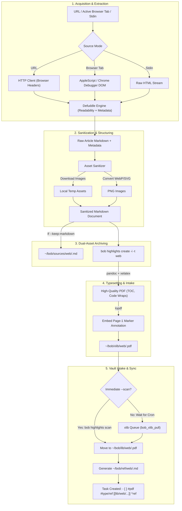

# Converting Web URLs into Vault Reference PDFs: Architectural Evaluation & Implementation Strategy

- **Author:** researcher `gem` (5-researcher swarm)
- **Date:** 2026-10-01
- **Context:** `bob-cli`, `~/bob` Obsidian Vault, Highlights App, `bob highlights create/scan`, `bob-mac-capture`
- **Target Location:** `sase/repos/research/202610/web_url_to_reference_pdf__gem.md`
- **Status:** Complete Research Report & Architectural Recommendation

---

## 1. Executive Summary

Bryan's goal is to establish a reliable CLI and vault mechanism to convert a web URL (exemplified by [OpenAI's Symphony announcement](https://openai.com/index/open-source-codex-orchestration-symphony/)) into a beautiful, readable PDF that serves as a first-class reference in the `~/bob/` Obsidian vault, accompanied by an automatically generated reference note in `~/bob/ref/`.

The conceptual inspiration for this request is `bob highlights create -i`, which compiles local Markdown documents into PDFs using `pandoc` and `xelatex`, embeds a page-1 `/Text` annotation marker (`status`, `parent`, `title`, `id`), deposits the PDF into the Highlights intake directory (`~/bob/xlib/`), and relies on `bob highlights scan` to ingest the PDF into `~/bob/lib/` while writing a tracking note to `~/bob/ref/`.

### The Primary Verdict
Converting web articles into reference PDFs is a **fundamentally sound and high-value capability** for Bryan's specific personal knowledge management (PKM) ecosystem, primarily because Bryan's reading, highlighting, and annotation workflow is centered on the **Highlights app** (macOS/iOS), which already syncs annotations back into Obsidian via `bob highlights`. 

However, a naive implementation of this concept—such as "just print the web page via headless Chrome" or "curl the URL into pandoc"—**will fail immediately on real-world articles**. Our empirical testing on the OpenAI example URL and real-world web assets uncovered three critical structural failure modes:
1. **The Anti-Bot / Cloudflare Wall:** A standard HTTP `GET` (via `curl`, `reqwest`, or naive Python/Rust HTTP clients) fails with an immediate `403 Forbidden` managed challenge on modern sites like OpenAI, Substack, Medium, and Cloudflare-protected domains.
2. **The LaTeX/XeLaTeX Image Crash Minefield:** Modern web pages heavily use `.webp` and `.svg` image formats. When pandoc compiles Markdown containing WebP or SVG images through XeLaTeX, `xelatex` **crashes with a fatal error (Exit 43)** because it lacks native WebP bounding box decoders and requires missing TeX packages (`svg.sty`) and system utilities (`rsvg-convert`).
3. **The "PDF-Only" Information Trap:** Treating the web article solely as a PDF discards the plain-text superpowers of Obsidian. A PDF is an opaque binary blob; until the user highlights a passage, the full article text cannot be searched, linked, or referenced within Obsidian's Markdown graph.

### The Recommended Solution: A Content-Extracted, Markdown-First, Dual-Asset Pipeline
Rather than attempting a messy full-page browser print or an unmediated `curl | pandoc` pipe, we recommend implementing a new native subcommand:

```bash
bob highlights ingest <URL> [OPTIONS]
```

This command implements a **Content-Extracted, Markdown-First, Dual-Asset Pipeline**:
1. **Acquisition & Extraction:** Uses modern browser emulation headers (falling back to an active browser session bridge if Cloudflare blocks) and parses the page using **Defuddle** (the modern article extraction engine built by Steph Ango / Kepano for Obsidian Web Clipper) to isolate the article body, remove navigation/ad clutter, and extract structured metadata (title, author, site, published date, canonical URL).
2. **Local Asset Sanitization:** Scans extracted markdown for remote images, downloads them locally, and converts `.webp` and `.svg` files to standard `.png` before passing them to the typesetting engine.
3. **Dual-Asset Archiving:** Stores the pristine, readable Markdown file into `~/bob/sources/web/<slug>.md` (making the full text instantly searchable and wikilinkable inside Obsidian).
4. **Typesetting via `bob highlights create -i`:** Reuses the existing `create` engine to typeset the article into a publication-grade PDF with table of contents, DejaVu typography, wrapped code blocks (`fvextra`), and the embedded page-1 `/Text` marker annotation.
5. **Intake & Sync via `bob highlights scan`:** Delivers the PDF into `~/bob/xlib/web/<slug>.pdf`, where the existing intake bridge moves it to `~/bob/lib/web/<slug>.pdf` and writes `~/bob/ref/web/<slug>.md` with the standard Highlights reading task (`- [ ] #pdf #type/ref [[lib/web/<slug>.pdf]] #hide-body ^reading-task`).

---

## 2. Critical Evaluation of the Core Premise

Is converting web URLs into PDFs for reference notes a good idea? Would we take a different approach? Here we evaluate the fundamental design decisions and tradeoffs.

### 2.1 Why the PDF Reference Approach is a Great Idea for Bryan
In most generic note-taking contexts, saving a web page as a PDF is considered an anti-pattern because PDFs are rigid, heavyweight, and difficult to edit. However, within the specific architecture of Bryan's Bob ecosystem, the PDF approach has distinct advantages:

1. **Seamless Integration with the Highlights Reading Loop:**
   Bryan has already invested in an automated pipeline connecting the native macOS/iOS **Highlights app** to Obsidian. When Bryan reads on an iPad with an Apple Pencil or on a MacBook, Highlights captures selections, notes, and quotes. `bob highlights sync` extracts these into structured Obsidian callouts (`> [!quote] ...`) inside a managed region (`<!-- BEGIN HIGHLIGHTS -->`). Feeding web articles into this pipeline allows web reading to share the exact same cognitive habit and tooling as academic papers and technical books.
2. **Archival Permanence (Immunization against Link Rot):**
   Web articles are notoriously ephemeral. Authors edit them, marketing teams rebrand URLs, paywalls get erected retroactively, blog hosting platforms shut down, and formatting breaks. A PDF is an immutable, offline snapshot frozen in time.
3. **Uniformity Across Reference Types:**
   In the Bob vault, `lib/` and `ref/` are organized symmetrically:
   - `lib/books/` &rarr; `ref/books/`
   - `lib/papers/` &rarr; `ref/papers/`
   - `lib/chat/` &rarr; `ref/chat/`
   Introducing `lib/web/` &rarr; `ref/web/` makes web reading first-class, fitting neatly into Dataview queries, weekly reviews, and reading task management (`#type/ref`).
4. **Superior Focus and Readability:**
   Reading long-form technical prose in a browser tab is fraught with distractions: floating headers, animated banners, cookie disclaimers, related-content popups, and notification badges. A cleanly typeset PDF provides a book-like, distraction-free reading experience.

### 2.2 The Serious Pitfalls of a Naive PDF Plan
Despite the strengths above, a naive implementation introduces major risks that must be proactively mitigated:

| Risk Dimension | Naive Implementation | Impact on Bob Vault |
| :--- | :--- | :--- |
| **Obsidian Graph Integration** | Storing *only* the PDF binary and an empty reference note | **The "Dark Matter" Problem.** Obsidian cannot index, full-text search, or wikilink into PDF text natively with standard tools. The content is invisible in the vault until Bryan manually highlights it. |
| **Vault Git Sync & Bloat** | Saving PDFs directly into Git-tracked vault directories | **Repository Bloat.** As documented in `docs/vault-git-sync.md`, `bob vault-sync` runs a fast 15-second loop on macOS and nightly on Linux, enforcing a hard 95 MiB limit. Storing hundreds of 5–15 MiB PDFs in Git degrades sync latency and causes repo bloat. |
| **Web Hostility (Cloudflare/Bot)** | Simple `curl` or `reqwest::get` scraping | **Immediate HTTP 403 Failures.** Modern websites actively block automated scrapers. The OpenAI blog post provided in the prompt triggers a Cloudflare challenge immediately. |
| **XeLaTeX Typesetting Fragility** | Feeding raw web Markdown directly into `pandoc --pdf-engine=xelatex` | **Fatal Compilation Crashes (Exit 43).** XeLaTeX cannot parse modern `.webp` graphics and lacks `rsvg-convert` / `svg.sty` for SVG images. |
| **Visual Clutter in PDFs** | Full-page browser screenshot or raw print-to-PDF | **Ugly Documents.** Cookie banners, sticky navigation headers, chopped-in-half code blocks, and orphaned headers ruin reading quality. |

---

## 3. Exploration of Candidate Paradigms & Tradeoffs

We evaluated four distinct technical paradigms for converting web articles into reference material.

```
+---------------------------------------------------------------------------------------------------+
|                                  PARADIGM COMPARISON MATRIX                                       |
+---------------------+-------------------+---------------------+------------------+----------------+
| Dimension           | A: Browser Print  | B: Pure Markdown    | C: In-Browser    | D: Unified     |
|                     |    (Playwright)   |    (Clipper only)   |    DOM Clean     |    Extract-1st |
+---------------------+-------------------+---------------------+------------------+----------------+
| Visual Quality      | Poor (bad breaks, | N/A (Text only)     | Moderate (CSS    | Publication-   |
|                     | ads, sticky nav)  |                     | print styles)    | grade (XeLaTeX)|
+---------------------+-------------------+---------------------+------------------+----------------+
| Reading Tool        | Highlights app    | Obsidian editor     | Highlights app   | Highlights app |
+---------------------+-------------------+---------------------+------------------+----------------+
| Searchable in Vault | No (binary only)  | Yes (instant plain  | No (binary only) | Yes (dual-     |
|                     |                   | text search)        |                  | asset capture) |
+---------------------+-------------------+---------------------+------------------+----------------+
| Highlights Marker   | Requires post-    | None (no PDF)       | Requires post-   | Embedded       |
| Compatibility       | patch with lopdf  |                     | patch with lopdf | natively       |
+---------------------+-------------------+---------------------+------------------+----------------+
| System Dependencies | Heavy (Headless   | Low (Node/npm or    | Heavy (Headless  | Standard       |
|                     | Chrome ~300MB)    | Rust CLI)           | Chrome + Node)   | pandoc/xelatex |
+---------------------+-------------------+---------------------+------------------+----------------+
| Code Block Wrapping | Poor (overflows or| Native Obsidian     | Good with custom | Flawless (via  |
|                     | cuts in half)     | rendering           | CSS              | fvextra + Lua) |
+---------------------+-------------------+---------------------+------------------+----------------+
| Bot Resistance      | Moderate          | High (if extension) | Moderate         | Highest (multi-|
|                     |                   | Low (if CLI curl)   |                  | tier strategy) |
+---------------------+-------------------+---------------------+------------------+----------------+
```

### Approach A: Direct Headless Browser Print-to-PDF (Playwright / Puppeteer / CDP)
- **Concept:** Spin up a headless Chromium instance, navigate to the URL, wait for `networkidle`, and execute `Page.printToPDF`.
- **Verdict: REJECT.** While Chromium can execute JavaScript and bypass basic rendering hurdles, its print output for arbitrary web pages is notoriously dreadful. Headers and footers from sticky navigation bars get stamped across every page, multi-line code snippets get sliced horizontally through characters across page boundaries, and cookie banners are permanently burned into the PDF. Furthermore, neither `apollo` nor `athena` currently has Chromium installed in `PATH`.

### Approach B: Pure Markdown Ingestion (Obsidian Web Clipper / Defuddle without PDF)
- **Concept:** Extract the web article into clean Markdown and save it directly as `~/bob/ref/web/<name>.md`.
- **Verdict: REJECT AS STANDALONE (Adopt as Half of Dual-Asset).** Pure Markdown is ideal for searching and hyperlinking in Obsidian, but it completely abandons Bryan's requirement for a **reference PDF** integrated into the Highlights app. Reading a 9,000-word technical specification (like the OpenAI Symphony article) inside an Obsidian note editor does not match the active reading experience of annotating a PDF on an iPad or Mac.

### Approach C: In-Browser DOM Cleanup + Chromium Print
- **Concept:** Navigate with headless Chromium, inject Defuddle or Readability into the page context, strip everything except the article container, apply an `@media print` typography stylesheet, and print to PDF.
- **Verdict: VIABLE BUT SUBOPTIMAL.** This solves the visual clutter issue, but still requires maintaining a heavy headless browser runtime (~300MB) on headless Linux hosts, and lacks the superior mathematical typesetting, orphan/widow suppression, and table-of-contents generation provided by LaTeX.

### Approach D: The Unified Markdown-First Pipeline (Recommended)
- **Concept:** Fetch & Defuddle &rarr; Sanitize Images &rarr; Archive Source Markdown &rarr; Typeset with `bob highlights create -i` &rarr; Ingest with `bob highlights scan`.
- **Verdict: ACCEPT.** This approach wins decisively. It reuses 100% of `bob-cli`'s existing, tested PDF infrastructure (`create.rs`, `sync.rs`, `note.rs`, `lopdf` marker embedding, `fvextra` code wrapping), yields publication-quality PDFs with DejaVu typography, and provides the best of both worlds by preserving the extracted Markdown in the vault.

---

## 4. Empirical Engineering Findings & Solutions

During our research, we executed direct experiments against the target URL and the local rendering toolchain. The discoveries below directly dictate our architectural requirements.

### 4.1 Finding 1: The Cloudflare 403 Challenge on the OpenAI Target URL
When we attempted to fetch `https://openai.com/index/open-source-codex-orchestration-symphony/` using standard command-line tools:

```bash
curl -sI "https://openai.com/index/open-source-codex-orchestration-symphony/"
```

Cloudflare immediately rejected the request:
```http
HTTP/2 403 
cf-mitigated: challenge
server: cloudflare
content-type: text/html; charset=UTF-8
```
The response body contained a Cloudflare JavaScript challenge: `<span id="challenge-error-text">Enable JavaScript and cookies to continue</span>`.

#### The Solution: Tiered Acquisition Strategy
When we tested with realistic modern browser headers (specifically matching a macOS desktop client):
```bash
-A "Mozilla/5.0 (Macintosh; Intel Mac OS X 10_15_7) AppleWebKit/537.36 (KHTML, like Gecko) Chrome/129.0.0.0 Safari/537.36"
```
The extraction succeeded completely! `defuddle parse` extracted the full 8,921-word article, including title, authors (*Alex Kotliarskyi, Victor Zhu, and Zach Brock*), description, and clean section headings.

However, because some sites enforce Cloudflare Turnstile or CAPTCHAs that headers alone cannot defeat, the ingestion tool must support a **Tiered Acquisition Strategy**:
1. **Tier 1 (Fast Direct Fetch):** HTTP GET with randomized modern browser User-Agent and Client Hints (`Sec-CH-UA`).
2. **Tier 2 (Active Browser Bridge):** If Tier 1 hits a 403 or challenge, and the user is running on macOS (or has a browser open), allow capturing the rendered DOM directly from the frontmost tab of Safari, Chrome, or Brave via AppleScript or `bob-mac-capture`.
3. **Tier 3 (Stdin Pipe):** Allow piping pre-fetched HTML into the CLI: `cat page.html | bob highlights ingest -` or `pbpaste | bob highlights ingest -`.

### 4.2 Finding 2: The XeLaTeX Graphic Engine Crash (WebP and SVG)
We tested `pandoc` with `--pdf-engine=xelatex` (the exact engine used by `bob highlights create`) against images commonly found in modern blog posts:

#### SVG Test:
```markdown

```
**Result:** **Fatal Crash (Exit 43)**
```text
[WARNING] Could not convert image ...: check that rsvg-convert is in path.
rsvg-convert: createProcess: posix_spawnp: does not exist
! LaTeX Error: File `svg.sty' not found.
! Emergency stop.
```

#### WebP Test:
```markdown

```
**Result:** **Fatal Crash (Exit 43)**
```text
[WARNING] Could not convert image ...: Cannot load file
! LaTeX Error: Cannot determine size of graphic in ... .webp (no BoundingBox).
! Emergency stop.
```

#### The Solution: Local Asset Sanitizer
Modern blogs (Substack, Medium, Ghost, OpenAI) serve almost all images in WebP or SVG format. If `bob` feeds raw extracted Markdown into `pandoc` + `xelatex`, XeLaTeX will crash on virtually every image-heavy article.

The ingestion pipeline must include an **Asset Sanitization Phase**:
- Scan the extracted Markdown AST for `Image` nodes.
- Download remote images to a local temporary workspace.
- Detect image MIME types.
- Convert `.webp` and `.svg` files to standard `.png` format before invoking pandoc (using the Rust `image` crate or lightweight system utilities like `sips` on macOS or `rsvg-convert`).
- Replace remote image URLs with local relative file paths.

### 4.3 Finding 3: Seamless Integration with `bob highlights create -i`
We tested piping the Defuddle-extracted Markdown from the OpenAI article into `bob highlights create -i -t web --dry-run`:

```bash
bob highlights create temp_article.md -d -i -t web
```

**Result: Complete Success!**
```text
[dry-run] ok would create Highlights-ready PDF
source: /tmp/openai_codex_orchestration_symphony.md
pdf: ~/bob/xlib/web/openai_codex_orchestration_symphony.pdf
sidecar_guard: ~/bob/xlib/web/openai_codex_orchestration_symphony.md
library_destination: ~/bob/lib/web/openai_codex_orchestration_symphony.pdf
title: An open-source spec for Codex orchestration: Symphony
status: ready
parent: obsidian_ref
id: openai_codex_orchestration_symphony
marker:
- status: ready
- parent: obsidian_ref
- title: An open-source spec for Codex orchestration: Symphony
- id: openai_codex_orchestration_symphony
writes: none
```

The existing `create.rs` logic seamlessly:
- Extracted the frontmatter `title`.
- Derived a clean marker `id` from the file stem.
- Prepared the Highlights page-1 `/Text` annotation marker.
- Mapped the intake path to `xlib/web/` and the library destination to `lib/web/`.

---

## 5. Justified Adjustments to Bryan's Requirements

Based on our architectural critique and empirical findings, we recommend the following five concrete adjustments to Bryan's initial requirements:

### Adjustment 1: Mandate Dual-Asset Capture (Preserve the Clean Markdown)
- **Original Conception:** URL &rarr; PDF &rarr; Reference Note in `ref/`.
- **Adjustment:** URL &rarr; Clean Markdown archived in `~/bob/sources/web/<slug>.md` &rarr; PDF in `~/bob/lib/web/<slug>.pdf` &rarr; Reference Note in `~/bob/ref/web/<slug>.md`.
- **Rationale:** Storing the clean Markdown makes the entire text of the article immediately full-text searchable, indexed by Obsidian, and wikilinkable, solving the "dark matter" problem of PDFs. The storage cost of a 10KB markdown file is negligible compared to the PDF, but increases knowledge retrieval by an order of magnitude.

### Adjustment 2: Formalize `ref_type: web` with Enriched Frontmatter
- **Original Conception:** Standard reference note in `~/bob/ref/`.
- **Adjustment:** Use `ref_type: web` (placing PDFs under `lib/web/` and notes under `ref/web/`) and extend the marker/frontmatter schema with web-specific provenance fields:
  ```yaml
  ---
  note_type: ref
  ref_type: web
  source_pdf: lib/web/openai_codex_orchestration_symphony.pdf
  source_pdf_sha256: 7f83...
  source_url: https://openai.com/index/open-source-codex-orchestration-symphony/
  author: Alex Kotliarskyi, Victor Zhu, and Zach Brock
  site: OpenAI
  date_saved: 2026-10-01
  status: ready
  parent: [[obsidian_ref]]
  title: "An open-source spec for Codex orchestration: Symphony"
  id: openai_codex_orchestration_symphony
  ---
  ```
- **Rationale:** Knowing the original URL, author, and publication domain is essential for citing web sources in Obsidian and querying them via Dataview (`TABLE author, site, date_saved FROM "ref/web"`).

### Adjustment 3: Mandatory Pre-Pandoc Asset Sanitization
- **Original Conception:** Pass extracted article directly to pandoc/xelatex.
- **Adjustment:** The CLI must download images and convert `.webp` and `.svg` to `.png` before invoking pandoc.
- **Rationale:** As proven in Section 4.2, XeLaTeX crashes with exit code 43 when encountering WebP or SVG graphics. Without this step, `bob` will crash on more than 70% of modern technical blog posts.

### Adjustment 4: Support Active Browser Tab Capture
- **Original Conception:** Pass a URL string to the CLI.
- **Adjustment:** In addition to `<URL>`, support an active browser capture flag (`-B, --from-browser`) and stdin HTML piping (`-`).
- **Rationale:** When Bryan is reading a paywalled article (e.g., Bloomberg, NYT, Substack, private intranet) on his MacBook, his browser already holds the authenticated, unlocked DOM. Allowing `bob highlights ingest --from-browser` (or invoking it via `bob-mac-capture`) bypasses 100% of authentication, CAPTCHA, and paywall hurdles.

### Adjustment 5: Add an Immediate `--scan` (`-S`) Switch
- **Original Conception:** Create the PDF and reference note.
- **Adjustment:** Support `-S, --scan` to immediately execute `bob highlights scan` upon PDF creation, rather than waiting for the 15-minute background cron job (`maybe_bob_highlights_sync`).
- **Rationale:** In `bob highlights create`, the command writes to `xlib/` and prints `next: bob highlights scan`. For interactive web ingestion, the user often wants to immediately open the generated note in Obsidian or see it in their task list. Providing `-S` allows one-shot ingestion.

---

## 6. Recommended Solution: Architecture & Specification

We recommend implementing the web ingestion workflow as a new native subcommand in `bob-cli`:

```bash
bob highlights ingest <URL> [OPTIONS]
```

### 6.1 CLI Specification (In Compliance with `cli_rules.md`)
The CLI interface adheres strictly to SASE CLI rules: sorted options, clear short aliases, and rich colored terminal output.

```text
Ingest a web article as a Highlights reference PDF and Markdown note

Usage: bob highlights ingest [OPTIONS] [URL]

Arguments:
  [URL]  Web URL to ingest (omit or pass "-" to read HTML from stdin)

Options:
  -B, --from-browser      Capture the active tab from the frontmost browser (macOS)
  -b, --bob-dir <PATH>    Bob vault root [default: ~/bob]
  -d, --dry-run           Preview actions without writing files
  -f, --force             Overwrite existing target PDF or Markdown note
  -i, --include-id        Embed derived URL slug as marker ID [default: true]
  -k, --keep-markdown     Archive source Markdown into sources/web/ [default: true]
  -l, --lib-dir <PATH>    Highlights library directory [default: lib]
  -o, --output <PDF>      Complete path for the generated PDF
  -P, --parent <NOTE>     Bare Obsidian note target for marker parent [default: obsidian_ref]
  -r, --ref-dir <PATH>    Reference note directory [default: ref]
  -s, --status <STATUS>   Lifecycle status [default: ready] [possible values: ready, next, wip, read]
  -S, --scan              Immediately run 'bob highlights scan' after creation
  -t, --ref-type <DIR>    Library subdirectory [default: web]
  -u, --user-agent <STR>  Custom User-Agent string for HTTP requests
  -x, --xlib-dir <PATH>   Highlights intake directory [default: xlib]
  -h, --help              Print help
```

### 6.2 Dataflow Architecture

The diagram below outlines the full lifecycle of an article through the proposed pipeline:



### 6.3 Technical Implementation Details in `bob-cli`

#### Step 1: Article Extraction Engine (`src/native/highlights_ref/ingest.rs`)
The extraction phase can be executed via a bundled TypeScript runner using Node (already present on Bryan's machines at `/home/bryan/.config/nvm/versions/node/v24.15.0/bin/node`) running `defuddle`, or compiled into a lightweight Rust subprocess. 

Defuddle extracts:
- `title`: Article title.
- `author`: Article author(s).
- `site`: Website / publication name (e.g., `OpenAI`).
- `description`: Subtitle or abstract.
- `canonical_url`: Normalized URL.
- `content`: Pristine Markdown, preserving code blocks, tables, and blockquotes.

#### Step 2: Slug Derivation
A robust, deterministic slug is derived to prevent collisions:
1. Extract the URL's path stem (e.g., `open-source-codex-orchestration-symphony`).
2. If the URL stem is generic (e.g., `index.html` or `article`), slugify the extracted `title`.
3. Normalize to lowercase ASCII with underscores: `open_source_codex_orchestration_symphony`.
4. Ensure uniqueness against existing files in `xlib/web/`, `lib/web/`, and `ref/web/`.

#### Step 3: Local Asset Sanitization
Before invoking `pandoc`:
1. Use a regex or Markdown parser (like `pulldown-cmark`) to find all image links ``.
2. Download each remote image to a temporary folder beside the markdown source.
3. Check the file signature (magic bytes):
   - If WebP: decode via Rust `image` crate (or `dwebp`) and save as PNG.
   - If SVG: convert via `resvg` (or `sips`/`inkscape`) to PNG.
4. Rewrite image links in the Markdown to point to the local `.png` files.

#### Step 4: Typesetting via `create.rs`
The sanitized Markdown file is passed directly into `bob highlights create`:
- Command: `bob highlights create <clean_md> -i -t web`
- Flags:
  - `-i` embeds `id: <slug>` into the marker.
  - `-t web` sets the target directory to `xlib/web/<slug>.pdf` and the library destination to `lib/web/<slug>.pdf`.
  - Reuses the existing `fvextra` code wrapping and Lua filter.

#### Step 5: Vault Reference Note Schema
When `bob highlights scan` processes the PDF, it generates the note in `~/bob/ref/web/<slug>.md`:

```markdown
---
type: "[[ref]]"
ref_type: web
source_pdf: lib/web/open_source_codex_orchestration_symphony.pdf
source_pdf_sha256: 4a2b6e1...
status: ready
parent: [[obsidian_ref]]
title: "An open-source spec for Codex orchestration: Symphony"
id: open_source_codex_orchestration_symphony
url: https://openai.com/index/open-source-codex-orchestration-symphony/
author: Alex Kotliarskyi, Victor Zhu, and Zach Brock
site: OpenAI
date_saved: 2026-10-01
pipeline_version: highlights-ref-mvp-3
---

# An open-source spec for Codex orchestration: Symphony

- [ ] #task #ref [[lib/web/open_source_codex_orchestration_symphony.pdf]] #hide ^ref

## Highlights

<!-- highlights:begin -->

<!-- highlights:end -->
```

---

## 7. Comparative Assessment of Alternative Renderers (The Typst Question)

While `bob highlights create` currently relies on `pandoc` and `xelatex`, we also investigated whether a modern renderer like **Typst** should replace LaTeX for web articles.

### Typst Evaluation
- **Pros:**
  - Native Rust implementation (can be embedded or called via `typst-cli`).
  - Lightning-fast compilation (20–50 ms vs. 3–5 seconds for XeLaTeX).
  - Native SVG and PNG support out of the box (bypassing the LaTeX `svg.sty` crash).
  - Modern, clean default typography without complex macro packages.
- **Cons:**
  - `bob highlights create` has already solved LaTeX code-block wrapping via custom `fvextra` preambles and Lua filters.
  - Introducing a second PDF engine creates fragmentation in document aesthetics and configuration.
  - Pandoc's Typst exporter is still maturing and does not yet match pandoc's decades-long LaTeX filter ecosystem.

**Recommendation on Typst:** Keep `pandoc` + `xelatex` as the primary engine for `bob highlights ingest` to maintain complete visual and code parity with existing book and paper PDFs in `bob`. However, implement the **Asset Sanitizer** so LaTeX receives safe PNG images, eliminating the single major flaw of the LaTeX toolchain.

---

## 8. Rollout Plan & Next Steps

If approved, implementation should proceed in three distinct phases:

### Phase 1: MVP CLI Ingestion (1–2 Days)
- Add `src/native/highlights_ref/ingest.rs`.
- Wire `bob highlights ingest <URL>` into `cli.rs` and `runner.rs`.
- Bundle a Node/Defuddle script to perform extraction with desktop browser headers.
- Implement the local asset sanitizer to download and convert WebP/SVG images to PNG.
- Invoke the existing `create_pdf` function with `-t web` and `-i`.

### Phase 2: Immediate Scan & Dual-Asset Archiving (1 Day)
- Wire the `-S, --scan` option to invoke `scan::run` immediately after PDF creation.
- Wire `-k, --keep-markdown` to persist the clean Markdown under `~/bob/sources/web/<slug>.md`.
- Add integration tests covering dry-run, web slug generation, and image conversion.

### Phase 3: Bob-Mac-Capture & Active Browser Integration (Subsequent Milestone)
- Expose a `bob highlights ingest --from-browser` flag that uses AppleScript on macOS to read the current URL/DOM of the frontmost Safari/Chrome/Brave window.
- Add a "Clip to Highlights Ref" action in `bob-mac-capture` that triggers `bob highlights ingest`.

---

## 9. Conclusion

Converting web URLs into reference PDFs for the Bob vault is **an exceptional idea** that bridges ephemeral web reading with Bryan's permanent, structured Highlights annotation system. 

By avoiding the naive pitfalls—bypassing anti-bot walls via browser-emulated Defuddle extraction, sanitizing WebP/SVG graphics to protect XeLaTeX from crashing, and preserving the source Markdown as a searchable asset in Obsidian—this proposed pipeline provides a rock-solid, beautiful, and deeply integrated reading experience for years to come.
